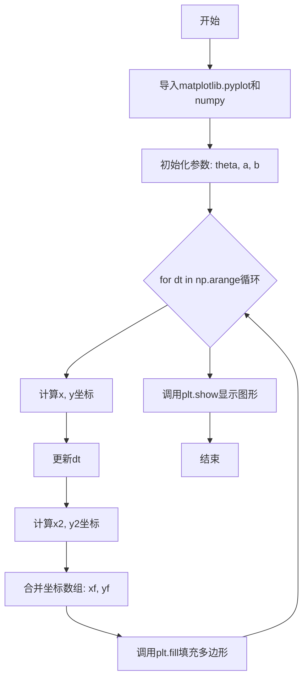
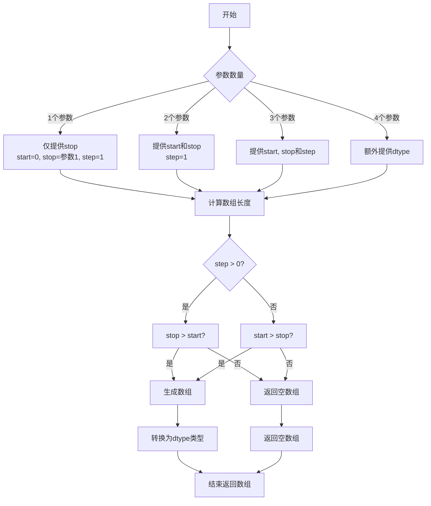
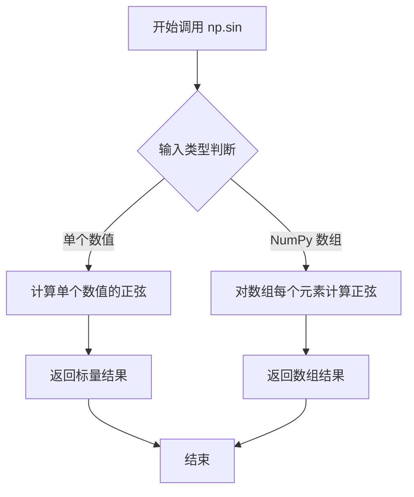
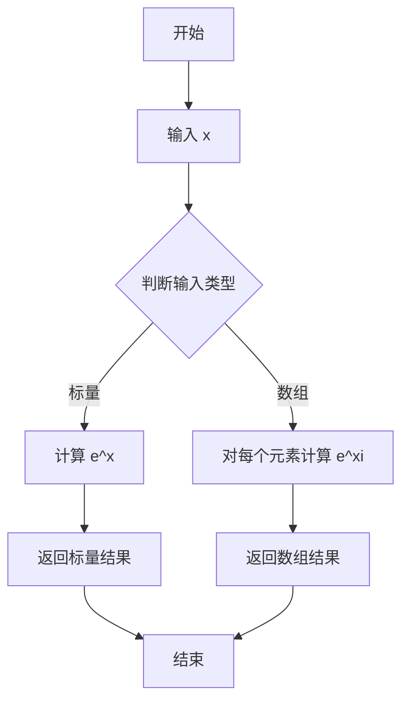
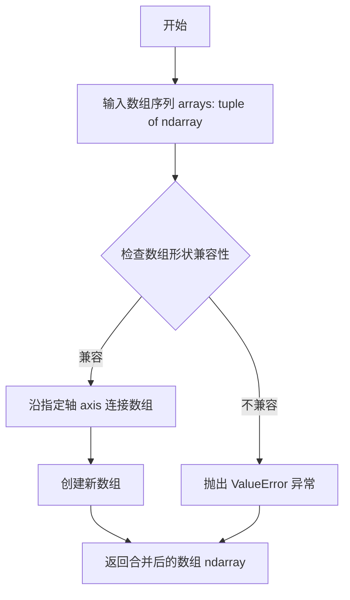
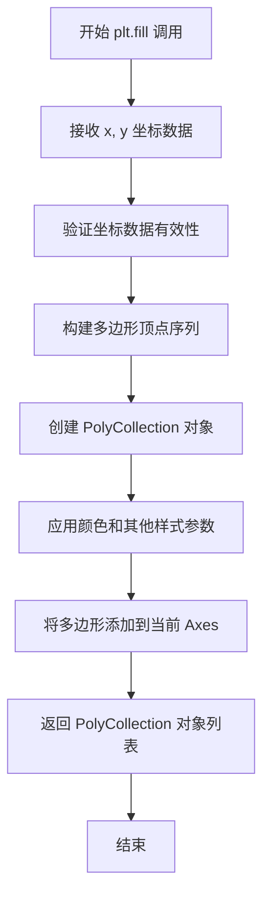
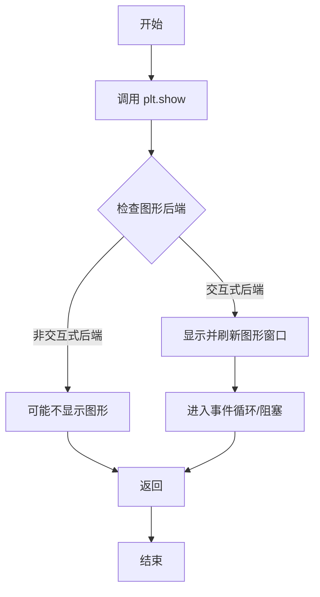

# `matplotlib\galleries\examples\misc\fill_spiral.py` 详细设计文档

该脚本使用matplotlib和numpy库生成一个填充的螺旋图案，通过计算螺旋线的坐标并使用plt.fill函数绘制填充的多边形，最终展示螺旋图形。

## 整体流程



## 类结构

```
脚本 (无类定义)
└── 全局作用域
```

## 全局变量及字段


### `theta`
    
角度数组，用于螺旋参数

类型：`numpy.ndarray`
    


### `a`
    
螺旋的幅度参数

类型：`float`
    


### `b`
    
螺旋的衰减参数

类型：`float`
    


### `dt`
    
螺旋的旋转角度偏移

类型：`float`
    


### `x`
    
螺旋的x坐标

类型：`numpy.ndarray`
    


### `y`
    
螺旋的y坐标

类型：`numpy.ndarray`
    


### `x2`
    
旋转后的螺旋x坐标

类型：`numpy.ndarray`
    


### `y2`
    
旋转后的螺旋y坐标

类型：`numpy.ndarray`
    


### `xf`
    
合并后的x坐标数组

类型：`numpy.ndarray`
    


### `yf`
    
合并后的y坐标数组

类型：`numpy.ndarray`
    


### `p1`
    
plt.fill返回的多边形补丁对象列表

类型：`list`
    


    

## 全局函数及方法


### `np.arange`

`np.arange` 是 NumPy 库中的一个函数，用于生成一个等差数组（arange 来自 "array range"），它在给定范围内以指定的步长生成一系列数值，常用于生成测试数据、坐标轴、循环迭代等场景。

参数：

- `start`：`数值类型`，起始值，默认为0。如果只提供一个参数，则表示stop
- `stop`：`数值类型`，结束值（不包含）
- `step`：`数值类型`，步长，默认为1
- `dtype`：`数据类型`，输出数组的数据类型，如果未指定则自动推断

返回值：`numpy.ndarray`，返回的是一个一维的等差数组

#### 流程图



#### 带注释源码

```python
# np.arange 函数的核心实现逻辑（简化版）

def arange(start=0, stop=None, step=1, dtype=None):
    """
    生成一个等差数组
    
    参数:
        start: 起始值，默认为0
        stop: 结束值（不包含）
        step: 步长，默认为1
        dtype: 输出数据类型
    """
    
    # 处理参数：如果只提供一个参数，那它是stop而不是start
    if stop is None:
        start, stop = 0, start
    
    # 计算数组长度：(stop - start) / step
    # 使用 ceil 向上取整，确保包含所有元素
    length = int(np.ceil((stop - start) / step)) if step != 0 else 0
    
    # 生成数组
    result = np.linspace(start, start + (length - 1) * step, length)
    
    # 如果提供了dtype，转换数据类型
    if dtype is not None:
        result = result.astype(dtype)
    
    return result

# 在代码中的实际使用示例：

# 第一次使用：生成角度 theta
# 从 0 到 8π，步长 0.1
theta = np.arange(0, 8*np.pi, 0.1)  
# 结果：[0.0, 0.1, 0.2, ..., 7.9π] 共约 251 个元素

# 第二次使用：循环迭代 dt
# 从 0 到 2π，步长 π/2（即 90 度）
for dt in np.arange(0, 2*np.pi, np.pi/2.0):
    # dt 分别为：0, π/2, π, 3π/2
    # 在每次循环中绘制螺旋图案
```

#### 关键组件信息

- **numpy 库**：Python 科学计算的核心库，提供了高效的数组和矩阵运算功能
- **plt 模块**：matplotlib 的 pyplot 子库，用于绑定和显示图形
- **螺旋线计算公式**：`x = a*cos(θ+dt)*exp(b*θ)` 和 `y = a*sin(θ+dt)*exp(b*θ)`，其中 a=1, b=0.2

#### 潜在的技术债务或优化空间

1. **魔法数字（Magic Numbers）**：代码中使用了 `np.pi`、`0.1`、`np.pi/2.0` 等硬编码数值，应该提取为常量并命名
2. **重复计算**：`theta` 在每次循环中没有变化，可以在循环外预计算一次
3. **变量名不够清晰**：`dt` 在循环体中被修改（`dt = dt + np.pi/4.0`），容易造成混淆，建议使用不同的变量名
4. **没有错误处理**：没有对输入参数的有效性进行检查
5. **缺少文档注释**：整个脚本只有模块级的简单标题注释，缺少函数和类的文档

#### 其它项目

**设计目标与约束**：
- 使用参数方程绘制螺旋图案
- 通过填充（fill）方法创建闭合的螺旋形状
- 目标是在极坐标系下生成类似"圆内螺线"的图案

**错误处理与异常设计**：
- 当前代码未包含任何错误处理机制
- 如果 `step` 为 0 会导致无限循环（虽然 numpy 实际会报错）
- 如果 `stop` 和 `start` 的关系与 `step` 方向不一致，会返回空数组

**数据流与状态机**：
- 主循环执行 4 次（0 到 2π，步长 π/2）
- 每次循环生成两个螺旋路径（原始和相位偏移后的）
- 使用 `np.concatenate` 合并路径，并使用 `[::-1]` 反转第二个数组来创建闭合回路
- `plt.fill()` 函数自动将最后一个点与第一个点连接，形成闭合多边形

**外部依赖与接口契约**：
- 依赖 `numpy` 库（数值计算）
- 依赖 `matplotlib.pyplot` 库（图形绑定）
- 这两个都是 Python 科学计算的标准库，在大多数环境中都可以直接使用


### `np.cos`

`np.cos` 是 NumPy 库中的三角函数，用于计算输入数组或标量中每个元素的余弦值（以弧度为单位）。该函数接受弧度制的角度输入，并返回对应角度的余弦结果，支持标量、数组等多种数据类型，是科学计算中常用的基础数学函数。

参数：

- `x`：`ndarray` 或 `scalar`，输入角度，单位为弧度。可以是任意形状的数组或单个数值。

返回值：`ndarray` 或 `scalar`，返回输入角度的余弦值，类型与输入类型相同。

#### 流程图


#### 带注释源码

```python
# np.cos 是 NumPy 库中的余弦函数
# 使用方式：np.cos(x)
# 参数 x: 输入角度，单位为弧度，可以是标量或数组
# 返回: 输入角度的余弦值

# 在本代码中的实际使用：
x = a*np.cos(theta + dt)*np.exp(b*theta)
# 其中：
#   theta: 角度数组 (0 到 8*pi)
#   dt: 相位偏移
#   a: 缩放因子 (值为1)
#   b: 增长因子 (值为0.2)
#   exp(b*theta): 指数增长项
# 最终计算: 螺旋线方程的参数化表达

x2 = a*np.cos(theta + dt)*np.exp(b*theta)
# 第二次调用，dt 已被修改为 dt + pi/4.0
```

---

### 整体运行流程

本代码实现了一个螺旋线图形的绘制：

1. **初始化参数**：设置角度范围 `theta = np.arange(0, 8*np.pi, 0.1)`，以及系数 `a = 1`（振幅）、`b = 0.2`（增长率）
2. **循环绘制**：遍历四个相位偏移（0, π/2, π, 3π/2），在每个相位下：
   - 计算第一组螺旋线坐标 `(x, y)`
   - 更新相位偏移 `dt`
   - 计算第二组螺旋线坐标 `(x2, y2)`
   - 合并坐标并填充多边形
3. **显示图形**：调用 `plt.show()` 渲染图像

---

### 关键组件信息

| 组件名称 | 描述 |
|---------|------|
| `np.cos` | 余弦函数，计算角度的余弦值 |
| `np.sin` | 正弦函数，计算角度的正弦值 |
| `np.exp` | 指数函数，计算 e 的指数次方 |
| `np.concatenate` | 数组拼接，将两个数组沿指定轴合并 |
| `plt.fill` | 填充多边形区域 |

---

### 潜在的技术债务或优化空间

1. **重复计算**：代码中 `np.cos(theta + dt)` 和 `np.sin(theta + dt)` 被重复计算，可以预先计算一次并复用
2. **魔法数字**：多处使用 `np.pi`、`np.pi/2` 等数字常量，建议定义为具名常量提高可读性
3. **循环效率**：使用 Python for 循环绘制图形效率较低，可考虑向量化操作或使用动画函数
4. **图形标签**：缺少标题、坐标轴标签等必要信息，图形可读性不足

---

### 其它项目

**设计目标**：绘制一个由四条螺旋线组成的填充图案，形成类似"方形螺旋"的视觉效果。

**约束条件**：
- 使用纯 Matplotlib 和 NumPy 实现
- 保持代码简洁，不引入额外依赖

**错误处理**：
- 未做错误处理，假设输入参数始终有效
- 若 `theta` 为空数组，可能导致图形绘制异常

**数据流**：
- `theta` → 计算中间变量 `(theta + dt)` → `np.cos`/`np.sin` → 坐标变换 → 图形渲染

**外部依赖**：
- `matplotlib.pyplot`：绘图库
- `numpy`：数值计算库


### `np.sin`

`np.sin` 是 NumPy 库中的数学函数，用于计算输入角度（弧度制）的正弦值。该函数接受数值或数组作为输入，返回对应角度的正弦结果。

参数：

- `x`：`ndarray` 或 `scalar`，输入角度（以弧度为单位），可以是单个数值或 NumPy 数组

返回值：`ndarray` 或 `scalar`，输入角度的正弦值，输出类型与输入类型相同

#### 流程图



#### 带注释源码

```python
# np.sin 函数的典型用法在代码中如下所示：

# 第一次使用：计算第一组角度的正弦值
y = a*np.sin(theta + dt)*np.exp(b*theta)
# 参数：theta + dt (ndarray) - 输入的角度数组（弧度制）
# 返回值：y (ndarray) - 对应角度的正弦值数组

# 第二次使用：计算第二组角度的正弦值（dt 已更新）
y2 = a*np.sin(theta + dt)*np.exp(b*theta)
# 参数：theta + dt (ndarray) - 输入的角度数组（弧度制）
# 返回值：y2 (ndarray) - 对应角度的正弦值数组

# 函数原型（NumPy 内部实现逻辑简化）
# def sin(x, /, out=None, *, where=True, casting='same_kind', order='K', dtype=None, subok=True):
#     """
#     参数:
#         x: 输入角度，单位为弧度
#         out: 可选的输出数组
#         where: 可选的布尔条件数组
#     返回:
#         正弦值，范围 [-1, 1]
#     """
```


### `numpy.exp`

计算指数值（e 的 x 次方），其中 e 是自然对数的底数（约等于 2.718281828）。

参数：

-  `x`：`ndarray` 或 `scalar`，输入数组或标量值，表示指数的幂

返回值：`ndarray`，返回 e 的 x 次方，输入为标量时返回标量，输入为数组时返回相同形状的数组

#### 流程图



#### 带注释源码

```python
# 计算指数值的函数调用示例
# 在本代码中，np.exp 被用于计算螺旋线的径向距离因子

# 参数说明：
# b = .2 是增长系数，控制螺旋线向外扩展的速度
# theta = np.arange(0, 8*np.pi, 0.1) 是角度数组，从 0 到 8π
# b*theta 是一个数组，表示每个角度对应的增长因子

# 调用 np.exp(b*theta) 会返回一个与 theta 形状相同的数组
# 该数组的每个元素是 e^(b*theta[i])

# 例如：e^(0.2 * 0.1) = e^0.02 ≈ 1.0202
#      e^(0.2 * 1.0) = e^0.2  ≈ 1.2214

# 实际使用：
x = a*np.cos(theta + dt)*np.exp(b*theta)  # 计算带有指数衰减/增长因子的 x 坐标
y = a*np.sin(theta + dt)*np.exp(b*theta)  # 计算带有指数衰减/增长因子的 y 坐标

# np.exp 函数内部实现大致相当于：
# def exp(x):
#     return np.e ** x  # 其中 e ≈ 2.718281828
```


### `np.concatenate`

合并两个或多个数组沿指定轴（默认是第一个轴），在代码中用于将两个一维数组（其中一个逆序）首尾相接形成螺旋线的坐标序列。

参数：

- `arrays`：`tuple of ndarray`，要合并的数组序列，代码中传入 `(x, x2[::-1])` 或 `(y, y2[::-1])`，其中 `x2[::-1]` 表示数组逆序。
- `axis`：`int`，可选，沿指定轴连接，代码中未指定，默认值为 0。
- `out`：`ndarray`，可选，用于放置结果的数组。
- `dtype`：`data-type`，可选，输出数组的数据类型。
- `casting`：`str`，可选，控制数据类型转换模式。

返回值：`ndarray`，合并后的数组，代码中返回合并后的坐标数组 `xf` 或 `yf`。

#### 流程图



#### 带注释源码

```python
# 导入 NumPy 库（代码中已隐式使用）
import numpy as np

# 示例：合并两个数组
# x 和 x2[::-1] 都是一维数组，x2[::-1] 表示逆序
xf = np.concatenate((x, x2[::-1]))  # 沿默认轴（第一个轴）合并，返回新数组
yf = np.concatenate((y, y2[::-1]))  # 同上，合并y坐标数组
# 注意：np.concatenate 不修改原数组，返回新的合并数组
```


### `plt.fill`

`plt.fill` 是 matplotlib 库中用于填充由 x 和 y 坐标定义的多边形区域的函数。它接受坐标数据并创建一个或多个填充的多边形，可用于绘制封闭区域的填充效果。

参数：

- `x`：`array-like`，表示多边形的 x 坐标值
- `y`：`array-like`，表示多边形的 y 坐标值
- `color`：`color 或 color sequence`，可选，设置填充颜色
- `label`：`string`，可选，用于图例的标签
- `**kwargs`：其他 matplotlib 支持的关键字参数（如 alpha 透明度、edgecolor 边框颜色等）

返回值：`list of PolyCollection`，返回填充的多边形集合对象，可用于进一步修改样式

#### 流程图



#### 带注释源码

```python
# plt.fill 函数核心逻辑模拟
def fill(x, y, color=None, label=None, **kwargs):
    """
    填充由坐标定义的多边形区域
    
    参数:
        x: array-like, 多边形的x坐标
        y: array-like, 多边形的y坐标  
        color: 填充颜色
        label: 图例标签
        **kwargs: 其他样式参数
    """
    # 1. 获取当前 Axes 对象
    ax = gca()
    
    # 2. 将坐标转换为 numpy 数组
    x = np.asanyarray(x)
    y = np.asanyarray(y)
    
    # 3. 验证坐标维度匹配
    if x.shape != y.shape:
        raise ValueError("x and y must be the same size")
    
    # 4. 关闭多边形（首尾相连形成封闭区域）
    # 如果需要闭合，将第一个点添加到末尾
    # 这里演示代码中的处理方式：
    # xf = np.concatenate((x, x2[::-1]))  # 反向追加形成闭环
    
    # 5. 创建多边形补丁对象
    xy = np.column_stack([x, y])  # 组合坐标
    
    # 6. 创建 PolyCollection 并设置样式
    polys = [Polygon(xy, closed=True)]
    collection = PolyCollection(polys, **kwargs)
    
    # 7. 设置颜色
    if color is not None:
        collection.set_facecolor(color)
    
    # 8. 设置标签
    if label is not None:
        collection.set_label(label)
    
    # 9. 添加到 Axes 并返回
    ax.add_collection(collection)
    return collection
```


### `plt.show`

描述：`plt.show()` 是 matplotlib 库中的函数，用于显示当前所有打开的图形窗口，并进入交互式模式。在交互式后端中，它会刷新图形并允许用户交互；在非交互式后端中，它可能不会显示任何内容，除非显式调用绘图函数。该函数通常在脚本末尾调用，以展示绘制的图形。

参数：该函数无任何参数。

返回值：`None`，无返回值。

#### 流程图



#### 带注释源码

```python
# 绘制螺旋并填充图形
# ... (之前的代码用于生成螺旋数据并填充图形)

# 调用 plt.show() 显示所有已创建的图形窗口
plt.show()  # 阻塞程序执行，直到用户关闭图形窗口
```


## 关键组件


### 螺旋参数定义

使用 numpy 定义极坐标参数，包括角度范围 theta = np.arange(0, 8*np.pi, 0.1)，以及螺旋常数 a = 1 和 b = 0.2，用于控制螺旋的初始半径和增长速率。

### 循环迭代控制

通过 np.arange(0, 2*np.pi, np.pi/2.0) 创建四个等间距的角度增量值（0, π/2, π, 3π/2），用于生成多层螺旋图案。

### 螺旋曲线计算

基于极坐标公式 x = a*cos(θ+dt)*exp(b*θ) 和 y = a*sin(θ+dt)*exp(b*θ) 计算螺旋线坐标，其中 exp(b*theta) 实现指数级增长。

### 角度偏移变换

在每次循环中对 dt 增加 π/4.0（45度），创建第二个旋转后的螺旋线，实现螺旋线之间的交织效果。

### 数组拼接与反转

使用 np.concatenate((x, x2[::-1])) 和 np.concatenate((y, y2[::-1])) 将两条螺旋线首尾相连，其中 [::-1] 实现数组反转以封闭填充区域。

### 多边形填充渲染

调用 plt.fill(xf, yf) 创建填充多边形，生成螺旋状的闭合图形区域。

### 图形显示输出

通过 plt.show() 调用 matplotlib 的渲染引擎显示最终的螺旋填充图案。


## 问题及建议


### 已知问题

-   **变量遮蔽（Shadowing）**：循环变量`dt`在循环体内被重新赋值（`dt = dt + np.pi/4.0`），导致循环迭代变量被修改，代码逻辑混乱且容易产生误解
-   **魔法数字（Magic Numbers）**：代码中包含多个硬编码数值（如`0.1`、`np.pi/2.0`、`np.pi/4.0`、`1`、`0.2`等），缺乏可读性和可维护性
-   **重复计算**：`np.exp(b*theta)`在每次循环中重复计算，且`theta`在循环外定义后未复用
-   **未使用变量**：`p1`变量接收`plt.fill()`的返回值但从未使用
-   **浮点精度问题**：`np.arange(0, 8*np.pi, 0.1)`使用浮点数步长可能导致步数不一致或边界不精确
-   **缺少图形元素**：未设置图形标题、坐标轴标签、图形尺寸等，影响可读性和展示效果
-   **无错误处理**：缺少对输入参数（如`a`、`b`）的校验，若传入非法值可能导致异常或图形异常

### 优化建议

-   将循环变量与内部计算使用的变量分离，使用不同的变量名（如`phase`）存储相位偏移
-   将硬编码数值提取为具名常量（如`THETA_STEP`、`PHASE_INCREMENT`等），提高可读性和可维护性
-   将`theta`和`exp(b*theta)`的计算移至循环外部，避免重复计算
-   删除未使用的`p1`变量，或保留用于后续图形操作
-   使用`np.linspace`代替`np.arange`以确保精确的采样点数
-   添加图形元数据：设置`plt.figure(figsize=...)`、`plt.title()`、`plt.xlabel()`、`plt.ylabel()`等
-   添加输入参数校验和异常处理机制，提高代码健壮性

## 其它


### 设计目标与约束

该代码的设计目标是使用matplotlib和numpy库绘制一个填充的螺旋图形，通过参数方程生成螺旋线，并使用plt.fill()方法填充闭合区域。代码运行在Python 3.x环境下，需要安装matplotlib和numpy依赖库。代码主要面向数据可视化场景，用于展示数学螺旋曲线的视觉效果。

### 错误处理与异常设计

代码中未包含显式的错误处理机制。潜在的异常包括：1) ImportError - 当matplotlib或numpy未安装时抛出；2) ValueError - 当np.arange参数导致空数组时可能发生；3) RuntimeWarning - 当计算指数函数溢出时产生。在实际应用中应添加异常捕获机制，特别是对np.exp(b*theta)可能产生的溢出警告进行处理。

### 数据流与状态机

代码的数据流较为简单：输入参数(a, b, theta范围) -> 参数方程计算(x, y坐标) -> 数据拼接与反转(xf, yf) -> matplotlib fill方法渲染。状态机方面，代码在一个for循环中迭代4个相位角度(dt从0到2π)，每个迭代生成两个螺旋线段并拼接填充，形成4个独立的填充区域。

### 外部依赖与接口契约

代码依赖两个外部库：1) matplotlib.pyplot - 用于图形绑制和显示，版本建议>=3.0；2) numpy - 用于数值计算和数组操作，版本建议>=1.16。plt.show()函数调用会阻塞程序直到用户关闭图形窗口，这是与外部环境的主要交互接口。

### 性能考虑

当前代码性能问题：1) 循环内重复计算np.cos和np.sin可以向量化优化；2) 每次迭代创建新数组而非复用内存；3) plt.fill()在循环中多次调用应合并为单次调用。建议使用numpy的广播机制一次性计算所有相位点的坐标，减少循环开销。

### 代码规范与风格

代码遵循PEP8基本规范，但存在改进空间：1) 缺少文档字符串对函数功能的说明；2) 魔法数字(如np.pi/2.0, np.pi/4.0)应定义为常量；3) 变量名(x, y, xf, yf等)语义不明确；4) 缺少类型注解。建议添加详细的docstring和类型提示提高可维护性。

### 配置参数说明

代码中的可配置参数包括：a=1 (螺旋幅度)、b=0.2 (螺旋增长率)、theta范围0到8π (螺旋圈数)、dt步长π/2 (填充区域数量)、额外相位偏移π/4。修改这些参数可以调整螺旋的密度、大小和填充效果。

### 使用示例与扩展性

代码可直接运行生成可视化图形。扩展方向包括：1) 将绘图逻辑封装为函数，接受a, b等参数；2) 支持动态调整视角(添加projection='3d')；3) 添加颜色映射和样式定制；4) 支持保存为图片文件(plt.savefig)。当前代码以交互式展示为主，缺少命令行参数支持。

    