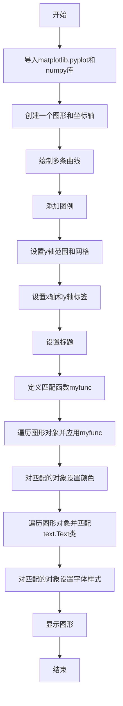
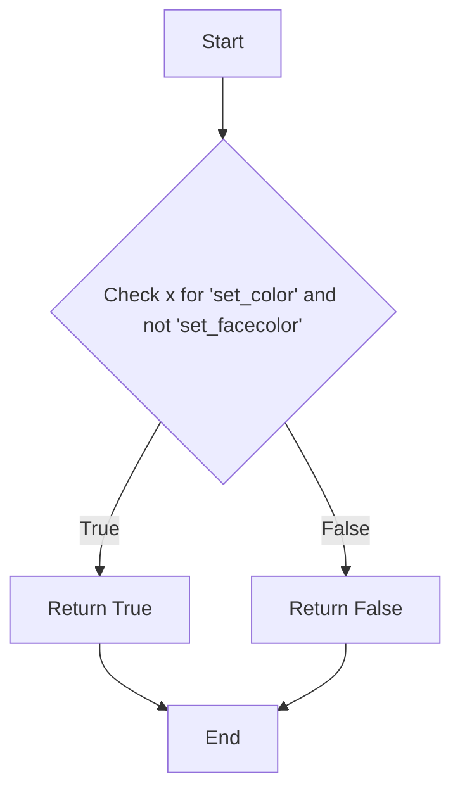
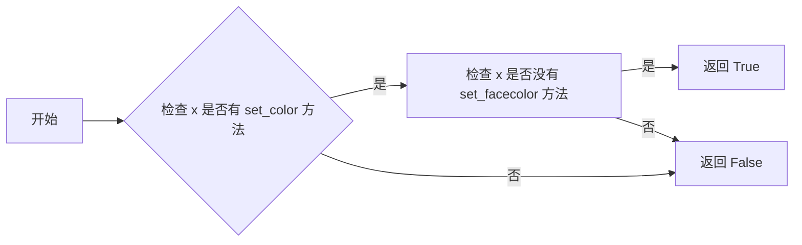
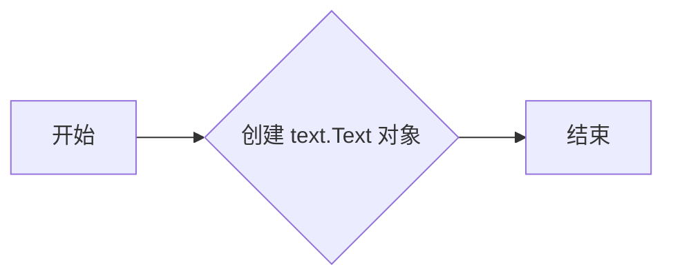
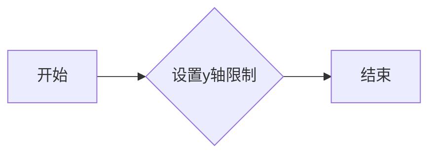
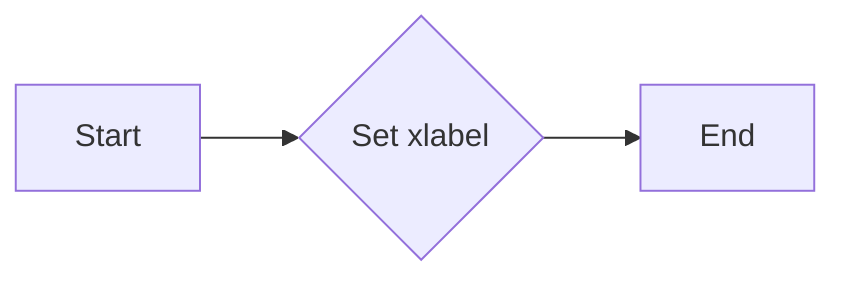
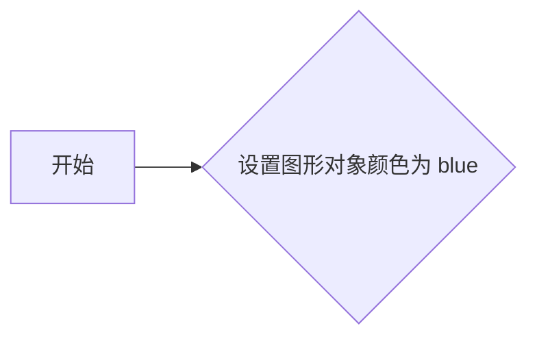
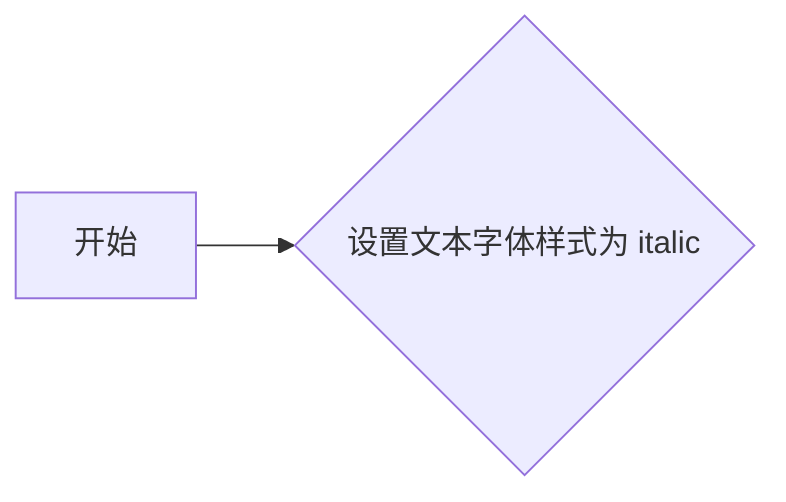

# `matplotlib\galleries\examples\misc\findobj_demo.py` 详细设计文档

This code demonstrates the use of the `findobj` method in matplotlib to recursively find and modify objects in a plot based on specified criteria.

## 整体流程



## 类结构

```
matplotlib.pyplot (matplotlib模块)
├── fig (图形对象)
│   ├── ax (坐标轴对象)
│   ├── a (数组)
│   ├── b (数组)
│   ├── c (数组)
│   ├── d (数组)
│   └── ...
└── text (matplotlib.text模块)
    └── Text (文本对象)
```

## 全局变量及字段


### `a`
    
Array of model complexities ranging from 0 to 3 with a step of 0.02.

类型：`numpy.ndarray`
    


### `b`
    
Array of data lengths ranging from 0 to 3 with a step of 0.02.

类型：`numpy.ndarray`
    


### `c`
    
Array of exponential values of 'a'.

类型：`numpy.ndarray`
    


### `d`
    
Array of reversed 'c'.

类型：`numpy.ndarray`
    


### `fig`
    
The main figure object created by 'subplots'.

类型：`matplotlib.figure.Figure`
    


### `ax`
    
The axes object on which the plot is drawn.

类型：`matplotlib.axes._subplots.AxesSubplot`
    


### `plt`
    
The matplotlib pyplot module.

类型：`matplotlib.pyplot`
    


### `np`
    
The numpy module.

类型：`numpy`
    


### `text`
    
The matplotlib.text module.

类型：`module`
    


### `matplotlib.pyplot.fig`
    
The main figure object created by 'subplots'.

类型：`matplotlib.figure.Figure`
    


### `matplotlib.pyplot.ax`
    
The axes object on which the plot is drawn.

类型：`matplotlib.axes._subplots.AxesSubplot`
    


### `matplotlib.pyplot.a`
    
Array of model complexities ranging from 0 to 3 with a step of 0.02.

类型：`numpy.ndarray`
    


### `matplotlib.pyplot.b`
    
Array of data lengths ranging from 0 to 3 with a step of 0.02.

类型：`numpy.ndarray`
    


### `matplotlib.pyplot.c`
    
Array of exponential values of 'a'.

类型：`numpy.ndarray`
    


### `matplotlib.pyplot.d`
    
Array of reversed 'c'.

类型：`numpy.ndarray`
    


### `matplotlib.text.Text`
    
The text object class for creating text annotations.

类型：`matplotlib.text.Text`
    
    

## 全局函数及方法


### myfunc

`myfunc` 是一个用于检查对象是否具有特定属性的方法。

参数：

- `x`：`object`，要检查的对象。该对象将被检查是否具有 `set_color` 方法，并且不具有 `set_facecolor` 方法。

返回值：`bool`，如果对象满足条件则返回 `True`，否则返回 `False`。

#### 流程图



#### 带注释源码

```
def myfunc(x):
    # Check if the object has the 'set_color' method and does not have the 'set_facecolor' method
    return hasattr(x, 'set_color') and not hasattr(x, 'set_facecolor')
``` 


### fig.findobj(myfunc)

该函数用于在matplotlib图形对象中递归查找所有匹配特定条件的对象。

参数：

- `myfunc`：`function`，一个函数，用于判断对象是否匹配条件。

返回值：`list`，包含所有匹配条件的对象列表。

#### 流程图

```mermaid
graph LR
A[开始] --> B{调用fig.findobj(myfunc)}
B --> C{返回匹配对象列表}
C --> D[结束]
```

#### 带注释源码

```python
# match on arbitrary function
def myfunc(x):
    return hasattr(x, 'set_color') and not hasattr(x, 'set_facecolor')

for o in fig.findobj(myfunc):
    o.set_color('blue')
```


### fig.findobj(text.Text)

该函数用于在matplotlib图形对象中递归查找所有匹配特定类实例的对象。

参数：

- 无

返回值：`list`，包含所有匹配条件的对象列表。

#### 流程图

```mermaid
graph LR
A[开始] --> B{调用fig.findobj(text.Text)}
B --> C{返回匹配对象列表}
C --> D[结束]
```

#### 带注释源码

```python
# match on class instances
for o in fig.findobj(text.Text):
    o.set_fontstyle('italic')
```


### myfunc

匹配任意对象，检查对象是否具有`set_color`方法且不具有`set_facecolor`方法。

参数：

- `x`：`any`，要检查的对象。

返回值：`bool`，如果对象匹配条件则返回`True`，否则返回`False`。

#### 流程图



#### 带注释源码

```python
# match on arbitrary function
def myfunc(x):
    # 检查 x 是否有 set_color 方法
    has_set_color = hasattr(x, 'set_color')
    # 检查 x 是否没有 set_facecolor 方法
    has_not_set_facecolor = not hasattr(x, 'set_facecolor')
    # 如果两个条件都满足，返回 True
    if has_set_color and has_not_set_facecolor:
        return True
    # 否则返回 False
    return False
```

### findobj

全局函数，用于在matplotlib图形中查找匹配特定条件的对象。

参数：

- `fig`：`matplotlib.figure.Figure`，要搜索的图形对象。
- `func`：`callable`，用于匹配对象的函数。

返回值：`list`，包含所有匹配对象的列表。

#### 流程图

```mermaid
graph LR
A[开始] --> B{调用 func(fig)}
B -->|返回匹配对象列表| C[结束]
```

#### 带注释源码

```python
# match on arbitrary function
for o in fig.findobj(myfunc):
    o.set_color('blue')
```

### text.Text

matplotlib中的文本类，用于在图形中添加文本。

参数：

- `x`：`float`，文本的x坐标。
- `y`：`float`，文本的y坐标。
- `s`：`str`，要显示的文本。
- `fontdict`：`dict`，文本的字体属性。
- `transform`：`matplotlib.transforms.Transform`，文本的变换。

返回值：`matplotlib.text.Text`，创建的文本对象。

#### 流程图



#### 带注释源码

```python
# match on class instances
for o in fig.findobj(text.Text):
    o.set_fontstyle('italic')
```


### `myfunc`

`myfunc` 函数用于检查一个对象是否具有 `set_color` 方法，并且不具有 `set_facecolor` 方法。

参数：

- `x`：`object`，要检查的对象。

返回值：`bool`，如果对象满足条件则返回 `True`，否则返回 `False`。

#### 流程图


#### 带注释源码

```python
def myfunc(x):
    # 检查 x 是否有 set_color 方法
    has_set_color = hasattr(x, 'set_color')
    # 检查 x 是否没有 set_facecolor 方法
    has_not_set_facecolor = not hasattr(x, 'set_facecolor')
    # 如果两个条件都满足，返回 True
    if has_set_color and has_not_set_facecolor:
        return True
    # 否则返回 False
    return False
```


### plt.ylim([-1, 20])

设置图表的y轴限制为[-1, 20]。

参数：

- 无

返回值：无

#### 流程图



#### 带注释源码

```
plt.ylim([-1, 20])
```


### `fig.findobj(myfunc)`

该函数用于在matplotlib图形对象中递归查找所有匹配特定函数`myfunc`的对象。

参数：

- `myfunc`：`function`，一个函数，用于判断matplotlib图形对象是否匹配条件。

返回值：`list`，包含所有匹配条件的matplotlib图形对象。

#### 流程图

```mermaid
graph LR
A[开始] --> B{调用fig.findobj(myfunc)}
B --> C{返回匹配对象列表}
C --> D[结束]
```

#### 带注释源码

```python
# match on arbitrary function
def myfunc(x):
    return hasattr(x, 'set_color') and not hasattr(x, 'set_facecolor')

for o in fig.findobj(myfunc):
    o.set_color('blue')
```


### `fig.findobj(text.Text)`

该函数用于在matplotlib图形对象中递归查找所有实例化自`text.Text`类的对象。

参数：

- 无

返回值：`list`，包含所有实例化自`text.Text`类的matplotlib图形对象。

#### 流程图

```mermaid
graph LR
A[开始] --> B{调用fig.findobj(text.Text)}
B --> C{返回匹配对象列表}
C --> D[结束]
```

#### 带注释源码

```python
# match on class instances
for o in fig.findobj(text.Text):
    o.set_fontstyle('italic')
```


### plt.xlabel

设置x轴标签

参数：

- `xlabel`：`str`，x轴标签的文本内容

返回值：`None`，无返回值

#### 流程图



#### 带注释源码

```python
plt.xlabel('Model complexity --->')
```


### myfunc

匹配任意对象，检查对象是否具有 `set_color` 方法且不具有 `set_facecolor` 方法。

参数：

- `x`：`any`，要检查的对象。

返回值：`bool`，如果对象匹配条件则返回 `True`，否则返回 `False`。

#### 流程图


#### 带注释源码

```python
def myfunc(x):
    # 检查 x 是否有 set_color 方法
    has_set_color = hasattr(x, 'set_color')
    # 检查 x 是否没有 set_facecolor 方法
    has_not_set_facecolor = not hasattr(x, 'set_facecolor')
    # 如果两个条件都满足，返回 True
    if has_set_color and has_not_set_facecolor:
        return True
    # 否则返回 False
    return False
```


### `fig.findobj(myfunc)`

该函数用于在matplotlib图形对象中递归查找所有匹配特定函数`myfunc`的对象。

参数：

- `myfunc`：`function`，一个函数，用于判断matplotlib图形对象是否匹配条件。

返回值：`list`，包含所有匹配条件的matplotlib图形对象列表。

#### 流程图

```mermaid
graph LR
A[开始] --> B{调用fig.findobj(myfunc)}
B --> C{返回匹配对象列表}
C --> D[结束]
```

#### 带注释源码

```python
# match on arbitrary function
def myfunc(x):
    return hasattr(x, 'set_color') and not hasattr(x, 'set_facecolor')

for o in fig.findobj(myfunc):
    o.set_color('blue')
```


### `fig.findobj(text.Text)`

该函数用于在matplotlib图形对象中递归查找所有实例化自`text.Text`类的对象。

参数：

- 无

返回值：`list`，包含所有实例化自`text.Text`类的matplotlib图形对象列表。

#### 流程图

```mermaid
graph LR
A[开始] --> B{调用fig.findobj(text.Text)}
B --> C{返回匹配对象列表}
C --> D[结束]
```

#### 带注释源码

```python
# match on class instances
for o in fig.findobj(text.Text):
    o.set_fontstyle('italic')
```


### fig.findobj(myfunc)

该函数用于在matplotlib图形对象中递归查找所有匹配特定函数`myfunc`的对象。

参数：

- `myfunc`：`function`，一个函数，用于判断对象是否匹配。该函数接受一个对象作为参数，并返回一个布尔值。

返回值：`list`，一个包含所有匹配对象的列表。

#### 流程图

```mermaid
graph LR
A[开始] --> B{调用fig.findobj(myfunc)}
B --> C{myfunc返回True?}
C -- 是 --> D[添加对象到列表]
C -- 否 --> E[继续查找]
D --> F[结束]
E --> B
```

#### 带注释源码

```
for o in fig.findobj(myfunc):
    o.set_color('blue')
```

在这个例子中，`myfunc`函数检查对象是否具有`set_color`方法但没有`set_facecolor`方法。如果条件为真，则将对象的颜色设置为蓝色。


### myfunc

匹配任意对象，检查对象是否具有`set_color`方法且不具有`set_facecolor`方法。

参数：

- `x`：`any`，要检查的对象。

返回值：`bool`，如果对象匹配条件则返回`True`，否则返回`False`。

#### 流程图


#### 带注释源码

```python
def myfunc(x):
    # 检查 x 是否有 set_color 方法
    has_set_color = hasattr(x, 'set_color')
    # 检查 x 是否没有 set_facecolor 方法
    has_not_set_facecolor = not hasattr(x, 'set_facecolor')
    # 如果两个条件都满足，返回 True
    if has_set_color and has_not_set_facecolor:
        return True
    # 否则返回 False
    return False
```

### findobj

`findobj` 是 `matplotlib` 库中的一个方法，用于在图形对象中查找匹配特定条件的对象。

参数：

- `myfunc`：`function`，用于匹配对象的函数。

返回值：`list`，包含所有匹配对象的列表。

#### 流程图

```mermaid
graph LR
A[开始] --> B{调用 fig.findobj(myfunc)}
B --> C[返回匹配对象列表]
```

#### 带注释源码

```python
for o in fig.findobj(myfunc):
    o.set_color('blue')
```

### set_color

`set_color` 是 `matplotlib` 库中图形对象的属性，用于设置图形对象的颜色。

参数：

- `color`：`str`，图形对象的新颜色。

返回值：无。

#### 流程图



#### 带注释源码

```python
o.set_color('blue')
```

### set_fontstyle

`set_fontstyle` 是 `matplotlib` 库中 `text.Text` 对象的方法，用于设置文本的字体样式。

参数：

- `style`：`str`，文本的新字体样式。

返回值：无。

#### 流程图



#### 带注释源码

```python
o.set_fontstyle('italic')
```


### myfunc

匹配对象是否具有特定属性

参数：

- `x`：`object`，要检查的对象

返回值：`bool`，如果对象具有`set_color`方法且不具有`set_facecolor`方法，则返回`True`，否则返回`False`

#### 流程图

```mermaid
graph LR
A[开始] --> B{检查x是否有set_color方法}
B -->|是| C[检查x是否有set_facecolor方法]
B -->|否| D[返回False]
C -->|是| E[返回False]
C -->|否| F[返回True]
```

#### 带注释源码

```python
def myfunc(x):
    # 检查x是否有set_color方法
    has_set_color = hasattr(x, 'set_color')
    # 检查x是否有set_facecolor方法
    has_set_facecolor = hasattr(x, 'set_facecolor')
    # 如果x有set_color方法且没有set_facecolor方法，返回True
    if has_set_color and not has_set_facecolor:
        return True
    # 否则返回False
    return False
```


### findobj

查找满足特定条件的对象

参数：

- `fig`：`matplotlib.figure.Figure`，要搜索的图形对象
- `func`：`callable`，用于匹配对象的函数

返回值：`list`，包含所有匹配对象的列表

#### 流程图

```mermaid
graph LR
A[开始] --> B{调用fig.findobj(func)}
B --> C[返回匹配对象列表]
```

#### 带注释源码

```python
for o in fig.findobj(myfunc):
    o.set_color('blue')
```


### set_color

设置对象的颜色

参数：

- `self`：`matplotlib.text.Text`，文本对象
- `color`：`str`，要设置的颜色

返回值：无

#### 流程图

```mermaid
graph LR
A[开始] --> B{设置self的颜色为color}
B --> C[结束]
```

#### 带注释源码

```python
def set_color(self, color):
    self.color = color
```


### set_fontstyle

设置文本对象的字体样式

参数：

- `self`：`matplotlib.text.Text`，文本对象
- `style`：`str`，要设置的字体样式

返回值：无

#### 流程图

```mermaid
graph LR
A[开始] --> B{设置self的字体样式为style}
B --> C[结束]
```

#### 带注释源码

```python
def set_fontstyle(self, style):
    self.fontstyle = style
```


### matplotlib.pyplot.subplots

创建一个新的图形和轴对象

参数：

- `*args`：可变数量的位置参数，传递给`subplots`函数的参数
- `**kwargs`：关键字参数，传递给`subplots`函数的参数

返回值：`matplotlib.figure.Figure`，图形对象

#### 流程图

```mermaid
graph LR
A[开始] --> B{调用plt.subplots(*args, **kwargs)}
B --> C[返回图形对象]
```

#### 带注释源码

```python
fig, ax = plt.subplots()
```


### matplotlib.pyplot.plot

绘制二维数据

参数：

- `x`：`array_like`，x轴数据
- `y`：`array_like`，y轴数据
- `color`：`str`，线条颜色
- ...

返回值：`matplotlib.lines.Line2D`，线条对象

#### 流程图

```mermaid
graph LR
A[开始] --> B{调用plt.plot(x, y, color, ...)}
B --> C[返回线条对象]
```

#### 带注释源码

```python
plt.plot(a, c, 'k--', a, d, 'k:', a, c + d, 'k')
```


### matplotlib.pyplot.legend

添加图例

参数：

- `labels`：`sequence`，图例标签
- `loc`：`str`，图例位置
- `shadow`：`bool`，是否添加阴影

返回值：无

#### 流程图

```mermaid
graph LR
A[开始] --> B{调用plt.legend(labels, loc, shadow)}
B --> C[结束]
```

#### 带注释源码

```python
plt.legend(('Model length', 'Data length', 'Total message length'),
           loc='upper center', shadow=True)
```


### matplotlib.pyplot.ylim

设置y轴的显示范围

参数：

- `ymin`：`float`，y轴的最小值
- `ymax`：`float`，y轴的最大值

返回值：无

#### 流程图

```mermaid
graph LR
A[开始] --> B{设置y轴的最小值为ymin，最大值为ymax}
B --> C[结束]
```

#### 带注释源码

```python
plt.ylim([-1, 20])
```


### matplotlib.pyplot.grid

显示网格

参数：

- `flag`：`bool`，是否显示网格

返回值：无

#### 流程图

```mermaid
graph LR
A[开始] --> B{设置是否显示网格为flag}
B --> C[结束]
```

#### 带注释源码

```python
plt.grid(False)
```


### matplotlib.pyplot.xlabel

设置x轴标签

参数：

- `xlabel`：`str`，x轴标签文本

返回值：无

#### 流程图

```mermaid
graph LR
A[开始] --> B{设置x轴标签为xlabel}
B --> C[结束]
```

#### 带注释源码

```python
plt.xlabel('Model complexity --->')
```


### matplotlib.pyplot.ylabel

设置y轴标签

参数：

- `ylabel`：`str`，y轴标签文本

返回值：无

#### 流程图

```mermaid
graph LR
A[开始] --> B{设置y轴标签为ylabel}
B --> C[结束]
```

#### 带注释源码

```python
plt.ylabel('Message length --->')
```


### matplotlib.pyplot.title

设置图形标题

参数：

- `title`：`str`，图形标题文本

返回值：无

#### 流程图

```mermaid
graph LR
A[开始] --> B{设置图形标题为title}
B --> C[结束]
```

#### 带注释源码

```python
plt.title('Minimum Message Length')
```


### matplotlib.pyplot.show

显示图形

参数：无

返回值：无

#### 流程图

```mermaid
graph LR
A[开始] --> B{调用plt.show()}
B --> C[结束]
```

#### 带注释源码

```python
plt.show()
```


### matplotlib.text.Text

文本对象

参数：

- `x`：`float`，文本的x坐标
- `y`：`float`，文本的y坐标
- `s`：`str`，文本内容
- ...

返回值：`matplotlib.text.Text`，文本对象

#### 流程图

```mermaid
graph LR
A[开始] --> B{创建文本对象}
B --> C[返回文本对象]
```

#### 带注释源码

```python
text.Text(x, y, s, ...)
```


### numpy.arange

生成沿指定间隔的数字序列

参数：

- `start`：`float`，序列的起始值
- `stop`：`float`，序列的结束值
- `step`：`float`，序列的间隔
- ...

返回值：`numpy.ndarray`，数字序列数组

#### 流程图

```mermaid
graph LR
A[开始] --> B{调用np.arange(start, stop, step, ...)}
B --> C[返回数字序列数组]
```

#### 带注释源码

```python
a = np.arange(0, 3, .02)
b = np.arange(0, 3, .02)
```


### numpy.exp

计算自然指数

参数：

- `x`：`array_like`，要计算自然指数的数组

返回值：`numpy.ndarray`，自然指数数组

#### 流程图

```mermaid
graph LR
A[开始] --> B{调用np.exp(x)}
B --> C[返回自然指数数组]
```

#### 带注释源码

```python
c = np.exp(a)
```


### numpy.reverse

反转数组

参数：

- `a`：`array_like`，要反转的数组

返回值：`numpy.ndarray`，反转后的数组

#### 流程图

```mermaid
graph LR
A[开始] --> B{调用np.reverse(a)}
B --> C[返回反转后的数组]
```

#### 带注释源码

```python
d = c[::-1]
```


### matplotlib.figure.Figure

图形对象

参数：无

返回值：`matplotlib.figure.Figure`，图形对象

#### 流程图

```mermaid
graph LR
A[开始] --> B{创建图形对象}
B --> C[返回图形对象]
```

#### 带注释源码

```python
fig, ax = plt.subplots()
```


### matplotlib.axes.Axes

轴对象

参数：无

返回值：`matplotlib.axes.Axes`，轴对象

#### 流程图

```mermaid
graph LR
A[开始] --> B{创建轴对象}
B --> C[返回轴对象]
```

#### 带注释源码

```python
ax = plt.subplots()[1]
```


### matplotlib.lines.Line2D

线条对象

参数：无

返回值：`matplotlib.lines.Line2D`，线条对象

#### 流程图

```mermaid
graph LR
A[开始] --> B{创建线条对象}
B --> C[返回线条对象]
```

#### 带注释源码

```python
plt.plot(a, c, 'k--', a, d, 'k:', a, c + d, 'k')
```


### matplotlib.legend.Legend

图例对象

参数：无

返回值：`matplotlib.legend.Legend`，图例对象

#### 流程图

```mermaid
graph LR
A[开始] --> B{创建图例对象}
B --> C[返回图例对象]
```

#### 带注释源码

```python
plt.legend(('Model length', 'Data length', 'Total message length'),
           loc='upper center', shadow=True)
```


### matplotlib.text.Text

文本对象

参数：无

返回值：`matplotlib.text.Text`，文本对象

#### 流程图

```mermaid
graph LR
A[开始] --> B{创建文本对象}
B --> C[返回文本对象]
```

#### 带注释源码

```python
text.Text(x, y, s, ...)
```


### matplotlib.figure.Figure

图形对象

参数：无

返回值：`matplotlib.figure.Figure`，图形对象

#### 流程图

```mermaid
graph LR
A[开始] --> B{创建图形对象}
B --> C[返回图形对象]
```

#### 带注释源码

```python
fig, ax = plt.subplots()
```


### matplotlib.axes.Axes

轴对象

参数：无

返回值：`matplotlib.axes.Axes`，轴对象

#### 流程图

```mermaid
graph LR
A[开始] --> B{创建轴对象}
B --> C[返回轴对象]
```

#### 带注释源码

```python
ax = plt.subplots()[1]
```


### matplotlib.lines.Line2D

线条对象

参数：无

返回值：`matplotlib.lines.Line2D`，线条对象

#### 流程图

```mermaid
graph LR
A[开始] --> B{创建线条对象}
B --> C[返回线条对象]
```

#### 带注释源码

```python
plt.plot(a, c, 'k--', a, d, 'k:', a, c + d, 'k')
```


### matplotlib.legend.Legend

图例对象

参数：无

返回值：`matplotlib.legend.Legend`，图例对象

#### 流程图

```mermaid
graph LR
A[开始] --> B{创建图例对象}
B --> C[返回图例对象]
```

#### 带注释源码

```python
plt.legend(('Model length', 'Data length', 'Total message length'),
           loc='upper center', shadow=True)
```


### matplotlib.text.Text

文本对象

参数：无

返回值：`matplotlib.text.Text`，文本对象

#### 流程图

```mermaid
graph LR
A[开始] --> B{创建文本对象}
B --> C[返回文本对象]
```

#### 带注释源码

```python
text.Text(x, y, s, ...)
```


### matplotlib.figure.Figure

图形对象

参数：无

返回值：`matplotlib.figure.Figure`，图形对象

#### 流程图

```mermaid
graph LR
A[开始] --> B{创建图形对象}
B --> C[返回图形对象]
```

#### 带注释源码

```python
fig, ax = plt.subplots()
```


### matplotlib.axes.Axes

轴对象

参数：无

返回值：`matplotlib.axes.Axes`，轴对象

#### 流程图

```mermaid
graph LR
A[开始] --> B{创建轴对象}
B --> C[返回轴对象]
```

#### 带注释源码

```python
ax = plt.subplots()[1]
```


### matplotlib.lines.Line2D

线条对象

参数：无

返回值：`matplotlib.lines.Line2D`，线条对象

#### 流程图

```mermaid
graph LR
A[开始] --> B{创建线条对象}
B --> C[返回线条对象]
```

#### 带注释源码

```python
plt.plot(a, c, 'k--', a, d, 'k:', a, c + d, 'k')
```


### matplotlib.legend.Legend

图例对象

参数：无

返回值：`matplotlib.legend.Legend`，图例对象

#### 流程图

```mermaid
graph LR
A[开始] --> B{创建图例对象}
B --> C[返回图例对象]
```

#### 带注释源码

```python
plt.legend(('Model length', 'Data length', 'Total message length'),
           loc='upper center', shadow=True)
```


### matplotlib.text.Text

文本对象

参数：无

返回值：`matplotlib.text.Text`，文本对象

#### 流程图

```mermaid
graph LR
A[开始] --> B{创建文本对象}
B --> C[返回文本对象]
```

#### 带注释源码

```python
text.Text(x, y, s, ...)
```


### matplotlib.figure.Figure

图形对象

参数：无

返回值：`matplotlib.figure.Figure`，图形对象

#### 流程图

```mermaid
graph LR
A[开始] --> B{创建图形对象}
B --> C[返回图形对象]
```

#### 带注释源码

```python
fig, ax = plt.subplots()
```


### matplotlib.axes.Axes

轴对象

参数：无

返回值：`matplotlib.axes.Axes`，轴对象

#### 流程图

```mermaid
graph LR
A[开始] --> B{创建轴对象}
B --> C[返回轴对象]
```

#### 带注释源码

```python
ax = plt.subplots()[1]
```


### matplotlib.lines.Line2D

线条对象

参数：无

返回值：`matplotlib.lines.Line2D`，线条对象

#### 流程图

```mermaid
graph LR
A[开始] --> B{创建线条对象}
B --> C[返回线条对象]
```

#### 带注释源码

```python
plt.plot(a, c, 'k--', a, d, 'k:', a, c + d, 'k')
```


### matplotlib.legend.Legend

图例对象

参数：无

返回值：`matplotlib.legend.Legend`，图例对象

#### 流程图

```mermaid
graph LR
A[开始] --> B{创建图例对象}
B --> C[返回图例对象]
```

#### 带注释源码

```python
plt.legend(('Model length', 'Data length', 'Total message length'),
           loc='upper center', shadow=True)
```


### matplotlib.text.Text

文本对象

参数：无

返回值：`matplotlib.text.Text`，文本对象

#### 流程图

```mermaid
graph LR
A[开始] --> B{创建文本对象}
B --> C[返回文本对象]
```

#### 带注释源码

```python
text.Text(x, y, s, ...)
```


### matplotlib.figure.Figure

图形对象

参数：无

返回值：`matplotlib.figure.Figure`，图形对象

#### 流程图

```mermaid
graph LR
A[开始] --> B{创建图形对象}
B --> C[返回图形对象]
```

#### 带注释源码

```python
fig, ax = plt.subplots()
```


### matplotlib.axes.Axes

轴对象

参数：无

返回值：`matplotlib.axes.Axes`，轴对象

#### 流程图

```mermaid
graph LR
A[开始] --> B{创建轴对象}
B --> C[返回轴对象]
```

#### 带注释源码

```python
ax = plt.subplots()[1]
```


### matplotlib.lines.Line2D

线条对象

参数：无

返回值：`matplotlib.lines.Line2D`，线条对象

#### 流程图

```mermaid
graph LR
A[开始] --> B{创建线条对象}
B --> C[返回线条对象]
```

#### 带注释源码

```python
plt.plot(a, c, 'k--', a, d, 'k:', a, c + d, 'k')
```


### matplotlib.legend.Legend

图例对象

参数：无

返回值：`matplotlib.legend.Legend`，图例对象

####


### plt.subplots()

`subplots` 是 `matplotlib.pyplot` 模块中的一个函数，用于创建一个图形和一个轴（Axes）的实例。

参数：

- `figsize`：`tuple`，指定图形的大小（宽度和高度），默认为 `(6, 4)`。
- `dpi`：`int`，指定图形的分辨率（每英寸点数），默认为 `100`。
- `facecolor`：`color`，图形的背景颜色，默认为 `'white'`。
- `edgecolor`：`color`，图形的边缘颜色，默认为 `'none'`。
- `frameon`：`bool`，是否显示图形的边框，默认为 `True`。
- `num`：`int`，图形中轴的数量，默认为 `1`。
- `gridspec_kw`：`dict`，用于指定 `GridSpec` 的关键字参数。
- `constrained_layout`：`bool`，是否启用 `constrained_layout`，默认为 `False`。

返回值：`Figure`，图形对象；`Axes`，轴对象。

#### 流程图

```mermaid
graph LR
A[Start] --> B{Create Figure}
B --> C[Create Axes]
C --> D[Return Figure and Axes]
D --> E[End]
```

#### 带注释源码

```python
fig, ax = plt.subplots()
```


### plt.plot

`matplotlib.pyplot.plot` 是一个用于绘制二维线条图的函数。

参数：

- `a`：`numpy.ndarray`，表示 x 轴的数据点。
- `c`：`numpy.ndarray`，表示 y 轴的数据点。
- `'k--'`：`str`，表示线条的颜色和样式，'k' 为黑色，'--' 为虚线。
- `a`：`numpy.ndarray`，表示 x 轴的数据点。
- `d`：`numpy.ndarray`，表示 y 轴的数据点。
- `'k:'`：`str`，表示线条的颜色和样式，'k' 为黑色，':' 为点划线。
- `a`：`numpy.ndarray`，表示 x 轴的数据点。
- `c + d`：`numpy.ndarray`，表示 y 轴的数据点。
- `'k'`：`str`，表示线条的颜色和样式，'k' 为黑色。

返回值：`matplotlib.lines.Line2D`，表示绘制的线条对象。

#### 流程图

```mermaid
graph LR
A[Start] --> B{Call plt.plot}
B --> C[End]
```

#### 带注释源码

```
plt.plot(a, c, 'k--', a, d, 'k:', a, c + d, 'k')
```


### plt.legend()

`plt.legend()` 是 Matplotlib 库中的一个函数，用于在图表中添加图例。

参数：

- `labels`：`list`，包含图例标签的列表。
- `loc`：`str`，指定图例的位置。
- `shadow`：`bool`，是否在图例周围添加阴影。

返回值：`Legend` 对象，表示图例。

#### 流程图

```mermaid
graph LR
A[Start] --> B{Call plt.legend()}
B --> C[End]
```

#### 带注释源码

```python
plt.legend(('Model length', 'Data length', 'Total message length'),
           loc='upper center', shadow=True)
```

该行代码调用 `plt.legend()` 函数，并传递一个包含图例标签的元组 `('Model length', 'Data length', 'Total message length')`，位置参数 `loc='upper center'`，以及阴影参数 `shadow=True`。这将在图表的上方中心位置添加一个图例，并在图例周围添加阴影效果。


### plt.ylim

设置当前轴的y轴限制。

描述：

该函数用于设置当前轴的y轴限制，即y轴的显示范围。

参数：

- `*args`：`float` 或 `tuple`，y轴的上下限。如果传递单个值，则该值将被用作上限和下限。如果传递两个值，则第一个值是下限，第二个值是上限。

返回值：`None`

#### 流程图

```mermaid
graph LR
A[Start] --> B{Set y-axis limits}
B --> C[End]
```

#### 带注释源码

```
plt.ylim([-1, 20])
```

该行代码设置了当前轴的y轴限制为从-1到20。


### plt.grid

`plt.grid` 是 `matplotlib.pyplot` 模块中的一个函数，用于在图表上添加网格线。

参数：

- `b`：`bool`，表示是否显示网格线。如果为 `True`，则显示网格线；如果为 `False`，则不显示网格线。

返回值：`None`，该函数没有返回值。

#### 流程图

```mermaid
graph LR
A[开始] --> B{传入参数 b}
B -->|b=True| C[显示网格线]
B -->|b=False| D[不显示网格线]
D --> E[结束]
C --> E
```

#### 带注释源码

```
plt.grid(False)  # 不显示网格线
```


### plt.xlabel

设置x轴标签。

参数：

- `xlabel`：`str`，x轴标签的文本内容。

返回值：`None`，无返回值。

#### 流程图

```mermaid
graph LR
A[Start] --> B{Set xlabel}
B --> C[End]
```

#### 带注释源码

```python
plt.xlabel('Model complexity --->')
```


### plt.ylabel

设置y轴标签。

参数：

- `label`：`str`，要设置的y轴标签文本。

返回值：`None`，没有返回值。

#### 流程图

```mermaid
graph LR
A[Start] --> B{Set y-axis label}
B --> C[End]
```

#### 带注释源码

```python
# 设置y轴标签
plt.ylabel('Message length --->')
```


### plt.title

设置当前轴的标题。

参数：

- `title`：`str`，标题文本
- `loc`：`str`，标题的位置，默认为'center'，可选值有'left', 'right', 'center', 'upper left', 'upper right', 'lower left', 'lower right'
- `pad`：`float`，标题与轴边缘的距离，默认为3.0
- `fontsize`：`float`，标题的字体大小，默认为10.0
- `color`：`str`，标题的颜色，默认为'black'
- `fontweight`：`str`，标题的字体粗细，默认为'normal'
- `verticalalignment`：`str`，标题的垂直对齐方式，默认为'bottom'
- `horizontalalignment`：`str`，标题的水平对齐方式，默认为'center'

返回值：`matplotlib.text.Text`，标题文本的Text对象

#### 流程图

```mermaid
graph LR
A[Start] --> B{Call plt.title}
B --> C[Set title text]
C --> D[Set title location]
D --> E[Set title padding]
E --> F[Set title font size]
F --> G[Set title color]
G --> H[Set title font weight]
H --> I[Set title vertical alignment]
I --> J[Set title horizontal alignment]
J --> K[Return Text object]
K --> L[End]
```

#### 带注释源码

```python
plt.title('Minimum Message Length')
# 设置当前轴的标题为'Minimum Message Length'
```


### `fig.findobj`

该函数用于递归地查找所有符合某些标准的对象。

参数：

- `myfunc`：`function`，一个函数，用于匹配对象。如果对象满足该函数的条件，则返回True。

返回值：`list`，包含所有匹配对象的列表。

#### 流程图

```mermaid
graph LR
A[开始] --> B{调用fig.findobj(myfunc)}
B --> C{返回匹配对象列表}
C --> D[结束]
```

#### 带注释源码

```python
# match on arbitrary function
def myfunc(x):
    return hasattr(x, 'set_color') and not hasattr(x, 'set_facecolor')

for o in fig.findobj(myfunc):
    o.set_color('blue')
``` 


### plt.show()

显示当前图形的窗口。

参数：

- 无

返回值：无

#### 流程图

```mermaid
graph LR
A[开始] --> B{调用plt.show()}
B --> C[结束]
```

#### 带注释源码

```
plt.show()
```


### myfunc(x)

匹配任意对象，如果对象具有 `set_color` 方法且不具有 `set_facecolor` 方法。

参数：

- `x`：`任何类型`，要检查的对象。

返回值：`布尔值`，如果对象匹配条件则返回 `True`，否则返回 `False`。

#### 流程图

```mermaid
graph LR
A[开始] --> B{检查 x 是否有 set_color 方法}
B -- 是 --> C{检查 x 是否没有 set_facecolor 方法}
C -- 是 --> D[返回 True]
C -- 否 --> E[返回 False]
E --> F[结束]
B -- 否 --> G[返回 False]
G --> F
```

#### 带注释源码

```
def myfunc(x):
    return hasattr(x, 'set_color') and not hasattr(x, 'set_facecolor')
```


### fig.findobj(myfunc)

在图形对象 `fig` 中查找所有匹配函数 `myfunc` 的对象。

参数：

- `myfunc`：`函数`，用于匹配对象的函数。

返回值：`列表`，包含所有匹配的对象。

#### 流程图

```mermaid
graph LR
A[开始] --> B{调用 fig.findobj(myfunc)}
B --> C[返回匹配对象列表]
C --> D[结束]
```

#### 带注释源码

```
for o in fig.findobj(myfunc):
    o.set_color('blue')
```


### text.Text

matplotlib 中的文本类。

描述：`text.Text` 是一个用于在图形中添加文本的类。

#### 流程图

```mermaid
graph LR
A[开始] --> B{创建 text.Text 实例}
B --> C[结束]
```

#### 带注释源码

```
for o in fig.findobj(text.Text):
    o.set_fontstyle('italic')
```


### 关键组件信息

- `matplotlib.pyplot`：用于创建和显示图形。
- `numpy`：用于数值计算。
- `matplotlib.text`：用于在图形中添加文本。
- `fig`：当前图形对象。
- `ax`：当前图形的轴对象。


### 潜在的技术债务或优化空间

- 代码中使用了全局变量 `a`、`b`、`c` 和 `d`，这些变量可以在函数或类中作为参数传递，以避免全局变量的使用。
- 代码中使用了 `fig.findobj()` 方法，该方法可能不是最高效的查找方法，可以考虑使用其他方法来提高性能。
- 代码中使用了 `myfunc` 函数来匹配对象，这个函数可以封装在类中，以提高代码的可重用性和可维护性。


### 设计目标与约束

- 设计目标：创建一个图形，显示模型长度、数据长度和总消息长度的关系。
- 约束：使用 matplotlib 库创建图形，并使用 numpy 进行数值计算。


### 错误处理与异常设计

- 代码中没有显式的错误处理或异常设计，因为代码的逻辑相对简单。
- 如果需要处理潜在的错误，可以考虑添加 try-except 块来捕获和处理异常。


### 数据流与状态机

- 数据流：代码中的数据流从 numpy 创建的数组开始，然后通过 matplotlib 的绘图函数进行可视化。
- 状态机：代码中没有使用状态机，因为代码的逻辑是线性的，没有状态转换。


### 外部依赖与接口契约

- 外部依赖：代码依赖于 matplotlib 和 numpy 库。
- 接口契约：matplotlib 和 numpy 库提供了明确的接口契约，代码通过这些接口与库交互。


### `findobj`

`fig.findobj(myfunc)` 或 `fig.findobj(text.Text)`

该函数用于在matplotlib图形对象中递归查找所有匹配特定条件的对象。

参数：

- `myfunc`：`function`，一个函数，用于判断对象是否匹配条件。
- `text.Text`：`class`，一个特定的matplotlib类，用于匹配特定类型的对象。

参数描述：

- `myfunc`：传入的对象将被此函数检查，如果函数返回True，则该对象将被选中。
- `text.Text`：指定要匹配的对象类型为matplotlib中的文本对象。

返回值类型：`list`，一个包含所有匹配对象的列表。

返回值描述：返回一个列表，其中包含所有匹配给定条件的matplotlib图形对象。

#### 流程图

```mermaid
graph LR
A[开始] --> B{调用findobj}
B --> C{传入myfunc}
C -->|返回True| D[匹配对象]
C -->|返回False| E[不匹配对象]
D --> F[结束]
E --> F
```

#### 带注释源码

```python
# match on arbitrary function
def myfunc(x):
    return hasattr(x, 'set_color') and not hasattr(x, 'set_facecolor')

for o in fig.findobj(myfunc):
    o.set_color('blue')

# match on class instances
for o in fig.findobj(text.Text):
    o.set_fontstyle('italic')
```


### `set_color`

`o.set_color('blue')`

该函数用于设置matplotlib图形对象的颜色。

参数：

- `o`：`matplotlib`对象，要设置颜色的对象。
- `'blue'`：`str`，指定颜色名称。

参数描述：

- `o`：要设置颜色的matplotlib对象。
- `'blue'`：指定对象的颜色为蓝色。

返回值类型：`None`，没有返回值。

返回值描述：没有返回值，只是修改了对象的颜色属性。

#### 流程图

```mermaid
graph LR
A[开始] --> B{设置颜色}
B --> C[结束]
```

#### 带注释源码

```python
for o in fig.findobj(myfunc):
    o.set_color('blue')
```


### `set_fontstyle`

`o.set_fontstyle('italic')`

该函数用于设置matplotlib文本对象的字体样式。

参数：

- `o`：`matplotlib.text.Text`对象，要设置字体样式的文本对象。
- `'italic'`：`str`，指定字体样式名称。

参数描述：

- `o`：要设置字体样式的matplotlib文本对象。
- `'italic'`：指定文本对象的字体样式为斜体。

返回值类型：`None`，没有返回值。

返回值描述：没有返回值，只是修改了对象的字体样式属性。

#### 流程图

```mermaid
graph LR
A[开始] --> B{设置字体样式}
B --> C[结束]
```

#### 带注释源码

```python
for o in fig.findobj(text.Text):
    o.set_fontstyle('italic')
```


### text.Text.set_fontstyle

设置文本对象的字体样式。

参数：

- `fontstyle`：`str`，指定字体样式，可以是 'normal' 或 'italic'。

返回值：`None`，没有返回值。

#### 流程图

```mermaid
graph LR
A[开始] --> B{设置字体样式}
B --> C[结束]
```

#### 带注释源码

```python
# 设置文本对象的字体样式
for o in fig.findobj(text.Text):
    o.set_fontstyle('italic')
```


### `fig.findobj(myfunc)`

该函数用于在matplotlib图形对象中递归查找所有匹配特定条件的对象。

参数：

- `myfunc`：`function`，一个函数，用于判断对象是否匹配条件。该函数接受一个对象作为参数，并返回一个布尔值。

返回值：`list`，一个包含所有匹配对象的列表。

#### 流程图

```mermaid
graph LR
A[开始] --> B{调用 myfunc(x)}
B -->|返回 True| C[添加对象到列表]
B -->|返回 False| D[继续查找]
C --> E[结束]
D --> B
```

#### 带注释源码

```python
# match on arbitrary function
def myfunc(x):
    return hasattr(x, 'set_color') and not hasattr(x, 'set_facecolor')

for o in fig.findobj(myfunc):
    o.set_color('blue')
```


### `fig.findobj(text.Text)`

该函数用于在matplotlib图形对象中递归查找所有匹配特定类实例的对象。

参数：

- 无

返回值：`list`，一个包含所有匹配对象的列表。

#### 流程图

```mermaid
graph LR
A[开始] --> B{调用 findobj(text.Text)}
B --> C[返回匹配对象列表]
C --> D[结束]
```

#### 带注释源码

```python
# match on class instances
for o in fig.findobj(text.Text):
    o.set_fontstyle('italic')
```

## 关键组件


### 张量索引与惰性加载

用于在图形对象中递归搜索匹配特定条件的对象，支持延迟加载以优化性能。

### 反量化支持

在图形对象搜索过程中，支持对搜索条件的量化处理，以便更精确地匹配对象。

### 量化策略

量化策略用于将搜索条件转换为数值范围，以便在搜索过程中进行匹配。


## 问题及建议


### 已知问题

-   **全局变量和函数的用途不明确**：代码中定义了全局变量 `a`, `b`, `c`, `d` 和全局函数 `myfunc`，但没有在文档中说明它们的用途和它们在代码中的作用。
-   **代码注释不足**：代码中只有文档字符串，没有针对函数和关键代码段的详细注释，这不利于其他开发者理解代码逻辑。
-   **代码重复**：`myfunc` 函数在代码中被重复调用，但没有使用函数封装来减少重复。
-   **matplotlib 使用**：代码使用了 matplotlib 库来绘制图形，但没有说明图形的用途或如何与代码的其他部分交互。

### 优化建议

-   **添加详细注释**：为全局变量、函数和关键代码段添加注释，解释它们的用途和作用。
-   **封装重复代码**：将 `myfunc` 函数封装为类方法或模块函数，以减少代码重复。
-   **文档化图形用途**：在文档中说明图形的用途，以及它是如何与代码的其他部分交互的。
-   **考虑代码的可维护性**：重构代码，使其更加模块化和可维护，例如通过使用面向对象编程来封装功能。
-   **优化性能**：如果图形或数据处理是性能瓶颈，考虑使用更高效的数据结构和算法。
-   **错误处理**：添加错误处理机制，以处理可能出现的异常情况，例如文件读取错误或图形绘制错误。
-   **代码风格一致性**：确保代码风格一致，例如使用一致的缩进和命名约定。


## 其它


### 设计目标与约束

- 设计目标：实现一个能够递归查找满足特定条件的所有对象的工具。
- 约束：使用matplotlib库进行图形绘制，不使用额外的图形库。

### 错误处理与异常设计

- 错误处理：在代码中未发现明显的错误处理机制。
- 异常设计：未定义特定的异常类，但应确保代码能够优雅地处理matplotlib可能抛出的异常。

### 数据流与状态机

- 数据流：代码从初始化matplotlib图形对象开始，通过调用findobj方法递归查找对象，并应用特定的设置。
- 状态机：代码没有明确的状态机，但可以通过分析findobj方法的调用和对象设置来理解其行为。

### 外部依赖与接口契约

- 外部依赖：代码依赖于matplotlib和numpy库。
- 接口契约：matplotlib的findobj方法和set_color、set_fontstyle方法提供了接口契约。


    