# `matplotlib\galleries\examples\misc\font_indexing.py` 详细设计文档

This code performs font indexing by loading a specified TrueType font file, retrieving character codes and glyph indices, and printing various properties of the font, such as bounding boxes and kerning pairs.

## 整体流程

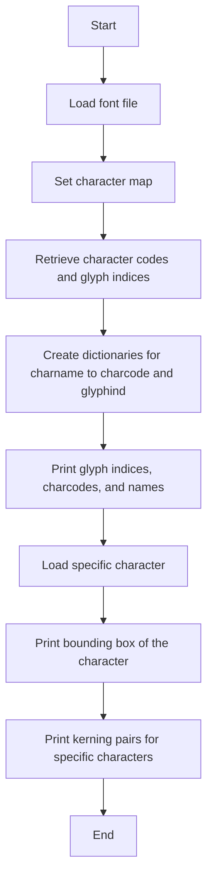

## 类结构

```
FontIndexing (主模块)
```

## 全局变量及字段


### `font`
    
An instance of FT2Font representing the font file being processed.

类型：`FT2Font`
    


### `codes`
    
A dictionary containing character codes and their corresponding glyph indices.

类型：`dict`
    


### `coded`
    
A dictionary mapping glyph names to their character codes.

类型：`dict`
    


### `glyphd`
    
A dictionary mapping glyph names to their glyph indices.

类型：`dict`
    


### `matplotlib.get_data_path()`
    
A function that returns the path to the matplotlib data directory.

类型：`str`
    


### `FT2Font`
    
A class representing a font file in the FreeType 2 library.

类型：`class`
    


### `Kerning`
    
An enumeration of kerning options for the font.

类型：`enum`
    


### `Kerning.DEFAULT`
    
A constant representing the default kerning option.

类型：`Kerning`
    


### `Kerning.UNFITTED`
    
A constant representing the unfitted kerning option.

类型：`Kerning`
    


### `Kerning.UNSCALED`
    
A constant representing the unscaled kerning option.

类型：`Kerning`
    


### `FT2Font.filename`
    
The filename of the font file.

类型：`str`
    


### `FT2Font.charmap`
    
The character map of the font.

类型：`dict`
    


### `FT2Font.glyphs`
    
The glyphs of the font.

类型：`dict`
    


### `dict.charmap`
    
The character map of the font, mapping character codes to glyph indices.

类型：`dict`
    


### `dict.glyphind`
    
The index of the glyph in the font's glyph table corresponding to a character code.

类型：`int`
    
    

## 全局函数及方法


### os.path.join

`os.path.join` 是一个全局函数，用于连接多个路径组件。

参数：

- `path1`：`str`，第一个路径组件。
- `path2`：`str`，第二个路径组件。

参数描述：`path1` 和 `path2` 是要连接的路径字符串。

返回值：`str`，连接后的路径字符串。

返回值描述：返回连接后的路径字符串，如果路径组件以斜杠（`/`）结尾，则不会添加额外的斜杠。

#### 流程图

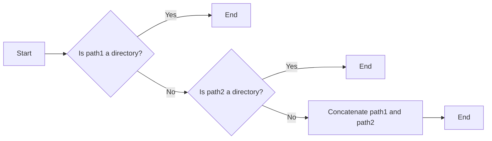

#### 带注释源码

```
import os

# 连接路径组件
result_path = os.path.join(path1, path2)
```


### matplotlib.get_data_path()

获取matplotlib数据路径的函数。

参数：

- 无

返回值：`str`，返回matplotlib数据文件的路径。

#### 流程图

```mermaid
graph LR
A[Start] --> B{Function Call}
B --> C[matplotlib.get_data_path()]
C --> D[Return Path]
D --> E[End]
```

#### 带注释源码

```python
import os
import matplotlib

def get_data_path():
    """
    Get the path to the matplotlib data directory.
    """
    return os.path.join(matplotlib.get_data_path(), 'fonts/ttf/DejaVuSans.ttf')
```


### print

打印输出字体字符的边界框、字符编码、字符名称、以及字符之间的间距信息。

参数：

- `glyph.bbox`：`tuple`，字符的边界框，表示字符在字体中的位置。
- `glyphd['A']`：`int`，字符'A'的索引。
- `glyphd['V']`：`int`，字符'V'的索引。
- `coded['A']`：`int`，字符'A'的编码。
- `coded['V']`：`int`，字符'V'的编码。
- `font.get_kerning(glyphd['A'], glyphd['V'], Kerning.DEFAULT)`：`int`，字符'A'和'V'之间的默认间距。
- `font.get_kerning(glyphd['A'], glyphd['V'], Kerning.UNFITTED)`：`int`，字符'A'和'V'之间的不拟合间距。
- `font.get_kerning(glyphd['A'], glyphd['V'], Kerning.UNSCALED)`：`int`，字符'A'和'V'之间的未缩放间距。
- `font.get_kerning(glyphd['A'], glyphd['T'], Kerning.UNSCALED)`：`int`，字符'A'和'T'之间的未缩放间距。

返回值：`None`，该函数不返回任何值，仅用于打印输出。

#### 流程图

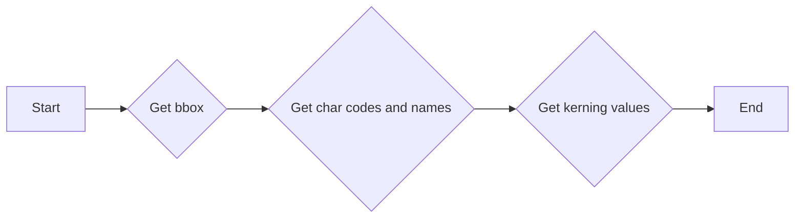

#### 带注释源码

```
print(glyph.bbox)  # 打印字符的边界框
print(glyphd['A'], glyphd['V'], coded['A'], coded['V'])  # 打印字符索引和编码
print('AV', font.get_kerning(glyphd['A'], glyphd['V'], Kerning.DEFAULT))  # 打印字符'A'和'V'之间的默认间距
print('AV', font.get_kerning(glyphd['A'], glyphd['V'], Kerning.UNFITTED))  # 打印字符'A'和'V'之间的不拟合间距
print('AV', font.get_kerning(glyphd['A'], glyphd['V'], Kerning.UNSCALED))  # 打印字符'A'和'V'之间的未缩放间距
print('AT', font.get_kerning(glyphd['A'], glyphd['T'], Kerning.UNSCALED))  # 打印字符'A'和'T'之间的未缩放间距
```


### FT2Font.set_charmap

设置字体字符映射。

参数：

- `charmap`：`int`，指定字符映射的索引。

返回值：`None`，无返回值。

#### 流程图

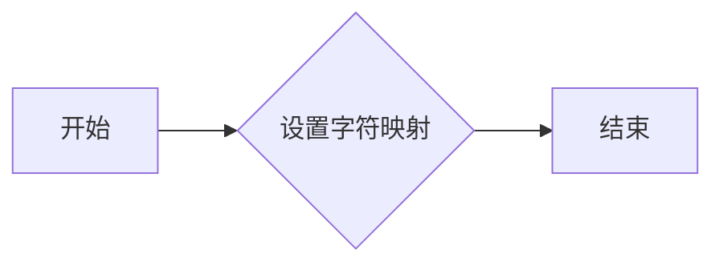

#### 带注释源码

```python
# 设置字体字符映射
def set_charmap(self, charmap):
    self.charmap = charmap
```


### FT2Font.get_charmap()

获取字体字符映射。

参数：

- 无

返回值：`dict`，包含字符名称到字符代码和字形索引的映射。

#### 流程图

```mermaid
graph LR
A[开始] --> B{调用FT2Font.get_charmap()}
B --> C[结束]
```

#### 带注释源码

```python
codes = font.get_charmap().items()
# make a charname to charcode and glyphind dictionary
coded = {}
glyphd = {}
for ccode, glyphind in codes:
    name = font.get_glyph_name(glyphind)
    coded[name] = ccode
    glyphd[name] = glyphind
    # print(glyphind, ccode, hex(int(ccode)), name)
```


### FT2Font.get_glyph_name

获取指定字形索引的名称。

参数：

- `glyphind`：`int`，字形索引，表示字形的唯一标识。

返回值：`str`，字形的名称。

#### 流程图

```mermaid
graph LR
A[开始] --> B{获取字形索引}
B --> C{调用get_glyph_name(glyphind)}
C --> D[返回字形名称]
D --> E[结束]
```

#### 带注释源码

```python
def get_glyph_name(self, glyphind):
    # 获取指定字形索引的名称
    return self._get_charname(glyphind)
```


### FT2Font.load_char

加载指定字符的字体信息。

参数：

- `code`：`int`，指定要加载的字符的编码值。

返回值：`FT2Font.Glyph`，包含指定字符的字体信息。

#### 流程图

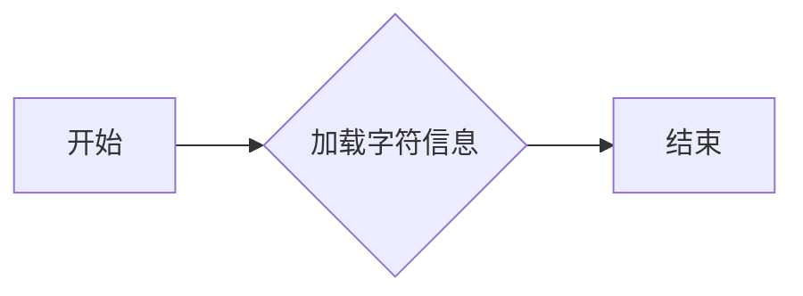

#### 带注释源码

```python
glyph = font.load_char(code)
```

在这段代码中，`FT2Font.load_char` 方法被调用来加载指定编码值 `code` 对应的字符的字体信息。该方法返回一个 `FT2Font.Glyph` 对象，该对象包含了关于该字符的详细信息，如字符的边界框（bbox）等。


### FT2Font.get_kerning

获取两个字符之间的间距调整值。

参数：

- `glyph1`：`int`，第一个字符的索引。
- `glyph2`：`int`，第二个字符的索引。
- `mode`：`Kerning`，间距调整的模式。

返回值：`int`，两个字符之间的间距调整值。

#### 流程图

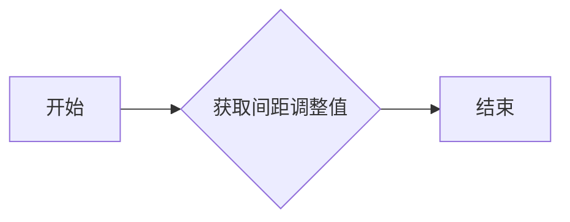

#### 带注释源码

```python
def get_kerning(glyph1, glyph2, mode):
    # 获取两个字符之间的间距调整值
    kerning_value = self._get_kerning(glyph1, glyph2, mode)
    return kerning_value
```


### FT2Font.get_charmap()

获取字体字符映射。

参数：

- 无

返回值：`dict`，包含字符名称到字符代码的映射。

#### 流程图

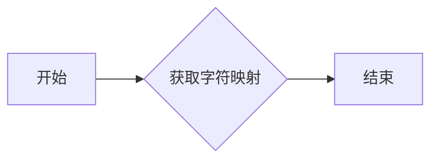

#### 带注释源码

```python
codes = font.get_charmap().items()
# make a charname to charcode and glyphind dictionary
coded = {}
glyphd = {}
for ccode, glyphind in codes:
    name = font.get_glyph_name(glyphind)
    coded[name] = ccode
    glyphd[name] = glyphind
```

### FT2Font.get_glyph_name()

获取指定字形索引的名称。

参数：

- `glyphind`：`int`，字形索引。

返回值：`str`，字形名称。

#### 流程图

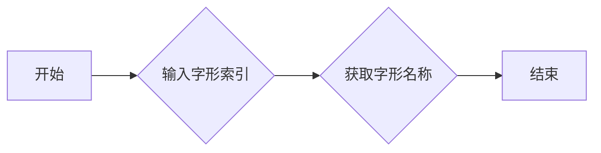

#### 带注释源码

```python
name = font.get_glyph_name(glyphind)
```

### FT2Font.load_char()

加载指定字符的字形。

参数：

- `code`：`int`，字符代码。

返回值：`FT2Glyph`，加载的字形。

#### 流程图

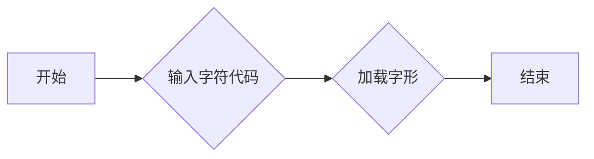

#### 带注释源码

```python
glyph = font.load_char(code)
```

### Kerning

枚举，表示不同的对齐方式。

参数：

- 无

返回值：`int`，对齐方式。

#### 流程图

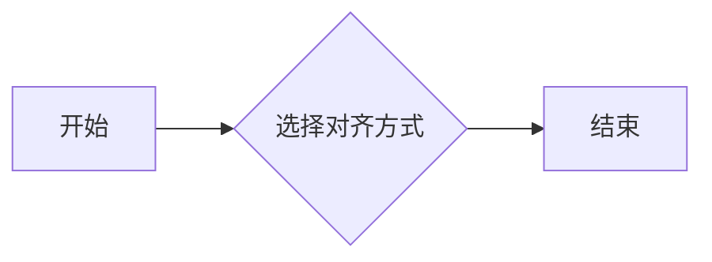

#### 带注释源码

```python
Kerning = Kerning
```

### FT2Font.get_kerning()

获取两个字符之间的间距。

参数：

- `left`：`int`，左侧字符的字形索引。
- `right`：`int`，右侧字符的字形索引。
- `mode`：`Kerning`，对齐方式。

返回值：`int`，间距值。

#### 流程图

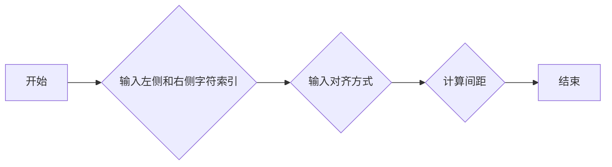

#### 带注释源码

```python
print('AV', font.get_kerning(glyphd['A'], glyphd['V'], Kerning.DEFAULT))
print('AV', font.get_kerning(glyphd['A'], glyphd['V'], Kerning.UNFITTED))
print('AV', font.get_kerning(glyphd['A'], glyphd['V'], Kerning.UNSCALED))
print('AT', font.get_kerning(glyphd['A'], glyphd['T'], Kerning.UNSCALED))
```


## 关键组件


### 张量索引

张量索引用于在字体数据结构中定位特定的字符或字形。

### 惰性加载

惰性加载是一种延迟加载技术，用于在需要时才加载字体数据，以优化内存使用和提高性能。

### 反量化支持

反量化支持允许字体在量化过程中保持其原始精度，从而在保持性能的同时保持视觉质量。

### 量化策略

量化策略决定了如何将浮点数字体数据转换为固定点数表示，以适应硬件限制。


## 问题及建议


### 已知问题

-   **全局变量使用**：代码中使用了全局变量 `font`，这可能导致代码的可读性和可维护性降低，尤其是在更大的项目中。
-   **硬编码路径**：`matplotlib.get_data_path()` 返回的路径是硬编码的，这限制了代码的可移植性。
-   **重复打印**：代码中多次打印相同的信息，这可能会影响输出的可读性。
-   **异常处理**：代码中没有异常处理机制，如果字体文件不存在或损坏，程序可能会崩溃。

### 优化建议

-   **移除全局变量**：将 `font` 变量移至函数内部，以增加代码的封装性。
-   **使用相对路径**：如果可能，使用相对路径来引用字体文件，以提高代码的可移植性。
-   **优化打印输出**：减少重复打印，或者将输出重定向到日志文件，以便更好地控制输出。
-   **添加异常处理**：添加异常处理来捕获和处理可能发生的错误，例如文件不存在或损坏。
-   **代码重构**：将代码分解为更小的函数，以提高代码的可读性和可维护性。
-   **性能优化**：如果代码被用于处理大量字体文件，可以考虑优化性能，例如通过缓存结果或使用更高效的数据结构。
-   **文档注释**：添加文档注释来解释代码的功能和目的，以提高代码的可理解性。


## 其它


### 设计目标与约束

- 设计目标：实现字体索引功能，展示字体表之间的关系。
- 约束条件：使用matplotlib库中的FT2Font类进行字体操作，确保代码在matplotlib环境中运行。

### 错误处理与异常设计

- 错误处理：在字体加载或操作过程中，可能遇到文件不存在、字体格式不支持等错误。应捕获这些异常，并给出相应的错误信息。
- 异常设计：使用try-except语句捕获异常，确保程序在遇到错误时不会崩溃，并给出友好的错误提示。

### 数据流与状态机

- 数据流：程序从加载字体文件开始，读取字体表信息，构建字符名到字符码和字形索引的字典，并获取特定字符的属性。
- 状态机：程序没有明显的状态转换，主要执行线性操作。

### 外部依赖与接口契约

- 外部依赖：matplotlib库，特别是FT2Font类。
- 接口契约：FT2Font类提供的方法，如get_charmap()、get_glyph_name()、load_char()、get_kerning()等。

### 测试与验证

- 测试方法：编写单元测试，验证字体加载、字符映射、字形加载和字间距计算等功能。
- 验证标准：确保程序能够正确处理不同字体文件，并准确输出字符属性。

### 性能优化

- 性能优化：在处理大量字体文件或字符时，考虑使用缓存机制，减少重复计算。
- 优化标准：提高程序处理速度，降低内存消耗。

### 安全性考虑

- 安全性考虑：确保字体文件来源可靠，避免恶意代码注入。
- 安全措施：对字体文件进行安全检查，防止病毒或恶意软件传播。

### 维护与扩展

- 维护策略：定期更新matplotlib库，确保程序兼容性。
- 扩展方向：支持更多字体格式，增加字体属性查询功能。


    