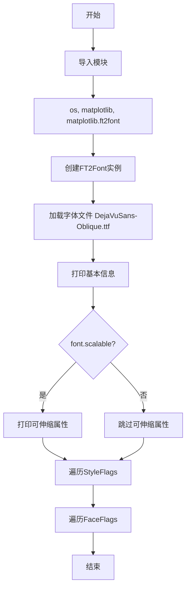
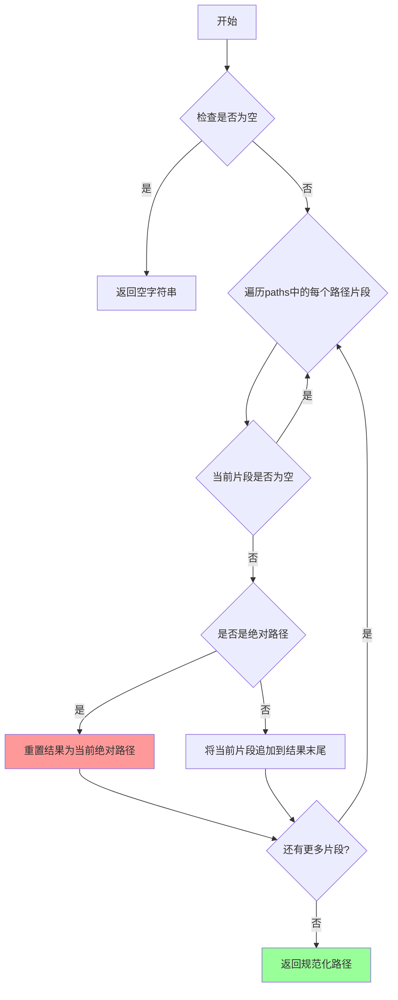
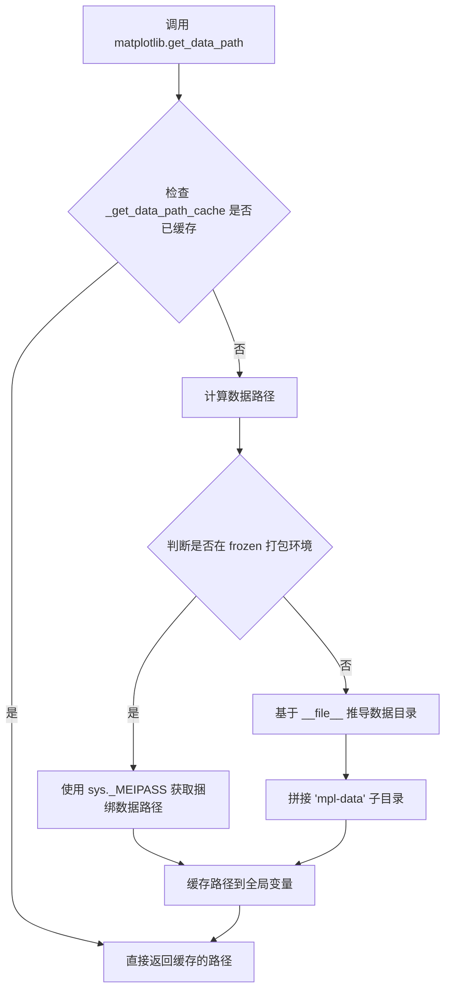
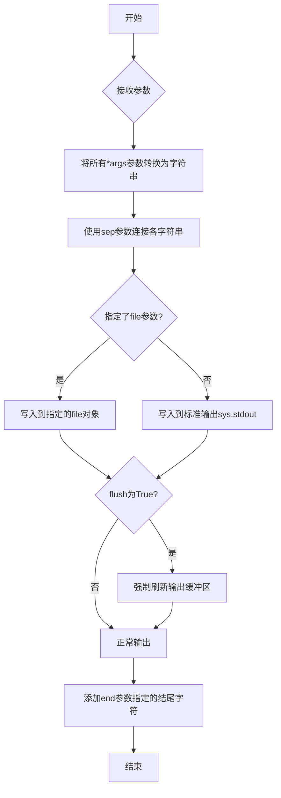
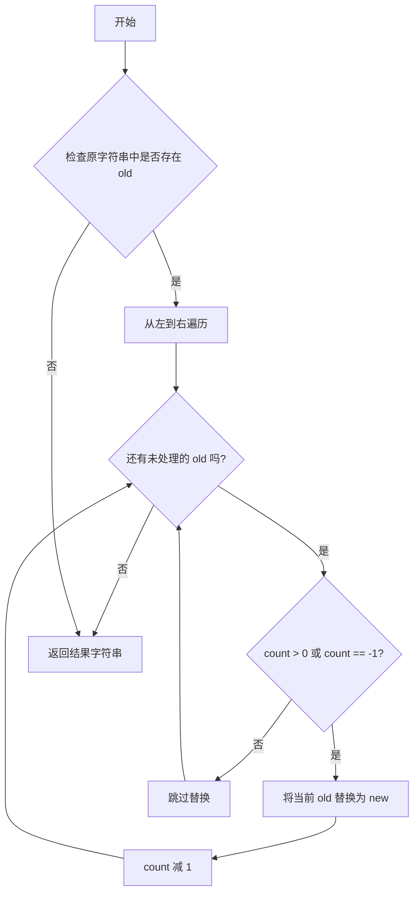
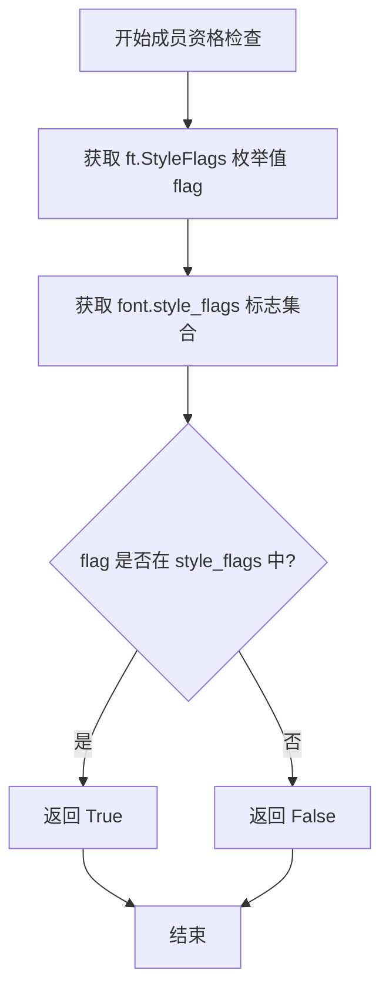
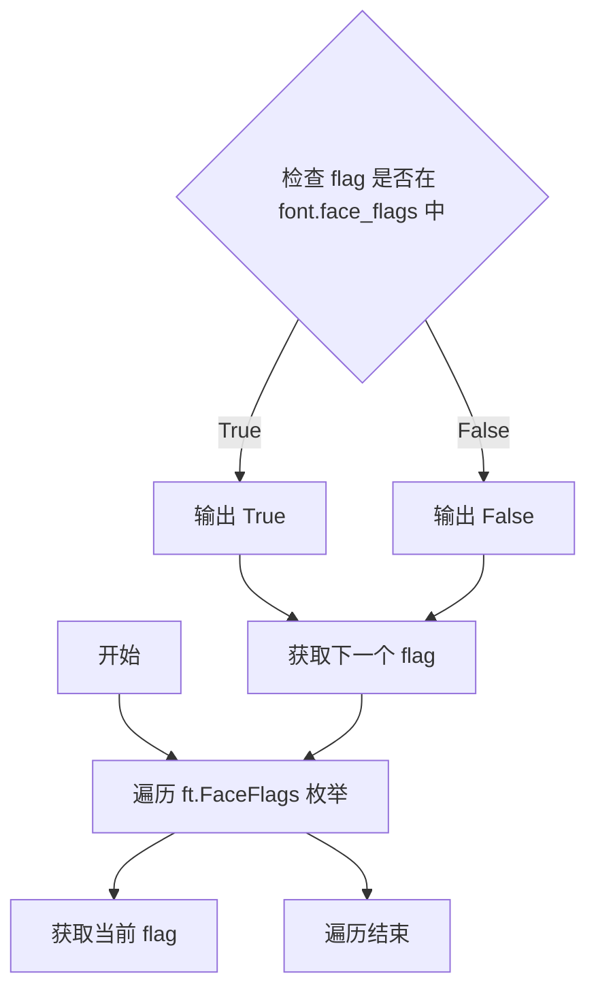

# `matplotlib\galleries\examples\misc\ftface_props.py` 详细设计文档

该脚本演示了如何使用matplotlib的FT2Font模块读取TrueType字体文件并打印其全局属性信息，包括字体家族名称、样式名称、字形数量、边框、度量值以及样式标志等。

## 整体流程



## 类结构

```
matplotlib.ft2font (模块)
└── FT2Font (类) - 字体文件封装类
    ├── 字体基本信息属性
    │   ├── num_named_instances
    │   ├── num_faces
    │   ├── num_glyphs
    │   ├── family_name
    │   ├── style_name
    │   ├── postscript_name
    │   └── num_fixed_sizes
    ├── 可伸缩属性 (scalable=True时可用)
    │   ├── bbox
    │   ├── units_per_EM
    │   ├── ascender
    │   ├── descender
    │   ├── height
    │   ├── max_advance_width
    │   ├── max_advance_height
    │   ├── underline_position
    │   └── underline_thickness
    └── 标志属性
        ├── style_flags
        └── face_flags
```

## 全局变量及字段


### `font`
    
字体文件对象，FT2Font实例，用于加载和访问字体属性

类型：`FT2Font`
    


### `name`
    
标志名称字符串，从枚举成员名称转换而来，用于显示

类型：`str`
    


### `StyleFlags/FaceFlags.flag`
    
StyleFlags或FaceFlags枚举成员，表示字体的样式或面标志，用于检查字体属性

类型：`int`
    
    

## 全局函数及方法


### `os.path.join`

用于将多个路径片段智能拼接成一个完整的路径字符串，是Python标准库中的路径操作系统接口。

参数：

- `*paths`：`str`，可变数量的路径片段，可以是字符串或任何可转换为字符串的对象

返回值：`str`，返回拼接后的规范化路径字符串

#### 流程图



#### 带注释源码

```python
# os.path.join 在 Python 标准库 os.path 模块中定义
# 源码位置：Lib/posixpath.py (Unix) 或 Lib/ntpath.py (Windows)

# 在本代码中的实际使用示例：
font_path = os.path.join(
    matplotlib.get_data_path(),    # 获取 Matplotlib 数据目录路径
    'fonts/ttf/DejaVuSans-Oblique.ttf'  # 字体文件名
)

# 函数工作原理：
# 1. 接收任意数量的路径片段作为参数
# 2. 从第一个非空片段开始
# 3. 如果遇到绝对路径，重置之前的路径
# 4. 使用系统特定的路径分隔符连接各部分
# 5. 返回规范化后的路径字符串
```

**在本代码中的作用**：将 Matplotlib 的数据目录路径与字体文件路径进行拼接，构建完整的字体文件路径。


### `matplotlib.get_data_path`

获取 matplotlib 绑定的数据文件（如字体、样式文件、示例图像等）所在的根目录路径。该函数是 matplotlib 的核心工具函数之一，用于定位库自带的各种数据资源。

参数：

- 无参数

返回值：`str`，返回 matplotlib 数据文件的根目录路径（例如：`/usr/local/lib/python3.x/site-packages/matplotlib/mpl-data`）

#### 流程图



#### 带注释源码

```python
# matplotlib/__init__.py 中的实现（简化版）

# 全局缓存变量
_get_data_path_cache = None

def get_data_path():
    """
    获取 matplotlib 数据文件的根目录路径。
    
    Returns:
        str: 包含 matplotlib 捆绑数据文件（如字体、样式等）的目录路径
    """
    global _get_data_path_cache
    
    # 如果已有缓存，直接返回（避免重复计算）
    if _get_data_path_cache is not None:
        return _get_data_path_cache
    
    # 判断是否在 PyInstaller 等打包环境下运行
    if getattr(sys, 'frozen', False):
        # 打包环境下使用 _MEIPASS 获取捆绑资源路径
        path = sys._MEIPASS
    else:
        # 正常环境下，基于当前模块文件位置推导数据目录
        path = os.path.dirname(__file__)
        # 向上查找直到找到包含 mpl-data 目录的位置
        while path and not os.path.exists(os.path.join(path, 'mpl-data')):
            parent = os.path.dirname(path)
            if parent == path:
                # 已到达文件系统根目录仍未找到
                raise RuntimeError("Could not find mpl-data directory")
            path = parent
        path = os.path.join(path, 'mpl-data')
    
    # 缓存结果并返回
    _get_data_path_cache = path
    return path
```

#### 关键信息说明

| 项目 | 说明 |
|------|------|
| **函数位置** | `matplotlib/__init__.py` |
| **使用场景** | 定位 matplotlib 捆绑的字体、样式表、示例图像等资源 |
| **缓存机制** | 使用全局变量 `_get_data_path_cache` 缓存结果，避免重复文件系统查询 |
| **兼容处理** | 支持 PyInstaller 等打包工具的 frozen 模式 |


### `print`

print 是 Python 的内置标准输出函数，用于将传入的对象转换为字符串并输出到标准输出设备（通常是终端）。在给定代码中，print 函数被多次用于输出 FT2Font 对象的各种属性信息。

参数：

- `*args`：任意类型，可变数量的位置参数，表示要输出的对象，多个对象之间会添加空格分隔
- `sep`：str 类型，可选，关键字参数，指定多个参数之间的分隔符，默认为一个空格
- `end`：str 类型，可选，关键字参数，指定输出结束时的字符，默认为换行符 `\n`
- `file`：file-like object 类型，可选，关键字参数，指定输出目标，默认为 sys.stdout
- `flush`：bool 类型，可选，关键字参数，指定是否强制刷新输出，默认为 False

返回值：`None`，print 函数没有返回值

#### 流程图



#### 带注释源码

```python
# 代码中print函数的典型用法示例

# 输出数字类型
print('Num instances:  ', font.num_named_instances)  # 打印字体命名实例数量

# 输出字符串类型
print('Family name:    ', font.family_name)          # 打印字体家族名称

# 输出元组类型
print('Bbox:               ', font.bbox)             # 打印字体边界框元组

# 使用f-string格式化输出
for flag in ft.StyleFlags:
    name = flag.name.replace('_', ' ').title() + ':'
    # f-string内部使用print输出，左对齐17个字符宽度
    print(f"{name:17}", flag in font.style_flags)

# print函数的标准调用形式
print(object1, object2, ..., sep=' ', end='\n', file=sys.stdout, flush=False)
# sep: 分隔符默认为空格
# end: 结尾符默认为换行符（每次print后换行）
# file: 默认为标准输出
# flush: 默认为不强制刷新
```

#### 代码中的实际调用分析

```python
# 调用1：输出整数属性
print('Num instances:  ', font.num_named_instances)
# 参数1: 字符串 'Num instances:  '
# 参数2: 整数 font.num_named_instances
# 内部行为：将两者转换为字符串，用空格连接，输出到终端

# 调用2：输出元组属性
print('Bbox:               ', font.bbox)
# 参数1: 字符串 'Bbox:               '
# 参数2: 元组 font.bbox (xmin, ymin, xmax, ymax)

# 调用3：在循环中使用print输出布尔值
print(f"{name:17}", flag in font.style_flags)
# 使用f-string格式化对齐，输出StyleFlags标志的布尔状态
```


### `str.replace`

字符串的替换方法，用于将字符串中的指定子串替换为另一个子串，返回替换后的新字符串，原字符串保持不变。

参数：

- `old`：`str`，需要被替换的子字符串
- `new`：`str`，用于替换的新字符串
- `count`（可选）：`int`，指定替换的次数，默认为 -1 表示替换所有出现的 old

返回值：`str`，返回替换后的新字符串

#### 流程图



#### 带注释源码

```python
# 在代码中的实际使用方式
name = flag.name.replace('_', ' ').title() + ':'

# 源码解释：
# 1. flag.name 获取标志的名称（字符串类型）
# 2. .replace('_', ' ') 将字符串中的所有下划线替换为空格
#    - old: '_'（被替换的字符）
#    - new: ' '（替换后的字符）
#    - count: 默认为 -1（替换所有出现的下划线）
# 3. .title() 将结果转换为标题格式（每个单词首字母大写）
# 4. + ':' 追加冒号字符

# 示例：
# flag.name = "ITALIC_ANGLE"
# 执行 replace('_', ' ') 后: "ITALIC ANGLE"
# 执行 title() 后: "Italic Angle"
# 最终: "Italic Angle:"
```


### `flag in font.style_flags`（成员资格检查）

检查给定的样式标志（StyleFlag）是否存在于字体的样式标志集合（style_flags）中，用于判断字体是否具有特定的样式属性（如斜体、粗体等）。

参数：

- `flag`：`ft.StyleFlags`，要检查的样式标志枚举值，来源于 FreeType 的样式标志枚举
- `font.style_flags`：`FT2Font` 对象的样式标志属性，表示该字体所具有的所有样式标志的集合

返回值：`bool`，如果 `flag` 存在于 `font.style_flags` 集合中返回 `True`，否则返回 `False`

#### 流程图



#### 带注释源码

```python
# 遍历所有可用的样式标志
for flag in ft.StyleFlags:
    # 获取标志名称并格式化：将下划线替换为空格，首字母大写
    name = flag.name.replace('_', ' ').title() + ':'
    # 成员资格检查：检查当前标志是否在字体的样式标志集合中
    # flag: ft.StyleFlags 枚举值
    # font.style_flags: FT2Font 对象的样式标志属性（集合类型）
    # 返回 bool: True 表示字体具有该样式标志，False 表示不具有
    print(f"{name:17}", flag in font.style_flags)

# 解释：
# 1. ft.StyleFlags 是 FreeType 定义的样式标志枚举，包含如 BOLD, ITALIC 等
# 2. font.style_flags 是 FT2Font 对象实例的属性，存储该字体实际具有的样式标志
# 3. "flag in font.style_flags" 使用 Python 的 in 运算符进行成员资格检查
# 4. 这是一个布尔表达式，返回 True 或 False
```

#### 关键组件信息

| 组件名称 | 描述 |
|---------|------|
| `ft.StyleFlags` | FreeType 样式标志枚举定义，包含字体的样式属性标志 |
| `FT2Font.style_flags` | FT2Font 类的属性，存储字体实际具有的样式标志集合 |
| `ft.FT2Font` | Matplotlib 的 FreeType 2 字体包装类，用于加载和操作字体文件 |

#### 潜在的技术债务或优化空间

1. **输出格式不够结构化**：当前直接使用 `print` 输出，建议返回结构化数据便于后续处理
2. **缺少错误处理**：如果 `font` 为 `None` 或 `style_flags` 属性不存在，会抛出异常
3. **硬编码输出格式**：格式化逻辑与业务逻辑混合，可提取为独立的格式化工具函数

#### 其它项目

- **设计目标**：提供对字体样式属性的运行时查询能力
- **约束**：依赖于 Matplotlib 的 ft2font 模块和 FreeType 库
- **错误处理**：若 `font` 对象无效或 `style_flags` 不可访问，应抛出适当的异常
- **数据流**：枚举值 → 成员资格检查 → 布尔结果 → 控制流分支


### `flag in font.face_flags`

这是一个成员资格检查表达式，用于检查某个字体标志位是否存在于 FT2Font 对象的 `face_flags` 属性中。该表达式常用于遍历所有 `FaceFlags` 枚举值，判断当前字体支持哪些特性。

参数：

- `flag`：`ft.FaceFlags`，表示要检查的字体标志枚举值
- `font.face_flags`：`int`，FT2Font 对象的字体标志属性（位掩码），包含字体的各种特性信息

返回值：`bool`，如果 `flag` 对应的标志位在 `font.face_flags` 中则返回 `True`，否则返回 `False`

#### 流程图



#### 带注释源码

```python
# 遍历 ft.FaceFlags 枚举中的所有字体标志位
for flag in ft.FaceFlags:
    # 将标志位名称转换为可读格式：下划线替换为空格，首字母大写
    name = flag.name.replace('_', ' ').title() + ':'
    # 成员资格检查：判断当前 flag 是否存在于 font.face_flags 位掩码中
    # flag 是 ft.FaceFlags 枚举值
    # font.face_flags 是 FT2Font 对象的整型位掩码属性
    # 使用 'in' 操作符进行位掩码成员检查
    print(f"{name:17}", flag in font.face_flags)

# 说明：
# - ft.FaceFlags 是 FreeType 字体标志位的枚举类型
# - font.face_flags 是 FT2Font 对象的属性，存储字体的标志位信息
# - 'in' 操作符在位掩码中检查特定位是否被设置
# - 例如：flag = FaceFlags.SCALABLE, font.face_flags = 4
# - 如果 font.face_flags 的二进制包含该位，则返回 True
```


## 关键组件


### FT2Font 字体对象

用于加载和管理 FreeType 2 字体文件的核心类，提供访问字体全局属性的接口。

### Font 属性读取

通过访问 FT2Font 对象的各种属性获取字体元数据信息，包括字族名称、样式名称、PostScript 名称、字形数量、EM 单元数、边框框、上升部、下降部等。

### StyleFlags 样式标志枚举

枚举类，表示字体的样式特征（如粗体、斜体等），用于检查字体对象是否具有特定样式。

### FaceFlags 字面标志枚举

枚举类，表示字体的技术特征（如可缩放、嵌入式位图等），用于检查字体对象的技术属性。

### 字体边框框 bbox

元组 (xmin, ymin, xmax, ymax)，表示字体的全局边界框，用于确定字体的整体尺寸范围。

### 字体度量属性

包括 ascender（上升部）、descender（下降部）、height（高度）、max_advance_width（最大水平前瞻）、max_advance_height（最大垂直前瞻）等，用于排版布局计算。

### 可缩放性检查 scalable

布尔属性，判断字体是否为可缩放轮廓字体，只有可缩放字体才支持 EM 单元和相对坐标转换。


## 问题及建议


### 已知问题

-   **硬编码字体路径**：字体文件路径“DejaVuSans-Oblique.ttf”被硬编码，如果文件不存在或路径错误会导致程序失败
-   **缺乏错误处理**：没有try-except块捕获文件不存在、字体加载失败等异常情况
-   **重复代码**：遍历打印StyleFlags和FaceFlags的代码逻辑高度重复，不符合DRY原则
-   **资源未显式释放**：FT2Font对象使用后没有显式调用close()方法释放资源
-   **scalable分支不完整**：仅处理了font.scalable为True的情况，else分支被忽略
-   **无返回值设计**：所有结果直接打印到stdout，函数无返回值，不利于单元测试和复用

### 优化建议

-   使用异常处理机制捕获FileNotFoundError、FT2FontError等可能的异常
-   将重复的flag打印逻辑提取为独立的辅助函数，减少代码冗余
-   使用with语句或显式调用close()方法确保字体资源被正确释放
-   考虑添加else分支处理非scalable字体的逻辑，或添加警告提示
-   将打印逻辑与业务逻辑分离，返回结构化数据而非直接打印，便于测试和集成
-   将字体路径、字体名等配置提取为常量或配置参数，提高代码灵活性
-   添加更详细的注释和文档字符串说明各属性的含义和单位

## 其它


### 设计目标与约束

本代码示例旨在演示如何使用matplotlib.ft2font模块的FT2Font类来获取和展示字体文件的全局属性信息。设计目标包括：1）展示FT2Font类的核心API使用方法；2）演示如何访问字体的各种属性（family name、style name、metrics等）；3）展示如何查询字体的style flags和face flags。约束条件：需要matplotlib库已正确安装，且字体文件路径有效。

### 错误处理与异常设计

代码主要依赖os.path.join和matplotlib.get_data_path()获取字体路径，若路径不存在或字体文件损坏可能抛出异常。FT2Font构造函数在字体文件不存在或格式错误时会抛出FT2FontError。scalable属性检查可能存在但字体文件格式异常时需额外错误处理。建议在实际应用中添加try-except块捕获FileNotFoundError、OSError等异常。

### 数据流与状态机

代码数据流：1）通过matplotlib.get_data_path()获取数据目录路径；2）使用os.path.join拼接字体完整路径；3）创建FT2Font对象加载字体文件到内存；4）通过对象属性访问获取字体元数据；5）遍历flags枚举类查询标志位。状态机简化为：初始化→加载字体→属性查询→输出结果，无复杂状态转换。

### 外部依赖与接口契约

主要依赖：1）matplotlib库（提供ft2font模块）；2）matplotlib配套字体文件（DejaVuSans-Oblique.ttf）。FT2Font类接口：构造函数接受font_path字符串参数，返回字体对象。属性接口包括：num_named_instances、num_faces、num_glyphs、family_name、style_name、postscript_name、num_fixed_sizes、scalable、bbox、units_per_EM、ascender、descender、height、max_advance_width、max_advance_height、underline_position、underline_thickness、style_flags、face_flags。

### 性能考虑

代码为一次性示例，无性能优化需求。FT2Font对象创建时一次性加载整个字体文件到内存，适用于桌面端字体查看场景。如需处理大量字体文件，建议采用延迟加载或缓存机制。

### 安全性考虑

代码从matplotlib数据目录加载受信任的字体文件，无用户输入验证需求。在生产环境中使用需确保字体文件来源可信，避免加载恶意构造的字体文件可能导致的安全问题。

### 兼容性考虑

代码依赖matplotlib.ft2font模块，该模块为matplotlib的内部实现，可能随版本变化。FT2Font的API在不同matplotlib版本间可能存在差异。代码在Python 3.x环境下运行，兼容性良好。

### 使用示例与扩展

可扩展方向：1）批量处理目录下多个字体文件；2）比较不同字体的属性差异；3）将属性输出保存为JSON/CSV格式；4）结合Glyph对象查询单个字符的详细度量信息；5）使用load_char方法加载特定字符分析字形数据。

### 配置与常量说明

代码中使用的字体路径由matplotlib.get_data_path()动态获取，确保在不同安装环境下指向正确的matplotlib数据目录。StyleFlags和FaceFlags为枚举类，定义在ft2font模块中，用于表示字体的样式特征和面部特征。

    