# `matplotlib\galleries\examples\misc\histogram_path.py` 详细设计文档

This code generates histograms using rectangles and PolyCollections in Matplotlib, demonstrating the use of Path objects for efficient rendering of large numbers of objects.

## 整体流程

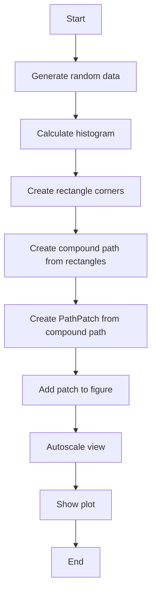

## 类结构

```
HistogramGenerator
```

## 全局变量及字段


### `np`
    
NumPy module for numerical operations

类型：`module`
    


### `plt`
    
Matplotlib module for plotting

类型：`module`
    


### `patches`
    
Matplotlib.patches module for creating patches

类型：`module`
    


### `path`
    
Matplotlib.path module for path operations

类型：`module`
    


### `fig`
    
Matplotlib figure object

类型：`matplotlib.figure.Figure`
    


### `ax`
    
Matplotlib axes object

类型：`matplotlib.axes._subplots.AxesSubplot`
    


### `HistogramGenerator.data`
    
Randomly generated data for the histogram

类型：`numpy.ndarray`
    


### `HistogramGenerator.n`
    
Number of data points in the histogram

类型：`int`
    


### `HistogramGenerator.bins`
    
Bin edges for the histogram

类型：`numpy.ndarray`
    


### `HistogramGenerator.left`
    
Left edges of the histogram rectangles

类型：`numpy.ndarray`
    


### `HistogramGenerator.right`
    
Right edges of the histogram rectangles

类型：`numpy.ndarray`
    


### `HistogramGenerator.bottom`
    
Bottom edges of the histogram rectangles

类型：`numpy.ndarray`
    


### `HistogramGenerator.top`
    
Top edges of the histogram rectangles

类型：`numpy.ndarray`
    


### `HistogramGenerator.XY`
    
Coordinates for the rectangle corners

类型：`numpy.ndarray`
    


### `HistogramGenerator.barpath`
    
Path object representing the histogram bars

类型：`matplotlib.path.Path`
    


### `HistogramGenerator.patch`
    
Path patch object representing the histogram bars

类型：`matplotlib.patches.PathPatch`
    
    

## 全局函数及方法


### np.random.seed

`np.random.seed` is a function from the NumPy library that sets the seed for the random number generator. This ensures that the random numbers generated are reproducible.

参数：

- `seed`：`int`，An integer that is used to seed the random number generator. If not provided, the current system time is used.

返回值：`None`，This function does not return any value.

#### 流程图

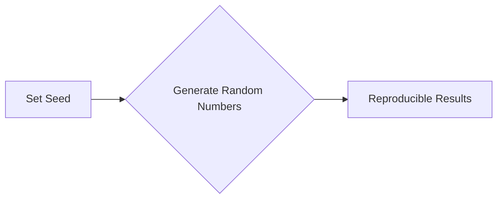

#### 带注释源码

```python
np.random.seed(19680801)  # Fixing random state for reproducibility
```


### np.histogram

This function computes the histogram of values in the input array.

参数：

- `data`：`numpy.ndarray`，输入数据数组。
- `bins`：`int` 或 `sequence`，可选，表示每个区间的数量或区间边界。

返回值：`tuple`，包含两个元素：`counts` 和 `bins`。

返回值描述：

- `counts`：`numpy.ndarray`，表示每个区间的计数。
- `bins`：`numpy.ndarray`，表示区间的边界。

#### 流程图

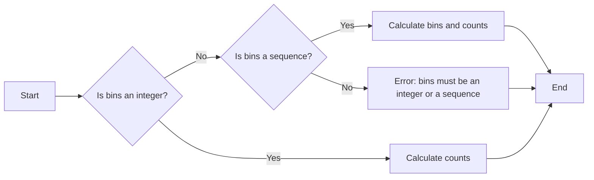

#### 带注释源码

```python
import numpy as np

def np_histogram(data, bins):
    """
    Compute the histogram of values in the input array.

    Parameters:
    - data: numpy.ndarray, input data array.
    - bins: int or sequence, optional, number of bins or bin edges.

    Returns:
    - tuple, containing two elements: counts and bins.
    """
    counts, bins = np.histogram(data, bins)
    return counts, bins
```


### path.Path.make_compound_path_from_polys

This function creates a compound path from a list of polygons. Each polygon is represented as a list of vertices, where each vertex is a tuple of two numbers (x, y).

参数：

- `polys`：`list of list of tuple of float`，A list of polygons, where each polygon is a list of vertices. Each vertex is a tuple of two floats representing the x and y coordinates.

返回值：`matplotlib.path.Path`，A Path object representing the compound path.

#### 流程图

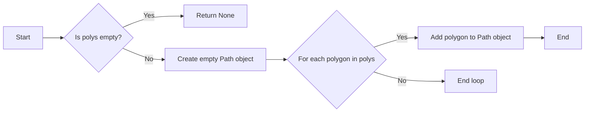

#### 带注释源码

```python
def make_compound_path_from_polys(polys):
    """
    Create a compound path from a list of polygons.

    Parameters
    ----------
    polys : list of list of tuple of float
        A list of polygons, where each polygon is a list of vertices. Each vertex is a tuple of two floats representing the x and y coordinates.

    Returns
    -------
    matplotlib.path.Path
        A Path object representing the compound path.
    """
    if not polys:
        return None

    path = path.Path()
    for poly in polys:
        path = path.union_path(path.Path(poly))
    return path
```


### patches.PathPatch

`patches.PathPatch` 是一个用于在 Matplotlib 中创建路径补丁的类。

参数：

- `barpath`：`matplotlib.path.Path`，表示路径对象，用于定义补丁的形状。
- ...

返回值：`patches.PathPatch`，表示创建的路径补丁对象。

#### 流程图

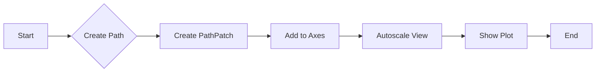

#### 带注释源码

```python
import matplotlib.pyplot as plt
import numpy as np
import matplotlib.patches as patches
import matplotlib.path as path

# ... (省略其他代码)

# make a patch out of it, don't add a margin at y=0
patch = patches.PathPatch(barpath)
patch.sticky_edges.y[:] = [0]

fig, ax = plt.subplots()
ax.add_patch(patch)
ax.autoscale_view()
plt.show()
``` 


### ax.add_patch

`ax.add_patch` 是一个方法，用于将一个 `PathPatch` 对象添加到 `Axes` 对象中。

参数：

- `patch`：`PathPatch`，表示要添加到 `Axes` 对象中的路径补丁。

返回值：无

#### 流程图

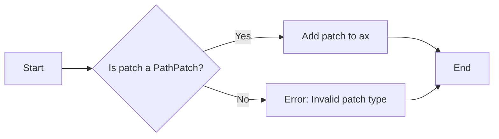

#### 带注释源码

```python
# make a patch out of it, don't add a margin at y=0
patch = patches.PathPatch(barpath)
patch.sticky_edges.y[:] = [0]

fig, ax = plt.subplots()
ax.add_patch(patch)
ax.autoscale_view()
plt.show()
```

在这段代码中，首先创建了一个 `PathPatch` 对象 `patch`，然后将其添加到 `Axes` 对象 `ax` 中。`ax.autoscale_view()` 调用确保 `Axes` 对象的视图自动调整以适应添加的补丁。


### ax.autoscale_view()

该函数用于自动调整坐标轴的视图范围，使其包含所有绘制的图形元素。

参数：

- 无

返回值：`None`，该函数不返回任何值，而是直接修改当前的坐标轴视图。

#### 流程图

```mermaid
graph LR
A[开始] --> B{调用autoscale_view()}
B --> C[结束]
```

#### 带注释源码

```python
fig, ax = plt.subplots()
ax.add_patch(patch)
ax.autoscale_view()  # 自动调整坐标轴视图范围
plt.show()
```


### plt.show()

显示当前图形。

参数：

- 无

返回值：无

#### 流程图

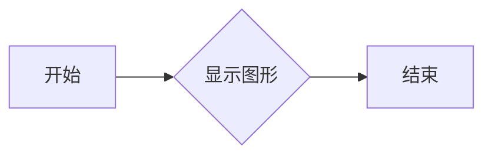

#### 带注释源码

```python
plt.show()
```


### HistogramGenerator.__init__

This method initializes the HistogramGenerator class, setting up the necessary parameters for generating histograms.

参数：

- `self`：`HistogramGenerator`，The instance of the HistogramGenerator class itself.
- `data`：`numpy.ndarray`，The data to be histogrammed.
- `bins`：`int` or `sequence`，The number of bins or the bin edges.

返回值：`None`，This method does not return any value.

#### 流程图

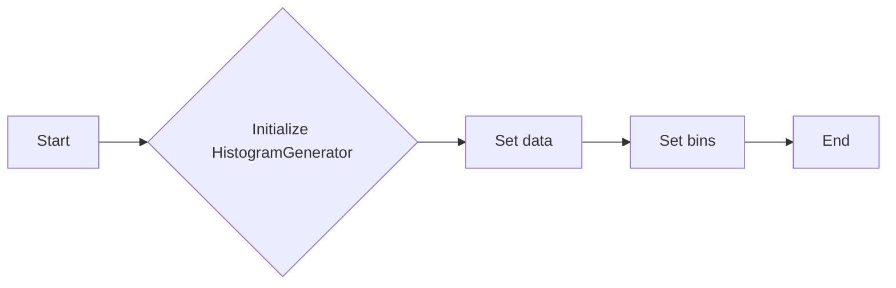

#### 带注释源码

```python
def __init__(self, data, bins):
    # Initialize the HistogramGenerator with the given data and bins
    self.data = data
    self.bins = bins
```


### HistogramGenerator.generate_data

This function generates a histogram using numpy and matplotlib for visualization.

参数：

- `data`：`numpy.ndarray`，输入数据，用于生成直方图。
- `bins`：`int`，直方图的条形数。

返回值：`tuple`，包含直方图的计数和条形边界。

#### 流程图

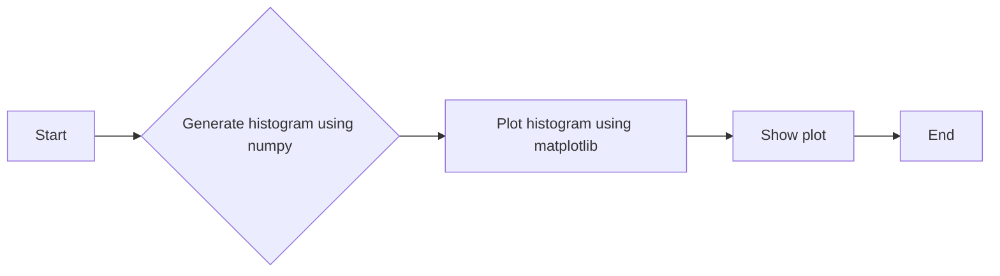

#### 带注释源码

```python
import numpy as np
import matplotlib.pyplot as plt

def generate_data(data, bins):
    """
    Generate a histogram using numpy and matplotlib for visualization.

    :param data: numpy.ndarray, input data for the histogram.
    :param bins: int, number of bars in the histogram.
    :return: tuple, containing the histogram counts and bar boundaries.
    """
    n, bins = np.histogram(data, bins)
    fig, ax = plt.subplots()
    ax.hist(data, bins=bins)
    ax.set_title("Histogram")
    ax.set_xlabel("Value")
    ax.set_ylabel("Frequency")
    plt.show()
    return n, bins
```


### HistogramGenerator.calculate_histogram

This function calculates the histogram of a given data set using numpy's histogram function.

参数：

- `data`：`numpy.ndarray`，The data set for which the histogram is to be calculated.
- `bins`：`int` or `sequence`，The number of bins or the bin edges.

返回值：`tuple`，A tuple containing the bin counts and the bin edges.

#### 流程图

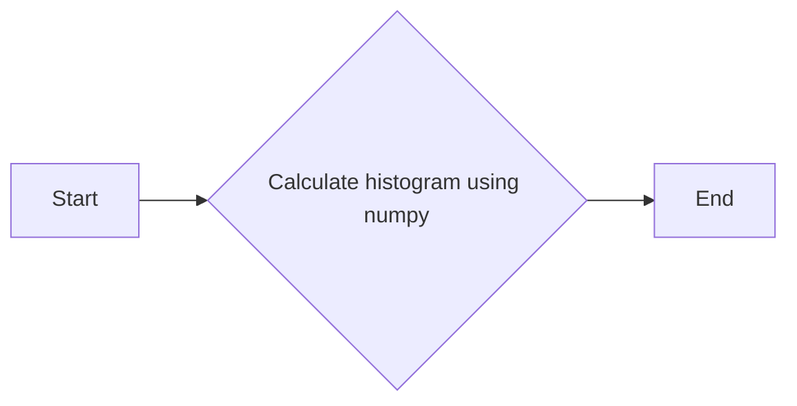

#### 带注释源码

```python
import numpy as np

def calculate_histogram(data, bins):
    """
    Calculate the histogram of a given data set using numpy's histogram function.

    :param data: numpy.ndarray, The data set for which the histogram is to be calculated.
    :param bins: int or sequence, The number of bins or the bin edges.
    :return: tuple, A tuple containing the bin counts and the bin edges.
    """
    n, bins = np.histogram(data, bins)
    return n, bins
```


### HistogramGenerator.create_rectangle_corners

This function generates the corners of rectangles for a histogram using numpy arrays and matplotlib path objects.

参数：

- `left`: `numpy.ndarray`，The left edges of the histogram bins.
- `right`: `numpy.ndarray`，The right edges of the histogram bins.
- `bottom`: `numpy.ndarray`，The bottom edges of the histogram bins (all zeros in this case).
- `top`: `numpy.ndarray`，The top edges of the histogram bins.

返回值：`numpy.ndarray`，A (numrects x numsides x 2) numpy array containing the vertices for the rectangles.

#### 流程图

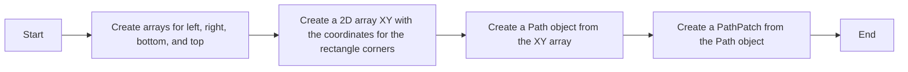

#### 带注释源码

```python
# get the corners of the rectangles for the histogram
left = bins[:-1]
right = bins[1:]
bottom = np.zeros(len(left))
top = bottom + n

# we need a (numrects x numsides x 2) numpy array for the path helper
# function to build a compound path
XY = np.array([[left, left, right, right], [bottom, top, top, bottom]]).T

# get the Path object
barpath = path.Path.make_compound_path_from_polys(XY)
```


### HistogramGenerator.create_compound_path

This function creates a compound path from a set of vertices and codes, which is used to draw rectangles in a histogram.

参数：

- `verts`：`numpy.ndarray`，A (numverts x 2) array of vertices for the path.
- `codes`：`numpy.ndarray`，An array of codes for the path, where each code corresponds to a segment of the path.

返回值：`matplotlib.path.Path`，The created compound path.

#### 流程图

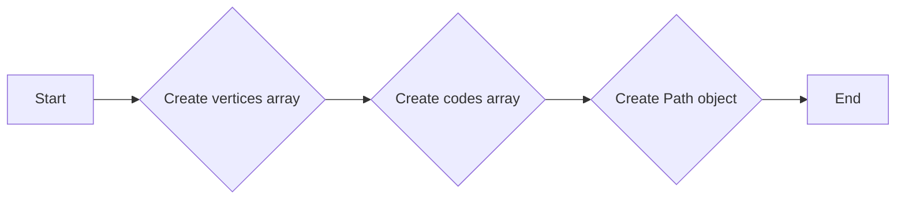

#### 带注释源码

```python
def create_compound_path(verts, codes):
    """
    Create a compound path from vertices and codes.

    Parameters:
    - verts: numpy.ndarray, A (numverts x 2) array of vertices for the path.
    - codes: numpy.ndarray, An array of codes for the path, where each code corresponds to a segment of the path.

    Returns:
    - matplotlib.path.Path, The created compound path.
    """
    return path.Path(verts, codes)
```


### HistogramGenerator.create_path_patch

This function creates a compound path from a set of vertices and codes, which is then used to create a `PathPatch` object for a histogram.

参数：

- `verts`：`numpy.ndarray`，A (numverts x 2) array of vertices for the path.
- `codes`：`numpy.ndarray`，An array of codes for the path, where each code corresponds to a segment of the path.

返回值：`matplotlib.path.Path`，The created path object.

#### 流程图


#### 带注释源码

```python
def create_path_patch(verts, codes):
    """
    Create a Path object from vertices and codes.

    Parameters:
    - verts: numpy.ndarray, a (numverts x 2) array of vertices for the path.
    - codes: numpy.ndarray, an array of codes for the path, where each code corresponds to a segment of the path.

    Returns:
    - matplotlib.path.Path, the created path object.
    """
    return path.Path(verts, codes)
```


### HistogramGenerator.add_patch_to_figure

This function adds a path patch to a figure using the provided path object.

参数：

- `barpath`：`matplotlib.path.Path`，The path object representing the shape of the patch.
- `fig`：`matplotlib.figure.Figure`，The figure to which the patch will be added.
- `ax`：`matplotlib.axes.Axes`，The axes on which the patch will be added.

返回值：`None`，No return value, the patch is added directly to the figure.

#### 流程图


#### 带注释源码

```python
import matplotlib.pyplot as plt
import numpy as np
import matplotlib.patches as patches
import matplotlib.path as path

def add_patch_to_figure(barpath, fig, ax):
    # Create a path patch from the path object
    patch = patches.PathPatch(barpath)
    
    # Add the patch to the axes
    ax.add_patch(patch)
    
    # Autoscale the view to fit the patch
    ax.autoscale_view()
    
    # Show the figure
    plt.show()
``` 


### ax.autoscale_view()

自动调整轴的视图以适应数据。

参数：

- 无

返回值：`None`，无返回值

#### 流程图

```mermaid
graph LR
A[Start] --> B{Call ax.autoscale_view()}
B --> C[End]
```

#### 带注释源码

```python
fig, ax = plt.subplots()
ax.add_patch(patch)
ax.autoscale_view()  # 自动调整轴的视图以适应数据
plt.show()
```


### show_plot

展示直方图。

参数：

-  `None`：无参数，该函数直接在当前上下文中展示直方图。

返回值：`None`，该函数不返回任何值，它仅用于展示直方图。

#### 流程图

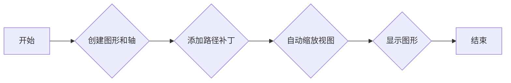

#### 带注释源码

```python
fig, ax = plt.subplots()  # 创建图形和轴
ax.add_patch(patch)  # 添加路径补丁
ax.autoscale_view()  # 自动缩放视图
plt.show()  # 显示图形
```


## 关键组件


### 张量索引与惰性加载

张量索引与惰性加载是用于高效处理大型数据集的关键技术，它允许在需要时才计算数据，从而减少内存消耗和提高性能。

### 反量化支持

反量化支持是针对量化模型进行优化的一种技术，它允许模型在量化过程中保持较高的精度，从而提高模型的性能和降低模型的存储需求。

### 量化策略

量化策略是用于将浮点数转换为固定点数的技术，它通过减少数值的精度来减少模型的存储需求和加速模型的计算速度。


## 问题及建议


### 已知问题

-   **代码重复**：代码中存在两段几乎相同的代码块，用于绘制直方图。这可能导致维护困难，如果需要修改直方图的绘制方式，需要修改两处代码。
-   **注释不足**：代码中注释主要集中在描述性内容，对于一些关键步骤，如路径创建和路径补丁的使用，缺乏详细的解释。
-   **全局变量和函数**：代码中使用了全局变量和函数，这可能导致代码的可读性和可维护性降低。

### 优化建议

-   **合并代码块**：将绘制直方图的代码块合并为一个，以减少代码重复，并简化维护。
-   **增加详细注释**：在关键步骤，如路径创建和路径补丁的使用，增加详细的注释，以帮助其他开发者理解代码的工作原理。
-   **使用类和对象**：将绘制直方图的功能封装在一个类中，使用对象来管理状态和行为，以提高代码的可读性和可维护性。
-   **考虑性能**：虽然使用`Path.make_compound_path_from_polys`和直接使用顶点和代码创建路径的性能差异不大，但可以考虑在处理大量数据时，选择更高效的方法。
-   **错误处理**：增加错误处理机制，以处理可能出现的异常情况，如数据格式错误或绘图库错误。


## 其它


### 设计目标与约束

- 设计目标：实现一个高效、可扩展的直方图绘制功能，支持大量数据点的处理。
- 约束条件：使用Matplotlib库进行绘图，确保代码的可读性和可维护性。

### 错误处理与异常设计

- 错误处理：对可能出现的异常进行捕获，如数据类型错误、绘图库初始化失败等。
- 异常设计：提供清晰的错误信息，便于问题定位和调试。

### 数据流与状态机

- 数据流：数据从随机数生成到直方图绘制，经过数据预处理、绘图等步骤。
- 状态机：程序从初始化到绘图的整个过程，包括数据生成、数据预处理、绘图等状态。

### 外部依赖与接口契约

- 外部依赖：Matplotlib库、NumPy库。
- 接口契约：确保代码与外部库的接口稳定，遵循库的API规范。

### 测试与验证

- 测试策略：编写单元测试，验证代码的正确性和稳定性。
- 验证方法：使用不同规模的数据集进行测试，确保代码在不同场景下都能正常工作。

### 性能优化

- 性能优化：针对大量数据点的处理，优化数据结构和算法，提高代码执行效率。

### 维护与扩展

- 维护策略：定期更新代码，修复潜在的错误和漏洞。
- 扩展策略：根据需求，添加新的功能模块，提高代码的扩展性。


    