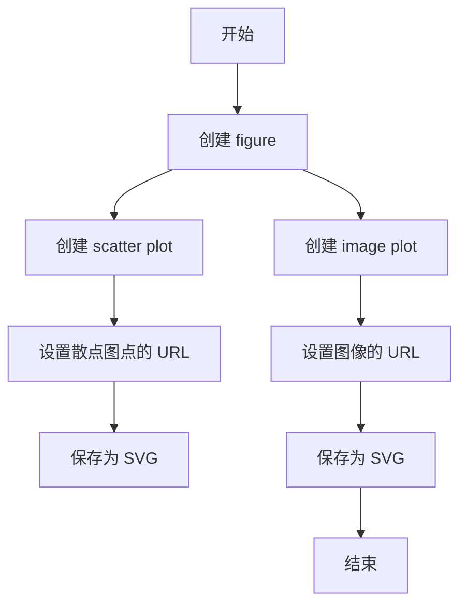
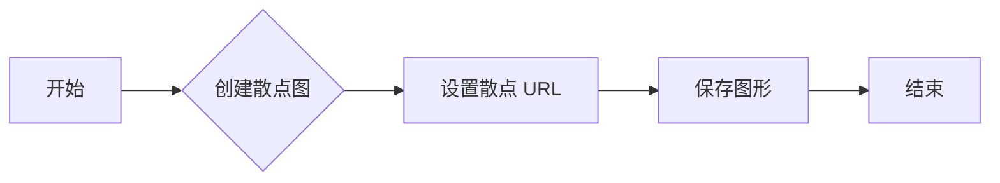
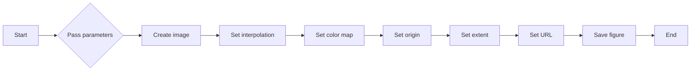
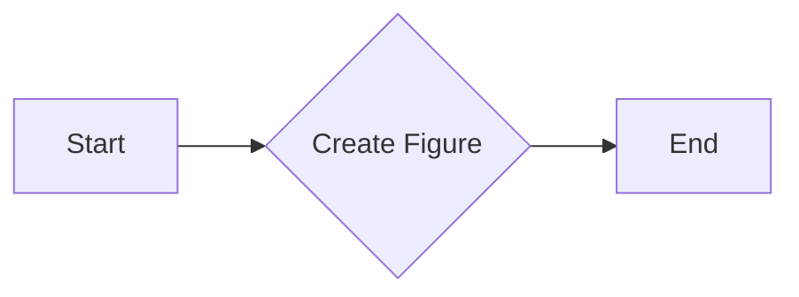
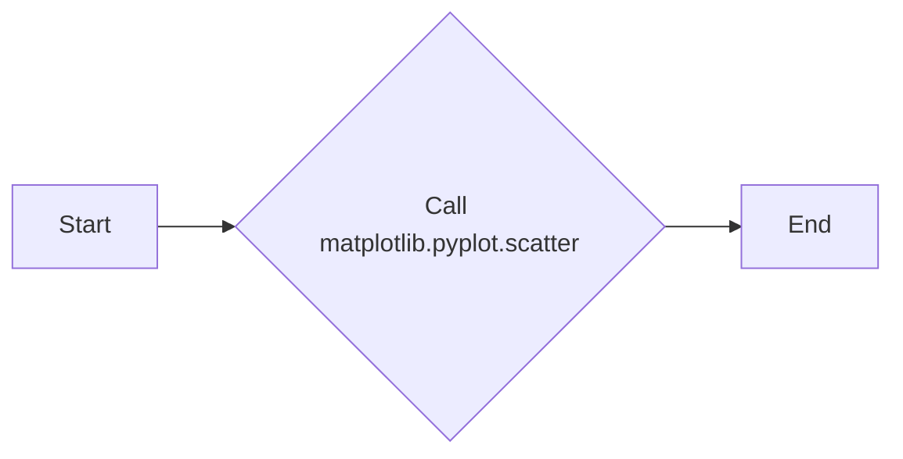
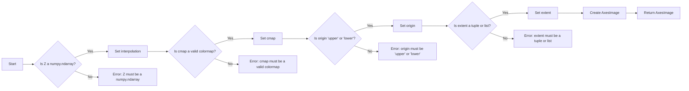

# `matplotlib\galleries\examples\misc\hyperlinks_sgskip.py` 详细设计文档

This code demonstrates the use of hyperlinks on various elements in matplotlib plots, specifically scatter points and images, using the SVG backend.

## 整体流程



## 类结构

```
matplotlib.pyplot (matplotlib 库)
├── figure (创建图形对象)
│   ├── scatter (创建散点图)
│   └── imshow (创建图像图)
└── savefig (保存图形为文件)
```

## 全局变量及字段


### `fig`
    
The main figure object for the plot.

类型：`matplotlib.figure.Figure`
    


### `s`
    
The scatter plot line object.

类型：`matplotlib.lines.Line2D`
    


### `im`
    
The image plot object.

类型：`matplotlib.images.AxesImage`
    


### `delta`
    
The step size for the range of x and y values.

类型：`float`
    


### `x`
    
The x values for the plot.

类型：`numpy.ndarray`
    


### `y`
    
The y values for the plot.

类型：`numpy.ndarray`
    


### `X`
    
The meshgrid of x values.

类型：`numpy.ndarray`
    


### `Y`
    
The meshgrid of y values.

类型：`numpy.ndarray`
    


### `Z1`
    
The first function's result array.

类型：`numpy.ndarray`
    


### `Z2`
    
The second function's result array.

类型：`numpy.ndarray`
    


### `Z`
    
The combined result array for the plot.

类型：`numpy.ndarray`
    


### `matplotlib.pyplot.figure`
    
The main figure object for the plot.

类型：`matplotlib.figure.Figure`
    


### `matplotlib.pyplot.scatter`
    
The scatter plot line object.

类型：`matplotlib.lines.Line2D`
    


### `matplotlib.pyplot.imshow`
    
The image plot object.

类型：`matplotlib.images.AxesImage`
    


### `matplotlib.pyplot.savefig`
    
Function to save the figure to a file.

类型：`function`
    
    

## 全局函数及方法


### scatter

scatter 方法用于在 Matplotlib 图形中创建散点图，并设置每个散点对应的 URL。

参数：

- `x`：`numpy.ndarray`，散点在 x 轴上的坐标。
- `y`：`numpy.ndarray`，散点在 y 轴上的坐标。

返回值：`matplotlib.collections.PathCollection`，散点图的路径集合。

#### 流程图



#### 带注释源码

```python
fig = plt.figure()
s = plt.scatter([1, 2, 3], [4, 5, 6])  # 创建散点图
s.set_urls(['https://www.bbc.com/news', 'https://www.google.com/', None])  # 设置散点 URL
fig.savefig('scatter.svg')  # 保存图形
```


### imshow

`imshow` 是一个用于显示图像的函数。

参数：

- `Z`：`numpy.ndarray`，图像数据，通常是二维数组。
- `interpolation`：`str`，插值方法，默认为 'bilinear'。
- `cmap`：`str` 或 `Colormap`，颜色映射，默认为 'gray'。
- `origin`：`str`，图像原点位置，默认为 'lower'。
- `extent`：`tuple`，图像的显示范围，默认为 (-3, 3, -3, 3)。

返回值：`AxesImage`，图像对象。

#### 流程图



#### 带注释源码

```python
im = plt.imshow(Z, interpolation='bilinear', cmap="gray",
                origin='lower', extent=(-3, 3, -3, 3))

im.set_url('https://www.google.com/')
fig.savefig('image.svg')
```


### fig.savefig('scatter.svg')

该函数用于将matplotlib图形保存为SVG格式的文件。

参数：

- `scatter.svg`：`str`，指定保存的文件名。

返回值：`None`，没有返回值。

#### 流程图

```mermaid
graph LR
A[开始] --> B{调用fig.savefig('scatter.svg')}
B --> C[结束]
```

#### 带注释源码

```python
fig.savefig('scatter.svg')
```


### plt.figure()

创建一个新的matplotlib图形。

描述：

`plt.figure()` 函数用于创建一个新的图形，并返回一个Figure对象。这个图形可以用来绘制各种图表。

参数：

- 无

返回值：`Figure`，一个matplotlib图形对象。

#### 流程图



#### 带注释源码

```python
fig = plt.figure()  # 创建一个新的图形对象
```


### matplotlib.pyplot.scatter

matplotlib.pyplot.scatter 是一个用于在二维平面上绘制散点图的函数。

参数：

- `x`：`array_like`，散点在 x 轴上的坐标。
- `y`：`array_like`，散点在 y 轴上的坐标。
- `s`：`array_like`，散点的大小，默认为 None。
- `c`：`array_like`，散点的颜色，默认为 None。
- `cmap`：`str` 或 `Colormap`，颜色映射，默认为 None。
- `vmin`：`float`，颜色映射的最小值，默认为 None。
- `vmax`：`float`，颜色映射的最大值，默认为 None。
- `alpha`：`float`，散点的透明度，默认为 1.0。
- `edgecolors`：`color`，散点边缘的颜色，默认为 'k'。
- `linewidths`：`float` 或 `array_like`，散点边缘的宽度，默认为 None。
- ` marker`：`str` 或 `path`，散点的标记形状，默认为 'o'。
- `clip_on`：`bool`，是否将散点限制在轴的界限内，默认为 True。

返回值：`Scatter` 对象，表示绘制的散点图。

#### 流程图



#### 带注释源码

```python
import matplotlib.pyplot as plt
import numpy as np

fig = plt.figure()
s = plt.scatter([1, 2, 3], [4, 5, 6])
s.set_urls(['https://www.bbc.com/news', 'https://www.google.com/', None])
fig.savefig('scatter.svg')
```


### `matplotlib.pyplot.imshow`

`imshow` 是 `matplotlib.pyplot` 模块中的一个函数，用于显示图像数据。

参数：

- `Z`：`numpy.ndarray`，图像数据，通常是二维数组。
- `interpolation`：`str`，插值方法，默认为 'nearest'。
- `cmap`：`str` 或 `Colormap`，颜色映射，默认为 'viridis'。
- `origin`：`str`，图像的起始点，默认为 'upper'。
- `extent`：`tuple` 或 `list`，图像的边界，默认为 (0, 1, 0, 1)。

返回值：`AxesImage`，图像对象。

#### 流程图



#### 带注释源码

```python
import numpy as np
import matplotlib.pyplot as plt

# 创建图像数据
Z = np.exp(-X**2 - Y**2)
Z2 = np.exp(-(X - 1)**2 - (Y - 1)**2)
Z = (Z1 - Z2) * 2

# 显示图像
im = plt.imshow(Z, interpolation='bilinear', cmap="gray",
                origin='lower', extent=(-3, 3, -3, 3))

# 设置超链接
im.set_url('https://www.google.com/')

# 保存图像
fig.savefig('image.svg')
```


### `matplotlib.pyplot.savefig`

保存当前图形为文件。

参数：

- `filename`：`str`，保存图形的文件名。
- `dpi`：`int`，图像的分辨率（每英寸点数），默认为100。
- `bbox_inches`：`str`，指定保存图形时包含的边界框，默认为'tight'。
- `pad_inches`：`float`，在边界框周围添加的额外空白边缘，默认为0.1。
- `format`：`str`，保存的文件格式，默认为'png'。

返回值：`None`，无返回值。

#### 流程图

```mermaid
graph LR
A[开始] --> B{调用fig.savefig('scatter.svg')}
B --> C[结束]
```

#### 带注释源码

```python
fig.savefig('scatter.svg')  # 保存当前图形为scatter.svg文件
```


## 关键组件


### 张量索引与惰性加载

张量索引与惰性加载允许在处理大型数据集时，只加载和处理需要的数据部分，从而提高效率。

### 反量化支持

反量化支持使得代码能够处理非整数类型的量化数据，增加了代码的灵活性和适用范围。

### 量化策略

量化策略定义了如何将浮点数数据转换为固定点数表示，以减少计算资源消耗和提高运行速度。


## 问题及建议


### 已知问题

-   {问题1}：代码仅支持SVG后端，限制了其适用性。如果需要支持其他图形后端，如PDF或PNG，代码需要进行相应的修改。
-   {问题2}：代码中使用了全局变量`fig`，这可能导致代码的可重用性和可维护性降低。全局变量的使用应该尽量避免。
-   {问题3}：代码中使用了`set_urls`和`set_url`方法，但没有提供错误处理机制，如果URL格式不正确或无法访问，代码可能会抛出异常。
-   {问题4}：代码没有提供任何形式的日志记录或调试信息，这可能会在问题发生时难以追踪和解决。

### 优化建议

-   {建议1}：扩展代码以支持多种图形后端，如PDF和PNG，以提高其通用性和适用性。
-   {建议2}：避免使用全局变量，通过函数参数或类成员变量来传递数据，以提高代码的可重用性和可维护性。
-   {建议3}：在设置URL时添加错误处理机制，例如使用try-except语句捕获异常，并提供用户友好的错误信息。
-   {建议4}：添加日志记录功能，以便在开发和维护过程中跟踪代码的执行情况，并帮助诊断问题。
-   {建议5}：考虑使用更高级的图形库，如`plotly`或`bokeh`，这些库提供了更丰富的交互式图形功能，并支持多种后端。


## 其它


### 设计目标与约束

- 设计目标：实现一个能够为matplotlib图形元素设置超链接的功能，目前仅支持SVG后端。
- 约束条件：仅支持SVG后端，不兼容其他图形后端。

### 错误处理与异常设计

- 错误处理：当尝试为不支持后端设置超链接时，应抛出异常。
- 异常设计：定义自定义异常类，如`UnsupportedBackendError`，用于处理后端不支持的错误。

### 数据流与状态机

- 数据流：用户通过matplotlib的API设置超链接，数据流从用户输入到matplotlib图形元素，然后保存为SVG文件。
- 状态机：无状态机，数据流直接从输入到输出。

### 外部依赖与接口契约

- 外部依赖：matplotlib和numpy库。
- 接口契约：matplotlib的scatter和imshow方法支持set_url方法来设置超链接。


    