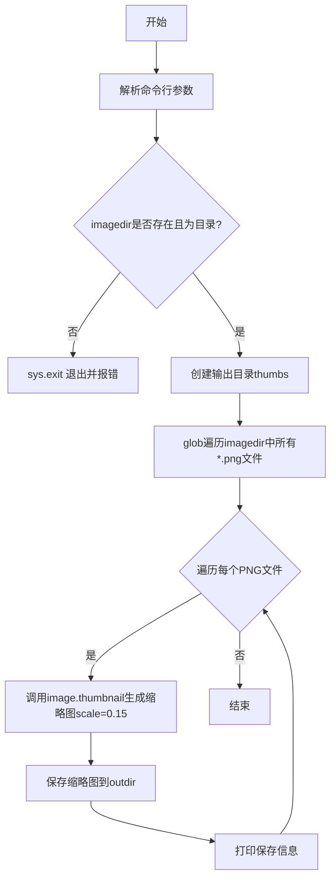
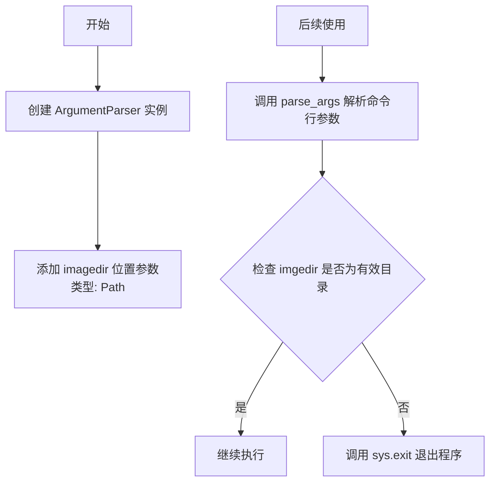
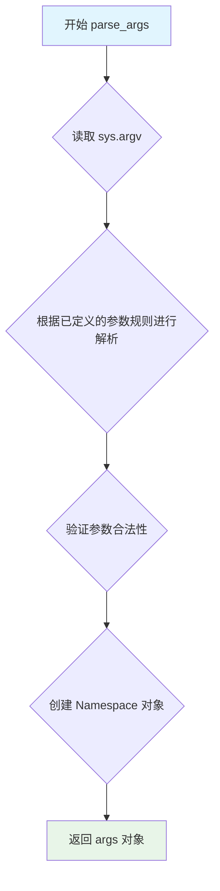
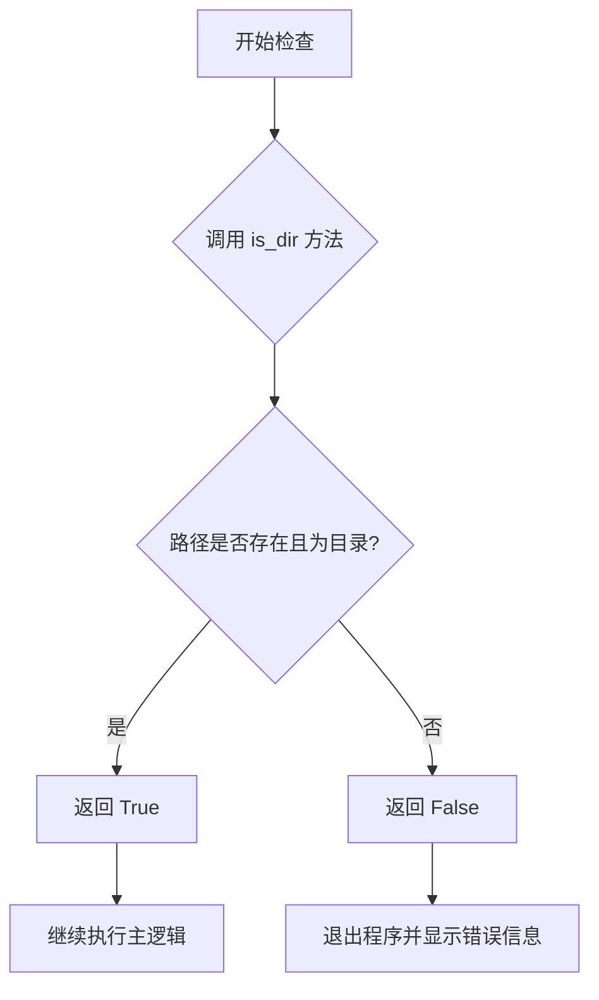
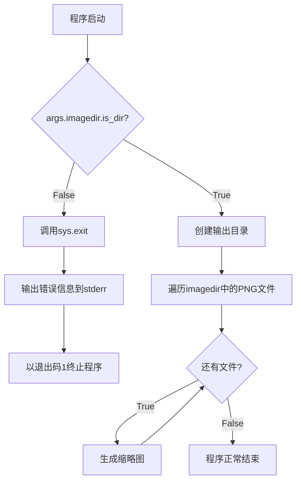
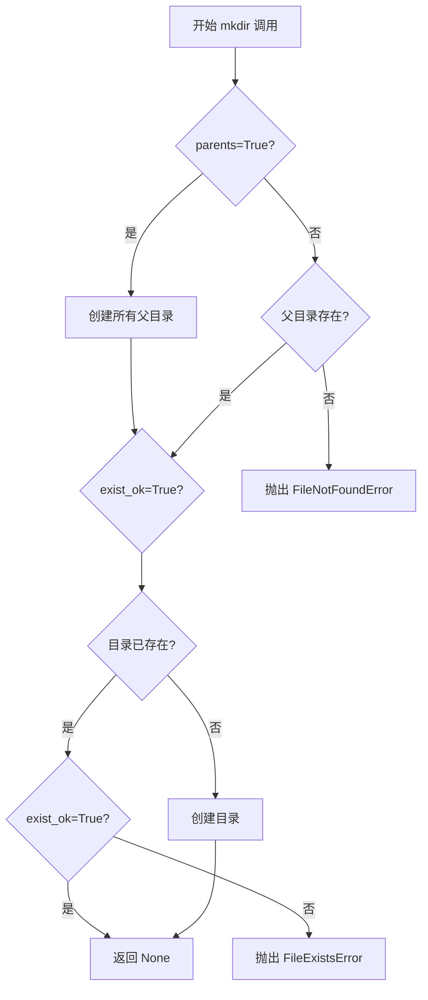
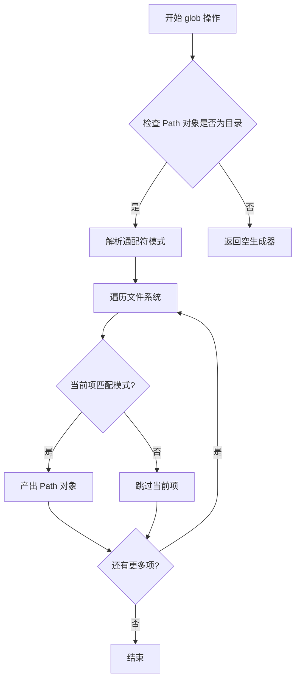
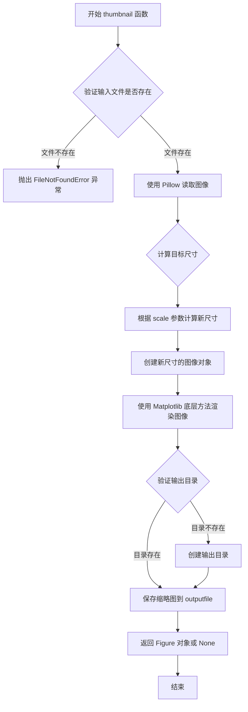

# `matplotlib\galleries\examples\misc\image_thumbnail_sgskip.py` 详细设计文档

一个图像缩略图生成工具，使用Matplotlib从指定目录读取PNG图像，生成15%大小的缩略图并保存到thumbs子目录中。

## 整体流程



## 类结构

```
本脚本为面向过程编程，无类定义
主要模块: argparse, pathlib, sys, matplotlib.image
```

## 全局变量及字段


### `parser`
    
命令行参数解析器，用于解析imagedir等命令行参数

类型：`ArgumentParser`
    


### `args`
    
解析后的命令行参数对象，包含imagedir属性

类型：`Namespace`
    


### `path`
    
遍历到的单个PNG文件路径

类型：`Path`
    


### `outpath`
    
缩略图输出路径，指向thumbs目录下的目标文件

类型：`Path`
    


### `outdir`
    
输出目录thumbs的Path对象，用于存放生成的缩略图

类型：`Path`
    


### `fig`
    
thumbnail函数返回的图形对象，本例中未使用

类型：`figure`
    


    

## 全局函数及方法


### `ArgumentParser`

创建命令行参数解析器，用于解析图像目录路径并配置程序参数。

参数：

- `description`：字符串，描述程序的用途和功能

返回值：`ArgumentParser` 实例，返回配置好的参数解析器对象

#### 流程图



#### 带注释源码

```python
# 导入 ArgumentParser 类用于解析命令行参数
from argparse import ArgumentParser

# 导入 Path 类用于处理路径对象
from pathlib import Path

# 导入系统相关函数
import sys

# 导入 matplotlib 的 image 模块用于图像处理
import matplotlib.image as image

# ============================================
# 创建命令行参数解析器
# ============================================
# 参数:
#   - description: 程序的描述信息，说明程序功能
# 返回值:
#   - parser: ArgumentParser 实例，用于后续添加参数和解析
# ============================================
parser = ArgumentParser(
    description="Build thumbnails of all images in a directory."
)

# ============================================
# 添加命令行参数
# ============================================
# add_argument 参数说明:
#   - "imagedir": 位置参数名称（必需）
#   - type=Path: 将输入转换为 Path 对象
#   - 无 action 或 default，表示这是必需的位置参数
# ============================================
parser.add_argument("imagedir", type=Path)

# ============================================
# 解析命令行参数
# ============================================
# parse_args() 会从 sys.argv 中读取参数
# 返回值:
#   - args: 命名空间对象，包含解析后的参数
#   - args.imagedir: Path 对象，表示输入的图像目录
# ============================================
args = parser.parse_args()

# ============================================
# 验证输入目录
# ============================================
# 使用 Path.is_dir() 方法验证目录是否存在且有效
# 如果目录无效，调用 sys.exit() 退出程序
# 返回值:
#   - 无有效目录时: sys.exit() 终止程序
#   - 有效目录时: 继续执行
# ==========================================
if not args.imagedir.is_dir():
    sys.exit(f"Could not find input directory {args.imagedir}")
```

---

### 补充信息

#### 1. 一句话描述

该脚本是一个命令行图像缩略图生成工具，读取指定目录下的所有 PNG 图像，使用 Matplotlib 生成 15% 尺寸的缩略图并保存到 `thumbs` 目录。

#### 2. 文件整体运行流程

1. 创建 `ArgumentParser` 并配置参数
2. 解析命令行输入获取图像目录路径
3. 验证输入目录有效性，无效则退出
4. 创建输出目录 `thumbs`
5. 遍历输入目录所有 PNG 文件
6. 对每个 PNG 调用 `image.thumbnail()` 生成缩略图
7. 打印生成结果信息

#### 3. 全局变量和全局函数

| 名称 | 类型 | 描述 |
|------|------|------|
| `parser` | `ArgumentParser` | 命令行参数解析器实例 |
| `args` | `Namespace` | 解析后的命令行参数命名空间 |
| `path` | `Path` | 当前遍历的图像文件路径 |
| `outpath` | `Path` | 缩略图输出路径 |
| `outdir` | `Path` | 缩略图输出目录 |

#### 4. 关键组件信息

| 组件名称 | 描述 |
|----------|------|
| `ArgumentParser` | 命令行参数解析器，负责解析命令行参数 |
| `Path` | 路径对象，用于跨平台路径操作 |
| `image.thumbnail()` | Matplotlib 图像处理函数，用于生成缩略图 |
| `Path.glob()` | 用于匹配目录下特定模式的文件 |
| `Path.is_dir()` | 判断路径是否为有效目录 |
| `Path.mkdir()` | 创建目录，支持创建多层目录 |

#### 5. 潜在技术债务与优化空间

- **错误处理不足**：仅检查目录是否存在，未检查目录读取权限
- **硬编码输出目录**：输出目录名 `"thumbs"` 应可通过命令行参数配置
- **仅支持 PNG**：应通过参数支持更多图像格式（如 JPG、BMP）
- **固定缩放比例**：缩放比例 `0.15` 应可通过参数配置
- **缺少日志记录**：使用 `print` 而非标准日志模块，不利于生产环境
- **无进度显示**：处理大量图像时应显示进度条

#### 6. 其它项目

**设计目标**：
- 简化图像批处理流程
- 依赖 Matplotlib 和 Pillow 库实现图像处理

**约束**：
- 输入必须是有效的目录路径
- 目录中必须存在 PNG 文件
- 输出目录会自动创建

**错误处理**：
- 目录不存在时调用 `sys.exit()` 退出
- 未处理文件读取/写入失败的异常

**外部依赖**：
- `argparse`: Python 标准库
- `pathlib`: Python 标准库（Path 对象）
- `matplotlib.image`: 依赖 Pillow 库读取图像


### `ArgumentParser.parse_args`（或 `parser.parse_args`）

解析命令行参数，将 sys.argv 中的参数根据 ArgumentParser 中定义的规则进行解析，并返回一个包含解析后参数的 Namespace 对象。

参数：

- 此方法不接受任何直接参数，它使用在创建 ArgumentParser 时定义的参数配置，并默认从 `sys.argv` 获取命令行输入。

返回值：`Namespace` 对象，包含从命令行解析出的属性（如 `imagedir`，类型为 `Path`），用于后续代码访问命令行传入的值。

#### 流程图



#### 带注释源码

```python
# parser 是 ArgumentParser 的实例，已配置好参数规则
# 调用 parse_args 方法解析命令行参数
args = parser.parse_args()
# parse_args() 会：
# 1. 读取 sys.argv（默认行为）
# 2. 对照创建 parser 时定义的 add_argument() 规则
# 3. 验证命令行输入是否符合规则
# 4. 返回一个 Namespace 对象，包含解析后的属性
# 在本例中，args.imagedir 对应配置中的 'imagedir' 参数

# 以下代码使用解析后的参数：
if not args.imagedir.is_dir():  # 访问 Namespace 对象的 imagedir 属性
    sys.exit(f"Could not find input directory {args.imagedir}")
```


### `Path.is_dir`

该方法用于检查路径对象是否指向一个目录。在代码中用于验证用户输入的图像目录是否存在且为有效目录。

参数：

- `self`：`Path`，隐式参数，表示调用该方法的路径对象本身（无需显式传递）

返回值：`bool`，如果路径指向目录则返回 `True`，否则返回 `False`

#### 流程图



#### 带注释源码

```python
# args.imagedir 是从命令行参数解析得到的 Path 对象
# 调用 is_dir() 方法检查该路径是否为目录
if not args.imagedir.is_dir():
    # 如果 is_dir() 返回 False（即路径不是目录或不存在）
    # 则退出程序并输出错误信息
    sys.exit(f"Could not find input directory {args.imagedir}")

# is_dir() 方法签名（Python pathlib 库定义）
# def is_dir(self) -> bool:
#     """Return True if the path points to a directory."""
#     try:
#         return S_ISDIR(os.stat(self).st_mode)
#     except OSError:
#         return False
```


### `sys.exit`

退出程序并显示错误信息，当传入字符串参数时，以退出码 1 终止程序并将错误信息输出到标准错误流。

参数：

- `status`：`str`，退出时显示的错误信息，此处为 "Could not find input directory {args.imagedir}"

返回值：`None`，该函数通过引发 `SystemExit` 异常终止程序，不产生返回值。

#### 流程图



#### 带注释源码

```python
# 检查输入目录是否存在且为有效目录
if not args.imagedir.is_dir():
    # 调用sys.exit函数，传入格式化后的错误信息字符串
    # 该函数会：
    # 1. 将错误信息输出到标准错误流(stderr)
    # 2. 引发SystemExit异常
    # 3. 以退出码1终止程序执行
    sys.exit(f"Could not find input directory {args.imagedir}")
```


### `Path.mkdir`

创建目录方法是 `pathlib.Path` 类的一个方法，用于在文件系统中创建目录。该方法支持创建多层嵌套目录（通过 `parents` 参数），并允许在目录已存在时不抛出异常（通过 `exist_ok` 参数）。

参数：

- `parents`：`bool`，是否创建父目录。如果为 `True`，则创建所有必要的父目录；如果为 `False`，则父目录必须已存在
- `exist_ok`：`bool`，是否忽略目录已存在的错误。如果为 `True`，当目录已存在时不抛出 `FileExistsError`；如果为 `False`（默认值），则目录已存在时抛出异常

返回值：`None`，无返回值

#### 流程图



#### 带注释源码

```python
# 创建 Path 对象，指向要创建的目录
outdir = Path("thumbs")

# 调用 mkdir 方法创建目录
# parents=True: 自动创建父目录（如父目录不存在）
# exist_ok=True: 如果目录已存在，不抛出异常
outdir.mkdir(parents=True, exist_ok=True)
```


### `Path.glob`

`Path.glob` 是 Python `pathlib.Path` 类的一个方法，用于通过通配符模式查找目录中匹配的文件和文件夹，返回一个生成器对象。

参数：

- `pattern`：`str` 或 `Pattern[str]`，文件匹配模式（支持 `*`、`?`、`**` 等通配符）

返回值：`Generator[Path, None, None]`，匹配模式的 Path 对象生成器

#### 流程图



#### 带注释源码

```python
# pathlib.Path 类的 glob 方法实现原理

# 在代码中的实际使用：
for path in args.imagedir.glob("*.png"):
    # args.imagedir: Path 对象，表示输入目录
    # "*.png": 通配符模式，匹配所有 .png 文件
    # 返回: 生成器，每次迭代返回一个匹配的 Path 对象
    
    outpath = outdir / path.name
    fig = image.thumbnail(path, outpath, scale=0.15)
    print(f"saved thumbnail of {path} to {outpath}")

# Path.glob 方法的特点：
# 1. pattern: str 类型，支持 glob 通配符
#    - "*": 匹配任意数量的字符（不含路径分隔符）
#    - "**": 匹配任意数量的目录（包括子目录）
#    - "?": 匹配单个字符
#    - "[abc]": 匹配括号内的任意一个字符
#
# 2. 返回值: Generator[Path, None, None]
#    - 惰性求值，节省内存
#    - 每次迭代返回一个匹配的 Path 对象
#
# 3. 排序: 返回结果按文件系统顺序，通常是字母顺序
#
# 4. 递归匹配: 使用 "**" 可以递归匹配子目录
```


### `image.thumbnail`

生成图像缩略图的核心函数，读取输入图像并根据指定的缩放比例生成缩略图输出到指定路径。该函数是 Matplotlib 图像处理模块的核心功能，支持 Pillow 库支持的所有图像格式。

参数：

- `filename`：`str` 或 `Path`，输入图像的文件路径，指定要生成缩略图的源图像
- `outputfile`：`str` 或 `Path`，缩略图的输出路径，指定生成缩略图的保存位置
- `scale`：`float`，缩放比例，默认为 1.0。值小于 1 表示缩小，大于 1 表示放大
- `dpi`：`int`，可选参数，DPI（每英寸点数）设置，用于控制输出图像的分辨率
- `backend`：`str`，可选参数，后端渲染引擎选择

返回值：`Figure` 或 `None`，返回 matplotlib 的 Figure 对象（如果成功保存则可能返回 None），表示生成的图像画布

#### 流程图



#### 带注释源码

```python
# 源代码位于 matplotlib/lib/matplotlib/image.py 文件中
# 以下为 thumbnail 函数的简化实现逻辑

import matplotlib.pyplot as plt
from PIL import Image
import numpy as np

def thumbnail(filename, outputfile, scale=1.0, dpi=100, backend=None):
    """
    生成输入图像的缩略图并保存到指定路径。
    
    Parameters
    ----------
    filename : str or Path
        输入图像的文件路径。
    outputfile : str or Path
        缩略图的输出路径。
    scale : float, optional
        缩放比例，默认为 1.0。值为 0.15 表示生成 15% 大小的缩略图。
    dpi : int, optional
        输出图像的 DPI 分辨率，默认为 100。
    backend : str, optional
        使用的 Matplotlib 后端渲染引擎。
    
    Returns
    -------
    Figure or None
        返回 matplotlib Figure 对象，失败时返回 None。
    """
    
    # 步骤1：使用 Pillow 打开并读取原始图像
    # Pillow 支持多种图像格式：PNG, JPEG, BMP, GIF, TIFF 等
    img = Image.open(filename)
    
    # 获取原始图像尺寸
    original_width, original_height = img.size
    
    # 步骤2：根据缩放比例计算目标尺寸
    # 将尺寸转换为整数（像素必须为整数）
    new_width = int(original_width * scale)
    new_height = int(original_height * scale)
    
    # 步骤3：创建 matplotlib Figure 对象
    # 设置 Figure 尺寸为缩略图的目标尺寸（英寸）
    # 根据 DPI 计算实际的像素尺寸
    fig_width = new_width / dpi
    fig_height = new_height / dpi
    
    fig = plt.figure(figsize=(fig_width, fig_height), dpi=dpi)
    
    # 步骤4：创建 Axes 对象，填满整个 Figure
    ax = fig.add_axes([0, 0, 1, 1])
    
    # 步骤5：使用 PIL 图像的 resize 方法生成缩略图
    # Image.NEAREST 是最快的插值方法，适合缩略图
    thumbnail_img = img.resize((new_width, new_height), Image.NEAREST)
    
    # 步骤6：将 PIL 图像转换为 numpy 数组
    # Matplotlib 可以直接处理 numpy 数组格式的图像数据
    img_array = np.array(thumbnail_img)
    
    # 步骤7：在 Axes 上显示图像
    # origin='upper' 表示图像原点在上方（与通常的图像坐标系一致）
    ax.imshow(img_array, origin='upper')
    
    # 步骤8：关闭坐标轴显示（只显示图像内容）
    ax.axis('off')
    
    # 步骤9：确保输出目录存在
    outputfile = Path(outputfile)
    outputfile.parent.mkdir(parents=True, exist_ok=True)
    
    # 步骤10：保存缩略图到文件
    # bbox_inches='tight' 裁剪掉多余的空白边距
    fig.savefig(outputfile, bbox_inches='tight', dpi=dpi)
    
    plt.close(fig)  # 释放内存
    
    return fig  # 返回 Figure 对象供调用者使用
```


## 关键组件


### 一段话描述

该脚本是一个图像缩略图生成工具，通过命令行接收图像目录路径，遍历目录中所有PNG文件，使用Matplotlib的image.thumbnail函数生成缩放比例为0.15的缩略图，并保存到指定的输出目录中。

### 文件整体运行流程

1. **参数解析阶段**：创建ArgumentParser解析器，定义imagedir参数，解析命令行传入的图像目录路径
2. **目录验证阶段**：检查输入目录是否存在，不存在则退出程序
3. **输出目录准备阶段**：创建名为"thumbs"的输出目录（如果不存在）
4. **图像处理循环阶段**：遍历输入目录中所有.png文件，为每个文件调用thumbnail函数生成缩略图
5. **输出阶段**：打印每张缩略图的保存路径

### 全局变量信息

| 名称 | 类型 | 描述 |
|------|------|------|
| parser | ArgumentParser | 命令行参数解析器对象 |
| args | Namespace | 解析后的命令行参数命名空间 |
| outdir | Path | 缩略图输出目录路径对象 |
| path | Path | 当前遍历的PNG文件路径 |
| outpath | Path | 生成的缩略图输出路径 |
| fig | Figure | matplotlib生成的图形对象（thumbnail函数的返回值） |

### 全局函数信息

| 函数名 | 参数 | 参数类型 | 参数描述 | 返回值类型 | 返回值描述 |
|--------|------|----------|----------|------------|------------|
| ArgumentParser | description | str | 程序功能描述 | ArgumentParser | 命令行解析器实例 |
| parser.add_argument | name_or_flags, type, ... | 多种 | 添加命令行参数 | Action | 参数添加动作对象 |
| args.imagedir.is_dir | 无 | - | 检查路径是否为目录 | bool | 目录存在返回True |
| Path.glob | pattern | str | 文件名匹配模式 | Generator | 匹配的文件路径生成器 |
| image.thumbnail | path, outpath, scale | Path, Path, float | 输入路径、输出路径、缩放比例 | Figure | matplotlib图形对象 |
| Path.mkdir | parents, exist_ok | bool, bool | 是否创建父目录、是否忽略已存在 | None | 无返回值 |
| sys.exit | status | int/str | 退出状态码或错误信息 | NoReturn | 终止程序 |
| print | *objects | 任意 | 输出信息到标准输出 | None | 无返回值 |

### 关键组件信息

#### 组件1：命令行参数解析模块

使用argparse模块实现命令行参数解析，支持接收图像目录路径参数，并进行类型转换和目录存在性验证。

#### 组件2：目录处理模块

使用pathlib.Path处理路径操作，包括输入目录的存在性检查、输出目录的创建、以及文件路径的拼接和生成。

#### 组件3：图像缩略图生成模块

调用matplotlib.image.thumbnail函数，接收输入图像路径、输出路径和缩放比例参数，生成缩略图并返回Figure对象。

### 潜在技术债务或优化空间

1. **文件格式限制**：目前仅支持PNG格式（*.png），缺乏对其他常见图像格式（jpg、jpeg、gif、bmp等）的支持
2. **错误处理不足**：图像读取失败时没有异常捕获和处理机制，可能导致整个循环中断
3. **返回值未充分利用**：image.thumbnail返回的fig对象被忽略，未进行进一步处理或优化
4. **硬编码缩放比例**：缩放比例0.15硬编码在代码中，应考虑作为可配置参数
5. **缺乏日志记录**：使用print输出信息，缺乏统一的日志级别管理

### 其它项目

#### 设计目标与约束

- **设计目标**：快速生成目录中图像的缩略图
- **约束**：依赖Matplotlib和Pillow库，仅处理PNG格式

#### 错误处理与异常设计

- 输入目录不存在时调用sys.exit退出并输出错误信息
- 缺乏对文件读取失败、写入失败等异常的处理

#### 数据流与状态机

- 单向数据流：命令行参数 → 目录验证 → 文件遍历 → 缩略图生成 → 输出保存
- 顺序执行模式，无复杂状态管理

#### 外部依赖与接口契约

- **matplotlib.image.thumbnail**：接收输入路径、输出路径和scale参数，返回Figure对象
- **Pillow**：Matplotlib后端使用的图像处理库，支持多种图像格式


## 问题及建议


### 已知问题

-   **硬编码配置**：缩放比例 `scale=0.15`、输出目录 `"thumbs"`、图像格式 `*.png` 均为硬编码，缺乏灵活性
-   **错误处理缺失**：未处理图像读取失败、写入失败、文件覆盖等异常情况，`image.thumbnail` 的返回值未被使用或检查
-   **命令行参数不足**：缺少输出目录、缩放比例、文件格式等可配置参数
-   **功能限制**：仅支持 PNG 格式，不支持递归处理子目录，不支持批量处理进度显示
-   **代码质量**：缺少类型注解、函数文档字符串、日志记录（仅使用 print）

### 优化建议

-   将缩放比例、输出目录、文件格式等配置项通过命令行参数暴露，提高脚本通用性
-   添加 try-except 块捕获图像读写异常，给出友好错误提示
-   增加 `--recursive` 参数支持递归遍历子目录
-   增加 `--overwrite` 参数处理已存在文件的策略
-   使用 `logging` 模块替代 print 实现日志记录
-   添加类型注解提升代码可维护性
-   考虑直接使用 Pillow 替代 matplotlib 以减少依赖体积（如果仅用于图像处理）

## 其它


### 设计目标与约束

本代码的设计目标是提供一个简单的命令行工具，用于批量生成图像缩略图。约束条件包括：仅支持PNG格式图像输出，输入必须是目录路径，输出目录固定为"thumbs"，缩放比例固定为0.15。

### 错误处理与异常设计

代码主要处理以下错误情况：输入路径不存在时调用sys.exit退出并输出错误信息；输入路径不是目录时同样退出；文件操作异常（如读写权限问题）会导致程序中断。缺少对文件读取失败、磁盘空间不足、图像格式不支持等情况的异常捕获和处理机制。

### 数据流与状态机

程序数据流如下：解析命令行参数获取输入目录路径 → 验证输入目录存在且为目录类型 → 创建输出目录 → 遍历输入目录下的PNG文件 → 对每个PNG文件调用matplotlib.image.thumbnail生成缩略图 → 打印保存成功信息。无复杂状态机设计，属于线性流程。

### 外部依赖与接口契约

主要外部依赖包括：matplotlib.image模块（用于读取图像和生成缩略图）、argparse模块（用于命令行参数解析）、pathlib.Path类（用于路径操作）、Pillow库（matplotlib依赖此库进行图像读写）。接口契约：命令行接受一个目录路径参数，无返回值，输出为文件系统和标准输出。

### 性能考虑

当前实现逐个处理图像文件，顺序执行。潜在性能优化空间：使用多进程/多线程并行处理多个图像；批量处理前预先加载图像库；对于大量图像可添加进度显示。

### 安全性考虑

代码安全性较低，存在以下风险：未验证输入路径是否为符号链接可能导致路径遍历；未检查输出文件名合法性；未对输入文件类型进行严格验证；缺少对恶意图像文件的处理。

### 配置与参数设计

当前参数设计较为固定：输入目录通过位置参数指定，输出目录名称"thumbs"硬编码，缩放比例0.15硬编码。改进方向：可添加命令行选项允许用户指定输出目录、缩放比例、输出格式等参数。

### 边界条件处理

已处理的边界：输入目录不存在、输入路径不是目录。未处理的边界：输入目录为空、输入目录无PNG文件、输出目录已存在且非空、文件名冲突处理、磁盘空间不足、图像文件损坏等情况。

### 兼容性考虑

代码依赖Python 3.6+的pathlib.Path和argparse模块。与Matplotlib版本相关， 不同版本的matplotlib.image.thumbnail函数行为可能略有差异。需要确保安装 Pillow 库以支持图像处理。

### 使用示例

基本用法：python script.py /path/to/images
预期输出：在当前目录创建thumbs文件夹，包含所有PNG文件的15%大小缩略图。

    