# `matplotlib\galleries\examples\misc\keyword_plotting.py` 详细设计文档

This code generates a scatter plot using a structured numpy array or pandas DataFrame as input, where the data is accessed via string index access.

## 整体流程

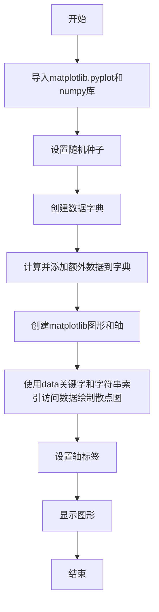

## 类结构

```
matplotlib.pyplot (全局库)
├── np (全局库)
└── data (全局变量)
```

## 全局变量及字段


### `data`
    
A dictionary containing the data to be plotted.

类型：`dict`
    


### `fig`
    
The figure object created by subplots.

类型：`matplotlib.figure.Figure`
    


### `ax`
    
The axes object created by subplots, used for plotting.

类型：`matplotlib.axes._subplots.AxesSubplot`
    


### `np`
    
The NumPy module, used for numerical operations.

类型：`numpy`
    


### `plt`
    
The Matplotlib pyplot module, used for plotting.

类型：`matplotlib.pyplot`
    


### `np.random`
    
The NumPy random module, used for generating random numbers.

类型：`numpy.random`
    


### `np.arange`
    
NumPy function to create an array with evenly spaced values.

类型：`numpy.ndarray`
    


### `np.random.randn`
    
NumPy function to generate normally distributed random numbers.

类型：`numpy.ndarray`
    


### `np.abs`
    
NumPy function to compute the absolute value of an array.

类型：`numpy.ndarray`
    


### `np.random.randint`
    
NumPy function to generate random integers within a specified range.

类型：`numpy.ndarray`
    


### `plt.subplots`
    
Function to create a figure and a set of subplots.

类型：`matplotlib.figure.Figure, matplotlib.axes._subplots.AxesSubplot`
    


### `ax.scatter`
    
Function to create a scatter plot.

类型：`None`
    


### `ax.set_xlabel`
    
Function to set the label for the x-axis of the plot.

类型：`None`
    


### `ax.set_ylabel`
    
Function to set the label for the y-axis of the plot.

类型：`None`
    


### `plt.show`
    
Function to display the plot.

类型：`None`
    


### `np.seed`
    
Function to set the seed for the random number generator in NumPy.

类型：`None`
    


### `np.abs`
    
NumPy function to compute the absolute value of an array.

类型：`numpy.ndarray`
    


### `matplotlib.pyplot.fig`
    
The figure object created by subplots.

类型：`matplotlib.figure.Figure`
    


### `matplotlib.pyplot.ax`
    
The axes object created by subplots, used for plotting.

类型：`matplotlib.axes._subplots.AxesSubplot`
    


### `None.data`
    
A dictionary containing the data to be plotted.

类型：`dict`
    
    

## 全局函数及方法


### np.random.seed

设置NumPy随机数生成器的种子，确保每次运行代码时随机数序列相同。

参数：

- `seed`：`int`，用于初始化随机数生成器的种子值。

返回值：`None`，该函数没有返回值。

#### 流程图

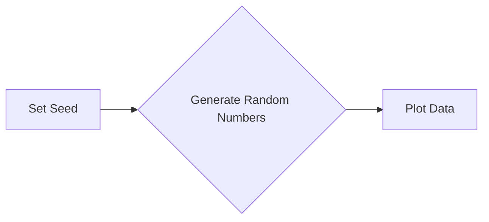

#### 带注释源码

```
np.random.seed(19680801)
```


### np.arange

`np.arange` 是 NumPy 库中的一个函数，用于生成一个沿指定范围的数组。

参数：

- `start`：`int`，数组的起始值，默认为 0。
- `stop`：`int`，数组的结束值，但不包括该值。
- `step`：`int`，步长，默认为 1。

返回值：`numpy.ndarray`，一个沿指定范围的数组。

#### 流程图

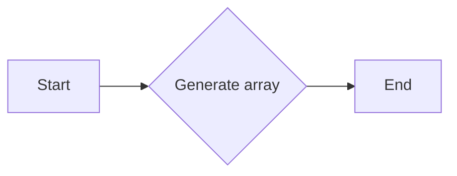

#### 带注释源码

```
import numpy as np

# 生成一个从0到49的数组，步长为1
a = np.arange(50)
```


### np.random.seed

设置随机数生成器的种子。

参数：

- `seed`：`int`，用于初始化随机数生成器的种子值。

返回值：无

#### 流程图

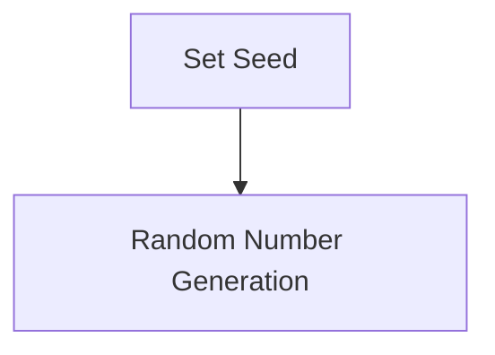

#### 带注释源码

```python
np.random.seed(19680801)
# 设置随机数生成器的种子为19680801
```


### np.random.randint

生成一个随机整数。

参数：

- `low`：`int`，随机整数的下界（包含）。
- `high`：`int`，随机整数的上界（不包含）。
- `size`：`int` 或 `tuple`，生成随机数的数量或形状。

返回值：`int` 或 `numpy.ndarray`，生成的随机整数或随机整数数组。

#### 流程图

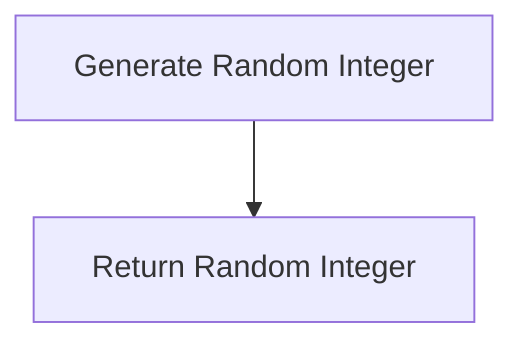

#### 带注释源码

```python
c = np.random.randint(0, 50, 50)
# 生成一个包含50个随机整数的数组，范围从0到49
```


### data[key]

访问字典中的键值对。

参数：

- `key`：`str`，要访问的键。

返回值：`object`，与键关联的值。

#### 流程图

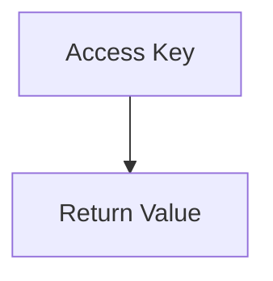

#### 带注释源码

```python
data['a'] = np.arange(50)
# 将键'a'关联到从0到49的数组
```


### np.arange

生成一个等差数列。

参数：

- `start`：`int`，数列的起始值。
- `stop`：`int`，数列的结束值。
- `step`：`int`，数列的步长。

返回值：`numpy.ndarray`，生成的等差数列数组。

#### 流程图

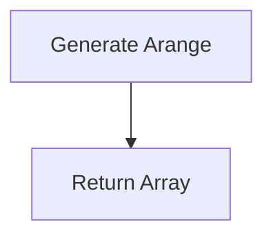

#### 带注释源码

```python
data['a'] = np.arange(50)
# 生成一个从0到49的等差数列
```


### data['b'] = data['a'] + 10 * np.random.randn(50)

计算并赋值。

参数：

- `data['a']`：`numpy.ndarray`，原始数组。
- `10 * np.random.randn(50)`：`numpy.ndarray`，随机数数组。

返回值：无

#### 流程图

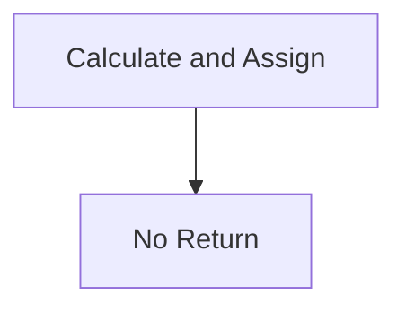

#### 带注释源码

```python
data['b'] = data['a'] + 10 * np.random.randn(50)
# 将键'b'关联到数组'a'加上10倍随机数的结果
```


### np.abs

计算数组的绝对值。

参数：

- `data['d']`：`numpy.ndarray`，输入数组。

返回值：`numpy.ndarray`，包含输入数组绝对值的数组。

#### 流程图

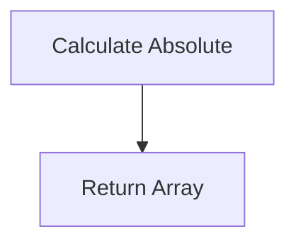

#### 带注释源码

```python
data['d'] = np.abs(data['d']) * 100
# 将键'd'关联到数组'd'的绝对值乘以100的结果
```


### ax.scatter

在二维坐标系中绘制散点图。

参数：

- `'a'`：`str`，x轴数据。
- `'b'`：`str`，y轴数据。
- `'c'`：`str`，颜色数据。
- `'s'`：`str`，大小数据。
- `data`：`dict`，包含所有数据的字典。

返回值：无

#### 流程图

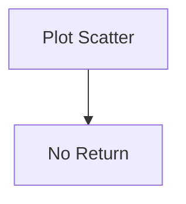

#### 带注释源码

```python
ax.scatter('a', 'b', c='c', s='d', data=data)
# 在坐标系中绘制散点图，使用字典'data'中的'a'、'b'、'c'和'd'作为x、y、颜色和大小数据
```


### ax.set

设置坐标轴标签。

参数：

- `'xlabel'`：`str`，x轴标签。
- `'ylabel'`：`str`，y轴标签。

返回值：无

#### 流程图

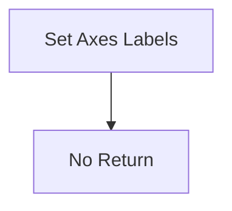

#### 带注释源码

```python
ax.set(xlabel='entry a', ylabel='entry b')
# 设置x轴标签为'entry a'，y轴标签为'entry b'
```


### plt.show

显示图形。

参数：无

返回值：无

#### 流程图

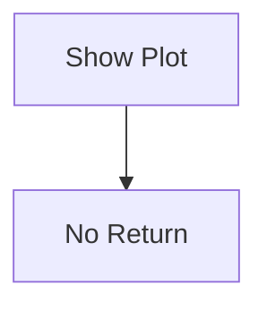

#### 带注释源码

```python
plt.show()
# 显示图形
```


### np.random.seed

设置随机数生成器的种子。

参数：

- `seed`：`int`，用于初始化随机数生成器的种子值。

返回值：无

#### 流程图

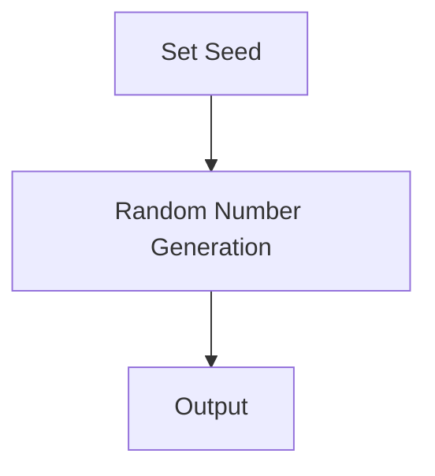

#### 带注释源码

```python
np.random.seed(19680801)
# 设置随机数生成器的种子为19680801
```


### np.random.randn

生成符合标准正态分布的随机样本。

参数：

- `size`：`int` 或 `tuple`，指定输出的形状。

返回值：`ndarray`，包含符合标准正态分布的随机样本。

#### 流程图

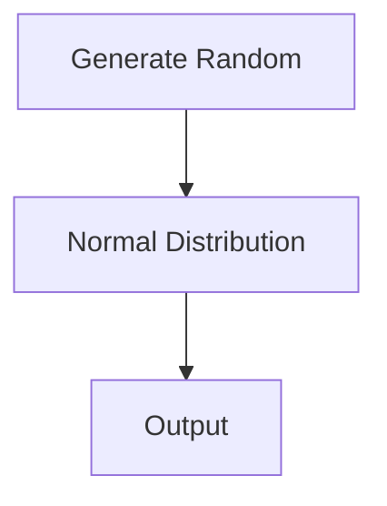

#### 带注释源码

```python
data = {'d': np.random.randn(50)}
# 生成一个包含50个符合标准正态分布的随机样本的数组，并存储在'd'键下
```


### data['a']

获取字典中键为'a'的值。

参数：

- 无

返回值：`ndarray`，包含从0到49的整数。

#### 流程图

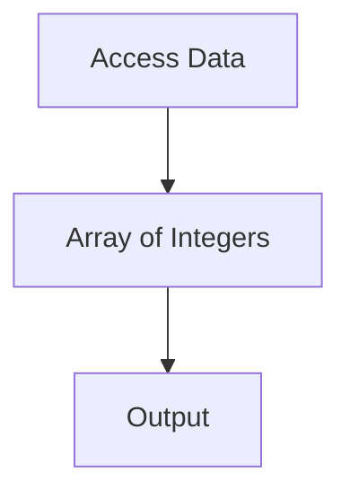

#### 带注释源码

```python
data = {'a': np.arange(50)}
# 创建一个包含从0到49的整数的数组，并存储在'a'键下
```


### data['b']

获取字典中键为'b'的值。

参数：

- 无

返回值：`ndarray`，包含由'a'键的值加上10倍的标准正态分布随机样本组成的数组。

#### 流程图

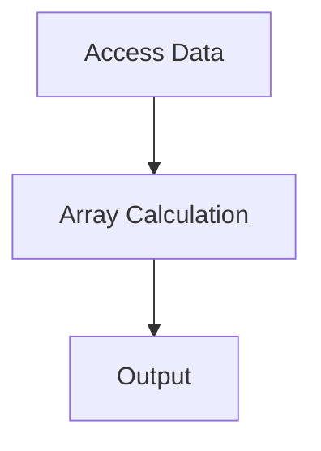

#### 带注释源码

```python
data['b'] = data['a'] + 10 * np.random.randn(50)
# 将'a'键的值加上10倍的标准正态分布随机样本，并将结果存储在'b'键下
```


### data['c']

获取字典中键为'c'的值。

参数：

- 无

返回值：`ndarray`，包含从0到49的随机整数。

#### 流程图

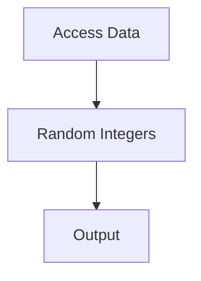

#### 带注释源码

```python
data = {'c': np.random.randint(0, 50, 50)}
# 创建一个包含50个从0到49的随机整数的数组，并存储在'c'键下
```


### data['d']

获取字典中键为'd'的值。

参数：

- 无

返回值：`ndarray`，包含由标准正态分布随机样本组成的数组，且每个值都乘以100。

#### 流程图


#### 带注释源码

```python
data['d'] = np.abs(data['d']) * 100
# 将'd'键的值取绝对值，并将每个值乘以100，然后将结果存储在'd'键下
```


### np.abs

`np.abs` 是 NumPy 库中的一个函数，用于计算输入数组的绝对值。

参数：

- `x`：`numpy.ndarray`，输入数组，可以是任意形状的数组。

返回值：`numpy.ndarray`，输出数组，与输入数组形状相同，包含输入数组的绝对值。

#### 流程图

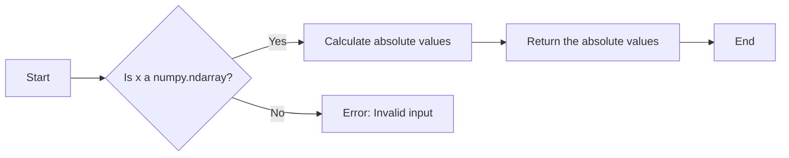

#### 带注释源码

```
import numpy as np

def np_abs(x):
    """
    Calculate the absolute value of an input array.

    Parameters:
    - x: numpy.ndarray, the input array to calculate the absolute value.

    Returns:
    - numpy.ndarray: the absolute values of the input array.
    """
    return np.abs(x)
```


### plt.subplots()

`subplots` 是 `matplotlib.pyplot` 模块中的一个函数，用于创建一个图形和一个或多个轴。

参数：

- `figsize`：`tuple`，默认为 `(6, 4)`，指定图形的大小（宽度和高度）。
- `dpi`：`int`，默认为 `100`，指定图形的分辨率（每英寸点数）。
- `facecolor`：`color`，默认为 `'w'`，指定图形的背景颜色。
- `edgecolor`：`color`，默认为 `'none'`，指定图形的边缘颜色。
- `frameon`：`bool`，默认为 `True`，指定是否显示图形的边框。
- `num`：`int`，默认为 `1`，指定要创建的轴的数量。
- `gridspec_kw`：`dict`，默认为 `None`，指定 `GridSpec` 的关键字参数。
- `constrained_layout`：`bool`，默认为 `False`，指定是否启用 `constrained_layout`。
- `sharex`：`bool` 或 `str`，默认为 `False`，指定是否共享 x 轴。
- `sharey`：`bool` 或 `str`，默认为 `False`，指定是否共享 y 轴。

返回值：`fig, ax`，其中 `fig` 是图形对象，`ax` 是轴对象。

#### 流程图

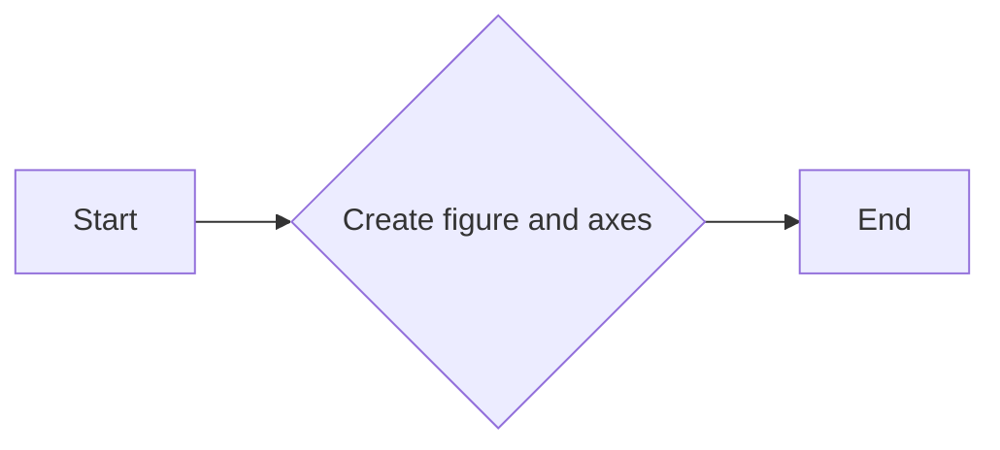

#### 带注释源码

```python
import matplotlib.pyplot as plt

fig, ax = plt.subplots()
# fig is the figure object, ax is the axes object
```


### matplotlib.pyplot.scatter

matplotlib.pyplot.scatter 是一个用于绘制散点图的函数。

参数：

- `x`：`{str}`，指定 x 轴的数据列名。
- `y`：`{str}`，指定 y 轴的数据列名。
- `c`：`{str}`，指定颜色数据列名。
- `s`：`{str}`，指定大小数据列名。
- `data`：`{dict}`，包含所有数据的字典，其中键是列名，值是数据。

返回值：`{None}`，该函数不返回任何值，它直接在当前轴上绘制散点图。

#### 流程图

```mermaid
graph LR
A[Start] --> B[Call scatter function]
B --> C[Plot scatter plot]
C --> D[Show plot]
D --> E[End]
```

#### 带注释源码

```python
import matplotlib.pyplot as plt
import numpy as np

np.random.seed(19680801)

data = {'a': np.arange(50),
        'c': np.random.randint(0, 50, 50),
        'd': np.abs(np.random.randn(50)) * 100}
data['b'] = data['a'] + 10 * np.random.randn(50)

fig, ax = plt.subplots()
ax.scatter('a', 'b', c='c', s='d', data=data)
ax.set(xlabel='entry a', ylabel='entry b')
plt.show()
```


### matplotlib.pyplot.set_xlabel

设置x轴标签。

参数：

- `xlabel`：`str`，x轴标签的文本内容。

返回值：`None`，没有返回值。

#### 流程图

```mermaid
graph LR
A[Start] --> B{Set xlabel}
B --> C[End]
```

#### 带注释源码

```python
# 设置x轴标签
ax.set_xlabel('entry a')
```


### matplotlib.pyplot.set_ylabel

matplotlib.pyplot.set_ylabel 是一个用于设置散点图中 y 轴标签的函数。

参数：

- `label`：`str`，要设置的 y 轴标签的文本。

返回值：`None`，没有返回值。

#### 流程图

```mermaid
graph LR
A[Start] --> B{Set ylabel}
B --> C[End]
```

#### 带注释源码

```
# 设置 y 轴标签
ax.set(ylabel='entry b')
```


### plt.show()

`plt.show()` 是 Matplotlib 库中的一个全局函数，用于显示当前图形。

参数：

- 无

返回值：无

#### 流程图

```mermaid
graph LR
A[Start] --> B[Call plt.show()]
B --> C[End]
```

#### 带注释源码

```
import matplotlib.pyplot as plt

# ... (其他代码)

plt.show()  # 显示当前图形
```


### numpy.random.seed

`numpy.random.seed` 是一个全局函数，用于设置随机数生成器的种子。

参数：

- `seed`：`int`，用于初始化随机数生成器的种子值。

返回值：无

#### 流程图

```mermaid
graph LR
A[Set Seed] --> B{Generate Random Numbers}
B --> C[Plot Data]
```

#### 带注释源码

```
import numpy as np

# Set the seed for the random number generator
np.random.seed(19680801)
```


### numpy.arange

`numpy.arange` 是一个全局函数，用于生成沿指定间隔的数字序列。

参数：

- `start`：`int`，序列的起始值。
- `stop`：`int`，序列的结束值（不包括此值）。
- `step`：`int`，序列中相邻元素之间的差值，默认为 1。

返回值：`numpy.ndarray`，一个沿指定间隔的数字序列。

#### 流程图

```mermaid
graph LR
A[Start] --> B{Is step positive?}
B -- Yes --> C[Calculate next value]
B -- No --> D[Adjust step]
C --> E[Is stop reached?]
E -- Yes --> F[End]
E -- No --> C
D --> C
```

#### 带注释源码

```
import numpy as np

def arange(start, stop=None, step=1):
    """
    Generate an array of evenly spaced values within a given interval.

    Parameters
    ----------
    start : int
        The starting value of the sequence.
    stop : int, optional
        The end value of the sequence, exclusive.
    step : int, optional
        The difference between each pair of consecutive values.

    Returns
    -------
    numpy.ndarray
        An array of evenly spaced values.
    """
    if stop is None:
        stop = start
        start = 0

    if step == 0:
        raise ValueError("step cannot be zero")

    if step > 0:
        while start < stop:
            yield start
            start += step
    else:
        while start > stop:
            yield start
            start += step
```


### numpy.random.seed

`numpy.random.seed` 是一个全局函数，用于设置随机数生成器的种子。

描述：

该函数用于设置随机数生成器的种子，使得每次生成的随机数序列相同，便于调试和结果重现。

参数：

- `seed`：`int`，用于设置随机数生成器的种子。

返回值：无

#### 流程图

```mermaid
graph LR
A[Set Seed] --> B{Generate Random Numbers}
B --> C[Repeat]
```

#### 带注释源码

```
import numpy as np

np.random.seed(19680801)
```


### np.arange

`np.arange` 是一个全局函数，用于生成一个等差数列。

描述：

该函数返回一个指定范围的等差数列数组。

参数：

- `start`：`int`，数列的起始值。
- `stop`：`int`，数列的结束值。
- `step`：`int`，数列的公差，默认为1。

返回值：`numpy.ndarray`，生成的等差数列数组。

#### 流程图

```mermaid
graph LR
A[Start] --> B[Stop]
B --> C[Step]
C --> D[Generate Array]
```

#### 带注释源码

```
import numpy as np

a = np.arange(50)
```


### np.random.randint

`np.random.randint` 是一个全局函数，用于生成一个指定范围内的随机整数数组。

描述：

该函数返回一个指定范围内的随机整数数组。

参数：

- `low`：`int`，随机数的最小值，包含在内。
- `high`：`int`，随机数的最大值，包含在内。
- `size`：`int` 或 `tuple`，生成随机数的数量或形状。

返回值：`numpy.ndarray`，生成的随机整数数组。

#### 流程图

```mermaid
graph LR
A[Low] --> B[High]
B --> C[Size]
C --> D[Generate Array]
```

#### 带注释源码

```
import numpy as np

c = np.random.randint(0, 50, 50)
```


### np.abs

`np.abs` 是一个全局函数，用于计算数组中每个元素的绝对值。

描述：

该函数返回一个新数组，其中包含原数组中每个元素的绝对值。

参数：

- `x`：`numpy.ndarray`，输入数组。

返回值：`numpy.ndarray`，包含每个元素绝对值的新数组。

#### 流程图

```mermaid
graph LR
A[Input Array] --> B[Calculate Absolute Value]
B --> C[Output Array]
```

#### 带注释源码

```
import numpy as np

d = np.abs(data['d']) * 100
```


### numpy.random.randn

生成具有指定均值和标准差的随机样本。

参数：

- `d0, d1, ..., dn`：`int`，指定随机样本的维度。如果只有一个参数，则生成一个具有指定数量的随机样本。
- ...

返回值：`numpy.ndarray`，包含具有指定均值和标准差的随机样本。

#### 流程图

```mermaid
graph LR
A[开始] --> B{参数个数}
B -- 1 --> C[生成一个随机样本]
B -- > 2 --> D[生成多个随机样本]
C --> E[结束]
D --> E
```

#### 带注释源码

```python
import numpy as np

# 设置随机种子
np.random.seed(19680801)

# 生成具有指定均值和标准差的随机样本
data['d'] = np.abs(np.random.randn(50)) * 100
```


### numpy.abs

`numpy.abs` 是一个全局函数，用于计算输入数组的绝对值。

参数：

- `x`：`numpy.ndarray` 或标量，输入数组或标量。

返回值：`numpy.ndarray` 或标量，输入数组的绝对值。

#### 流程图

```mermaid
graph LR
A[Start] --> B{Is x a numpy.ndarray or scalar?}
B -- Yes --> C[Calculate absolute value]
B -- No --> D[Error: Invalid input]
C --> E[Return absolute value]
D --> F[End]
E --> G[End]
```

#### 带注释源码

```
import numpy as np

def abs(x):
    """
    Calculate the absolute value of the input array or scalar.
    
    Parameters:
    - x: numpy.ndarray or scalar, the input array or scalar.
    
    Returns:
    - numpy.ndarray or scalar, the absolute value of the input array or scalar.
    """
    return np.abs(x)
```


```mermaid
graph LR
A[Start] --> B{Is x a numpy.ndarray or scalar?}
B -- Yes --> C[Calculate absolute value]
B -- No --> D[Error: Invalid input]
C --> E[Return absolute value]
D --> F[End]
E --> G[End]
```

```python
import numpy as np

def abs(x):
    """
    Calculate the absolute value of the input array or scalar.
    
    Parameters:
    - x: numpy.ndarray or scalar, the input array or scalar.
    
    Returns:
    - numpy.ndarray or scalar, the absolute value of the input array or scalar.
    """
    return np.abs(x)
```

## 关键组件


### 张量索引与惰性加载

支持通过字符串索引访问数据结构中的元素，实现张量索引的惰性加载。

### 反量化支持

允许对数据进行反量化处理，以适应不同的量化策略。

### 量化策略

提供多种量化策略，以优化模型的性能和存储空间。


## 问题及建议


### 已知问题

-   **代码复用性低**：代码中绘图的逻辑是硬编码的，如果需要绘制不同的数据结构或图表类型，需要修改代码。
-   **缺乏错误处理**：代码中没有错误处理机制，如果数据结构不符合预期或绘图过程中出现异常，程序可能会崩溃。
-   **全局变量使用**：`np.random.seed` 设置为固定的种子，这可能会在多线程环境中导致不可预测的行为。
-   **文档不足**：代码注释较少，对于不熟悉matplotlib和numpy的用户来说，理解代码的功能和目的可能比较困难。

### 优化建议

-   **增加代码复用性**：将绘图逻辑封装成函数或类，以便在不同的上下文中重用。
-   **添加错误处理**：在代码中添加异常处理，确保在出现错误时程序能够优雅地处理异常。
-   **避免全局变量**：如果可能，避免使用全局变量，或者确保它们在多线程环境中安全使用。
-   **完善文档**：增加详细的代码注释和文档，帮助其他开发者理解代码的功能和目的。
-   **参数化绘图**：允许用户通过参数化绘图函数来自定义图表的各个方面，如颜色、标记、线型等。
-   **性能优化**：如果数据集很大，考虑使用更高效的绘图方法，例如使用`matplotlib`的`scatter`方法的`rasterized`参数。


## 其它


### 设计目标与约束

- 设计目标：实现一个使用关键字进行数据可视化绘制的工具，支持多种数据结构，如字典、结构化NumPy数组或pandas DataFrame。
- 约束条件：必须使用Matplotlib库进行绘图，且绘图参数应通过字符串索引访问数据结构中的数据。

### 错误处理与异常设计

- 异常处理：在数据访问和绘图过程中，应捕获并处理可能出现的异常，如索引错误、数据类型不匹配等。
- 错误信息：提供清晰的错误信息，帮助用户定位问题。

### 数据流与状态机

- 数据流：数据从输入数据结构传递到绘图函数，绘图函数根据参数绘制图形。
- 状态机：无状态机，数据流直接从输入到输出。

### 外部依赖与接口契约

- 外部依赖：Matplotlib库。
- 接口契约：绘图函数接受数据结构作为参数，并返回绘制的图形。

### 测试与验证

- 测试策略：编写单元测试，验证不同数据结构和参数组合下的绘图功能。
- 验证方法：手动检查绘制的图形是否符合预期。

### 性能考量

- 性能指标：绘图速度和内存使用。
- 性能优化：优化数据访问和绘图过程，减少不必要的计算和内存占用。

### 安全性考量

- 安全风险：无直接安全风险。
- 安全措施：确保输入数据的有效性和合法性，防止恶意数据导致的潜在风险。

### 维护与扩展性

- 维护策略：定期更新依赖库，修复已知问题。
- 扩展性：设计灵活的接口，方便添加新的数据结构和绘图功能。

### 文档与帮助

- 文档：提供详细的设计文档和用户手册。
- 帮助：提供在线帮助和示例代码。


    