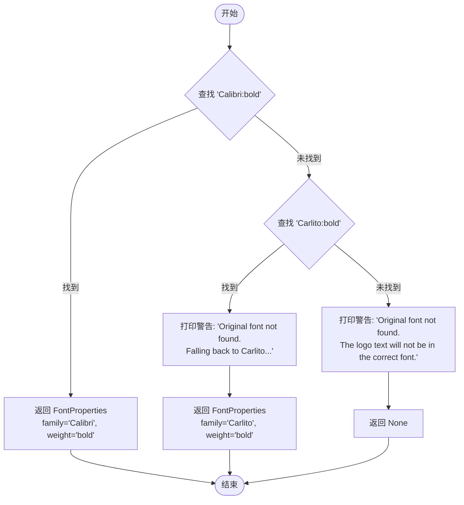
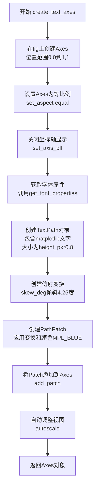
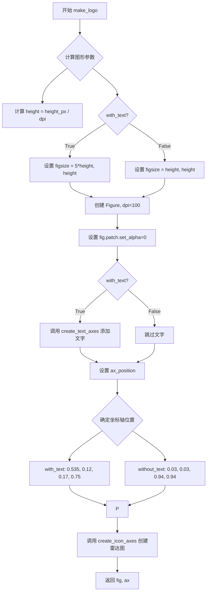

# `matplotlib\galleries\examples\misc\logos2.py` 详细设计文档

该脚本生成Matplotlib官方Logo，包括一个极坐标雷达图风格的图标和可选的'matplotlib'文字，支持不同尺寸（32px和110px）的logo输出，并可通过参数控制线宽等样式。

## 整体流程

```mermaid
graph TD
    A[开始] --> B[get_font_properties 获取字体]
    B --> C{make_logo 创建logo}
    C --> D{with_text 是否包含文字?}
    D -- 是 --> E[create_text_axes 创建文字坐标轴]
    D -- 否 --> F[create_icon_axes 创建图标坐标轴]
    E --> G[设置位置 (0.535, 0.12, .17, 0.75)]
    F --> H[设置位置 (0.03, 0.03, .94, .94)]
    G --> I[返回 fig, ax]
    H --> I
    I --> J[plt.show 显示图形]
```

## 类结构

```

```

## 全局变量及字段


### `MPL_BLUE`
    
Matplotlib标准蓝色，十六进制颜色代码 '#11557c'

类型：`str`
    


    

## 全局函数及方法


### `get_font_properties`

该函数用于获取 Matplotlib Logo 的字体配置。它首先检查系统是否安装了首选字体 "Calibri" (加粗)，若存在则返回对应的 `FontProperties` 对象；若不存在，则尝试查找指标兼容的备选字体 "Carlito"，若找到则返回其 `FontProperties` 对象并打印警告；若两者都未找到，则打印警告并返回 `None`。

参数：
- 无

返回值：`matplotlib.font_manager.FontProperties | None`，返回包含字体家族和粗体权重的 `FontProperties` 对象，如果首选和备选字体均不可用则返回 `None`。

#### 流程图



#### 带注释源码

```python
def get_font_properties():
    # 尝试查找原始字体 Calibri (Bold)。
    # findfont 返回字体文件路径，如果未找到则返回空字符串或抛出异常(取决于版本，但通常返回空或default)。
    # 逻辑：检查返回的路径字符串中是否包含 'Calibri' 子串。
    if 'Calibri' in matplotlib.font_manager.findfont('Calibri:bold'):
        # 如果找到，返回配置为 Calibri 且加粗的 FontProperties 对象
        return matplotlib.font_manager.FontProperties(family='Calibri',
                                                      weight='bold')
    
    # 如果 Calibri 不存在，尝试查找备选字体 Carlito (Bold)
    if 'Carlito' in matplotlib.font_manager.findfont('Carlito:bold'):
        # 打印警告信息，告知用户 Logo 文字可能无法完美呈现
        print('Original font not found. Falling back to Carlito. '
              'The logo text will not be in the correct font.')
        # 返回配置为 Carlito 且加粗的 FontProperties 对象
        return matplotlib.font_manager.FontProperties(family='Carlito',
                                                      weight='bold')
    
    # 如果两个字体都不存在，打印警告并返回 None
    print('Original font not found. '
          'The logo text will not be in the correct font.')
    return None
```


### `create_icon_axes`

创建极坐标Axes并绘制雷达图风格的柱状图，用于生成matplotlib图标中的雷达图部分。

参数：

- `fig`：`matplotlib.figure.Figure`，要在其中绘制的图形对象
- `ax_position`：`tuple`，图形坐标中创建Axes的位置，格式为(x, y, width, height)
- `lw_bars`：`float`，柱状图的边框线宽
- `lw_grid`：`float`，网格线的线宽
- `lw_border`：`float`，坐标轴边框的线宽
- `rgrid`：`array-like`，径向网格的位置

返回值：`matplotlib.axes.Axes`，创建的极坐标Axes对象

#### 流程图

```mermaid
flowchart TD
    A[开始] --> B[使用rc_context设置axes属性<br/>edgecolor=MPL_BLUE, linewidth=lw_border]
    B --> C[创建极坐标axes<br/>fig.add_axes with projection='polar']
    C --> D[设置ax.set_axisbelow=True]
    D --> E[设置参数: N=7, arc=2π]
    E --> F[计算theta数组<br/>np.arange(0.0, arc, arc/N)]
    F --> G[定义radii数组: [2, 6, 8, 7, 4, 5, 8]]
    G --> H[计算width数组<br/>π/4 乘以各系数]
    H --> I[绘制柱状图ax.bar]
    I --> J[遍历radii和bars设置颜色<br/>使用cm.jet并添加alpha=0.6]
    J --> K[配置tick参数<br/>隐藏所有标签]
    K --> L[绘制网格ax.grid<br/>lw=lw_grid, color='0.9']
    L --> M[设置径向最大值ax.set_rmax(9)]
    M --> N[设置径向刻度ax.set_yticks]
    N --> O[添加白色背景矩形<br/>ax.add_patch Rectangle]
    O --> P[返回ax]
```

#### 带注释源码

```python
def create_icon_axes(fig, ax_position, lw_bars, lw_grid, lw_border, rgrid):
    """
    Create a polar Axes containing the matplotlib radar plot.

    Parameters
    ----------
    fig : matplotlib.figure.Figure
        The figure to draw into.
    ax_position : (float, float, float, float)
        The position of the created Axes in figure coordinates as
        (x, y, width, height).
    lw_bars : float
        The linewidth of the bars.
    lw_grid : float
        The linewidth of the grid.
    lw_border : float
        The linewidth of the Axes border.
    rgrid : array-like
        Positions of the radial grid.

    Returns
    -------
    ax : matplotlib.axes.Axes
        The created Axes.
    """
    # 使用rc_context临时设置axes的边框颜色和线宽
    # MPL_BLUE = '#11557c' (matplotlib蓝)
    with plt.rc_context({'axes.edgecolor': MPL_BLUE,
                         'axes.linewidth': lw_border}):
        # 在指定位置创建极坐标投影的Axes
        ax = fig.add_axes(ax_position, projection='polar')
        # 设置轴线和网格在图表下方显示
        ax.set_axisbelow(True)

        # 定义数据: 7个扇形区域
        N = 7
        # 完整圆周弧度 (2π)
        arc = 2. * np.pi
        # 生成0到arc的N个角度值
        theta = np.arange(0.0, arc, arc / N)
        # 各扇形的半径值
        radii = np.array([2, 6, 8, 7, 4, 5, 8])
        # 各扇形的宽度 (基于π/4乘以不同系数)
        width = np.pi / 4 * np.array([0.4, 0.4, 0.6, 0.8, 0.2, 0.5, 0.3])
        # 绘制雷达图风格的柱状图
        # bottom=0.0: 从圆心开始
        # align='edge': 从theta位置开始
        # edgecolor='0.3': 边框颜色为深灰色
        bars = ax.bar(theta, radii, width=width, bottom=0.0, align='edge',
                      edgecolor='0.3', lw=lw_bars)
        
        # 遍历每个柱状图设置颜色
        # 使用jet colormap根据半径比例设置颜色，alpha=0.6设置透明度
        for r, bar in zip(radii, bars):
            color = *cm.jet(r / 10.)[:3], 0.6  # color from jet with alpha=0.6
            bar.set_facecolor(color)

        # 隐藏所有刻度标签 (top/bottom/left/right)
        ax.tick_params(labelbottom=False, labeltop=False,
                       labelleft=False, labelright=False)

        # 绘制网格线: 浅灰色, 指定线宽
        ax.grid(lw=lw_grid, color='0.9')
        # 设置径向轴最大值
        ax.set_rmax(9)
        # 设置径向刻度位置
        ax.set_yticks(rgrid)

        # 添加实际可见的背景 - 略微超出坐标轴范围
        # 创建一个白色矩形作为背景
        ax.add_patch(Rectangle((0, 0), arc, 9.58,
                               facecolor='white', zorder=0,
                               clip_on=False, in_layout=False))
        # 返回创建的极坐标Axes对象
        return ax
```


### `create_text_axes`

创建包含'matplotlib'文字的Axes，用于在图形中绘制matplotlib标志性的文字logo。

参数：

- `fig`：`matplotlib.figure.Figure`，要在其中创建Axes的图形对象
- `height_px`：`int`，图形的高度（像素单位），用于计算文字大小

返回值：`matplotlib.axes.Axes`，创建的支持文字渲染的Axes对象

#### 流程图



#### 带注释源码

```python
def create_text_axes(fig, height_px):
    """Create an Axes in *fig* that contains 'matplotlib' as Text."""
    # 在fig上创建一个覆盖整个图形区域的Axes，位置为(0, 0, 1, 1)
    ax = fig.add_axes((0, 0, 1, 1))
    
    # 设置Axes的宽高比为相等，确保文字不会变形
    ax.set_aspect("equal")
    
    # 关闭坐标轴的显示，包括刻度标签、刻度线等
    ax.set_axis_off()

    # 创建TextPath对象，路径包含'matplotlib'文字
    # 文字大小为height_px的0.8倍，使用get_font_properties获取的字体属性
    path = TextPath((0, 0), "matplotlib", size=height_px * 0.8,
                    prop=get_font_properties())

    # 定义倾斜角度为4.25度，用于创建文字的倾斜效果
    angle = 4.25  # degrees
    
    # 创建2D仿射变换对象，包含倾斜变换
    trans = mtrans.Affine2D().skew_deg(angle, 0)

    # 创建PathPatch（路径补丁），将文字路径转换为可绘制的图形对象
    # transform: 组合了倾斜变换和Axes的数据坐标变换
    # color: 使用MPL_BLUE常量（'#11557c'）
    # lw: 线宽设为0，表示无边框
    patch = PathPatch(path, transform=trans + ax.transData, color=MPL_BLUE,
                      lw=0)
    
    # 将文字补丁添加到Axes中
    ax.add_patch(patch)
    
    # 自动调整Axes的视图范围以适应内容
    ax.autoscale()
```


### `make_logo`

创建完整的 Matplotlib logo 图形，支持仅显示雷达图图标或同时包含 "matplotlib" 文字两种模式，根据 `with_text` 参数控制，函数内部计算图形尺寸、创建 figure、设置坐标轴位置，并分别调用 `create_text_axes` 和 `create_icon_axes` 完成图形绘制。

#### 参数

- `height_px`：`int`，图形高度，以像素为单位
- `lw_bars`：`float`，雷达图柱条的边框线宽
- `lw_grid`：`float`，雷达图网格线的线宽
- `lw_border`：`float`，坐标轴边框的线宽
- `rgrid`：`sequence of float`，雷达图的径向网格位置列表
- `with_text`：`bool`，是否在 logo 中包含 "matplotlib" 文字，默认为 `False`

#### 返回值

- `fig, ax`：`tuple`，返回包含图形和坐标轴的元组，其中 `fig` 为 matplotlib.figure.Figure 对象，`ax` 为 matplotlib.axes.Axes 对象

#### 流程图



#### 带注释源码

```python
def make_logo(height_px, lw_bars, lw_grid, lw_border, rgrid, with_text=False):
    """
    Create a full figure with the Matplotlib logo.

    Parameters
    ----------
    height_px : int
        Height of the figure in pixel.
    lw_bars : float
        The linewidth of the bar border.
    lw_grid : float
        The linewidth of the grid.
    lw_border : float
        The linewidth of icon border.
    rgrid : sequence of float
        The radial grid positions.
    with_text : bool
        Whether to draw only the icon or to include 'matplotlib' as text.
    """
    dpi = 100  # 设置固定 DPI 为 100
    height = height_px / dpi  # 将像素高度转换为英寸
    # 根据是否包含文字设置图形尺寸：带文字时宽度为高度的5倍，否则为正方形
    figsize = (5 * height, height) if with_text else (height, height)
    fig = plt.figure(figsize=figsize, dpi=dpi)  # 创建 Figure 对象
    fig.patch.set_alpha(0)  # 设置 Figure 背景完全透明

    if with_text:
        # 如果需要文字，创建文字坐标轴并绘制 "matplotlib" 文本
        create_text_axes(fig, height_px)
    
    # 根据是否包含文字设置雷达图坐标轴的位置和大小
    # 带文字时位置偏右，不带文字时占满整个图形
    ax_pos = (0.535, 0.12, .17, 0.75) if with_text else (0.03, 0.03, .94, .94)
    # 创建雷达图坐标轴，包含极坐标轴、柱状图、网格等
    ax = create_icon_axes(fig, ax_pos, lw_bars, lw_grid, lw_border, rgrid)

    return fig, ax  # 返回图形对象和坐标轴对象供调用者使用
```

## 关键组件


### 全局常量 MPL_BLUE

matplotlib logo 的品牌蓝色，用于图标和文字的颜色配置

### 函数 get_font_properties

获取用于绘制 "matplotlib" 文字的字体属性，优先使用 Calibri 字体，不存在时回退到 Carlito，最后返回 None

### 函数 create_icon_axes

创建包含 matplotlib 雷达图的极坐标轴，包含 7 个彩色条形、网格线、隐藏刻度标签和白色背景矩形

### 函数 create_text_axes

创建包含 "matplotlib" 文字的坐标系，使用 TextPath 将文字转换为路径，并通过 skew_deg 实现倾斜效果

### 函数 make_logo

整合函数，根据参数创建完整的 matplotlib logo 图形，可选择是否包含文字，返回 figure 和 axes 对象

### 关键组件：字体回退机制

当系统缺少 Calibri 和 Carlito 字体时，会打印警告信息并返回 None，这是潜在的错误处理不完善之处

### 关键组件：极坐标雷达图

使用 bar 方法在极坐标系中绘制 7 个条形，每个条形根据半径值从 jet 颜色映射中获取颜色

### 关键组件：文字路径变换

使用 Affine2D().skew_deg() 创建倾斜变换，与 ax.transData 组合实现文字的倾斜效果

### 潜在技术债务

字体回退返回 None 可能导致下游调用空指针异常；硬编码的颜色值和参数缺乏配置化


## 问题及建议


### 已知问题

-   **魔法数字和硬编码值**：代码中存在大量硬编码的数值，如 `N = 7`、`radii = np.array([2, 6, 8, 7, 4, 5, 8])`、坐标参数 `(0.535, 0.12, .17, 0.75)`、高度 `9.58`、倾斜角度 `4.25` 等，缺乏常量定义或配置文件，降低了可维护性
-   **错误处理不完善**：`get_font_properties()` 函数在字体都不存在时返回 `None`，但调用方 `create_text_axes()` 中 `TextPath` 使用该返回值时未做空值检查，可能导致运行时错误
-   **函数参数过多**：`make_logo()` 和 `create_icon_axes()` 函数参数过多（分别为6个和5个），违反函数设计原则，应考虑使用配置对象或参数类封装
-   **缺少类型注解**：整个代码库没有任何类型注解，不利于静态分析工具和IDE的辅助功能，降低了代码的可读性和可维护性
-   **全局状态依赖**：直接导入并使用 `matplotlib.pyplot`，依赖于全局状态，可能导致不可预测的行为，且难以进行单元测试
-   **资源管理缺失**：创建的 `Figure` 对象没有显式的资源释放或关闭机制，在长时间运行的应用中可能导致资源泄漏
-   **缺乏抽象**：雷达图的配色方案、条形数量、宽度等参数直接耦合在 `create_icon_axes` 函数中，如需调整logo样式需直接修改函数内部逻辑
-   **重复代码示例**：文件末尾三次调用 `make_logo` 生成不同尺寸的logo，代码重复且未封装为独立的演示函数

### 优化建议

-   将所有硬编码的配置值（颜色、坐标、角度、图形参数等）抽取为配置类或常量定义模块，便于统一管理和修改
-   为 `get_font_properties()` 添加完善的错误处理机制，返回默认值或抛出明确的异常，而非静默返回 `None`
-   使用 `dataclass` 或 `NamedTuple` 重构函数参数，创建 `LogoConfig` 等配置对象，减少参数个数
-   为所有函数添加类型注解，提升代码可读性和静态检查能力
-   使用面向对象的设计，将 logo 创建逻辑封装为 `MatplotlibLogo` 类，管理内部状态和资源
-   考虑使用 `matplotlib.Figure` 的上下文管理器或显式调用 `fig.clear()` 和 `plt.close(fig)` 管理资源
-   将文件末尾的示例代码封装为 `demo()` 函数，并在 `if __name__ == "__main__":` 块中调用
-   为核心函数添加单元测试，使用 mock 隔离 matplotlib 的依赖


## 其它


### 设计目标与约束

本代码的设计目标是生成matplotlib官方logo，包含一个雷达图形式的图标和可选的"matplotlib"文字。约束条件包括：依赖Calibri或Carlito字体（否则文字显示不正确），需要matplotlib、numpy等库支持，输出为静态图像（不支持交互式显示）。

### 错误处理与异常设计

字体查找失败时通过print输出警告信息，程序继续运行但文字将使用默认字体。add_axes参数无效时matplotlib会抛出异常。无异常捕获机制，调用者需自行处理潜在的ValueError或其他matplotlib异常。

### 外部依赖与接口契约

主要依赖：matplotlib.pyplot、numpy、matplotlib.cm、matplotlib.font_manager、matplotlib.patches、matplotlib.text、matplotlib.transforms。函数接口：get_font_properties()返回FontProperties或None；create_icon_axes()接收fig、ax_position、线宽参数、rgrid，返回Axes对象；create_text_axes()接收fig和height_px，无返回值；make_logo()返回(fig, ax)元组。

### 性能考虑

代码简单直接，无明显性能瓶颈。重复调用时每次创建新Figure，内存占用取决于图像尺寸。对于大批量生成场景，可考虑缓存FontProperties对象和Figure对象。

### 平台兼容性

依赖matplotlib底层实现，理论上支持所有matplotlib支持的平台（Windows、Linux、macOS）。字体名称依赖系统字体库，跨平台时需注意字体可用性差异。

### 测试策略

可添加单元测试验证：不同参数下的Figure创建、字体回退逻辑、返回值类型检查、图像尺寸验证。建议添加回归测试确保logo外观一致性。

### 配置管理

通过函数参数传递配置（lw_bars、lw_grid、lw_border、rgrid等），无独立配置文件。matplotlib全局配置通过plt.rc_context临时修改。

### 可维护性与扩展性

代码结构清晰但扩展性有限：新增logo变体需修改make_logo函数。颜色方案硬编码（ MPL_BLUE、cm.jet、'0.3'、'0.9'、'white'），扩展需修改多处。N=7和数据数组硬编码，缺乏灵活性。

### 版本兼容性

使用标准的matplotlib API，兼容matplotlib 2.0+版本。numpy API使用basic slicing，无版本特定依赖。

### 资源管理

plt.figure()创建的对象需调用方管理（通常plt.show()后自动清理）。无显式资源释放代码，建议在生产环境中使用with语句或显式close()。

### 错误恢复机制

字体缺失时降级到None（返回None时后续使用可能报错），缺乏健壮的降级策略。add_axes失败时无恢复尝试，直接传播异常。


    