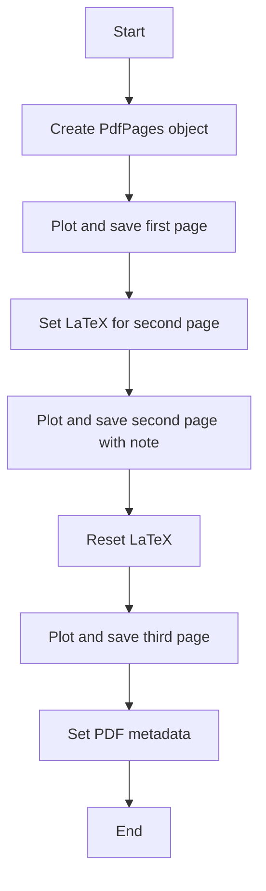
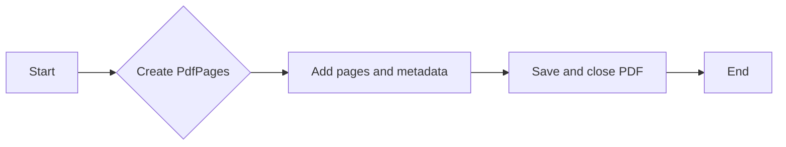
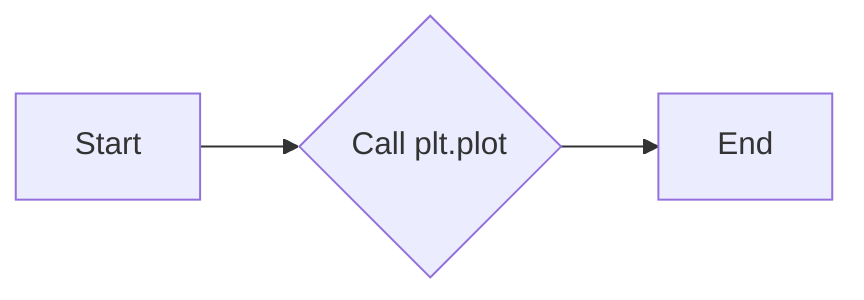
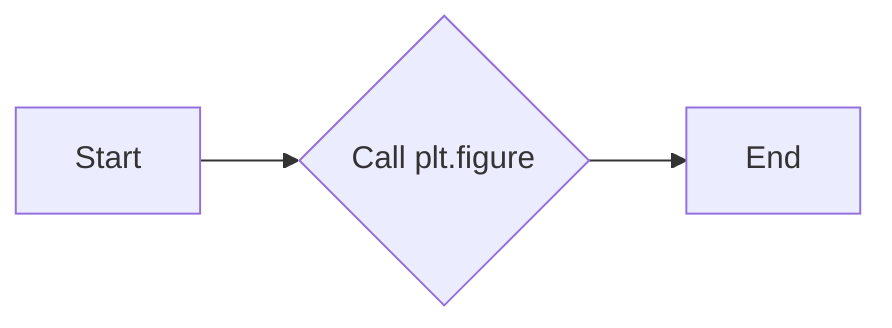
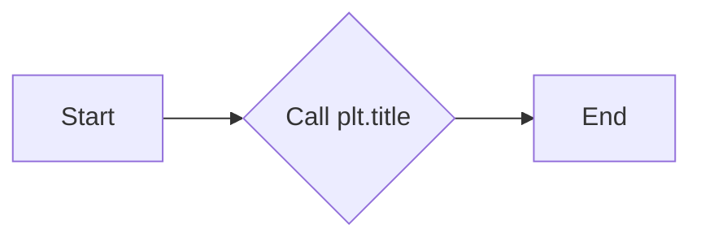
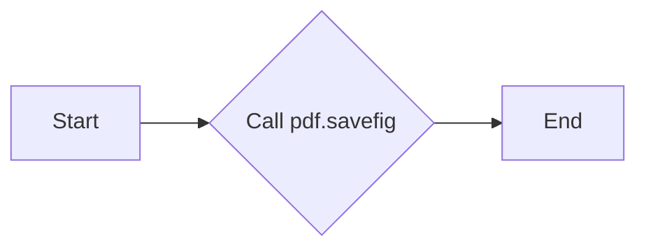
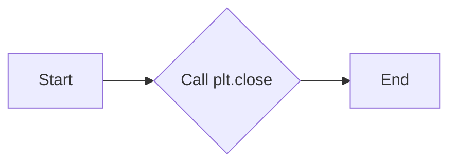
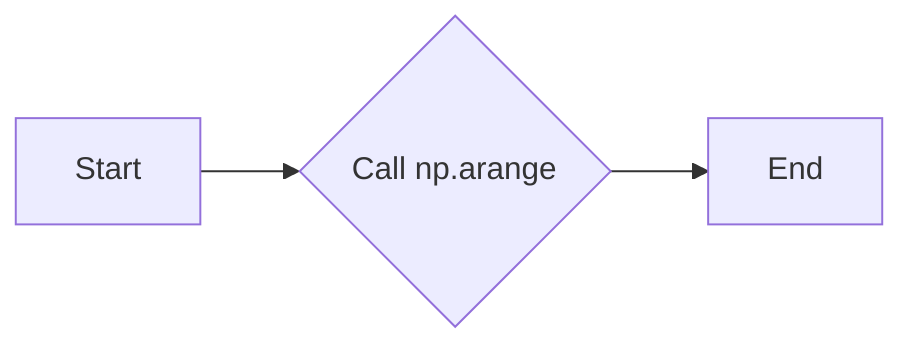

# `matplotlib\galleries\examples\misc\multipage_pdf.py` 详细设计文档

This code generates a multipage PDF file with various plots and metadata annotations using matplotlib and PdfPages.

## 整体流程



## 类结构

```
PdfPages (matplotlib.backends.backend_pdf.PdfPages)
```

## 全局变量及字段


### `plt`
    
Matplotlib's pyplot module for plotting and saving figures.

类型：`module`
    


### `np`
    
NumPy module for numerical operations.

类型：`module`
    


### `PdfPages`
    
Class for creating and managing PDF pages.

类型：`class`
    


### `datetime`
    
Module for manipulating dates and times.

类型：`module`
    


### `infodict`
    
Function to get or set the info dictionary of a PDF document.

类型：`function`
    


### `PdfPages.infodict`
    
Function to get or set the info dictionary of a PDF document.

类型：`function`
    


### `PdfPages.savefig`
    
Function to save the current figure into a PDF page.

类型：`function`
    


### `PdfPages.attach_note`
    
Function to attach a note (metadata) to a PDF page.

类型：`function`
    


### `PdfPages.infodict`
    
Function to get or set the info dictionary of a PDF document.

类型：`function`
    
    

## 全局函数及方法


### with PdfPages('multipage_pdf.pdf') as pdf

This function creates a new PDF file with the specified name and ensures that the file is properly closed after the block of code is executed, even if an exception occurs.

参数：

- `multipage_pdf.pdf`：`str`，指定要创建的PDF文件的名称。
- `pdf`：`PdfPages`，返回一个`PdfPages`对象，用于添加页面和设置元数据。

返回值：`PdfPages`，返回一个`PdfPages`对象，用于添加页面和设置元数据。

#### 流程图



#### 带注释源码

```python
with PdfPages('multipage_pdf.pdf') as pdf:
    # Code block to add pages and metadata to the PDF
```


### plt.figure

`plt.figure` is a function from the `matplotlib.pyplot` module that is used to create a new figure for plotting.

参数：

- `figsize`：`tuple`，指定图形的大小，例如 `(width, height)`，单位为英寸。

返回值：`matplotlib.figure.Figure`，返回一个`Figure`对象，该对象包含图形的所有元素，如轴、标题、图例等。

#### 流程图

```mermaid
graph LR
A[Start] --> B{Create figure with plt.figure(figsize=(3, 3))}
B --> C[Plot data]
C --> D{Save figure to PDF}
D --> E[Close figure]
E --> F[End]
```

#### 带注释源码

```python
plt.figure(figsize=(3, 3))  # 创建一个大小为3x3英寸的图形
plt.plot(range(7), [3, 1, 4, 1, 5, 9, 2], 'r-o')  # 绘制数据点
plt.title('Page One')  # 添加标题
pdf.savefig()  # 将图形保存到PDF页面
plt.close()  # 关闭图形
```


### plt.plot

`plt.plot` 是 Matplotlib 库中的一个函数，用于在二维坐标系中绘制线图。

参数：

- `range(7)`：`int`，指定 x 轴的数据点范围。
- `[3, 1, 4, 1, 5, 9, 2]`：`list`，指定 y 轴的数据点。
- `'r-o'`：`str`，指定线条的颜色和样式，'r' 表示红色，'o' 表示圆点标记。

返回值：`None`，该函数不返回任何值，它直接在当前图形上绘制线图。

#### 流程图



#### 带注释源码

```
plt.plot(range(7), [3, 1, 4, 1, 5, 9, 2], 'r-o')
```


### plt.figure

`plt.figure` 是 Matplotlib 库中的一个函数，用于创建一个新的图形窗口。

参数：

- `figsize=(3, 3)`：`tuple`，指定图形的宽度和高度。

返回值：`Figure`，返回创建的图形对象。

#### 流程图



#### 带注释源码

```
plt.figure(figsize=(3, 3))
```


### plt.title

`plt.title` 是 Matplotlib 库中的一个函数，用于设置图形的标题。

参数：

- `'Page One'`：`str`，指定图形的标题。

返回值：`None`，该函数不返回任何值。

#### 流程图



#### 带注释源码

```
plt.title('Page One')
```


### pdf.savefig

`pdf.savefig` 是 Matplotlib 的 PdfPages 类中的一个方法，用于将当前图形保存到 PDF 文件中。

参数：

- `fig`：`Figure`，可选参数，指定要保存的图形对象，如果未指定，则默认为当前图形。

返回值：`None`，该函数不返回任何值。

#### 流程图



#### 带注释源码

```
pdf.savefig()  # saves the current figure into a pdf page
```


### plt.close

`plt.close` 是 Matplotlib 库中的一个函数，用于关闭图形窗口。

参数：

- `fig`：`Figure`，可选参数，指定要关闭的图形对象，如果未指定，则关闭当前图形。

返回值：`None`，该函数不返回任何值。

#### 流程图



#### 带注释源码

```
plt.close()
```


### plt.rcParams['text.usetex']

`plt.rcParams['text.usetex']` 是 Matplotlib 的 rcParams 字典中的一个键，用于控制是否使用 LaTeX 来渲染文本。

参数：

- `True` 或 `False`：`bool`，指定是否使用 LaTeX。

返回值：`None`，该函数不返回任何值。

#### 流程图

```mermaid
graph LR
A[Start] --> B{Set plt.rcParams['text.usetex']}
B --> C[End]
```

#### 带注释源码

```
plt.rcParams['text.usetex'] = True
```


### np.arange

`np.arange` 是 NumPy 库中的一个函数，用于生成一个指定范围的数组。

参数：

- `0, 5, 0.1`：`int`，指定数组的起始值、结束值和步长。

返回值：`ndarray`，返回生成的数组。

#### 流程图



#### 带注释源码

```
x = np.arange(0, 5, 0.1)
```


### plt.plot

`plt.plot` 是 Matplotlib 库中的一个函数，用于在二维坐标系中绘制线图。

参数：

- `x`：`ndarray`，指定 x 轴的数据点。
- `np.sin(x)`：`ndarray`，指定 y 轴的数据点。
- `'b-'`：`str`，指定线条的颜色和样式，'b' 表示蓝色，'-' 表示实线。

返回值：`None`，该函数不返回任何值，它直接在当前图形上绘制线图。

#### 流程图


#### 带注释源码

```
plt.plot(x, np.sin(x), 'b-')
```


### plt.attach_note

`plt.attach_note` 是 Matplotlib 库中的一个函数，用于在图形上附加注释。

参数：

- `"plot of sin(x)"`：`str`，指定注释的内容。

返回值：`None`，该函数不返回任何值。

#### 流程图


#### 带注释源码

```
pdf.attach_note("plot of sin(x)")
```


### plt.figure

`plt.figure` 是 Matplotlib 库中的一个函数，用于创建一个新的图形窗口。

参数：

- `figsize=(8, 6)`：`tuple`，指定图形的宽度和高度。

返回值：`Figure`，返回创建的图形对象。

#### 流程图


#### 带注释源码

```
plt.figure(figsize=(8, 6))
```


### plt.plot

`plt.plot` 是 Matplotlib 库中的一个函数，用于在二维坐标系中绘制线图。

参数：

- `x`：`ndarray`，指定 x 轴的数据点。
- `np.sin(x)`：`ndarray`，指定 y 轴的数据点。
- `'b-'`：`str`，指定线条的颜色和样式，'b' 表示蓝色，'-' 表示实线。

返回值：`None`，该函数不返回任何值，它直接在当前图形上绘制线图。

#### 流程图


#### 带注释源码

```
plt.plot(x, np.sin(x), 'b-')
```


### plt.title

`plt.title` 是 Matplotlib 库中的一个函数，用于设置图形的标题。

参数：

- `'Page Two'`：`str`，指定图形的标题。

返回值：`None`，该函数不返回任何值。

#### 流程图


#### 带注释源码

```
plt.title('Page Two')
```


### pdf.attach_note

`pdf.attach_note` 是 Matplotlib 库中的一个函数，用于在图形上附加注释。

参数：

- `"plot of sin(x)"`：`str`，指定注释的内容。

返回值：`None`，该函数不返回任何值。

#### 流程图


#### 带注释源码

```
pdf.attach_note("plot of sin(x)")
```


### plt.savefig

`pdf.savefig` 是 Matplotlib 的 PdfPages 类中的一个方法，用于将当前图形保存到 PDF 文件中。

参数：

- `fig`：`Figure`，可选参数，指定要保存的图形对象，如果未指定，则默认为当前图形。

返回值：`None`，该函数不返回任何值。

#### 流程图


#### 带注释源码

```
pdf.savefig()
```


### plt.close

`plt.close` 是 Matplotlib 库中的一个函数，用于关闭图形窗口。

参数：

- `fig`：`Figure`，可选参数，指定要关闭的图形对象，如果未指定，则关闭当前图形。

返回值：`None`，该函数不返回任何值。

#### 流程图


#### 带注释源码

```
plt.close()
```


### plt.rcParams['text.usetex']

`plt.rcParams['text.usetex']` 是 Matplotlib 的 rcParams 字典中的一个键，用于控制是否使用 LaTeX 来渲染文本。

参数：

- `False`：`bool`，指定是否使用 LaTeX。

返回值：`None`，该函数不返回任何值。

#### 流程图

```mermaid
graph LR
A[Start] --> B{Set plt.rcParams['text.usetex']}
B --> C[End]
```

#### 带注释源码

```
plt.rcParams['text.usetex'] = False
```


### plt.figure

`plt.figure` 是 Matplotlib 库中的一个函数，用于创建一个新的图形窗口。

参数：

- `figsize=(4, 5)`：`tuple`，指定图形的宽度和高度。

返回值：`Figure`，返回创建的图形对象。

#### 流程图


#### 带注释源码

```
plt.figure(figsize=(4, 5))
```


### plt.plot

`plt.plot` 是 Matplotlib 库中的一个函数，用于在二维坐标系中绘制线图。

参数：

- `x`：`ndarray`，指定 x 轴的数据点。
- `x ** 2`：`ndarray`，指定 y 轴的数据点。
- `'ko'`：`str`，指定线条的颜色和样式，'k' 表示黑色，'o' 表示圆点标记。

返回值：`None`，该函数不返回任何值，它直接在当前图形上绘制线图。

#### 流程图

```mermaid
graph LR
A[Start] --> B{Call plt.plot}
B --> C[End]
```

#### 带注释源码

```
plt.plot(x, x ** 2, 'ko')
```


### plt.title

`plt.title` 是 Matplotlib 库中的一个函数，用于设置图形的标题。

参数：

- `'Page Three'`：`str`，指定图形的标题。

返回值：`None`，该函数不返回任何值。

#### 流程图

```mermaid
graph LR
A[Start] --> B{Call plt.title}
B --> C[End]
```

#### 带注释源码

```
plt.title('Page Three')
```


### pdf.savefig

`pdf.savefig` 是 Matplotlib 的 PdfPages 类中的一个方法，用于将当前图形保存到 PDF 文件中。

参数：

- `fig`：`Figure`，可选参数，指定要保存的图形对象，如果未指定，则默认为当前图形。

返回值：`None`，该函数不返回任何值。

#### 流程图

```mermaid
graph LR
A[Start] --> B{Call pdf.savefig}
B --> C[End]
```

#### 带注释源码

```
pdf.savefig(fig)
```


### plt.close

`plt.close` 是 Matplotlib 库中的一个函数，用于关闭图形窗口。

参数：

- `fig`：`Figure`，可选参数，指定要关闭的图形对象，如果未指定，则关闭当前图形。

返回值：`None`，该函数不返回任何值。

#### 流程图

```mermaid
graph LR
A[Start] --> B{Call plt.close}
B --> C[End]
```

#### 带注释源码

```
plt.close()
```


### pdf.infodict

`pdf.infodict` 是 Matplotlib 的 PdfPages 类中的一个方法，用于获取或设置 PDF 文件的元数据。

参数：无

返回值：`dict`，返回包含 PDF 文件元数据的字典。

#### 流程图

```mermaid
graph LR
A[Start] --> B{Call pdf.infodict}
B --> C[End]
```

#### 带注释源码

```
d = pdf.infodict()
```


### d['Title']

`d['Title']` 是一个字典操作，用于设置 PDF 文件的标题。

参数：

- `'Multipage PDF Example'`：`str`，指定 PDF 文件的标题。

返回值：`None`，该函数不返回任何值。

#### 流程图

```mermaid
graph LR
A[Start] --> B{Set d['Title']}
B --> C[End]
```

#### 带注释源码

```
d['Title'] = 'Multipage PDF Example'
```


### d['Author']

`d['Author']` 是一个字典操作，用于设置 PDF 文件的作者。

参数：

- `'Jouni K. Sepp\xe4nen'`：`str`，指定 PDF 文件的作者。

返回值：`None`，该函数不返回任何值。

#### 流程图

```mermaid
graph LR
A[Start] --> B{Set d['Author']}
B --> C[End]
```

#### 带注释源码

```
d['Author'] = 'Jouni K. Sepp\xe4nen'
```


### d['Subject']

`d['Subject']` 是一个字典操作，用于设置 PDF 文件的主题。

参数：

- `'How to create a multipage pdf file and set its metadata'`：`str`，指定 PDF 文件的主题。

返回值：`None`，该函数不返回任何值。

#### 流程图

```mermaid
graph LR
A[Start] --> B{Set d['Subject']}
B --> C[End]
```

#### 带注释源码

```
d['Subject'] = 'How to create a multipage pdf file and set its metadata'
```


### d['Keywords']

`d['Keywords']` 是一个字典操作，用于设置 PDF 文件的关键词。

参数：

- `'PdfPages multipage keywords author title subject'`：`str`，指定 PDF 文件的关键词。

返回值：`None`，该函数不返回任何值。

#### 流程图

```mermaid
graph LR
A[Start] --> B{Set d['Keywords']}
B --> C[End]
```

#### 带注释源码

```
d['Keywords'] = 'PdfPages multipage keywords author title subject'
```


### d['CreationDate']

`d['CreationDate']` 是一个字典操作，用于设置 PDF 文件的创建日期。

参数：

- `datetime.datetime(2009, 11, 13)`：`datetime`，指定 PDF 文件的创建日期。

返回值：`None`，该函数不返回任何值。

#### 流程图

```mermaid
graph LR
A[Start] --> B{Set d['CreationDate']}
B --> C[End]
```

#### 带注释源码

```
d['CreationDate'] = datetime.datetime(2009, 11, 13)
```


### d['ModDate']

`d['ModDate']` 是一个字典操作，用于设置 PDF 文件的修改日期。

参数：

- `datetime.datetime.today()`：`datetime`，指定 PDF 文件的修改日期。

返回值：`None`，该函数不返回任何值。

#### 流程图

```mermaid
graph LR
A[Start] --> B{Set d['ModDate']}
B --> C[End]
```

#### 带注释源码

```
d['ModDate'] = datetime.datetime.today()
```


### plt.rcParams['text.usetex']

`plt.rcParams['text.usetex']` 是 Matplotlib 的 rcParams 字典中的一个键，用于控制是否使用 LaTeX 来渲染文本。

参数：

- `False`：`bool`，指定是否使用 LaTeX。

返回值：`None`，该函数不返回任何值。

#### 流程图

```mermaid
graph LR
A[Start] --> B{Set plt.rcParams['text.usetex']}
B --> C[End]
```

#### 带注释源码

```
plt.rcParams['text.usetex'] = False
```


### plt.figure

`plt.figure` 是 Matplotlib 库中的一个函数，用于创建一个新的图形窗口。

参数：

- `figsize=(3, 3)`：`tuple`，指定图形的宽度和高度。

返回值：`Figure`，返回创建的图形对象。

#### 流程图

```mermaid
graph LR
A[Start] --> B{Call plt.figure}
B --> C[End]
```

#### 带注释源码

```
plt.figure(figsize=(3, 3))
```


### plt.plot

`plt.plot` 是 Matplotlib 库中的一个函数，用于在二维坐标系中绘制线图。

参数：

- `range(7)`：`int`，指定 x 轴的数据点范围。
- `[3, 1, 4, 1, 5, 9, 2]`：`list`，指定 y 轴的数据点。
- `'r-o'`：`str`，指定线条的颜色和样式，'r' 表示红色，'o' 表示圆点标记。

返回值：`None`，该函数不返回任何值，它直接在当前图形上绘制线图。

#### 流程图

```mermaid
graph LR
A[Start] --> B{Call plt.plot}
B --> C[End]
```

#### 带注释源码

```
plt.plot(range(7), [3, 1, 4, 1, 5, 9, 2], 'r-o')
```


### plt.title

`plt.title` 是 Matplotlib 库中的一个函数，用于设置图形的标题。

参数


### plt.title

`plt.title` is a method of the `matplotlib.pyplot` module used to set the title of the current axes.

参数：

- `title`：`str`，The title of the plot. This can be a string or a tuple of strings.

返回值：`None`，No return value is provided; the title is set directly on the plot.

#### 流程图

```mermaid
graph LR
A[Start] --> B{Call plt.title}
B --> C[Set title on plot]
C --> D[End]
```

#### 带注释源码

```python
# The plt.title method is called here to set the title of the plot.
plt.title('Page One')
```


### plt.savefig

该函数用于将当前matplotlib图形保存到PDF文件的一个新页面。

参数：

- `fig`：`matplotlib.figure.Figure`，可选。如果提供，则将指定的图形保存到PDF页面，而不是当前活动的图形。
- ...

返回值：无

#### 流程图

```mermaid
graph LR
A[开始] --> B{调用plt.savefig}
B --> C[保存图形到PDF页面]
C --> D[结束]
```

#### 带注释源码

```python
pdf.savefig(fig)  # or you can pass a Figure object to pdf.savefig
```


### plt.close

关闭当前活跃的matplotlib图形和窗口。

参数：

- `fig`：`matplotlib.figure.Figure`，可选，指定要关闭的图形对象。如果不提供，则关闭当前活跃的图形。

返回值：无

#### 流程图

```mermaid
graph LR
A[开始] --> B{检查fig参数}
B -- 是 --> C[关闭指定图形]
B -- 否 --> D[关闭当前活跃图形]
C --> E[结束]
D --> E
```

#### 带注释源码

```python
plt.close(fig=None)
```

该函数调用matplotlib.pyplot模块中的close函数，用于关闭图形和窗口。如果提供了fig参数，则关闭指定的图形对象；如果没有提供fig参数，则关闭当前活跃的图形对象。函数没有返回值。


### plt.rcParams['text.usetex']

该函数用于设置matplotlib的rcParams字典中的'text.usetex'键，以控制是否使用LaTeX渲染文本。

参数：

- 无

返回值：无

#### 流程图

```mermaid
graph LR
A[Set plt.rcParams['text.usetex']] --> B{Is LaTeX installed?}
B -- Yes --> C[Use LaTeX for text rendering]
B -- No --> D[Use default text rendering]
```

#### 带注释源码

```
# if LaTeX is not installed or error caught, change to `False`
plt.rcParams['text.usetex'] = True
# ...
plt.rcParams['text.usetex'] = False
```

在这段代码中，首先将'text.usetex'设置为`True`，然后进行绘图操作。如果LaTeX安装正常且没有错误发生，文本将被渲染为LaTeX格式。之后，将'text.usetex'设置为`False`，以便在后续的绘图操作中使用默认的文本渲染方式。


### pdf.attach_note

Attach a note to the current page of the PDF.

参数：

- `{note}`：`str`，The text of the note to be attached to the current page.

返回值：`None`，No return value, the note is attached to the current page.

#### 流程图

```mermaid
graph LR
A[Start] --> B{Attach note}
B --> C[End]
```

#### 带注释源码

```
pdf.attach_note("plot of sin(x)")
```


### pdf.infodict()

该函数用于获取当前PdfPages对象的元数据字典。

参数：

- 无

返回值：`dict`，包含PDF文件的元数据信息，如标题、作者、主题等。

#### 流程图

```mermaid
graph LR
A[Start] --> B{获取元数据}
B --> C[结束]
```

#### 带注释源码

```python
# We can also set the file's metadata via the PdfPages object:
d = pdf.infodict()
d['Title'] = 'Multipage PDF Example'
d['Author'] = 'Jouni K. Seppänen'
d['Subject'] = 'How to create a multipage pdf file and set its metadata'
d['Keywords'] = 'PdfPages multipage keywords author title subject'
d['CreationDate'] = datetime.datetime(2009, 11, 13)
d['ModDate'] = datetime.datetime.today()
```


### d['Title']

Sets the title of the PDF document.

参数：

- `d`：`dict`，The dictionary containing the metadata of the PDF document.
- `Title`：`str`，The title to be set for the PDF document.

返回值：`None`，No value is returned as the metadata is updated in place.

#### 流程图

```mermaid
graph LR
A[Start] --> B{Set Title}
B --> C[End]
```

#### 带注释源码

```python
# We can also set the file's metadata via the PdfPages object:
d = pdf.infodict()
d['Title'] = 'Multipage PDF Example'
# The metadata is updated in the dictionary 'd' and is not returned by any function.
```


### d['Author']

该函数用于设置PDF文件的作者信息。

参数：

- 无

返回值：`str`，作者信息字符串

#### 流程图

```mermaid
graph LR
A[Start] --> B{Set Author}
B --> C[End]
```

#### 带注释源码

```python
# We can also set the file's metadata via the PdfPages object:
d = pdf.infodict()
d['Title'] = 'Multipage PDF Example'
d['Author'] = 'Jouni K. Sepp\xe4nen'
d['Subject'] = 'How to create a multipage pdf file and set its metadata'
d['Keywords'] = 'PdfPages multipage keywords author title subject'
d['CreationDate'] = datetime.datetime(2009, 11, 13)
d['ModDate'] = datetime.datetime.today()
```


### d['Subject']

设置PDF文件的“主题”元数据。

参数：

- 无

返回值：`None`，无返回值，但修改了全局变量`d`中的`'Subject'`键对应的值。

#### 流程图

```mermaid
graph LR
A[Start] --> B{Set 'Subject' metadata}
B --> C[End]
```

#### 带注释源码

```python
# We can also set the file's metadata via the PdfPages object:
d = pdf.infodict()
d['Title'] = 'Multipage PDF Example'
d['Author'] = 'Jouni K. Seppänen'
d['Subject'] = 'How to create a multipage pdf file and set its metadata'
d['Keywords'] = 'PdfPages multipage keywords author title subject'
d['CreationDate'] = datetime.datetime(2009, 11, 13)
d['ModDate'] = datetime.datetime.today()
```


### d['Keywords']

该函数通过访问`PdfPages`对象的`infodict()`方法，获取PDF文件的元数据字典，并从中提取`'Keywords'`键对应的值。

参数：

- 无

返回值：`str`，包含PDF文件的关键字

#### 流程图

```mermaid
graph LR
A[Start] --> B{Access PdfPages infodict()}
B --> C[Extract 'Keywords']
C --> D[Return Keywords]
D --> E[End]
```

#### 带注释源码

```
# We can also set the file's metadata via the PdfPages object:
d = pdf.infodict()
d['Title'] = 'Multipage PDF Example'
d['Author'] = 'Jouni K. Seppänen'
d['Subject'] = 'How to create a multipage pdf file and set its metadata'
d['Keywords'] = 'PdfPages multipage keywords author title subject'
d['CreationDate'] = datetime.datetime(2009, 11, 13)
d['ModDate'] = datetime.datetime.today()
``` 


### d['CreationDate']

设置PDF文件的创建日期。

参数：

- 无

返回值：`datetime.datetime`，PDF文件的创建日期

#### 流程图

```mermaid
graph LR
A[Start] --> B{Set Creation Date}
B --> C[End]
```

#### 带注释源码

```python
# We can also set the file's metadata via the PdfPages object:
d = pdf.infodict()
d['Title'] = 'Multipage PDF Example'
d['Author'] = 'Jouni K. Seppänen'
d['Subject'] = 'How to create a multipage pdf file and set its metadata'
d['Keywords'] = 'PdfPages multipage keywords author title subject'
d['CreationDate'] = datetime.datetime(2009, 11, 13)
d['ModDate'] = datetime.datetime.today()
```


### d['ModDate']

该函数用于设置PDF文件的修改日期。

参数：

- 无

返回值：`datetime.datetime`，表示当前日期和时间

#### 流程图

```mermaid
graph LR
A[Set ModDate] --> B{Is ModDate set?}
B -- Yes --> C[Update ModDate in PDF InfoDict]
B -- No --> D[Set default ModDate]
C --> E[Save PDF]
D --> E
```

#### 带注释源码

```python
# We can also set the file's metadata via the PdfPages object:
d = pdf.infodict()
d['Title'] = 'Multipage PDF Example'
d['Author'] = 'Jouni K. Seppänen'
d['Subject'] = 'How to create a multipage pdf file and set its metadata'
d['Keywords'] = 'PdfPages multipage keywords author title subject'
d['CreationDate'] = datetime.datetime(2009, 11, 13)
d['ModDate'] = datetime.datetime.today()
```


### PdfPages.savefig

该函数用于将当前matplotlib图形保存到PDF文件的一个新页面。

参数：

- `fig`：`matplotlib.figure.Figure`，可选。一个matplotlib图形对象，如果未提供，则使用当前活动的图形。

返回值：`None`，无返回值。

#### 流程图

```mermaid
graph LR
A[开始] --> B{是否有fig参数?}
B -- 是 --> C[使用fig参数保存]
B -- 否 --> D[使用当前图形保存]
C --> E[保存完成]
D --> E
E --> F[结束]
```

#### 带注释源码

```python
pdf.savefig(fig)  # or you can pass a Figure object to pdf.savefig
```

在这个例子中，`fig`参数被传递给`pdf.savefig()`函数，因此它将使用指定的图形对象进行保存。如果没有提供`fig`参数，它将使用当前活动的图形对象。


### PdfPages.attach_note

Attach a note to a specific page of the PDF.

参数：

- `{note}`：`str`，The text of the note to be attached to the page.

返回值：`None`，This method does not return a value.

#### 流程图

```mermaid
graph LR
A[Start] --> B{Attach note}
B --> C[End]
```

#### 带注释源码

```python
# attach metadata (as pdf note) to page
pdf.attach_note("plot of sin(x)")
```


### PdfPages.infodict

This function retrieves the information dictionary of the PDF document.

参数：

- 无

返回值：`dict`，包含PDF文档的元数据信息，如标题、作者、主题等。

#### 流程图

```mermaid
graph LR
A[Start] --> B{Retrieve InfoDict}
B --> C[End]
```

#### 带注释源码

```
# We can also set the file's metadata via the PdfPages object:
d = pdf.infodict()
d['Title'] = 'Multipage PDF Example'
d['Author'] = 'Jouni K. Seppänen'
d['Subject'] = 'How to create a multipage pdf file and set its metadata'
d['Keywords'] = 'PdfPages multipage keywords author title subject'
d['CreationDate'] = datetime.datetime(2009, 11, 13)
d['ModDate'] = datetime.datetime.today()
``` 


## 关键组件


### 张量索引与惰性加载

张量索引与惰性加载允许在处理大型数据集时，只加载和处理需要的数据部分，从而提高效率。

### 反量化支持

反量化支持使得代码能够处理非整数索引，增加了代码的灵活性和适用性。

### 量化策略

量化策略用于优化数据存储和计算，通过减少数据精度来降低内存和计算资源的使用。


## 问题及建议


### 已知问题

-   {问题1}：代码中使用了matplotlib库来生成PDF页面，这可能会增加项目的依赖性，如果目标环境不支持matplotlib，代码将无法运行。
-   {问题2}：代码中使用了LaTeX来设置文本，这要求系统上安装了LaTeX。如果LaTeX未安装，代码将无法正确渲染文本。
-   {问题3}：代码中使用了全局变量`plt`，这可能导致命名冲突，特别是在大型项目中。
-   {问题4}：代码中使用了`PdfPages`对象来保存PDF文件，但没有处理可能出现的异常，如文件写入错误。

### 优化建议

-   {建议1}：考虑使用更通用的PDF生成库，如ReportLab或PyPDF2，以减少对matplotlib的依赖。
-   {建议2}：在代码中添加检查，以确保LaTeX已安装，并在未安装时提供备选方案。
-   {建议3}：避免使用全局变量，而是使用局部变量或类变量来存储matplotlib的实例。
-   {建议4}：添加异常处理来捕获并处理文件写入错误，确保程序的健壮性。
-   {建议5}：考虑将PDF生成功能封装到一个类中，以提高代码的可重用性和可维护性。
-   {建议6}：在代码中添加注释，说明每个步骤的目的和功能，以提高代码的可读性。
-   {建议7}：考虑使用版本控制系统来管理代码，以便跟踪更改和协作开发。


## 其它


### 设计目标与约束

- 设计目标：创建一个能够生成多页PDF文件，并添加元数据和注释的简单示例。
- 约束条件：使用Python标准库和matplotlib库，不使用外部包。

### 错误处理与异常设计

- 错误处理：在代码中未明确显示错误处理机制，但应考虑异常处理，例如matplotlib库可能抛出的异常。
- 异常设计：应捕获并处理matplotlib库可能抛出的异常，如`matplotlib.pyplot.Figure`和`matplotlib.backends.backend_pdf.PdfPages`。

### 数据流与状态机

- 数据流：数据流从matplotlib图形对象开始，通过`PdfPages`对象保存到PDF文件中。
- 状态机：状态机包括创建图形、保存图形到PDF、添加注释和设置元数据。

### 外部依赖与接口契约

- 外部依赖：matplotlib库用于创建和保存PDF文件。
- 接口契约：matplotlib库的接口用于创建图形、保存图形和设置元数据。

### 测试与验证

- 测试策略：编写单元测试以验证PDF文件的生成、元数据和注释的正确性。
- 验证方法：使用PDF阅读器打开生成的PDF文件，检查页面内容、元数据和注释。

### 性能考量

- 性能指标：评估PDF文件生成的时间复杂度和空间复杂度。
- 性能优化：考虑使用更高效的图形库或优化matplotlib配置以减少生成PDF文件的时间。

### 安全考量

- 安全风险：确保代码不会引入安全漏洞，如代码注入。
- 安全措施：审查代码以确保没有不安全的输入处理。

### 维护与扩展

- 维护策略：定期更新代码以修复已知问题和添加新功能。
- 扩展性：设计代码以易于添加新功能，如支持更多类型的图形或注释。


    