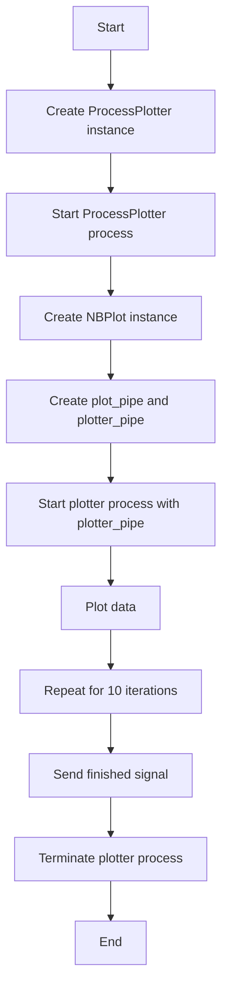
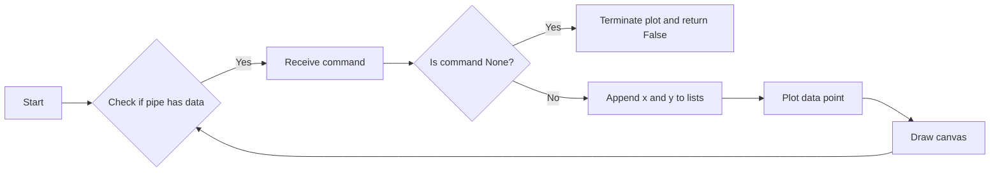
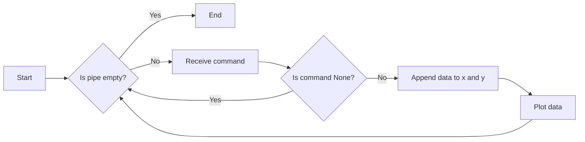
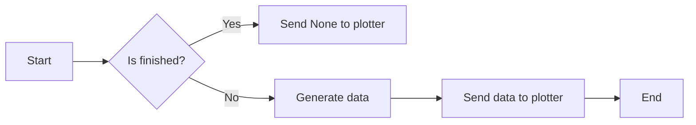

# `matplotlib\galleries\examples\misc\multiprocess_sgskip.py` 详细设计文档

This code demonstrates the use of multiprocessing in Python to generate data in one process and plot it in another.

## 整体流程



## 类结构

```
ProcessPlotter (Class)
├── x (List)
│   ├── List of x coordinates
│   └── [ ]
├── y (List)
│   ├── List of y coordinates
│   └── [ ]
├── pipe (Pipe)
│   ├── Used to receive data from NBPlot
│   └── [ ]
├── fig (Figure)
│   ├── Matplotlib figure
│   └── [ ]
├── ax (Axes)
│   ├── Matplotlib axes
│   └── [ ]
└── __call__(pipe) (Method)
    ├── Initializes the plotter
    └── [ ]
```

## 全局变量及字段


### `np`
    
NumPy module for numerical operations

类型：`module`
    


### `plt`
    
Matplotlib module for plotting

类型：`module`
    


### `mp`
    
Multiprocessing module for creating processes

类型：`module`
    


### `time`
    
Time module for time-related operations

类型：`module`
    


### `plt.get_backend`
    
Function to get the backend of the Matplotlib plotter

类型：`function`
    


### `main`
    
Main function of the script

类型：`function`
    


### `ProcessPlotter.x`
    
List to store x coordinates of the plotted points

类型：`list`
    


### `ProcessPlotter.y`
    
List to store y coordinates of the plotted points

类型：`list`
    


### `ProcessPlotter.pipe`
    
Pipe used for communication between the plotter and the parent process

类型：`multiprocessing.Pipe`
    


### `ProcessPlotter.fig`
    
Figure object for the plot

类型：`matplotlib.figure.Figure`
    


### `ProcessPlotter.ax`
    
Axes object for the plot

类型：`matplotlib.axes._subplots.AxesSubplot`
    


### `NBPlot.plot_pipe`
    
Pipe used for communication between the parent process and the plotter process

类型：`multiprocessing.Pipe`
    


### `NBPlot.plotter`
    
Instance of ProcessPlotter used by the plotter process

类型：`ProcessPlotter`
    


### `NBPlot.plot_process`
    
Process object for the plotter process

类型：`multiprocessing.Process`
    
    

## 全局函数及方法


### main()

主函数，用于启动NBPlot类的实例，并调用其plot方法多次，最后发送结束信号。

参数：

- 无

返回值：无

#### 流程图

```mermaid
graph LR
A[Start] --> B{Create NBPlot instance}
B --> C{Loop 10 times}
C --> D[Call plot()]
D --> E[Sleep 0.5s]
E --> C
C --> F[Call plot(finished=True)]
F --> G[End]
```

#### 带注释源码

```python
def main():
    pl = NBPlot()  # 创建NBPlot实例
    for _ in range(10):  # 循环10次
        pl.plot()  # 调用plot方法
        time.sleep(0.5)  # 等待0.5秒
    pl.plot(finished=True)  # 调用plot方法，发送结束信号
```


### ProcessPlotter.terminate

This method terminates the plotting process by closing all open plots.

参数：

- `None`：`None`，No parameters are passed to this method. It is called internally when a `None` command is received.

返回值：`None`，This method does not return any value.

#### 流程图

```mermaid
graph LR
A[Start] --> B{Check if command is None}
B -- Yes --> C[Call terminate()]
B -- No --> D[End]
C --> D
```

#### 带注释源码

```python
def terminate(self):
    plt.close('all')
```


### ProcessPlotter.call_back

This method is a callback function that continuously checks for incoming commands from the pipe. It appends the received data to the x and y lists and updates the plot accordingly.

参数：

- `command`：`tuple`，Contains the x and y coordinates of the data point to be plotted.

返回值：`bool`，Returns `True` if the callback function is still running, `False` if it has been terminated.

#### 流程图



#### 带注释源码

```python
def call_back(self):
    while self.pipe.poll():
        command = self.pipe.recv()
        if command is None:
            self.terminate()
            return False
        else:
            self.x.append(command[0])
            self.y.append(command[1])
            self.ax.plot(self.x, self.y, 'ro')
    self.fig.canvas.draw()
    return True
```


### ProcessPlotter.__call__

This method is the entry point for the `ProcessPlotter` class, responsible for setting up the plotting environment and continuously updating the plot with data received from a pipe.

参数：

- `pipe`：`multiprocessing.Pipe`，A pipe used to receive data from the parent process.

返回值：`None`，This method does not return a value.

#### 流程图



#### 带注释源码

```python
def __call__(self, pipe):
    print('starting plotter...')

    self.pipe = pipe
    self.fig, self.ax = plt.subplots()
    timer = self.fig.canvas.new_timer(interval=1000)
    timer.add_callback(self.call_back)
    timer.start()

    print('...done')
    plt.show()
```


### NBPlot.plot

This method sends data to the separate process that is responsible for plotting the data.

参数：

- `finished`：`bool`，Indicates whether the plotting process should be terminated. If `True`, sends `None` to the plotter process to terminate it.

返回值：`None`，This method does not return any value.

#### 流程图



#### 带注释源码

```python
def plot(self, finished=False):
    send = self.plot_pipe.send
    if finished:
        send(None)
    else:
        data = np.random.random(2)
        send(data)
``` 


## 关键组件


### 张量索引与惰性加载

用于在数据传输过程中延迟数据加载，直到实际需要时才进行索引和加载。

### 反量化支持

提供对反量化操作的支持，允许在量化过程中进行逆量化。

### 量化策略

定义了量化策略，用于在模型训练和推理过程中对模型参数进行量化。


## 问题及建议


### 已知问题

-   **全局状态管理**：`ProcessPlotter` 类中的 `x` 和 `y` 字段用于存储绘图数据，这些字段是类的实例变量，但它们在多个 `ProcessPlotter` 实例之间共享。这可能导致数据竞争和不可预测的行为，特别是在多线程环境中。
-   **异常处理**：代码中没有明显的异常处理机制。如果 `ProcessPlotter` 在处理数据时遇到错误，可能会导致整个程序崩溃。
-   **资源管理**：`ProcessPlotter` 类中的 `terminate` 方法关闭所有matplotlib图形，但没有确保所有资源都被正确释放。这可能导致资源泄漏。
-   **代码重复**：`NBPlot` 类中的 `plot` 方法每次都发送一个随机数据点，这可能导致绘图过于频繁，尤其是在高频率调用的情况下。

### 优化建议

-   **使用线程安全的数据结构**：如果需要在多线程环境中共享数据，应使用线程安全的数据结构，如 `queue.Queue`，以避免数据竞争。
-   **添加异常处理**：在 `ProcessPlotter` 和 `NBPlot` 类中添加异常处理，以确保在发生错误时程序能够优雅地处理异常。
-   **改进资源管理**：确保在 `ProcessPlotter` 类中正确管理所有资源，例如使用上下文管理器或确保所有资源在使用后都被释放。
-   **减少绘图频率**：如果绘图过于频繁，可以考虑使用定时器或事件驱动的方式来控制绘图频率，而不是在每次调用 `plot` 方法时都绘图。
-   **使用更高级的绘图库**：如果绘图是程序的关键部分，可以考虑使用更高级的绘图库，如 `plotly` 或 `bokeh`，它们提供了更丰富的交互功能和更好的性能。


## 其它


### 设计目标与约束

- 设计目标：
  - 实现一个多进程环境，其中一个进程用于生成数据，另一个进程用于绘图。
  - 确保数据在进程间安全传输。
  - 提供一个简单的接口来发送数据和结束绘图。

- 约束：
  - 使用Python的multiprocessing库来实现多进程。
  - 使用matplotlib库进行绘图。
  - 代码应尽可能简洁，易于理解和维护。

### 错误处理与异常设计

- 错误处理：
  - 在数据传输过程中，如果发生异常，应确保进程能够优雅地关闭。
  - 使用try-except块来捕获和处理可能发生的异常。

- 异常设计：
  - 定义自定义异常类，以处理特定的错误情况。
  - 在关键操作中抛出异常，并在调用方捕获和处理这些异常。

### 数据流与状态机

- 数据流：
  - 数据从主进程通过管道发送到绘图进程。
  - 绘图进程接收数据并更新图表。

- 状态机：
  - 绘图进程有两个状态：运行和终止。
  - 当接收到None命令时，绘图进程进入终止状态。

### 外部依赖与接口契约

- 外部依赖：
  - matplotlib：用于绘图。
  - numpy：用于生成随机数据。
  - multiprocessing：用于创建和管理进程。

- 接口契约：
  - ProcessPlotter类：负责接收数据并绘图。
  - NBPlot类：负责创建管道、启动绘图进程和发送数据。
  - main函数：程序的入口点，负责创建NBPlot实例并调用其方法。


    