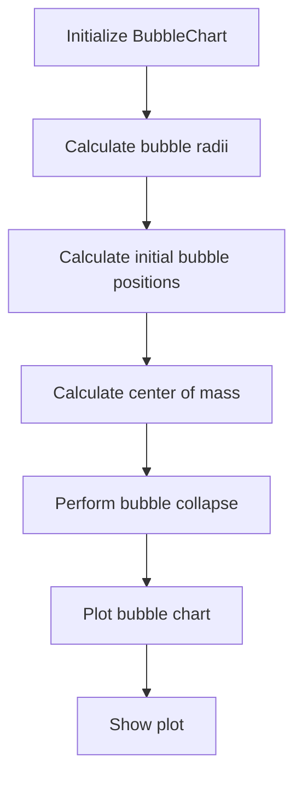
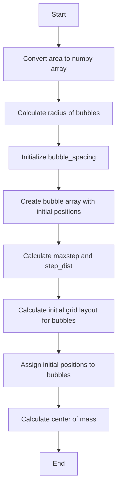
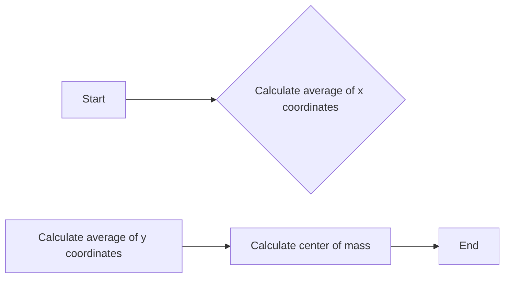
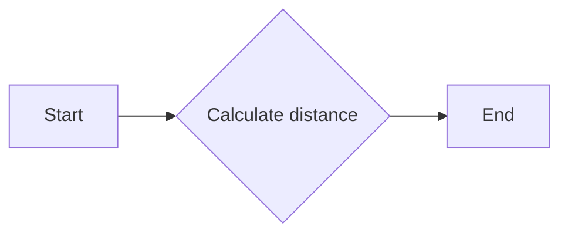
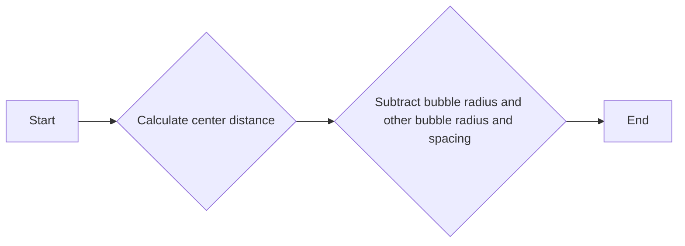
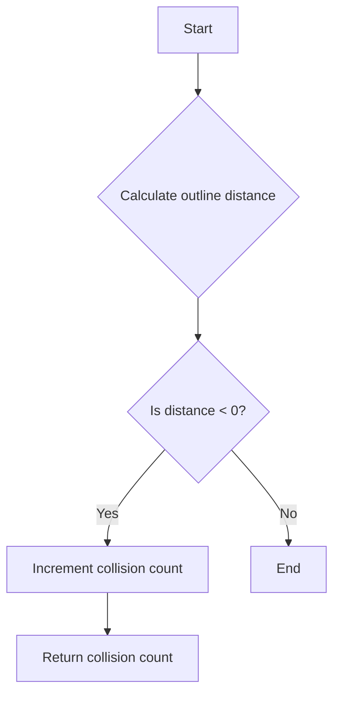
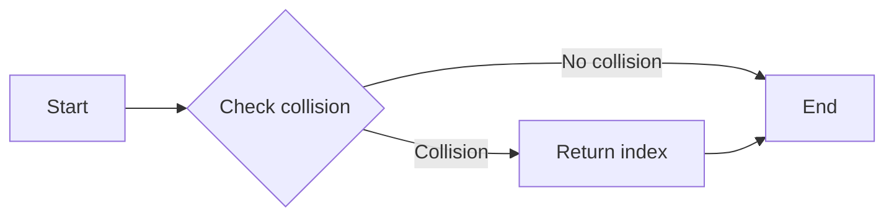
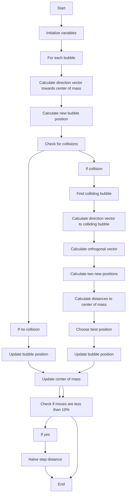
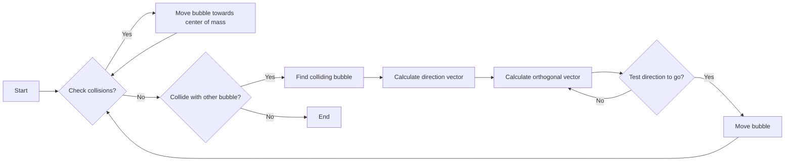

# `matplotlib\galleries\examples\misc\packed_bubbles.py` 详细设计文档

This code defines a BubbleChart class that creates a packed-bubble chart to represent scalar data, such as market share of different desktop browsers. It calculates the positions of bubbles based on their area and attempts to move them towards the center of mass while avoiding collisions.

## 整体流程



## 类结构

```
BubbleChart (主类)
├── matplotlib.pyplot (外部库)
├── numpy (外部库)
└── browser_market_share (全局变量)
```

## 全局变量及字段


### `browser_market_share`
    
Dictionary containing the market share of different browsers, their names, and colors.

类型：`dict`
    


### `BubbleChart.bubble_spacing`
    
Minimal spacing between bubbles after collapsing.

类型：`float`
    


### `BubbleChart.bubbles`
    
Array containing the positions and sizes of the bubbles.

类型：`numpy.ndarray`
    


### `BubbleChart.maxstep`
    
Maximum step size for moving the bubbles.

类型：`float`
    


### `BubbleChart.step_dist`
    
Distance for each step in the collapse process.

类型：`float`
    


### `BubbleChart.com`
    
Center of mass of the bubbles.

类型：`numpy.ndarray`
    
    

## 全局函数及方法


### BubbleChart.__init__

Setup for bubble collapse.

参数：

- `area`：`array-like`，BubbleChart类的气泡面积。
- `bubble_spacing`：`float`，默认值为0，气泡在折叠后的最小间距。

返回值：无

#### 流程图



#### 带注释源码

```python
def __init__(self, area, bubble_spacing=0):
    """
    Setup for bubble collapse.

    Parameters
    ----------
    area : array-like
        Area of the bubbles.
    bubble_spacing : float, default: 0
        Minimal spacing between bubbles after collapsing.

    Notes
    -----
    If "area" is sorted, the results might look weird.
    """
    area = np.asarray(area)
    r = np.sqrt(area / np.pi)

    self.bubble_spacing = bubble_spacing
    self.bubbles = np.ones((len(area), 4))
    self.bubbles[:, 2] = r
    self.bubbles[:, 3] = area
    self.maxstep = 2 * self.bubbles[:, 2].max() + self.bubble_spacing
    self.step_dist = self.maxstep / 2

    # calculate initial grid layout for bubbles
    length = np.ceil(np.sqrt(len(self.bubbles)))
    grid = np.arange(length) * self.maxstep
    gx, gy = np.meshgrid(grid, grid)
    self.bubbles[:, 0] = gx.flatten()[:len(self.bubbles)]
    self.bubbles[:, 1] = gy.flatten()[:len(self.bubbles)]

    self.com = self.center_of_mass()
```


### BubbleChart.center_of_mass

Calculate the center of mass of the bubbles.

参数：

- `self`：`BubbleChart`，The instance of BubbleChart class.

返回值：`numpy.ndarray`，The coordinates of the center of mass.

#### 流程图



#### 带注释源码

```python
def center_of_mass(self):
    return np.average(
        self.bubbles[:, :2], axis=0, weights=self.bubbles[:, 3]
    )
```


### BubbleChart.center_distance

Calculate the Euclidean distance between a single bubble and all other bubbles.

参数：

- `bubble`：`numpy.ndarray`，The position and radius of the bubble to calculate the distance from.
- `bubbles`：`numpy.ndarray`，The positions and radii of all other bubbles.

返回值：`numpy.ndarray`，The Euclidean distances between the bubble and all other bubbles.

#### 流程图



#### 带注释源码

```python
def center_distance(self, bubble, bubbles):
    return np.hypot(bubble[0] - bubbles[:, 0],
                    bubble[1] - bubbles[:, 1])
```


### BubbleChart.outline_distance

Calculate the distance from the outline of a bubble to the outline of another bubble, considering the spacing between them.

参数：

- `bubble`：`numpy.ndarray`，The coordinates and radius of the bubble to calculate the distance from.
- `bubbles`：`numpy.ndarray`，An array of bubbles with their coordinates and radii.

返回值：`numpy.ndarray`，The distances from the outline of the bubble to the outlines of the other bubbles.

#### 流程图



#### 带注释源码

```python
def outline_distance(self, bubble, bubbles):
    center_distance = self.center_distance(bubble, bubbles)
    return center_distance - bubble[2] - \
        bubbles[:, 2] - self.bubble_spacing
``` 


### BubbleChart.check_collisions

Check if a bubble collides with other bubbles.

参数：

- `bubble`：`numpy.ndarray`，The position and radius of the bubble to check for collisions.
- `bubbles`：`numpy.ndarray`，The positions and radii of all other bubbles.

返回值：`int`，The number of collisions detected.

#### 流程图



#### 带注释源码

```python
def check_collisions(self, bubble, bubbles):
    distance = self.outline_distance(bubble, bubbles)
    return len(distance[distance < 0])
```


### BubbleChart.collides_with

This method checks if a given bubble collides with any other bubble in the chart.

参数：

- `bubble`：`numpy.ndarray`，The position and radius of the bubble to check for collisions.
- `bubbles`：`numpy.ndarray`，The positions and radii of all other bubbles in the chart.

返回值：`numpy.ndarray`，The index of the first bubble that collides with the given bubble, or `None` if there is no collision.

#### 流程图



#### 带注释源码

```python
def collides_with(self, bubble, bubbles):
    distance = self.outline_distance(bubble, bubbles)
    return np.argmin(distance, keepdims=True)
```


### bubble_chart.collapse

Move bubbles to the center of mass.

参数：

- `n_iterations`：`int`，Number of moves to perform. Default is 50.

返回值：`None`，No return value, the method modifies the state of the `bubble_chart` object.

#### 流程图



#### 带注释源码

```python
def collapse(self, n_iterations=50):
    """
    Move bubbles to the center of mass.

    Parameters
    ----------
    n_iterations : int, default: 50
        Number of moves to perform.
    """
    for _i in range(n_iterations):
        moves = 0
        for i in range(len(self.bubbles)):
            rest_bub = np.delete(self.bubbles, i, 0)
            # try to move directly towards the center of mass
            # direction vector from bubble to the center of mass
            dir_vec = self.com - self.bubbles[i, :2]
            # shorten direction vector to have length of 1
            dir_vec = dir_vec / np.sqrt(dir_vec.dot(dir_vec))
            # calculate new bubble position
            new_point = self.bubbles[i, :2] + dir_vec * self.step_dist
            new_bubble = np.append(new_point, self.bubbles[i, 2:4])
            # check whether new bubble collides with other bubbles
            if not self.check_collisions(new_bubble, rest_bub):
                self.bubbles[i, :] = new_bubble
                self.com = self.center_of_mass()
                moves += 1
            else:
                # try to move around a bubble that you collide with
                # find colliding bubble
                for colliding in self.collides_with(new_bubble, rest_bub):
                    # calculate direction vector
                    dir_vec = rest_bub[colliding, :2] - self.bubbles[i, :2]
                    dir_vec = dir_vec / np.sqrt(dir_vec.dot(dir_vec))
                    # calculate orthogonal vector
                    orth = np.array([dir_vec[1], -dir_vec[0]])
                    # test which direction to go
                    new_point1 = (self.bubbles[i, :2] + orth *
                                  self.step_dist)
                    new_point2 = (self.bubbles[i, :2] - orth *
                                  self.step_dist)
                    dist1 = self.center_distance(
                        self.com, np.array([new_point1]))
                    dist2 = self.center_distance(
                        self.com, np.array([new_point2]))
                    new_point = new_point1 if dist1 < dist2 else new_point2
                    new_bubble = np.append(new_point, self.bubbles[i, 2:4])
                    if not self.check_collisions(new_bubble, rest_bub):
                        self.bubbles[i, :] = new_bubble
                        self.com = self.center_of_mass()
        if moves / len(self.bubbles) < 0.1:
            self.step_dist = self.step_dist / 2
```


### BubbleChart.plot

Draw the bubble plot.

参数：

- `ax`：`matplotlib.axes.Axes`，用于绘图的matplotlib轴对象。
- `labels`：`list`，气泡的标签列表。
- `colors`：`list`，气泡的颜色列表。

返回值：无

#### 流程图



#### 带注释源码

```python
def plot(self, ax, labels, colors):
    """
    Draw the bubble plot.

    Parameters
    ----------
    ax : matplotlib.axes.Axes
        The matplotlib axis object for plotting.
    labels : list
        The labels of the bubbles.
    colors : list
        The colors of the bubbles.
    """
    for i in range(len(self.bubbles)):
        circ = plt.Circle(
            self.bubbles[i, :2], self.bubbles[i, 2], color=colors[i])
        ax.add_patch(circ)
        ax.text(*self.bubbles[i, :2], labels[i],
                horizontalalignment='center', verticalalignment='center')
```


## 关键组件


### 张量索引与惰性加载

张量索引与惰性加载是用于处理和访问数据结构中的元素，特别是在处理大型数据集时，它允许在需要时才计算或加载数据，从而提高效率。

### 反量化支持

反量化支持是指算法能够处理和解释量化后的数据，通常用于优化模型大小和加速推理过程。

### 量化策略

量化策略是指将浮点数数据转换为低精度整数表示的方法，这可以减少模型的大小和计算需求，同时保持可接受的精度。

## 问题及建议


### 已知问题

-   **性能问题**：`collapse` 方法中的循环可能会执行很多次，特别是当气泡之间发生碰撞时。这可能导致算法运行时间较长，尤其是在处理大量气泡时。
-   **内存使用**：`self.bubbles` 数组在每次尝试移动气泡时都会被修改，这可能导致大量的内存分配和释放，尤其是在循环中。
-   **代码可读性**：`collapse` 方法中的逻辑较为复杂，包含多个嵌套循环和条件语句，这可能会降低代码的可读性和可维护性。

### 优化建议

-   **使用更高效的算法**：考虑使用更高效的算法来处理气泡的移动和碰撞检测，例如使用空间划分数据结构（如四叉树或k-d树）来减少需要检查的气泡数量。
-   **减少内存分配**：避免在循环中频繁修改 `self.bubbles` 数组，可以考虑使用生成器或迭代器来处理气泡的移动，从而减少内存分配。
-   **重构代码**：将 `collapse` 方法中的逻辑分解为更小的函数，以提高代码的可读性和可维护性。例如，可以将碰撞检测和气泡移动的逻辑分别封装成独立的函数。
-   **并行处理**：如果处理大量气泡，可以考虑使用并行处理技术来加速算法的执行，例如使用多线程或多进程。
-   **优化碰撞检测**：在碰撞检测中，可以优化距离计算和碰撞检测逻辑，以减少不必要的计算。


## 其它


### 设计目标与约束

- 设计目标：创建一个能够展示不同浏览器市场份额的packed-bubble图表。
- 约束条件：图表应尽可能地将气泡移动到质心附近，同时避免碰撞。
- 性能要求：算法应在合理的时间内完成气泡的移动。

### 错误处理与异常设计

- 异常处理：确保在输入数据格式不正确或数据类型不匹配时抛出异常。
- 错误日志：记录关键操作中的错误和异常，以便于问题追踪和调试。

### 数据流与状态机

- 数据流：输入数据（市场份额）通过BubbleChart类进行处理，最终生成图表。
- 状态机：BubbleChart类包含多个状态，如初始化、计算质心、检查碰撞、移动气泡等。

### 外部依赖与接口契约

- 外部依赖：matplotlib和numpy库用于绘图和数学计算。
- 接口契约：BubbleChart类提供接口以创建和展示图表，外部调用者需遵循这些接口。

### 测试与验证

- 单元测试：为BubbleChart类的每个方法编写单元测试，确保其功能正确。
- 集成测试：测试BubbleChart类与外部库的集成，确保整体系统稳定运行。

### 维护与扩展

- 维护策略：定期审查代码，修复潜在的错误，并优化性能。
- 扩展性：设计允许轻松添加新的图表类型或改进现有算法。


    