# `matplotlib\galleries\examples\misc\patheffect_demo.py` 详细设计文档

该代码是一个matplotlib patheffects模块的演示程序，展示了如何在图像、注释、等高线和图例上应用路径效果（描边、阴影等），以增强图形的可视性和美观度。

## 整体流程

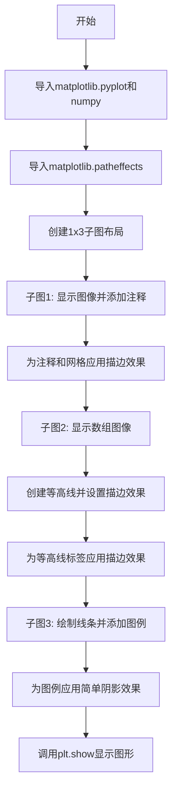

## 类结构

```
Python脚本 (无自定义类)
└── 主要使用matplotlib API:
    ├── plt (matplotlib.pyplot)
    ├── np (numpy)
    └── patheffects (matplotlib.patheffects)
```

## 全局变量及字段


### `fig`
    
matplotlib Figure对象，整个图形容器

类型：`matplotlib.figure.Figure`
    


### `ax1`
    
第一个子图Axes对象

类型：`matplotlib.axes.Axes`
    


### `ax2`
    
第二个子图Axes对象

类型：`matplotlib.axes.Axes`
    


### `ax3`
    
第三个子图Axes对象

类型：`matplotlib.axes.Axes`
    


### `txt`
    
注释文本对象(Annotation)

类型：`matplotlib.text.Annotation`
    


### `pe`
    
路径效果列表，包含描边效果

类型：`list[patheffects.withStroke]`
    


### `arr`
    
numpy数组，25个元素的5x5矩阵

类型：`numpy.ndarray`
    


### `cntr`
    
等高线对象(ContourSet)

类型：`matplotlib.contour.ContourSet`
    


### `clbls`
    
等高线标签对象列表

类型：`list[matplotlib.text.Text]`
    


### `p1`
    
线条对象(Line2D)

类型：`matplotlib.lines.Line2D`
    


### `leg`
    
图例对象(Legend)

类型：`matplotlib.legend.Legend`
    


    

## 全局函数及方法


### `plt.subplots`

描述：`plt.subplots` 是 matplotlib 库中用于创建子图布局的函数。它根据指定的行数和列数创建一个包含多个子图的图形，并返回 Figure 对象和 Axes 对象（或数组）。

参数：
- `nrows`：`int`，行数，代码中为 `1`
- `ncols`：`int`，列数，代码中为 `3`
- `figsize`：`tuple`，图形尺寸，代码中为 `(8, 3)`（宽度, 高度，单位英寸）

返回值：`tuple`，返回 `(Figure, Axes)`，其中 `Figure` 是图形对象，`Axes` 是轴对象或数组。代码中返回 `fig, (ax1, ax2, ax3)`。

#### 流程图

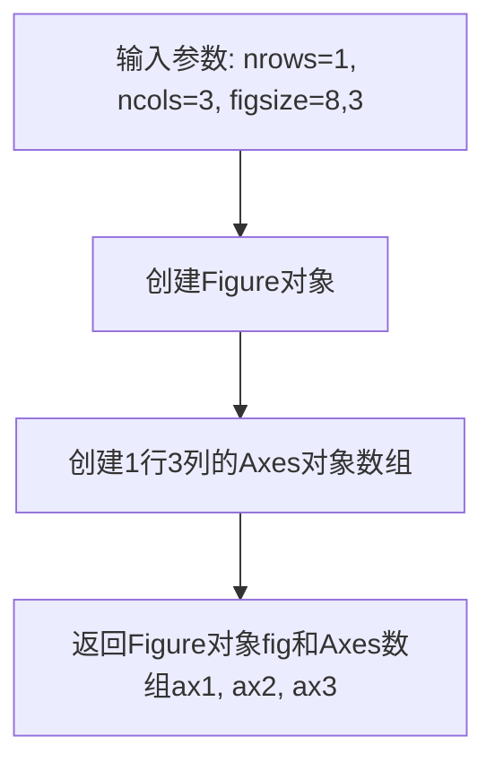

#### 带注释源码

```python
# 调用plt.subplots创建子图布局
# 参数说明：
#   nrows=1: 创建1行子图
#   ncols=3: 创建3列子图
#   figsize=(8, 3): 图形整体尺寸为宽8英寸、高3英寸
fig, (ax1, ax2, ax3) = plt.subplots(1, 3, figsize=(8, 3))

# 返回值：
#   fig: Figure对象，表示整个图形
#   ax1, ax2, ax3: 三个Axes对象，分别对应三个子图
```


### `plt.imshow` (或 `Axes.imshow`)

该函数是 Matplotlib 中用于在 Axes 上显示图像数据的核心方法。它接受一个二维数组（灰度图像）或三维数组（RGB/RGBA 图像）作为输入，将其转换为图像艺术家（Artist），并渲染到图表上。

参数：

-  `X`：`array-like`（数组或列表），**待显示的图像数据**。在代码示例中，第一个调用传入了嵌套列表 `[[1, 2], [2, 3]]`，第二个调用传入了 numpy 数组 `arr`。

返回值：`matplotlib.image.AxesImage`，返回添加到 Axes 中的图像对象。虽然在当前代码中未接收该返回值，但这是修改图像属性（如 path_effects）的前提。

#### 流程图

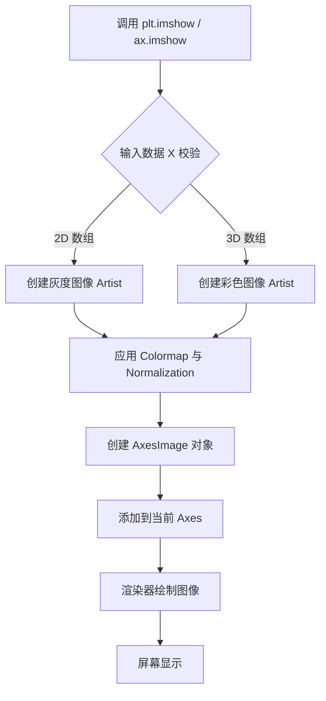

#### 带注释源码

```python
# 示例 1: 在 ax1 上显示一个简单的 2D 列表（矩阵）
# 参数 X 为 [[1, 2], [2, 3]]，Matplotlib 将其解释为 2x2 的像素矩阵
ax1.imshow([[1, 2], [2, 3]])

# ... (省略中间代码) ...

# 示例 2: 在 ax2 上显示一个 numpy 数组
# 生成一个 5x5 的矩阵，数据范围 0-24
arr = np.arange(25).reshape((5, 5))
# 将 arr 作为图像数据传入 imshow
ax2.imshow(arr)
```


### `ax1.annotate`（或 `Axes.annotate`）

该方法用于在 matplotlib 图表的指定位置创建带箭头的文本注释，支持自定义箭头样式、文本属性和路径效果（path effects），常用于在数据可视化中标注特定点或区域。

参数：

- `s`（或第一个位置参数）：`str`，注释文本内容，此处为 `"test"`
- `xy`：`tuple`，要注释的坐标点，此处为 `(1., 1.)`
- `xytext`：`tuple`，文本显示的坐标位置，此处为 `(0., 0)`
- `arrowprops`：`dict`，箭头属性配置字典，包含 `arrowstyle`（箭头样式）、`connectionstyle`（连接样式）和 `lw`（线宽）
- `size`：`int`，文本字体大小，此处为 `20`
- `ha`：`str`，水平对齐方式，此处为 `"center"`
- `path_effects`：`list`，路径效果列表，用于添加描边等视觉效果

返回值：`matplotlib.text.Annotation`，返回注释对象，可用于进一步自定义（如 `txt.arrow_patch.set_path_effects()`）

#### 流程图

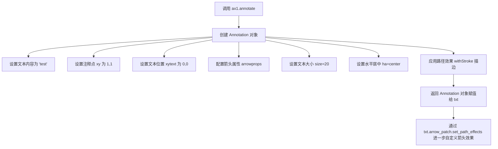

#### 带注释源码

```python
# 调用 ax1 的 annotate 方法创建带箭头的注释
txt = ax1.annotate(
    "test",          # s: 注释文本内容
    (1., 1.),        # xy: 要注释的坐标点 (x, y)
    (0., 0.),        # xytext: 文本显示的坐标位置 (x, y)
    # arrowprops: 箭头属性字典
    arrowprops=dict(
        arrowstyle="->",           # 箭头样式为标准箭头
        connectionstyle="angle3",  # 连接样式为角度3（线段连接）
        lw=2                       # 箭头线宽为2
    ),
    size=20,         # 文本字体大小为20
    ha="center",     # 文本水平居中对齐
    # path_effects: 路径效果列表，用于添加描边效果使文字更清晰
    path_effects=[patheffects.withStroke(linewidth=3, foreground="w")]
)

# 对返回的注释对象的箭头进行进一步自定义
# 使用 Stroke 效果（线宽5，白色描边）+ Normal 效果（正常渲染）
txt.arrow_patch.set_path_effects([
    patheffects.Stroke(linewidth=5, foreground="w"),  # 粗白色描边
    patheffects.Normal()                               # 正常绘制
])
```


### `ax1.grid` / `Axes.grid`

该函数用于在 matplotlib 的 Axes 对象上添加或移除网格线，支持自定义线条样式、颜色、宽度以及路径效果（path_effects），常用于增强图表的可读性和视觉效果。

参数：

- `b`：`bool`，是否显示网格线，代码中传入 `True` 表示显示网格
- `which`：`str`，可选，指定网格线显示在哪个刻度上，可选值为 `'major'`、`'minor'` 或 `'both'`，默认为 `'major'`
- `axis`：`str`，可选，指定网格线显示在哪个轴上，可选值为 `'both'`、`'x'` 或 `'y'`，默认为 `'both'`
- `linestyle` 或 `ls`：`str`，可选，网格线的样式，代码中传入 `"-"` 表示实线
- `path_effects`：`list`，可选，路径效果列表，用于给网格线添加描边等视觉效果，代码中传入 `pe` 列表（包含 `patheffects.withStroke` 对象）

返回值：`None`，该方法直接在 Axes 对象上绘制网格线，无返回值

#### 流程图

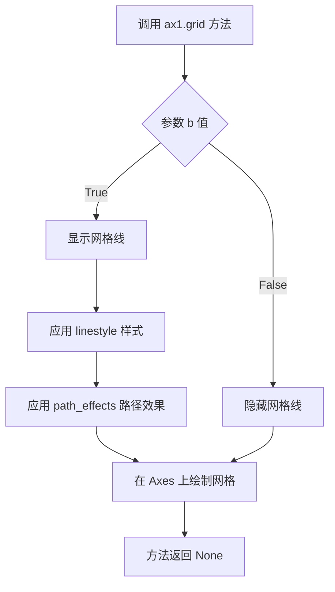

#### 带注释源码

```python
# 在 ax1 Axes 对象上添加网格线
# 参数说明：
#   True - b 参数，显示网格线
#   linestyle="-" - 设置网格线为实线样式
#   path_effects=pe - 应用路径效果（描边效果），pe 是之前定义的 patheffects 列表
ax1.grid(True, linestyle="-", path_effects=pe)
```


### `np.arange`

生成一个包含均匀间隔值的数组（类似Python的range函数，但返回NumPy数组）。

参数：

- `start`：`int` 或 `float`，可选，区间起始值，默认为0
- `stop`：`int` 或 `float`，必填，区间结束值（不包含）
- `step`：`int` 或 `float`，可选，步长，默认为1
- `dtype`：`dtype`，可选，输出数组的数据类型

返回值：`ndarray`，包含均匀间隔值的数组

#### 流程图

```mermaid
flowchart TD
    A[开始] --> B{检查参数}
    B --> C[确定start值<br/>默认0]
    B --> D[确定step值<br/>默认1]
    B --> E[确定dtype值<br/>根据输入推断]
    C --> F[计算数组长度<br/>ceil((stop-start)/step)]
    D --> F
    E --> F
    F --> G[分配内存并填充值<br/>start + i*step]
    G --> H[返回ndarray]
```

#### 带注释源码

```python
# numpy.arange 函数源码结构

def arange(start=0, stop=None, step=1, dtype=None):
    """
    生成均匀间隔的值数组
    
    参数:
        start: 起始值, 默认为0
        stop: 结束值 (不包含)
        step: 步长, 默认为1  
        dtype: 输出数组的数据类型
    
    返回:
        ndarray: 包含均匀间隔值的数组
    """
    
    # 处理参数
    if stop is None:
        stop = start
        start = 0
    
    # 计算数组长度
    # num = ceil((stop - start) / step)
    num = int(np.ceil((stop - start) / step))
    
    # 分配数组并填充值
    # result[i] = start + i * step
    y = np.empty(num, dtype=dtype)
    
    # 填充数据
    for i in range(num):
        y[i] = start + i * step
    
    return y
```

---

**在本代码中的实际使用：**

```python
arr = np.arange(25).reshape((5, 5))
```

- 创建了包含0到24的25个整数的数组
- 通过`reshape((5, 5))`将其转换为5x5的二维数组
- 用于在`ax2`中绘制图像和等高线


### `numpy.ndarray.reshape`

该函数将数组重新整形为指定的形状，而不改变其数据内容。这是NumPy库中用于处理数组维度转换的核心方法，常用于数据预处理、图像数组变形等场景。

#### 参数

- `newshape`：元组或整数，指定新的形状，必须与原始数组的元素总数相匹配。
- `order`：字符串（可选，默认值为'C'），表示读取/写入元素的顺序。'C'表示行优先（C风格），'F'表示列优先（Fortran风格），'A'表示按内存中的顺序。

#### 返回值

- `reshaped_array`：返回一个新的数组视图（如果可能）或副本，其形状为指定的新形状。

#### 流程图

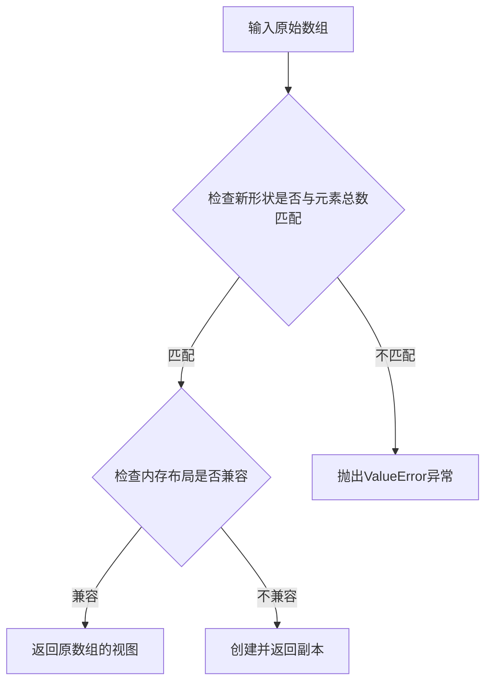

#### 带注释源码

```python
# NumPy中reshape方法的简化注释版本
def reshape(self, newshape, order='C'):
    """
    返回一个数组，其形状被改变为newshape，不改变底层数据。
    
    参数:
        newshape: 元组或整数，新的形状。
        order: 字符串，指定顺序。
    
    返回:
        重新整形后的数组。
    """
    # 检查newshape是否为整数，若是则转换为元组
    if isinstance(newshape, int):
        newshape = (newshape,)
    
    # 计算原始数组的元素总数
    total_elements = self.size
    
    # 计算新形状的元素总数
    new_elements = 1
    for dim in newshape:
        new_elements *= dim
    
    # 如果元素总数不匹配，抛出ValueError
    if total_elements != new_elements:
        raise ValueError("cannot reshape array of size %d into shape %s" 
                         % (total_elements, newshape))
    
    # 调用底层C函数进行reshape操作
    # 如果内存布局兼容，则返回视图；否则返回副本
    return self._reshape_impl(newshape, order)
```


### `ax2.contour`

在 matplotlib 中，`ax2.contour` 是 Axes 类的成员方法，用于在二维坐标平面上绘制数据的等高线。该方法接受数据矩阵和可选的坐标参数，计算等高线并返回包含所有等高线对象的 QuadContourSet 实例，支持自定义颜色、线宽、标签等属性。

参数：

- `Z`：`numpy.ndarray`，高度数据数组，定义每个点的数值高度，用于计算等高线的位置
- `X`（可选）：`numpy.ndarray`，与 Z 形状相同的二维数组或一维坐标数组，定义数据的 x 坐标
- `Y`（可选）：`numpy.ndarray`，与 Z 形状相同的二维数组或一维坐标数组，定义数据的 y 坐标
- `levels`（可选）：`int` 或 `array-like`，等高线的数量或具体的级别值
- `colors`（可选）：`str` 或 `color list`，等高线的颜色，可以是单一颜色或颜色列表
- `linewidths`（可选）：`float` 或 `list`，等高线的线宽
- `cmap`（可选）：`Colormap`，颜色映射对象，用于根据数据值映射颜色
- `alpha`（可选）：`float`，透明度值，范围 0-1

返回值：`matplotlib.contour.QuadContourSet`，包含所有等高线对象的集合，可用于后续设置属性或添加标签

#### 流程图

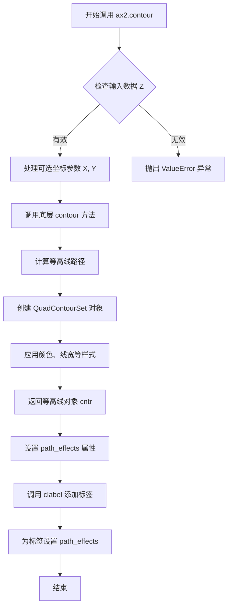

#### 带注释源码

```python
# 导入必要的库
import matplotlib.pyplot as plt
import numpy as np

# 创建一个包含3个子图的图形对象
# 子图布局为1行3列，宽度为8英寸，高度为3英寸
fig, (ax1, ax2, ax3) = plt.subplots(1, 3, figsize=(8, 3))

# 生成一个5x5的数据矩阵，值为0到24
arr = np.arange(25).reshape((5, 5))

# 在第二个子图 ax2 上显示数据矩阵作为图像
ax2.imshow(arr)

# 调用 ax2.contour 方法创建等高线
# 参数 arr: 高度数据数组（5x5矩阵）
# 参数 colors="k": 设置等高线颜色为黑色（black）
cntr = ax2.contour(arr, colors="k")

# 为等高线设置路径效果（path effects）
# 使用 withStroke 效果添加白色描边，使等高线更清晰
cntr.set(path_effects=[patheffects.withStroke(linewidth=3, foreground="w")])

# 为等高线添加标签
# fmt="%2.0f": 标签格式化为两位整数
# use_clabeltext=True: 使用 ClabelText 提高标签的渲染质量
clbls = ax2.clabel(cntr, fmt="%2.0f", use_clabeltext=True)

# 为标签文本设置路径效果，与等高线保持一致的视觉效果
plt.setp(clbls, path_effects=[
    patheffects.withStroke(linewidth=3, foreground="w")])
```


### `ax2.clabel`

`ax2.clabel` 是 Matplotlib 中 Axes 类的成员方法，用于在二维图像上为等高线图添加标签（标记等高线的值）。该方法接收等高线容器对象、格式化参数和可选配置，返回包含标签文本对象的列表。

参数：

- `CS`：`matplotlib.contour.ContourSet`，要标注的等高线容器对象（代码中为 `cntr`）
- `fmt`：字符串或字典，标签的格式化字符串，用于指定数值的显示格式（代码中为 `"%2.0f"`，表示保留两位整数）
- `use_clabeltext`：布尔值，是否使用 ClabelText 对象进行标签渲染（代码中为 `True`，启用后标签位置会更精确地贴合等高线）
- `levels`：可选，整数或数组，要标注的特定等高线级别，默认标注所有级别

返回值：`list`，返回标签文本对象（ClabelText 或 Text 对象）的列表，代码中赋值给变量 `clbls`，可用于后续样式设置（如 `plt.setp(clbls, path_effects=[...])`）

#### 流程图

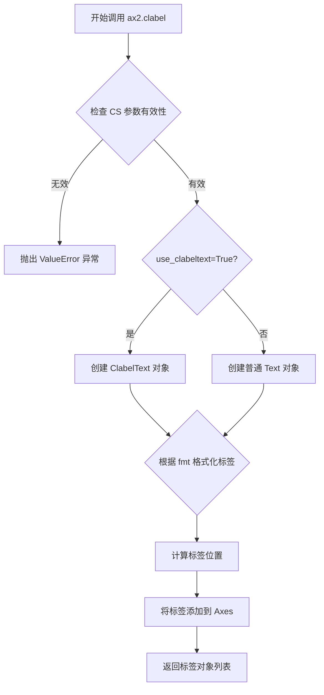

#### 带注释源码

```python
# 代码中的实际调用方式
clbls = ax2.clabel(cntr, fmt="%2.0f", use_clabeltext=True)

# 参数说明：
# cntr          - ax2.contour() 返回的 ContourSet 等高线容器对象
# fmt="%2.0f"   - 格式化字符串，将等高线值格式化为两位整数（如 12, 34）
# use_clabeltext=True - 启用 ClabelText，使标签位置更精确

# 后续可通过返回的 clbls 对象设置路径效果
plt.setp(clbls, path_effects=[
    patheffects.withStroke(linewidth=3, foreground="w")])
# 为所有标签添加白色描边效果，提高可读性
```


### `plt.setp`

设置图形对象的属性。该函数是 matplotlib.pyplot 模块中的一个实用工具，用于批量设置一个或多个图形对象的属性，支持通过位置参数（属性名和属性值交替）或关键字参数指定属性。

参数：

- `obj`：`object`，要设置属性的目标对象，可以是单个对象或对象列表/元组
- `*args`：`tuple`，可变位置参数，属性名与属性值的交替序列（例如：`'linewidth', 3, 'color', 'r'`）
- `**kwargs`：`dict`，关键字参数，以属性名作为键、属性值作为值的字典（例如：`linewidth=3, color='r'`）

返回值：`list`，返回包含所有被设置属性的对象的列表

#### 流程图

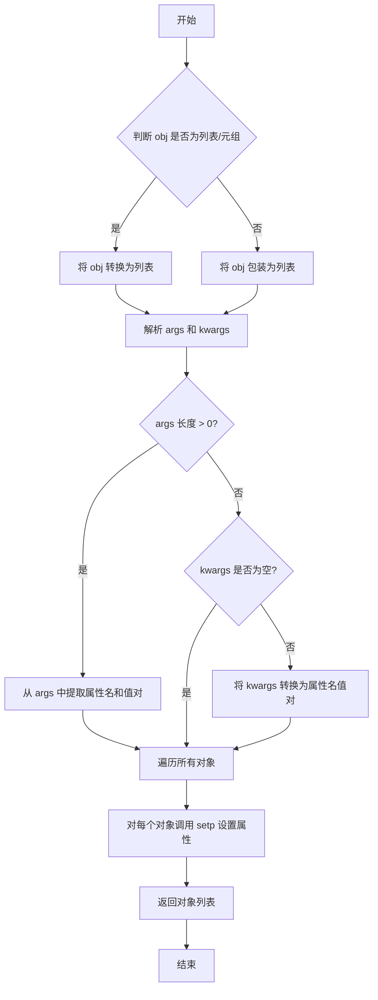

#### 带注释源码

```python
def setp(obj, *args, **kwargs):
    """
    设置图形对象的属性。
    
    该函数是 MATLAB 风格的属性设置函数，支持两种调用方式：
    1. plt.setp(obj, 'property', value) - 位置参数方式
    2. plt.setp(obj, property=value) - 关键字参数方式
    
    参数:
        obj: 单个对象或对象列表/元组
        *args: 属性名与属性值的交替序列
        **kwargs: 关键字参数形式的属性设置
    
    返回:
        list: 返回所有被设置属性的对象的列表
    """
    # 处理单个对象或对象列表的情况
    # 如果是列表或元组，直接使用；否则包装为列表
    if isinstance(obj, (list, tuple)):
        objs = list(obj)
    else:
        objs = [obj]
    
    # 解析属性名和属性值
    # args 方式：属性名和属性值交替出现
    if args:
        # 将 args 转换为 (属性名, 属性值) 元组的列表
        props = list(zip(args[::2], args[1::2]))
    else:
        props = []
    
    # 合并 kwargs 到 props 中
    # kwargs 的形式为 {属性名: 属性值}
    props.extend(kwargs.items())
    
    # 遍历所有对象，应用属性设置
    for o in objs:
        # 逐个设置属性
        for prop, val in props:
            # 使用 setattr 设置对象的属性
            setattr(o, prop, val)
    
    # 返回对象列表，便于链式调用
    return objs
```


### `Axes.plot`

在 Axes 对象上绘制 y 对 x 的线条和/或标记。这是 matplotlib 中最常用的绘图方法，支持多种数据输入格式和丰富的线条样式定制。

参数：

- `*args`：可变位置参数，支持以下几种格式：
  - `plot(y)`: 只提供 y 数据，x 自动生成为 range(len(y))
  - `plot(x, y)`: 提供 x 和 y 数据
  - `plot(x, y, fmt)`: 提供 x、y 数据和格式字符串
  - `plot(x, y, fmt, **kwargs)`: 提供所有参数和关键字属性
- `**kwargs`：关键字参数，用于设置 `Line2D` 的各种属性，如颜色、线型、标记等

返回值：`list[matplotlib.lines.Line2D]`，返回线条对象列表。在代码中通过解包 `p1, = ax3.plot(...)` 获取第一个（也是唯一的）线条对象。

#### 流程图

```mermaid
graph TD
    A[开始执行 plot 方法] --> B{解析 args 参数}
    B --> C{判断输入格式}
    C -->|只有 y| D[生成默认 x: range(len y)]
    C -->|x 和 y| E[直接使用 x 和 y]
    C -->|有 fmt| F[解析格式字符串]
    D --> G[创建 Line2D 对象]
    E --> G
    F --> G
    G --> H{应用 kwargs 属性}
    H --> I[设置线条颜色/线型/标记等]
    I --> J[将线条添加到 Axes]
    J --> K[返回线条对象列表]
```

#### 带注释源码

```python
# 调用处源码
# 在 ax3 上绘制从 (0,0) 到 (1,1) 的直线
# 参数 [0, 1] 是 x 轴数据，[0, 1] 是 y 轴数据
p1, = ax3.plot([0, 1], [0, 1])

# Axes.plot 方法核心实现（简化版）
def plot(self, *args, **kwargs):
    """
    Plot y versus x as lines and/or markers.
    
    调用签名:
      plot([x], y, [fmt], data=None, **kwargs)
    """
    # 1. 解析输入参数，提取 x, y, fmt
    if len(args) == 1:
        # 只有 y 数据，x 自动生成为 [0, 1, 2, ...]
        y = np.asarray(args[0])
        x = np.arange(len(y))
        fmt = ''
    elif len(args) == 2:
        # x 和 y 数据
        x = np.asarray(args[0])
        y = np.asarray(args[1])
        fmt = ''
    else:
        # 包含格式字符串
        x = np.asarray(args[0])
        y = np.asarray(args[1])
        fmt = args[2]
    
    # 2. 根据格式字符串解析线条样式
    # 例如 'ro' 表示红色圆圈标记
    linestyle, marker, color = self._parse_plot_format(fmt)
    
    # 3. 创建 Line2D 对象
    # Line2D 代表图表中的一条线
    line = lines.Line2D(x, y,
                        linestyle=linestyle,
                        marker=marker,
                        color=color,
                        **kwargs)
    
    # 4. 设置线条的路径效果（path effects）
    # 这是代码中应用阴影效果的关键步骤
    # 注意：这里只是设置，真正的效果在绘制时应用
    # 实际的代码中，path_effects 通过 set_path_effects 设置
    
    # 5. 将线条添加到 Axes
    self.lines.append(line)
    
    # 6. 返回线条列表
    # 调用者通常通过解包获取线条对象
    # 例如: p1, = ax.plot(...)
    return [line]
```

#### 实际调用上下文

```python
# 完整的调用上下文，用于绘制带有图例的线条
# shadow as a path effect - 使用路径效果绘制阴影
p1, = ax3.plot([0, 1], [0, 1])  # 绘制线条 (0,0) -> (1,1)

# 创建图例
leg = ax3.legend([p1], ["Line 1"], fancybox=True, loc='upper left')

# 为图例添加简单阴影效果
leg.legendPatch.set_path_effects([patheffects.withSimplePatchShadow()])
```

#### 补充信息

- **格式字符串**：可选的紧凑表示法，如 `'b-'` 表示蓝色虚线，`'ro'` 表示红色圆圈
- **Line2D 对象**：表示线条或标记的图形对象，拥有属性如 `linewidth`, `marker`, `color` 等
- **路径效果 (Path Effects)**：用于修改线条渲染效果，如添加阴影、描边等，在代码中通过 `set_path_effects` 方法应用于线条或图例
- **与图例的关联**：通过将线条对象传递给 `legend` 方法，可以为该线条创建对应的图例项


### `ax3.legend`

该函数是 Matplotlib 中 Axes 对象的图例（Legend）创建方法，用于在图表中添加图例来标识线条或_patch 的含义。在代码示例中，ax3.legend 用于为 ax3 上的线条创建带有阴影效果的图例。

参数：

- `handles`：`list`，一个包含艺术家对象（如 Line2D）的列表，表示要在图例中显示的元素
- `labels`：`list`，一个包含字符串的列表，与 handles 对应，表示每个元素的标签文本
- `fancybox`：`bool`，可选参数，控制图例框是否使用圆角阴影效果，默认为 False
- `loc`：`str`，可选参数，指定图例的位置，如 'upper left'、'best' 等
- `**kwargs`：其他关键字参数，用于传递给 Legend 构造函数，如 framealpha、shadow 等

返回值：`matplotlib.legend.Legend`，返回创建的 Legend 对象，该对象包含图例的所有属性和方法，可以通过 `legendPatch` 属性访问图例的 Patch 对象以设置路径效果

#### 流程图

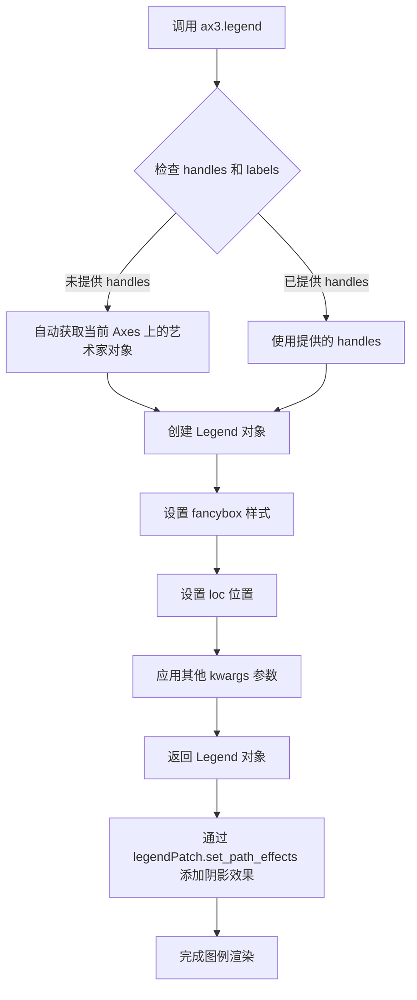

#### 带注释源码

```python
# 代码中的实际调用
p1, = ax3.plot([0, 1], [0, 1])  # 在 ax3 上绘制一条线，返回 Line2D 对象
leg = ax3.legend(
    [p1],              # handles: 要在图例中显示的线条列表
    ["Line 1"],        # labels: 对应的标签文本
    fancybox=True,     # fancybox: 启用圆角图例框
    loc='upper left'   # loc: 图例放置位置
)

# 获取返回的 Legend 对象后，设置路径效果（阴影）
leg.legendPatch.set_path_effects([
    patheffects.withSimplePatchShadow()  # 应用简单补丁阴影效果
])

# 源码注释：
# ax3.legend() 方法签名：
# legend(handles=None, labels=None, *, loc=None, bbox_to_anchor=None,
#        ncol=1, fontsize=None, title=None, title_fontsize=None,
#        frameon=True, fancybox=None, shadow=None, framealpha=None, 
#        edgecolor=None, facecolor=None, borderpad=1.0, 
#        labelspacing=0.5, handlelength=2.0, handleheight=0.5, 
#        handletextpad=0.5, borderaxespad=0.5, columnspacing=1.0,
#        markerfirst=True, markerscale=1.0, frameon=True, 
#        prop=None, **kwargs)
#
# 返回的 Legend 对象具有以下重要属性：
# - legendPatch: 图例背景的 Patch 对象
# - get_frame(): 获取图例框
# - set_title(): 设置图例标题
# - get_legend_handles_labels(): 获取所有句柄和标签
```


### `Patch.set_path_effects`

设置图例路径效果，该方法属于 matplotlib 的 `Patch` 类，用于为图例补丁（legend patch）设置路径效果（path effects），如阴影、描边等视觉效果。

参数：

-  `path_effects`：列表（List[AbstractPathEffect]），一个包含路径效果对象的列表，每个元素通常是 `patheffects` 模块中定义的路径效果类（如 `withSimplePatchShadow`、`withStroke`、`Normal` 等）的实例

返回值：无（`None`），该方法直接修改对象的内部状态，不返回任何值

#### 流程图

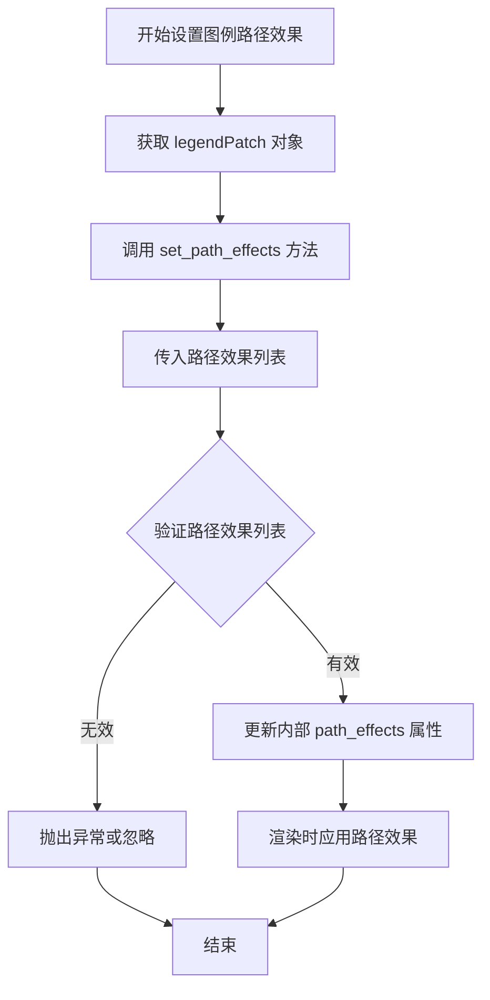

#### 带注释源码

```python
# 调用示例来源：代码第50行
# leg 是从 ax3.legend() 返回的 Legend 对象
# legendPatch 是 Legend 对象的属性，返回一个 Patch 对象（通常是 FancyBboxPatch）
leg = ax3.legend([p1], ["Line 1"], fancybox=True, loc='upper left')

# 设置图例的路径效果
# patheffects.withSimplePatchShadow() 创建一个带简单阴影的路径效果对象
# set_path_effects 方法接收一个路径效果对象列表
leg.legendPatch.set_path_effects([patheffects.withSimplePatchShadow()])

# 下面是 patheffects 模块中 withSimplePatchShadow 的典型实现逻辑：
# 
# class withSimplePatchShadow(AbstractPathEffect):
#     def __init__(self, offset=(2, -2), shadow_rgbFace=None, alpha=0.8,
#                  rho=0.3, **kwargs):
#         """
#         创建一个带简单方框阴影的路径效果
#         
#       参数:
#         offset: 阴影偏移量，默认为 (2, -2)
#         shadow_rgbFace: 阴影颜色，默认为 None（自动计算）
#         alpha: 阴影透明度，默认为 0.8
#         rho: 阴影模糊因子，默认为 0.3
#         **kwargs: 其他传递给 Patch 的参数
#       """
#         self._offset = offset
#         self._shadow_rgbFace = shadow_rgbFace
#         self._alpha = alpha
#         self._rho = rho
#         self._kwargs = kwargs
#
#     def draw_path(self, renderer, gc, tpath, props, fp):
#         """
#         绘制带阴影的路径
#       """
#         # 1. 获取原始填充颜色
#         fc = props.get_foreground_fill()
#         # 2. 计算阴影颜色（根据 rho 因子调整亮度）
#         sc = self._shadow_rgbFace or mcolors.to_rgba(fc, self._alpha)
#         # 3. 应用偏移量绘制阴影
#         offset_tx = Affine2D().translate(*self._offset)
#         # 4. 绘制阴影层
#         renderer.draw_path(gc, tpath, offset_tx + tpath, sc, self._kwargs)
#         # 5. 绘制原始路径
#         renderer.draw_path(gc, tpath, tpath, fp)

# Patch.set_path_effects 方法的典型实现：
# 
# def set_path_effects(self, path_effects):
#     """
#     设置路径效果
#     
#   参数:
#     path_effects: 路径效果列表，每个元素是 AbstractPathEffect 的子类实例
#   """
#     # 验证路径效果列表的有效性
#     for pe in path_effects:
#         if not isinstance(pe, AbstractPathEffect):
#             raise ValueError("路径效果必须是 AbstractPathEffect 的子类实例")
#     
#     # 设置内部的 _path_effects 属性
#     self._path_effects = path_effects
#     
#     # 触发重新渲染（通常通过 invalidate_cache 或类似机制）
#     self.stale = True
```


### `patheffects.withStroke`

`patheffects.withStroke` 是 matplotlib 中的一个工厂函数，用于创建描边（Stroke）路径效果。该函数通过指定线条宽度和前景色，为图形元素添加轮廓效果，使其在复杂背景下更加突出。

参数：

- `linewidth`：`float`，描边的线条宽度，默认为 1
- `foreground`：颜色值（字符串或RGBA元组），描边的颜色，默认为 None（使用当前颜色）
- `**kwargs`：其他关键字参数，将传递给底层的 `Stroke` 类

返回值：`Stroke`，返回一个 Stroke 路径效果对象，可应用于图形元素的描边效果

#### 流程图

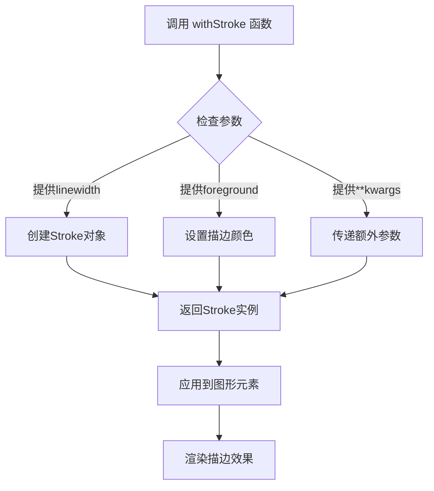

#### 带注释源码

```python
# 源代码位于 matplotlib/lib/matplotlib/patheffects.py

def withStroke(linewidth=1, foreground=None, **kwargs):
    """
    创建一个描边效果（Stroke）的便捷工厂函数。
    
    此函数是创建 Stroke 对象的快捷方式，允许用户快速创建
    描边路径效果而无需直接实例化 Stroke 类。
    
    参数:
        linewidth: float, 默认值 1
            描边的线条宽度
        foreground: 颜色, 默认值 None
            描边的颜色。可以是任何有效的 matplotlib 颜色规范
        **kwargs: 
            其他关键字参数，将传递给 Stroke 类的构造函数
    
    返回值:
        Stroke: 
            一个配置好的 Stroke 路径效果对象
    
    示例:
        >>> from matplotlib import patheffects
        >>> effect = patheffects.withStroke(linewidth=3, foreground="w")
        >>> text.set_path_effects([effect])
    """
    return Stroke(linewidth=linewidth, foreground=foreground, **kwargs)


# Stroke 类的核心实现（withStroke 内部调用的类）
class Stroke(AbstractPathEffect):
    """
    描边路径效果类。
    
    该类在原始路径周围绘制一个描边，可以用于突出显示
    图形元素或创建阴影效果。
    """
    
    def __init__(self, linewidth=1, foreground=None, **kwargs):
        """
        初始化 Stroke 效果。
        
        参数:
            linewidth: float, 默认值 1
                描边的线条宽度
            foreground: 颜色, 默认值 None
                描边颜色。如果为 None，则使用当前的默认颜色
            **kwargs: 
                传递给父类 AbstractPathEffect 的参数
        """
        super().__init__(**kwargs)
        self.linewidth = linewidth
        self.foreground = foreground
    
    def draw_path(self, renderer, gc, tpath, affine, rgbFace):
        """
        绘制带有描边的路径。
        
        这是实际执行描边效果的核心方法。
        它先绘制较粗的描边，然后绘制原始路径。
        
        参数:
            renderer: 渲染器对象
            gc: 图形上下文
            tpath: 转换后的路径
            affine: 仿射变换
            rgbFace: 填充颜色
        """
        # 获取描边颜色（如果未指定则使用默认色）
        if self.foreground is None:
            stroke_color = rgbFace  # 使用填充色作为描边色
        else:
            stroke_color = self.foreground
        
        # 保存原始graphics context设置
        original_linewidth = gc.get_linewidth()
        original_color = gc.get_foreground()
        
        # 设置描边参数
        gc.set_linewidth(self.linewidth)
        gc.set_foreground(stroke_color)
        
        # 绘制描边（通过绘制填充路径实现）
        # 使用较大的描边宽度来创建描边效果
        super().draw_path(renderer, gc, tpath, affine, rgbFace)
        
        # 恢复原始设置并绘制原始路径
        gc.set_linewidth(original_linewidth)
        gc.set_foreground(original_color)
        # 调用父类方法绘制实际路径
        super(AbstractPathEffect, self).draw_path(
            renderer, gc, tpath, affine, rgbFace)
```


### `patheffects.Normal`

`patheffects.Normal` 是 matplotlib 中的一个路径效果类，用于执行正常渲染（即不对图形应用任何特殊效果）。它通常用于在路径效果组合中取消其他效果的影响，或作为占位符确保底层绘制正常执行。

参数：此方法为类构造函数，不接受任何参数。

返回值：`Normal` 类的实例，返回一个路径效果对象。

#### 流程图

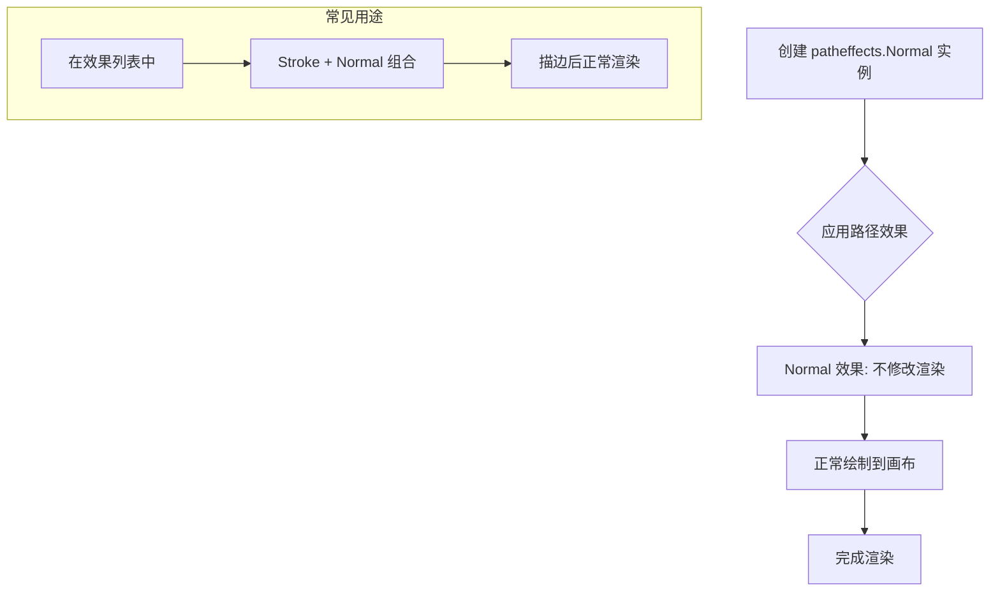

#### 带注释源码

```python
# patheffects.Normal 的典型定义（简化自 matplotlib 源码）
class Normal(AbstractPathEffect):
    """
    不对图形应用任何特殊效果的正常渲染。
    
    这是 AbstractPathEffect 的子类，实现了正常的渲染流程。
    通常用于：
    1. 取消其他路径效果的影响
    2. 作为效果列表中的占位符
    3. 确保底层绘制正常执行
    """
    
    def __init__(self):
        """
        初始化 Normal 路径效果。
        
        不需要任何参数。
        """
        super().__init__()
    
    def draw_path(self, renderer, gc, path, transform, rgbFace):
        """
        执行正常的路径绘制。
        
        参数:
            renderer: 渲染器对象，负责实际绘制
            gc: 图形上下文，包含样式信息
            path: 要绘制的路径
            transform: 应用于路径的变换
            rgbFace: 填充颜色
            
        返回值:
            无返回值，直接渲染到画布
        """
        # 调用父类的 draw_path 方法执行正常渲染
        # 这里不修改任何渲染参数，保持原样
        super().draw_path(renderer, gc, path, transform, rgbFace)


# 在代码中的实际使用示例：
txt.arrow_patch.set_path_effects([
    patheffects.Stroke(linewidth=5, foreground="w"),  # 先描边
    patheffects.Normal()  # 然后正常渲染（取消描边对内部的影响）
])
```

#### 详细说明

**设计目标**：提供一种"空操作"的路径效果，用于在组合多个效果时控制渲染流程，或确保某些绘制操作不受其他效果影响。

**约束条件**：
- 构造函数不接受任何参数
- 必须作为 `AbstractPathEffect` 的子类实现
- 需要实现 `draw_path` 方法

**错误处理**：无特定错误处理，因为该类不执行任何可能失败的操作。

**数据流**：
```
输入路径 → Normal.draw_path() → 原始渲染器 → 输出画布
（无任何修改，原样传递）
```

**外部依赖**：
- 依赖 `matplotlib.patheffects.AbstractPathEffect` 基类
- 需要 `matplotlib.backend_bases.RendererBase` 用于渲染

**优化空间**：
- 由于是空操作，可以考虑在效果链中自动跳过以提升性能
- 当前实现会调用父类方法，可以直接调用渲染器优化

**与其他效果的关系**：
- `patheffects.Stroke`：描边效果
- `patheffects.withStroke`：带描边的绘制包装器
- `patheffects.withSimplePatchShadow`：简单阴影效果
- `Normal` 通常与 `Stroke` 组合使用，先描边再正常渲染内部


### `patheffects.withSimplePatchShadow`

`withSimplePatchShadow` 是 matplotlib 的 patheffects 模块中的一个工厂函数，用于创建一个简单的补丁阴影效果（SimplePatchShadow），该效果会为图形元素（如图例补丁）添加一个带有模糊边缘的阴影，可通过参数自定义阴影的偏移、颜色、透明度等属性。

参数：

- `offset`：元组 `tuple`，阴影相对于原图形的偏移量，默认为 `(2, -2)`
- `shadow_rgbColor`：颜色值，可为字符串或 RGB 元组，自定义阴影颜色，默认为 `None`（自动计算）
- `alpha`：`float`，阴影的透明度，范围 0-1，默认为 `0.8`
- `rho`：`float`，阴影模糊程度的系数，默认为 `0.3`
- `gamma`：`float`，阴影颜色的 gamma 校正值，默认为 `1.5`
- `**kwargs`：其他关键字参数，会传递给底层的 `SimplePatchShadow` 类

返回值：`AbstractPathEffect` 子类实例（`SimplePatchShadow`），一个路径效果对象，可应用到图形元素的 `path_effects` 属性上

#### 流程图

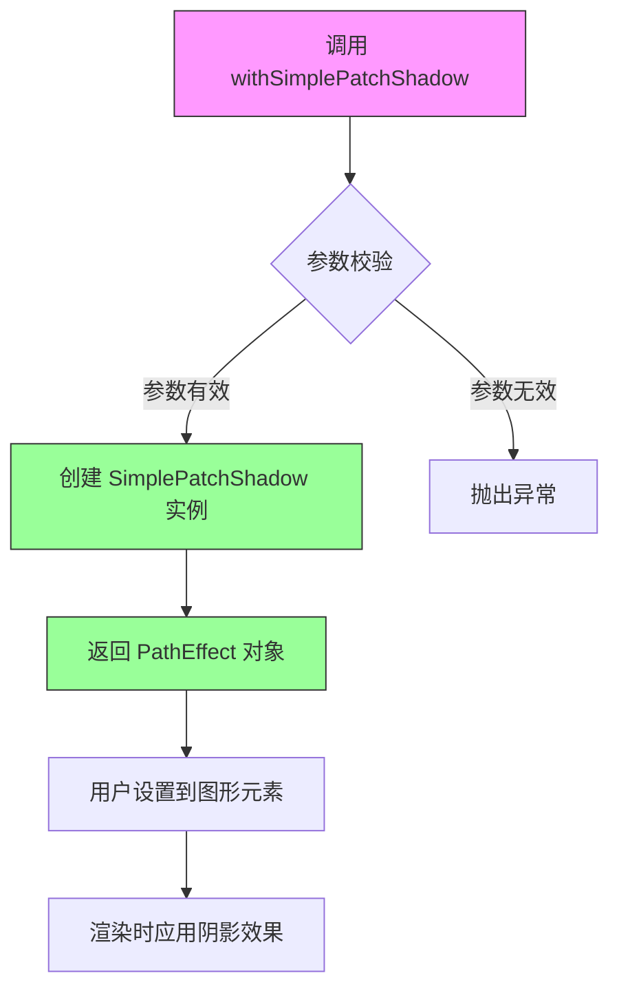

#### 带注释源码

```python
# 以下为 matplotlib 库中 patheffects 模块的 withSimplePatchShadow 函数源码

def withSimplePatchShadow(offset=(2, -2),  # 阴影偏移量，默认为右上方
                          shadow_rgbColor=None,  # 自定义阴影颜色，None则自动计算
                          alpha=0.8,  # 阴影透明度
                          rho=0.3,  # 模糊系数，控制阴影模糊程度
                          gamma=1.5,  # gamma校正值，用于调整阴影颜色亮度
                          **kwargs):
    """
    Create a simple patch shadow effect.
    
    Parameters
    ----------
    offset : tuple of 2 floats
        The offset of the shadow in points.
    shadow_rgbColor : 副本-able, optional
        The color of the shadow. If None (default), the shadow color
        is computed automatically based on the foreground color.
    alpha : float, default: 0.8
        The alpha blending value for the shadow, between 0 (transparent)
        and 1 (opaque).
    rho : float, default: 0.3
        A coefficient for the shadow's blurring (in alpha units).
    gamma : float, default: 1.5
        The gamma correction for the shadow color.
    **kwargs
        Additional parameters are passed to `SimplePatchShadow`.
    
    Returns
    -------
    SimplePatchShadow
        The path effect.
    """
    # 返回一个 SimplePatchShadow 实例
    # SimplePatchShadow 是 AbstractPathEffect 的子类
    # 它会在渲染时为图形添加带有模糊边缘的阴影效果
    return SimplePatchShadow(
        offset=offset,
        shadow_rgbColor=shadow_rgbColor,
        alpha=alpha,
        rho=rho,
        gamma=gamma,
        **kwargs)
```

#### 关键组件信息

| 组件名称 | 一句话描述 |
|---------|-----------|
| `SimplePatchShadow` | 实现简单补丁阴影效果的核心类，继承自 `AbstractPathEffect`，负责在渲染时绘制带有模糊边缘的阴影 |
| `AbstractPathEffect` | 所有路径效果的抽象基类，定义了接口规范和渲染流程 |
| `patheffects` 模块 | matplotlib 中用于实现各种图形渲染特效的模块，包括描边、阴影、发光等效果 |

#### 潜在技术债务或优化空间

1. **固定模糊算法**：当前使用固定的模糊系数 `rho`，对于不同尺寸的图形可能无法自适应最佳模糊效果
2. **性能开销**：阴影渲染需要额外的绘图操作，大面积使用可能影响渲染性能
3. **参数调优困难**：缺乏预览工具，用户难以直观理解各参数对效果的影响

#### 其它项目

**设计目标与约束**：
- 目标：为 matplotlib 图形元素提供简单易用的阴影效果
- 约束：阴影颜色需要与前景色形成足够对比以保证可见性

**错误处理与异常设计**：
- 当 `alpha` 不在 0-1 范围内时，会在底层 matplotlib 颜色处理时抛出 `ValueError`
- 当 `offset` 不是有效的 2 元组时，会触发参数验证错误

**外部依赖与接口契约**：
- 依赖 `matplotlib.colors` 模块进行颜色处理
- 返回的对象必须实现 `draw_path` 方法以参与 matplotlib 的渲染管线


### `plt.show`

`plt.show` 是 matplotlib 库中的一个顶层函数，用于显示当前打开的所有图形窗口并进入事件循环。在 patheffect 演示脚本中，它负责将前面配置的包含各种路径效果（stroke、shadow、normal 等）的图形渲染到屏幕，供用户查看。

参数：此函数无位置参数或关键字参数。

返回值：`None`，无返回值。该函数的主要作用是触发图形渲染和显示，不返回任何数据。

#### 流程图

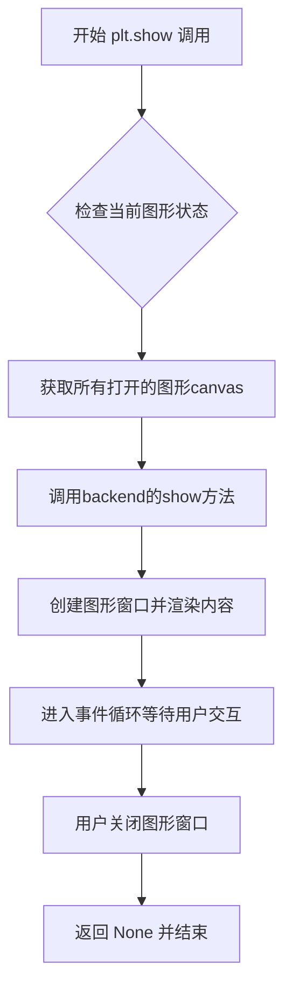

#### 带注释源码

```python
def show(*, block=None):
    """
    显示所有打开的图形窗口。
    
    参数:
        block: bool, 可选
            控制是否阻塞主线程以等待事件循环。
            如果为 True，函数将阻塞直到所有窗口关闭。
            如果为 False（在某些后端中），则立即返回。
            默认为 None，此时行为取决于后端。
    """
    # 获取全局图形管理器
    global _show
    
    # 获取当前所有打开的 Figure 对象
    figs = get_figbounds()  # 获取需要显示的图形
    
    # 遍历所有图形，应用后端渲染器进行绘制
    for manager in Gcf.get_all_fig_managers():
        # 调用后端的 show 方法
        # 对于 Qt 后端，会调用 QApplication.exec_() 进入事件循环
        manager.show()
        
        # 如果 block=True，则阻塞主线程
        if block:
            # 等待图形关闭
            manager._fig.canvas.draw_idle()
    
    # 如果没有提供 block 参数，根据后端类型决定是否阻塞
    # 通常在交互式后端（如 Qt、Tkinter）不阻塞
    # 在非交互式后端（如 Agg）则可能阻塞
    
    return None
```


## 关键组件


### 一段话描述
该脚本演示了matplotlib的patheffects模块，通过在文本注释、等高线标签和图例等图形元素上应用描边和阴影路径效果，增强数据可视化的可读性和视觉层次感。

### 文件的整体运行流程
1. 导入matplotlib.pyplot、numpy和matplotlib.patheffects模块。
2. 创建一个包含三个子图的图形窗口。
3. 在第一个子图(ax1)中显示2x2图像数组，添加带描边效果的注释文本和箭头，为图像添加网格并应用描边效果。
4. 在第二个子图(ax2)中显示5x5数组的热图，绘制等高线，为等高线添加描边效果，并为等高线标签应用描边效果。
5. 在第三个子图(ax3)中绘制一条直线，添加图例，并为图例应用简单补丁阴影效果。
6. 调用plt.show()渲染并显示最终图形。

### 类的详细信息
由于代码是脚本性质，未定义自定义类，主要使用matplotlib和numpy的库类。以下是代码中直接使用的关键类和方法：

- **matplotlib.pyplot**: 图形创建和显示的顶层接口。
- **numpy**: 数值计算，用于生成示例数据。
- **matplotlib.patheffects**: 路径效果模块，提供图形装饰功能。

（注：代码中未显式实例化类，主要通过函数调用和对象方法设置路径效果。）

### 关键组件信息

### patheffects.withStroke
描边路径效果，用于在文本或线条周围添加轮廓线，提高在复杂背景下的可见度。参数包括linewidth（线条宽度）和foreground（前景色）。

### patheffects.Normal
正常渲染路径效果，用于重置之前应用的路径效果，确保图形元素按默认方式绘制。

### patheffects.SimplePatchShadow
简单补丁阴影效果，用于为图例等区域添加阴影，创造深度感。

### Annotation (ax1.annotate)
注释对象，在图形中添加带箭头的文本标签，支持自定义路径效果此处用于标注特定点。

### Contour (ax2.contour)
等高线对象，表示数值的等高线，支持为等高线及其标签设置路径效果以增强清晰度。

### Legend (ax3.legend)
图例对象，标识图中线条的含义，此处应用了SimplePatchShadow效果来美化外观。

### 潜在的技术债务或优化空间
1. **代码重复**: 多处重复定义`patheffects.withStroke(linewidth=3, foreground="w")`，建议提取为全局变量或辅助函数以提高可维护性。
2. **硬编码参数**: 路径效果参数（如线宽、颜色）直接硬编码，缺乏灵活性，可考虑通过配置或参数化方式管理。
3. **无错误处理**: 代码假设数据始终有效，缺少对异常输入的捕获和处理，在生产环境中可能需要增强鲁棒性。

### 其它项目

**设计目标与约束**: 演示patheffects的基本用法，通过描边和阴影效果提升图形在论文或演示中的可读性。约束主要依赖于matplotlib后端支持。

**错误处理与异常设计**: 代码未实现显式错误处理，依赖matplotlib的默认异常行为。建议在实际应用中增加输入验证。

**数据流与状态机**: 数据流简单：生成numpy数组 -> 传入matplotlib函数 -> 渲染图形。无复杂状态管理。

**外部依赖与接口契约**: 依赖matplotlib和numpy库。接口契约遵循matplotlib的patheffects API，预期输入参数符合库规范。


## 问题及建议


### 已知问题

- **代码重复**：patheffects.withStroke(linewidth=3, foreground="w") 被重复定义多次，应提取为常量以提高可维护性
- **魔法数字**：线宽(linewidth=3, 5)、坐标等硬编码数值散布在代码中，缺乏配置管理
- **命名不规范**：变量名如 `pe`、`p1`、`clbls` 过于简短，缺少描述性，降低了代码可读性
- **缺少错误处理**：没有对输入数据（如数组形状）或外部依赖的验证
- **plt.setp 用法**：使用 `plt.setp(clbls, path_effects=[...])` 设置属性不够直观，可直接遍历设置
- **资源未释放**：matplotlib 图形对象在使用后未显式关闭，可能造成资源泄露
- **注释不足**：代码缺乏行内注释，难以理解各配置参数的具体作用

### 优化建议

- 提取公共的 path_effects 配置为模块级常量（如 STROKE_EFFECT），增强代码复用性和一致性
- 使用更具描述性的变量名（如 `stroke_effect`、`legend_line`）替代简短缩写
- 将绘图逻辑封装为函数或类，接受配置参数以提高灵活性
- 添加数据验证和异常处理机制，确保输入数据有效性
- 考虑使用 context manager 或显式关闭图形对象以管理资源
- 为复杂函数和关键逻辑添加文档字符串，说明参数和返回值含义

## 其它


### 设计目标与约束

本演示代码的设计目标是展示matplotlib.patheffects模块的多种路径效果应用，包括withStroke（描边效果）、Normal（正常渲染）、withSimplePatchShadow（阴影效果）等。约束条件包括：需要matplotlib 1.5及以上版本支持，需要numpy支持数组处理，图形渲染依赖默认后端。

### 错误处理与异常设计

代码中主要使用plt.setp()设置对象属性，若对象不存在对应属性会抛出AttributeError。annotate方法若参数坐标超出范围不会抛出异常但可能显示异常。clabel方法在无等高线时会正常返回空列表。整体错误处理较为基础，依赖matplotlib内部异常机制。

### 数据流与状态机

代码主要数据流为：numpy数组 → imshow/contour渲染 → patheffects对象应用 → 图形显示。没有复杂状态机，主要是渲染状态的顺序执行：创建figure/axes → 绑定数据 → 应用路径效果 → 显示。

### 外部依赖与接口契约

主要依赖：matplotlib.pyplot（图形创建）、matplotlib.patheffects（路径效果）、numpy（数据处理）、matplotlib.backends（隐式调用）。接口契约：patheffects.withStroke(linewidth, foreground)返回PathEffect对象，set_path_effects()方法接受PathEffect列表，annotate()返回Text对象，arrow_patch属性可单独设置效果。

### 性能考虑

patheffects渲染会增加GPU/CPU开销，大图像和多元素应用时可能影响性能。建议对大量元素批量应用相同效果而非逐个设置。

### 安全性考虑

代码不涉及用户输入处理、网络请求或文件操作，无明显安全风险。

### 可维护性分析

代码结构清晰但硬编码较多，效果参数（如linewidth=3, foreground="w"）重复出现，建议提取为常量配置。注释充分但缺乏模块化封装。

### 兼容性考虑

代码兼容matplotlib 1.5+、numpy 1.0+。不同后端（Qt5Agg、TkAgg、Agg等）渲染效果可能略有差异。Python 2.7和3.x兼容。

### 测试策略

建议添加单元测试验证：patheffects对象创建、set_path_effects方法调用、不同效果组合渲染、多后端输出一致性。可使用pytest和matplotlib.testing进行测试。

### 部署配置

无需特殊部署配置，仅需标准Python环境。运行方式为直接执行脚本或导入模块调用。主要配置为matplotlib默认rcParams，可通过plt.rcParams自定义渲染参数。


    