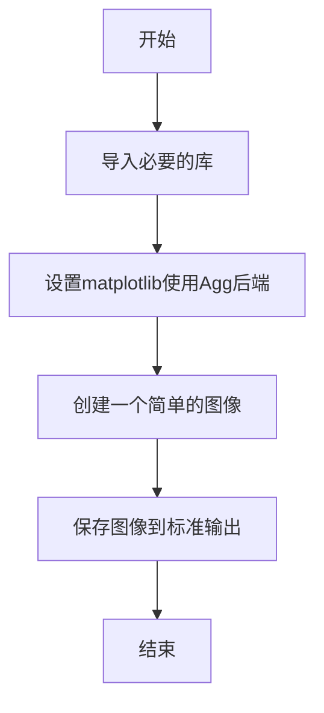
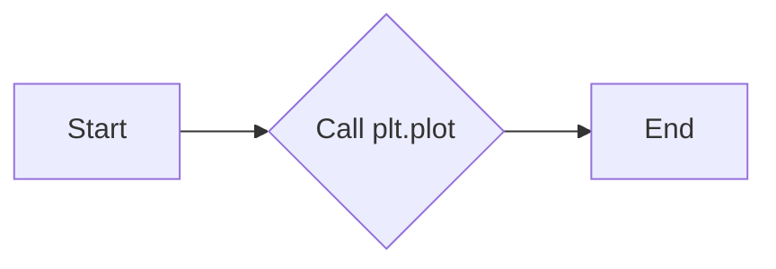
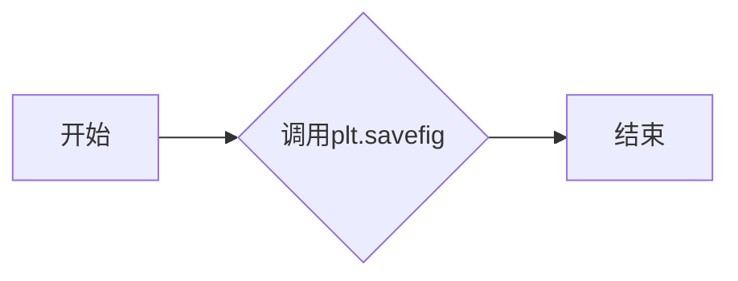

# `matplotlib\galleries\examples\misc\print_stdout_sgskip.py` 详细设计文档

This code is designed to print a simple PNG image to the standard output using matplotlib.

## 整体流程



## 类结构

```
matplotlib.pyplot
```

## 全局变量及字段


### `sys.stdout.buffer`
    
Buffer object for writing binary data to stdout.

类型：`buffer`
    


### `matplotlib.pyplot`
    
Module for plotting and saving plots.

类型：`module`
    


### `plt`
    
Submodule of matplotlib.pyplot for plotting and saving plots.

类型：`module`
    


### `matplotlib.pyplot.plot`
    
Function to create a line plot.

类型：`function`
    


### `matplotlib.pyplot.savefig`
    
Function to save the current figure to a file or to a buffer object.

类型：`function`
    
    

## 全局函数及方法


### plt.plot

`matplotlib.pyplot.plot` 是一个用于绘制二维线条图的函数。

参数：

- `x`：`array_like`，x轴的数据点。
- `y`：`array_like`，y轴的数据点。
- ...

返回值：`Line2D`，表示绘制的线条对象。

#### 流程图



#### 带注释源码

```python
import matplotlib.pyplot as plt

# 定义数据点
x = [1, 2, 3]
y = [1, 4, 9]

# 绘制线条图
line = plt.plot(x, y)

# 保存图像到标准输出
plt.savefig(sys.stdout.buffer)
```


### plt.savefig

将图像保存到标准输出。

参数：

- `sys.stdout.buffer`：`Buffer`，标准输出流，用于将图像数据写入文件。

返回值：`None`，没有返回值，函数执行后图像数据被写入标准输出。

#### 流程图



#### 带注释源码

```python
# 导入matplotlib.pyplot模块
import matplotlib.pyplot as plt

# 使用Agg后端，不显示图形界面
matplotlib.use('Agg')

# 绘制一个简单的图像
plt.plot([1, 2, 3])

# 将图像保存到标准输出
plt.savefig(sys.stdout.buffer)
```


## 关键组件


### 张量索引与惰性加载

张量索引与惰性加载机制，用于在图像处理中高效地访问和操作大型数据集。

### 反量化支持

反量化支持功能，允许在量化过程中对数据进行逆量化处理，以恢复原始数据精度。

### 量化策略

量化策略组件，负责在模型训练和部署过程中对模型参数进行量化，以减少模型大小和提高推理速度。


## 问题及建议


### 已知问题

-   {问题1}：代码没有错误处理机制，如果图像无法加载或保存，程序将不会提供任何反馈。
-   {问题2}：代码依赖于外部库matplotlib，这可能导致依赖性问题，特别是在没有图形界面的环境中。
-   {问题3}：代码没有提供任何配置选项，例如图像大小或颜色，这限制了其可用性。

### 优化建议

-   {建议1}：实现错误处理机制，以便在图像无法加载或保存时提供清晰的错误消息。
-   {建议2}：考虑使用更轻量级的图像处理库，或者提供一个选项来允许用户选择不使用matplotlib。
-   {建议3}：增加配置选项，允许用户自定义图像的属性，如大小、颜色等，以提高代码的灵活性。
-   {建议4}：提供文档说明如何使用代码，包括配置选项和错误处理。
-   {建议5}：考虑将代码封装成一个类或函数，以便更容易地集成到其他应用程序中。


## 其它


### 设计目标与约束

- 设计目标：实现将PNG图像输出到标准输出的功能。
- 约束条件：不使用图形用户界面，仅通过命令行运行。

### 错误处理与异常设计

- 错误处理：当输入文件不是有效的PNG图像时，程序应抛出异常并给出错误信息。
- 异常设计：使用try-except结构捕获并处理可能发生的异常。

### 数据流与状态机

- 数据流：程序接收命令行参数作为输入文件名，读取文件内容，并使用matplotlib库将其转换为图像。
- 状态机：程序从开始到结束只有一个状态，即处理图像并输出到标准输出。

### 外部依赖与接口契约

- 外部依赖：matplotlib库用于图像处理。
- 接口契约：matplotlib库提供绘图和保存图像的功能。


    