# `matplotlib\galleries\examples\misc\rasterization_demo.py` 详细设计文档

这是一个matplotlib示例代码，演示了如何对矢量图形进行光栅化处理，通过4个子图展示了不同的光栅化方式（关键字参数、zorder阈值），并将结果保存为PDF、EPS和SVG格式。

## 整体流程

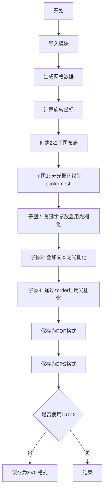

## 类结构

```
无类层次结构（脚本式代码）
```

## 全局变量及字段


### `d`
    
10x10的numpy数组，包含要映射颜色的值

类型：`numpy.ndarray`
    


### `x`
    
网格x坐标，通过np.arange(11)生成

类型：`numpy.ndarray`
    


### `y`
    
网格y坐标，通过np.arange(11)生成

类型：`numpy.ndarray`
    


### `theta`
    
旋转角度，值为0.25π，用于坐标旋转

类型：`float`
    


### `xx`
    
旋转后的x坐标，通过xx = x*cos(θ) - y*sin(θ)计算

类型：`numpy.ndarray`
    


### `yy`
    
旋转后的y坐标，通过yy = x*sin(θ) + y*cos(θ)计算

类型：`numpy.ndarray`
    


### `fig`
    
matplotlib创建的Figure对象，包含所有子图

类型：`matplotlib.figure.Figure`
    


### `ax1`
    
第一个子图的Axes对象，不使用栅格化

类型：`matplotlib.axes.Axes`
    


### `ax2`
    
第二个子图的Axes对象，通过rasterized=True启用栅格化

类型：`matplotlib.axes.Axes`
    


### `ax3`
    
第三个子图的Axes对象，叠加文本且不使用栅格化

类型：`matplotlib.axes.Axes`
    


### `ax4`
    
第四个子图的Axes对象，通过set_rasterization_zorder启用栅格化

类型：`matplotlib.axes.Axes`
    


### `m`
    
pcolormesh返回的QuadMesh集合对象，设置zorder=-10使其被栅格化

类型：`matplotlib.collections.QuadMesh`
    


    

## 全局函数及方法


### `np.arange`

`np.arange` 是 NumPy 库中的一个函数，用于生成一个均匀间隔的数组。在给定范围内，按照指定的步长生成一系列数值。

参数：

- `stop`：`int` 或 `float`，**必需**，结束值（不包含该值）
- `start`：`int` 或 `float`，**可选**，起始值，默认为 0
- `step`：`int` 或 `float`，**可选**，步长，默认为 1
- `dtype`：`dtype`，**可选**，输出数组的数据类型

返回值：`ndarray`，返回一个 NumPy 数组

#### 流程图

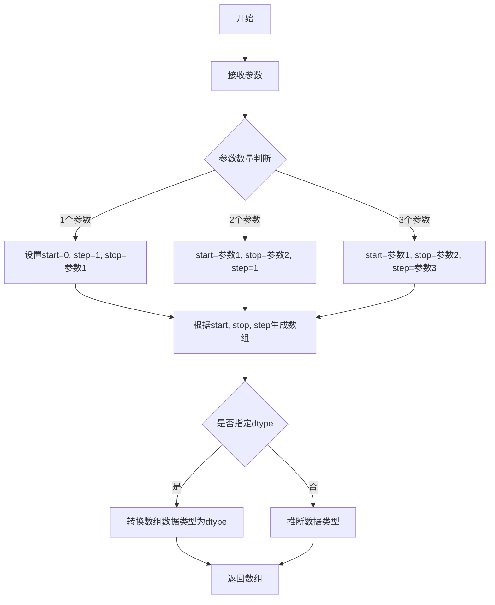

#### 带注释源码

在提供的代码中，`np.arange` 的使用方式如下：

```python
# 创建一个包含0到99的一维数组，然后重塑为10x10的二维数组
d = np.arange(100).reshape(10, 10)  # the values to be color-mapped

# 创建两个一维数组，包含0到10的整数
x, y = np.meshgrid(np.arange(11), np.arange(11))
```


### `np.reshape`

`np.reshape` 是 NumPy 库中的一个函数，用于改变数组的形状（维度）而不改变其数据内容。通过指定新的形状，可以将一维数组转换为多维数组，或将多维数组展平为一维数组，这是数据处理和图像操作中常见的操作。

参数：

- `a`：`array_like`，输入的要重塑的数组，可以是列表、元组或其他类似数组的对象
- `newshape`：`int` 或 `int` 元组，指定新的形状，必须与原始数组的元素总数相匹配
- `order`：`{'C', 'F', 'A'}`，可选参数，指定读取/写入元素的顺序，'C' 表示 C 语言风格（行优先），'F' 表示 Fortran 语言风格（列优先），'A' 表示根据内存布局自动选择

返回值：`ndarray`，返回重新塑形后的数组视图，如果可能的话返回视图而非副本以提高内存效率

#### 流程图

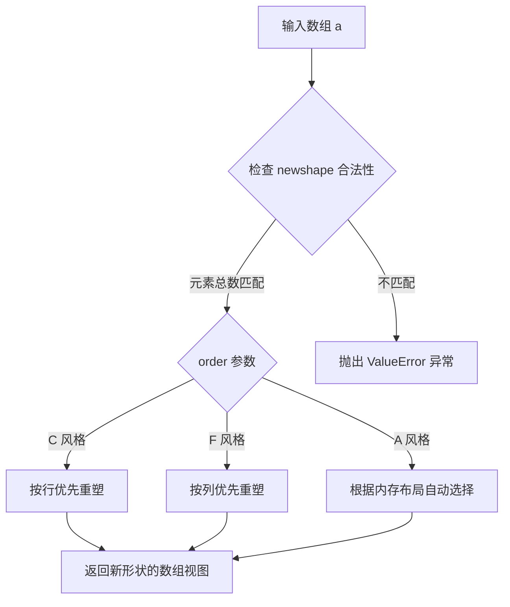

#### 带注释源码

```python
# 示例代码片段来源于 numpy 库的使用示例
# 这是 np.reshape 在实际代码中的典型用法

d = np.arange(100).reshape(10, 10)  # 创建 0-99 的一维数组并重塑为 10x10 的二维数组
# np.arange(100): 生成 [0, 1, 2, ..., 99] 的一维数组
# .reshape(10, 10): 将其转换为 10 行 10 列的二维矩阵
# 参数 'a': np.arange(100) - 输入的原始数组
# 参数 'newshape': (10, 10) - 目标形状，元素总数必须为 100
# 参数 'order': 默认为 'C'（C 语言风格，行优先）
# 返回值: 10x10 的二维 ndarray
```

> **注**：由于 `np.reshape` 是 NumPy 库的内部实现函数，上述源码展示的是其在 matplotlib 栅格化示例代码中的实际调用方式，而非该函数的具体实现代码。


### `np.meshgrid`

创建网格坐标函数，用于从一维坐标向量生成二维或多维网格坐标矩阵。这是 Matplotlib 中 `pcolormesh` 可视化函数的核心底层依赖，用于将数据值映射到正确的坐标位置。

参数：

- `*xi`：数组或类似数组对象，表示坐标向量列表（如 `np.arange(11)`）。这些数组定义了网格在每个维度上的坐标值。
- `indexing`：字符串，可选，默认值为 `'xy'`（笛卡尔索引）。`'xy'` 表示 Cartesian 索引（第一个数组对应 x 轴，第二个对应 y 轴），`'ij'` 表示 matrix 索引（第一个数组对应行，第二个对应列）。
- `sparse`：布尔值，可选，默认值为 `False`。若设为 `True`，返回稀疏网格，可节省内存但仅适用于不需要完整网格的计算场景。
- `copy`：布尔值，可选，默认值为 `True`。若设为 `False`，返回视图而非副本，可提升性能但可能产生意外的内存共享问题。

返回值：`list[numpy.ndarray]`，返回坐标网格列表。对于二维情况，返回 `[X, Y]` 两个网格矩阵，其中 `X` 的形状为 `(ny, nx)`，`Y` 的形状为 `(ny, nx)`，可通过 `X[i, j]` 和 `Y[i, j]` 获取第 `i` 行第 `j` 列的坐标。

#### 流程图

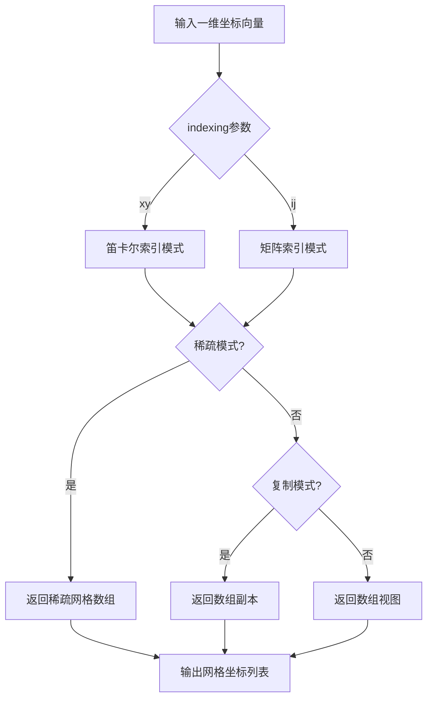

#### 带注释源码

```python
# 从代码中提取的 np.meshgrid 使用示例
x, y = np.meshgrid(np.arange(11), np.arange(11))
# np.arange(11) 生成 [0, 1, 2, ..., 10]
# meshgrid 将两个一维数组扩展为二维网格矩阵
# x 矩阵：每行相同，行索引增加时值不变（x 坐标）
# y 矩阵：每列相同，列索引增加时值不变（y 坐标）
# 结果：x.shape = (11, 11), y.shape = (11, 11)

# 配合旋转矩阵使用的完整示例
theta = 0.25 * np.pi  # 旋转角度 45 度
xx = x * np.cos(theta) - y * np.sin(theta)  # 对网格 x 坐标进行旋转
yy = x * np.sin(theta) + y * np.cos(theta)  # 对网格 y 坐标进行旋转
# 最终 xx, yy 表示旋转后的网格坐标，用于 pcolormesh 绘制
```


### `np.cos`

`np.cos` 是 NumPy 库提供的余弦函数，用于计算输入角度（以弧度为单位）的余弦值。

参数：

- `x`：`float` 或 `array_like`，输入的角度值，以弧度为单位。可以是标量或数组。

返回值：`float` 或 `ndarray`，输入角度的余弦值，返回类型与输入类型相同。

#### 流程图

```mermaid
graph TD
    A[开始] --> B[输入角度 x (弧度)]
    B --> C[计算 cos(x)]
    C --> D[返回余弦值]
```

#### 带注释源码

```python
# np.cos 是 NumPy 库中的三角余弦函数
# 源代码位于 NumPy 库中，此处展示调用方式

# 在代码中的实际使用：
theta = 0.25 * np.pi  # 定义旋转角度（弧度），0.25π 弧度

# 计算旋转后的 x 坐标：
# xx = x * cos(theta) - y * sin(theta)
xx = x * np.cos(theta) - y * np.sin(theta)

# 计算旋转后的 y 坐标：
# yy = x * sin(theta) + y * cos(theta)
yy = x * np.sin(theta) + y * np.cos(theta)

# 说明：
# np.cos 接受弧度值作为输入
# 输入：弧度制的角度（可以是标量或数组）
# 输出：对应角度的余弦值（与输入形状相同的数组或标量）
# 此处用于二维坐标旋转的坐标变换计算
```


### np.sin

这是 NumPy 库提供的正弦函数，用于计算输入角度（弧度）的正弦值。在当前代码中，`np.sin(theta)` 用于计算旋转角度的正弦值，配合 `np.cos(theta)` 实现坐标系的旋转变换。

参数：

-  `x`：`float` 或 `ndarray`，输入角度（弧度制），可以是单个数值或数组

返回值：`ndarray` 或 `scalar`，返回输入角度的正弦值，类型与输入相同

#### 流程图

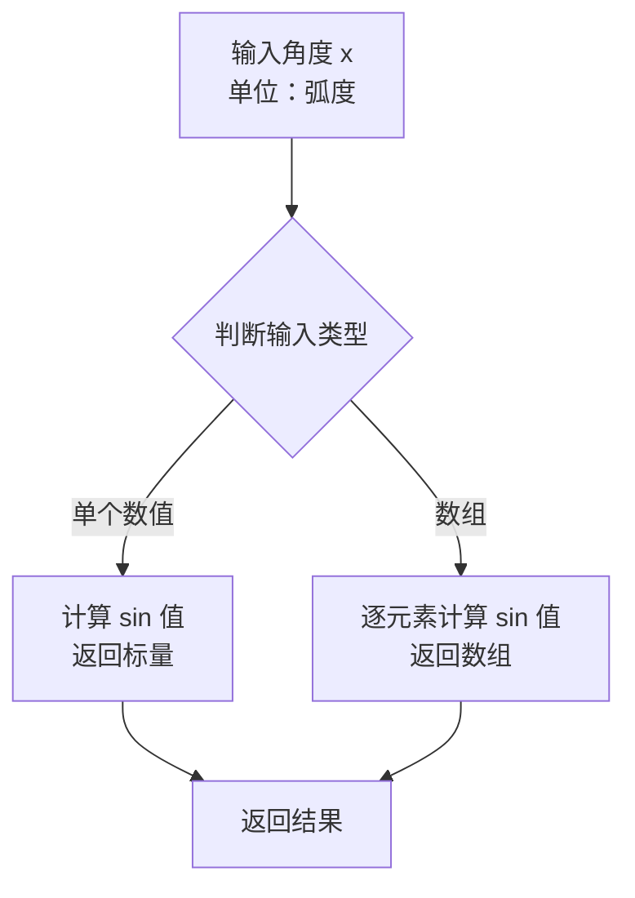

#### 带注释源码

```python
# 在本代码中的实际使用方式：
theta = 0.25*np.pi  # 定义旋转角度（45度，弧度制）
xx = x*np.cos(theta) - y*np.sin(theta)  # 计算旋转后的 x 坐标
yy = x*np.sin(theta) + y*np.cos(theta)  # 计算旋转后的 y 坐标

# np.sin 函数调用说明：
# 参数：theta = 0.25*np.pi ≈ 0.7854 弧度（45度）
# 返回值：np.sin(0.25*np.pi) ≈ 0.7071（正弦值）
# 用途：配合 np.cos 实现二维坐标系的旋转变换
```

#### 额外说明

| 项目 | 说明 |
|------|------|
| 函数来源 | NumPy 库（`numpy.sin`） |
| 数学公式 | sin(x) |
| 输入单位 | 弧度（radians） |
| 常用场景 | 三角函数计算、图形旋转变换、信号处理 |
| 相关函数 | `np.cos`（余弦）、`np.tan`（正切）、`np.arcsin`（反正弦） |


### `plt.subplots`

`plt.subplots` 是 matplotlib.pyplot 模块中的函数，用于创建一个包含多个子图的图形窗口和对应的 Axes 对象数组。它简化了创建子图网格的过程，允许用户一次性配置行数、列数以及子图的布局方式。

参数：

- `nrows`：`int`，子图的行数，默认为 1
- `ncols`：`int`，子图的列数，默认为 1
- `sharex`：`bool` 或 `str`，如果为 True，则所有子图共享 x 轴刻度
- `sharey`：`bool` 或 `str`，如果为 True，则所有子图共享 y 轴刻度
- `squeeze`：`bool`，如果为 True，则返回的 Axes 数组维度会被压缩为一维（如果可能）
- `width_ratios`：`array-like`，定义每列的宽度比例
- `height_ratios`：`array-like`，定义每行的高度比例
- `layout`：`str`，布局管理器类型，如 "constrained"、"compressed" 等
- `layout_engine`：`LayoutEngine`，布局引擎对象
- `figsize`：`tuple`，图形的宽和高（英寸）
- `dpi`：`float`，图形的分辨率

返回值：`tuple`，返回 (Figure, Axes) 元组，其中 Figure 是图形对象，Axes 是 Axes 对象（可能是一维或二维数组，取决于 squeeze 参数）

#### 流程图

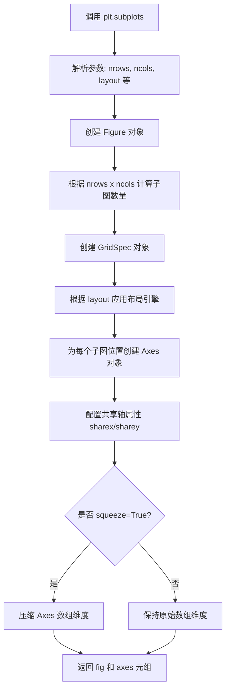

#### 带注释源码

```python
# 示例代码中的调用
fig, ((ax1, ax2), (ax3, ax4)) = plt.subplots(2, 2, layout="constrained")

# 等价的底层实现逻辑（简化版）
def subplots(nrows=1, ncols=1, *, squeeze=True, width_ratios=None,
             height_ratios=None, layout=None, layout_engine=None,
             fig_kw=None, **kwargs):
    """
    创建子图网格
    
    参数:
        nrows: 子图行数
        ncols: 子图列数
        squeeze: 是否压缩返回的 Axes 数组维度
        layout: 布局管理器 ('constrained', 'compressed', None)
    """
    # 1. 创建 Figure 对象
    fig = plt.figure(figsize=kwargs.get('figsize'), dpi=kwargs.get('dpi'))
    
    # 2. 创建 GridSpec 用于定义子图网格
    gs = GridSpec(nrows, ncols, figure=fig,
                  width_ratios=width_ratios,
                  height_ratios=height_ratios)
    
    # 3. 应用布局引擎
    if layout:
        layout_engine = LayoutEngine.create(layout)
        fig.set_layout_engine(layout_engine)
    
    # 4. 创建子图数组
    axes = np.empty((nrows, nrows), dtype=object)
    for i in range(nrows):
        for j in range(ncols):
            # 为每个网格位置创建 Axes
            axes[i, j] = fig.add_subplot(gs[i, j])
    
    # 5. 根据 squeeze 参数决定返回格式
    if squeeze:
        # 尝试压缩维度
        if nrows == 1 and ncols == 1:
            axes = axes[0, 0]  # 返回单个 Axes
        elif nrows == 1 or ncols == 1:
            axes = axes.flatten()  # 转换为一维数组
    
    return fig, axes
```


### `ax.set_aspect`

设置坐标轴的纵横比例（aspect ratio），用于控制 x 轴和 y 轴在显示时的比例关系，可以使坐标轴单位长度在屏幕上显示为等长，或通过数值灵活调整。

参数：

-  `aspect`：`{'auto', 'equal'} 或 float`，设置坐标轴比例模式。'auto' 自动调整，'equal' 使 x 和 y 轴单位长度相等，数值表示 y/x 的比例。
-  `adjustable`：`{'box', 'datalim'}，可选`，调整的对象是轴框（box）还是数据限制（datalim），默认为 'box'。

返回值：`None`，该方法直接修改 Axes 对象的状态，无返回值。

#### 流程图

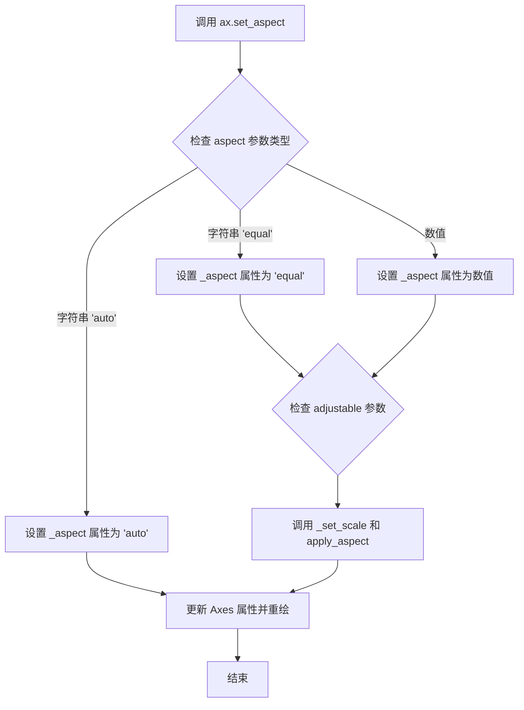

#### 带注释源码

```python
# 以下为 matplotlib 库中 Axes.set_aspect 的核心实现逻辑

def set_aspect(self, aspect, adjustable=None, anchor=None):
    """
    Set the aspect of the axis scaling, i.e. the ratio of the unit length
    on the y-axis to the unit length on the x-axis.

    Parameters
    ----------
    aspect : {'auto', 'equal'} or float
        'auto': 自动调整，让 Axes 填充Axes 区域
        'equal': 使 x 和 y 轴单位长度在屏幕上相等
        float: 设置 y/x 的比例值
    
    adjustable : {'box', 'datalim'}, optional
        'box': 调整 Axes 框以满足 aspect 比例
        'datalim': 调整数据限制以满足 aspect 比例
        默认为 'box'
    
    anchor : str or None, optional
        设置锚点位置，用于 'equal' 模式下的定位
    """
    # 将 aspect 存储到 _aspect 属性中
    self._aspect = aspect
    
    # 处理 adjustable 参数
    if adjustable is None:
        adjustable = 'box'
    
    # 根据不同的 aspect 类型执行不同逻辑
    if aspect == 'equal':
        # 'equal' 模式：确保 x 和 y 轴单位长度相等
        self._adjustable = adjustable
        # 强制设置 x 和 y轴的 scale 相同
        self.set_xscale('linear')
        self.set_yscale('linear')
    elif isinstance(aspect, (int, float)):
        # 数值模式：设置固定的比例值
        self._aspect = float(aspect)
        self._adjustable = adjustable
    
    # 应用 aspect 设置并触发重绘
    self.stale_callback = None  # 清除缓存
    self._request_autoscale_view()  # 请求自动缩放视图
    self._set_scale()  # 设置 scale
    self.apply_aspect()  # 应用 aspect 比例
```

#### 使用示例源码（来自提供的代码）

```python
# 在示例代码中的使用方式
ax1.set_aspect(1)        # 设置坐标轴比例为1，即使 x 和 y 轴单位长度相等
ax2.set_aspect(1)        # 同上
ax3.set_aspect(1)        # 同上
ax4.set_aspect(1)        # 同上
```

#### 关键点说明

1. **参数 '1' 的含义**：在示例代码中 `set_aspect(1)` 传入数值 1，等同于设置 y/x = 1，使 y 轴和 x 轴的单位长度在屏幕上显示为相等。

2. **与 'equal' 的区别**：传入数值 1 和传入字符串 'equal' 效果相同，但数值方式更灵活，可以设置非 1 的比例。

3. **adjustable 参数**：控制当 aspect 变化时，是调整轴框（box）还是数据限制（datalim）。

4. **返回值**：该方法无返回值，直接修改 Axes 对象的内部状态。


### `Axes.pcolormesh`

`ax.pcolormesh` 是 matplotlib 中 Axes 类的一个方法，用于绘制伪彩色网格（quadrilateral mesh）。它接受坐标数组和颜色数据数组，创建一个基于网格的伪彩色图，常用于可视化二维标量场数据。该方法支持多种参数配置，包括坐标系统、颜色映射、插值方式和光栅化选项等。

参数：

- `self`：`Axes` 对象，调用该方法的 Axes 实例
- `X`：`numpy.ndarray`，可选，长度为 M 的 1-D 数组或长度为 (M, N) 的 2-D 数组，表示网格单元顶点的 x 坐标。如果为 None，则默认为 0 到 N-1 的整数序列
- `Y`：`numpy.ndarray`，可选，长度为 M 的 1-D 数组或长度为 (M, N) 的 2-D 数组，表示网格单元顶点的 y 坐标。如果为 None，则默认为 0 到 M-1 的整数序列
- `C`：`numpy.ndarray`，必选参数，长度为 (M-1) × (N-1) 的 2-D 数组，表示每个网格单元的颜色值
- `cmap`：`str` 或 `Colormap`，可选，默认值为 None（使用 rcParams 中的默认 colormap），用于将 C 值映射到颜色的颜色映射
- `norm`：`Normalize`，可选，默认值为 None，用于归一化数据值到颜色映射范围的 Normalize 对象
- `vmin`、`vmax`：float，可选，用于设置颜色映射范围的最小值和最大值，如果指定了 norm 则忽略
- `shading`：str，可选，默认为 'flat'，可以是 'flat', 'gouraud', 'nearest', 'pixel'，指定网格单元的着色方式
- `antialiased`：bool，可选，默认为 True，指定是否启用抗锯齿
- `alpha`：float 或 array-like，可选，默认值为 None，指定透明度
- `snap`：bool，可选，默认值为 None，是否对齐到像素边界
- `rasterized`：bool，可选，默认值为 None，启用栅格化以减小文件大小，适用于矢量后端（PDF, SVG, PS）
- `zorder`：float，可选，默认值为 None，设置绘制顺序
- `**kwargs`：`dict`，传递给 `QuadMesh` 构造函数的其他关键字参数

返回值：`QuadMesh`，返回一个 `matplotlib.collections.QuadMesh` 对象，表示绘制的伪彩色网格集合

#### 流程图

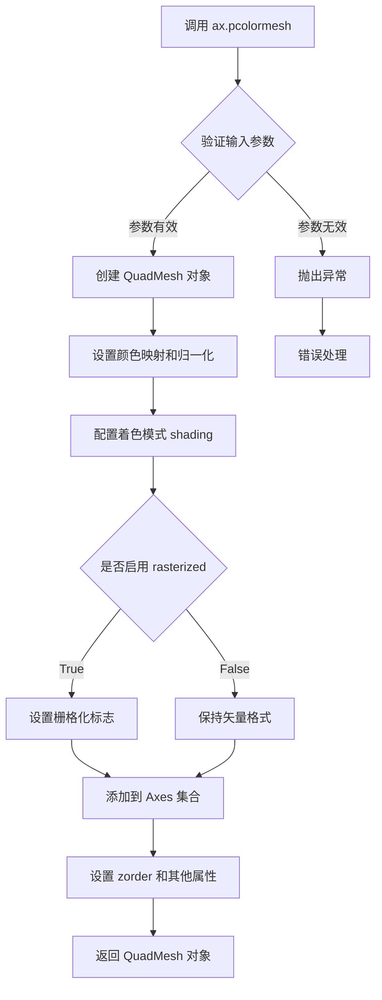

#### 带注释源码

以下是用户代码中调用 `ax.pcolormesh` 的示例，展示了不同的使用场景：

```python
# 示例1: 不使用栅格化绘制 pcolormesh
ax1.set_aspect(1)
ax1.pcolormesh(xx, yy, d)  # 基本用法，使用默认参数
ax1.set_title("No Rasterization")

# 示例2: 使用 rasterized=True 关键字参数启用栅格化
ax2.set_aspect(1)
ax2.set_title("Rasterization")
ax2.pcolormesh(xx, yy, d, rasterized=True)  # 启用栅格化以减小输出文件大小

# 示例3: 在 pcolormesh 上叠加文本（不栅格化）
ax3.set_aspect(1)
ax3.pcolormesh(xx, yy, d)
ax3.text(0.5, 0.5, "Text", alpha=0.2,
         va="center", ha="center", size=50, transform=ax3.transAxes)
ax3.set_title("No Rasterization")

# 示例4: 通过 zorder 设置栅格化（负 zorder 触发栅格化）
ax4.set_aspect(1)
m = ax4.pcolormesh(xx, yy, d, zorder=-10)  # 设置负 zorder 使其被栅格化
ax4.text(0.5, 0.5, "Text", alpha=0.2,
         va="center", ha="center", size=50, transform=ax4.transAxes)
ax4.set_rasterization_zorder(0)  # 设置栅格化阈值为 0
ax4.set_title("Rasterization z$<-10$")
```

#### 代码分析说明

用户提供的代码是一段 **matplotlib 栅格化（Rasterization）功能的演示脚本**，而非 `pcolormesh` 方法的内部实现源码。该脚本演示了以下关键概念：

1. **基本功能**：使用 `ax.pcolormesh(xx, yy, d)` 绘制伪彩色网格，其中 `xx` 和 `yy` 是旋转后的坐标网格，`d` 是 10×10 的数据数组
2. **栅格化启用方式**：通过两种方式启用栅格化——（1）`rasterized=True` 关键字参数；（2）结合 `zorder=-10` 和 `set_rasterization_zorder(0)` 的方式
3. **输出格式**：保存为 PDF、EPS 和 SVG 格式，SVG 格式中栅格化部分会被转换为位图

如需查看 `pcolormesh` 的实际实现源码，需要查阅 matplotlib 库的核心源代码文件（通常位于 `lib/matplotlib/axes/_axes.py` 中的 `pcolormesh` 方法实现）。


### `Axes.set_title`

设置Axes对象的标题，用于显示坐标轴的标题文字。

参数：

- `s`：字符串，标题文本内容
- `fontdict`：字典（可选），控制标题样式的字体字典
- `loc`：字符串（可选），标题对齐方式，可选值为'center'、'left'、'right'，默认为'center'
- `pad`：浮点数（可选），标题与坐标轴顶部的间距（以points为单位）
- `y`：浮点数（可选），标题的y轴相对位置（0-1之间）
- `**kwargs`：关键字参数传递给`matplotlib.text.Text`对象

返回值：`matplotlib.text.Text`，返回创建的标题文本对象

#### 流程图

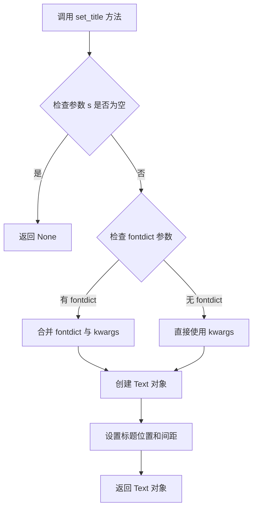

#### 带注释源码

```python
def set_title(self, s, fontdict=None, loc=None, pad=None, *, y=None, **kwargs):
    """
    Set a title for the axes.

    Parameters
    ----------
    s : str
        The title text string.

    fontdict : dict, optional
        A dictionary controlling the appearance of the title text,
        e.g., {'fontsize': 'large', 'fontweight': 'bold'}.

    loc : {'center', 'left', 'right'}, default: 'center'
        Which title to set.

    pad : float
        The offset of the title from the top of the axes, in points.

    y : float
        The y position of the title text on the axes (0-1 range).

    **kwargs
        Additional keyword arguments are passed to the `Text` instance.

    Returns
    -------
    `~matplotlib.text.Text`
        The matplotlib text object representing the title.
    """
    # 如果提供了 fontdict，将其与 kwargs 合并
    if fontdict is not None:
        kwargs.update(fontdict)
    
    # 获取标题对齐方式，默认为 'center'
    loc = loc or mpl.rcParams['axes.titlelocation']
    
    # 获取默认的标题垂直位置
    default_y = 0.95 if loc == 'center' else 1.0
    
    # 如果未指定 y 位置，使用默认值
    if y is None:
        y = mpl.rcParams['axes.titley']
        if y is None:
            y = default_y
    
    # 处理标题偏移量
    if pad is None:
        pad = mpl.rcParams['axes.titlepad']
    
    # 创建 Text 对象并设置标题
    title = Text(self._x, self._y + pad, s, **kwargs)
    # ... (后续设置字体、对齐等属性)
    
    return title
```


### `matplotlib.axes.Axes.text`

在Axes上添加文本标签，支持位置坐标、对齐方式、字体属性等丰富配置。

参数：

- `x`：`float`，文本插入点的x坐标
- `y`：`float`，文本插入点的y坐标
- `s`：`str`，要显示的文本内容
- `fontdict`：`dict`，可选，字体属性字典
- `kwargs`：可变参数，支持Text对象的各种属性（如`alpha`、`va`、`ha`、`size`、`transform`、`color`等）

返回值：`matplotlib.text.Text`，返回创建的文本对象，可用于后续修改文本属性

#### 流程图

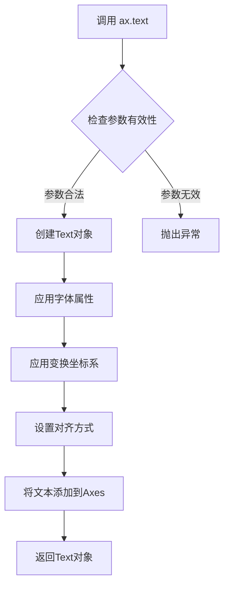

#### 带注释源码

```python
# 在示例代码中的调用方式
ax3.text(0.5, 0.5, "Text",           # x=0.5, y=0.5, s="Text"
         alpha=0.2,                   # 透明度0.2（20%不透明）
         va="center",                 # 垂直对齐：居中
         ha="center",                 # 水平对齐：居中
         size=50,                     # 字体大小50磅
         transform=ax3.transAxes)    # 使用axes坐标系（0-1）

# 参数说明：
# - x, y: 文本位置坐标（本例使用axes坐标，所以是0.5表示中间）
# - s: 文本字符串"Text"
# - alpha: 透明度，0-1之间，0.2表示很淡
# - va: vertical alignment垂直对齐方式，可选top/bottom/center
# - ha: horizontal alignment水平对齐方式，可选left/right/center
# - size: 字体大小（磅）
# - transform: 坐标变换，transAxes表示使用axes坐标系（0-1范围）
#             也可以用transData使用数据坐标系
```


### `Axes.set_rasterization_zorder`

该方法用于设置坐标轴的光栅化 zorder 阈值。当艺术家的 zorder 小于此阈值时，其渲染将被光栅化为位图。此功能仅影响 PDF、SVG 或 PS 等矢量后端，可用于在保持其他元素矢量化的同时减小大型数据密集型艺术家的文件大小。

参数：

- `z`：`float` 或 `None`，设置光栅化的 zorder 阈值。当艺术家的 zorder 小于此值时将进行光栅化；设置为 `None` 表示禁用基于 zorder 的光栅化。

返回值：`~matplotlib.axes.Axes`，返回自身以支持链式调用。

#### 流程图

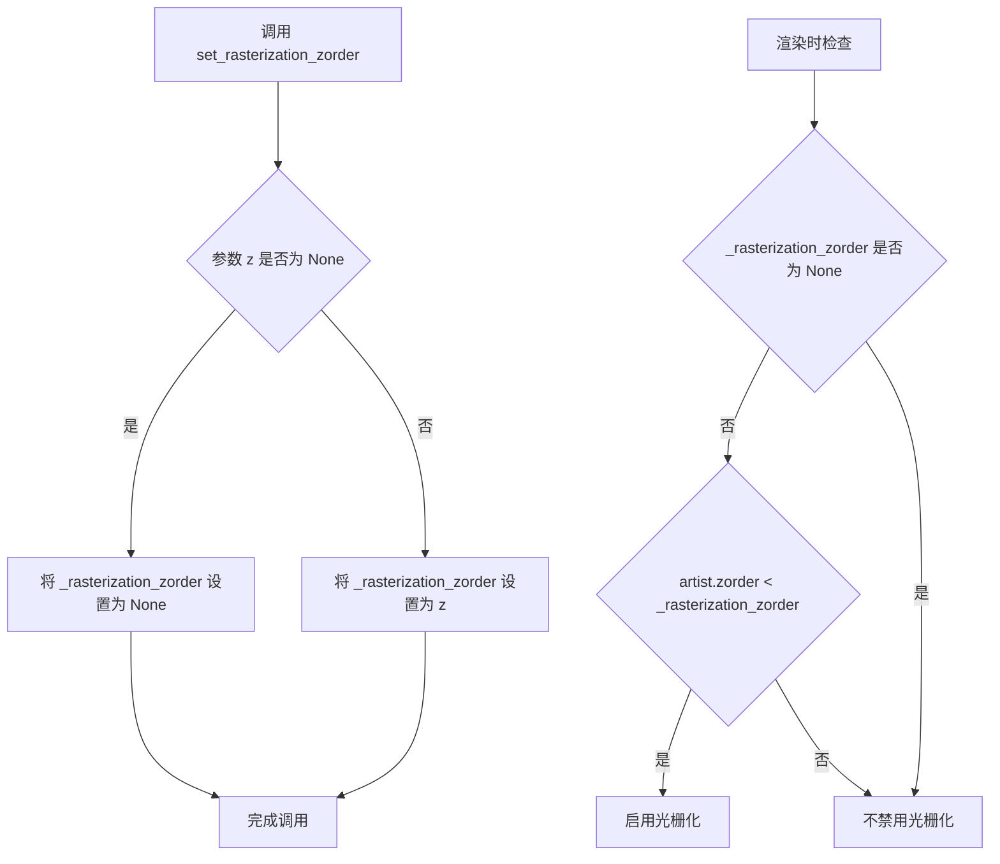

#### 带注释源码

```python
def set_rasterization_zorder(self, z):
    """
    Set the zorder threshold for rasterization.

    This function is part of matplotlib's rasterization mechanism for vector
    graphics. When an artist's zorder is less than this threshold value,
    the artist will be rendered as a raster image (bitmap) rather than
    as vector graphics, which can significantly reduce file size for
    complex data visualizations.

    Parameters
    ----------
    z : float or None
        The zorder threshold for rasterization. Artists with zorder
        below this value will be rasterized. If None, rasterization
        based on zorder is disabled.

    Returns
    -------
    self : Axes
        Returns the Axes object to allow method chaining.

    Examples
    --------
    >>> ax = plt.gca()
    >>> ax.set_rasterization_zorder(0)  # Rasterize artists with zorder < 0
    >>> ax.set_rasterization_zorder(None)  # Disable zorder-based rasterization
    """
    self._rasterization_zorder = z
    return self
```

**注意**：上述源码是基于 matplotlib 公开 API 的重构展示，实际的 matplotlib 源代码可能略有差异。该方法是 `matplotlib.axes.Axes` 类的成员方法，通过设置内部属性 `_rasterization_zorder` 来控制光栅化行为，并在渲染时被后端检查以决定是否对特定艺术家进行光栅化。


### `plt.savefig`

将当前图形保存到文件系统中，支持多种格式如 PDF、EPS、SVG 等。

参数：

- `fname`：`str`，文件名或文件对象，指定保存的路径和格式
- `dpi`：`int` 或 `float`，每英寸点数（dots per inch），控制输出分辨率
- `其他关键字参数`：可选，如 `format`、`bbox_inches`、`facecolor` 等，用于控制保存行为

返回值：`str` 或 `None`，如果提供了文件名则返回保存的文件路径，否则返回 `None`

#### 流程图

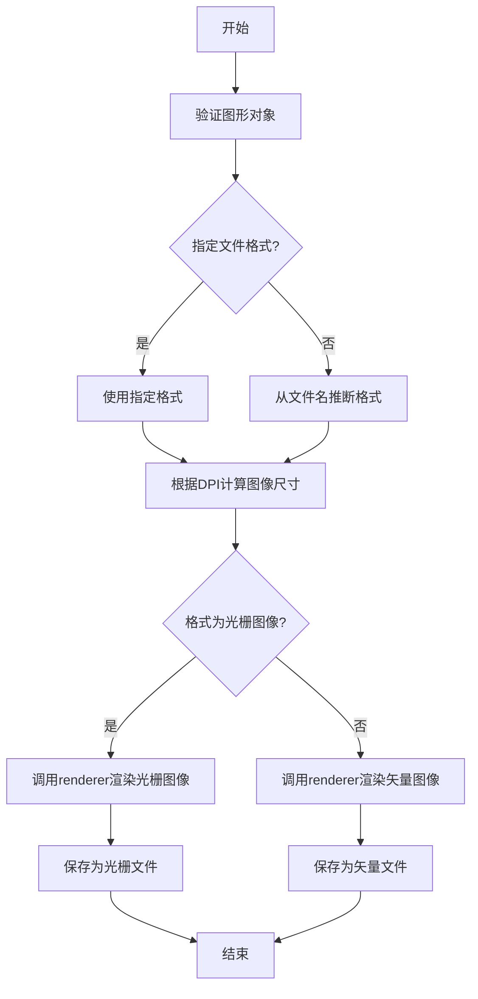

#### 带注释源码

```python
# pcolormesh without rasterization
ax1.set_aspect(1)
ax1.pcolormesh(xx, yy, d)
ax1.set_title("No Rasterization")

# pcolormesh with rasterization; enabled by keyword argument
ax2.set_aspect(1)
ax2.set_title("Rasterization")
ax2.pcolormesh(xx, yy, d, rasterized=True)

# pcolormesh with an overlaid text without rasterization
ax3.set_aspect(1)
ax3.pcolormesh(xx, yy, d)
ax3.text(0.5, 0.5, "Text", alpha=0.2,
         va="center", ha="center", size=50, transform=ax3.transAxes)
ax3.set_title("No Rasterization")

# pcolormesh with an overlaid text without rasterization; enabled by zorder.
ax4.set_aspect(1)
m = ax4.pcolormesh(xx, yy, d, zorder=-10)
ax4.text(0.5, 0.5, "Text", alpha=0.2,
         va="center", ha="center", size=50, transform=ax4.transAxes)
ax4.set_rasterization_zorder(0)
ax4.set_title("Rasterization z$<-10$")

# Save files in pdf and eps format
# fname: str, 保存的文件名（包含路径和格式后缀）
# dpi: int, 每英寸像素数，控制输出分辨率
plt.savefig("test_rasterization.pdf", dpi=150)  # 保存为PDF格式（矢量）
plt.savefig("test_rasterization.eps", dpi=150)   # 保存为EPS格式（矢量）

if not plt.rcParams["text.usetex"]:
    # 仅在非LaTeX渲染模式下保存SVG
    plt.savefig("test_rasterization.svg", dpi=150)  # 保存为SVG格式（矢量）
    # svg backend currently ignores the dpi
```


### `plt.rcParams`

`plt.rcParams` 是 matplotlib 的全局运行时配置字典，用于在运行时获取和设置 matplotlib 的各种默认参数，如文本渲染、颜色映射、字体设置等。在这个代码中，它用于检查是否启用了 LaTeX 文本渲染（`text.usetex`），从而决定是否保存 SVG 格式的文件。

参数：此为全局变量，非函数，无参数

返回值：`dict`，返回包含 matplotlib 各项配置参数的字典对象

#### 流程图

```mermaid
flowchart TD
    A[代码开始] --> B[导入 matplotlib.pyplot 和 numpy]
    B --> C[创建数据网格和旋转坐标]
    C --> D[创建 2x2 子图布局]
    D --> E1[子图1: 无光栅化 pcolormesh]
    D --> E2[子图2: 启用光栅化 pcolormesh]
    D --> E3[子图3: 带覆盖文本无光栅化]
    D --> E4[子图4: 通过 zorder 启用光栅化]
    E1 --> F[保存 PDF 文件]
    F --> G[保存 EPS 文件]
    G --> H{plt.rcParams[text.usetex] == True?}
    H -->|是| I[跳过 SVG 保存]
    H -->|否| J[保存 SVG 文件]
    I --> K[代码结束]
    J --> K
```

#### 带注释源码

```python
"""
=================================
Rasterization for vector graphics
=================================

Rasterization converts vector graphics into a raster image (pixels). It can
speed up rendering and produce smaller files for large data sets, but comes
at the cost of a fixed resolution.

Whether rasterization should be used can be specified per artist.  This can be
useful to reduce the file size of large artists, while maintaining the
advantages of vector graphics for other artists such as the Axes
and text.  For instance a complicated `~.Axes.pcolormesh` or
`~.Axes.contourf` can be made significantly simpler by rasterizing.
Setting rasterization only affects vector backends such as PDF, SVG, or PS.

Rasterization is disabled by default. There are two ways to enable it, which
can also be combined:

- Set `~.Artist.set_rasterized` on individual artists, or use the keyword
  argument *rasterized* when creating the artist.
- Set `.Axes.set_rasterization_zorder` to rasterize all artists with a zorder
  less than the given value.

The storage size and the resolution of the rasterized artist is determined by
its physical size and the value of the ``dpi`` parameter passed to
`~.Figure.savefig`.

.. note::

    The image of this example shown in the HTML documentation is not a vector
    graphic. Therefore, it cannot illustrate the rasterization effect. Please
    run this example locally and check the generated graphics files.

"""

import matplotlib.pyplot as plt
import numpy as np

# 创建一个 10x10 的数组，用于颜色映射
d = np.arange(100).reshape(10, 10)  # the values to be color-mapped

# 创建网格坐标
x, y = np.meshgrid(np.arange(11), np.arange(11))

# 设置旋转角度
theta = 0.25*np.pi

# 旋转坐标 -45度（负theta）
xx = x*np.cos(theta) - y*np.sin(theta)  # rotate x by -theta
yy = x*np.sin(theta) + y*np.cos(theta)  # rotate y by -theta

# 创建 2x2 的子图布局，使用 constrained 布局
fig, ((ax1, ax2), (ax3, ax4)) = plt.subplots(2, 2, layout="constrained")

# 子图1：没有光栅化的 pcolormesh
ax1.set_aspect(1)
ax1.pcolormesh(xx, yy, d)
ax1.set_title("No Rasterization")

# 子图2：使用关键字参数启用光栅化
ax2.set_aspect(1)
ax2.set_title("Rasterization")
ax2.pcolormesh(xx, yy, d, rasterized=True)

# 子图3：带覆盖文本，没有光栅化
ax3.set_aspect(1)
ax3.pcolormesh(xx, yy, d)
ax3.text(0.5, 0.5, "Text", alpha=0.2,
         va="center", ha="center", size=50, transform=ax3.transAxes)
ax3.set_title("No Rasterization")

# 子图4：通过 zorder 启用光栅化
# 设置光栅化 zorder 阈值为 0，pcolormesh 的 zorder 为 -10 会被光栅化
# 默认所有 artists 都有非负 zorder，所以文本不受影响
ax4.set_aspect(1)
m = ax4.pcolormesh(xx, yy, d, zorder=-10)
ax4.text(0.5, 0.5, "Text", alpha=0.2,
         va="center", ha="center", size=50, transform=ax4.transAxes)
ax4.set_rasterization_zorder(0)
ax4.set_title("Rasterization z$<-10$")

# 保存文件为 pdf 和 eps 格式
plt.savefig("test_rasterization.pdf", dpi=150)
plt.savefig("test_rasterization.eps", dpi=150)

# 检查是否启用了 LaTeX 文本渲染，如果没有则保存 SVG 格式
# plt.rcParams 是全局运行时配置字典，用于获取 matplotlib 的各种设置
if not plt.rcParams["text.usetex"]:
    plt.savefig("test_rasterization.svg", dpi=150)
    # svg backend currently ignores the dpi

# %%
#
# .. admonition:: References
#
#    The use of the following functions, methods, classes and modules is shown
#    in this example:
#
#    - `matplotlib.artist.Artist.set_rasterized`
#    - `matplotlib.axes.Axes.set_rasterization_zorder`
#    - `matplotlib.axes.Axes.pcolormesh` / `matplotlib.pyplot.pcolormesh`
```

---

## 文档补充

### 1. 核心功能概述

该代码是 matplotlib 的光栅化（Rasterization）示例演示，展示了如何将矢量图形转换为光栅图像以减小文件体积和加速渲染，同时通过两种方式（关键字参数和 zorder）控制个别艺术家的光栅化行为。

### 2. 文件整体运行流程

1. 导入必要的库（matplotlib.pyplot 和 numpy）
2. 创建演示用的数据网格和旋转坐标
3. 创建 2x2 子图布局，分别展示四种不同的光栅化场景
4. 保存为 PDF、EPS 和 SVG 格式
5. 根据 `plt.rcParams["text.usetex"]` 配置决定是否保存 SVG

### 3. 全局变量和全局函数详情

| 名称 | 类型 | 描述 |
|------|------|------|
| `plt` | 模块 | matplotlib 的 pyplot 接口模块 |
| `np` | 模块 | numpy 数值计算库 |
| `d` | ndarray | 10x10 的颜色映射数据数组 |
| `x`, `y` | ndarray | 原始网格坐标 |
| `xx`, `yy` | ndarray | 旋转后的网格坐标 |
| `theta` | float | 旋转角度（弧度） |
| `fig` | Figure | matplotlib 图形对象 |
| `ax1`, `ax2`, `ax3`, `ax4` | Axes | 四个子图坐标轴对象 |

### 4. 关键组件信息

| 组件名称 | 一句话描述 |
|----------|------------|
| `pcolormesh()` | 创建伪彩色网格图的方法 |
| `set_rasterized()` | 设置艺术家是否光栅化的方法 |
| `set_rasterization_zorder()` | 设置光栅化 zorder 阈值的函数 |
| `plt.savefig()` | 保存图形到文件的函数 |
| `plt.rcParams` | matplotlib 全局运行时配置字典 |

### 5. 潜在技术债务或优化空间

- **硬编码的文件名**：文件名 "test_rasterization.pdf" 等硬编码在代码中，可考虑参数化
- **固定的 DPI 值**：150 DPI 硬编码，可提取为配置参数
- **缺乏错误处理**：文件保存操作没有 try-except 包裹
- **魔法数字**：角度 0.25*π 应提取为有名称的常量

### 6. 其它项目

**设计目标与约束：**
- 展示矢量图形的光栅化功能
- 对比不同光栅化启用方式的效果
- 兼容多种输出格式（PDF、EPS、SVG）

**错误处理与异常设计：**
- 代码未包含显式的错误处理
- 建议添加文件保存失败时的异常捕获

**数据流与状态机：**
- 数据流：numpy 数组 → pcolormesh 渲染 → 各子图 → savefig 输出
- 状态：主要涉及子图状态管理和渲染状态

**外部依赖与接口契约：**
- 依赖 matplotlib 和 numpy 库
- 若 `text.usetex` 为 True，则 SVG 保存会被跳过（LaTeX 环境可能不支持 SVG 输出）

## 关键组件


### np.meshgrid (张量索引)

用于创建坐标网格，生成二维坐标数组供pcolormesh使用，实现x和y坐标的张量索引。

### np.arange (数据生成)

生成从0到99的数组并reshape为10x10矩阵，作为pcolormesh的颜色映射数据值。

### 旋转矩阵 (坐标变换)

通过三角函数构建旋转矩阵，将原始网格坐标(x, y)旋转0.25π弧度，得到旋转后的坐标(xx, yy)。

### pcolormesh (矢量渲染)

matplotlib的伪彩色图绘制函数，支持rasterized参数控制是否进行光栅化转换。

### rasterized参数 (量化策略)

控制是否将矢量图形光栅化为像素图像，True启用光栅化以减小文件体积。

### set_rasterization_zorder (量化策略)

设置光栅化的zorder阈值，负zorder的艺术家会被光栅化，正zorder保持矢量格式。

### Artist.set_rasterized (反量化支持)

允许在艺术家级别单独控制光栅化行为，支持混合使用矢量与光栅化元素。

### Figure.savefig (外部依赖)

导出图像到文件，支持PDF、EPS、SVG等格式，dpi参数影响光栅化分辨率和文件大小。


## 问题及建议


### 已知问题

- **硬编码参数过多**：DPI值（150）、角度（0.25π）、文件路径（"test_rasterization.*"）等配置参数直接写死在代码中，缺乏灵活性和可配置性
- **魔法数字缺乏说明**：`zorder=-10`、`zorder=0`、`alpha=0.2`、`size=50`等数值没有常量定义或注释说明其含义和作用
- **重复代码冗余**：多个子图都执行了`set_aspect(1)`、`set_title()`等相似操作，未提取为复用函数
- **无错误处理机制**：文件保存操作（`plt.savefig`）缺乏异常捕获，若写入失败（如磁盘空间不足、权限问题）会导致程序直接崩溃
- **SVG保存条件不透明**：`plt.rcParams["text.usetex"]`的检查逻辑缺少注释说明，普通开发者难以理解为何tex环境下不保存SVG
- **资源清理缺失**：代码运行后生成多个文件，但未提供自动清理机制或使用临时目录
- **返回值未利用**：`plt.savefig()`返回是否成功，但代码未检查其返回值

### 优化建议

- 将配置参数提取为文件顶部的常量或配置字典，如`CONFIG = {'dpi': 150, 'output_dir': './', 'rasterized_dpi': 150}`
- 为zorder、透明度、字体大小等视觉参数定义具名常量并添加注释说明其设计意图
- 封装子图初始化的重复逻辑为辅助函数`setup_axis(ax, title, rasterized=False)`
- 使用`try-except`块包装文件保存操作，并提供清晰的错误提示
- 在条件判断处添加注释说明tex与SVG的兼容性问题
- 使用Python的`tempfile`模块或上下文管理器处理临时文件，添加文件清理逻辑
- 检查`plt.savefig`的返回值或使用`os.path.exists()`验证文件是否成功生成


## 其它


### 设计目标与约束

本代码示例旨在演示matplotlib中栅格化（Rasterization）功能的使用方式和效果。设计目标包括：展示如何对矢量图形进行栅格化处理以减小文件大小；说明两种启用栅格化的方法（通过Artist.set_rasterized方法和通过Axes.set_rasterization_zorder方法）；验证不同输出格式（PDF、EPS、SVG）对栅格化的支持情况。约束条件包括：SVG后端目前忽略dpi参数；栅格化仅对矢量后端（PDF、SVG、PS）有效；图像的存储大小和分辨率由物理尺寸和dpi参数共同决定。

### 错误处理与异常设计

本示例代码未包含复杂的错误处理逻辑，属于演示性质代码。在实际应用中，栅格化功能可能出现的异常情况包括：dpi参数为负数或零时的处理；不支持栅格化的后端被调用时的回退机制；内存不足导致大型数据集栅格化失败的处理。matplotlib核心库通过Artist.set_rasterized方法和Axes.set_rasterization_zorder方法内置了相应的参数校验和默认值处理。

### 外部依赖与接口契约

本代码主要依赖以下外部组件：matplotlib.pyplot库用于图形创建和保存；numpy库用于数值计算和数组操作。核心接口契约包括：pcolormesh方法接受rasterized参数（布尔类型）用于控制单个艺术家的栅格化；set_rasterization_zorder方法接受zorder阈值参数用于批量控制栅格化；savefig方法接受dpi参数用于控制输出分辨率。

### 性能考虑与优化空间

栅格化操作的主要性能开销在于将矢量数据转换为位图数据的过程。优化方向包括：对于大型数据集（如pcolormesh或contourf），启用栅格化可显著减小输出文件体积；合理设置dpi值以平衡文件大小和图像质量；使用zorder参数可以精确控制哪些艺术家需要栅格化，避免不必要的转换开销。

### 配置管理与运行环境

本代码依赖于matplotlib的全局配置参数（plt.rcParams），特别是"text.usetex"参数用于判断是否使用LaTeX渲染文本（如果使用LaTeX则不保存SVG文件）。运行环境需要安装matplotlib和numpy库，建议使用Anaconda或pip进行环境管理。代码兼容Python 3.x版本和matplotlib 3.x系列版本。

### 调试与日志策略

本示例代码未包含显式的日志输出。在调试栅格化问题时，可以关注以下信息：保存的文件大小变化（栅格化应显著减小PDF/SVG文件大小）；使用不同dpi值保存并对比图像质量；检查生成的图形文件是否符合预期（矢量部分保持为矢量，栅格化部分转为位图）。

### 版本兼容性说明

本代码示例基于较新版本的matplotlib设计，使用了layout="constrained"参数（matplotlib 3.6+）。对于较老版本的matplotlib，可能需要移除该参数或使用subplots_adjust进行布局调整。rasterized参数和set_rasterization_zorder方法在matplotlib 2.0+版本中可用。

### 使用场景与最佳实践

栅格化功能适用于以下场景：大型数据集的可视化（如热图、网格数据），矢量格式下文件体积过大时；需要平衡图像质量和文件大小的场景；打印或发布时需要固定分辨率的输出。最佳实践建议：仅对复杂的艺术家（如pcolormesh）启用栅格化，保持简单的艺术家（如轴、文本）为矢量格式；根据目标用途合理选择dpi值（屏幕显示通常72-150，打印通常150-300）。


    