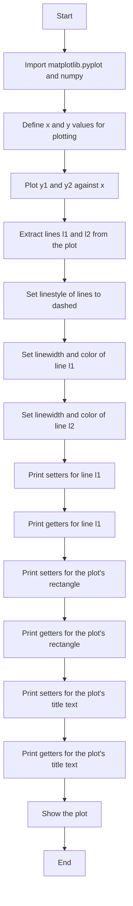
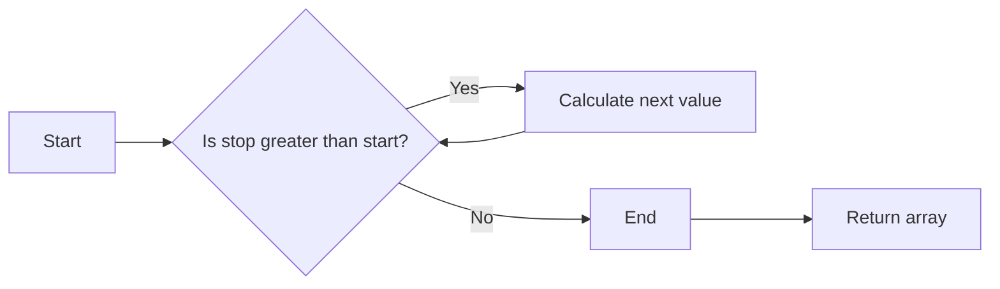
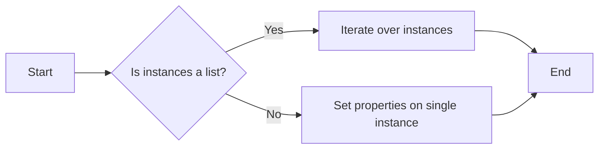
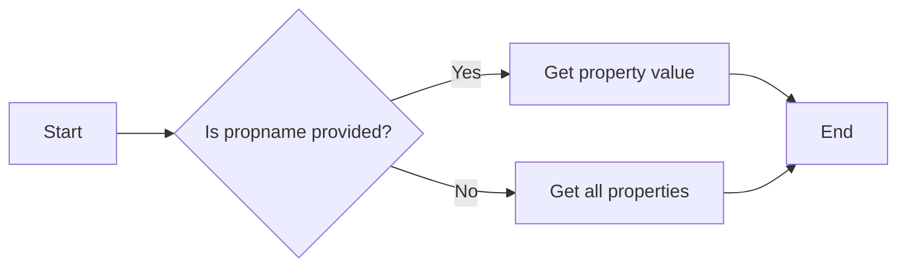
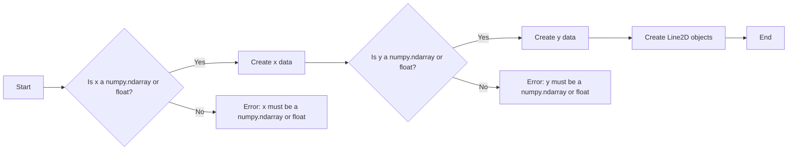
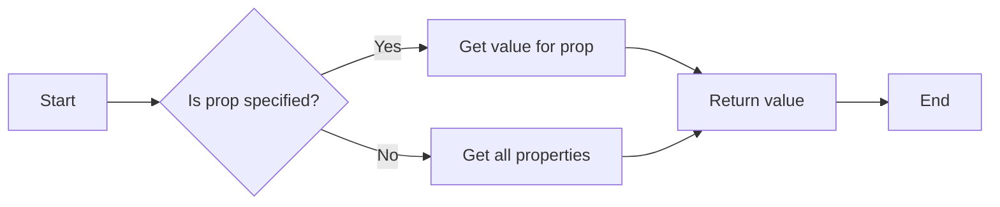
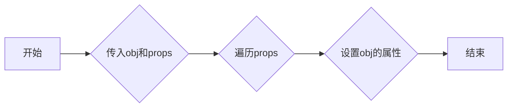
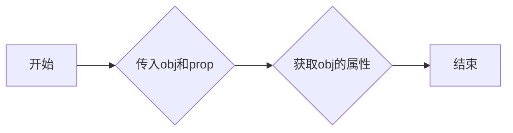
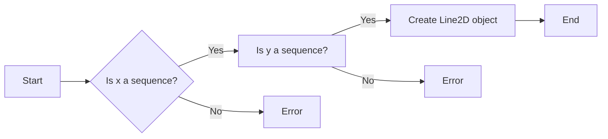
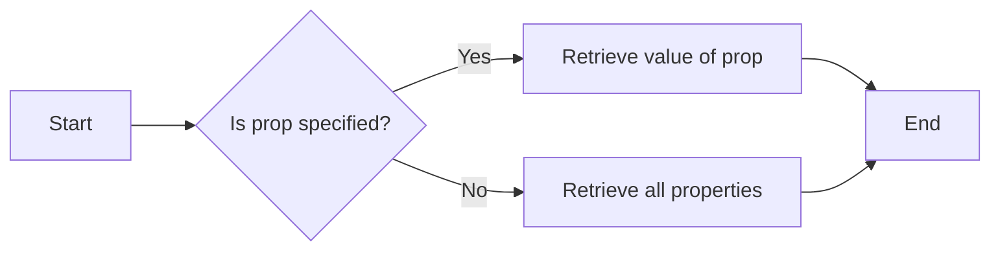

# `matplotlib\galleries\examples\misc\set_and_get.py` 详细设计文档

This code provides an interface for setting and getting properties of matplotlib objects, such as lines, rectangles, and text. It demonstrates the use of `setp` and `getp` functions to modify and retrieve properties of matplotlib objects.

## 整体流程



## 类结构

```
matplotlib.pyplot
├── plot
│   ├── lines
│   └── title
└── gca
    └── patch
```

## 全局变量及字段


### `x`
    
An array of x values for plotting.

类型：`numpy.ndarray`
    


### `y1`
    
An array of y values for the first sine wave plot.

类型：`numpy.ndarray`
    


### `y2`
    
An array of y values for the second sine wave plot.

类型：`numpy.ndarray`
    


### `lines`
    
A list of Line2D objects representing the plotted lines.

类型：`matplotlib.lines.Line2D`
    


### `l1`
    
The first Line2D object in the lines list.

类型：`matplotlib.lines.Line2D`
    


### `l2`
    
The second Line2D object in the lines list.

类型：`matplotlib.lines.Line2D`
    


### `t`
    
The Text object representing the title of the plot.

类型：`matplotlib.text.Text`
    


### `matplotlib.pyplot.lines`
    
A list of Line2D objects representing the plotted lines.

类型：`list of matplotlib.lines.Line2D`
    


### `matplotlib.pyplot.title`
    
The Text object representing the title of the plot.

类型：`matplotlib.text.Text`
    


### `matplotlib.pyplot.gca`
    
The current axes instance.

类型：`matplotlib.axes._subplots.AxesSubplot`
    


### `matplotlib.pyplot.plot`
    
Plots a line or lines.

类型：`None`
    


### `matplotlib.pyplot.setp`
    
Sets properties of the given line(s).

类型：`None`
    


### `matplotlib.pyplot.getp`
    
Retrieves properties of the given line(s).

类型：`None`
    
    

## 全局函数及方法


### np.arange

生成一个沿指定范围的数字数组。

参数：

- `start`：`int`，数组的起始值。
- `stop`：`int`，数组的结束值（不包括）。
- `step`：`int`，步长，默认为1。

返回值：`numpy.ndarray`，一个沿指定范围的数字数组。

#### 流程图



#### 带注释源码

```python
import numpy as np

x = np.arange(0, 1.0, 0.01)  # Generate an array from 0 to 1.0 with a step of 0.01
```


### plt.setp()

`plt.setp()` 是一个用于设置和获取对象属性的函数，它允许用户对matplotlib对象进行属性设置和查询。

参数：

- `instances`：`matplotlib` 对象或对象列表，需要设置属性的实例。
- `props`：`str` 或 `dict`，要设置的属性名称或属性名称和值的字典。

返回值：无

#### 流程图



#### 带注释源码

```python
# 假设 plt 是 matplotlib.pyplot 的别名
import matplotlib.pyplot as plt

# 创建一个线对象
line = plt.plot([1, 2, 3])[0]

# 设置线对象的属性
plt.setp(line, linestyle='--', linewidth=2, color='r')

# 打印设置后的属性
print(plt.getp(line))
```

### plt.getp()

`plt.getp()` 是一个用于获取对象属性的函数，它允许用户查询matplotlib对象的属性值。

参数：

- `instance`：`matplotlib` 对象，需要查询属性的实例。
- `propname`：`str`，要查询的属性名称。

返回值：`str` 或 `dict`，属性值或属性值和名称的字典。

#### 流程图



#### 带注释源码

```python
# 假设 plt 是 matplotlib.pyplot 的别名
import matplotlib.pyplot as plt

# 创建一个线对象
line = plt.plot([1, 2, 3])[0]

# 获取线对象的属性
print(plt.getp(line, 'linewidth'))
```


### plt.plot

`plt.plot` 是 Matplotlib 库中的一个函数，用于在二维坐标系中绘制线图。

参数：

- `x`：`numpy.ndarray` 或 `float`，表示 x 轴的数据点。
- `y`：`numpy.ndarray` 或 `float`，表示 y 轴的数据点。
- ...

返回值：`Line2D` 对象列表，表示绘制的线。

#### 流程图



#### 带注释源码

```python
import matplotlib.pyplot as plt
import numpy as np

x = np.arange(0, 1.0, 0.01)
y1 = np.sin(2*np.pi*x)
y2 = np.sin(4*np.pi*x)
lines = plt.plot(x, y1, x, y2)  # Create Line2D objects
```


### plt.setp

`plt.setp` is a function in the Matplotlib library that allows setting properties of a single instance or a list of instances. It can be used to set various attributes of plot elements such as lines, rectangles, and text.

参数：

- `instances`：`matplotlib.artist.Artist` 或 `list`，表示要设置属性的实例或实例列表。
- `props`：`dict`，包含要设置的属性和对应的值。

返回值：`None`

#### 流程图


#### 带注释源码

```python
def setp(self, instances, props):
    """
    Set properties on the given instances.

    Parameters
    ----------
    instances : matplotlib.artist.Artist or list
        The instance or list of instances to set properties on.
    props : dict
        A dictionary of properties to set.

    Returns
    -------
    None
    """
    if isinstance(instances, list):
        for instance in instances:
            instance.set(**props)
    else:
        instances.set(**props)
```


### plt.getp

`plt.getp` is a function that retrieves the value of a given attribute from an object.

参数：

- `obj`：`matplotlib.artist.Artist`，The object from which to retrieve the attribute.
- `prop`：`str`，The name of the property to retrieve.

参数描述：

- `obj`：The object whose property is to be retrieved. This can be any object that is part of the Matplotlib artist hierarchy.
- `prop`：The name of the property you want to get the value for. If not specified, all properties and their values are returned.

返回值类型：`dict` or `str`

返回值描述：A dictionary containing the property name as keys and their corresponding values. If only one property is requested, it returns the value of that property as a string.

#### 流程图



#### 带注释源码

```python
# Source code for plt.getp
def getp(obj, prop=None):
    """
    Get the value of a given attribute from an object.

    Parameters
    ----------
    obj : matplotlib.artist.Artist
        The object from which to retrieve the attribute.
    prop : str, optional
        The name of the property to retrieve. If not specified, all properties and their values are returned.

    Returns
    -------
    dict or str
        A dictionary containing the property name as keys and their corresponding values. If only one property is requested, it returns the value of that property as a string.
    """
    # Implementation of plt.getp
    # ...
```


### plt.gca()

获取当前图形的轴对象。

参数：

- 无

返回值：`Axes`，当前图形的轴对象。

#### 流程图

```mermaid
graph LR
A[Start] --> B{plt.gca()}
B --> C[End]
```

#### 带注释源码

```python
import matplotlib.pyplot as plt

# 获取当前图形的轴对象
ax = plt.gca()
```


### plt.show()

显示当前图形的界面。

参数：

- 无

返回值：无

#### 流程图

```mermaid
graph LR
A[开始] --> B{调用plt.show()}
B --> C[结束]
```

#### 带注释源码

```
plt.show()
```


### plt.setp()

设置对象属性。

参数：

- `obj`：`matplotlib.lines.Line2D` 或 `matplotlib.patches.Patch` 或 `matplotlib.text.Text`，要设置属性的对象
- `props`：`dict`，要设置的属性和值

返回值：无

#### 流程图



#### 带注释源码

```python
def setp(self, obj, props):
    """
    Set properties on the given object(s).

    Parameters
    ----------
    obj : matplotlib.lines.Line2D, matplotlib.patches.Patch, matplotlib.text.Text
        The object(s) to set properties on.
    props : dict
        A dictionary of properties to set.

    Returns
    -------
    None
    """
    for prop, value in props.items():
        setattr(self, prop, value)
```


### plt.getp()

获取对象属性。

参数：

- `obj`：`matplotlib.lines.Line2D` 或 `matplotlib.patches.Patch` 或 `matplotlib.text.Text`，要获取属性的对象
- `prop`：`str`，要获取的属性名

返回值：`any`，属性值

#### 流程图



#### 带注释源码

```python
def getp(self, obj, prop):
    """
    Get the value of a given attribute.

    Parameters
    ----------
    obj : matplotlib.lines.Line2D, matplotlib.patches.Patch, matplotlib.text.Text
        The object to get the attribute from.
    prop : str
        The name of the attribute to get.

    Returns
    -------
    any
        The value of the attribute.
    """
    return getattr(obj, prop, None)
```


### plt.plot

`plt.plot` is a function in the `matplotlib.pyplot` module that is used to create line plots. It takes in two or more sequences of numbers as input and plots them as lines.

参数：

- `x`：`sequence`，代表x轴的数据点。
- `y`：`sequence`，代表y轴的数据点。
- `fmt`：`str`，可选，用于指定线条样式、标记和颜色。
- `data`：`sequence`，可选，用于指定数据源。
- `*args`：`sequence`，可选，用于指定额外的数据点。
- `**kwargs`：`dict`，可选，用于指定额外的关键字参数。

返回值：`Line2D`对象，代表绘制的线条。

#### 流程图



#### 带注释源码

```python
import matplotlib.pyplot as plt
import numpy as np

x = np.arange(0, 1.0, 0.01)
y1 = np.sin(2*np.pi*x)
y2 = np.sin(4*np.pi*x)
lines = plt.plot(x, y1, x, y2)  # Create line plots
```


### plt.setp

`plt.setp` is a function in the `matplotlib.pyplot` module that is used to set properties of a single instance or a list of instances. It can be used to set various properties of plot elements such as lines, rectangles, and text.

参数：

- `instances`：`matplotlib.artist.Artist` 或 `matplotlib.artist.Artist` 列表，需要设置属性的实例或实例列表。
- `props`：`dict`，包含要设置的属性和值的字典。

返回值：无

#### 描述

`plt.setp` 接受一个实例或实例列表，以及一个包含属性和值的字典。它将字典中的属性和值应用到给定的实例或实例列表上。

#### 流程图


#### 带注释源码

```python
# 假设 instances 是一个 matplotlib.artist.Artist 实例，props 是一个包含属性和值的字典
def setp(self, instances, props):
    """
    Set properties on the given instances.

    Parameters:
    - instances: An instance or a list of instances to set properties on.
    - props: A dictionary containing the properties and values to set.

    Returns:
    - None
    """
    for instance in instances:
        for prop, value in props.items():
            # Set the property on the instance
            setattr(instance, prop, value)
```

#### 关键组件信息

- `instances`：需要设置属性的实例或实例列表。
- `props`：包含要设置的属性和值的字典。

#### 潜在的技术债务或优化空间

- `setp` 函数依赖于 `setattr` 来设置属性，这可能不是最高效的方法，特别是对于大型实例列表。
- 可以考虑添加类型检查来确保传递给 `props` 的值是正确的类型。

#### 设计目标与约束

- 设计目标：提供一种简单的方法来设置多个实例的属性。
- 约束：必须支持多种类型的实例和属性。

#### 错误处理与异常设计

- 如果尝试设置不存在的属性，将引发 `AttributeError`。
- 如果传递了无效的实例类型，将引发 `TypeError`。

#### 数据流与状态机

- 数据流：从用户输入到 `setp` 函数，再到实例属性设置。
- 状态机：没有明确的状态机，因为 `setp` 是一个简单的函数调用。

#### 外部依赖与接口契约

- 外部依赖：`matplotlib.artist.Artist` 类。
- 接口契约：`setp` 函数必须接受一个实例或实例列表，以及一个属性字典。


### plt.getp

`plt.getp` is a function in the `matplotlib.pyplot` module that retrieves the value of a given attribute from an object.

参数：

- `obj`：`matplotlib.artist.Artist`，The object from which to retrieve the property.
- `prop`：`str`，The name of the property to retrieve.

参数描述：

- `obj`：The object whose properties you want to retrieve. This can be any object that inherits from `matplotlib.artist.Artist`, such as a line, patch, or text object.
- `prop`：The name of the property you want to retrieve. If this is not specified, all properties of the object are returned.

返回值类型：`dict` or `str`

返回值描述：

- If `prop` is specified, the function returns the value of the property as a string.
- If `prop` is not specified, the function returns a dictionary containing all properties of the object, with property names as keys and their corresponding values as values.

#### 流程图



#### 带注释源码

```python
# Retrieve the value of a single property
print('Line getters')
print(plt.getp(l1, 'linewidth'))

# Retrieve all properties
print('Line getters')
print(plt.getp(l1))
```


## 关键组件


### 张量索引与惰性加载

张量索引与惰性加载是用于高效处理大型数据集的关键组件，它允许在数据未完全加载到内存之前进行索引和访问。

### 反量化支持

反量化支持是用于处理量化数据的关键组件，它允许在量化过程中进行逆量化操作，以恢复原始数据。

### 量化策略

量化策略是用于优化模型性能和减少内存使用的关键组件，它决定了如何将浮点数转换为固定点数表示。


## 问题及建议


### 已知问题

-   **代码重复性**：`plt.setp` 和 `plt.getp` 方法被多次调用，每次都传递不同的参数。这可能导致代码难以维护和阅读。
-   **全局变量**：代码中使用了全局变量 `plt`，这可能导致代码难以测试和重用。
-   **硬编码**：某些属性值（如 `'--'`、`'r'`、`'g'`）直接硬编码在代码中，这降低了代码的可读性和可维护性。

### 优化建议

-   **封装**：将 `plt.setp` 和 `plt.getp` 的调用封装在函数中，以减少代码重复性并提高可读性。
-   **使用配置对象**：创建一个配置对象来存储属性值，这样就可以避免硬编码，并使代码更加灵活。
-   **模块化**：将绘图逻辑和属性设置逻辑分离到不同的模块或函数中，以提高代码的可维护性和可测试性。
-   **异常处理**：添加异常处理来捕获并处理可能发生的错误，例如无效的属性名或值。
-   **文档**：为每个函数和类提供详细的文档字符串，说明其用途、参数和返回值。


## 其它


### 设计目标与约束

- 设计目标：
  - 提供一个简单且直观的接口来设置和获取图形对象的属性。
  - 支持对多个图形对象进行批量操作。
  - 支持属性查询和属性值设置。
  - 确保代码的健壮性和可维护性。

- 约束条件：
  - 必须使用matplotlib库进行图形绘制。
  - 代码应尽可能简洁，易于理解和维护。
  - 应避免使用外部依赖，除非必要。

### 错误处理与异常设计

- 错误处理：
  - 当尝试设置不存在的属性时，应抛出`AttributeError`。
  - 当尝试获取不存在的属性时，应返回`None`或抛出`AttributeError`。
  - 当传入无效的参数类型时，应抛出`TypeError`。

- 异常设计：
  - 使用try-except块来捕获和处理可能发生的异常。
  - 提供清晰的错误消息，帮助用户理解问题所在。

### 数据流与状态机

- 数据流：
  - 用户通过调用`setp`和`getp`函数与图形对象交互。
  - `setp`函数接收属性名和值，并更新图形对象的属性。
  - `getp`函数接收属性名，并返回属性的值。

- 状态机：
  - 无状态机设计，因为`setp`和`getp`函数直接操作图形对象的属性。

### 外部依赖与接口契约

- 外部依赖：
  - matplotlib库：用于图形绘制和属性操作。
  - numpy库：用于生成数据。

- 接口契约：
  - `setp`函数的接口契约：接受一个图形对象和一个属性名，以及可选的属性值。
  - `getp`函数的接口契约：接受一个图形对象和一个属性名，并返回属性的值。
  - 属性名和值应符合matplotlib库中定义的属性规范。


    