# `matplotlib\galleries\examples\misc\svg_filter_line.py` 详细设计文档

该脚本演示了如何使用Matplotlib创建SVG图形并应用高斯模糊滤镜效果。它绘制两条彩色的线，为每条线创建偏移的灰色阴影，然后在SVG输出中应用dropshadow滤镜，使阴影呈现模糊效果。

## 整体流程

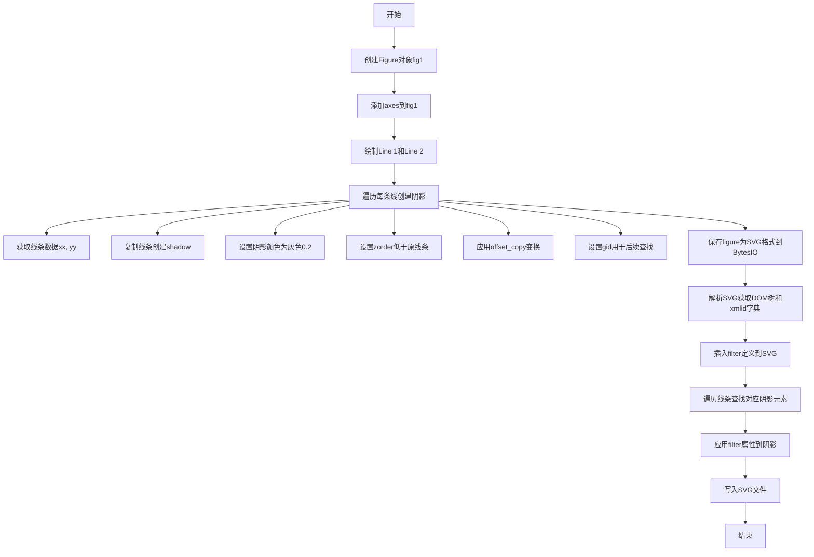

## 类结构

```
该脚本为面向过程代码，无自定义类
使用Matplotlib库的核心类：
├── Figure (matplotlib.figure.Figure)
├── Axes (matplotlib.axes.Axes)
├── Line2D (matplotlib.lines.Line2D)
└── transforms (matplotlib.transforms)
```

## 全局变量及字段


### `fig1`
    
Matplotlib图形容器

类型：`Figure`
    


### `ax`
    
坐标轴容器

类型：`Axes`
    


### `l1`
    
第一条蓝色线条

类型：`Line2D`
    


### `l2`
    
第二条红色线条

类型：`Line2D`
    


### `l`
    
循环变量,代表l1或l2

类型：`Line2D`
    


### `xx`
    
线条的x坐标数据

类型：`ndarray`
    


### `yy`
    
线条的y坐标数据

类型：`ndarray`
    


### `shadow`
    
阴影线条

类型：`Line2D`
    


### `transform`
    
偏移变换

类型：`Transform`
    


### `f`
    
SVG二进制数据缓冲区

类型：`BytesIO`
    


### `filter_def`
    
SVG滤镜定义字符串

类型：`str`
    


### `tree`
    
SVG DOM树根元素

类型：`Element`
    


### `xmlid`
    
id到XML元素的映射字典

类型：`dict`
    


### `shadow`
    
SVG阴影元素

类型：`Element`
    


### `fn`
    
输出文件名

类型：`str`
    


    

## 全局函数及方法


### `plt.figure`

创建新的图形窗口或图表，并返回 `Figure` 对象。该函数是 Matplotlib 中用于初始化图形的基础方法，支持多种参数配置以满足不同的绘图需求。

参数：

- `num`：`int` 或 `str` 或 `None`，图形的标识符。如果传递整数，则表示图形窗口的编号；如果传递字符串，则作为图形的标题；若为 `None`，则自动分配一个新的图形编号。默认为 `None`。
- `figsize`：`tuple` 或 `None`，图形的宽和高（英寸），格式为 `(width, height)`。默认为 `None`，即使用 Matplotlib 的默认配置。
- `dpi`：`float` 或 `None`，图形的分辨率（每英寸点数）。默认为 `None`，使用 Matplotlib 的默认分辨率。
- `facecolor`：`str` 或 `tuple` 或 `None`，图形背景颜色。默认为 `None`，通常为白色或系统默认颜色。
- `edgecolor`：`str` 或 `tuple` 或 `None`，图形边框颜色。默认为 `None`。
- `frameon`：`bool`，是否绘制图形边框。默认为 `True`。
- `FigureClass`：`type`，自定义的 `Figure` 类，继承自 `matplotlib.figure.Figure`。默认为 `matplotlib.figure.Figure`。
- `clear`：`bool`，如果图形已存在，是否清除其内容。默认为 `False`。
- `**kwargs`：其他关键字参数，将传递给 `Figure` 类的构造函数。

返回值：`matplotlib.figure.Figure`，返回创建的图形对象，可用于添加子图、绘制数据、保存图形等操作。

#### 流程图

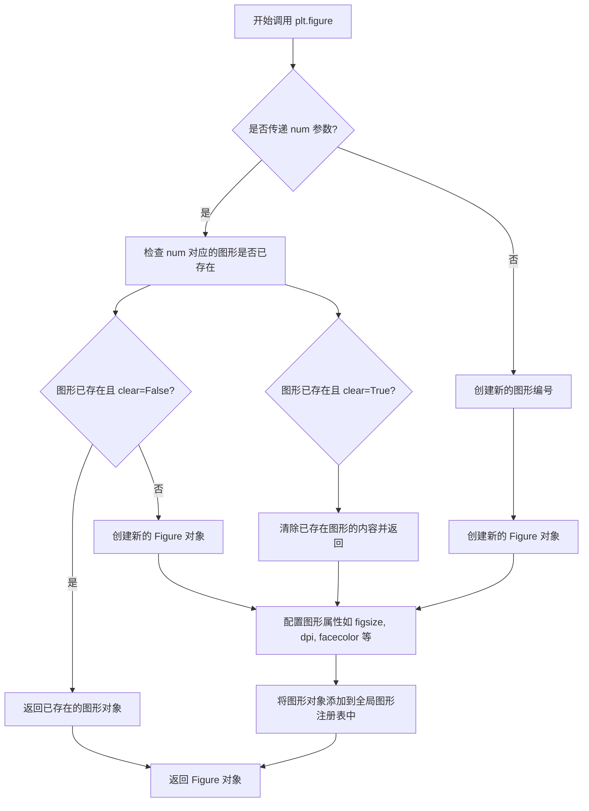

#### 带注释源码

```python
def figure(num=None,  # 图形编号或标题，默认为 None 表示自动分配
           figsize=None,  # 图形尺寸 (宽, 高)，单位英寸
           dpi=None,  # 分辨率，每英寸点数
           facecolor=None,  # 背景颜色
           edgecolor=None,  # 边框颜色
           frameon=True,  # 是否显示边框
           FigureClass=<class 'matplotlib.figure.Figure'>,  # 自定义 Figure 类
           clear=False,  # 如果图形已存在，是否清除内容
           **kwargs):  # 其他传递给 Figure 的参数
    """
    创建一个新的图形窗口或图表。
    
    参数:
        num: 图形标识符，可以是整数（窗口编号）、字符串（标题）或 None（自动分配）。
        figsize: 图形的宽和高，格式为 (width, height)，单位为英寸。
        dpi: 图形的分辨率，表示每英寸的点数。
        facecolor: 图形背景颜色，可以是颜色名称或 RGB 元组。
        edgecolor: 图形边框颜色。
        frameon: 布尔值，控制是否绘制图形边框。
        FigureClass: 自定义的 Figure 类，必须继承自 matplotlib.figure.Figure。
        clear: 如果已存在指定编号的图形，是否清除其内容。
        **kwargs: 其他关键字参数，将传递给 Figure 构造函数。
    
    返回:
        matplotlib.figure.Figure: 创建的图形对象。
    """
    # 获取全局的 pyplot 模块管理器
    # _pylab_helpers 模块管理图形窗口的生命周期
    global _pylab_helpers
    
    # 如果传递了 num 参数，检查是否已存在对应的图形
    if num is not None:
        # 从全局注册表中获取已存在的图形
        manager = _pylab_helpers.Gcf.get_figure(num)
        if manager is not None:
            # 如果图形存在且 clear 为 True，清除内容
            if clear:
                manager.canvas.draw_idle()
            # 返回已存在的图形对象（如果 clear 为 False，可能创建新图形）
            return manager.canvas.figure
    
    # 如果没有传递 num 或图形不存在，创建新的 Figure 对象
    # FigureClass 默认为 matplotlib.figure.Figure
    # 可以通过 figsize, dpi, facecolor 等参数配置图形
    fig = FigureClass(figsize=figsize, dpi=dpi, facecolor=facecolor, 
                      edgecolor=edgecolor, frameon=frameon, **kwargs)
    
    # 创建图形管理器，负责管理图形窗口的显示和交互
    # Gcf 是全局图形管理器，负责跟踪所有打开的图形
    manager = _pylab_helpers.Gcf.draw_figure(fig, num)
    
    # 返回创建的图形对象，供后续添加子图、绘制数据等操作使用
    return fig
```


### `Figure.add_axes`

向图形添加 Axes（坐标轴），返回添加的 Axes 对象。该方法接收一个矩形区域参数 [left, bottom, width, height]，用于指定新坐标轴在图形中的位置和大小。

#### 参数

- `rect`：`tuple`，四个元素 [left, bottom, width, height] 的元组，表示新坐标轴的左下角坐标以及宽高（相对于图形的归一化坐标，范围 0-1）
- `projection`：`str`，投影类型，默认为 None（支持 '3d' 等）
- `polar`：`bool`，是否使用极坐标轴，默认为 False
- `label`：`str`，坐标轴标签，用于图例等标识
- `axes_class`：类型，可选的 Axes 类，默认为 None（使用 matplotlib 的标准 Axes）
- `**kwargs`：其他关键字参数，用于传递给 Axes 的初始化方法

#### 返回值

`matplotlib.axes.Axes`，返回创建的 Axes 对象

#### 流程图

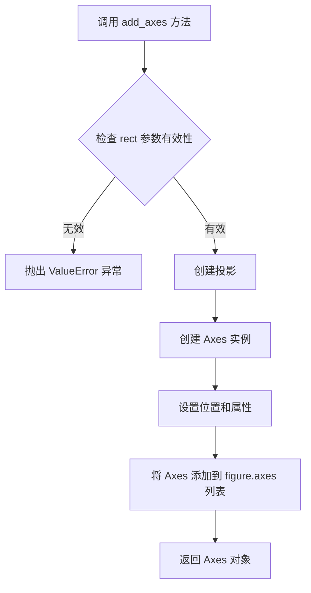

#### 带注释源码

```python
# 从提供的代码中提取的具体调用示例：
fig1 = plt.figure()                           # 创建 Figure 对象
ax = fig1.add_axes((0.1, 0.1, 0.8, 0.8))       # 添加坐标轴
# 参数 (0.1, 0.1, 0.8, 0.8) 含义：
# - left: 0.1   （距图形左侧 10%）
# - bottom: 0.1 （距图形底部 10%）
# - width: 0.8  （宽度为图形宽度的 80%）
# - height: 0.8 （高度为图形高度的 80%）

# 返回的 ax 是一个 Axes 对象，后续可以：
# - 使用 ax.plot() 绑制线条
# - 使用 ax.set_xlim() 设置 x 轴范围
# - 使用 ax.set_ylim() 设置 y 轴范围
# - 使用 ax.set_xlabel() 设置 x 轴标签
```


### `ax.plot`

`ax.plot` 是 matplotlib 库中用于在坐标轴上绘制线条的核心方法。该函数接受 x 和 y 坐标数据以及可选的格式字符串和各种样式关键字参数（如颜色、线宽、标记样式等），返回表示所绘制线条的 Line2D 对象列表。在代码中，该方法被用于绘制两条数据曲线，随后通过获取这些线条对象的数据和变换信息来实现阴影效果。

#### 参数

- `x`：数组类型，X 轴坐标数据
- `y`：数组类型，Y 轴坐标数据
- `fmt`：字符串类型，可选的格式字符串，定义线条的颜色、标记和样式（如 `"bo-"` 表示蓝色圆点连线）
- `**kwargs`：关键字参数，支持丰富的样式选项，包括：
  - `mec`：字符串类型，标记边缘颜色
  - `lw`：浮点数类型，线宽
  - `ms`：浮点数类型，标记大小
  - `label`：字符串类型，用于图例和元素识别的标签

#### 返回值

- `list[matplotlib.lines.Line2D]`：返回包含 Line2D 对象的列表，每个对象代表一条绘制的线条，可用于后续操作如获取数据、设置属性等

#### 流程图

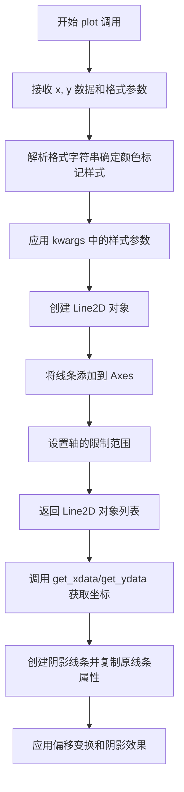

#### 带注释源码

```python
# 示例代码片段
l1, = ax.plot([0.1, 0.5, 0.9], [0.1, 0.9, 0.5], "bo-",
              mec="b", lw=5, ms=10, label="Line 1")
# 参数说明：
# [0.1, 0.5, 0.9]: x 坐标数组
# [0.1, 0.9, 0.5]: y 坐标数组  
# "bo-": 格式字符串，b=蓝色，o=圆点标记，-=实线
# mec="b": 标记边缘颜色为蓝色
# lw=5: 线宽为5
# ms=10: 标记大小为10
# label="Line 1": 线条标签，用于图例和元素识别

l2, = ax.plot([0.1, 0.5, 0.9], [0.5, 0.2, 0.7], "rs-",
              mec="r", lw=5, ms=10, label="Line 2")
# 绘制第二条线：红色方形标记、实线

# 获取线条数据用于创建阴影
for l in [l1, l2]:
    xx = l.get_xdata()    # 获取线条的X坐标数据
    yy = l.get_ydata()    # 获取线条的Y坐标数据
    shadow, = ax.plot(xx, yy)  # 创建阴影线条
    shadow.update_from(l)      # 从原线条复制属性
    
    # 调整阴影颜色为灰色
    shadow.set_color("0.2")
    # 设置zorder使阴影在原线条下方
    shadow.set_zorder(l.get_zorder() - 0.5)
    
    # 创建偏移变换：向右偏移4点，向下偏移6点
    transform = mtransforms.offset_copy(l.get_transform(), fig1,
                                        x=4.0, y=-6.0, units='points')
    shadow.set_transform(transform)
    
    # 设置元素ID用于后续SVG滤镜引用
    shadow.set_gid(l.get_label() + "_shadow")
```


### 一段话描述

该代码是一个基于 Matplotlib 的脚本，其核心功能是在图表上绘制两条曲线，并通过 SVG XML 操作技术为这些曲线添加高斯模糊阴影效果（使用 SVG Filter），最终将生成的矢量图形保存为 SVG 格式的文件。

### 文件的整体运行流程

1.  **环境初始化**：创建 Figure 和 Axes 对象，准备绘图画布。
2.  **数据绑定**：调用 `ax.plot()` 绘制两条折线 `l1` 和 `l2`，每条线关联一组 x, y 坐标数据。
3.  **阴影生成（循环处理）**：
    *   遍历已绘制的线条对象列表 `[l1, l2]`。
    *   **提取数据**：通过调用 `l.get_xdata()` 和 `l.get_ydata()` 获取线条的原始坐标数据。
    *   **绘制阴影**：基于提取的坐标绘制新线条 `shadow`，并复制原线条的属性。
    *   **属性调整**：修改阴影颜色为灰色，降低其 Z 轴顺序（zorder）使其位于原线条下方，应用位移变换（Offset Transform）产生偏移效果。
    *   **标记元素**：为阴影线条设置唯一的图形 ID（gid），以便后续在 SVG 中查找。
4.  **序列化与解析**：将图表内容保存为内存中的 SVG 字节流，并使用 `xml.etree.ElementTree` 解析为 DOM 树。
5.  **滤镜注入**：解析 SVG 滤镜定义字符串，并插入到 SVG DOM 的根节点。
6.  **属性关联**：遍历线条，根据之前设置的 ID 查找到对应的阴影 SVG 元素，并为其 `filter` 属性赋值以应用滤镜。
7.  **文件输出**：将修改后的 SVG DOM 树写入磁盘文件。

### 类的详细信息

由于代码中没有定义自定义类，以下信息主要描述代码中涉及的 Matplotlib 核心对象及其方法。

#### 1. `matplotlib.figure.Figure`
- **描述**：Matplotlib 中的图形容器，代表整个绘图窗口。

#### 2. `matplotlib.axes.Axes`
- **描述**：坐标轴对象，包含绘图区域、刻度、标签等。

#### 3. `matplotlib.lines.Line2D`
- **描述**：代表图表中的一条线条。
- **类字段**：
    - `xdata`：线条的 X 轴数据。
    - `ydata`：线条的 Y 轴数据。
- **类方法**：
    - `plot(...)`：绘制线条（代码中隐式调用）。
    - `get_transform()`：获取线条的坐标变换。
    - `get_zorder()`：获取绘制顺序。
    - `set_gid(...)`：设置 SVG ID。
    - **`get_xdata()`**：**(关键方法)** 获取线条的 X 轴数据。
    - **`get_ydata()`**：获取线条的 Y 轴数据。

### 关键组件信息

#### `Line2D.get_xdata`

获取线条对象的 X 轴数据。该方法是连接 Matplotlib 内部数据存储与外部处理逻辑（如生成阴影路径）的关键接口。

参数：
- `self`：`Line2D` 对象本身（隐式传递）。

返回值：`numpy.ndarray` 或 Python 序列 (List)，返回线条实例化时的 X 轴坐标数据。

#### 流程图

该方法在代码中主要服务于数据提取流程，下图展示了 `get_xdata` 在阴影生成循环中的调用时序：

```mermaid
sequenceDiagram
    participant Loop as 循环体 (for l in...)
    participant Line as Line2D 对象 (l1/l2)
    participant Plot as 绘图引擎
    
    Note over Loop: 1. 遍历线条 l
    Loop->>Line: 2. 调用 get_xdata()
    Line-->>Loop: 3. 返回 X 轴坐标数组 (xx)
    Loop->>Plot: 4. 调用 ax.plot(xx, yy) 绘制阴影
```

#### 带注释源码

在代码中，`get_xdata` 被用于获取原始线条的 X 坐标，以复制并生成阴影线条。以下是其在上下文中的使用方式：

```python
# 遍历图表中的所有线条对象 (l1, l2)
for l in [l1, l2]:
    
    # 核心操作：获取线条的原始数据
    # 调用 get_xdata 获取 X 轴坐标序列
    xx = l.get_xdata() 
    
    # 调用 get_ydata 获取 Y 轴坐标序列
    yy = l.get_ydata() 
    
    # 使用获取到的 (xx, yy) 数据绘制阴影线条
    shadow, = ax.plot(xx, yy)
```

### 潜在的技术债务或优化空间

1.  **硬编码参数**：阴影的偏移量 (`x=4.0, y=-6.0`)、颜色 (`"0.2"`) 以及 Z 轴顺序的差值 (`-0.5`) 都是硬编码在循环内部的，缺乏可配置性。
2.  **重复绘制**：代码通过 `plot` 重新绘制线条来创建阴影，这会创建新的对象。如果只是需要视觉上的偏移，可以考虑使用 Transformer 中的 `PathFinder` 或直接操作 Path 对象，这会大幅提高性能，特别是对于数据量大的线条。
3.  **滤镜适用性**：代码仅针对 SVG 格式生效，且假设了渲染器支持 SVG 滤镜。如果输出为 PNG 或 PDF，此滤镜代码不会生效，但逻辑仍会执行（造成无意义的计算）。

### 其它项目

#### 错误处理与异常设计
- 代码未包含显式的错误处理（如检查 `l.get_xdata()` 是否返回空值）。
- 依赖于 Matplotlib 库内部的数据有效性，假设 `plot` 调用成功且返回了有效的 Line2D 对象。
- XML 解析部分假设输入的 SVG 格式是标准的，如果 SVG 生成失败（如 Matplotlib 版本不兼容），`ET.XML` 会抛出解析异常。

#### 外部依赖与接口契约
- **Matplotlib**：核心绘图库，提供了 `Figure`, `Axes`, `Line2D`, `transforms` 等对象模型。
- **xml.etree.ElementTree**：Python 标准库，用于处理 SVG（一种 XML 格式）。
- **接口**：代码依赖于 Matplotlib 导出的 SVG 结构，特别是元素 ID (`gid`) 的设置和获取，这在不同 Matplotlib 版本间可能存在细微差异。


### `Line2D.get_ydata`

获取当前线条对象的y坐标数据数组。该方法是matplotlib中Line2D类的实例方法，用于返回与线条关联的y轴数据。

参数：

- （无显式参数，除隐式self）

返回值：`numpy.ndarray`，返回线条的y坐标数据数组，包含线条所有数据点的y值。

#### 流程图

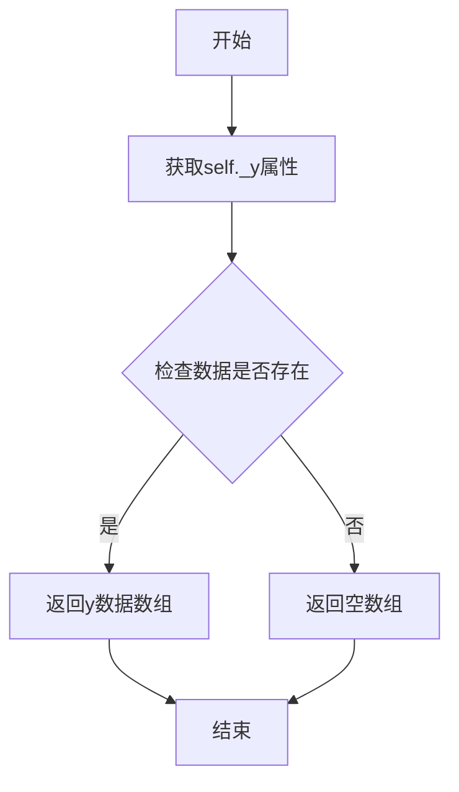

#### 带注释源码

```python
def get_ydata(self):
    """
    获取线条的y坐标数据。
    
    Returns:
        numpy.ndarray: 线条的y坐标数据数组。
    """
    # 返回存储的y数据，如果未设置则返回空数组
    # self._y 是Line2D对象内部存储y数据的属性
    return self._y
```

> 注：上述源码为基于matplotlib库常见实现的简化版本，实际源码可能包含更多边界情况处理。


### `ax.plot`

在 Matplotlib 中，`ax.plot` 是 Axes 对象的核心绘图方法，用于在图表上绘制线条和标记。该方法接受可变数量的参数，支持多种输入形式（如列表、数组等），并返回 Line2D 对象列表。

#### 参数

- `*args`：可变参数，支持以下形式：
  - `y`：一维数组或列表，表示 y 轴数据
  - `x, y`：两个一维数组或列表，分别表示 x 轴和 y 轴数据
  - `fmt`：格式字符串，指定线条颜色、标记样式和线型（如 `"bo-"` 表示蓝色圆点实线）
  - `data`：可选参数，用于指定数据源（通常为 pandas DataFrame 或类似结构）
- **`label`**：`str`，线条标签，用于图例显示（如 `"Line 1"`）
- **`color`** 或 **`c`**：`str` 或颜色代码，设置线条颜色
- **`linewidth`** 或 **`lw`**：`float`，线条宽度（如 `5`）
- **`markersize`** 或 **`ms`**：`float`，标记大小（如 `10`）
- **`markeredgecolor`** 或 **`mec`**：`str`，标记边缘颜色（如 `"b"` 表示蓝色）
- 其他 Line2D 属性（如 `alpha`、`linestyle` 等）

#### 返回值

- `list[matplotlib.lines.Line2D]`：返回 Line2D 对象列表，每个对象代表一条绘制的线条。

#### 流程图

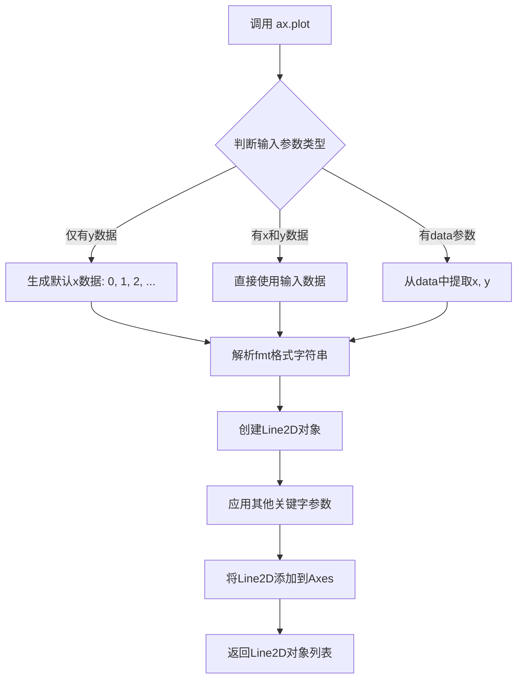

#### 带注释源码

```python
# 第一个 plot 调用示例：绘制蓝色圆点实线
l1, = ax.plot(
    [0.1, 0.5, 0.9],      # x 数据：list[float]，X轴坐标点
    [0.1, 0.9, 0.5],      # y 数据：list[float]，Y轴坐标点
    "bo-",                # fmt：str，格式字符串（蓝色圆形标记 + 实线）
    mec="b",              # markeredgecolor：str，标记边缘颜色为蓝色
    lw=5,                 # linewidth：float，线条宽度为5磅
    ms=10,                # markersize：float，标记大小为10磅
    label="Line 1"        # label：str，用于图例显示的标签
)

# 第二个 plot 调用示例：绘制红色方形实线
l2, = ax.plot(
    [0.1, 0.5, 0.9],      # x 数据：list[float]，X轴坐标点
    [0.5, 0.2, 0.7],      # y 数据：list[float]，Y轴坐标点
    "rs-",                # fmt：str，格式字符串（红色方形标记 + 实线）
    mec="r",              # markeredgecolor：str，标记边缘颜色为红色
    lw=5,                 # linewidth：float，线条宽度为5磅
    ms=10,                # markersize：float，标记大小为10磅
    label="Line 2"        # label：str，用于图例显示的标签
)

# 在循环中绘制阴影线条（复用原始线条的数据）
for l in [l1, l2]:
    xx = l.get_xdata()        # 获取原始线条的x数据
    yy = l.get_ydata()        # 获取原始线条的y数据
    
    # 创建阴影线条，使用相同的数据点
    shadow, = ax.plot(xx, yy)
    
    # 从原始线条复制属性到阴影线条
    shadow.update_from(l)
    
    # 设置阴影颜色为深灰色
    shadow.set_color("0.2")
    
    # 设置zorder使阴影在原线条下方绘制
    shadow.set_zorder(l.get_zorder() - 0.5)
    
    # 创建偏移变换（向右偏移4点，向下偏移6点）
    transform = mtransforms.offset_copy(
        l.get_transform(),    # 基于原线条的变换
        fig1,                 # 所属图形对象
        x=4.0,                # x方向偏移量（点为单位）
        y=-6.0,               # y方向偏移量（负值向下）
        units='points'        # 偏移单位：点
    )
    shadow.set_transform(transform)
    
    # 设置SVG元素的id，供后续引用
    shadow.set_gid(l.get_label() + "_shadow")
```


### `Artist.update_from`

从另一个 Artist 对象复制属性到当前对象，用于创建具有相同基础属性的对象变体（如创建阴影线条）。

参数：

- `other`：`Artist`，源 Artist 对象，从中复制属性
- `*args`：可变位置参数，供子类扩展使用
- `**kwargs`：可变关键字参数，供子类扩展使用

返回值：`None`，该方法直接修改当前对象的属性，不返回任何值

#### 流程图

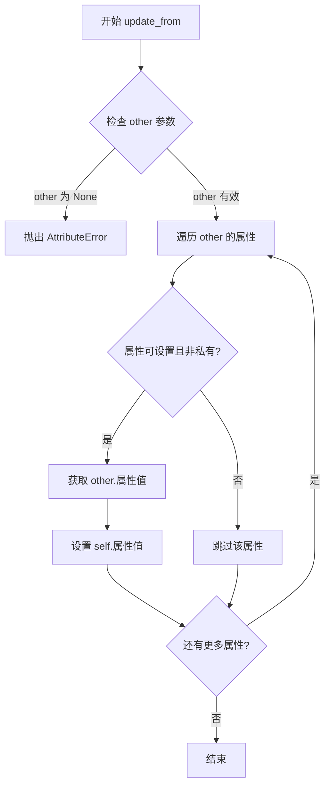

#### 带注释源码

```python
# 在代码中的实际使用：
shadow, = ax.plot(xx, yy)          # 创建新的线条对象
shadow.update_from(l)               # 从原始线条 l 复制所有属性到 shadow

# update_from 方法的典型实现逻辑（简化版）：
def update_from(self, other):
    """
    从另一个 Artist 对象复制属性。
    
    此方法遍历源对象的属性，将所有可设置的非私有属性
    复制到当前对象，实现属性克隆功能。
    """
    for attr in dir(other):
        # 跳过私有属性和方法
        if attr.startswith('_'):
            continue
        # 检查属性是否可获取和设置
        if hasattr(other, attr) and not callable(getattr(other, attr)):
            try:
                # 从源对象获取属性值并设置到当前对象
                setattr(self, attr, getattr(other, attr))
            except (AttributeError, ValueError):
                # 跳过不支持设置的属性
                pass
```

#### 关键组件信息

| 组件名称 | 一句话描述 |
|---------|-----------|
| `shadow` | 通过 `ax.plot()` 创建的新线条对象，用于显示原线条的阴影效果 |
| `l` | 原始线条对象，包含线条的坐标、颜色、线宽等属性 |
| `update_from` | Matplotlib Artist 基类的方法，负责在对象间复制属性状态 |

#### 潜在的技术债务或优化空间

1. **反射遍历性能**：使用 `dir()` 遍历所有属性可能带来性能开销，对于大规模对象复制场景可考虑缓存属性列表
2. **属性过滤粒度**：当前实现可能复制过多属性，实际场景中可能需要更精细的属性选择（如排除 transform、zorder 等运行时属性）
3. **错误处理缺失**：属性复制失败时静默跳过，可能导致隐藏的配置不一致问题

#### 其它项目

**设计目标与约束**：
- 实现对象属性的浅拷贝，保持对象结构的独立性
- 目标是在创建阴影线条时复用原始线条的几何属性

**错误处理与异常设计**：
- 若 `other` 参数为 `None` 或无效对象，应抛出 `AttributeError`
- 属性赋值失败时通常静默跳过，避免中断复制流程

**数据流与状态机**：
- 原始线条 `l` 的属性状态 → `update_from()` 复制 → 阴影线条 `shadow` 继承属性
- 复制后通过 `set_color("0.2")`、`set_zorder()` 等方法进行差异化调整


### `Line2D.set_color`

设置线条的颜色。

参数：

- `color`：`str` 或 `tuple` 或 `array-like`，要设置的颜色值，可以是颜色名称（如 "red"）、十六进制颜色（如 "#ff0000"）、灰度值（如 "0.2" 或 (0.2, 0.2, 0.2)）、RGB/RGBA 元组等

返回值：`Line2D`，返回自身以支持链式调用

#### 流程图

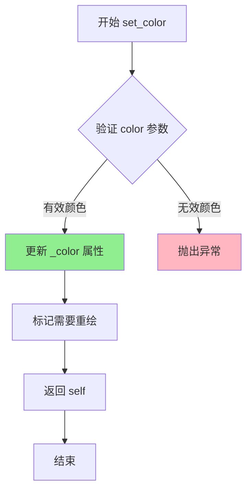

#### 带注释源码

```python
def set_color(self, color):
    """
    Set the color of the line.
    
    Parameters
    ----------
    color : color
        线条颜色。可以是以下格式之一：
        - 命名字符串：如 'red', 'blue', 'green'
        - 十六进制字符串：如 '#ff0000', '#00ff00'
        - 灰度字符串：如 '0.2', '0.8'
        - RGB/RGBA 元组：如 (1.0, 0.0, 0.0), (1.0, 0.0, 0.0, 0.5)
        - 颜色数组：如 [1.0, 0.0, 0.0]
    
    Returns
    -------
    Line2D
        返回自身，以便与其他设置方法进行链式调用。
    
    Examples
    --------
    >>> line, = ax.plot([1, 2, 3], [1, 2, 3])
    >>> line.set_color('red')
    >>> line.set_color('#ff0000')
    >>> line.set_color((1.0, 0.0, 0.0))
    """
    # 将颜色值转换为内部颜色表示并存储
    self._color = color
    
    # 标记此艺术家需要重新绘制
    self.stale = True
    
    # 返回 self 以支持链式调用
    return self
```

> **注**：上述源码基于 matplotlib 官方 Line2D 类的 set_color 方法。在代码中调用方式为：
> ```python
> shadow.set_color("0.2")  # 设置阴影颜色为灰度值 0.2 (浅灰色)
> ```


### `shadow.set_zorder`

设置阴影线条的绘制顺序（zorder），使其位于原始线条下方，从而实现阴影效果。

参数：

- `zorder`：`float`，绘制顺序的数值，数值越小越先绘制。此处传入 `l.get_zorder() - 0.5`，使阴影的绘制顺序低于原始线条。

返回值：`None`，无返回值（matplotlib 的 set_zorder 方法通常返回 None）。

#### 流程图

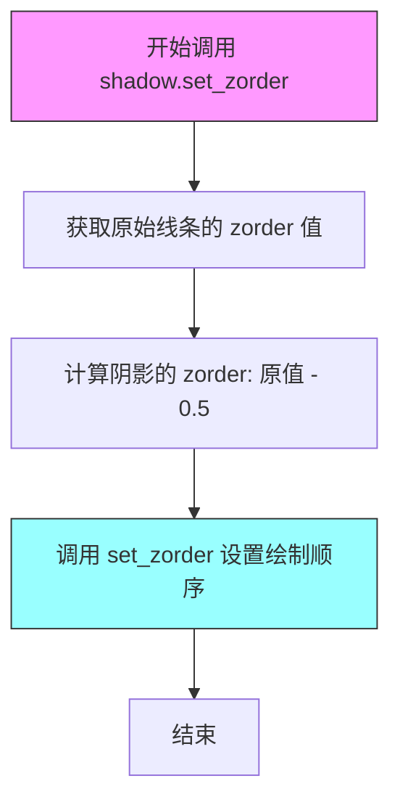

#### 带注释源码

```python
# adjust zorder of the shadow lines so that it is drawn below the
# original lines
shadow.set_zorder(l.get_zorder() - 0.5)
```

**代码上下文说明：**
- `shadow` 是通过 `ax.plot(xx, yy)` 创建的图形对象（matplotlib Artist 实例）
- `l.get_zorder()` 获取原始线条的绘制顺序值
- 减去 0.5 确保阴影始终绘制在原始线条下方，形成正确的视觉层次


### `mtransforms.offset_copy`

该函数用于创建一个带有指定偏移量的变换副本，常用于在图形中创建阴影效果或元素定位。它接受一个基础变换对象，根据给定的 x、y 偏移量和单位（points、pixels 等）计算偏移值，并返回一个带有偏移量的新 Affine2D 变换对象。

参数：

- `transform`：`matplotlib.transforms.Affine2DBase`，要偏移的基础变换对象（如 `l.get_transform()` 返回的变换）
- `fig`：`matplotlib.figure.Figure`，用于转换单位的图形对象（可选，如果为 None 则使用当前图形）
- `x`：`float`，x 方向的偏移量（默认为 0）
- `y`：`float`，y 方向的偏移量（默认为 0）
- `units`：`str`，偏移量的单位，可选值包括 `'inches'`、`'points'`、`'pixels'`、`'dots'` 等（默认为 `'inches'`）

返回值：`matplotlib.transforms.Affine2DBase`，返回一个新的 Affine2D 变换对象，已应用指定的偏移量

#### 流程图

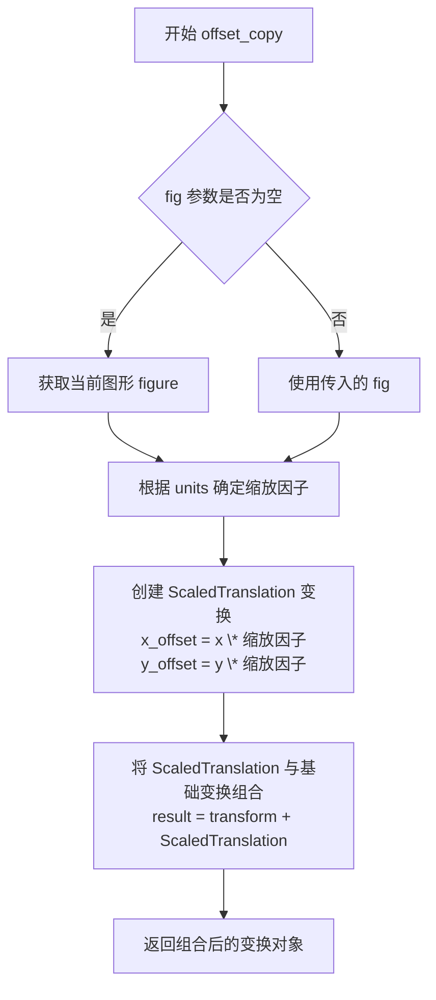

#### 带注释源码

```python
def offset_copy(transform, fig=None, x=0, y=0, units='inches'):
    """
    创建一个带有偏移量的变换副本。
    
    此函数通常用于创建阴影效果，通过对原始变换应用偏移来移动元素。
    
    参数:
    ------
    transform : Affine2DBase
        要偏移的基础变换对象。例如，通过 ax.plot() 返回的线条的变换。
    fig : Figure, optional
        用于单位转换的图形对象。如果为 None，则使用当前活动的图形。
    x : float, default: 0
        x 方向的偏移量。
    y : float, default: 0
        y 方向的偏移量。
    units : str, default: 'inches'
        偏移量的单位。有效值包括:
        - 'inches': 英寸
        - 'points': 磅 (1/72 英寸)
        - 'pixels': 像素
        - 'dots': 点 (通常与 pixels 相同)
    
    返回:
    ------
    Affine2DBase
        应用了偏移量的新变换对象。
    
    示例:
    ------
    >>> import matplotlib.pyplot as plt
    >>> import matplotlib.transforms as mtransforms
    >>> fig, ax = plt.subplots()
    >>> line, = ax.plot([0, 1], [0, 1])
    >>> # 创建偏移变换：向右偏移 4 磅，向下偏移 6 磅
    >>> offset_transform = mtransforms.offset_copy(
    ...     line.get_transform(), fig, x=4.0, y=-6.0, units='points'
    ... )
    """
    # 如果没有提供 fig，获取当前图形
    if fig is None:
        fig = plt.gcf()
    
    # 根据单位获取缩放因子
    # 这将单位转换为图形坐标系统的转换因子
    if units == 'inches':
        # 获取图形尺寸（英寸）和分辨率，计算每英寸的像素数
        scalex = fig.dpi_scale_trans.get_matrix()[0, 0]
        scaley = fig.dpi_scale_trans.get_matrix()[1, 1]
    elif units == 'points':
        # 1 point = 1/72 inch，先获取 DPI 再转换为 points
        # 72 points = 1 inch
        dpi = fig.dpi
        scalex = dpi / 72
        scaley = dpi / 72
    elif units == 'pixels':
        # 像素单位，直接使用 1:1
        scalex = 1.0
        scaley = 1.0
    elif units == 'dots':
        # 与 pixels 类似，通常为 1:1
        scalex = 1.0
        scaley = 1.0
    else:
        raise ValueError(f"Unknown units: {units}")
    
    # 创建 ScaledTranslation 变换对象
    # ScaledTranslation 是 Affine2D 的子类，用于表示平移变换
    # 它接受 (x, y) 偏移量和缩放因子
    offset_trans = mtransforms.ScaledTranslation(x * scalex, y * scaley, 
                                                   fig.dpi_scale_trans)
    
    # 将偏移变换与基础变换组合
    # + 操作符会创建一个新的变换，应用顺序为: 先应用基础变换，再应用偏移
    # 即 result = transform + offset_trans
    new_transform = transform + offset_trans
    
    return new_transform
```

#### 使用示例（来自提供代码）

```python
# 在示例代码中，offset_copy 用于为阴影线条创建偏移变换
transform = mtransforms.offset_copy(l.get_transform(),  # 基础变换：线条的原始变换
                                      fig1,               # 图形对象，用于单位转换
                                      x=4.0,              # x 方向偏移 4 磅
                                      y=-6.0,             # y 方向偏移 -6 磅（向下）
                                      units='points')     # 单位：磅
shadow.set_transform(transform)  # 将偏移变换应用到阴影线条
```


### `shadow.set_transform`

该方法用于为 SVG 图形元素（此处为阴影线条）设置变换属性，实现位置偏移效果。在代码中，通过 `mtransforms.offset_copy` 创建基于原始线条变换的偏移副本，并将其应用于阴影线条，从而在保持图形属性的同时实现阴影的偏移显示。

参数：

- `transform`：`matplotlib.transforms.Transform`，由 `offset_copy` 生成的变换对象，包含了平移、旋转、缩放等变换信息，此处主要用于实现相对于原始线条的偏移效果。

返回值：`None`，该方法在 Matplotlib 中通常返回 `self` 以支持链式调用，但在当前代码上下文中未捕获返回值。

#### 流程图

```mermaid
graph TD
    A[开始] --> B[获取原始线条的变换 l.get_transform]
    B --> C[调用 offset_copy 创建新变换]
    C --> D[设置变换参数: fig=fig1, x=4.0, y=-6.0, units='points']
    D --> E[调用 shadow.set_transform(transform)]
    E --> F[应用变换到阴影线条]
    F --> G[结束]
```

#### 带注释源码

```python
# offset transform
# 创建原始线条变换的副本，并添加偏移量
transform = mtransforms.offset_copy(l.get_transform(), fig1,
                                    x=4.0, y=-6.0, units='points')
# 将新创建的变换应用到阴影线条对象
# transform 参数包含了平移信息，使阴影相对于原始线条偏移 (4.0, -6.0) 点
shadow.set_transform(transform)
```


### `shadow.set_gid`

设置 SVG 元素的 id 属性，以便在生成的 SVG 中唯一标识该图形元素，从而可以在后续通过 XMLID 进行查找和应用滤镜等操作。

参数：

- `gid`：`str`，要设置的 SVG 元素 id，通常由标签名加上后缀组成（如 `"Line 1_shadow"`）。

返回值：`Artist`（具体为调用它的对象，如 `Line2D` 实例），返回自身以支持链式调用。

#### 流程图

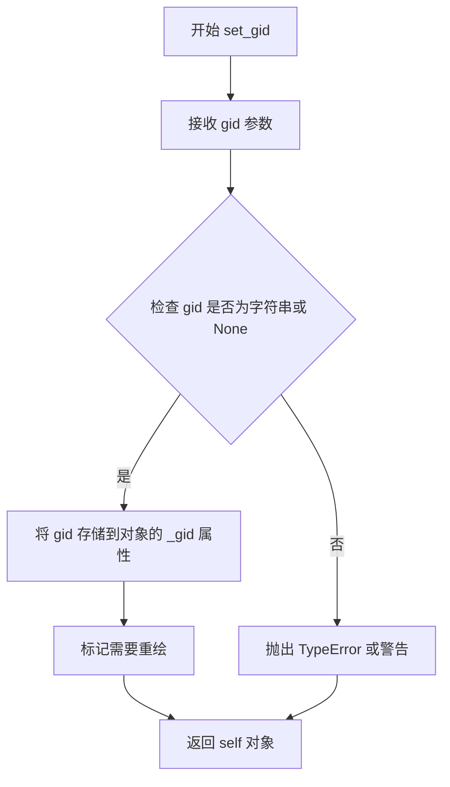

#### 带注释源码

```python
def set_gid(self, gid):
    """
    设置艺术家的（可选）gid。

    参数
    ----------
    gid : str 或 None
        用于艺术家的 id 字符串。如果为 None，则清除 id。

    返回值
    -------
    self
        返回艺术家对象。
    """
    # 如果 gid 为 None，则清除 id
    if gid is None:
        self._gid = None
    else:
        # 确保 gid 是字符串类型
        if not isinstance(gid, str):
            raise TypeError("gid must be a string or None")
        self._gid = gid
    # 标记艺术家需要重绘，通常通过 stale 属性标记
    self.stale = True
    return self
```

注意：上述源码是基于 matplotlib 的 `Artist.set_gid` 方法的常见实现。在实际 matplotlib 库中，可能会有细微差异，但核心逻辑类似。该方法用于设置图形元素的 SVG id，以便后续在 SVG 输出中可以通过 `xmlid` 字典进行查找和应用滤镜等操作。


### `matplotlib.pyplot.savefig`

该函数是 Matplotlib 库中用于将当前图形（Figure）保存到文件或文件对象中的核心方法。代码中展示了如何将图形保存为 SVG 格式的内存字节流（BytesIO），而不是直接保存到磁盘，这在 Web 服务或动态生成场景中非常有用。

参数：

-  `fname`：`file-like object` (具体类型 `io.BytesIO`)，文件路径或文件对象。代码中传入了内存缓冲区对象 `f`，用于接收图像二进制数据。
-  `format`：`str`，输出图像的格式。代码中显式指定为 `"svg"` 以生成 SVG 矢量图。

返回值：`None`，该函数主要执行保存文件的副作用，不返回数据。

#### 流程图

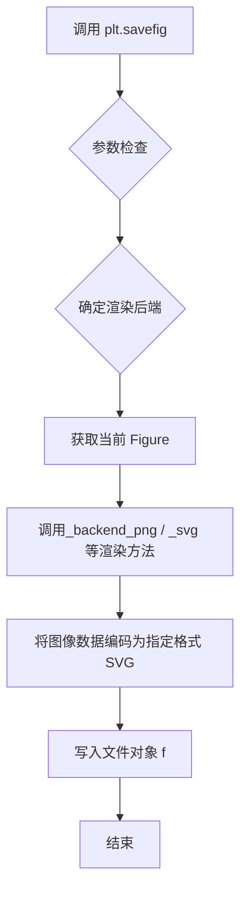

#### 带注释源码

```python
# 创建一个内存中的字节流对象，用于存储图片数据而不是直接写入磁盘
f = io.BytesIO()

# 调用 savefig 函数保存图像
# 参数 f: 文件对象，这里是 BytesIO 实例
# 参数 format: 强制指定输出格式为 'svg'，如果不指定会根据 fname 后缀推断
plt.savefig(f, format="svg")
```


# 设计文档：SVG 滤镜应用示例

## 1. 核心功能概述

该代码演示了如何使用 Matplotlib 生成带阴影效果的折线图，并将图形保存为 SVG 格式，同时通过 XML 操作在 SVG 中插入高斯模糊滤镜，实现阴影的模糊效果。

## 2. 文件整体运行流程

```
开始
  ↓
创建 Figure 和 Axes
  ↓
绘制两条带数据点的折线 (l1, l2)
  ↓
为每条线创建阴影线条（灰色、偏移、zorder降低）
  ↓
为阴影线条设置唯一ID（用于后续SVG中查找）
  ↓
保存图形为SVG格式到内存缓冲区
  ↓
使用 ET.XMLID 解析SVG，获取DOM树和ID映射字典
  ↓
插入滤镜定义（高斯模糊）
  ↓
根据ID映射查找阴影元素并应用滤镜
  ↓
将修改后的SVG写入文件
  ↓
结束
```

## 3. 类详细信息

本文件为脚本文件，不包含类定义，主要使用以下模块的函数和类：

### 3.1 模块级变量和函数

#### `ET.XMLID` 函数详情

### `{函数名}`

**ET.XMLID**

解析 SVG（XML）数据并返回元素树和 ID 映射字典。

**参数：**

- `data`：`bytes` 或 `str`，要解析的 SVG/XML 原始数据

**返回值：** `tuple`，包含两个元素：
- 第一个元素：`xml.etree.ElementTree.Element`，XML 元素树的根元素
- 第二个元素：`dict`，键为元素 id 属性值，值为对应的 Element 对象

#### 流程图

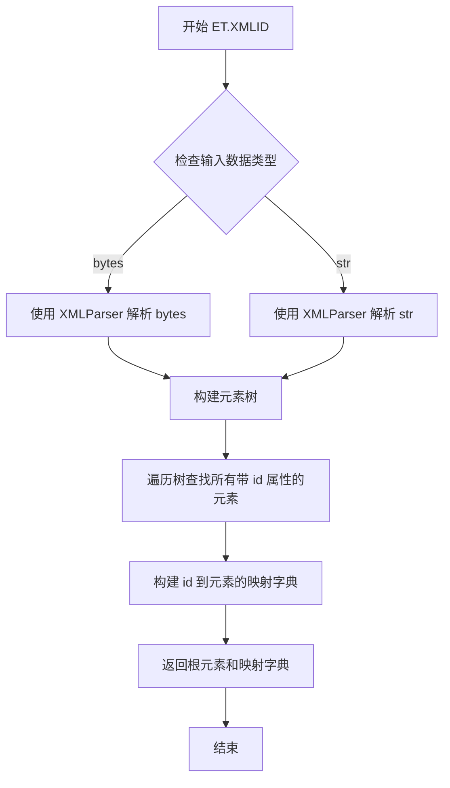

#### 带注释源码

```python
# 从 SVG 数据中解析出 XML 树和 ID 映射
# f.getvalue() 获取之前保存的 SVG 数据（bytes 格式）
# 返回值：
#   tree: XML 元素的根节点（Element 类型）
#   xmlid: 字典，键为元素的 'id' 属性值，值为元素本身
tree, xmlid = ET.XMLID(f.getvalue())

# 使用示例：通过 ID 查找 SVG 元素
# 假设有一个 id="Line 1_shadow" 的元素
# shadow_element = xmlid["Line 1_shadow"]
# shadow_element 是一个 Element 对象，可以调用 set() 等方法
```

### 3.2 其他关键函数

#### `ET.XML` 函数

- **参数：** `source`（`str`），XML 字符串
- **返回值：** `Element`，XML 元素对象
- **功能：** 将 XML 字符串解析为元素对象

#### `ET.ElementTree` 类

- **功能：** 表示整个 XML 文档树
- **主要方法：** `write(filename)`，将树写入文件

## 4. 关键组件信息

| 组件名称 | 一句话描述 |
|---------|-----------|
| `fig1` | Matplotlib Figure 对象，包含整个图形 |
| `ax` | Axes 对象，表示图形中的坐标轴区域 |
| `l1, l2` | Line2D 对象，表示 plotted 的两条折线 |
| `shadow` | Line2D 对象，表示每条线的阴影副本 |
| `filter_def` | 字符串，包含 SVG 滤镜定义（高斯模糊） |
| `tree` | XML 根元素，代表解析后的 SVG DOM 树 |
| `xmlid` | 字典，建立 SVG 元素 ID 到元素对象的映射 |
| `f` | BytesIO 对象，用于内存中保存 SVG 数据 |

## 5. 潜在技术债务或优化空间

1. **硬编码配置**：滤镜参数（`stdDeviation=3`、`height='1.2'`、偏移量 `x=4.0, y=-6.0`）都是硬编码，应提取为配置参数
2. **错误处理缺失**：未检查 SVG 解析是否成功，未处理 ID 不存在的情况
3. **重复代码**：创建阴影的逻辑在循环中，可以抽取为独立函数
4. **资源管理**：未显式关闭 figure，可能导致资源泄露
5. **滤镜兼容性**：注释提到效果取决于 SVG 渲染器支持，应添加特性检测

## 6. 其他项目

### 6.1 设计目标与约束

- **目标**：演示 SVG 滤镜效果，特别是阴影的高斯模糊
- **约束**：需要 SVG 渲染器支持滤镜效果才能看到最终效果

### 6.2 错误处理与异常设计

- `ET.XMLID()` 可能抛出 `ParseError` 如果 SVG 格式不正确
- `xmlid[key]` 访问不存在的 key 会抛出 `KeyError`

### 6.3 数据流与状态机

```
原始数据点 
  → Matplotlib 绘制 
  → SVG 序列化 
  → XML 解析 
  → DOM 操作（插入滤镜） 
  → SVG 写入文件
```

### 6.4 外部依赖与接口契约

- **matplotlib**：图形生成
- **xml.etree.ElementTree**：XML/SVG 解析和操作
- **io**：内存缓冲区操作

---

## 7. ET.XMLID 详细规格

### 函数签名

```python
ET.XMLID(source)
```

### 参数详解

| 参数名称 | 参数类型 | 参数描述 |
|---------|---------|---------|
| `source` | `bytes` 或 `str` | 包含 XML/SVG 数据的字节串或字符串 |

### 返回值详解

| 返回值位置 | 返回值类型 | 返回值描述 |
|-----------|-----------|-----------|
| 第一个返回值 | `xml.etree.ElementTree.Element` | XML 文档的根元素，可遍历和修改 |
| 第二个返回值 | `dict` | 字典，键为元素的 `id` 属性值，值为对应的 Element 对象 |

### 使用示例

```python
# 读取 SVG 数据
svg_data = f.getvalue()  # bytes 类型

# 解析 SVG
tree, xmlid = ET.XMLID(svg_data)

# 通过 ID 访问元素
# 假设 SVG 中有 <element id="my_id">
element = xmlid.get("my_id")  # 安全获取，避免 KeyError

# 修改元素属性
element.set("filter", "url(#dropshadow)")
```


### `ET.XMLID`

解析XML字符串并返回元素树和ID映射字典

参数：

-  `source`：str 或 bytes，要解析的XML字符串或字节数据

返回值：`(ElementTree, dict)`，返回解析后的XML元素树和元素ID映射字典

#### 流程图

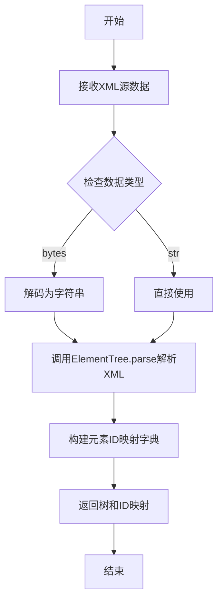

#### 带注释源码

```python
# 从BytesIO对象获取SVG格式的字节数据
svg_data = f.getvalue()

# 使用ET.XMLID解析SVG数据，返回:
# - tree: XML元素树对象
# - xmlid: 字典，键为元素id属性，值为对应的XML元素
tree, xmlid = ET.XMLID(svg_data)
# 这样可以通过id直接访问SVG中的元素，例如:
# shadow = xmlid['Line 1_shadow'] 可以获取id为"Line 1_shadow"的元素
```

---

### `ET.XML`

将XML字符串解析为XML元素对象

参数：

-  `source`：str，要解析的XML字符串

返回值：`Element`，解析后的XML元素对象

#### 流程图

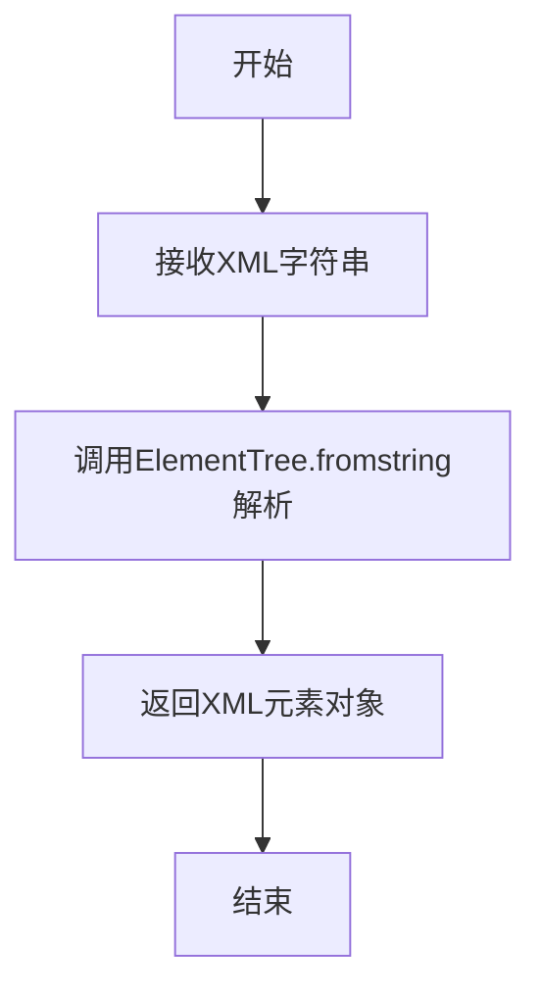

#### 带注释源码

```python
# 定义SVG滤镜的XML字符串，包含高斯模糊效果
filter_def = """
  <defs xmlns='http://www.w3.org/2000/svg'
        xmlns:xlink='http://www.w3.org/1999/xlink'>
    <filter id='dropshadow' height='1.2' width='1.2'>
      <feGaussianBlur result='blur' stdDeviation='3'/>
    </filter>
  </defs>
"""

# 使用ET.XML将XML字符串解析为Element对象
# 解析后可以在Python中操作这个XML结构
filter_element = ET.XML(filter_def)

# 将滤镜定义插入到SVG的根元素开头（索引0位置）
tree.insert(0, filter_element)
# 效果: 在<svg>元素的开始位置插入滤镜定义<defs>...</defs>
```

---

### `ElementTree.insert`

在XML元素中插入子元素

参数：

-  `index`：int，插入位置索引
-  `element`：Element，要插入的XML元素

返回值：无

#### 流程图

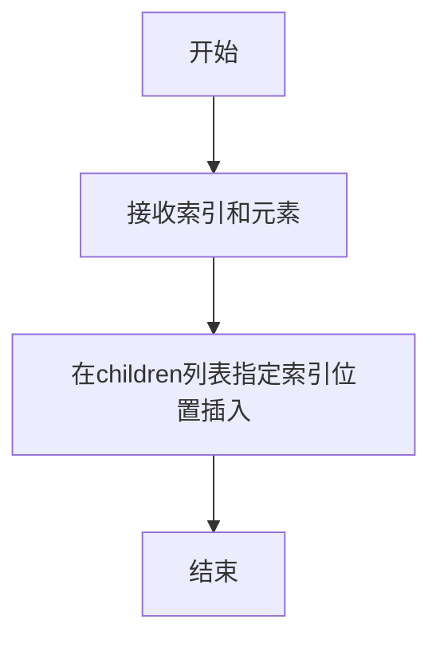

#### 带注释源码

```python
# 将滤镜定义插入到SVG根元素的第一个子元素位置
# tree是SVG的根<svg>元素
# 0表示插入到列表开头
# filter_element是前面用ET.XML解析得到的滤镜定义元素
tree.insert(0, filter_element)

# 插入后的XML结构大致为:
# <svg>
#   <defs>...</defs>    <!-- 新插入的滤镜定义 -->
#   ... 其他子元素 ...
# </svg>
```

---

### `Element.set`

为XML元素设置属性

参数：

-  `key`：str，属性名
-  `value`：str，属性值

返回值：无

#### 流程图

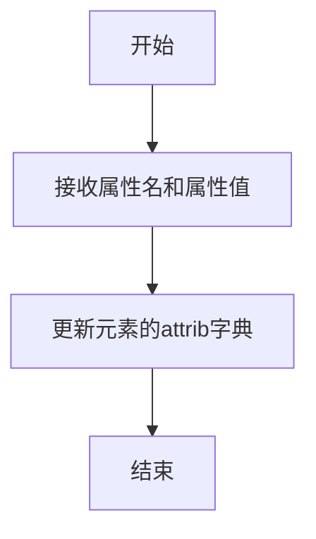

#### 带注释源码

```python
# 为阴影线条应用SVG滤镜
# shadow是获取到的SVG元素（通过xmlid字典）
# 设置filter属性值为'url(#dropshadow)'引用之前定义的滤镜
shadow.set("filter", 'url(#dropshadow)')

# 这会在SVG中生成类似以下的属性:
# <path filter="url(#dropshadow)" ... />
# 这样该路径就会显示高斯模糊的阴影效果
```

---

### 完整流程图

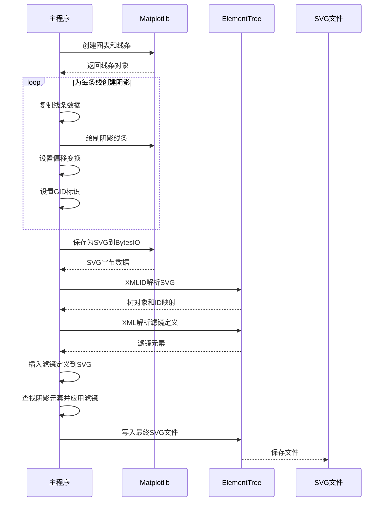


### `tree.insert`

将滤镜定义（XML元素）插入到SVG文档树中，作为第一个子元素，以便后续为阴影线条应用滤镜效果。

参数：
- `index`：`int`，指定插入位置的索引，这里传入 `0` 表示插入为第一个子元素。
- `element`：`xml.etree.ElementTree.Element`，要插入的XML元素，此处为通过 `ET.XML(filter_def)` 解析得到的滤镜定义元素。

返回值：`None`，该方法无返回值，直接修改原XML树结构。

#### 流程图

```mermaid
flowchart TD
    A[开始插入操作] --> B{验证索引和元素有效性}
    B -->|有效| C[将元素插入到children列表的指定索引位置]
    C --> D[更新树结构]
    D --> E[结束插入操作]
    B -->|无效| F[抛出异常或忽略]
```

#### 带注释源码

```python
# filter_def 是一个XML字符串，定义了SVG滤镜（高斯模糊）
filter_def = """
  <defs xmlns='http://www.w3.org/2000/svg'
        xmlns:xlink='http://www.w3.org/1999/xlink'>
    <filter id='dropshadow' height='1.2' width='1.2'>
      <feGaussianBlur result='blur' stdDeviation='3'/>
    </filter>
  </defs>
"""

# 读取保存的SVG文件（以字节流形式），解析为XML树和ID映射
tree, xmlid = ET.XMLID(f.getvalue())

# 使用 tree.insert 方法将滤镜定义插入到SVG树中
# 参数0表示插入为第一个子元素，ET.XML(filter_def)将字符串转换为Element对象
tree.insert(0, ET.XML(filter_def))
```


### `Element.set`

该方法是 `xml.etree.ElementTree.Element` 类的成员方法，用于在SVG/XML元素上设置属性（Attributes）。在代码中，shadow对象是SVG DOM中的Element节点，调用 `shadow.set("filter", 'url(#dropshadow)')` 用于为SVG阴影元素应用高斯模糊滤镜效果。

参数：

- `name`：`str`，要设置的属性名称（如 "filter"）
- `value`：`str`，属性的值（如 'url(#dropshadow)'）

返回值：`None`，该方法无返回值，直接修改Element对象的属性字典

#### 流程图

```mermaid
flowchart TD
    A[开始设置SVG属性] --> B{检查Element对象是否有效}
    B -->|是| C[将name和value作为键值对存入Element的attrib字典]
    C --> D[返回None]
    B -->|否| E[抛出AttributeError或TypeError]
    D --> F[结束]
    E --> F
```

#### 带注释源码

```python
# 在SVG DOM中获取shadow元素
# xmlid字典通过ET.XMLID()返回,键为元素的gid属性值
shadow = xmlid[l.get_label() + "_shadow"]

# 调用Element.set方法设置SVG属性
# 参数1: "filter" - SVG滤镜属性的名称
# 参数2: 'url(#dropshadow)' - 引用之前在<defs>中定义的dropshadow滤镜
# 该滤镜定义在filter_def字符串中,包含feGaussianBlur高斯模糊效果
shadow.set("filter", 'url(#dropshadow)')

# 上述调用的内部实现等价于:
# shadow.attrib["filter"] = 'url(#dropshadow)'
# ElementTree会将此属性添加到XML元素的开始标签中
# 最终生成的SVG代码类似于: <path filter="url(#dropshadow)" ... />
```


### `ET.ElementTree`

该函数用于创建 XML 树（ElementTree 对象），将内存中的 XML 元素结构封装为可序列化的树对象，以便后续写入文件。

参数：

- `element`：`xml.etree.ElementTree.Element`，要作为树根节点的 XML 元素，默认为 None
- `file`：（可选）未在代码中使用，忽略

返回值：`xml.etree.ElementTree.ElementTree`，返回封装后的 ElementTree 对象，可调用 write() 方法输出到文件

#### 流程图

```mermaid
flowchart TD
    A[开始] --> B[接收根元素 tree]
    B --> C{element 参数是否为空?}
    C -->|是| D[创建空 ElementTree 对象]
    C -->|否| E[将 element 作为根节点封装]
    D --> F[返回 ElementTree 实例]
    E --> F
    F --> G[调用 .write 方法]
    G --> H[输出 XML 到文件]
    H --> I[结束]
```

#### 带注释源码

```python
# 创建 ElementTree 对象，传入已解析的 XML 根元素 tree
# tree 是通过 ET.XMLID(f.getvalue()) 返回的 XML 文档根节点
# 该对象封装了 XML 树结构，提供 write() 方法用于序列化输出
ET.ElementTree(tree).write(fn)

# 等价于:
# 1. 创建树对象: tree_obj = ET.ElementTree(tree)
# 2. 写入文件: tree_obj.write(fn)
# 其中 fn = "svg_filter_line.svg"
```


### `tree.write`

将XML元素树写入文件，完成SVG滤镜应用的最终输出。

参数：

- `fn`：`str`，输出文件名，指定要将SVG内容写入的目标文件路径（"svg_filter_line.svg"）

返回值：`None`，该方法无返回值，直接将XML树序列化到文件系统

#### 流程图

```mermaid
flowchart TD
    A[开始写入文件] --> B[打开指定文件fn]
    B --> C[序列化XML树为字节流]
    C --> D[写入文件内容]
    D --> E[关闭文件]
    E --> F[结束]
```

#### 带注释源码

```python
# tree 是从之前步骤中构建的XML DOM树
# fn 是目标文件名 "svg_filter_line.svg"
# ET.ElementTree(tree) 创建新的ElementTree包装对象
# .write(fn) 将整个XML树序列化为字符串并写入指定文件

ET.ElementTree(tree).write(fn)
```

**详细说明：**

在代码的上下文中，`tree.write` 是 `xml.etree.ElementTree.ElementTree` 类的实例方法。此调用完成了以下操作：

1. **接收XML树对象**：从SVG文件中解析得到的 `tree`（`xml.etree.ElementTree.Element` 类型）
2. **包装为ElementTree**：通过 `ET.ElementTree(tree)` 创建完整的树对象
3. **写入文件**：将XML树序列化为格式化的XML字符串，写入到 `fn` 指定的文件中

此方法将包含SVG滤镜定义的完整SVG文档输出到磁盘，使阴影效果能够通过SVG渲染器显示。


## 关键组件


### SVG滤镜定义与高斯模糊

使用SVG的feGaussianBlur滤镜元素创建阴影效果，通过定义stdDeviation="3"实现3像素的高斯模糊，用于模拟真实的阴影投射效果。

### 阴影线条创建与属性复制

通过ax.plot()创建阴影线，使用update_from()方法从原始线条复制所有属性，然后通过set_color("0.2")调整颜色、set_zorder(l.get_zorder() - 0.5)调整图层顺序，确保阴影显示在原始线条下方。

### 坐标变换与偏移复制

使用matplotlib.transforms模块的offset_copy()函数创建带偏移的坐标变换副本，x=4.0, y=-6.0设置向右4点和向下6点的偏移量，units='points'指定偏移单位为点，实现阴影的精确位移效果。

### SVG文档对象模型操作

利用xml.etree.ElementTree模块解析SVG字节数据，通过XMLID()获取带ID的XML元素映射字典，使用insert()方法在SVG根节点插入滤镜定义，使用set()方法为阴影元素设置filter属性引用。

### 图表与坐标轴初始化

创建Figure对象和Axes对象，设置坐标轴范围为(0,1)，通过add_axes()方法指定axes的区域位置(0.1, 0.1, 0.8, 0.8)，为后续线条绘制提供容器。

### 滤镜定义字符串解析

将SVG滤镜定义字符串通过ET.XML()解析为ElementTree元素节点，包含defs和filter两个嵌套元素，filter的id为'dropshadow'，height和width设置为1.2倍以确保模糊效果不会边缘裁剪。


## 问题及建议


### 已知问题

- **魔法数字硬编码**：阴影偏移量（`x=4.0, y=-6.0`）、zorder偏移量（`0.5`）、模糊标准差（`stdDeviation='3'`）、过滤器尺寸（`height='1.2' width='1.2'`）等参数均为硬编码，缺乏可配置性。
- **缺乏错误处理**：访问`xmlid[l.get_label() + "_shadow"]`时未进行KeyError检查，若标签不存在会导致程序崩溃；未检查`ET.ElementTree(tree).write(fn)`的文件写入是否成功。
- **资源未显式释放**：`io.BytesIO()`对象使用后未显式调用`close()`方法，虽然程序结束时会自动释放，但不符合最佳实践。
- **SVG兼容性无提示**：代码注释提到"filtering effects are only effective if your SVG renderer support it"，但运行时未提供任何警告或提示信息。
- **代码复用性差**：所有逻辑均位于全局作用域，未封装为函数或类，难以在其他项目中复用。
- **变量命名不清晰**：使用单字母变量名（如`l`, `f`, `fn`, `xx`, `yy`）降低代码可读性。
- **XML注入风险**：直接使用字符串拼接构建SVG元素ID（`l.get_label() + "_shadow"`），若标签包含特殊字符可能导致XML/ID引用失效。
- **重复代码模式**：循环内部创建阴影的逻辑可提取为函数以减少重复。

### 优化建议

- 将阴影创建逻辑封装为函数，参数化偏移量、颜色、zorder偏移等配置。
- 添加try-except块处理KeyError和IOError，提供有意义的错误信息。
- 使用上下文管理器（`with`语句）管理BytesIO资源。
- 在无SVG渲染器支持时输出警告信息。
- 验证标签名称的合法性，过滤特殊字符或使用更安全的ID生成策略。
- 改进变量命名，使用更具描述性的标识符替代单字母变量。
- 考虑将过滤器定义外部化或参数化，支持不同的视觉效果配置。

## 其它


### 设计目标与约束

本代码旨在演示如何使用Matplotlib生成带有SVG滤镜效果（高斯模糊阴影）的矢量图形。设计目标是创建一个可复用的图形阴影效果实现示例，展示SVG滤镜在Matplotlib中的实际应用方式。

约束条件包括：
- 依赖Matplotlib的SVG后端渲染功能
- 使用xml.etree.ElementTree进行SVG DOM操作
- 滤镜效果需要SVG查看器支持

### 错误处理与异常设计

代码中错误处理较为薄弱，主要潜在异常点包括：
- 文件I/O操作异常（plt.savefig可能失败）
- XML解析异常（ET.XMLID、ET.XML可能抛出解析错误）
- 图形对象属性获取异常（get_label、get_transform等方法可能返回None）

当前代码未包含显式的异常捕获机制，建议增加try-except块处理可能的异常情况。

### 数据流与状态机

数据流如下：
1. 创建Figure和Axes对象
2. 绘制两条折线数据
3. 为每条线创建阴影线条（克隆属性、调整颜色和zorder）
4. 应用偏移变换
5. 保存Figure为SVG格式字节流
6. 解析SVG字节流为XML DOM
7. 插入滤镜定义
8. 为阴影元素应用滤镜属性
9. 写入最终SVG文件

状态机相对简单，主要为：图形构建 → SVG渲染 → XML处理 → 文件输出

### 外部依赖与接口契约

外部依赖：
- matplotlib.pyplot：图形创建和保存
- matplotlib.transforms：图形变换
- xml.etree.ElementTree：SVG XML解析和操作
- io.BytesIO：内存字节流操作

接口契约：
- plt.figure()：返回Figure对象
- ax.plot()：返回Line2D对象列表
- plt.savefig()：写入SVG格式到文件对象
- ET.XMLID()：返回(根元素, id映射字典)
- ET.ElementTree().write()：写入XML到文件

### 性能考虑与优化空间

当前代码在循环中重复创建shadow对象并逐个应用变换和滤镜。对于大量线条的场景，建议：
- 批量处理阴影创建逻辑
- 考虑使用SVG滤镜组的复用机制
- 滤镜参数（stdDeviation、height、width）可考虑外部配置化

### 可测试性分析

代码可直接运行并生成SVG文件，验证方式：
- 检查输出文件是否存在
- 验证SVG内容包含滤镜定义（feGaussianBlur）
- 验证阴影元素包含filter属性引用
- 可通过自动化测试比较生成的SVG结构

### 安全性考虑

代码主要处理内存中的数据，无用户输入直接参与，安全性风险较低。但应注意：
- 文件写入路径应考虑路径遍历风险（当前使用固定文件名）
- XML处理时应注意外部实体（XXE）防护（ElementTree默认安全）


    