# `matplotlib\galleries\examples\misc\svg_filter_pie.py` 详细设计文档

This Python script generates an SVG pie chart with custom filtering effects using Matplotlib and SVG filters.

## 整体流程

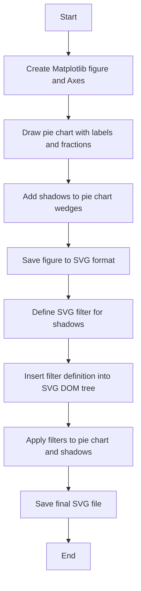

## 类结构

```
matplotlib.pyplot (Matplotlib library)
├── io.BytesIO (Python built-in library)
│   ├── xml.etree.ElementTree (Python built-in library)
│   └── Shadow (matplotlib.patches module)
└── svg_filter_pie.py (Main script)
```

## 全局变量及字段


### `fig`
    
The main figure object for the plot.

类型：`matplotlib.figure.Figure`
    


### `ax`
    
The axes object where the pie chart is drawn.

类型：`matplotlib.axes._subplots.AxesSubplot`
    


### `labels`
    
The labels for the pie chart slices.

类型：`list of str`
    


### `fracs`
    
The fractions of the pie chart slices.

类型：`list of float`
    


### `explode`
    
The explode factor for each pie slice.

类型：`list of float`
    


### `pie`
    
The list of wedge objects representing the pie slices.

类型：`list of matplotlib.patches.Patch`
    


### `w`
    
The wedge object representing a single pie slice.

类型：`matplotlib.patches.Wedge`
    


### `s`
    
The shadow object for a pie slice.

类型：`matplotlib.patches.Shadow`
    


### `f`
    
The in-memory bytes buffer to save the SVG image.

类型：`io.BytesIO`
    


### `tree`
    
The ElementTree object representing the SVG document.

类型：`xml.etree.ElementTree.ElementTree`
    


### `xmlid`
    
A dictionary mapping element IDs to their corresponding ElementTree elements.

类型：`dict`
    


### `fn`
    
The filename to save the SVG image to.

类型：`str`
    


### `Shadow.shadow`
    
The shadow patch for the object.

类型：`matplotlib.patches.Shadow`
    


### `Shadow.shadow`
    
The shadow patch for the object.

类型：`matplotlib.patches.Shadow`
    
    

## 全局函数及方法


### plt.figure

`plt.figure` is a function from the Matplotlib library that creates a new figure and returns a Figure instance. It is used to set up the canvas for plotting.

参数：

- `figsize`：`tuple`，指定图形的大小，单位为英寸。
- `dpi`：`int`，指定图形的分辨率，单位为点每英寸。
- `facecolor`：`color`，指定图形的背景颜色。
- `edgecolor`：`color`，指定图形的边缘颜色。
- `frameon`：`bool`，指定是否显示图形的边框。
- `num`：`int`，指定图形的编号。
- `figclass`：`class`，指定图形的类。

返回值：`Figure`，图形实例。

#### 流程图

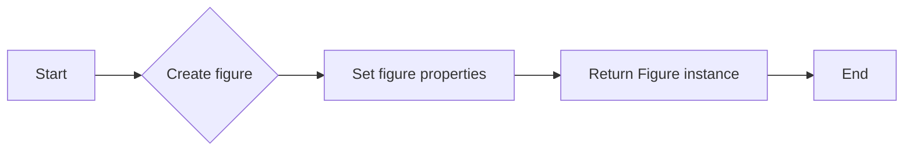

#### 带注释源码

```python
fig = plt.figure(figsize=(6, 6))
```


### ax.add_axes

`ax.add_axes` is a method of the Axes class in Matplotlib that adds an axes to the figure. It is used to define the region of the figure where the plot will be drawn.

参数：

- `rect`：`tuple`，指定axes的位置和大小，格式为 `(left, bottom, width, height)`，单位为0到1之间的浮点数。
- `sharex`：`bool`，指定是否共享x轴。
- `sharey`：`bool`，指定是否共享y轴。
- `frameon`：`bool`，指定是否显示axes的边框。
- `projection`：`str`，指定axes的投影类型。
- `zorder`：`float`，指定axes的z顺序。

返回值：`Axes`，axes实例。

#### 流程图

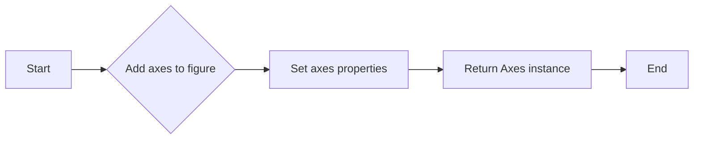

#### 带注释源码

```python
ax = fig.add_axes((0.1, 0.1, 0.8, 0.8))
```


### ax.pie

`ax.pie` is a method of the Axes class in Matplotlib that draws a pie chart. It is used to plot a pie chart on the axes.

参数：

- `x`：`array_like`，指定每个扇区的值。
- `explode`：`array_like`，指定每个扇区的突出显示程度。
- `labels`：`sequence`，指定每个扇区的标签。
- ` autopct`：`str`，指定每个扇区的百分比格式。
- `startangle`：`float`，指定饼图的起始角度。
- `pctdistance`：`float`，指定百分比标签与扇区的距离。
- `labeldistance`：`float`，指定标签与扇区的距离。
- `colors`：`sequence`，指定扇区的颜色。
- `wedgeprops`：`dict`，指定扇区的属性。
- `shadow`：`bool`，指定是否绘制扇区的阴影。

返回值：`WedgeCollection`，扇区集合。

#### 流程图

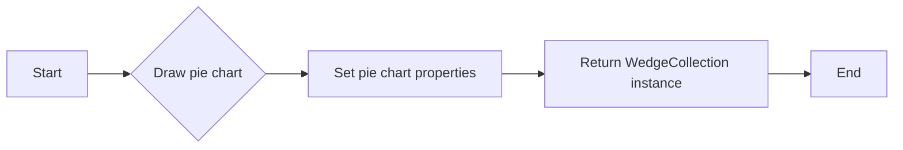

#### 带注释源码

```python
pie = ax.pie(fracs, explode=explode, labels=labels, autopct='%1.1f%%')
```


### plt.savefig

`plt.savefig` is a function from the Matplotlib library that saves the current figure to a file. It is used to save the plot to a file in various formats.

参数：

- `filename`：`str`，指定保存的文件名。
- `dpi`：`int`，指定图像的分辨率，单位为点每英寸。
- `format`：`str`，指定保存的文件格式。
- `facecolor`：`color`，指定图形的背景颜色。
- `edgecolor`：`color`，指定图形的边缘颜色。
- `orientation`：`str`，指定图像的方向。
- `transparent`：`bool`，指定是否保存为透明背景。
- `bbox_inches`：`str`，指定裁剪框的边界。
- `pad_inches`：`float`，指定图像的填充。

返回值：`None`

#### 流程图

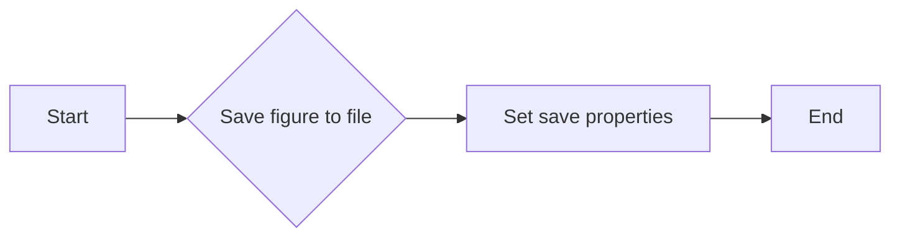

#### 带注释源码

```python
plt.savefig(f, format="svg")
```


### ET.XMLID

`ET.XMLID` is a method of the ElementTree module in Python that creates an XML ID dictionary. It is used to create a dictionary that maps element IDs to their corresponding elements.

参数：

- `xml`：`str`，指定XML字符串。
- `idattr`：`str`，指定元素ID的属性名称。

返回值：`dict`，XML ID字典。

#### 流程图

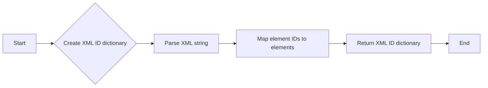

#### 带注释源码

```python
tree, xmlid = ET.XMLID(f.getvalue())
```


### ET.ElementTree.write

`ET.ElementTree.write` is a method of the ElementTree module in Python that writes the element tree to a file. It is used to save the XML data to a file.

参数：

- `file`：`file-like object`，指定写入的文件对象。
- `encoding`：`str`，指定文件的编码。
- `xml_declaration`：`bool`，指定是否写入XML声明。

返回值：`None`

#### 流程图

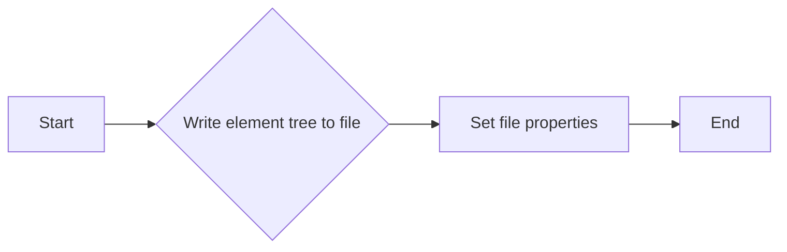

#### 带注释源码

```python
ET.ElementTree(tree).write(fn)
```


### filter_def

`filter_def` is a string that contains the SVG filter definition for the shadow effect. It is used to define the filter effects that will be applied to the SVG elements.

#### 流程图

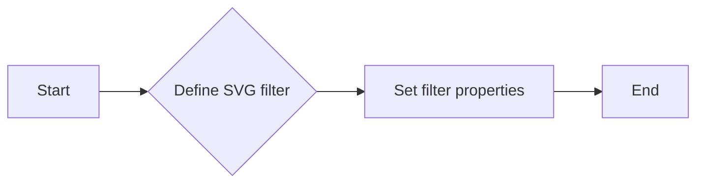

#### 带注释源码

```python
filter_def = """
  <defs xmlns='http://www.w3.org/2000/svg'
        xmlns:xlink='http://www.w3.org/1999/xlink'>
    <filter id='dropshadow' height='1.2' width='1.2'>
      <feGaussianBlur result='blur' stdDeviation='2'/>
    </filter>

    <filter id='MyFilter' filterUnits='objectBoundingBox'
            x='0' y='0' width='1' height='1'>
      <feGaussianBlur in='SourceAlpha' stdDeviation='4%' result='blur'/>
      <feOffset in='blur' dx='4%' dy='4%' result='offsetBlur'/>
      <feSpecularLighting in='blur' surfaceScale='5' specularConstant='.75'
           specularExponent='20' lighting-color='#bbbbbb' result='specOut'>
        <fePointLight x='-5000%' y='-10000%' z='20000%'/>
      </feSpecularLighting>
      <feComposite in='specOut' in2='SourceAlpha'
                   operator='in' result='specOut'/>
      <feComposite in='SourceGraphic' in2='specOut' operator='arithmetic'
    k1='0' k2='1' k3='1' k4='0'/>
    </filter>
  </defs>
"""
```


### `fig.add_axes`

`fig.add_axes` 是一个方法，用于在 Matplotlib 图形中添加一个轴（Axes）。

参数：

- `(0.1, 0.1, 0.8, 0.8)`：一个包含四个浮点数的元组，分别代表轴的左、下、宽度和高度，这些值都是相对于整个图形的。

返回值：`Axes`，返回一个轴对象，可以用来绘制图形和标签。

#### 流程图

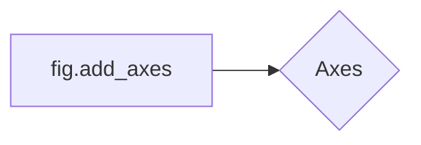

#### 带注释源码

```python
# make a square figure and Axes
fig = plt.figure(figsize=(6, 6))
ax = fig.add_axes((0.1, 0.1, 0.8, 0.8))
```


### ax.pie

`ax.pie` 是一个用于在 Matplotlib 的 Axes 对象上绘制饼图的方法。

参数：

- `fracs`：`list`，表示每个饼块的分数。
- `explode`：`list`，表示每个饼块是否突出显示，默认为 None。
- `labels`：`list`，表示每个饼块的标签。
- `autopct`：`str`，表示饼图上每个饼块的百分比格式。

返回值：`Pie`，表示饼图对象。

#### 流程图

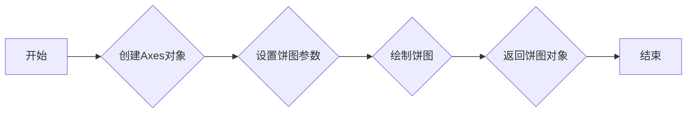

#### 带注释源码

```python
pie = ax.pie(fracs, explode=explode, labels=labels, autopct='%1.1f%%')
```


### Shadow

Shadow(w, offset_x, offset_y)

该函数创建一个阴影效果，用于matplotlib中的饼图。

参数：

- `w`：`matplotlib.patches.Wedge`，饼图的扇形部分。
- `offset_x`：`float`，阴影在x轴方向的偏移量。
- `offset_y`：`float`，阴影在y轴方向的偏移量。

返回值：`matplotlib.patches.Patch`，阴影效果。

#### 流程图


#### 带注释源码

```python
for w in pie.wedges:
    # create shadow patch
    s = Shadow(w, -0.01, -0.01)
    s.set_gid(w.get_gid() + "_shadow")
    s.set_zorder(w.get_zorder() - 0.1)
    ax.add_patch(s)
```


### plt.savefig

保存matplotlib图形为文件。

参数：

- `f`：`io.BytesIO`，用于保存SVG格式的图形的内存缓冲区。
- `format`：`str`，指定保存的文件格式，这里为"svg"。

返回值：无

#### 流程图

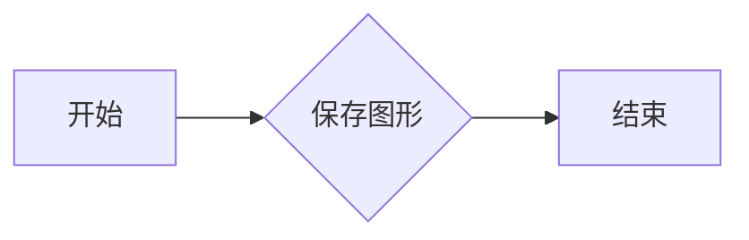

#### 带注释源码

```python
# save
f = io.BytesIO()
plt.savefig(f, format="svg")
```


### ET.XML

该函数从给定的SVG文件中提取XML元素。

参数：

- `f`: `io.BytesIO`，包含SVG文件的二进制数据。

返回值：`xml.etree.ElementTree.Element`，提取的XML元素。

#### 流程图


#### 带注释源码

```python
tree, xmlid = ET.XMLID(f.getvalue())
```


### ET.ElementTree.write

该函数将XML元素树写入文件。

参数：

- `tree`: `xml.etree.ElementTree.Element`，XML元素树。
- `fn`: `str`，输出文件的名称。

返回值：无。

#### 流程图


#### 带注释源码

```python
ET.ElementTree(tree).write(fn)
```


### tree.insert

`tree.insert` 是一个 XML 解析库 `xml.etree.ElementTree` 中的方法，用于将一个元素插入到 XML DOM 树中的指定位置。

参数：

- `position`：`int` 或 `Element`，指定插入位置。如果是一个整数，表示插入到指定索引位置；如果是一个元素，表示插入到该元素之前。
- `element`：`Element`，要插入的元素。

参数描述：

- `position`：指定插入位置，可以是索引或另一个元素。
- `element`：要插入的 XML 元素。

返回值：`None`

返回值描述：该方法不返回任何值。

#### 流程图

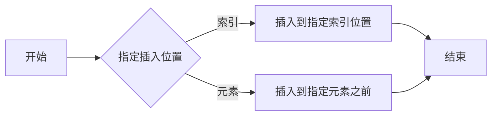

#### 带注释源码

```python
tree.insert(0, ET.XML(filter_def))
```

在这段代码中，`tree.insert(0, ET.XML(filter_def))` 将 `filter_def` 元素插入到 `tree` 树的根节点之前的位置（索引为 0）。`ET.XML(filter_def)` 将字符串 `filter_def` 转换为一个 XML 元素。


### ET.ElementTree.write

This function writes the ElementTree to a file.

参数：

- `tree`：`ElementTree`，The ElementTree to write.
- `file`：`str`，The file to write the ElementTree to.

参数描述：

- `tree`：The ElementTree object that contains the XML data to be written.
- `file`：The file path where the XML data will be saved.

返回值类型：`None`

返回值描述：This function does not return any value. It writes the XML data to the specified file.

#### 流程图


#### 带注释源码

```python
ET.ElementTree(tree).write(fn)
```


### Shadow.set

`Shadow.set` 方法用于设置 SVG 图形元素的属性。

参数：

- `self`：`Shadow` 类的实例，表示阴影对象。
- `attr`：`str`，要设置的属性名称。
- `value`：`str`，要设置的属性值。

返回值：`None`，该方法不返回任何值。

#### 流程图

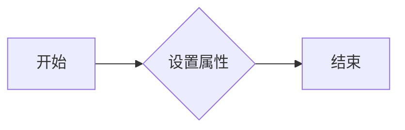

#### 带注释源码

```python
# 创建阴影对象
s = Shadow(w, -0.01, -0.01)

# 设置阴影的 gid 属性
s.set_gid(w.get_gid() + "_shadow")

# 设置阴影的 zorder 属性
s.set_zorder(w.get_zorder() - 0.1)

# 添加阴影到轴上
ax.add_patch(s)

# 设置阴影的 filter 属性
shadow.set("filter", 'url(#dropshadow)')
```


### xmlid[pie_name + "_shadow"].set

`xmlid[pie_name + "_shadow"].set` 方法用于设置 SVG 图形元素的属性。

参数：

- `self`：SVG 图形元素的实例。
- `attr`：`str`，要设置的属性名称。
- `value`：`str`，要设置的属性值。

返回值：`None`，该方法不返回任何值。

#### 流程图


#### 带注释源码

```python
# 获取阴影元素
shadow = xmlid[pie_name + "_shadow"]

# 设置阴影的 filter 属性
shadow.set("filter", 'url(#dropshadow)')
```


### Shadow(w, -0.01, -0.01)

创建一个阴影效果。

参数：

- `w`：`matplotlib.patches.Wedge`，表示饼图的扇形部分。
- `-0.01`：`float`，阴影的水平偏移量。
- `-0.01`：`float`，阴影的垂直偏移量。

返回值：`matplotlib.patches.Patch`，表示阴影效果。

#### 流程图


#### 带注释源码

```python
for w in pie.wedges:
    # create shadow patch
    s = Shadow(w, -0.01, -0.01)
    s.set_gid(w.get_gid() + "_shadow")
    s.set_zorder(w.get_zorder() - 0.1)
    ax.add_patch(s)
```


## 关键组件


### 张量索引与惰性加载

用于在SVG渲染器中实现阴影效果时，延迟加载和索引张量，以提高性能和资源管理。

### 反量化支持

提供对反量化操作的支持，允许在量化过程中进行逆量化，以便在量化后的模型中恢复原始精度。

### 量化策略

定义了不同的量化策略，用于在模型训练和部署过程中调整模型的精度和性能。


## 问题及建议


### 已知问题

-   **SVG渲染器兼容性**：代码中提到SVG渲染器需要支持filter效果，这可能导致在不同渲染器上的兼容性问题。
-   **性能问题**：使用`feGaussianBlur`和`feSpecularLighting`等filter效果可能会对性能产生影响，特别是在处理大量数据时。
-   **代码可读性**：代码中存在一些硬编码的值，如`stdDeviation`和`surfaceScale`，这可能会降低代码的可读性和可维护性。

### 优化建议

-   **增加SVG渲染器兼容性检查**：在代码中增加对SVG渲染器支持的检查，确保filter效果能够在目标渲染器上正常工作。
-   **优化filter效果**：考虑使用更简单的filter效果或调整现有效果的参数，以减少对性能的影响。
-   **参数化filter效果**：将filter效果的参数作为配置项，提高代码的可读性和可维护性。
-   **使用更现代的库**：考虑使用更现代的库，如`svgwrite`，来处理SVG的生成和filter效果，这些库可能提供更好的性能和更丰富的功能。
-   **错误处理**：增加错误处理机制，以处理SVG渲染器不支持filter效果或其他潜在的错误情况。
-   **代码注释**：增加代码注释，解释filter效果的配置和作用，提高代码的可读性。


## 其它


### 设计目标与约束

- 设计目标：实现一个SVG滤镜效果的饼图，展示SVG滤镜效果在Matplotlib中的应用。
- 约束条件：SVG渲染器需支持滤镜效果，且滤镜效果在不同渲染器中的表现可能不同。

### 错误处理与异常设计

- 错误处理：在SVG渲染器不支持滤镜效果时，应提供友好的错误信息，并建议用户使用支持滤镜效果的渲染器。
- 异常设计：捕获并处理可能出现的异常，如文件保存失败、XML解析错误等。

### 数据流与状态机

- 数据流：数据从Matplotlib饼图生成，经过SVG滤镜处理，最终保存为SVG文件。
- 状态机：程序执行过程中，状态从饼图绘制到SVG文件保存。

### 外部依赖与接口契约

- 外部依赖：Matplotlib库、xml.etree.ElementTree库。
- 接口契约：Matplotlib库提供饼图绘制接口，xml.etree.ElementTree库提供XML解析和写入接口。

### 安全性与隐私

- 安全性：确保代码执行过程中不会泄露敏感信息。
- 隐私：不涉及用户隐私数据。

### 性能优化

- 性能优化：优化SVG滤镜效果的计算过程，提高渲染效率。

### 可维护性与可扩展性

- 可维护性：代码结构清晰，易于理解和维护。
- 可扩展性：方便添加新的SVG滤镜效果。

### 测试与验证

- 测试：编写单元测试，确保代码功能正确。
- 验证：在不同SVG渲染器中验证滤镜效果。

### 文档与帮助

- 文档：提供详细的设计文档和用户手册。
- 帮助：提供在线帮助和常见问题解答。

### 代码风格与规范

- 代码风格：遵循PEP 8编码规范。
- 规范：确保代码可读性和可维护性。

### 依赖管理

- 依赖管理：使用pip等工具管理项目依赖。

### 版本控制

- 版本控制：使用Git等版本控制系统管理代码版本。

### 项目管理

- 项目管理：使用Jira等项目管理工具跟踪任务和进度。

### 部署与发布

- 部署：将项目部署到服务器或本地环境。
- 发布：将项目发布到GitHub等代码托管平台。

### 用户反馈与支持

- 用户反馈：收集用户反馈，不断优化产品。
- 用户支持：提供技术支持和故障排除。

### 法律与合规

- 法律：遵守相关法律法规。
- 合规：确保项目符合行业标准和规范。

### 质量保证

- 质量保证：确保项目质量，满足用户需求。

### 项目生命周期

- 项目生命周期：从需求分析、设计、开发、测试、部署到维护。

### 项目团队

- 项目团队：明确项目团队成员及其职责。

### 项目预算

- 项目预算：合理分配项目资源。

### 项目时间表

- 项目时间表：制定项目时间表，确保项目按时完成。

### 项目风险

- 项目风险：识别项目风险，制定应对措施。

### 项目收益

- 项目收益：评估项目收益，确保项目投资回报率。

### 项目评估

- 项目评估：定期评估项目进展和成果。

### 项目总结

- 项目总结：总结项目经验，为后续项目提供参考。


    