# `matplotlib\galleries\examples\misc\table_demo.py` 详细设计文档

这是一个matplotlib表格演示程序，用于展示如何在图表中同时显示堆叠柱状图和配套的数据表格。程序创建了一个关于不同自然灾害（冻结、大风、洪水、地震、冰雹）造成损失数据的可视化图表，包含底部的表格和上方的堆叠柱状图。

## 整体流程

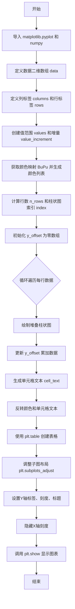

## 类结构

```
该脚本为非面向对象编程，无类定义
直接执行型脚本，使用全局变量和函数调用完成绘图任务
```

## 全局变量及字段


### `data`
    
二维列表，包含5种自然灾害的损失数据

类型：`list[list[int]]`
    


### `columns`
    
元组，列标签（Freeze, Wind, Flood, Quake, Hail）

类型：`tuple[str]`
    


### `rows`
    
列表，行标签（100年, 50年, 20年, 10年, 5年）

类型：`list[str]`
    


### `values`
    
numpy数组，Y轴刻度值范围（0, 500, 1000, 1500, 2000）

类型：`numpy.ndarray`
    


### `value_increment`
    
整数，值增量（1000）

类型：`int`
    


### `colors`
    
列表，从BuPu颜色映射生成的渐变色

类型：`list`
    


### `n_rows`
    
整数，数据行数（5）

类型：`int`
    


### `index`
    
numpy数组，柱状图X轴位置偏移

类型：`numpy.ndarray`
    


### `bar_width`
    
浮点数，柱状图宽度（0.4）

类型：`float`
    


### `y_offset`
    
numpy数组，堆叠柱状图的垂直偏移量

类型：`numpy.ndarray`
    


### `cell_text`
    
列表，表格单元格显示的文本

类型：`list[list[str]]`
    


### `the_table`
    
matplotlib表格对象，创建的表格实例

类型：`matplotlib.table.Table`
    


    

## 全局函数及方法


### `np.arange`

`np.arange` 是 NumPy 库中的一个函数，用于生成一个等差数列（arange 来自 "array range"），它返回一个 ndarray，包含从起始值到结束值（不包含）以指定步长递增的数值序列。

参数：

- `start`：`int` 或 `float`，起始值，默认为 0。当只提供一个参数时，该参数作为 `stop` 值。
- `stop`：`int` 或 `float`，结束值（不包含）。当只提供一个参数时，该参数作为 `stop` 值，起始值默认为 0。
- `step`：`int` 或 `float`，步长，默认为 1。可以为正数或负数，但不能为零。

返回值：`numpy.ndarray`，一个包含等差数列的一维数组。

#### 流程图

```mermaid
flowchart TD
    A[开始] --> B{参数数量}
    B -->|1个参数| C[stop = 参数1, start = 0, step = 1]
    B -->|2个参数| D[start = 参数1, stop = 参数2, step = 1]
    B -->|3个参数| E[start = 参数1, stop = 参数2, step = 参数3]
    C --> F[验证 step != 0]
    D --> F
    E --> F
    F --> G{计算序列长度}
    G -->|step > 0| H[length = ceil((stop - start) / step)]
    G -->|step < 0| I[length = ceil((start - stop) / -step)]
    H --> J[创建数组]
    I --> J
    J --> K[填充数组: start, start+step, start+2*step, ...]
    K --> L[返回 ndarray]
```

#### 带注释源码

```python
# 在本代码中的实际调用
values = np.arange(0, 2500, 500)

# 源码注释：
# np.arange(0, 2500, 500) 生成一个等差数组
# 参数说明：
#   start = 0    # 起始值
#   stop = 2500  # 结束值（不包含）
#   step = 500   # 步长
# 返回值：
#   array([0, 500, 1000, 1500, 2000])
# 这个数组用于设置Y轴刻度值
```


### `np.zeros`

生成一个指定形状的数组，数组中所有元素均为 0。

参数：

- `shape`：`int` 或 `tuple of int`，指定输出数组的维度。例如 `len(columns)` 表示生成一个长度为列数的全零向量。
- `dtype`：`data-type`，可选，默认为 `float`，指定返回数组的数据类型（如 `int`、`float` 等）。
- `order`：`{'C', 'F'}`，可选，默认为 `'C'`，指定在内存中存储多维数组的顺序（行优先或列优先）。

返回值：`numpy.ndarray`，一个填充为零的数组，形状由 `shape` 决定。

#### 流程图

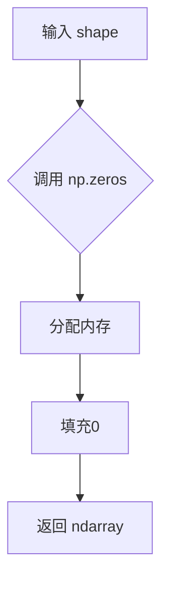

#### 带注释源码

```python
# np.zeros 用于生成全零数组
# 下面的示例展示了在 Table Demo 中如何使用 np.zeros 初始化 y_offset

# 参数 len(columns) 为 5，得到形状为 (5,) 的全零数组
y_offset = np.zeros(len(columns))  # y_offset 初始为 [0. 0. 0. 0. 0.]
```


### `np.linspace`

生成等间距的数组，返回在指定间隔内均匀间隔的数字序列。

参数：

- `start`：`array_like`，序列的起始值
- `stop`：`array_like`，序列的结束值（当 endpoint=True 时包含该值）
- `num`：`int`，要生成的样本数量，默认为 50
- `endpoint`：`bool`（可选），如果为 True，则 stop 是最后一个样本，默认为 True
- `retstep`：`bool`（可选），如果为 True，则返回 (samples, step)，step 是样本之间的间距
- `dtype`：`dtype`（可选），输出数组的类型
- `axis`：`int`（可选），当 start 和 stop 是数组时，结果沿此轴展开

返回值：`ndarray`，在闭区间 [start, stop] 或半开区间 [start, stop) 内均匀间隔的 num 个样本

#### 流程图

```mermaid
flowchart TD
    A[开始] --> B[验证参数: start, stop, num]
    B --> C{num > 0?}
    C -->|否| D[返回空数组]
    C -->|是| E{endpoint=True?}
    E -->|是| F[计算步长 = (stop - start) / (num - 1)]
    E -->|否| G[计算步长 = (stop - start) / num]
    F --> H[生成等间距数组]
    G --> H
    H --> I{retstep=True?}
    I -->|是| J[返回数组和步长]
    I -->|否| K[仅返回数组]
    J --> L[结束]
    K --> L
```

#### 带注释源码

```python
# np.linspace 使用示例（基于代码上下文）
# 代码中: np.linspace(0, 0.5, len(rows))
# 生成从 0 到 0.5 的 5 个等间距值（因为 len(rows) = 5）

# 实际调用:
# np.linspace(0, 0.5, 5)
# 结果: array([0.   , 0.125, 0.25 , 0.375, 0.5  ])

# 参数说明:
# start = 0        # 起始值
# stop = 0.5       # 结束值
# num = 5          # 生成的样本数量（len(rows) = 5）

# 步长计算: (0.5 - 0) / (5 - 1) = 0.125
# 该数组用于从 'BuPu' 颜色映射中获取 5 个 pastel 色调
```


### `plt.colormaps[name](values)`

获取指定颜色映射并将数值数组映射为对应的颜色值数组。这是matplotlib中Colormap对象的可调用接口，用于将输入的数值根据颜色映射表转换为RGBA颜色。

参数：

- `name`：`str`，颜色映射的名称（如"BuPu"、"RdBu"等），用于从`plt.colormaps`字典中获取对应的颜色映射对象
- `values`：`numpy.ndarray`，需要映射的数值数组，通常使用`np.linspace()`生成，范围通常在0到1之间

返回值：`numpy.ndarray`，形状为(N, 4)的浮点数数组，其中N是输入数值的数量，4代表RGBA四个通道（红、绿、蓝、透明度），每个通道值在0到1之间。

#### 流程图

```mermaid
graph TD
    A[调用 plt.colormaps[name](values)] --> B{检查name是否有效}
    B -->|是| C[获取对应Colormap对象]
    B -->|否| D[抛出KeyError异常]
    C --> E{检查values类型}
    E -->|numpy数组| F[调用Colormap.__call__方法]
    E -->|其他类型| G[尝试转换为numpy数组]
    G --> F
    F --> H[归一化数值到0-1范围]
    H --> I[应用颜色映射插值]
    I --> J[生成RGBA颜色数组]
    J --> K[返回numpy.ndarray]
```

#### 带注释源码

```python
# 在代码中的实际使用方式：
# 1. 获取颜色映射 'BuPu'
colormap = plt.colormaps["BuPu"]  # 返回一个Colormap对象（如matplotlib.colors.LinearSegmentedColormap）

# 2. 调用颜色映射，传入数值数组
# np.linspace(0, 0.5, len(rows)) 生成从0到0.5的5个等间距数值
colors = colormap(np.linspace(0, 0.5, len(rows)))

# 完整调用等价于：
colors = plt.colormaps["BuPu"](np.linspace(0, 0.5, len(rows)))

# 返回值示例（当len(rows)=5时）：
# array([[0.862, 0.862, 0.862, 1. ],   # 第一个数值的颜色（较浅的灰紫色）
#        [0.708, 0.746, 0.814, 1. ],
#        [0.549, 0.631, 0.788, 1. ],
#        [0.397, 0.517, 0.753, 1. ],
#        [0.258, 0.404, 0.698, 1. ]])  # 第五个数值的颜色（较深的蓝紫色）
# dtype=float64
```


### `plt.bar`

绘制柱状图是matplotlib库中用于展示数据的核心函数，通过接收x坐标、高度、宽度、底部偏移量和颜色等参数，在当前坐标系中绘制一个或多个垂直柱状图，常用于比较不同类别的数值或展示数据分布。

参数：

- `x`：float或array-like，柱的x坐标位置，可以是单个值或数组
- `height`：float或array-like，柱的高度，决定了每个柱的数值大小
- `width`：float或array-like，柱的宽度，默认值为0.8，可调整柱的粗细
- `bottom`：float或array-like，柱的底部位置，用于堆叠柱状图时指定起始位置
- `color`：color或array-like，柱的颜色，可以是单一颜色或颜色列表
- `align`：str，可选参数，指定x坐标对齐方式，默认为'center'
- `edgecolor`：color，可选参数，柱边框颜色
- `linewidth`：float，可选参数，柱边框线宽
- `tick_label`：str或array-like，可选参数，柱的刻度标签
- `xerr`：float或array-like，可选参数，x方向的误差线
- `yerr`：float或array-like，可选参数，y方向的误差线
- `ecolor`：float，可选参数，误差线颜色
- `capsize`：float，可选参数，误差线端点宽度
- `error_kw`：dict，可选参数，传递给误差线的其他关键字参数
- `log`：bool，可选参数，是否使用对数刻度，默认为False
- `orientation`：str，可选参数，'vertical'或'horizontal'，决定柱的方向

返回值：`BarContainer`，包含创建的柱子对象的容器，可用于访问和操作绘制的柱状图元素

#### 流程图

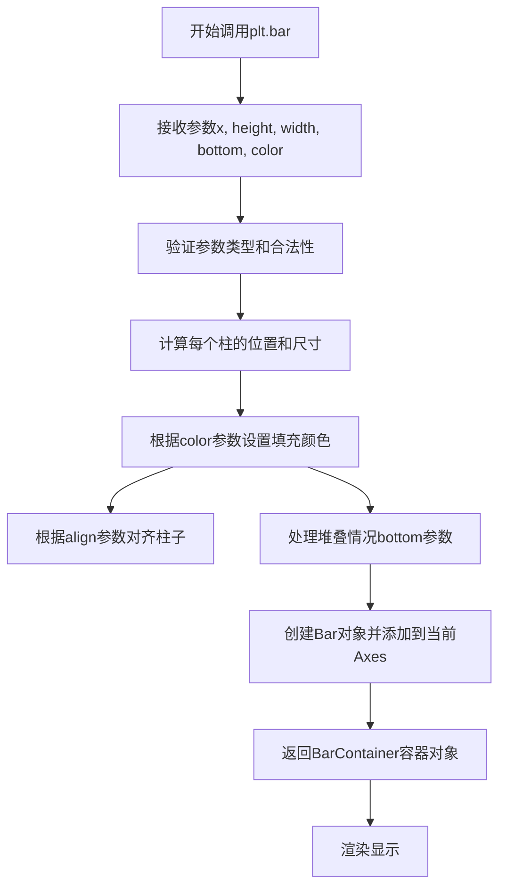

#### 带注释源码

```python
# 在代码中的实际调用示例
# 用于绘制堆叠柱状图，每次迭代绘制一层

# 初始化垂直偏移量，用于堆叠计算
y_offset = np.zeros(len(columns))

# 遍历每一行数据，绘制堆叠柱状图
for row in range(n_rows):
    # 调用bar函数绘制柱状图
    # 参数说明：
    # index: x轴位置数组，决定每组柱子的横向位置
    # data[row]: 当前行的数据值，作为柱子的高度
    # bar_width: 柱子宽度，控制柱子粗细
    # bottom=y_offset: 底部位置，使新柱子堆叠在前一层之上
    # color=colors[row]: 当前层的颜色
    plt.bar(index, data[row], bar_width, bottom=y_offset, color=colors[row])
    
    # 更新y_offset，将当前层的数据累加到偏移量中
    # 为下一层柱子的堆叠位置做准备
    y_offset = y_offset + data[row]
    
    # 记录每行的文本，用于后续表格显示
    # 将数值转换为千位单位并格式化
    cell_text.append(['%1.1f' % (x / 1000.0) for x in y_offset])

# 上述代码实现的效果：
# 1. 第一次循环：y_offset为全0，绘制第一层柱子，bottom=0
# 2. 第一次循环结束后：y_offset更新为第一层的数据累计值
# 3. 第二次循环：绘制第二层柱子，bottom=y_offset（第一层高度）
# 4. 依此类推，实现多层堆叠效果
```


### `plt.table`

matplotlib的表格函数，用于在图表的指定位置创建一个数据表格，支持自定义行标签、列标签、单元格颜色和位置。

参数：

- `cellText`：二维列表（List[List[str]]），表格单元格中显示的文本数据，每行对应一个列表元素
- `rowLabels`：列表（List[str]]），表格每行的行标签，用于标识每一行
- `rowColours`：列表或数组（List or Array），用于设置每一行的背景颜色
- `colLabels`：列表（List[str]），表格的列标签，用于标识每一列
- `loc`：字符串（str），指定表格在图表中的位置，如'bottom'、'top'、'left'、'right'等

返回值：`matplotlib.table.Table`，返回创建的表格对象，可以用于进一步自定义表格样式。

#### 流程图

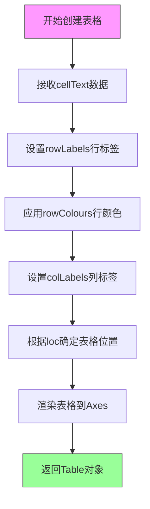

#### 带注释源码

```python
# 在plt.table调用处添加注释说明
the_table = plt.table(
    cellText=cell_text,      # 表格内容：格式化后的数值文本（二维列表）
    rowLabels=rows,          # 行标签：['%d year' % x for x in (100, 50, 20, 10, 5)]
    rowColours=colors,       # 行颜色：使用BuPu色彩映射生成的渐变色
    colLabels=columns,       # 列标签：('Freeze', 'Wind', 'Flood', 'Quake', 'Hail')
    loc='bottom'             # 位置：表格放置在图表底部
)
```


### `plt.subplots_adjust`

调整子图的布局参数，包括子图周围的边距和子图之间的间距。

参数：

- `left`：`float`，子图左侧边距（相对于图形宽度），值为0到1之间
- `right`：`float`，子图右侧边距（相对于图形宽度），值为0到1之间
- `bottom`：`float`，子图底部边距（相对于图形高度），值为0到1之间
- `top`：`float`，子图顶部边距（相对于图形高度），值为0到1之间
- `wspace`：`float`，子图之间水平间距（相对于子图宽度），值为0到1之间
- `hspace`：`float`，子图之间垂直间距（相对于子图高度），值为0到1之间

返回值：`None`，无返回值，该方法直接修改当前图形布局

#### 流程图

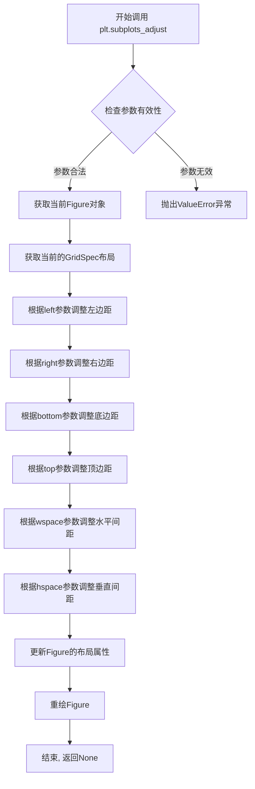

#### 带注释源码

```python
def subplots_adjust(left=None, bottom=None, right=None, top=None,
                    wspace=None, hspace=None, fig=None):
    """
    调整子图布局参数
    
    该函数用于调整Figure中子图的布局，包括子图与Figure边缘的间距
    以及子图之间的间距。
    
    参数:
    -------
    left : float, optional
        子图左侧边距, 相对于Figure宽度, 范围[0,1]
    right : float, optional
        子图右侧边距, 相对于Figure宽度, 范围[0,1]
    bottom : float, optional
        子图底部边距, 相对于Figure高度, 范围[0,1]
    top : float, optional
        子图顶部边距, 相对于Figure高度, 范围[0,1]
    wspace : float, optional
        子图间水平间距, 相对于子图宽度, 范围[0,1]
    hspace : float, optional
        子图间垂直间距, 相对于子图高度, 范围[0,1]
    fig : Figure, optional
        要调整的Figure对象, 默认为当前活动Figure
    
    返回:
    -------
    None
    
    示例:
    -------
    >>> import matplotlib.pyplot as plt
    >>> fig, ax = plt.subplots()
    >>> fig.subplots_adjust(left=0.2, bottom=0.2)  # 调整边距
    """
    
    # 获取目标Figure（默认为当前活动Figure）
    if fig is None:
        fig = plt.gcf()
    
    # 验证所有参数都在有效范围内[0, 1]
    for name, value in [('left', left), ('right', right), 
                        ('bottom', bottom), ('top', top),
                        ('wspace', wspace), ('hspace', hspace)]:
        if value is not None and not (0.0 <= value <= 1.0):
            raise ValueError(f'{name} must be between 0 and 1')
    
    # 获取Figure的子图布局管理器（Gridspec）
    gs = fig.get_gridspec()
    
    # 获取当前的布局配置
    subplotspec = gs.get_subplotsec_list()
    
    # 更新各参数值到Figure的subplotpars中
    if left is not None:
        fig.subplotpars.left = left
    if right is not None:
        fig.subplotpars.right = right
    if bottom is not None:
        fig.subplotpars.bottom = bottom
    if top is not None:
        fig.subplotpars.top = top
    if wspace is not None:
        fig.subplotpars.wspace = wspace
    if hspace is not None:
        fig.subplotpars.hspace = hspace
    
    # 调整tight_layout以适应新的边距
    fig.set_tight_layout(fig.subplotpars)
    
    # 刷新画布以应用更改
    fig.canvas.draw_idle()
```


### `plt.ylabel`

设置Y轴的标签（_ylabel），用于指定坐标轴的名称和描述信息。

参数：

- `label`：`str`，Y轴标签的文本内容
- `fontdict`：`dict`，可选，用于控制文本样式的字典（如字体大小、颜色等）
- `labelpad`：`float`，可选，标签与坐标轴之间的间距（单位为点）

返回值：`Text`，返回创建的文本对象（matplotlib.text.Text），可用于后续进一步自定义标签样式

#### 流程图

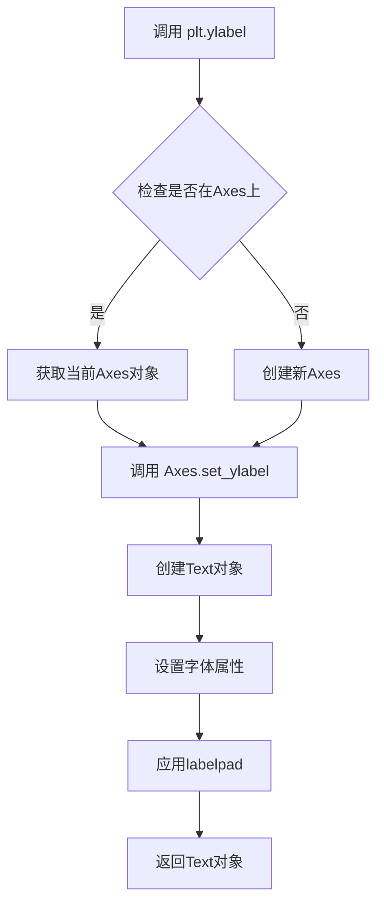

#### 带注释源码

```python
def ylabel(label, fontdict=None, labelpad=None, **kwargs):
    """
    Set the label for the y-axis.
    
    Parameters
    ----------
    label : str
        The label text.
    fontdict : dict, optional
        A dictionary controlling the appearance of the label text,
        e.g., {'fontsize': 12, 'color': 'red'}.
    labelpad : float, default: rcParams["axes.labelpad"]
        Spacing in points between the label and the y-axis.
    **kwargs
        Text properties that control the appearance of the label.
    
    Returns
    -------
    Text
        The resulting Text instance.
    """
    # 获取当前Axes对象（gca = get current axes）
    ax = gca()
    # 调用Axes对象的set_ylabel方法设置Y轴标签
    return ax.set_ylabel(label, fontdict=fontdict, labelpad=labelpad, **kwargs)
```

#### 使用示例

在提供的代码中，`plt.ylabel` 的调用方式如下：

```python
plt.ylabel(f"Loss in ${value_increment}'s")
```

此调用将Y轴标签设置为 "Loss in $1000's"，用于表示图表中数值代表的是以千为单位的损失金额。

---

### 关键组件信息

| 组件名称 | 一句话描述 |
|---------|-----------|
| `plt.ylabel()` | Matplotlib的Y轴标签设置函数 |
| `Text对象` | 返回的文本实例，可用于进一步自定义样式 |
| `fontdict` | 字体属性字典，控制标签外观 |
| `labelpad` | 标签与坐标轴之间的间距参数 |

### 潜在技术债务与优化空间

1. **硬编码标签内容**：代码中直接使用 `f"Loss in ${value_increment}'s"` 字符串，可考虑提取为配置常量
2. **缺乏国际化支持**：标签文本为英文，如需支持多语言需要额外处理
3. **返回值未使用**：函数返回的Text对象未被捕获和使用，可考虑保存以实现动态更新

### 错误处理与异常设计

- 如果当前没有活动的Figure或Axes，`plt.ylabel`会自动创建默认的Axes
- 传入非字符串类型的`label`参数会抛出`TypeError`
- `labelpad`如果传入非数值类型会抛出`TypeError`


### `plt.yticks`

设置Y轴刻度线和刻度标签。

参数：

- `ticks`：`array-like`，Y轴刻度的位置数组，指定刻度线在Y轴上的位置
- `labels`：`array-like`，可选参数，用于设置每个刻度位置对应的标签文本

返回值：`tuple` (Tick数组, Text数组)，返回Y轴的刻度线和刻度标签对象元组

#### 流程图

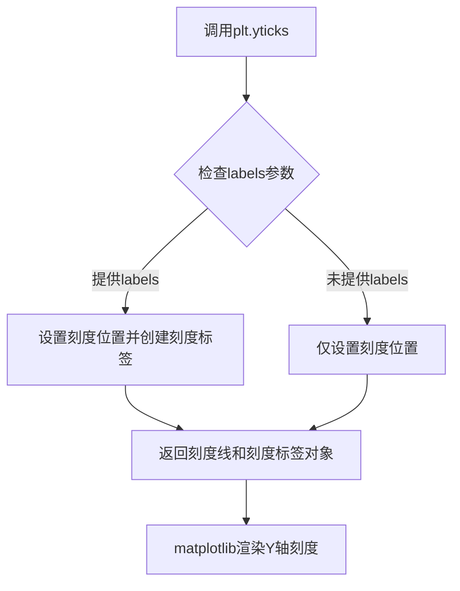

#### 带注释源码

```python
# matplotlib.pyplot.yticks 函数源码（简化版）
def yticks(ticks=None, labels=None, *, minor=False):
    """
    设置或获取Y轴的刻度位置和刻度标签。
    
    参数:
        ticks: array-like
            Y轴刻度的位置数组。例如 [0, 500, 1000, 1500, 2000]
        labels: array-like, optional
            与ticks对应的标签数组。例如 ['0', '500', '1000', '1500', '2000']
        minor: bool, optional
            是否设置次要刻度（minor ticks），默认为False
    
    返回值:
        tuple: (locs, labels) 元组，包含刻度位置和刻度标签对象
    """
    ax = gca()  # 获取当前坐标轴
    if labels is None:
        # 如果没有提供标签，只设置刻度位置
        locs = ax.set_yticks(ticks)
        return locs
    else:
        # 同时设置刻度位置和标签
        locs = ax.set_yticks(ticks)
        labels = ax.set_yticklabels(labels)
        return locs, labels
```

---

## 完整代码设计文档

### 一、代码核心功能概述

该代码是一个matplotlib表格演示程序，通过创建一个堆叠条形图展示不同灾难（Freeze、Wind、Flood、Quake、Hail）在不同年份（100年、50年、20年、10年、5年）下的损失数据，并在图表底部添加数据表格，同时设置了Y轴刻度以千为单位显示损失金额。

---

### 二、文件整体运行流程

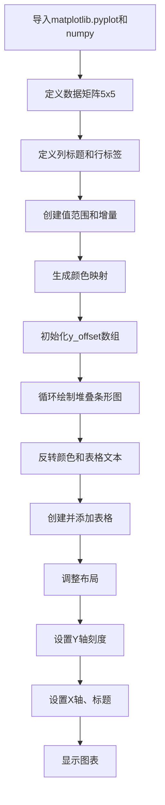

---

### 三、关键组件信息

| 组件名称 | 类型 | 描述 |
|---------|------|------|
| `data` | 列表 | 5x5二维列表，存储各灾难各年份的损失数据 |
| `columns` | 元组 | 列标题，表示灾难类型 |
| `rows` | 列表 | 行标签，表示年份 |
| `values` | numpy数组 | Y轴刻度位置数组 (0, 500, 1000, 1500, 2000) |
| `colors` | 数组 | 使用BuPu颜色映射生成的5种颜色 |
| `y_offset` | numpy数组 | 用于堆叠条形图的垂直偏移量 |
| `cell_text` | 列表 | 表格单元格文本，二维列表存储格式化后的数值 |
| `the_table` | Table对象 | matplotlib表格对象 |

---

### 四、全局变量和函数详细信息

#### 全局变量

| 变量名 | 类型 | 描述 |
|-------|------|------|
| `data` | list[list[int]] | 灾难损失数据矩阵 |
| `columns` | tuple[str] | 表格列标题 |
| `rows` | list[str] | 表格行标签 |
| `values` | numpy.ndarray | Y轴刻度值数组 |
| `value_increment` | int | 金额增量（1000） |
| `colors` | numpy.ndarray | 颜色数组 |
| `n_rows` | int | 数据行数 |
| `index` | numpy.ndarray | 条形图X轴位置 |
| `bar_width` | float | 条形宽度 |
| `y_offset` | numpy.ndarray | 堆叠条形图偏移量 |
| `cell_text` | list[list[str]] | 表格文本内容 |

#### 全局函数

| 函数名 | 描述 |
|-------|------|
| `plt.bar()` | 绘制条形图 |
| `plt.table()` | 创建表格 |
| `plt.subplots_adjust()` | 调整子图布局 |
| `plt.yticks()` | 设置Y轴刻度和标签 |
| `plt.xticks()` | 设置X轴刻度 |
| `plt.ylabel()` | 设置Y轴标签 |
| `plt.title()` | 设置图表标题 |

---

### 五、plt.yticks 使用详解

在代码中的具体使用：

```python
plt.yticks(values * value_increment, ['%d' % val for val in values])
```

- **ticks参数**: `values * value_increment` = [0, 500000, 1000000, 1500000, 2000000]
- **labels参数**: ['0', '500', '1000', '1500', '2000']

这表示Y轴刻度位置实际值是0到200万，但显示标签只显示0到2000（单位为千）。

---

### 六、潜在的技术债务或优化空间

1. **硬编码值**：颜色映射"BuPy"、条形宽度0.4、偏移量0.3等都是硬编码，应该提取为常量或配置
2. **魔法数字**：如`0.3`、`0.5`等偏移量缺乏明确语义
3. **缺乏错误处理**：数据验证、类型检查不足
4. **国际化**：字符串格式化使用f-string和%格式化混用，应统一
5. **可复用性低**：代码与具体数据强耦合，难以适配其他数据集

---

### 七、其它项目

#### 设计目标与约束
- 目标：展示matplotlib表格与图表结合的能力
- 约束：使用matplotlib原生table功能，不依赖第三方表格库

#### 错误处理与异常设计
- 缺少数据验证（如data行列数一致性检查）
- 缺少numpy导入失败的降级处理

#### 数据流与状态机
- 数据流：静态数据 → numpy数组处理 → matplotlib渲染 → 图表显示
- 状态机：初始化 → 绑图绘制 → 表格创建 → 布局调整 → 显示

#### 外部依赖与接口契约
- 依赖：matplotlib、numpy
- 接口：matplotlib pyplot API


### `plt.xticks`

设置X轴刻度位置和刻度标签的函数。

参数：

- `ticks`：`array-like`，刻度位置列表，定义刻度在X轴上的位置
- `labels`：`array-like`，可选参数，刻度标签列表，用于显示在每个刻度位置的文本标签

返回值：`无返回值`，该函数直接修改当前 Axes 的 X 轴刻度

#### 流程图

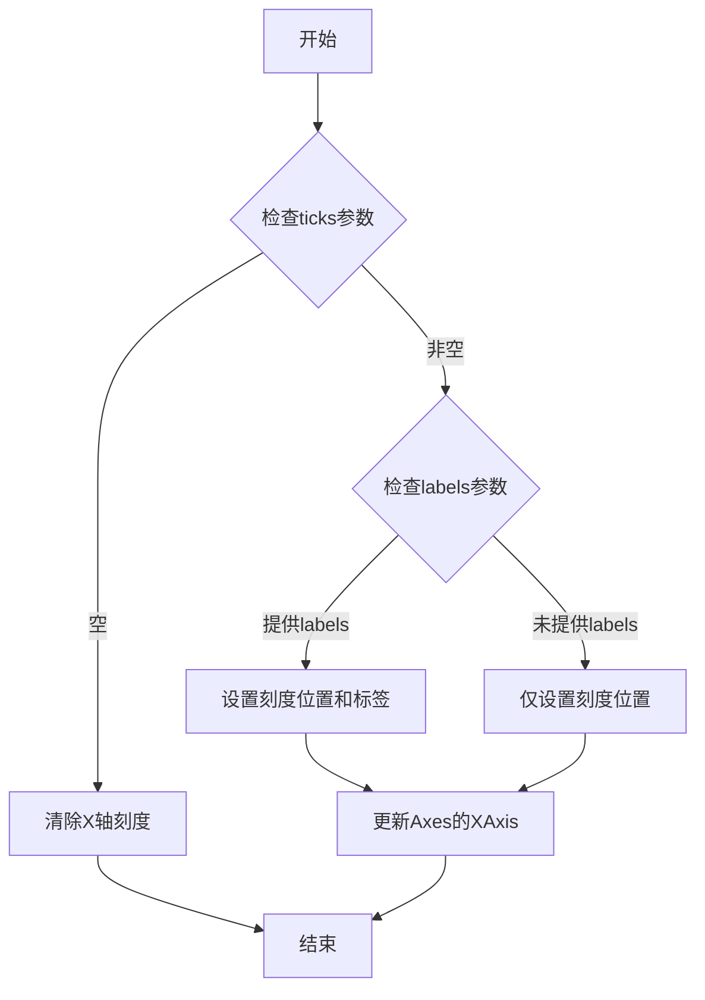

#### 带注释源码

```python
def xticks(ticks, labels=None):
    """
    设置当前Axes的X轴刻度位置和刻度标签。
    
    参数:
        ticks: array-like
            刻度位置列表，指定刻度在X轴上的位置。
            如果为空列表，则清除所有刻度。
            
        labels: array-like, 可选
            刻度标签列表，用于显示在每个刻度位置的文本。
            如果未提供，则只设置刻度位置，不显示标签。
            
    返回值:
        无返回值
        
    示例:
        # 只设置刻度位置
        plt.xticks([0, 1, 2, 3])
        
        # 设置刻度位置和标签
        plt.xticks([0, 1, 2, 3], ['Zero', 'One', 'Two', 'Three'])
        
        # 清除刻度
        plt.xticks([])
    """
    ax = plt.gca()  # 获取当前Axes对象
    ax.set_xticks(ticks)  # 设置刻度位置
    if labels is not None:
        ax.set_xticklabels(labels)  # 设置刻度标签
```

#### 在示例代码中的使用

```python
# 代码中第45行使用示例
plt.xticks([])
```

在给定的演示代码中，`plt.xticks([])` 被调用以清除X轴的刻度，因为该表格演示主要展示表格内容而不需要X轴的数值刻度。


### `plt.title`

`plt.title` 是 matplotlib 库中的函数，用于设置当前 Axes 或 Figure 的标题。该函数允许用户自定义标题文本、字体样式、对齐方式以及位置等属性，并返回一个 `Text` 对象以便后续进行细粒度控制。

参数：

- `label`：`str`，标题文本内容
- `fontdict`：`dict`，可选，标题的字体属性字典（如 fontsize、fontweight 等）
- `loc`：`{'center', 'left', 'right'}`，可选，标题的水平对齐方式，默认为 'center'
- `pad`：`float`，可选，标题与 Axes 顶部的间距（以点为单位）
- `y`：`float`，可选，标题的 y 轴位置（相对于 Axes 高度的比例）
- `**kwargs`：其他关键字参数，传递给底层 `matplotlib.text.Text` 对象的属性

返回值：`matplotlib.text.Text`，返回创建的标题 Text 对象，可用于后续自定义修改

#### 流程图

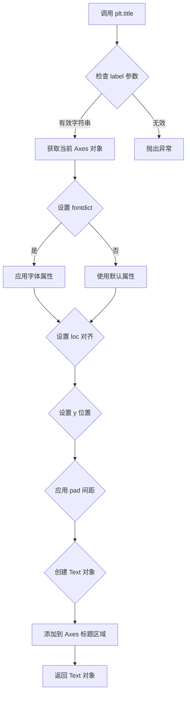

#### 带注释源码

```python
def title(label, fontdict=None, loc=None, pad=None, *, y=None, **kwargs):
    """
    设置当前 Axes 的标题。
    
    参数:
        label (str): 标题文本内容
        fontdict (dict, optional): 字体属性字典，可包含 fontsize、fontweight、color 等
        loc (str, optional): 对齐方式，可选 'center', 'left', 'right'
        pad (float, optional): 标题与 Axes 顶部的间距（点）
        y (float, optional): 标题的 y 轴相对位置
        **kwargs: 其他传递给 Text 的参数
    
    返回:
        matplotlib.text.Text: 标题的 Text 对象
    """
    # 获取当前的 Axes 对象
    ax = gca()
    
    # 创建标题文本对象，传入所有参数
    # title 属性内部会处理对齐、位置等逻辑
    return ax.set_title(label, fontdict=fontdict, loc=loc, pad=pad, y=y, **kwargs)
```

#### 在示例代码中的使用

```python
# 设置图表标题为 'Loss by Disaster'
plt.title('Loss by Disaster')
```

在示例代码中，`plt.title` 被调用时仅使用了必需的 `label` 参数，将图表标题设置为 "Loss by Disaster"。函数会使用默认的字体属性（通常为 bold，字号约 12-14pt）、居中对齐方式以及默认的 y 轴位置。调用后返回一个 `matplotlib.text.Text` 对象，但在本示例中该返回值未被捕获和使用。


### `plt.show()`

`plt.show()` 是 Matplotlib 库中的核心函数，用于显示当前所有打开的图形窗口并进入事件循环。该函数会阻塞程序执行（除非设置 `block=False`），直到用户关闭所有显示的图形窗口为止。

参数：

- `block`：`bool`，可选参数，默认值为 `True`。当设置为 `True` 时，函数会阻塞主线程直到所有图形窗口关闭；当设置为 `False` 时，函数会立即返回，图形窗口会异步显示。

返回值：`None`，该函数无返回值，仅用于显示图形。

#### 流程图

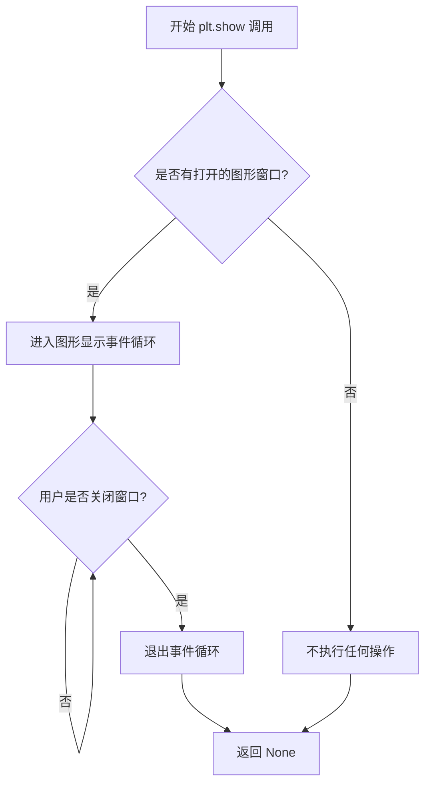

#### 带注释源码

```python
def show(*, block=None):
    """
    显示所有打开的图形窗口。
    
    该函数会启动图形的后端事件循环，并阻塞程序执行，
    直到用户关闭所有图形窗口为止。
    
    参数:
        block: bool, optional
            如果为True（默认值），则阻塞程序直到所有窗口关闭。
            如果为False，则立即返回，窗口会异步显示。
    
    返回值:
        None
    
    示例:
        >>> import matplotlib.pyplot as plt
        >>> plt.plot([1, 2, 3], [4, 5, 6])
        >>> plt.show()  # 显示图形并阻塞
    """
    # 获取当前图形的后端管理器
    global _showregistry
    # 遍历所有打开的图形并显示它们
    for manager in Gcf.get_all_fig_managers():
        # 调用后端的show方法显示每个图形窗口
        # 如果block为True，则阻塞等待用户交互
        # 如果block为False，则立即返回
        manager.show()
    
    # 如果block不为False，则进入阻塞等待状态
    # 等待用户关闭所有图形窗口
    if block:
        # 启动GUI事件循环
        # 这会阻塞主线程直到窗口关闭
        _blocking_show()
    
    return None
```

#### 备注

在实际代码中，`plt.show()` 的具体行为取决于所使用的后端（如 Qt、Tkinter、MacOSX 等）。不同的后端会实现不同的图形显示逻辑，但对外提供的接口是一致的。该函数是 Matplotlib 交互式显示图形的标准方式，在脚本中通常作为最后一步调用。


## 关键组件


### 数据数组 (data)

存储灾难损失数据的二维列表，包含5行5列的数值

### 行列标签 (columns, rows)

columns定义表格列标题（Freeze, Wind, Flood, Quake, Hail），rows定义行标签（5年、10年、20年、50年、100年）

### 颜色映射 (colors)

使用matplotlib的BuPu颜色映射生成用于区分不同年份的渐变色彩

### 堆叠柱状图逻辑 (y_offset, cell_text)

y_offset用于追踪堆叠柱状图的累积高度，cell_text用于存储格式化后的表格单元格文本数据

### 表格组件 (the_table)

使用plt.table()创建的表格对象，包含单元格文本、行标签、列标签和颜色配置

### 图表布局配置

使用subplots_adjust调整图表边距，为底部表格留出空间

### 坐标轴配置 (plt.ylabel, plt.yticks, plt.xticks)

设置Y轴标签、刻度值和隐藏X轴刻度，标题为'Loss by Disaster'


## 问题及建议


### 已知问题

-   **魔法数字与硬编码值**：代码中存在多处硬编码数值（如`0.3`、`0.5`、`0.2`、`1000`），缺乏对这些常数含义的解释，影响可维护性
-   **全局变量无封装**：所有变量以全局方式定义，未使用函数或类进行封装，导致命名空间污染和复用困难
-   **使用弃用的PyPlot接口**：直接使用`plt.bar()`、`plt.table()`等全局API，而非面向对象的`Axes`接口（推荐做法），不符合现代Matplotlib最佳实践
-   **字符串格式化方式陈旧**：使用`'%1.1f' % (x / 1000.0)`和`'%d year' % x`等旧式格式化，应改用f-string提升可读性
-   **缺乏输入验证与错误处理**：对传入的`data`、`columns`、`rows`等数据没有进行维度检查或类型验证，可能导致运行时错误
-   **代码重复与逻辑冗余**：colors和cell_text的反转操作可以更优雅地实现，当前实现可读性较低
-   **资源管理不明确**：未显式创建`Figure`对象并管理其生命周期

### 优化建议

-   **封装为可配置函数**：将代码重构为接受参数（数据、标签、样式配置）的函数，增强复用性
-   **采用面向对象API**：使用`fig, ax = plt.subplots()`获取Figure和Axes对象，调用`ax.bar()`和`ax.table()`替代全局函数
-   **消除魔法数字**：定义具名常量或配置字典，如`BAR_WIDTH = 0.4`、`INDEX_OFFSET = 0.3`
-   **升级字符串格式化**：统一使用f-string，如`f'{x/1000:.1f}'`、`f'{x} year'`
-   **添加数据验证**：在函数入口处校验data维度与columns/rows长度一致性
-   **简化反转逻辑**：使用`reversed()`迭代器或直接在循环中反向遍历，避免显式reverse操作
-   **添加类型提示**：为函数参数和返回值添加类型注解，提升代码可读性和IDE支持
-   **考虑使用Pandas**：若数据来源于表格数据，可考虑使用Pandas DataFrame作为输入，简化数据处理


## 其它


### 设计目标与约束

本代码旨在演示如何在matplotlib图表中集成和显示数据表格，主要目标是可视化展示不同灾害类型（Freeze、Wind、Flood、Quake、Hail）在不同年份（5年、10年、20年、50年、100年）下的损失数据。设计约束包括：依赖matplotlib和numpy两个外部库；图表布局需要预留足够空间给表格；颜色映射使用BuPu配色方案；数据值以千为单位显示。

### 错误处理与异常设计

代码采用扁平化脚本结构，未实现显式的错误处理机制。潜在异常场景包括：numpy数组操作可能引发维度不匹配错误；matplotlib图表渲染可能因后端不可用失败；数据行列数不一致可能导致表格显示错位。当前通过Python原生异常传播机制处理错误，建议在生产环境中增加数据验证逻辑。

### 外部依赖与接口契约

主要依赖包括：matplotlib.pyplot提供图表绘制和表格创建接口；numpy提供数值计算和数组操作功能。核心接口为plt.table()函数，其cellText参数接收二维列表，rowLabels和colLabels分别接收行列标签，loc参数控制表格位置。plt.subplots_adjust()用于调整图表布局参数。

### 配置与参数说明

关键配置参数包括：value_increment=1000定义数值的千位换算单位；bar_width=0.4设置条形宽度；index数组偏移量0.3用于条形定位；colors使用BuPu映射的0-0.5透明度区间。这些参数可通过修改实现不同视觉效果和数据展示需求。

### 使用示例与测试点

代码直接生成并展示图表，无需额外调用。测试要点包括：验证表格正确显示5行6列数据（含表头）；确认条形图堆叠顺序与数据对应；检查颜色渐变效果；验证数值格式化（保留一位小数）正确性。

### 性能考虑

当前实现为一次性脚本，无性能瓶颈。对于大规模数据场景，可考虑：使用numpy向量化操作替代列表推导；表格数据预处理缓存；延迟渲染策略。现有代码在常规数据量下运行效率良好。

### 可扩展性与维护性

代码以脚本形式组织，维护性较低。扩展方向包括：封装为函数接受数据参数；创建配置类管理可视化参数；增加多种表格样式支持；添加动画或交互功能。当前架构适合快速原型演示，生产环境使用建议重构为模块化设计。

    