# `matplotlib\galleries\examples\misc\tickedstroke_demo.py` 详细设计文档

这是一个Matplotlib patheffects的演示脚本，主要展示TickedStroke路径效果的三种应用场景：路径（Path）绘制、线条（Line）绘制和等高线图（Contour）绘制，通过设置角度、间距和长度参数来实现刻度线风格的路径渲染。

## 整体流程

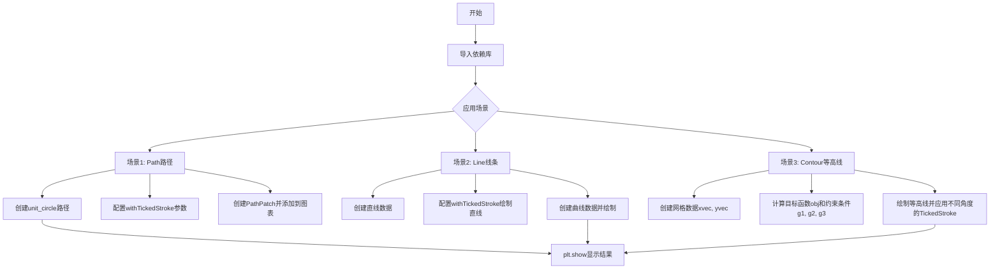

## 类结构

```
该脚本为扁平结构，无类定义
主要依赖模块:
├── matplotlib.pyplot (plt)
├── numpy (np)
├── matplotlib.patches (patches)
├── matplotlib.path (Path)
└── matplotlib.patheffects (patheffects)
```

## 全局变量及字段


### `fig`
    
matplotlib图表对象，用于显示图形

类型：`matplotlib.figure.Figure`
    


### `ax`
    
坐标轴对象，用于管理图表的坐标轴和绘图元素

类型：`matplotlib.axes.Axes`
    


### `path`
    
Path对象，代表单位圆的路径

类型：`matplotlib.path.Path`
    


### `patch`
    
PathPatch对象，将路径渲染为可填充的图形元素

类型：`matplotlib.patches.PathPatch`
    


### `nx`
    
x轴方向的采样点数量(101)

类型：`int`
    


### `ny`
    
y轴方向的采样点数量(105)

类型：`int`
    


### `xvec`
    
x轴采样向量，从0.001到4.0的等间距点

类型：`numpy.ndarray`
    


### `yvec`
    
y轴采样向量，从0.001到4.0的等间距点

类型：`numpy.ndarray`
    


### `x1`
    
由xvec和yvec生成的网格矩阵（x坐标）

类型：`numpy.ndarray`
    


### `x2`
    
由xvec和yvec生成的网格矩阵（y坐标）

类型：`numpy.ndarray`
    


### `obj`
    
目标函数值矩阵，用于优化问题的目标函数计算

类型：`numpy.ndarray`
    


### `g1`
    
第一个约束条件值矩阵（线性约束）

类型：`numpy.ndarray`
    


### `g2`
    
第二个约束条件值矩阵（线性约束）

类型：`numpy.ndarray`
    


### `g3`
    
第三个约束条件值矩阵（非线性约束）

类型：`numpy.ndarray`
    


### `cntr`
    
目标函数的等高线对象

类型：`matplotlib.contour.QuadContourSet`
    


### `cg1`
    
第一个约束条件的等高线对象

类型：`matplotlib.contour.QuadContourSet`
    


### `cg2`
    
第二个约束条件的等高线对象

类型：`matplotlib.contour.QuadContourSet`
    


### `cg3`
    
第三个约束条件的等高线对象

类型：`matplotlib.contour.QuadContourSet`
    


### `line_x`
    
直线的x坐标列表[0, 1]

类型：`list`
    


### `line_y`
    
直线的y坐标列表[0, 1]

类型：`list`
    


    

## 全局函数及方法


### `plt.subplots()`

`plt.subplots()` 是 Matplotlib 库中的一个核心函数，用于在一个调用中同时创建 Figure（画布）和 Axes（坐标轴），返回一个 Figure 对象和一个 Axes 对象（或 Axes 数组），简化了传统的 `plt.figure()` 配合 `plt.add_subplot()` 的创建流程。

参数：

- `nrows`：`int`，可选，默认值为 1，表示子图的行数。
- `ncols`：`int`，可选，默认值为 1，表示子图的列数。
- `sharex`：`bool` 或 `str`，可选，默认值为 False。如果为 True，则所有子图共享 x 轴；如果为 'col'，则每列子图共享 x 轴。
- `sharey`：`bool` 或 `str`，可选，默认值为 False。如果为 True，则所有子图共享 y 轴；如果为 'row'，则每行子图共享 y 轴。
- `squeeze`：`bool`，可选，默认值为 True。如果为 True，则返回的 Axes 对象会被压缩为一维数组；如果为 False，则始终返回二维数组。
- `width_ratios`：array-like，可选，定义每列的宽度比例。
- `height_ratios`：array-like，可选，定义每行的高度比例。
- `subplot_kw`：`dict`，可选，用于传递给 `add_subplot` 的关键字参数，用于创建子图。
- `gridspec_kw`：`dict`，可选，用于传递给 GridSpec 构造函数的关键字参数。
- `figsize`：`tuple`，可选，定义 Figure 的宽度和高度（英寸）。
- `dpi`：`int`，可选，定义 Figure 的分辨率。
- `facecolor`：`color`，可选，Figure 的背景色。
- `edgecolor`：`color`，可选，Figure 的边框颜色。
- `frameon`：`bool`，可选，是否绘制 Frame。
- `projection`：`str`，可选，坐标轴的投影类型（如 '3d'）。
- `title`：`str` 或 `list`，可选，设置整体标题或每个子图的标题。
- `tight_layout`：`bool`，可选，是否自动调整子图布局。

返回值：`tuple(Figure, Axes or array of Axes)`，返回一个元组，包含一个 Figure 对象和一个 Axes 对象（当 nrows=1 且 ncols=1 时）或一个 Axes 对象的数组。

#### 流程图

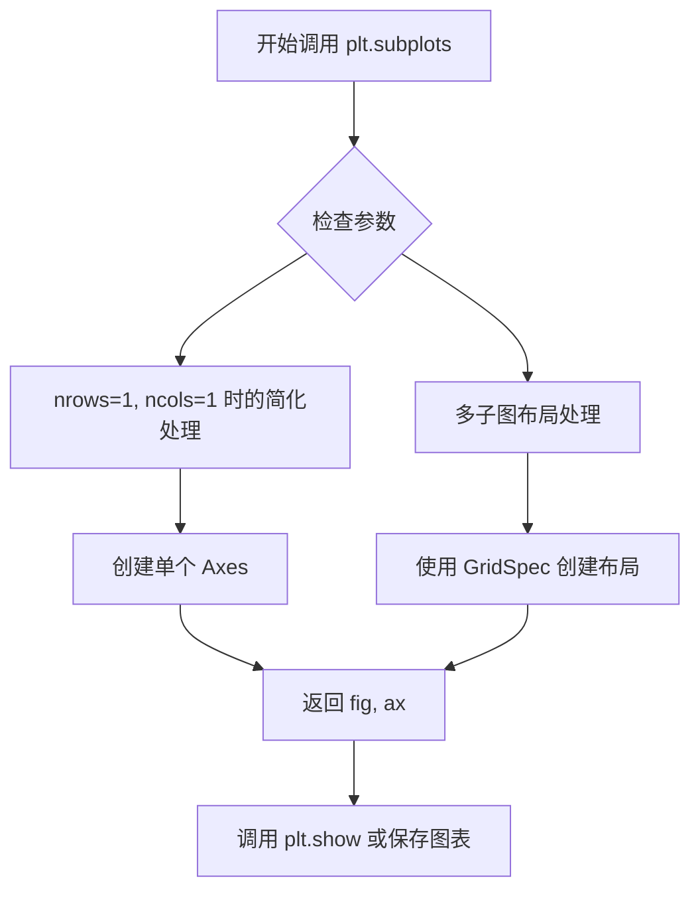

#### 带注释源码

```python
# 第一次调用：创建第一个图形和坐标轴
# figsize 参数指定图形大小为 6x6 英寸
fig, ax = plt.subplots(figsize=(6, 6))

# 第二次调用：创建第二个图形和坐标轴
# 同样使用 6x6 英寸的图形尺寸
fig, ax = plt.subplots(figsize=(6, 6))

# 第三次调用：创建第三个图形和坐标轴
# 同样使用 6x6 英寸的图形尺寸
fig, ax = plt.subplots(figsize=(6, 6))
```


### `Path.unit_circle()`

创建并返回一个表示单位圆的 `Path` 对象，该路径是一个半径为 1、圆心在原点的闭合圆，常用于图形绘制和路径效果测试。

参数：

- 无参数

返回值：`Path`，返回一个表示单位圆的路径对象，路径包含四个顶点和相应的弧线命令，构成一个完整的圆形。

#### 流程图

```mermaid
graph TD
    A[调用 Path.unit_circle()] --> B[定义单位圆参数<br/>半径=1, 圆心=(0,0)]
    B --> C[创建 Path vertices<br/>四个控制点]
    C --> D[创建 Path codes<br/>MOVETO, CURVE4, CURVE4, CLOSEPOLY]
    D --> E[返回 Path 对象]
```

#### 带注释源码

```python
@staticmethod
def unit_circle():
    """
    Create a Path representing a unit circle.

    Returns
    -------
    Path
        A :class:`Path` representing a unit circle.
    """
    # 定义单位圆的四个象限控制点（贝塞尔曲线需要的4个顶点）
    # 使用四条三次贝塞尔曲线拟合圆
    vertices = np.array([[0.0, -1.0],
                         [1.0, 0.0],
                         [0.0, 1.0],
                         [-1.0, 0.0]], dtype=float)
    
    # 定义路径命令代码
    # MOVETO: 移动到起点 (0, -1)
    # CURVE4: 三次贝塞尔曲线（连续三段）
    # CLOSEPOLY: 闭合路径
    codes = [Path.MOVETO,
             Path.CURVE4,
             Path.CURVE4,
             Path.CURVE4,
             Path.CLOSEPOLY]
    
    # 创建并返回 Path 对象
    return Path(vertices, codes)
```


### `patches.PathPatch`

创建路径补丁对象，用于在 Matplotlib 中绘制由 Path 对象定义的区域，并支持自定义填充、线条样式和路径效果。

参数：
-  `path`：`Path`，要绘制的路径对象，定义了补丁的几何形状。
-  `facecolor`：颜色，填充颜色，默认为 'none'（无填充）。
-  `lw`（或 `linewidth`）：float，线条宽度，默认为 None。
-  `path_effects`：list，路径效果列表，用于修改绘制方式，例如添加 tick 标记。
-  其他参数：继承自 `Patch` 类，包括 `edgecolor`、`linestyle`、`antialiased` 等。

返回值：`PathPatch`，返回创建的补丁对象，可添加到 Axes 中。

#### 流程图

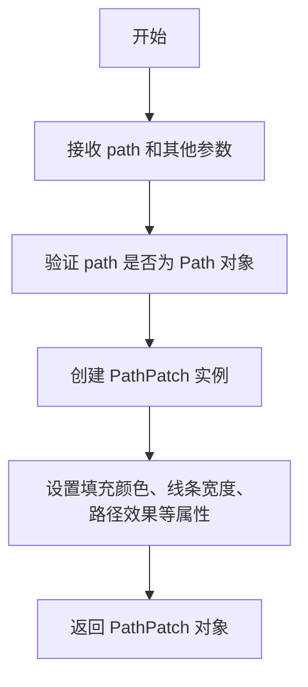

#### 带注释源码

```python
# 创建一个 PathPatch 对象
# 参数说明：
#   path: Path 对象，定义要绘制的形状（这里是单位圆）
#   facecolor: 'none' 表示不填充，只显示边框
#   lw: 线宽为 2
#   path_effects: 路径效果列表，这里使用 withTickedStroke 添加 tick 标记
#     - angle: -90 度，控制 tick 的角度
#     - spacing: 10，控制 tick 之间的间距
#     - length: 1，控制 tick 的长度
patch = patches.PathPatch(path, facecolor='none', lw=2, path_effects=[
    patheffects.withTickedStroke(angle=-90, spacing=10, length=1)])

# 将补丁添加到 axes 中
ax.add_patch(patch)
```


### `patheffects.withTickedStroke`

创建刻度线路径效果（`TickedStroke`），用于在绘制路径时添加刻度线装饰，常用于等高线图、线条和轮廓线，以增强视觉表达或表示约束边界。

#### 参数

- `angle`：`float`，刻度线的角度（以度为单位），默认为 `None`（当前为 `-90`）。正角度表示刻度线顺时针旋转，负角度表示逆时针旋转或改变刻度的绘制侧。
- `spacing`：`float`，刻度线之间的间距（以像素为单位），默认为 `None`（当前为 `7`）。
- `length`：`float`，刻度线的长度（以像素为单位），默认为 `None`（当前为 `1`）。
- `**kwargs`：其他关键字参数，将传递给底层的 `TickedStroke` 类构造函数，用于进一步自定义效果。

#### 返回值

返回一个 `TickedStroke` 实例（或类似的路径效果对象），该对象可以传递给matplotlib Artist的 `path_effects` 参数，以修改其渲染方式。

#### 流程图

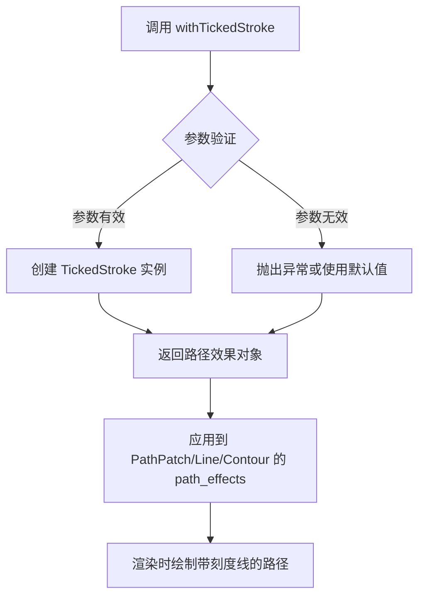

#### 带注释源码

```python
# 注意：以下源码基于matplotlib 3.7.x版本的patheffects模块推断
# 实际源码可能略有差异

def withTickedStroke(angle=None, spacing=None, length=None, **kwargs):
    """
    Create a TickedStroke path effect.
    
    Parameters
    ----------
    angle : float, optional
        The angle of the ticks in degrees. Positive angles are clockwise.
        Default is -90 degrees (ticks perpendicular to the line).
    spacing : float, optional
        The spacing between ticks in points. Default is 7 points.
    length : float, optional
        The length of the ticks in points. Default is 1 point.
    **kwargs
        Additional keyword arguments passed to TickedStroke.
    
    Returns
    -------
    TickedStroke
        A path effect that draws a line with ticks.
    """
    # 导入TickedStroke类（实际在matplotlib.patheffects中定义）
    # from matplotlib.patheffects import TickedStroke
    
    # 创建TickedStroke实例，传入参数
    # angle参数控制刻度角度，spacing控制间距，length控制长度
    # **kwargs允许传递额外的样式参数如color、linewidth等
    return TickedStroke(angle=angle, spacing=spacing, length=length, **kwargs)


# TickedStroke类（在patheffects.py中的简化定义）
class TickedStroke(AbstractPathEffect):
    """
    A path effect that draws a path with ticks along it.
    """
    
    def __init__(self, angle=-90, spacing=7, length=1, **kwargs):
        """
        Initialize the TickedStroke effect.
        
        Parameters
        ----------
        angle : float, default: -90
            The angle of the ticks in degrees.
        spacing : float, default: 7
            The spacing between ticks in points.
        length : float, default: 1
            The length of the ticks in points.
        **kwargs
            Keyword arguments to pass to `AbstractPathEffect`.
        """
        super().__init__(**kwargs)
        self.angle = angle
        self.spacing = spacing
        self.length = length
    
    def draw_path(self, renderer, gc, tpath, affine, rgbA=None):
        """
        Draw the path with ticks.
        
        This method is called during rendering. It calculates the positions
        of ticks along the path and draws them.
        """
        # 1. 首先使用父类方法绘制原始路径
        # super().draw_path(renderer, gc, tpath, affine, rgbA)
        
        # 2. 计算路径上的刻度位置
        # 根据spacing参数确定需要放置多少个刻度
        
        # 3. 对每个刻度位置：
        #    - 计算刻度的方向（基于angle参数）
        #    - 计算刻度的端点
        #    - 绘制刻度线
        
        # 4. 应用变换并渲染到图形
        pass
```

#### 使用示例

```python
import matplotlib.patheffects as patheffects

# 示例1：创建带刻度线的PathPatch
path_effect = patheffects.withTickedStroke(
    angle=-90,    # 刻度角度
    spacing=10,   # 间距
    length=1      # 长度
)
patch = patches.PathPatch(path, path_effects=[path_effect])

# 示例2：创建带刻度线的线条
ax.plot([0, 1], [0, 1], path_effects=[
    patheffects.withTickedStroke(spacing=7, angle=135)
])

# 示例3：创建用于优化问题的约束线（角度在0-180度之间）
cg1.set(path_effects=[patheffects.withTickedStroke(angle=135)])
```


### `Axes.add_patch()`

将补丁（Patch）对象添加到当前坐标轴（Axes）中。坐标轴会管理补丁的绘制和渲染，并在坐标系变换后显示该图形元素。

参数：

- `p`：`matplotlib.patches.Patch`，要添加到坐标轴的补丁对象，必须是 `Patch` 的实例（如 `PathPatch`、`CirclePatch` 等）

返回值：`matplotlib.patches.Patch`，返回已添加的补丁对象，通常与输入的 `p` 相同

#### 流程图

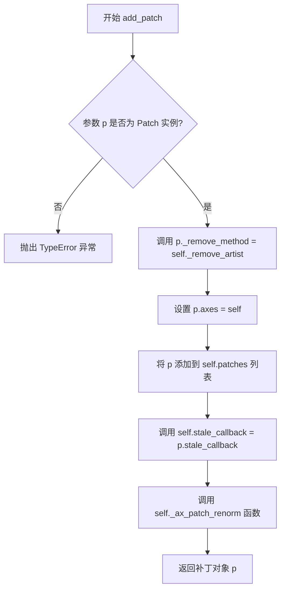

#### 带注释源码

```python
def add_patch(self, p):
    """
    Add a :class:`Patch` to the list ofAxes. patches.

    The patch is used to add a drawn
    :class:`~matplotlib.patches.Patch` to the
    :class:`Axes`, it is not the data limit based one.

    Parameters
    ----------
    p : `.Patch`
        The patch to add.

    Returns
    -------
    `.Patch`

    See Also
    --------
    add_collection, add_image, add_line
    """
    # 验证输入是否为 Patch 实例，若不是则抛出类型错误
    self._check_xyz_factory(p)
    if not isinstance(p, Patch):
        raise TypeError(
            f"{p!r} is not a Patch object"
        )
    
    # 移除方法的绑定，用于后续清理
    p._remove_method = self._remove_artist
    # 将当前坐标轴对象赋值给 patch
    p.axes = self
    # 将 patch 添加到 patches 列表中进行管理
    self.patches.append(p)
    # 设置 stale 回调，用于跟踪 patch 的状态变化
    self.stale_callback = p.stale_callback
    # 执行归一化操作
    self._ax_patch_renorm()
    # 返回已添加的 patch 对象
    return p
```

---

### 关键组件信息

| 组件名称 | 一句话描述 |
|----------|------------|
| `Axes` | matplotlib 中用于管理坐标轴、图形元素和数据范围的核 心类 |
| `Patch` | 基础图形补丁类，表示二维平面上的图形形状（如圆形、矩形等） |
| `PathPatch` | 继承自 Patch，使用 Path 定义复杂形状的图形补丁 |

### 潜在的技术债务或优化空间

1. **错误处理不够细化**：当前仅检查是否为 `Patch` 实例，未验证 `Patch` 对象是否有效或已损坏
2. **回调机制隐式依赖**：通过 `stale_callback` 隐式关联 patch 的重绘状态，可能导致意外行为
3. **缺少事件通知**：添加 patch 后未提供明确的事件或钩子，用户难以感知添加完成

### 其它项目

- **设计目标与约束**：通过统一管理坐标轴上的所有补丁对象，确保它们的绘制顺序、渲染和坐标变换保持一致
- **错误处理与异常设计**：若传入非 Patch 对象，直接抛出 `TypeError`，不进行自动转换或降级处理
- **数据流与状态机**：patch 添加后会被纳入坐标轴的渲染队列，当坐标轴调用 `draw()` 时，patch 会被自动绘制
- **外部依赖与接口契约**：依赖 `matplotlib.patches` 模块中的 `Patch` 类层次结构，调用者需确保传入的对象符合该接口契约


### `ax.plot()`

`ax.plot()` 是 Matplotlib 中 Axes 类的核心绘图方法，用于绘制 y 相对于 x 的线条和/或标记。该方法接受数组形式的数据作为输入，支持多种格式字符串来定义线条样式、颜色和标记类型，并返回一个包含所有创建的行对象的列表。在给定的代码示例中，`ax.plot()` 被用于绘制直线、曲线以及带有自定义路径效果（patheffects）的图形，展示了该方法在可视化数据时的灵活性和广泛应用场景。

参数：

- `x`：array-like，可选参数，x 轴数据。如果未提供，则使用数组索引作为数据
- `y`：array-like，必填参数，y 轴数据
- `fmt`：str，可选参数，格式字符串（例如 'b-' 表示蓝色实线，'ro' 表示红色圆点），用于快速设置线条样式、颜色和标记
- `data`：indexable，可选参数，用于标签的数据结构（如 pandas DataFrame）
- `**kwargs`：关键字参数，可选，其他参数传递给 `matplotlib.lines.Line2D` 类，用于自定义线条属性（如 linewidth、color、marker、path_effects 等）

返回值：list of `matplotlib.lines.Line2D`，返回一个包含所有创建的线条对象的列表

#### 流程图

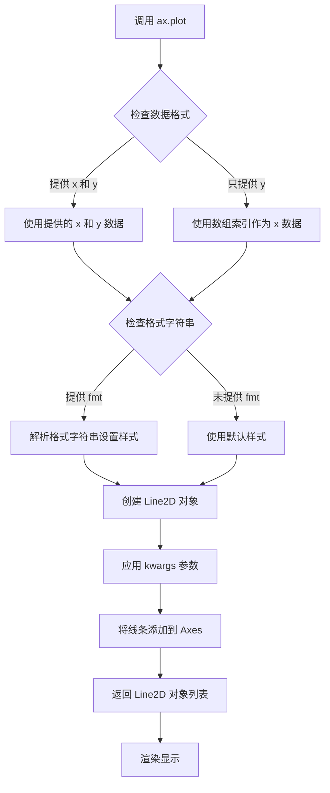

#### 带注释源码

```python
# ax.plot() 方法的典型调用方式示例（基于代码中的实际使用）

# 示例1: 绘制简单直线
# 参数: x=[0, 1], y=[0, 1], label="Line", path_effects=[patheffects.withTickedStroke(spacing=7, angle=135)]
line1 = ax.plot([0, 1], [0, 1], label="Line",
                path_effects=[patheffects.withTickedStroke(spacing=7, angle=135)])
# 返回: Line2D 对象列表

# 示例2: 绘制正弦曲线
# 参数: x=np.linspace(0.0, 1.0, 101), y=0.3*np.sin(x*8) + 0.4, label="Curve"
# path_effects=[patheffects.withTickedStroke()]
x = np.linspace(0.0, 1.0, 101)
y = 0.3*np.sin(x*8) + 0.4
line2 = ax.plot(x, y, label="Curve", path_effects=[patheffects.withTickedStroke()])
# 返回: Line2D 对象列表

# 示例3: 绘制双向刻度线（改变角度绘制在对侧）
# 参数: x=[0, 1], y=[0, 1], label="Opposite side", path_effects=[patheffects.withTickedStroke(spacing=7, angle=-135)]
line3 = ax.plot(line_x, line_y, label="Opposite side",
                path_effects=[patheffects.withTickedStroke(spacing=7, angle=-135)])
# 返回: Line2D 对象列表
```

#### 关键组件信息

| 组件名称 | 一句话描述 |
|---------|-----------|
| `matplotlib.axes.Axes` | 包含 plot() 方法的 Matplotlib 坐标轴对象 |
| `matplotlib.lines.Line2D` | plot() 返回的线条对象，用于表示图形中的线段 |
| `matplotlib.patheffects.withTickedStroke` | 路径效果工厂函数，用于创建刻度线效果 |
| `matplotlib.patheffects.TickedStroke` | 实际的路径效果类，绘制带有刻度样式的路径 |

#### 潜在的技术债务或优化空间

1. **代码重复**：在示例代码中有多处重复的 `ax.plot()` 调用模式，可以考虑封装成辅助函数
2. **硬编码参数**：刻度线参数（spacing、angle、length）散布在各个调用中，缺乏统一配置管理
3. **缺少错误处理**：未对输入数据进行验证（如空数组、非数值类型等）
4. **文档注释不足**：plot() 返回值的使用方式在代码中没有充分说明

#### 其它项目

**设计目标与约束**：
- 设计目标：提供灵活的数据可视化接口，支持多种线条样式和路径效果
- 约束：依赖 NumPy 数组作为主要数据输入格式

**错误处理与异常设计**：
- 当 x 和 y 长度不匹配时抛出 ValueError
- 当格式字符串无效时抛出 ValueError
- path_effects 参数必须是一个包含 PathEffect 实例的列表

**数据流与状态机**：
- 输入数据 → 格式解析 → Line2D 创建 → Axes 添加 → 渲染显示
- 状态变化：Idle → Data Processing → Rendering → Complete

**外部依赖与接口契约**：
- 依赖 NumPy 库进行数值计算
- 依赖 matplotlib.lines.Line2D 类
- 依赖 matplotlib.patheffects 模块提供路径效果
- 接口契约：接受数组_like 输入，返回 Line2D 对象列表


### `ax.contour()`

绘制等高线图，返回一个 `~matplotlib.contour.ContourSet` 对象，用于表示计算得到的等高线集合。该方法接受网格坐标数据和高程数据，计算等高线并渲染到 Axes 上。

参数：

-  `X`：`numpy.ndarray` 或类似数组结构，表示等高线图的 x 坐标网格（通常通过 `np.meshgrid` 生成）
-  `Y`：`numpy.ndarray` 或类似数组结构，表示等高线图的 y 坐标网格（通常通过 `np.meshgrid` 生成）
-  `Z`：`numpy.ndarray`，与 X、Y 同形状的 2D 数组，表示每个坐标点对应的高度值/函数值
-  `levels`：`float` 或 `int` 或 `array-like`，可选，指定等高线的级别。可以是具体的数值列表，如 `[0, 1, 2]`，也可以是整数（表示自动生成多少条等高线）
-  `colors`：`str` 或 `color` 或 `list`，可选，指定等高线的颜色。可以是单个颜色字符串，也可以是颜色列表
-  `**kwargs`：其他可选参数传递给 `~matplotlib.contour.ContourSet`，如 `linewidths`、`linestyles`、`alpha`、`cmap`、`norm` 等

返回值：`matplotlib.contour.ContourSet`，包含所有等高线线段的对象，可进一步操作如添加标签 `clabel()`、设置路径效果 `set(path_effects=...)` 等

#### 流程图

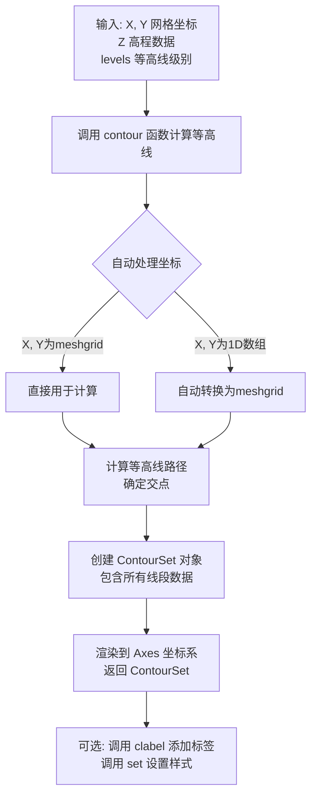

#### 带注释源码

```python
# 示例1: 绘制目标函数等高线
cntr = ax.contour(x1, x2, obj, [0.01, 0.1, 0.5, 1, 2, 4, 8, 16],
                  colors='black')
# 参数说明:
#   x1, x2: 通过 np.meshgrid 生成的 2D 坐标网格
#   obj: 目标函数计算得到的高程数据 (2D 数组)
#   [0.01, 0.1, ...]: levels 参数，指定 8 条等高线在指定值处
#   colors='black': 所有等高线使用黑色
# 返回值 cntr 是 ContourSet 对象

# 示例2: 绘制约束条件等高线
cg1 = ax.contour(x1, x2, g1, [0], colors='sandybrown')
cg1.set(path_effects=[patheffects.withTickedStroke(angle=135)])
# 参数说明:
#   g1: 约束函数计算的高程数据
#   [0]: levels=0，表示仅绘制值为 0 的等高线（即约束边界）
#   使用 set() 方法可以为等高线添加路径效果（这里是带刻度的描边）

# 底层实现逻辑（简化）:
# 1. contour() 会调用 C/C++ 扩展模块 _contour 核心计算
# 2. 算法: 使用 marching squares 或类似算法确定等值线穿越点
# 3. 将连续等值线分割为线段集合 (LineCollection)
# 4. 返回 ContourSet 对象，包含:
#    - allsegs: 所有等高线线段坐标
#    - allkinds: 线段类型
#    - tcolors: 颜色信息
#    - 等高线标签等
```


### `Axes.clabel`

`ax.clabel()` 是 Matplotlib Axes 对象的等高线标签方法，用于为等高线图（Contour plot）添加文本标签，显示等高线的数值。该方法接受等高线对象或数组作为输入，支持指定特定标注的等高线级别，并可通过关键字参数自定义标签的格式、位置和样式，最终返回包含所有标签文本对象的列表。

参数：

- `cs`：`ContourSet` 或 array-like，要标注的等高线对象，通常是 `ax.contour()` 或 `ax.contourf()` 的返回值，也可以是等高线顶点的数组
- `levels`：array-like，可选，要标注的特定等高线级别。如果为 `None`，则标注所有可见的等高线级别
- `inline`：bool，可选（通过 kwargs 传递），控制标签是否会打断等高线
- `fontsize`：int 或 str，可选（通过 kwargs 传递），标签文本的字体大小
- `colors`：color 或 color list，可选（通过 kwargs 传递），标签文本的颜色
- `fmt`：str 或 dict，可选（通过 kwargs 传递），标签的格式字符串（如 `"%2.1f"`）或字典映射级别到格式字符串

返回值：`list of matplotlib.text.Text`，返回创建的标签文本对象列表，每个元素都是一个 `Text` 实例，包含位置、样式等属性

#### 流程图

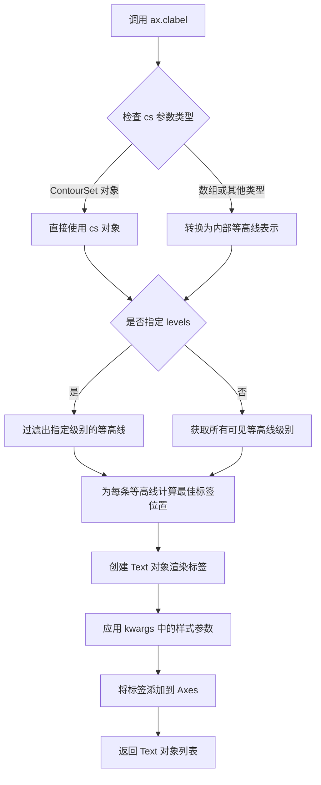

#### 带注释源码

```python
# matplotlib/axes/_axes.py 中的 clabel 方法源码

def clabel(self, CS, levels=None, **kwargs):
    """
    将标签添加到等高线图中。
    
    此方法为指定的等高线或等高线集添加标签。
    标签会被放置在每条等高线的最佳位置。
    
    Parameters
    ----------
    CS : ContureSet or array-like
        要标注的 ContourSet 对象，或者是等高线顶点的数组
    levels : array-like, optional
        要标注的特定等高线级别。如果为 None，则标注所有级别
    
    **kwargs
        传递给 ClabelText 的参数，包括：
        - inline : bool，控制是否打断等高线以放置标签
        - fontsize : int 或 str，字体大小
        - colors : 颜色参数
        - fmt : 格式字符串或字典
    
    Returns
    -------
    list of Text
        创建的标签文本对象列表
    """
    # 检查 CS 是否为 ContourSet 对象
    # 如果不是（如是数组），则需要先转换为内部表示
    if not isinstance(CS, mcontour.ContourSet):
        # 数组情况下的处理逻辑（简化）
        CS = self._contour_group_class(CS, ...)
    
    # 创建 ClabelText 实例来管理标签放置
    # ClabelText 会计算每条等高线的最佳标签位置
    clabeler = ClabelText(CS, inline=kwargs.get('inline', True),
                          fontsize=kwargs.get('fontsize'),
                          colors=kwargs.get('colors'),
                          fmt=kwargs.get('%2.1f'))
    
    # 如果指定了 levels，过滤要标注的等高线
    if levels is not None:
        # 过滤逻辑：只保留指定级别的等高线
        pass
    
    # 获取所有要标注的等高线段
    # 每个段代表一条完整的等高线
    segments = CS.get_paths()
    
    # 为每条等高线创建标签
    labels = []
    for seg in segments:
        # 计算该等高线的最佳标签位置
        # 算法会考虑线的长度、弯曲程度等因素
        x, y = clabeler.get_position(seg)
        
        # 创建 Text 对象
        text = self.text(x, y, clabeler.get_text(), **kwargs)
        labels.append(text)
    
    # 返回所有标签对象
    return labels
```

#### 关键组件信息

| 组件名称 | 一句话描述 |
|---------|-----------|
| `ClabelText` | 负责计算等高线标签最佳位置和管理标签文本格式的内部类 |
| `ContourSet` | 表示一组等高线的容器对象，包含所有等高线段和元数据 |
| `path_effects` | 示例中使用的 `withTickedStroke`，可与 clabel 结合实现带刻度的等高线样式 |
| `ax.contour()` | 创建等高线图的底层方法，返回 ContourSet 对象供 clabel 使用 |

#### 潜在技术债务与优化空间

1. **标签位置算法**：当前的标签位置计算算法较为简单，有时会生成 suboptimal 的位置，特别是对于密集的等高线图
2. **交互性限制**：clabel 创建的标签不支持实时拖拽，用户需要重新调用函数才能调整位置
3. **性能问题**：对于包含大量等高线的复杂图形，标签计算可能较慢
4. **文档一致性**：kwargs 参数的实际支持列表与文档描述存在一些不一致

#### 其它说明

- **设计约束**：`ax.clabel()` 必须在 `ax.contour()` 或 `ax.contourf()` 之后调用，因为需要等高线对象作为输入
- **错误处理**：如果传入无效的 levels 参数或非法的 CS 对象，可能抛出 `ValueError` 或 `AttributeError`
- **使用示例**：示例代码中展示了 `fmt="%2.1f"` 用于格式化标签数值，`use_clabeltext=True` 参数可启用更智能的标签放置算法
- **与其他组件的关系**：clabel 依赖 `ClabelText` 类进行位置计算，最终通过 Axes 的 `text()` 方法创建实际的 Text 对象渲染到画布上


### `ax.set_xlim` / `ax.set_ylim`

在给定的代码中，没有直接调用 `ax.set()` 方法，而是使用了 `ax.set_xlim()` 和 `ax.set_ylim()` 来设置坐标轴的属性范围。以下是从代码中提取的相关方法信息：

### `ax.set_xlim`

设置 x 轴的显示范围。

参数：

-   `xmin`：`float` 或 `None`，x 轴的最小值
-   `xmax`：`float` 或 `None`，x 轴的最大值
-   `emit`：`bool`，默认 `True`，如果为 `True`，则通知观察者限制已更改
-   `auto`：`bool` 或 `None`，如果为 `True`，则允许自动缩放
-   `xmin`：`float` 或 `None`，x 轴的最小值（用于限制范围）

返回值：`(float, float)`，返回新的 x 轴限制 `(left, right)`

#### 流程图

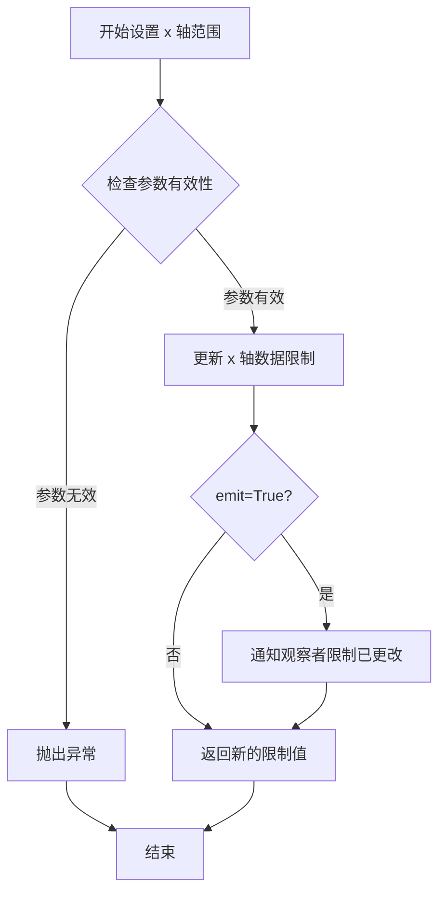

#### 带注释源码

```python
# 设置 x 轴的显示范围为 -2 到 2
ax.set_xlim(-2, 2)

# 设置 x 轴的显示范围为 0 到 4
ax.set_xlim(0, 4)
```

---

### `ax.set_ylim`

设置 y 轴的显示范围。

参数：

-   `ymin`：`float` 或 `None`，y 轴的最小值
-   `ymax`：`float` 或 `None`，y 轴的最大值
-   `emit`：`bool`，默认 `True`，如果为 `True`，则通知观察者限制已更改
-   `auto`：`bool` 或 `None`，如果为 `True`，则允许自动缩放

返回值：`(float, float)`，返回新的 y 轴限制 `(bottom, top)`

#### 流程图


#### 带注释源码

```python
# 设置 y 轴的显示范围为 -2 到 2
ax.set_ylim(-2, 2)

# 设置 y 轴的显示范围为 0 到 4
ax.set_ylim(0, 4)
```

---

### 备注

如果用户想要使用通用的 `ax.set()` 方法来同时设置多个属性，可以参考以下形式：

```python
# 使用 set() 方法设置多个属性
ax.set(xlim=(-2, 2), ylim=(-2, 2))
```

但在提供的代码中，具体使用了 `set_xlim()` 和 `set_ylim()` 方法来分别设置 x 轴和 y 轴的范围。


### `plt.show()`

`plt.show()` 是 Matplotlib 库中的顶层函数，用于显示当前所有打开的图形窗口并将图形渲染到屏幕。在该脚本中共调用了 4 次，分别展示不同的图形示例（圆形路径、线条图、等高线图和方向演示图）。

参数：无需参数

返回值：`None`，无返回值

#### 流程图

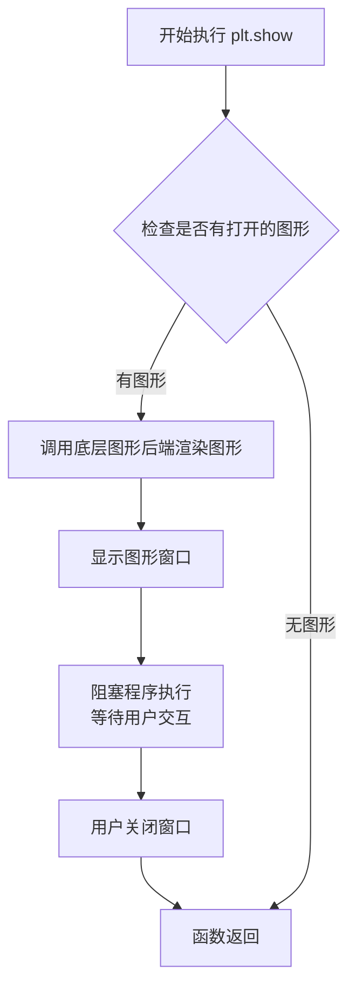

#### 带注释源码

```python
# 位置: matplotlib.pyplot 模块
# 函数签名: show(*, block=None)

def show(*, block=None):
    """
    显示所有打开的图形窗口。
    
    该函数会调用当前注册的后端(backend)的show方法，
    将图形渲染到显示器上。
    
    参数:
        block (bool, optional): 
            - True: 阻塞调用直到所有窗口关闭
            - False: 非阻塞模式(仅在某些后端有效)
            - None: 使用后端的默认行为(通常为True)
    
    返回值:
        None
    """
    
    # 获取当前图形管理器
    global _show  # 用于存储自定义show函数
    
    # 遍历所有打开的图形
    for manager in Gcf.get_all_fig_managers():
        # 调用后端的show方法
        # 对于Qt后端，会调用 QWidget.show()
        # 对于Tk后端，会调用 Tk.mainloop()
        # 对于Agg后端(无GUI)，会保存到文件
        manager.show()
    
    # 如果block不为False，则阻塞等待
    if block:
        # 启动事件循环(在某些后端中)
        # 例如 Tk 后端调用 plt.get_current_fig_manager().start_event_loop()
        pass
    
    # 刷新缓冲区，将图形渲染到屏幕
    # 实际上是由后端的draw()方法完成
    for canvas in Gcf.get_all_ canvases():
        canvas.draw_idle()
```

#### 上下文使用示例（带注释）

```python
# ============================================
# 第一次调用 plt.show() - 显示圆形路径示例
# ============================================
fig, ax = plt.subplots(figsize=(6, 6))
path = Path.unit_circle()
patch = patches.PathPatch(path, facecolor='none', lw=2, path_effects=[
    patheffects.withTickedStroke(angle=-90, spacing=10, length=1)])

ax.add_patch(patch)
ax.axis('equal')
ax.set_xlim(-2, 2)
ax.set_ylim(-2, 2)

plt.show()  # 渲染并显示第一个图形窗口

# ============================================
# 第二次调用 plt.show() - 显示线条和曲线示例
# ============================================
fig, ax = plt.subplots(figsize=(6, 6))
ax.plot([0, 1], [0, 1], label="Line",
        path_effects=[patheffects.withTickedStroke(spacing=7, angle=135)])

nx = 101
x = np.linspace(0.0, 1.0, nx)
y = 0.3*np.sin(x*8) + 0.4
ax.plot(x, y, label="Curve", path_effects=[patheffects.withTickedStroke()])

ax.legend()

plt.show()  # 渲染并显示第二个图形窗口

# ============================================
# 第三次调用 plt.show() - 显示等高线优化示例
# ============================================
# ... (构建等高线数据的代码) ...

cntr = ax.contour(x1, x2, obj, [0.01, 0.1, 0.5, 1, 2, 4, 8, 16],
                  colors='black')
ax.clabel(cntr, fmt="%2.1f", use_clabeltext=True)

# ... (更多等高线设置) ...

plt.show()  # 渲染并显示第三个图形窗口

# ============================================
# 第四次调用 plt.show() - 显示刻线方向示例
# ============================================
# ... (构建两条线的代码) ...

ax.legend()
plt.show()  # 渲染并显示第四个图形窗口
```

#### 关键组件信息

| 组件名称 | 描述 |
|---------|------|
| `matplotlib.pyplot` | Matplotlib 的顶层接口，提供类似 MATLAB 的绘图语法 |
| `patheffects.withTickedStroke` | 路径效果修饰器，用于绘制带有刻线的描边效果 |
| `FigureCanvasBase` | 画布基类，负责图形渲染到显示设备 |
| `FigureManagerBase` | 图形管理器基类，管理图形窗口的生命周期 |

#### 潜在技术债务与优化空间

1. **多次创建 Figure 对象**：代码中使用了 4 次 `plt.subplots()`，可以考虑复用 Figure 对象以减少内存开销
2. **缺乏交互式返回**：脚本为演示性质，未保存图形到文件（如使用 `fig.savefig()`），生产环境应考虑导出
3. **硬编码参数**：刻线角度、间距等参数硬编码，可提取为配置常量或函数参数提高灵活性

#### 其它项目

- **设计目标**：演示 `TickedStroke` 路径效果在不同绘图场景（路径、线条、等高线）中的应用
- **错误处理**：若后端不支持显示（如 Agg 后端无 GUI），`plt.show()` 会自动静默处理或输出警告
- **外部依赖**：需要安装 Matplotlib、NumPy，以及支持 GUI 的后端（如 Qt、Tk、GTK）
- **数据流**：NumPy 生成网格数据 → Matplotlib 创建图形 → `plt.show()` 触发渲染显示


### `np.linspace()`

`np.linspace()` 是 NumPy 库中的一个核心函数，用于在指定的间隔内生成等间距的数值序列，常用于创建测试数据、坐标轴和数值计算场景。

参数：
- `start`：`float`，序列的起始值
- `stop`：`float`，序列的结束值（当 `endpoint` 为 True 时包含该值）
- `num`：`int`，默认为50，要生成的样本数量
- `endpoint`：`bool`，默认为 True，如果为 True，则 stop 是最后一个样本；否则不包含
- `retstep`：`bool`，默认为 False，如果为 True，则返回 (samples, step)
- `dtype`：`dtype`，输出数组的类型，如果未指定则从输入推导
- `axis`：`int`，当 stop 和 start 是数组时，用于指定结果中轴的方向（已废弃）

返回值：`numpy.ndarray`，返回指定数量的等间距样本组成的数组；如果 `retstep` 为 True，则额外返回步长值

#### 流程图

```mermaid
flowchart TD
    A[开始] --> B{检查参数有效性}
    B --> C[计算步长 step = (stop - start) / (num - 1)]
    D[生成等间距数组] --> E[返回结果]
    C --> D
    B -->|参数无效| F[抛出异常]
```

#### 带注释源码

```python
def linspace(start, stop, num=50, endpoint=True, retstep=False, dtype=None, axis=0):
    """
    返回指定间隔内的等间距数字序列。
    
    参数:
        start : array_like
            序列的起始值。
        stop : array_like
            序列的结束值，除非设置了 endpoint=False。
        num : int, 可选
            要生成的样本数量。默认值为50。
        endpoint : bool, 可选
            如果为True，则stop是最后一个样本。
            否则，不包含在序列中。默认为True。
        retstep : bool, 可选
            如果为True，则返回(samples, step)，其中step是样本之间的间距。
        dtype : dtype, 可选
            输出数组的类型。
    
    返回:
        samples : ndarray
            返回num个等间距的样本。
        step : float
            仅当retstep为True时返回。
    """
    # 将输入转换为数组
    _ar = np.asarray
    start = _ar(start, dtype=float)
    stop = _ar(stop, dtype=float)
    
    # 计算样本数量
    if num <= 0:
        return empty([], dtype=dtype)
    
    # 计算步长
    if endpoint:
        step = (stop - start) / (num - 1) if num > 1 else 0.0
    else:
        step = (stop - start) / num
    
    # 创建包含num个点的数组
    y = _ar(start + step * np.arange(num))
    
    # 处理dtype
    if dtype is None:
        # 从输入推导dtype
        pass
    
    if retstep:
        return y, step
    return y
```


### `np.meshgrid`

`np.meshgrid` 是 NumPy 库中的一个函数，用于从一维坐标向量创建二维网格坐标矩阵。它接收两个一维数组作为输入，返回两个二维数组（网格矩阵），常用于创建坐标网格以进行向量化计算。

参数：

- `xvec`：`array_like`，一维数组，表示 x 轴的坐标向量
- `yvec`：`array_like`，一维数组，表示 y 轴的坐标向量

返回值：`tuple of ndarrays`，返回两个二维数组 (X, Y)，其中 X 和 Y 分别是根据 xvec 和 yvec 生成的网格坐标矩阵

#### 流程图

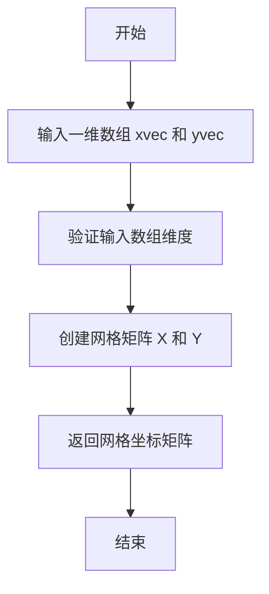

#### 带注释源码

```python
# 代码中的实际使用示例
nx = 101
ny = 105

# 创建一维坐标向量
xvec = np.linspace(0.001, 4.0, nx)  # 生成从 0.001 到 4.0 的 101 个等间距点
yvec = np.linspace(0.001, 4.0, ny)  # 生成从 0.001 到 4.0 的 105 个等间距点

# 调用 np.meshgrid 创建二维网格矩阵
# x1: 每一行相同，按 xvec 重复 ny 行
# x2: 每一列相同，按 yvec 重复 nx 列
x1, x2 = np.meshgrid(xvec, yvec)

# 后续用于计算需要二维坐标的函数
obj = x1**2 + x2**2 - 2*x1 - 2*x2 + 2  # 目标函数
g1 = -(3*x1 + x2 - 5.5)  # 约束条件1
g2 = -(x1 + 2*x2 - 4.5)  # 约束条件2
g3 = 0.8 + x1**-3 - x2   # 约束条件3

# 使用网格数据进行等高线绘制
cntr = ax.contour(x1, x2, obj, [0.01, 0.1, 0.5, 1, 2, 4, 8, 16], colors='black')
```


## 关键组件


### TickedStroke

Matplotlib patheffects模块中的路径效果类，通过在路径上绘制刻度线来创建 ticked style，支持通过角度、间距和长度参数控制刻度线的外观。

### withTickedStroke

创建并返回TickedStroke路径效果的函数，接受angle、spacing、length等参数，用于为图形元素（如线条、路径）添加刻度线效果。

### patheffects

Matplotlib的路径效果模块，提供了多种路径绘制效果，包括TickedStroke、withTickedStroke等，用于在低级别修改路径绘制方式。

### Path

表示几何路径的类，由一系列顶点和路径指令组成，用于定义复杂的图形形状，支持单位圆等基本图形。

### PathPatch

用于在matplotlib axes上绘制Path的patch类，接受path、facecolor、lw等参数，并可应用path_effects来修改绘制效果。

### contour

绘制等高线图的函数，接受x、y、z数据和levels参数，返回Contour对象，可设置path_effects来为等高线添加刻度线效果。

### plot

绘制线条图的函数，接受x、y数据和其他绘图参数，可通过path_effects参数为线条添加各种路径效果，如TickedStroke。


## 问题及建议


### 已知问题

-   **代码重复**：创建 figure 和 ax 的代码在多个地方重复出现（4次），未提取为公共函数
-   **魔法数字**：多处硬编码数值如 `nx=101`、`ny=105`、`figsize=(6,6)`、`xlim(0,4)`、`ylim(0,4)` 等，缺乏常量定义
-   **变量命名不清晰**：使用 `obj`, `g1`, `g2`, `g3` 等简短命名，缺乏描述性，可读性差
-   **数据准备代码重复**：等高线部分的数据生成逻辑（xvec, yvec, meshgrid）与前面的正弦曲线数据生成可复用
-   **硬编码参数分散**：TickedStroke 的 `angle`、`spacing`、`length` 等参数在多处重复硬编码，应提取为配置或常量
-   **缺乏输入验证**：没有任何参数校验，如 `nx`、`ny` 必须为正整数等
-   **plt.show() 多次调用**：在每个示例后都调用 `plt.show()`，阻塞交互，建议合并或使用 `plt.savefig()` 替代
-   **注释与代码边界不明确**：docstring 与代码混在一起，部分注释（如 `# %%`）依赖外部工具

### 优化建议

-   提取公共函数如 `create_figure()`、`setup_axes()` 减少重复代码
-   将数值常量定义在文件顶部，如 `DEFAULT_FIGSIZE = (6, 6)`、`NX = 101`
-   使用描述性变量名，如 `objective` 替代 `obj`，`constraint1` 替代 `g1`
-   将 TickedStroke 参数封装为配置字典或 dataclass，提高可维护性
-   添加类型注解和参数验证，提升代码健壮性
-   考虑使用面向对象方式封装示例，或使用 pytest 参数化减少代码冗余
-   将静态展示改为交互式或批量生成图片，减少 `plt.show()` 调用次数


## 其它


### 设计目标与约束

本代码示例旨在演示matplotlib中TickedStroke路径效果的应用，用于在图形中绘制带有刻度标记的线条、路径和等高线。设计目标是提供直观、灵活的刻度线控制，包括角度、间距和长度参数。约束条件包括：依赖matplotlib 2.0+版本，需要numpy支持数值计算，仅支持2D图形渲染。

### 错误处理与异常设计

代码主要依赖matplotlib的内部错误处理机制。当参数值不合法时（如angle超出-180到180范围），matplotlib会发出警告或使用默认值。数值计算中可能出现的警告（如除零）通过numpy的警告机制处理。图形渲染错误通常由matplotlib后端捕获并显示。

### 数据流与状态机

数据流：输入参数(angle, spacing, length) → Path对象生成 → TickedStroke渲染 → Canvas绘制输出。状态机涉及matplotlib的图形状态管理，包括Figure、Axes、Artist的创建和更新流程。交互式操作会触发重绘事件循环。

### 外部依赖与接口契约

主要依赖：matplotlib.pyplot(图形API)、matplotlib.patches(图形补丁)、matplotlib.path(Path对象)、matplotlib.patheffects(路径效果)、numpy(数值计算)。接口契约：withTickedStroke()返回PathEffect对象，支持添加到任何Artist的path_effects属性，参数angle默认-90度，spacing默认10，length默认1。

### 性能考虑

对于大量路径的渲染（如密集等高线图），TickedStroke可能影响性能。建议在大数据量场景下限制path_effects的使用，或预先渲染静态图形。numpy的向量化操作确保了网格数据计算的高效性。

### 兼容性考虑

代码兼容matplotlib 2.0及以上版本，numpy 1.0及以上版本。跨平台兼容（Windows/Linux/macOS）。不同matplotlib后端（Qt5Agg、Agg、SVG等）均支持path_effects功能。Python 3.6+版本兼容。

### 使用示例与测试场景

基本测试：圆形路径应用TickedStroke。线条测试：直线和曲线应用不同角度的刻度线。等高线测试：优化问题中约束条件的可视化。方向测试：正负角度控制刻度线的绘制侧。回归测试：确保修改参数后渲染结果一致性。

### 配置参数说明

withTickedStroke关键参数：angle控制刻度线角度（度），正值为顺时针，负值为逆时针；spacing控制刻度线间距（像素单位）；length控制刻度线长度；orientation控制刻度线方向（'horizontal'或'vertical'）；angleA和angleB控制线段两端的角度。

    