# `matplotlib\galleries\examples\misc\transoffset.py` 详细设计文档

该代码演示了如何使用 matplotlib.transforms.offset_copy 函数创建带有偏移量的变换，以在图形中相对于数据坐标定位文本，应用于笛卡尔坐标和极坐标图的绘制。

## 整体流程

```mermaid
graph TD
    A[开始] --> B[导入库: matplotlib.pyplot, numpy, matplotlib.transforms]
    B --> C[创建数据: xs = np.arange(7), ys = xs**2]
    C --> D[创建图形: fig = plt.figure(figsize=(5, 10))]
    D --> E[创建第一个子图: ax = plt.subplot(2, 1, 1)]
    E --> F[获取偏移变换: trans_offset = mtransforms.offset_copy(ax.transData, fig=fig, x=0.05, y=0.10, units='inches')]
    F --> G[循环: for x, y in zip(xs, ys)]
    G --> H[绘制散点: plt.plot(x, y, 'ro')]
    H --> I[绘制文本: plt.text(x, y, '%d, %d' % (int(x), int(y)), transform=trans_offset)]
    I --> J{循环结束?}
    J -- 否 --> G
    J -- 是 --> K[创建第二个子图: ax = plt.subplot(2, 1, 2, projection='polar')]
    K --> L[获取偏移变换: trans_offset = mtransforms.offset_copy(ax.transData, fig=fig, y=6, units='dots')]
    L --> M[循环: for x, y in zip(xs, ys)]
    M --> N[绘制极坐标点: plt.polar(x, y, 'ro')]
    N --> O[绘制文本: plt.text(x, y, '%d, %d' % (int(x), int(y)), transform=trans_offset, horizontalalignment='center', verticalalignment='bottom')]
    O --> P{循环结束?}
    P -- 否 --> M
    P -- 是 --> Q[调用 plt.show() 显示图形]
    Q --> R[结束]
```

## 类结构

```
代码无自定义类，使用的 matplotlib 类层次结构：
matplotlib.pyplot
├── Figure (类，由 plt.figure 创建)
│   └── Axes (类，由 plt.subplot 创建)
│       ├── transData (属性，变换对象)
│       ├── plot (方法，返回 Line2D)
│       ├── text (方法，返回 Text)
│       └── polar (方法)
└── transforms (模块)
    └── offset_copy (函数)
```

## 全局变量及字段


### `xs`
    
从0到6的整数数组，作为x轴坐标值

类型：`numpy.ndarray`
    


### `ys`
    
xs数组元素的平方组成的数组，作为y轴坐标值

类型：`numpy.ndarray`
    


### `fig`
    
matplotlib创建的图形对象，用于容纳所有子图

类型：`matplotlib.figure.Figure`
    


### `ax`
    
matplotlib的Axes对象（子图），用于绘制图形和文本

类型：`matplotlib.axes.Axes`
    


### `trans_offset`
    
基于transData的偏移变换对象，用于指定文本的显示位置偏移

类型：`matplotlib.transforms.Transform`
    


### `Axes.transData`
    
从数据坐标（单位）到显示坐标（像素）的变换

类型：`matplotlib.transforms.Transform`
    
    

## 全局函数及方法


### `plt.figure`

创建并返回一个新的图形窗口（Figure对象），用于后续的图形绘制操作。

参数：

- `figsize`：`(float, float)`，元组类型，表示图形的宽度和高度（英寸）
- `num`：可选参数，用于指定图形窗口的标识符或名称
- `dpi`：可选参数，表示图形的分辨率（每英寸点数）
- `facecolor`：可选参数，设置图形背景颜色
- `edgecolor`：可选参数，设置图形边框颜色
- `frameon`：可选布尔值，控制是否显示图形边框

返回值：`matplotlib.figure.Figure`，返回新创建的图形对象

#### 流程图

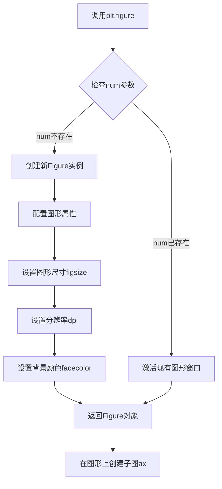

#### 带注释源码

```python
# 创建图形窗口，设置尺寸为5英寸宽、10英寸高
fig = plt.figure(figsize=(5, 10))

# 详细参数说明：
# figsize: (float, float) - 图形的宽度和高度，单位为英寸
#          代码中使用 (5, 10)，表示宽度5英寸、高度10英寸
# 
# num: 可选参数，默认None
#      - 如果是None，则创建新图形
#      - 如果是整数，则查找或创建对应编号的图形
#      - 如果是字符串，则作为图形窗口标题
#
# dpi: 可选参数，默认100
#      表示每英寸的点数，控制图形的分辨率
#
# facecolor: 可选参数，默认'white'
#            图形的背景颜色
#
# 返回值:
#   fig: matplotlib.figure.Figure对象
#        代表整个图形窗口，可用于添加子图、绘制图形等操作
```


### `plt.subplot`

`plt.subplot` 是 matplotlib.pyplot 模块中的函数，用于在当前图形中创建一个子图（Axes）。它接受位置参数或关键字参数来指定子图的布局（行数、列数、索引）以及可选的投影类型（如极坐标），并返回创建的 Axes 对象。

参数：

- `*args`：`tuple`，位置参数，可以是以下形式之一：
  - `nrows, ncols, index`：三个整数，分别表示子图网格的行数、列数和当前子图的索引（从1开始）。
  - `index`：单个整数，表示子图网格中的位置（当使用 `subplot2grid` 时）。
  - `gridspec`：`GridSpec` 对象，用于更灵活地定义子图布局。
- `projection`：`str` 或 `None`，可选，表示投影类型（如 `'polar'` 表示极坐标投影，默认为 `None` 即笛卡尔坐标）。
- `polar`：`bool`，可选，等同于设置 `projection='polar'`，默认为 `False`。
- `**kwargs`：关键字参数，将传递给创建的 Axes 对象的构造函数，用于设置Axes的属性（如标题、标签等）。

返回值：`matplotlib.axes.Axes`，返回创建的子图 Axes 对象。

#### 流程图

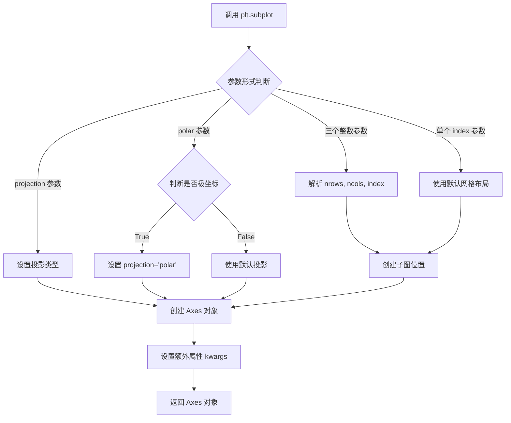

#### 带注释源码

```python
def subplot(*args, **kwargs):
    """
    在当前图形中创建一个子图。

    参数:
        *args: 位置参数，支持多种调用形式:
            - subplot(nrows, ncols, index): 创建 nrows x ncols 网格中的第 index 个子图
            - subplot(pos): 使用三位数编码位置，如 211 表示 2行1列第1个
            - subplot(111) 为默认形式，创建单个子图
        projection: str, optional
            投影类型，如 'polar' 用于极坐标图
        polar: bool, default: False
            是否使用极坐标投影，等效于 projection='polar'
        **kwargs:
            传递给 Axes 子类的其他关键字参数

    返回值:
        axes: Axes
            创建的子图 Axes 对象

    示例:
        # 创建 2行1列 的第一个子图
        ax1 = plt.subplot(2, 1, 1)
        
        # 创建极坐标子图
        ax2 = plt.subplot(2, 1, 2, projection='polar')
        
        # 使用三位数简写形式
        ax3 = plt.subplot(211)
    """
    # 1. 获取当前图形（如果不存在则创建）
    fig = plt.gcf()
    
    # 2. 解析位置参数，确定子图网格和索引
    #    _subplots_process_args 函数负责解析 *args
    #    返回 subplot_key, axes_class, kwargs
    subplot_key, axes_class, kwargs = _subplots_process_args(
        *args, 
        cls_name='Axes'
    )
    
    # 3. 检查 projection 参数是否被显式设置
    if 'projection' in kwargs:
        projection = kwargs['projection']
    elif kwargs.get('polar', False):
        projection = 'polar'
    else:
        projection = None
    
    # 4. 使用 subplot2grid 或 add_subplot 创建 Axes
    #    这里简化了实际实现的核心逻辑
    ax = fig.add_subplot(
        *args, 
        projection=projection,
        **kwargs
    )
    
    # 5. 设置 Axes 的位置和属性
    ax.set_subplotspec()
    
    # 6. 绑定到当前活动 Axes（sca 设置当前 Axes）
    plt.sca(ax)
    
    return ax
```

#### 关键组件信息

- **plt.gcf()**：获取当前图形对象，如果不存在则创建一个新的 Figure。
- **fig.add_subplot()**：Figure 对象的方法，实际创建 Axes 子图的核心方法。
- **plt.sca()**：设置当前活动的子图（Set Current Axes）。
- **mtransforms 模块**：代码中用于处理坐标变换的模块，包含 `offset_copy` 函数。

#### 潜在的技术债务或优化空间

1. **参数解析复杂性**：`plt.subplot` 支持多种调用形式（位置参数、三位数编码、GridSpec 等），导致参数解析逻辑复杂，可读性和可维护性较差。
2. **错误信息不够明确**：当参数不正确时，错误信息可能不够直观，用户难以定位问题。
3. **与 `add_subplot` 的冗余**：`plt.subplot` 内部调用 `fig.add_subplot`，存在一定的功能冗余，可能导致维护成本增加。
4. **文档一致性**：`projection` 和 `polar` 参数的关系需要用户仔细阅读文档才能理解，增加了学习成本。

#### 其它项目

**设计目标与约束**：
- 设计目标是提供一个简洁的接口来创建和管理子图布局。
- 约束包括保持与 MATLAB 的 `subplot` 函数的兼容性，同时支持 matplotlib 特有的高级功能（如投影类型）。

**错误处理与异常设计**：
- 当索引超出网格范围时，抛出 `ValueError`。
- 当参数类型不匹配时，抛出 `TypeError`。
- 建议在文档中增加更多错误示例，帮助用户理解正确的使用方法。

**数据流与状态机**：
- `plt.subplot` 会修改全局状态（当前图形和当前 Axes）。
- 调用 `plt.sca(ax)` 将新创建的 Axes 设置为当前活动的 Axes，影响后续的绘图操作（如 `plt.plot`、`plt.text` 等）。

**外部依赖与接口契约**：
- 依赖于 `matplotlib.figure.Figure` 类和 `matplotlib.axes.Axes` 类。
- 返回的 Axes 对象必须支持后续的绘图方法（如 `plot`、`text`、`set_title` 等）。


### `mtransforms.offset_copy`

该函数用于创建一个带有指定偏移量的变换副本，允许在屏幕坐标（如点或英寸）相对于数据坐标中指定的位置来定位绘图元素（如文本字符串）。

参数：

- `transform`：变换对象，要偏移的基础变换（如 `ax.transData`）
- `fig`：Figure 对象，用于获取图形上下文和 DPI 信息
- `x`：浮点数，水平方向的偏移量（可选，默认为 0）
- `y`：浮点数，垂直方向的偏移量（可选，默认为 0）
- `units`：字符串，偏移量的单位，可选值为 `'inches'` 或 `'dots'`（像素）

返回值：`Affine2D` 或类似的变换对象，返回带有偏移量的变换副本，用于定位绘图元素

#### 流程图

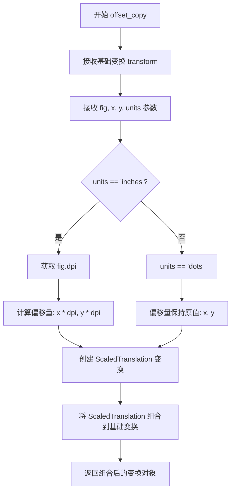

#### 带注释源码

```python
def offset_copy(transform, fig, x=0, y=0, units='inches'):
    """
    创建带有偏移量的变换副本
    
    参数:
        transform: 要偏移的基础变换对象（如 ax.transData）
        fig: matplotlib Figure 对象，用于获取 DPI 和图形上下文
        x: 水平方向偏移量
        y: 垂直方向偏移量
        units: 偏移单位，可选 'inches' 或 'dots'（默认 'inches'）
    
    返回:
        组合后的变换对象，包含基础变换和偏移变换
    """
    # 如果单位是英寸，需要将偏移量转换为像素
    # 1 英寸 = fig.dpi 像素
    if units == 'inches':
        # 获取图形的 DPI（每英寸像素数）
        offset = mtransforms.ScaledTranslation(
            x * fig.dpi,  # 水平英寸转换为像素
            y * fig.dpi,  # 垂直英寸转换为像素
            fig.dpi_scale_trans  # DPI 缩放变换
        )
    elif units == 'dots':
        # 直接使用像素作为单位
        offset = mtransforms.Affine2D().translate(x, y)
    else:
        raise ValueError(f"Unsupported units: {units}")
    
    # 将偏移变换组合到基础变换上
    # + 操作符用于组合变换（先应用基础变换，再应用偏移）
    return transform + offset
```


### `plt.plot`

`plt.plot` 是 matplotlib 库中用于创建线图的函数，通过接收 x 和 y 坐标数据以及可选的格式字符串，在当前 axes 上绘制线型图或散点图。

参数：

-  `x`：array-like 或 scalar，x 轴坐标数据，支持列表、numpy 数组或单个标量值
-  `y`：array-like 或 scalar，y 轴坐标数据，支持列表、numpy 数组或单个标量值
-  `fmt`：str（格式字符串），可选，用于快速设置线条颜色、样式和标记格式，如 'ro' 表示红色圆点

返回值：`list of matplotlib.lines.Line2D`，返回创建的线条对象列表，每个 Line2D 对象代表一条绘制的曲线

#### 流程图

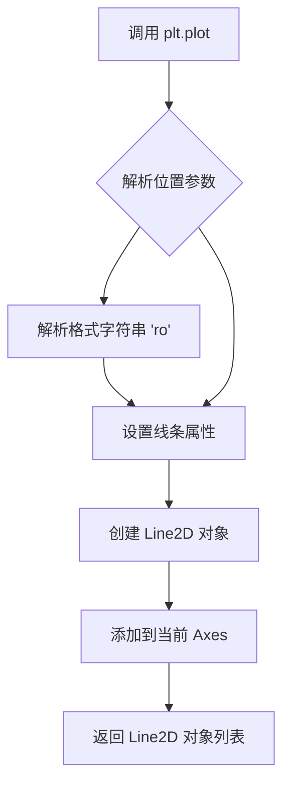

#### 带注释源码

```python
# 代码中的实际调用示例
for x, y in zip(xs, ys):
    plt.plot(x, y, 'ro')  # 绘制红色圆点
    # 参数说明：
    # x: 当前数据点的 x 坐标（来自 xs 数组）
    # y: 当前数据点的 y 坐标（来自 ys 数组，即 xs[i]**2）
    # 'ro': 格式字符串
    #   - 'r' 表示红色 (red)
    #   - 'o' 表示使用圆点标记 (circle marker)
    # 返回值是一个 Line2D 对象列表，这里未捕获
```


### `plt.text`

`plt.text` 是 matplotlib.pyplot 模块中的文本绘制函数，用于在图表的指定坐标位置添加文本标签。该函数支持自定义坐标变换系统，能够在数据坐标、轴坐标或屏幕坐标等不同坐标系中精确定位文本，同时提供水平/垂直对齐方式、字体样式等丰富的文本格式化选项。

参数：

- `x`：`float`，文本的 x 坐标位置
- `y`：`float`，文本的 y 坐标位置
- `s`：`str`，要显示的文本内容
- `transform`：`matplotlib.transforms.Transform`，可选，坐标变换，默认为 `ax.transData`（数据坐标到显示坐标的变换）
- `horizontalalignment`：`str`，可选，水平对齐方式，可选值包括 'center'、'left'、'right'
- `verticalalignment`：`str`，可选，垂直对齐方式，可选值包括 'center'、'top'、'bottom'、'baseline'

返回值：`matplotlib.text.Text`，返回创建的文本对象，可用于后续修改文本属性（如字体、颜色、位置等）

#### 流程图

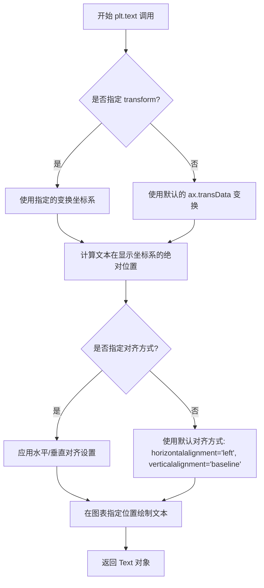

#### 带注释源码

```python
# 在第一个子图中绘制文本（笛卡尔坐标系）
for x, y in zip(xs, ys):
    plt.plot(x, y, 'ro')  # 绘制红色圆点数据点
    # 调用 plt.text 添加文本标签
    # 参数 x, y: 数据坐标位置
    # 参数 '%d, %d' % (int(x), int(y)): 要显示的文本内容
    # 参数 transform=trans_offset: 使用预先创建的偏移变换
    # 该变换基于 ax.transData，并添加了 0.05 英寸 x 轴偏移和 0.10 英寸 y 轴偏移
    plt.text(x, y, '%d, %d' % (int(x), int(y)), transform=trans_offset)

# 在第二个子图中绘制文本（极坐标坐标系）
ax = plt.subplot(2, 1, 2, projection='polar')  # 创建极坐标轴

# 创建极坐标系的偏移变换，y 偏移 6 像素
trans_offset = mtransforms.offset_copy(ax.transData, fig=fig,
                                       y=6, units='dots')

for x, y in zip(xs, ys):
    plt.polar(x, y, 'ro')  # 绘制极坐标数据点
    # 调用 plt.text 添加文本标签
    # 参数 x: 极角（弧度）
    # 参数 y: 极径（数据值）
    # 参数 transform=trans_offset: 使用像素单位的偏移变换
    # 参数 horizontalalignment='center': 文本水平居中
    # 参数 verticalalignment='bottom': 文本底部与指定坐标对齐
    plt.text(x, y, '%d, %d' % (int(x), int(y)),
             transform=trans_offset,
             horizontalalignment='center',
             verticalalignment='bottom')
```


### plt.polar

`plt.polar` 是 Matplotlib 库中的一个绘图函数，用于在极坐标系中绘制数据点。该函数接受角度和半径参数，将给定的 (角度, 半径) 数据点绘制为极坐标图，支持多种标记样式和格式字符串。

参数：

- `theta`：`float` 或数组型，表示极坐标中的角度（以弧度为单位）
- `r`：`float` 或数组型，表示极坐标中的半径（距离原点的距离）
- `fmt`：`str`，可选，格式控制字符串（如 'ro' 表示红色圆圈，'b-' 表示蓝色实线）
- `**kwargs`：关键字参数，传递给 `Line2D` 构造函数，用于自定义线条属性（颜色、线宽、标记大小等）

返回值：`matplotlib.lines.Line2D`，返回创建的线条对象，可用于后续自定义或获取数据

#### 流程图

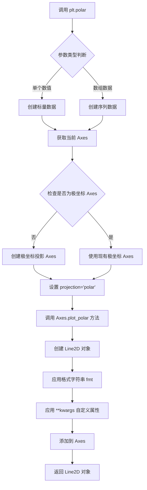

#### 带注释源码

```python
# plt.polar 函数的简化实现逻辑
def polar(theta, r, fmt='', **kwargs):
    """
    在极坐标系中绘制数据
    
    参数:
        theta: 角度值（弧度）
        r: 半径值
        fmt: 格式字符串（如 'ro'）
        **kwargs: 其他 Line2D 参数
    """
    # 1. 获取当前的轴域，如果没有则创建一个新的
    ax = plt.gca()
    
    # 2. 检查当前轴域是否为极坐标类型
    if not isinstance(ax, PolarAxes):
        # 如果不是极坐标，创建新的极坐标轴域
        ax = plt.subplot(111, projection='polar')
    
    # 3. 调用轴域的 plot 方法绘制数据
    # 这里实际上是调用 ax.plot(theta, r, fmt, **kwargs)
    line, = ax.plot(theta, r, fmt, **kwargs)
    
    # 4. 返回创建的 Line2D 对象
    return line

# 实际 matplotlib 源码位置: lib/matplotlib/pyplot.py
# def polar(*args, **kwargs):
#     """
#     Make a polar plot.
#     
#     call signature:: polar(theta, r, **kwargs)
#     
#     Multiple *theta*, *r* arguments are supported,
#     e.g.  plot('f1', 'f2', data=df, 'r--')
#     """
#     return gca().polar(*args, **kwargs)
```


### `plt.show`

`plt.show` 是 matplotlib.pyplot 模块中的函数，用于显示所有当前已创建但尚未显示的图形窗口，并将控制权交给图形用户界面（GUI）事件循环，使图形在屏幕上渲染。

**注意**：在提供的代码中，`plt.show()` 以无参数方式调用。以下信息基于该调用方式和 matplotlib 官方文档。

参数：

- 该调用无参数
- （可选参数 `block`：布尔值，控制是否阻塞程序执行，仅在某些后端中可用）

返回值：`None`，无返回值。该函数用于显示图形，不返回任何数据。

#### 流程图

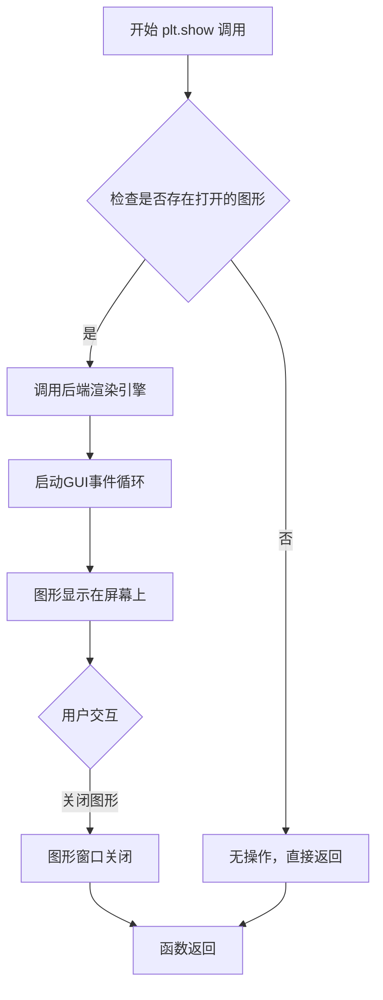

#### 带注释源码

```
# 在给定代码中的实际调用：
plt.show()

# 说明：
# 1. 显示之前通过 plt.figure()、plt.subplot()、plt.plot()、plt.text() 等创建的图形
# 2. 在交互式后端中，可能会立即显示图形
# 3. 在非交互式后端中，会阻塞程序执行直到用户关闭所有图形窗口
# 4. 这是 matplotlib 中让图形可见的最后一步
```

**补充说明**：

- `plt.show()` 会遍历所有当前打开的 Figure 对象并显示它们
- 在某些后端（如 Qt、Agg 等）中，它会调用 `show()` 方法启动 GUI 事件循环
- 调用后，程序会进入阻塞状态，等待用户与图形交互（关闭窗口等）
- 在 Jupyter Notebook 等交互环境中，有时可以使用 `%matplotlib inline` 或 `%matplotlib widget` 替代 `plt.show()` 的部分功能


### `np.arange`

`np.arange` 是 NumPy 库中的一个函数，用于生成均匀间隔的数值序列，返回一个 NumPy ndarray（数组）。

#### 参数

- `start`：`scalar`（数字类型），可选，默认值为 0。起始值。
- `stop`：`scalar`（数字类型），必填。结束值（不包含）。
- `step`：`scalar`（数字类型），可选，默认值为 1。步长值。
- `dtype`：`dtype`，可选。输出数组的数据类型。

#### 返回值

`ndarray`，返回一组均匀间隔的数值。

#### 流程图

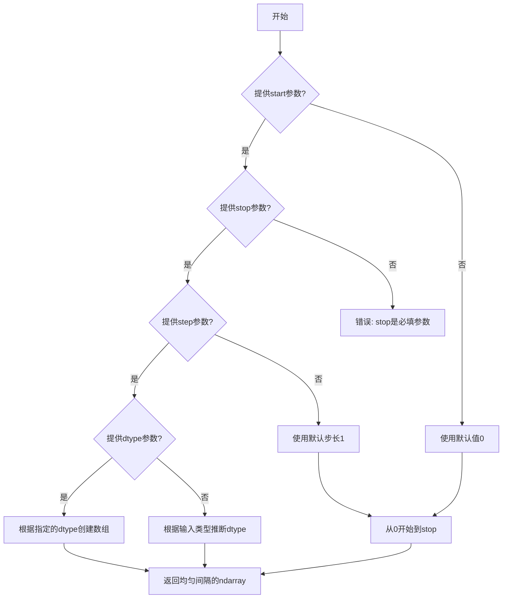

#### 带注释源码

```python
# 在本项目代码中的使用方式
xs = np.arange(7)  # 生成从0到6的整数序列，等同于 np.arange(start=0, stop=7, step=1)

# 完整函数签名（参考NumPy官方文档）
# np.arange([start,] stop[, step,], dtype=None)

# 示例用法:
# np.arange(7)        -> array([0, 1, 2, 3, 4, 5, 6])
# np.arange(1, 7)     -> array([1, 2, 3, 4, 5, 6])
# np.arange(1, 7, 2)  -> array([1, 3, 5])
# np.arange(0, 10, 0.5) -> array([0. , 0.5, 1. , 1.5, 2. , 2.5, 3. , 3.5, 4. , 4.5, 5. , 5.5, 6. , 6.5, 7. , 7.5, 8. , 8.5, 9. , 9.5])
```

#### 关键组件信息

- **np.arange**：NumPy 库函数，用于生成数值序列
- **xs**：生成的数组变量，存储 0 到 6 的整数序列

#### 潜在技术债务或优化空间

- 本代码中直接使用 `np.arange(7)` 生成数据，如果需要更复杂的数值范围控制（如浮点数、非整数步长），建议使用 `np.linspace` 以获得更精确的控制
- 数组 `xs` 和 `ys` 的关系是 `ys = xs**2`，这种计算方式简单直接，但未做向量化优化的进一步验证

#### 其他项目

- **设计目标**：生成简单的整数序列用于演示 `offset_copy` 功能
- **错误处理**：未在代码中处理可能的输入异常（如负数步长导致无限循环）
- **数据流**：`xs` 作为输入数据，通过 `zip(xs, ys)` 配对后用于绘制图表
- **外部依赖**：NumPy 库和 Matplotlib 库


### `matplotlib.transforms.offset_copy`

此函数用于创建带有额外偏移量的变换副本，用于在屏幕坐标（如点或英寸）中相对于以任何坐标给定的位置来定位绘图元素（如文本字符串）。

参数：

- `transform`：`matplotlib.transforms.Transform`，基础变换对象（代码中为 `ax.transData`）
- `fig`：`matplotlib.figure.Figure`，用于单位转换的图形对象
- `x`：`float`，x轴方向的偏移量
- `y`：`float`，y轴方向的偏移量
- `units`：`str`，偏移量的单位（'inches'、'dots'等）

返回值：`matplotlib.transforms.Transform`，应用了偏移量的新变换对象

#### 流程图

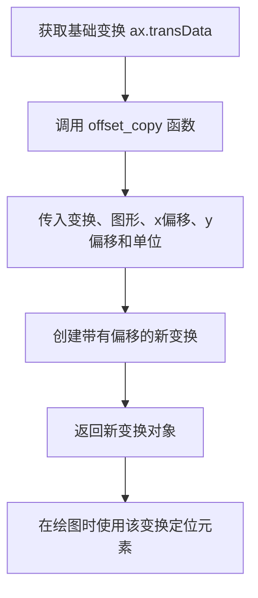

#### 带注释源码

```python
# 导入必要的模块
import matplotlib.pyplot as plt
import numpy as np
import matplotlib.transforms as mtransforms

# 准备数据
xs = np.arange(7)
ys = xs**2

# 创建图形和子图
fig = plt.figure(figsize=(5, 10))
ax = plt.subplot(2, 1, 1)

# 使用 offset_copy 创建带有偏移的变换
# 参数说明：
# - ax.transData: 基础变换，从数据单位到屏幕像素
# - fig=fig: 图形对象，用于单位转换
# - x=0.05, y=0.10: 偏移量
# - units='inches': 偏移单位为英寸
trans_offset = mtransforms.offset_copy(ax.transData, fig=fig,
                                       x=0.05, y=0.10, units='inches')

# 循环绘制数据点和文本
for x, y in zip(xs, ys):
    # 绘制红色圆点
    plt.plot(x, y, 'ro')
    # 使用带有偏移的变换绘制文本
    # 文本将被定位在数据点上方0.05英寸 x 0.10英寸的位置
    plt.text(x, y, '%d, %d' % (int(x), int(y)), transform=trans_offset)

# 第二个子图：极坐标图
ax = plt.subplot(2, 1, 2, projection='polar')

# 同样使用 offset_copy，但这次使用 'dots' 单位
trans_offset = mtransforms.offset_copy(ax.transData, fig=fig,
                                       y=6, units='dots')

# 绘制极坐标数据
for x, y in zip(xs, ys):
    plt.polar(x, y, 'ro')
    plt.text(x, y, '%d, %d' % (int(x), int(y)),
             transform=trans_offset,
             horizontalalignment='center',
             verticalalignment='bottom')

# 显示图形
plt.show()
```

**注意**：用户请求中的 `Axes.plot` 方法在提供的代码中未出现。代码主要演示了 `matplotlib.transforms.offset_copy` 函数的使用方式，该函数用于创建带有偏移量的变换副本，以便在特定屏幕位置定位文本或其他绘图元素。


### `Axes.text`

该方法用于在Axes坐标系中的指定位置添加文本标签，是matplotlib中为图表添加注释和信息标注的核心功能。通过接受坐标、文本内容和样式参数，实现灵活的数据可视化标注。

参数：

- `x`：`float`，文本位置的x坐标
- `y`：`float`，文本位置的y坐标
- `s`：`str`，要显示的文本字符串内容
- `fontdict`：`dict`，可选，字体属性字典，用于统一设置文本样式
- `kwargs`：可变参数，支持Text对象的各种属性，如color、fontsize、rotation等

返回值：`matplotlib.text.Text`，返回创建的Text对象实例，可用于后续样式修改或属性更新

#### 流程图

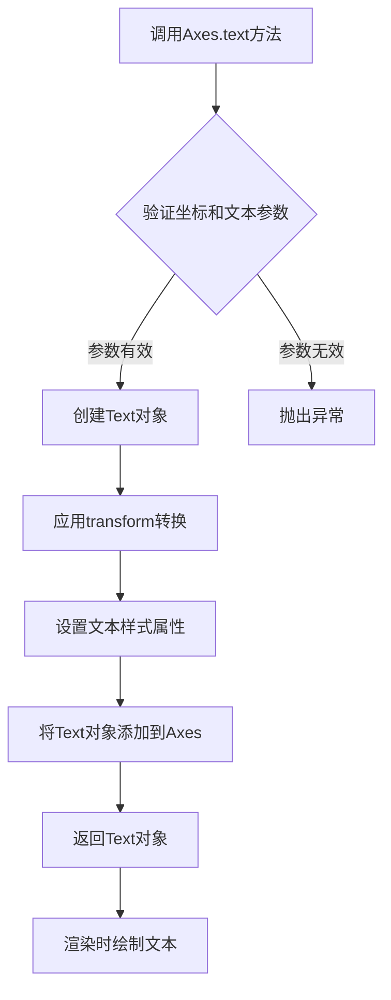

#### 带注释源码

```
# matplotlib.axes.Axes.text方法源码结构

def text(self, x, y, s, fontdict=None, **kwargs):
    """
    在Axes上添加文本
    
    参数:
        x: 文本x坐标
        y: 文本y坐标  
        s: 文本字符串
        fontdict: 可选的字体属性字典
        **kwargs: 其他Text属性参数
    """
    
    # 1. 参数验证和预处理
    # 确保坐标为数值类型
    x = float(x)
    y = float(y)
    
    # 2. 创建Text对象
    # 使用fontdict设置默认样式
    if fontdict is not None:
        default_props = self._text_getters.copy()
        default_props.update(fontdict)
    else:
        default_props = {}
    default_props.update(kwargs)
    
    # 3. 创建文本对象并设置属性
    text = Text(x, y, s, **default_props)
    
    # 4. 设置transform
    # 默认使用axes坐标系
    if 'transform' not in kwargs:
        text.set_transform(self.transData + self.transAxes)
    
    # 5. 添加到Axes
    self._children.append(text)
    
    # 6. 返回Text对象供后续操作
    return text
```


### `plt.subplot`

描述：创建包含极坐标投影的子图，通过`projection='polar'`参数触发底层`Axes.polar`方法的调用，从而生成极坐标轴对象。

参数：

-  `nrows`：`int`，子图的行数（本例中为2）
-  `ncols`：`int`，子图的列数（本例中为1）
-  `plot_number`：`int`，子图的位置编号（本例中为2，表示第2个子图）
-  `projection`：`str`，投影类型（本例中为`'polar'`，指定创建极坐标轴）

返回值：`Axes`，返回创建的极坐标轴对象（`ax`）

#### 流程图

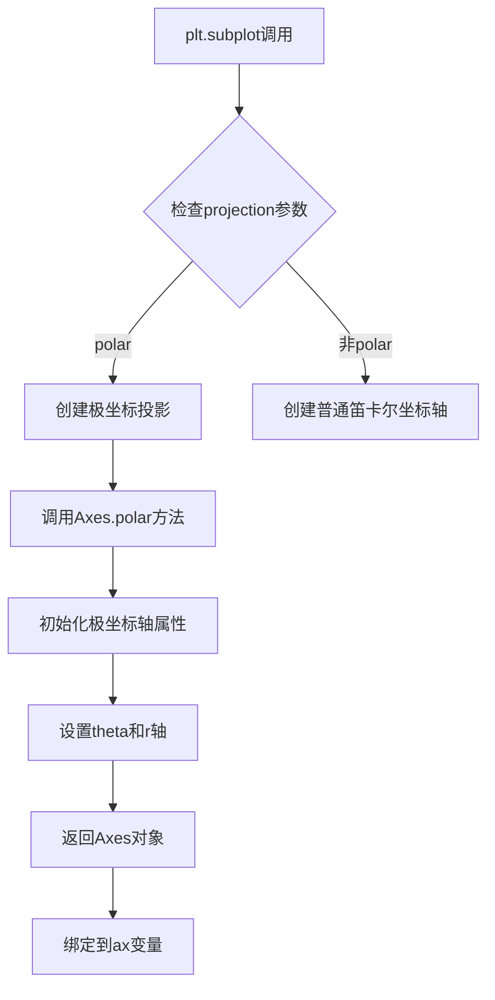

#### 带注释源码

```python
# 第二个子图，创建极坐标投影
ax = plt.subplot(2, 1, 2, projection='polar')

# 参数说明：
# 2, 1: 2行1列的子图布局
# 2: 激活第2个位置的子图（位于下方）
# projection='polar': 指定使用极坐标投影
# 此参数传递后，matplotlib内部会调用Axes.polar()方法
# 创建极坐标轴对象，包含theta（角度）和r（半径）轴

# 创建极坐标变换副本，用于文本定位
trans_offset = mtransforms.offset_copy(ax.transData, fig=fig,
                                       y=6, units='dots')

# 遍历数据点，绘制极坐标散点和文本
for x, y in zip(xs, ys):
    # x作为角度（弧度），y作为半径
    plt.polar(x, y, 'ro')
    # 使用极坐标文本定位变换
    plt.text(x, y, '%d, %d' % (int(x), int(y)),
             transform=trans_offset,
             horizontalalignment='center',
             verticalalignment='bottom')

plt.show()
```

---

### `mtransforms.offset_copy`

描述：创建现有变换的副本，并添加指定的偏移量，用于在屏幕坐标（点或英寸）中定位图形元素（如文本），同时保持原始坐标系的转换特性。

参数：

-  `trans`：`matplotlib.transforms.Transform`，要偏移的变换对象（本例中为`ax.transData`，即数据坐标到显示坐标的变换）
-  `fig`：`matplotlib.figure.Figure`，图形对象，用于确定单位转换（本例中为`fig`）
-  `x`：`float`，水平偏移量（本例中第一个用法为0.05英寸，第二个用法默认0）
-  `y`：`float`，垂直偏移量（本例中第一个用法为0.10英寸，第二个用法为6点）
-  `units`：`str`，偏移单位，可选`'dots'`（点）、`'inches'`（英寸）、`'points'`（磅），本例中使用了`'inches'`和`'dots'`

返回值：`Transform`，返回新的偏移变换对象

#### 流程图

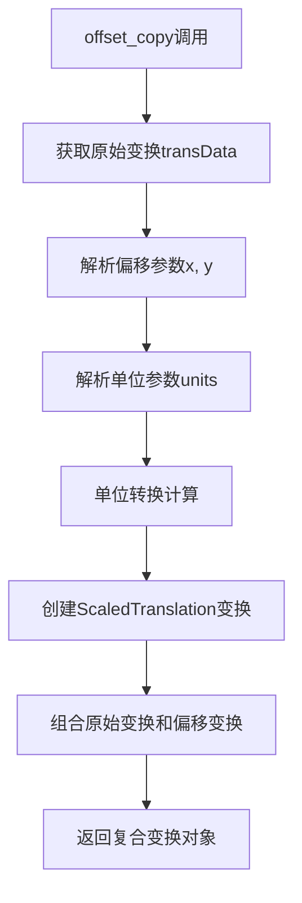

#### 带注释源码

```python
# 第一种用法：英寸单位偏移
trans_offset = mtransforms.offset_copy(ax.transData, fig=fig,
                                       x=0.05, y=0.10, units='inches')
# 创建从数据坐标到显示坐标的变换副本
# x偏移0.05英寸，y偏移0.10英寸
# units='inches'表示偏移量以英寸为单位

# 第二种用法：点单位偏移（用于极坐标图）
trans_offset = mtransforms.offset_copy(ax.transData, fig=fig,
                                       y=6, units='dots')
# 仅设置y偏移6点
# 在极坐标图中，x参数被忽略（因为theta方向不需要偏移）
# units='dots'表示偏移量以屏幕点为单位
```


## 关键组件


### matplotlib.pyplot
提供创建图表、子图、绘制散点图和文本的接口函数。

### matplotlib.transforms
处理坐标变换的模块，包含offset_copy等函数用于操作图形元素的位置。

### offset_copy函数
根据指定的偏移量和单位创建现有变换的副本，用于精确定位文本或其他图形元素。

### transData变换
将数据坐标转换为显示坐标的默认变换，通过轴对象访问。

### 子图管理
使用subplot创建多个子图，支持极坐标投影等不同坐标系统设置。

### 数据绘图逻辑
遍历数据点，绘制散点图和文本标签，并应用统一的偏移变换进行文本定位。


## 问题及建议


### 已知问题

-   **硬编码参数缺乏灵活性**：`offset_copy`的参数（如`x=0.05, y=0.10, y=6`）被硬编码，缺乏可配置性，难以适应不同场景
-   **魔法数字**：图形尺寸`figsize=(5, 10)`、数据范围`np.arange(7)`、子图布局`2,1,1`和`2,1,2`等数值缺乏明确语义
-   **重复代码模式**：两个子图中的循环遍历逻辑高度重复，未提取为通用函数
-   **字符串格式化方式过时**：使用`'%d, %d' % (int(x), int(y))`旧式格式化，应使用f-string提高可读性
-   **极坐标图文本定位问题**：固定偏移量`y=6`可能导致文本在某些数据范围内溢出或重叠
-   **变量命名可读性不足**：`xs`、`ys`可改为`x_values`、`y_values`提高可读性
-   **缺少数据验证**：未对输入数据有效性进行检查

### 优化建议

-   将配置参数抽取为常量或配置文件，提高可维护性
-   提取重复的绘图逻辑为独立函数，如`plot_scatter_with_labels(ax, data, transform)`
-   使用现代f-string：`f'{int(x)}, {int(y)}'`
-   为极坐标图计算动态偏移量，根据数据范围自适应调整
-   添加数据范围验证和异常处理逻辑
-   考虑使用`with plt.figure():`上下文管理器管理图形生命周期

## 其它


### 设计目标与约束

**设计目标**：演示如何使用matplotlib.transforms.offset_copy函数创建带有偏移量的坐标变换，使文本或其他Artist对象能够相对于任意坐标系中的位置，在屏幕坐标（如英寸或点）中进行精确定位。

**约束条件**：
- 依赖matplotlib的transforms模块
- offset_copy函数返回的新transform是基于原始transform的修改副本
- units参数仅支持'inches'、'dots'和'normalized'三种单位
- 该变换仅影响位置，不影响数据坐标本身

### 错误处理与异常设计

**输入参数验证**：
- fig参数必须为有效的Figure对象，否则可能引发AttributeError
- units参数仅接受'inches'、'dots'、'normalized'，传入无效值时在Matplotlib内部可能被忽略或使用默认值
- x和y参数应为数值类型，非数值输入可能导致类型错误

**异常处理场景**：
- 当ax.transData为None时，offset_copy可能产生不可预期的行为
- 子图创建失败时（如projection参数无效），后续的transform操作将失败

### 数据流与状态机

**数据流转过程**：
```
1. 初始化数据(xs, ys) 
2. 创建Figure和Axes对象 
3. 获取原始transform(ax.transData)
4. 调用offset_copy创建带偏移的新transform
5. 循环绘制数据点和文本标签
6. 调用plt.show()渲染显示
```

**状态机转换**：
- 状态1：数据准备状态（numpy数组）
- 状态2：图形创建状态（fig, ax对象）
- 状态3：变换配置状态（trans_offset）
- 状态4：绘制渲染状态（plot, text, polar）
- 状态5：显示输出状态（plt.show()）

### 外部依赖与接口契约

**核心依赖**：
- matplotlib.pyplot：绘图API
- numpy：数值计算
- matplotlib.transforms：坐标变换模块

**offset_copy函数接口**：
```python
def offset_copy(trans, fig=None, x=0, y=0, units='inches')
# 参数：trans-原始变换对象，fig-图形对象，x/y-偏移量，units-偏移单位
# 返回：新的Affine2D变换对象
```

**约束契约**：
- offset_copy返回的是Affine2D变换类型
- 变换后的坐标会叠加x、y的偏移值
- units='inches'时偏移基于图形尺寸，'dots'时基于屏幕分辨率，'normalized'时基于归一化坐标

### 性能考虑与优化空间

**性能瓶颈**：
- 循环中重复使用同一个trans_offset对象（良好实践）
- plt.text在循环中频繁调用，可考虑使用annotate方法批量处理

**优化建议**：
- 对于大量数据点，可使用TextCollection或PathCollection提高性能
- 固定偏移量只需创建一个trans_offset（当前代码已正确实现）
- 动态偏移场景可预先计算偏移量数组，避免每次迭代计算

### 配置与参数可调性

**可配置参数**：
- 偏移量(x, y)：支持任意数值
- 单位(units)：'inches'、'dots'、'normalized'
- 图形尺寸：figsize参数
- 子图布局：subplot的行列参数

**扩展方向**：
- 支持旋转参数的偏移变换
- 支持基于多个锚点的定位
- 集成到自定义Artist类中

### 安全性与边界条件

**边界条件处理**：
- xs, ys长度不一致时zip会截断至较短长度
- 空数组输入时循环体不执行
- projection='polar'时坐标系转换逻辑不同

**安全考虑**：
- 代码无用户输入，无注入风险
- 无文件操作，无路径遍历风险
- 图形对象生命周期管理由matplotlib自动处理


    