# `matplotlib\galleries\examples\misc\zorder_demo.py` 详细设计文档

这是一个matplotlib zorder演示脚本，通过多个子图和图形实例展示如何利用zorder属性控制图形元素（线条、散点、图例等）的绘制顺序，实现不同视觉层次的叠加效果。

## 整体流程

```mermaid
graph TD
    A[导入库: matplotlib.pyplot, numpy] --> B[生成极坐标数据: r, theta, x, y]
    B --> C[创建子图: fig, (ax1, ax2)]
    C --> D[ax1绑定数据: plot + scatter]
    D --> E[设置ax1标题: 'Lines on top of dots']
    E --> F[ax2绑定数据: plot + scatter，设置zorder=2.5]
    F --> G[设置ax2标题: 'Dots on top of lines']
    G --> H[布局调整: plt.tight_layout()]
    H --> I[新建图形: plt.figure()]
    I --> J[生成新x数据: np.linspace(0, 7.5, 100)]
    J --> K[绘制三条正弦曲线，设置不同zorder]
    K --> L[绘制水平线: plt.axhline，设置zorder=2.5]
    L --> M[添加标题: plt.title()]
    M --> N[添加图例: plt.legend()]
    N --> O[设置图例zorder: l.set_zorder(2.5)]
    O --> P[显示图形: plt.show()]
```

## 类结构

```
本脚本为matplotlib示例脚本，无自定义类层次结构
主要使用matplotlib.pyplot和numpy库的API
核心对象类型: Figure, Axes, Line2D, PathCollection, Legend
```

## 全局变量及字段


### `r`
    
极坐标半径数组，用于第一组极坐标转换

类型：`numpy.ndarray`
    


### `theta`
    
极坐标角度数组，用于第一组极坐标转换

类型：`numpy.ndarray`
    


### `x`
    
笛卡尔坐标x值，由极坐标转换得到的第一组数据

类型：`numpy.ndarray`
    


### `y`
    
笛卡尔坐标y值，由极坐标转换得到的第一组数据

类型：`numpy.ndarray`
    


### `x`
    
笛卡尔坐标x值，用于第二个figure的正弦波绘图

类型：`numpy.ndarray`
    


### `fig`
    
图形对象，包含所有子图和可视化元素

类型：`matplotlib.figure.Figure`
    


### `ax1`
    
左侧子图坐标轴，默认线条在散点之上

类型：`matplotlib.axes.Axes`
    


### `ax2`
    
右侧子图坐标轴，散点zorder设置为2.5使其在线条之上

类型：`matplotlib.axes.Axes`
    


### `l`
    
图例对象，用于显示图形线条的标签

类型：`matplotlib.legend.Legend`
    


    

## 全局函数及方法


### `plt.subplots`

创建包含多个子图的图形，返回Figure对象和Axes对象数组。

参数：

- `nrows`: `int`，子图网格的行数（代码中为1）
- `ncols`: `int`，子图网格的列数（代码中为2）
- `figsize`: `tuple`，图形的宽和高（代码中为(6, 3.2)）

返回值：`tuple`，包含(Figure对象, Axes对象或Axes对象数组)

#### 流程图

```mermaid
flowchart TD
    A[调用plt.subplots] --> B{参数解析}
    B --> C[创建Figure对象]
    C --> D[根据nrows/ncols创建子图网格]
    D --> E[创建Axes对象数组]
    E --> F[返回fig和ax元组]
    
    B -->|nrows=1, ncols=2| G[创建1x2子图网格]
    G --> E
    B -->|figsize=(6, 3.2)| H[设置图形大小为6x3.2英寸]
    H --> C
```

#### 带注释源码

```python
# 在代码中使用 plt.subplots 创建 1行2列 的子图布局
# 参数说明：
#   第一个参数1: nrows=1, 表示1行
#   第二个参数2: ncols=2, 表示2列
#   figsize=(6, 3.2): 图形宽度6英寸，高度3.2英寸
fig, (ax1, ax2) = plt.subplots(1, 2, figsize=(6, 3.2))

# 返回值说明：
#   fig: Figure对象，表示整个图形容器
#   (ax1, ax2): 包含两个Axes对象的元组，分别对应两个子图
#   - ax1: 左侧子图
#   - ax2: 右侧子图

# 后续在子图上绑制数据
ax1.plot(x, y, 'C3', lw=3)      # 在ax1上绑制线条
ax1.scatter(x, y, s=120)        # 在ax1上绑制散点
ax1.set_title('Lines on top of dots')  # 设置子图标题

ax2.plot(x, y, 'C3', lw=3)      # 在ax2上绑制线条
ax2.scatter(x, y, s=120, zorder=2.5)  # 在ax2上绑制散点并设置zorder
ax2.set_title('Dots on top of lines') # 设置子图标题
```


### `ax1.plot` (matplotlib.axes.Axes.plot)

在ax1（Axes对象）上绑定折线图数据，将数据绘制为线条，并返回Line2D对象列表。该方法接受x和y坐标数据、格式字符串以及关键字参数（如线宽、zorder等），并将其转换为Line2D对象添加到图表中。

参数：

- `x`：`array-like`，x坐标数据，表示线条的横坐标。
- `y`：`array-like`，y坐标数据，表示线条的纵坐标。
- `fmt`：`str`，格式字符串，指定线条的颜色、标记和线型（如'C3'表示使用颜色循环中的第3种颜色）。
- `lw`：`float`，关键字参数，线条宽度（通过kwargs传递，代码中设置为3）。

返回值：`list of matplotlib.lines.Line2D`，返回创建的Line2D对象列表，每个对象代表一条绑定的线条。

#### 流程图

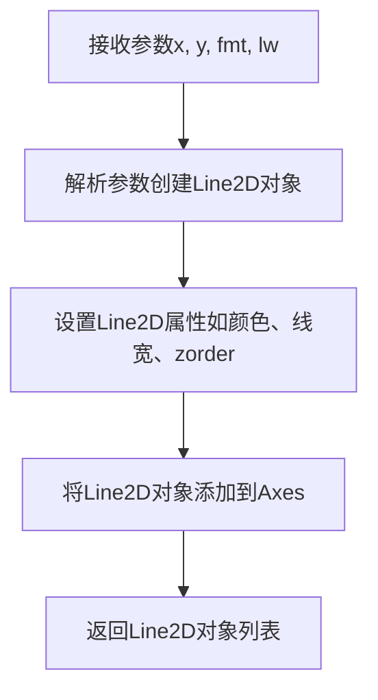

#### 带注释源码

```python
def plot(self, *args, **kwargs):
    """
    在Axes上绑定折线图数据。
    
    参数:
        *args: 可变位置参数，支持以下形式:
            - plot(y): 仅提供y数据
            - plot(x, y): 提供x和y数据
            - plot(x, y, fmt): 提供x、y数据和格式字符串
        **kwargs: 关键字参数，用于设置Line2D属性，如color, linewidth, zorder等。
    
    返回:
        list of Line2D: 返回创建的Line2D对象列表。
    """
    # 初始化线条列表
    lines = []
    
    # 遍历args，每次处理一个数据集（每3个元素为一组：x, y, fmt）
    for i in range(0, len(args), 3):
        # 提取参数
        if i + 2 < len(args):
            # 如果有格式字符串
            x = args[i]
            y = args[i + 1]
            fmt = args[i + 2]
        elif i + 1 < len(args):
            # 如果没有格式字符串
            x = args[i]
            y = args[i + 1]
            fmt = ''
        else:
            # 如果只有一个参数（仅y数据）
            x = np.arange(len(args[i]))
            y = args[i]
            fmt = ''
        
        # 创建Line2D对象
        # Line2D是表示线条的类
        line = Line2D(x, y, fmt, **kwargs)
        
        # 设置线条属性（如线宽、颜色等）
        # kwargs中的属性会被应用到线条上
        self._set_line_props(line, **kwargs)
        
        # 将线条添加到Axes
        self.add_line(line)
        
        # 将线条对象添加到列表
        lines.append(line)
    
    # 自动调整坐标轴范围
    self.autoscale_view()
    
    # 返回线条对象列表
    return lines
```

注意：上述源码为简化版，实际matplotlib中的实现更复杂，支持更多参数和功能。核心逻辑包括解析参数、创建Line2D对象、设置属性、添加到Axes并返回。


### `Axes.scatter`

在 matplotlib 的 Axes 对象上创建散点图，将数据点 (x, y) 绘制为标记，支持自定义点的大小、颜色、透明度、zorder 等属性，用于展示离散数据分布。

参数：

- `x`：`array_like`，X轴坐标数据
- `y`：`array_like`，Y轴坐标数据
- `s`：`float` 或 `array_like`，标记大小（代码中传入 120）
- `zorder`：`float`，绘图层级顺序（代码中 ax2 调用时传入 2.5）

返回值：`PathCollection`，返回创建的散点图对象，可用于后续修改样式或获取数据

#### 流程图

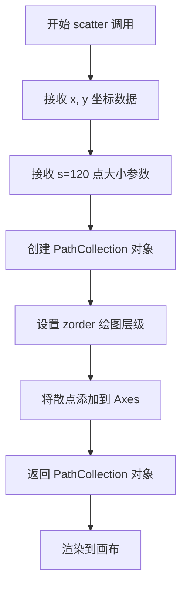

#### 带注释源码

```python
# 在 ax1 上绑定散点图数据
# x, y: 从极坐标转换而来的笛卡尔坐标数据
# s=120: 设置散点的大小为 120 平方点
ax1.scatter(x, y, s=120)

# 对比示例：在 ax2 上设置 zorder=2.5 使散点位于线条之上
ax2.scatter(x, y, s=120, zorder=2.5)
```


### `ax1.set_title`

设置 Axes 对象的标题，用于在子图 ax1 上显示图表标题。

参数：

- `s`：`str`，标题文本内容，例如 'Lines on top of dots'
- `fontdict`：`dict`，可选，用于控制标题外观的字体属性字典（如 fontsize, fontweight, color 等）
- `loc`：`str`，可选，标题对齐方式，可选值为 'center'（默认）、'left'、'right'
- `pad`：`float`，可选，标题与 Axes 顶部的间距（以点为单位），默认值为 None

返回值：`matplotlib.text.Text`，返回设置的标题文本对象，可以进一步用于自定义样式（如设置颜色、字体大小等）。

#### 流程图

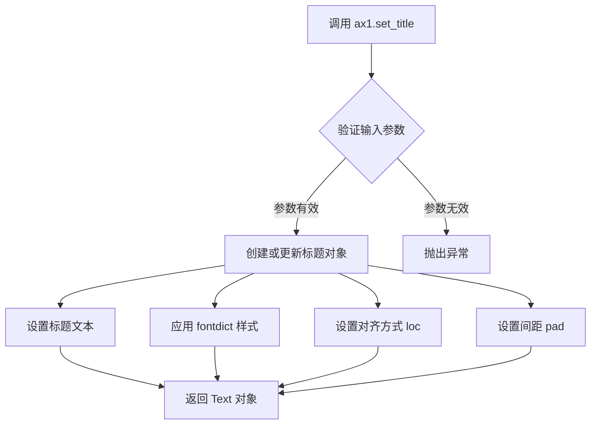

#### 带注释源码

```python
# 在代码中的使用示例
ax1.set_title('Lines on top of dots')

# 等效的完整调用形式（包含可选参数）
ax1.set_title(
    s='Lines on top of dots',          # 标题文本内容
    fontdict=None,                      # 可选：字体属性字典，如 {'fontsize': 12, 'color': 'red'}
    loc='center',                       # 可选：标题对齐方式，'center'|'left'|'right'
    pad=None                            # 可选：标题与轴顶部的间距（点为单位）
)

# 返回值可以用于后续样式设置
title = ax1.set_title('Lines on top of dots')
title.set_fontsize(14)                  # 设置字体大小
title.set_fontweight('bold')            # 设置字体粗细
title.set_color('darkblue')             # 设置字体颜色
```


### `matplotlib.axes.Axes.plot`

在给定的坐标系（ax2）上绑定折线图数据，通过plot方法绘制Line2D对象到Axes中，支持格式字符串和多种Line2D属性参数。

参数：

- `x`：array-like，X轴数据，表示折线图的横坐标值
- `y`：array-like，Y轴数据，表示折线图的纵坐标值
- `fmt`：str，可选，格式字符串（如'C3'表示颜色为第三个颜色，'lw=3'表示线宽为3）
- `**kwargs`：关键字参数，用于传递给Line2D构造函数的属性（如color、linewidth、zorder等）

返回值：`list of ~matplotlib.lines.Line2D`，返回创建的Line2D对象列表

#### 流程图

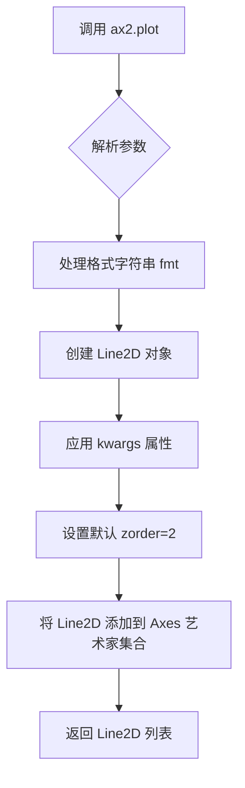

#### 带注释源码

```python
# 在 ax2 上调用 plot 方法绘制折线图
# 参数说明：
#   x: array-like - 正弦波的横坐标数据（从 r*sin(theta) 计算得出）
#   y: array-like - 正弦波的纵坐标数据（从 r*cos(theta) 计算得出）
#   'C3' - 格式字符串，表示使用第三个预定义颜色（红色）
#   lw=3 - 关键字参数，表示线宽为3
ax2.plot(x, y, 'C3', lw=3)

# 内部实现逻辑（简化版）：
# 1. plot 方法接收 (x, y, fmt, **kwargs) 参数
# 2. 将 x, y 转换为 numpy 数组
# 3. 解析格式字符串 'C3'，提取颜色属性
# 4. 合并格式字符串解析结果和 kwargs
# 5. 创建 Line2D(color='C3', linewidth=3, zorder=2, ...) 对象
# 6. 调用 ax2.add_line(line) 将线条添加到坐标系
# 7. 返回包含该 Line2D 的列表 [line]
# 
# 注意：Line2D 的默认 zorder=2，这意味着它会显示在
# PatchCollection（散点，默认zorder=1）之上，
# 但在 Text（zorder=3）之下
```


### `ax2.scatter`（或 `Axes.scatter`）

在 `ax2`（第二个子图的 Axes 对象）上绑定散点图数据，通过 `zorder=2.5` 参数将散点绘制在折线图之上，实现视觉层次的自定义控制。

参数：

- `x`：`numpy.ndarray` 或类似数组类型，散点图的 x 坐标数据，值为 `r * np.sin(theta)`
- `y`：`numpy.ndarray` 或类似数组类型，散点图的 y 坐标数据，值为 `r * np.cos(theta)`
- `s`：`int` 或 `float`，散点的大小（size），此处为 `120`
- `zorder`：`float`，绘图顺序参数，数值越高越晚绘制（显示在最上层），此处为 `2.5`（高于默认折线的 zorder=2）

返回值：`matplotlib.collections.PathCollection`，返回创建的散点图集合对象，可用于后续样式调整或事件绑定。

#### 流程图

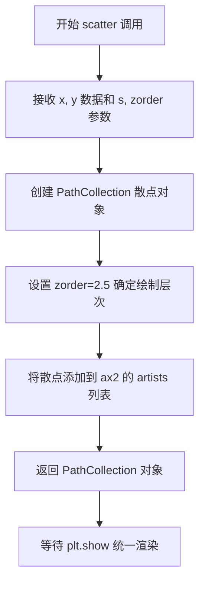

#### 带注释源码

```python
# 从代码中提取的 scatter 调用上下文
fig, (ax1, ax2) = plt.subplots(1, 2, figsize=(6, 3.2))  # 创建 1x2 子图布局

# 第一个子图 ax1：默认 zorder，折线在散点之上
ax1.plot(x, y, 'C3', lw=3)           # 绘制红色折线，zorder=2（默认）
ax1.scatter(x, y, s=120)            # 绘制散点，zorder=2（默认，低于折线）
ax1.set_title('Lines on top of dots')

# 第二个子图 ax2：自定义 zorder，散点在折线之上
ax2.plot(x, y, 'C3', lw=3)           # 绘制红色折线，zorder=2（默认）
ax2.scatter(x, y, s=120, zorder=2.5) # 绘制散点，zorder=2.5（高于折线）
#   └─ 参数 x: 散点 x 坐标数组
#   └─ 参数 y: 散点 y 坐标数组  
#   └─ 参数 s: 散点大小为 120
#   └─ 参数 zorder: 绘制顺序 2.5，散点将显示在折线之上
ax2.set_title('Dots on top of lines')

plt.tight_layout()
# 后续 plt.show() 会按照 zorder 从低到高依次渲染所有 artists
```


### `Axes.set_title`

该方法用于设置坐标轴（Axes）的标题，即坐标轴顶部显示的文本标签。可以自定义标题的字体属性、对齐方式、位置等参数，并返回创建的 `Text` 对象以便进一步自定义。

参数：

- `label`：`str`，标题文本内容，要显示在坐标轴顶部的字符串
- `fontdict`：`dict`，可选，用于控制标题外观的字体属性字典（如 fontsize、fontweight、color 等）
- `loc`：`str`，可选，标题对齐方式，可选值为 'center'（默认）、'left'、'right'
- `pad`：`float`，可选，标题与坐标轴顶部的距离，单位为点（points），默认根据 rcParams 设置
- `y`：`float`，可选，标题的 y 位置，相对于 axes 高度的归一化值（0-1 之间），默认根据 rcParams 设置
- `**kwargs`：关键字参数，可选，其他传递给 `matplotlib.text.Text` 的参数（如 fontsize、fontweight、color、rotation 等）

返回值：`matplotlib.text.Text`，返回创建的 `Text` 对象，可用于进一步自定义标题样式（如设置颜色、字体大小等）

#### 流程图

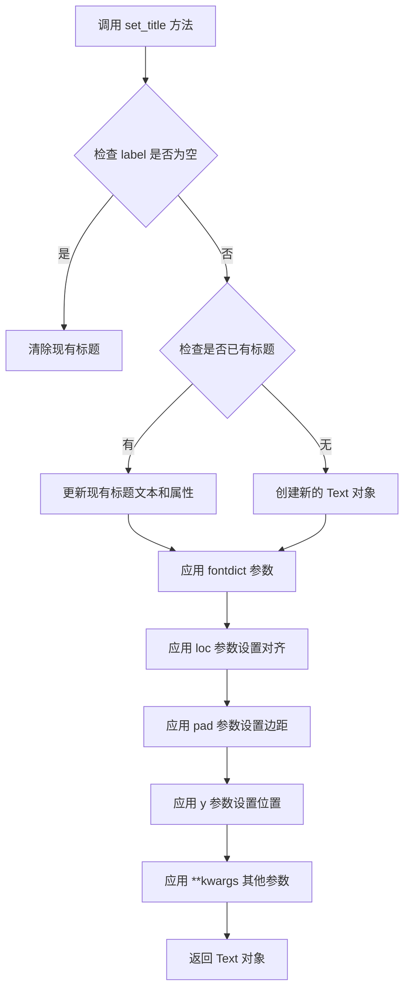

#### 带注释源码

```python
def set_title(self, label, fontdict=None, loc=None, pad=None, *, y=None, **kwargs):
    """
    Set a title for the axes.

    Parameters
    ----------
    label : str
        Text to use for the title.

    fontdict : dict, optional
        A dictionary controlling the appearance of the title text,
        e.g., {'fontsize': 'large', 'fontweight': 'bold', 'color': 'red'}.

    loc : {'center', 'left', 'right'}, default: :rc:`axes.titlelocation`
        How to align the title.

    pad : float, default: :rc:`axes.titlepad`
        The offset of the title from the top of the axes, in points.

    y : float, default: :rc:`axes.titley`
        The y position of the title in axes coordinates.

    **kwargs
        Additional parameters are passed to `~matplotlib.text.Text`.

    Returns
    -------
    `~matplotlib.text.Text`
        The matplotlib text object representing the title.

    Examples
    --------
    >>> ax.set_title('My Title')
    >>> ax.set_title('My Title', fontdict={'fontsize': 12, 'color': 'red'})
    >>> ax.set_title('My Title', loc='left')
    >>> ax.set_title('My Title', pad=20)
    """
    # 获取默认的标题位置参数（如果未指定）
    if loc is None:
        loc = mpl.rcParams['axes.titlelocation']
    if pad is None:
        pad = mpl.rcParams['axes.titlepad']
    if y is None:
        y = mpl.rcParams['axes.titley']

    # 获取或创建标题的 Text 对象
    # _get_text.get_text() 会返回现有的 title 或创建一个新的
    title = self._get_text.get_text(label, 'title', False)
    
    # 如果已存在标题对象则更新，否则创建新的
    if title is not None:
        # 更新现有标题的文本和属性
        title.set_text(label)
        title.set_fontproperties(
            # 从 fontdict 或 kwargs 中提取字体属性
            mpl.font_manager.FontProperties().update(fontdict)
        )
        if fontdict is not None:
            title.update(fontdict)
        title.update(kwargs)
    else:
        # 创建新的 Text 对象
        # x 位置基于 loc 参数：'left'=0, 'center'=0.5, 'right'=1
        x = {'left': 0, 'center': 0.5, 'right': 1}[loc]
        # 创建 Text 对象，y 位置使用传入的 y 值
        title = Text(x=x, y=1.0, text=label, **kwargs)
        # 将 Text 对象添加到 axes 中
        self._add_text(title)

    # 设置标题的垂直位置（相对于 axes 顶部）
    # pad 是标题与 axes 顶部的距离
    title.set_y(1 - pad)
    
    # 如果指定了 y 参数，覆盖默认位置
    if y is not None:
        title.set_y(y)

    # 返回 Text 对象供进一步自定义
    return title
```


### plt.tight_layout

调整图形中的子图布局，使子图之间的间距和图形边缘的间距自动适应，以确保布局紧凑且不重叠。

参数：
- `pad`：float，默认1.08。图形边缘与子图标题、标签等之间的额外间距，以字体大小的倍数表示。
- `h_pad`：float或None，默认None。子图之间的垂直间距。如果为None，则使用pad的值。
- `w_pad`：float或None，默认None。子图之间的水平间距。如果为None，则使用pad的值。
- `rect`：tuple of 4 floats，默认(0, 0, 1, 1)。指定调整布局的区域，格式为(left, bottom, right, top)，每个值在0到1之间。

返回值：None，该函数没有返回值，直接修改当前图形的布局。

#### 流程图

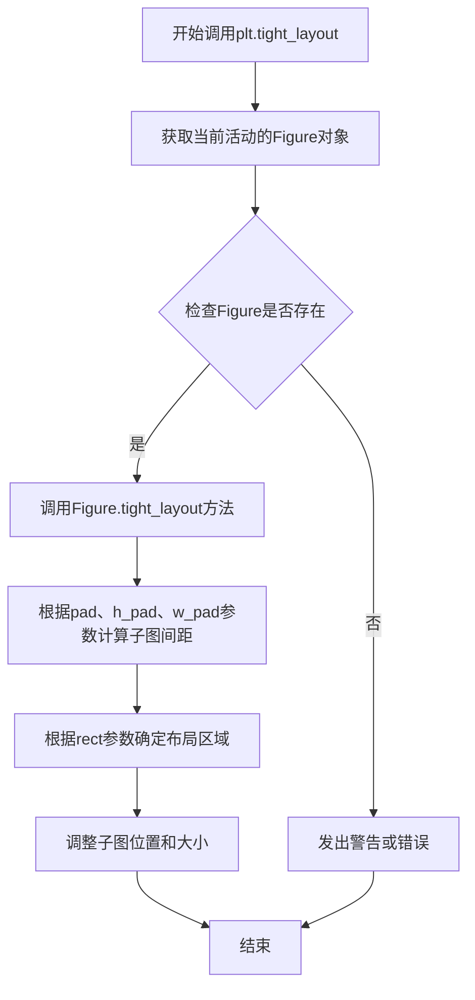

#### 带注释源码

```python
def tight_layout(pad=1.08, h_pad=None, w_pad=None, rect=(0, 0, 1, 1)):
    """
    自动调整子图的布局参数，使子图之间的间距和图形边缘的间距适配。
    
    此函数是matplotlib.pyplot模块中的顶层接口，它获取当前活动的Figure对象，
    并调用该对象的tight_layout方法来执行实际的布局调整。
    
    参数:
        pad (float, optional): 图形边缘与子图之间的额外间距，默认为1.08。
                               该值以当前字体大小的倍数表示。
        h_pad (float, optional): 子图之间的最小垂直间距。如果为None，则使用pad的值。
        w_pad (float, optional): 子图之间的最小水平间距。如果为None，则使用pad的值。
        rect (tuple, optional): 一个包含4个浮点数的元组，指定进行布局调整的区域
                                (左, 下, 右, 上)，每个值的范围是0到1。默认值为(0, 0, 1, 1)，
                                表示整个图形区域。
    
    返回值:
        None: 此函数不返回任何值，它直接修改当前图形的布局。
    
    示例:
        >>> import matplotlib.pyplot as plt
        >>> plt.figure()
        >>> plt.plot([1, 2, 3])
        >>> plt.tight_layout()  # 调整布局
        >>> plt.show()
    """
    # 获取当前活动的Figure对象，如果不存在则创建一个
    fig = plt.gcf()
    
    # 调用Figure对象的tight_layout方法，传入相同的参数
    # Figure.tight_layout方法会遍历所有子图，计算合适的间距和位置
    fig.tight_layout(pad=pad, h_pad=h_pad, w_pad=w_pad, rect=rect)
```


### `plt.figure`

创建并返回一个新的 Figure 对象（图形窗口）。该函数是 matplotlib 库的核心函数之一，用于初始化一个空白画布，后续的绘图操作（如 `plot()`, `scatter()`, `axhline()` 等）都将在此 Figure 对象上进行。如果未指定参数，将使用默认配置创建一个标准尺寸的图形窗口。

参数：

- `figsize`：`tuple of (float, float)`，可选参数，指定图形的宽和高（英寸），例如 (8, 6) 表示宽8英寸、高6英寸。默认值为 `rcParams["figure.figsize"]`
- `dpi`：`float`，可选参数，指定图形的分辨率（每英寸点数）。默认值为 `rcParams["figure.dpi"]`
- `facecolor`：`str` 或 `tuple`，可选参数，图形背景颜色。默认值为 `rcParams["figure.facecolor"]`
- `edgecolor`：`str` 或 `tuple`，可选参数，图形边框颜色。默认值为 `rcParams["figure.edgecolor"]`
- `frameon`：`bool`，可选参数，是否显示图形的边框框架。默认为 True
- `num`：`int` 或 `str` 或 `matplotlib.figure.Figure`，可选参数，用于标识图形对象的编号或名称。如果指定编号的图形已存在，则激活该图形而不是创建新图形
- `clear`：`bool`，可选参数，如果图形已存在且 `num` 指定了该图形，是否清除其内容。默认为 False

返回值：`matplotlib.figure.Figure`，返回创建的 Figure 对象实例，该对象代表整个图形窗口，可用于添加子图（Axes）、设置属性、保存图形等操作

#### 流程图

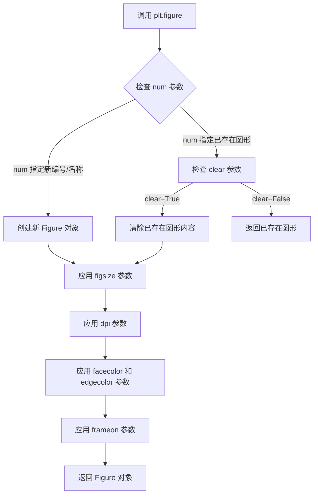

#### 带注释源码

```python
# plt.figure 函数位于 matplotlib.pyplot 模块中
# 以下为函数调用示例及参数说明

# 示例1：无参数调用，使用默认配置创建图形
plt.figure()

# 示例2：指定图形尺寸和分辨率
plt.figure(figsize=(8, 6), dpi=100)

# 示例3：指定背景色和边框色
plt.figure(facecolor='white', edgecolor='black')

# 示例4：使用 num 参数管理多个图形
fig1 = plt.figure(num=1)
fig2 = plt.figure(num=2)
# 再次调用 num=1 会返回已存在的图形而不是创建新图形
fig1_again = plt.figure(num=1)

# 示例5：结合其他绘图函数使用
plt.figure(figsize=(10, 6))
plt.plot([1, 2, 3], [1, 4, 9])
plt.title("Example Plot")
plt.show()
```


### `plt.plot`

plt.plot 是 matplotlib 库中用于在图表上绘制线条的函数，支持通过 zorder 参数控制绘图元素的绘制顺序，zorder 值越高的元素将绘制在其他元素之上。

参数：
- `x`：array-like，x 轴数据
- `y`：array-like，y 轴数据
- `formatstring`：str，可选的格式化字符串（如颜色、线型标记），示例代码中为 `'C3'` 表示使用第三个颜色
- `label`：str，图例标签，用于图例显示
- `zorder`：float，绘图元素的绘制顺序，值越高越晚绘制（显示在最上层），示例代码中设置为 2、3 等值
- `lw`：float，线条宽度，示例代码中为 3 或 5

返回值：list of `~matplotlib.lines.Line2D`，返回创建的线条对象列表

#### 流程图

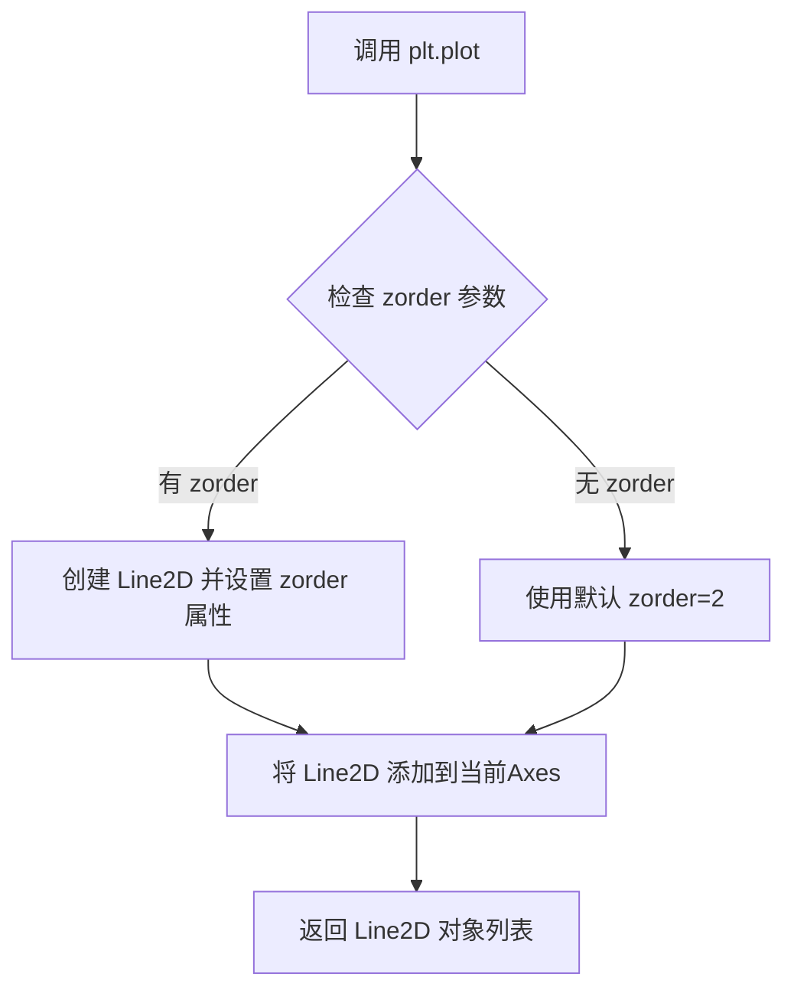

#### 带注释源码

```python
# 示例代码中 plt.plot 的使用方式

# 子图1：使用默认 zorder (Line2D 默认 zorder=2)
ax1.plot(x, y, 'C3', lw=3)

# 子图2：zorder 未显式设置，默认为 2
ax2.plot(x, y, 'C3', lw=3)

# 新建图表：绘制正弦波，设置 zorder=2 (在底层)
plt.plot(x, np.sin(x), label='zorder=2', zorder=2)

# 绘制正弦波，设置 zorder=3 (在顶层，在 zorder=2 之上)
plt.plot(x, np.sin(x+0.5), label='zorder=3', zorder=3)

# 绘制水平线，设置 zorder=2.5 (在中间层级)
plt.axhline(0, label='zorder=2.5', color='lightgrey', zorder=2.5)

# zorder 优先级示例：
# Images: 0 → Patch: 1 → Line2D: 2 → Major ticks: 2.01 → Text: 3 → Legend: 5
# 因此设置 zorder=2.5 的水平线会显示在 zorder=2 的线条之上，zorder=3 的线条之下
```


### `plt.axhline`

`plt.axhline` 是 matplotlib.pyplot 模块中的函数，用于在当前图表的 Axes 上绘制水平线。该函数接受多个参数来控制线条的位置、样式和绘制顺序，其中 `zorder` 参数用于指定绘制层次顺序，值越大的元素会被绘制在值越小的元素之上。

参数：

- `y`：`float`，默认值 0.5，水平线的 y 坐标位置
- `xmin`：`float`，默认值 0，线条起始的 x 位置（相对于 axes 宽度的比例，范围 0-1）
- `xmax`：`float`，默认值 1，线条结束的 x 位置（相对于 axes 宽度的比例，范围 0-1）
- `**kwargs`：可选的关键字参数，用于设置线条样式，常用参数包括：
  - `color` 或 `c`：线条颜色
  - `linestyle` 或 `ls`：线条样式（如 '-'，'--'，':'，'-.'）
  - `linewidth` 或 `lw`：线条宽度
  - `zorder`：绘制顺序（浮点数），值越大越晚绘制
  - `label`：图例标签

返回值：`matplotlib.lines.Line2D`，返回创建的 Line2D 对象，可以通过该对象进一步修改线条属性

#### 流程图

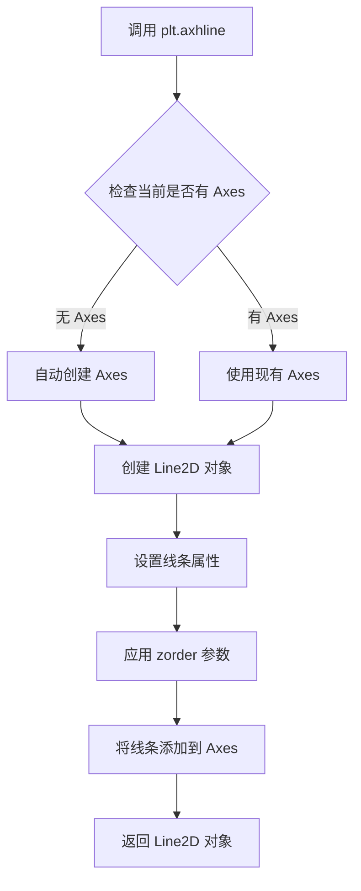

#### 带注释源码

```python
def axhline(y=0.5, xmin=0, xmax=1, **kwargs):
    """
    在当前 Axes 上添加一条水平线。
    
    参数:
        y (float): 水平线的 y 坐标位置，默认 0.5
        xmin (float): 线条起始位置（相对于 axes 宽度的比例），默认 0
        xmax (float): 线条结束位置（相对于 axes 宽度的比例），默认 1
        **kwargs: 其他关键字参数，会传递给 Line2D 构造函数
                  常用参数包括：
                  - color: 线条颜色
                  - linestyle: 线条样式
                  - linewidth: 线条宽度
                  - zorder: 绘制顺序（数值越大越晚绘制）
                  - label: 图例标签
    
    返回:
        Line2D: 创建的水平线对象
    """
    # 获取当前 Axes 对象，如果不存在则自动创建
    ax = gca()
    
    # 验证参数范围
    if xmin < 0 or xmax > 1 or xmin > xmax:
        raise ValueError("xmin and xmax must be between 0 and 1")
    
    # 辅助函数：将相对坐标转换为数据坐标
    def _transform_xy(x, y, ax):
        # 将相对坐标 xmin/xmax 转换为实际数据坐标
        xdata = x * (ax.xaxis.get_view_interval()[1] - ax.xaxis.get_view_interval()[0]) + ax.xaxis.get_view_interval()[0]
        return xdata, y
    
    # 计算实际的 x 坐标
    xmin_data, y = _transform_xy(xmin, y, ax)
    xmax_data, y = _transform_xy(xmax, y, ax)
    
    # 创建 Line2D 对象
    # 注意：zorder 参数在这里传递给 Line2D
    line = Line2D([xmin_data, xmax_data], [y, y], **kwargs)
    
    # 将线条添加到 Axes
    ax.add_line(line)
    
    # 自动调整视图范围以显示线条
    ax.autoscale_view()
    
    return line
```

#### 使用示例（来自代码）

```python
import matplotlib.pyplot as plt
import numpy as np

# 创建正弦波数据
x = np.linspace(0, 7.5, 100)

# 绘制两条正弦曲线，设置不同的 zorder
plt.plot(x, np.sin(x), label='zorder=2', zorder=2)      # 底层
plt.plot(x, np.sin(x+0.5), label='zorder=3', zorder=3)  # 顶层

# 绘制水平线，设置 zorder=2.5，使其位于两层曲线之间
plt.axhline(0, label='zorder=2.5', color='lightgrey', zorder=2.5)

# 设置图例，zorder=2.5 位于蓝色和橙色线之间
plt.title('Custom order of elements')
l = plt.legend(loc='upper right')
l.set_zorder(2.5)  # legend between blue and orange line

plt.show()
```


### `plt.title`

设置图形的标题文本，用于在图表顶部显示标题信息，支持自定义字体样式、对齐方式和位置。

参数：

- `label`：`str`，要显示的标题文本内容
- `fontdict`：`dict`，可选，字体属性字典，用于控制标题的字体大小、颜色等样式
- `loc`：`str`，可选，标题对齐方式，可选值为 'left'、'center'、'right'，默认为 'center'
- `pad`：`float`，可选，标题与 Axes 顶部的间距（以点为单位）
- `y`：`float`，可选，标题在 y 轴方向上的相对位置
- `**kwargs`：其他关键字参数传递给 `matplotlib.text.Text` 对象

返回值：`matplotlib.text.Text`，返回创建的 Text 文本对象，可用于后续样式修改

#### 流程图

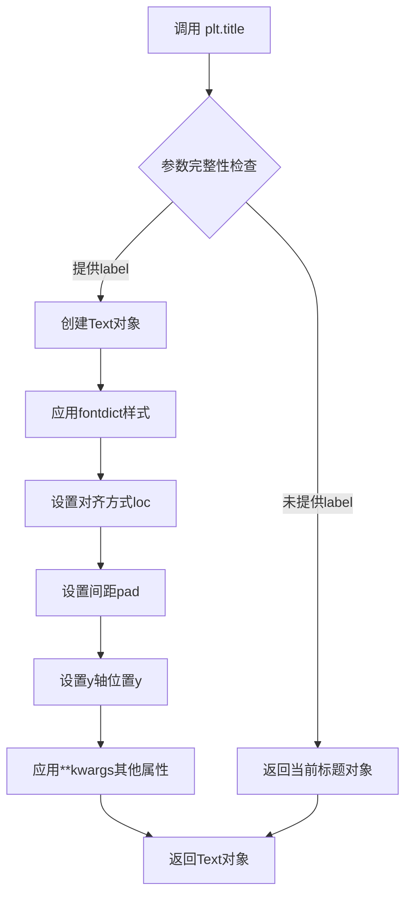

#### 带注释源码

```python
def title(label, fontdict=None, loc=None, pad=None, *, y=None, **kwargs):
    """
    Set a title for the Axes.
    
    Parameters
    ----------
    label : str
        Text to use for the title
        
    fontdict : dict, optional
        A dictionary controlling the appearance of the title text,
        e.g., {'fontsize': 16, 'fontweight': 'bold', 'color': 'red'}
        
    loc : {'left', 'center', 'right'}, default: rcParams['axes.titlelocation']
        Which title to set
        
    pad : float, default: rcParams['axes.titlepad']
        The offset of the title from the top of the Axes, in points
        
    y : float, default: rcParams['axes.titley']
        The y position of the title in Axes fraction
        
    **kwargs
        Text properties control the appearance of the title.
        
    Returns
    -------
    Text
        The matplotlib text instance representing the title
        
    Examples
    --------
    >>> ax.set_title('My Title')
    >>> ax.set_title('Custom Title', fontdict={'fontsize': 20})
    >>> ax.set_title('Left Title', loc='left')
    """
    return gca().set_title(label, fontdict=fontdict, loc=loc, pad=pad, y=y, **kwargs)
```


### `plt.legend`

向当前图表添加图例，用于显示线条、点或填充区域的标签说明。该函数创建并返回一个 `Legend` 对象，可通过返回的对象进一步自定义图例属性（如 zorder）。

参数：

-  `*args`：可变位置参数，支持多种调用方式：
    - 无参数：自动从 plot 的 label 属性中获取图例项
    - 字符串列表：手动指定每个图例项的标签
    - 图形元素列表：手动指定要添加到图例的艺术家对象
-  `loc`：str 或 int，图例位置，如 `'upper right'`、`'lower left'`、数字代码（0-10）等
-  `bbox_to_anchor`：tuple，图例框的锚定位置，格式为 (x, y, width, height)
-  `ncol`：int，图例列数
-  `prop`：dict 或 `matplotlib.font_manager.FontProperties`，图例文本字体属性
-  `fontsize`：int 或 float，图例文字大小
-  `labelcolor`：str 或 list，图例标签颜色
-  `title`：str，图例标题
-  `title_fontsize`：int，图例标题字体大小
-  `frameon`：bool，是否绘制图例边框
-  `framealpha`：float，图例背景透明度
-  `fancybox`：bool，是否使用圆角边框
-  `shadow`：bool，是否添加阴影
-  `frameon`：bool，是否显示图例边框
-  `numpoints`：int，线型图例标记的点数
-  `scatterpoints`：int，散点图例标记的点数
-  `markerscale`：float，图例标记的缩放比例
-  `handler_map`：dict，自定义处理程序映射

返回值：`matplotlib.legend.Legend`，图例对象，可进一步设置属性

#### 流程图

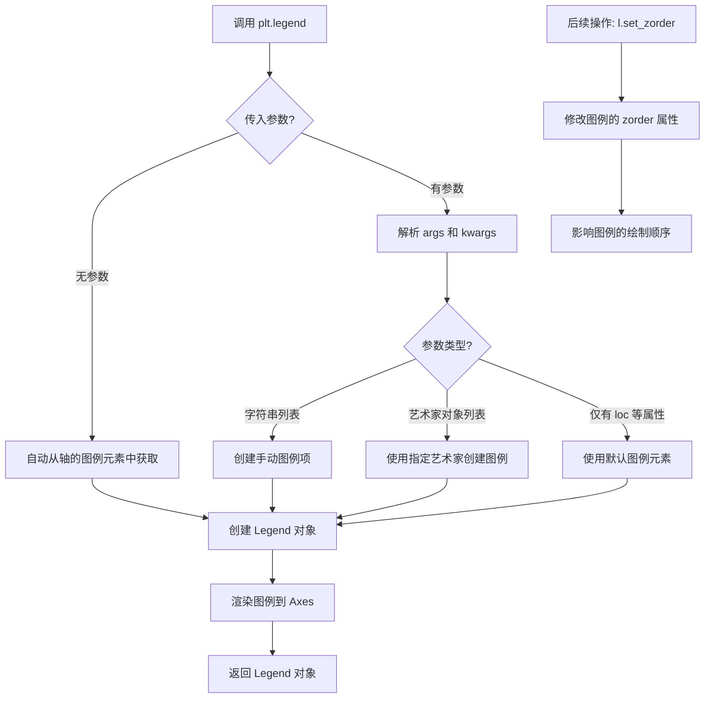

#### 带注释源码

```python
# plt.legend 函数源码结构（matplotlib 内部实现逻辑）

def legend(*args, **kwargs):
    """
    在 Axes 上添加图例。
    
    调用方式:
        legend() - 自动从线条标签获取
        legend(labels) - 手动设置标签
        legend(handles, labels) - 手动设置句柄和标签
        legend(handles) - 使用指定艺术家
    """
    
    # Step 1: 获取当前 axes
    # 如果没有当前 axes，创建一个
    ax = gca()  # get current axes
    
    # Step 2: 解析参数
    # args 可以是:
    #   - 空: 自动从 ax.get_legend_handles_labels() 获取
    #   - (labels,): 字符串列表
    #   - (handles, labels): 艺术家和标签
    #   - (handles,): 仅艺术家
    
    # Step 3: 创建 Legend 对象
    # legend = Legend(ax, handles, labels, **kwargs)
    
    # Step 4: 添加到 axes
    # ax.add_artist(legend)
    
    # Step 5: 返回 Legend 实例
    # return legend


# 在示例代码中的实际使用:
l = plt.legend(loc='upper right')  # 创建图例并返回 Legend 对象 l
l.set_zorder(2.5)  # 通过返回的对象修改 zorder，控制绘制顺序
```

```python
# 从代码中提取的具体调用示例:

# 1. 创建图例 - 使用现有 plot/axhline 的 label 参数
plt.plot(x, np.sin(x), label='zorder=2', zorder=2)
plt.plot(x, np.sin(x+0.5), label='zorder=3', zorder=3)
plt.axhline(0, label='zorder=2.5', color='lightgrey', zorder=2.5)
plt.title('Custom order of elements')
l = plt.legend(loc='upper right')  # loc='upper right' 指定图例位置为右上角

# 2. 创建后修改 - 通过返回的 Legend 对象进一步定制
l.set_zorder(2.5)  # 设置图例的 zorder 为 2.5，使其位于蓝色和橙色线之间

# 3. 显示图表
plt.show()
```

#### 关键组件信息

| 名称 | 描述 |
|------|------|
| `Legend` | matplotlib 的图例类，负责图例的渲染和属性管理 |
| `zorder` | 浮点数属性，控制艺术家（图形元素）的绘制顺序，值越大越晚绘制 |
| `loc` | 字符串或整数，指定图例预定义位置（如 'upper right', 'lower left'） |
| `set_zorder()` | Legend 对象的方法，用于设置图例的 zorder 值 |

#### 潜在技术债务或优化空间

1. **参数冗余**: `legend()` 函数支持多种调用方式（位置参数的不同解释），可能导致 API 使用混淆，建议统一调用接口
2. **自动图例检测开销**: 每次调用无参 `legend()` 时需要遍历所有艺术家获取句柄和标签，可考虑缓存机制
3. **zorder 语义不一致**: 不同类型艺术家的默认 zorder 值分散在代码各处（0-5），缺乏统一管理，建议使用枚举或常量类

#### 其它项目

**设计目标与约束**:
- 图例应清晰标识图表中各数据系列的含义
- 支持手动和自动两种模式创建图例
- 图例位置应灵活可调，避免遮挡数据

**错误处理与异常**:
- 当传入空 label 时，该系列不会出现在图例中
- 当指定不存在的 loc 值时，默认回退到 'best'
- 当 handles 和 labels 数量不匹配时，抛出 ValueError

**数据流与状态机**:
```
Plot 创建 → 添加 label → 调用 legend() → 解析参数 → 
创建 Legend 对象 → 渲染到 Axes → 返回 Legend 引用 → 
可选: 通过返回对象修改属性 (如 set_zorder)
```

**外部依赖与接口契约**:
- 依赖 `matplotlib.axes.Axes` 对象
- 依赖 `matplotlib.legend.Legend` 类
- 依赖 `matplotlib.artist.Artist` 的 zorder 属性系统


### Legend.set_zorder

这是设置图例 zorder（绘制顺序）的方法，用于控制图例在所有艺术家（Artist）中的相对绘制层次。zorder 值越高，图例越在上层绘制；zorder 值越低，图例越在下层绘制。

参数：
- `zorder`：`float`，图例的 zorder 值。数值越高，图例越在上层绘制；数值越低，图例越在下层绘制。默认值为 5。

返回值：`None`，该方法直接修改对象的内部状态，不返回任何值。

#### 流程图

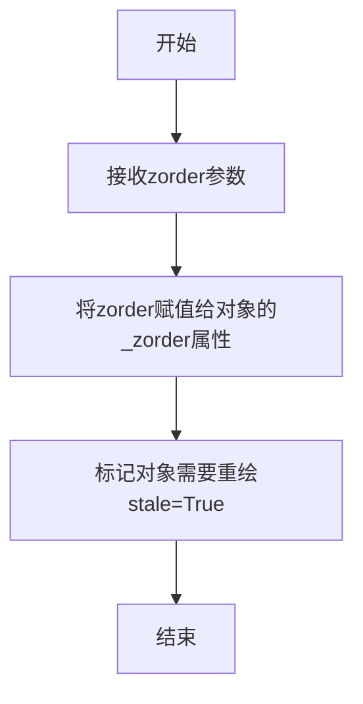

#### 带注释源码

```python
def set_zorder(self, zorder):
    """
    设置图例的zorder（绘制顺序）。

    参数:
        zorder: float，图例的zorder值。数值越高，图例越在上层绘制。
               默认值为5，对应Legend在Artist类型中的默认zorder。

    返回值:
        无（None）。该方法直接修改对象的内部状态。
    """
    # 将传入的zorder值存储到对象的私有属性_zorder中
    # _zorder属性决定了图例在绘制时的层次顺序
    self._zorder = zorder

    # 标记该图例对象需要重新绘制
    # stale属性为True时，matplotlib会在下次渲染时重新绘制该对象
    self.stale = True
```


### `plt.show`

`plt.show` 是 matplotlib.pyplot 模块中的全局函数，用于显示所有当前已创建但尚未显示的图形窗口，并将控制权交给图形窗口的事件循环。在阻塞模式下，该函数会等待用户关闭所有窗口后才会返回；在非阻塞模式下，它会立即返回。

参数：

- `block`：可选的布尔值参数，用于控制函数是否阻塞程序执行。当设置为 `True` 时，函数会阻塞直到用户关闭图形窗口；当设置为 `False` 时，函数立即返回（如果后端支持）。默认值为 `None`，表示根据当前后端的默认行为决定。

返回值：`None`，该函数不返回任何值。

#### 流程图

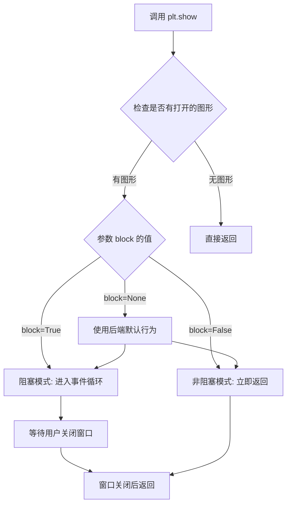

#### 带注释源码

```python
# plt.show 函数的简化实现逻辑（基于 matplotlib 源码概念）
def show(block=None):
    """
    显示所有打开的图形窗口。
    
    参数:
        block: bool, optional
            控制是否阻塞程序执行。
            - True: 阻塞直到所有窗口关闭
            - False: 立即返回（非阻塞）
            - None: 使用后端的默认值（通常为 True）
    """
    
    # 获取当前活动的后端
    backend = matplotlib.get_backend()
    
    # 检查是否有可显示的图形
    # matplotlib 维护一个图形列表，存储所有通过 plt.figure() 创建的图形
    open_figures = [fig for fig in matplotlib.pyplot._all_figures if fig.canvas is not None]
    
    if not open_figures:
        # 如果没有打开的图形，直接返回
        return
    
    # 处理 block 参数
    if block is None:
        # 根据交互模式和后端类型决定是否阻塞
        # 在交互式后端（如 ipython）中通常不阻塞
        # 在非交互式后端（如Agg）中通常阻塞
        block = matplotlib.is_interactive() and backend in ['TkAgg', 'Qt5Agg', 'GTK3Agg']
    
    # 调用后端的 show 方法
    # 每个后端（Qt, Tk, GTK 等）有自己的实现
    for fig in open_figures:
        fig.canvas.show()  # 刷新画布内容
        fig.canvas.draw_idle()  # 标记需要重新绘制
    
    if block:
        # 进入阻塞模式，启动事件循环
        # 这会启动 GUI 框架的主循环，等待用户交互
        # 在 Tk 后端中，这相当于调用 mainloop()
        matplotlib.pyplot._lock_unlock()
        # 等待窗口关闭的逻辑由 GUI 框架处理
        # ...
    else:
        # 非阻塞模式，立即返回
        # 图形窗口保持打开，但程序继续执行
        pass
    
    # 函数返回 None
    return None
```

#### 附加说明

**设计目标与约束**：
- `plt.show` 的主要设计目标是提供一种统一的方式来显示所有图形，无论底层使用的是哪种 GUI 后端
- 该函数必须与多种后端（Qt、Tk、GTK、macOS 等）兼容

**错误处理**：
- 如果没有可用的图形窗口后端，可能会抛出 `RuntimeError`
- 如果指定的 block 参数不被当前后端支持，可能会被忽略

**外部依赖**：
- 依赖于具体的后端实现（如 `matplotlib.backends.backend_qt5.Qt5Agg`）
- 依赖于 GUI 框架的事件循环机制

**使用示例**（来自代码文件）：

```python
# 在示例代码的最后，调用 plt.show() 显示所有图形
plt.show()  # 显示包含两个子图的图形和一个包含正弦波的图形
```


### `np.linspace`

生成等间距的数组，用于在指定的间隔内返回均匀间隔的样本。

参数：

- `start`：`float`，序列的起始值
- `stop`：`float`，序列的结束值（当`endpoint`为True时包含该值）
- `num`：`int`（可选），默认为50，生成样本的数量
- `endpoint`：`bool`（可选），默认为True，如果为True，则stop是最后一个样本，否则不包括在内
- `retstep`：`bool`（可选），默认为False，如果为True，则返回(`samples`, `step`)，其中step是样本之间的间距
- `dtype`：`dtype`（可选），输出数组的类型，如果未指定，则从输入推断

返回值：`ndarray`，如果`retstep`为False，则返回均匀间隔的样本数组；否则返回包含样本和步长的元组

#### 流程图

```mermaid
flowchart TD
    A[开始] --> B{输入参数验证}
    B --> C[计算步长 step = (stop - start) / (num - 1)]
    B --> D[计算步长 step = (stop - start) / num]
    C --> E{retstep=True?}
    D --> E
    E -->|是| F[返回 samples 和 step 元组]
    E -->|否| G[返回 samples 数组]
    F --> H[结束]
    G --> H
```

#### 带注释源码

```python
# 代码中使用 np.linspace 的三个示例：

# 示例1：生成从0.3到1的30个等间距值
r = np.linspace(0.3, 1, 30)
# start=0.3, stop=1, num=30
# 步长 = (1-0.3)/(30-1) ≈ 0.0241

# 示例2：生成从0到4π的30个等间距值
theta = np.linspace(0, 4*np.pi, 30)
# start=0, stop=4π, num=30

# 示例3：生成从0到7.5的100个等间距值（用于正弦波绘图）
x = np.linspace(0, 7.5, 100)
# start=0, stop=7.5, num=100
# 用于后续的 np.sin(x) 计算和绑图
```

#### 实际调用分析

在给定的代码中，`np.linspace`被调用了三次，每次调用都遵循相同的模式：

1. **第一次调用** (`r = np.linspace(0.3, 1, 30)`)
   - 用途：生成半径数组，用于极坐标转换
   - 参数：start=0.3, stop=1, num=30
   - 返回：包含30个元素的numpy数组

2. **第二次调用** (`theta = np.linspace(0, 4*np.pi, 30)`)
   - 用途：生成角度数组，用于极坐标转换
   - 参数：start=0, stop=4π, num=30
   - 返回：包含30个元素的numpy数组

3. **第三次调用** (`x = np.linspace(0, 7.5, 100)`)
   - 用途：生成x坐标数组，用于绘制正弦波
   - 参数：start=0, stop=7.5, num=100
   - 返回：包含100个元素的numpy数组


### `np.sin`

计算输入数组或标量的正弦值。

参数：

-  `x`：`ndarray` 或 `float`，输入角度（以弧度为单位）

返回值：`ndarray` 或 `float`，输入角度的正弦值

#### 流程图

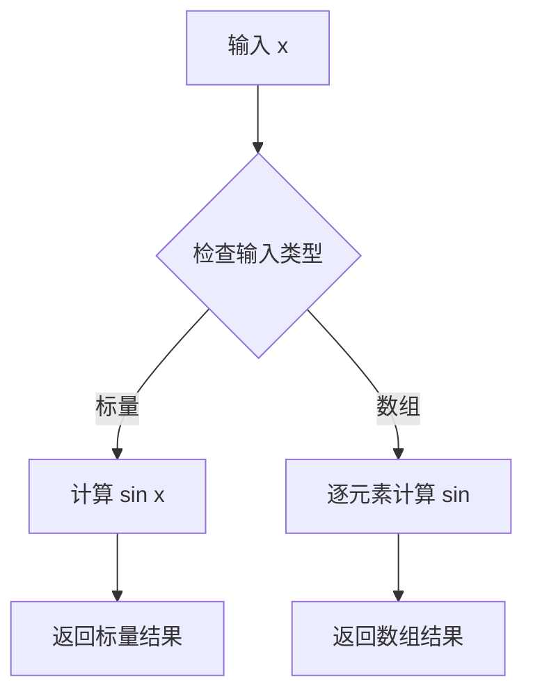

#### 带注释源码

```python
# 代码中调用 np.sin 的示例
x = np.linspace(0, 7.5, 100)
plt.plot(x, np.sin(x), label='zorder=2', zorder=2)

# 参数说明：
# x: 从 0 到 7.5 的 100 个等间距点（弧度值）
# np.sin: 计算这些角度的正弦值

# 返回值：
# 返回与 x 形状相同的数组，包含对应角度的正弦值
```


## 关键组件


### Z-Order渲染控制系统

该代码演示了Matplotlib中zorder属性如何控制不同绘图元素（图像、补丁、线条、文本、图例等）的绘制顺序，通过浮点数确定元素的前后遮挡关系。

### Line2D对象

通过`plt.plot()`或`ax.plot()`创建的2D线条对象，默认zorder=2，支持通过参数或`set_zorder()`方法显式设置渲染层次。

### PatchCollection对象

通过`ax.scatter()`创建的散点集合对象，默认zorder=1（低于Line2D），可通过zorder参数提升到线条之上渲染。

### Axes容器

Matplotlib的坐标轴容器，管理多个artist的绘制，支持`set_axisbelow()`方法批量控制刻度线和网格线的渲染顺序。

### 渲染层次预定义表

代码中定义了六层默认zorder值：Image(0) < Patch(1) < Line2D/LineCollection(2) < Major ticks(2.01) < Text(3) < Legend(5)。

### 图例(Legend)对象

通过`plt.legend()`或`ax.legend()`创建，默认zorder=5（最高层），可通过`set_zorder()`方法调整到任意两层之间。

### 图形窗口管理

使用`plt.subplots()`和`plt.figure()`创建图形窗口，`plt.tight_layout()`自动调整子图布局以防止标签重叠。


## 问题及建议


### 已知问题

-   **全局变量滥用**：大量使用全局变量（r, theta, x, y, fig, ax1, ax2等），未进行封装，降低了代码可维护性和可测试性
-   **魔法数字硬编码**：zorder值（如2.5, 2.01, 3）以硬编码形式散布在代码中，缺乏常量定义，降低了可读性和可维护性
-   **全局状态修改**：使用`plt.rcParams['lines.linewidth'] = 5`修改全局配置，可能对同一程序中其他图表产生副作用
-   **重复代码模式**：两处子图创建代码结构高度相似（plot+scatter+set_title），可提取为复用函数
-   **缺乏输入验证**：没有任何参数校验，如数组维度检查、数值范围验证等
-   **无类型注解**：代码完全缺少Python类型提示，降低了代码可读性和IDE支持
-   **缺乏函数级文档**：除了文件级docstring外，没有为代码块提供函数/方法级别的文档说明
-   **资源管理不完善**：未显式关闭figure对象，在长期运行环境中可能导致资源泄漏

### 优化建议

-   将相关代码封装到函数中（如`create_comparison_plot()`, `create_custom_order_plot()`），传递参数而非依赖全局变量
-   定义zorder常量类或枚举，提升语义化程度：`class ZOrder: LINE=2, DOT=2.5, LEGEND=2.5`
-   使用`with plt.rc_context({'lines.linewidth': 5}):`代替全局修改，或在函数结束时恢复原值
-   使用`matplotlib.figure.constrained_layout`替代`tight_layout`（新版推荐）
-   添加类型注解：`def create_comparison_plot(x: np.ndarray, y: np.ndarray) -> tuple[plt.Figure, tuple[plt.Axes, plt.Axes]]:`
-   使用`with plt.style.context():`或函数级rcParams修改隔离样式变化
-   考虑使用面向对象方式封装图表创建逻辑，提高代码复用性


## 其它


### 设计目标与约束

本代码演示matplotlib中zorder属性的使用方法，展示不同artist的默认zorder值以及如何通过设置zorder自定义绘制顺序。约束包括：需要matplotlib 3.0+版本支持，需导入numpy进行数值计算。

### 错误处理与异常设计

本演示代码未包含复杂的错误处理机制。潜在的异常情况包括：numpy数组维度不匹配时会导致绘图异常；matplotlib后端不支持时会抛出BackendError；图形窗口关闭时plt.show()会正常返回。

### 数据流与状态机

数据流：r/theta数组 → x/y坐标计算 → matplotlib axes对象 → 图形渲染。状态机：plt.subplots()创建画布 → 绘图指令(Plot/Scatter) → set_zorder()调整层级 → plt.show()渲染输出。

### 外部依赖与接口契约

外部依赖：matplotlib.pyplot(绘图框架)、numpy(数值计算)。接口契约：plot()方法返回Line2D对象，scatter()返回PathCollection对象，均支持set_zorder()方法；plt.legend()返回Legend对象也支持set_zorder()。

### 性能考虑

本代码为演示性质，性能不是主要关注点。实际应用中大量数据点时，scatter()的s参数(点大小)会影响渲染性能；zorder本身不影响计算性能，仅影响渲染顺序。

### 安全性考虑

本代码无用户输入，无安全风险。不涉及文件操作、网络请求或敏感数据处理。

### 测试策略

作为演示代码，无自动化测试。手动验证方式：运行代码观察两个子图的绘制顺序差异，以及图例在三条线之间的位置是否符合zorder设置。

### 部署配置

无需特殊部署配置。运行环境需安装matplotlib和numpy库，建议通过conda或pip安装：pip install matplotlib numpy

    