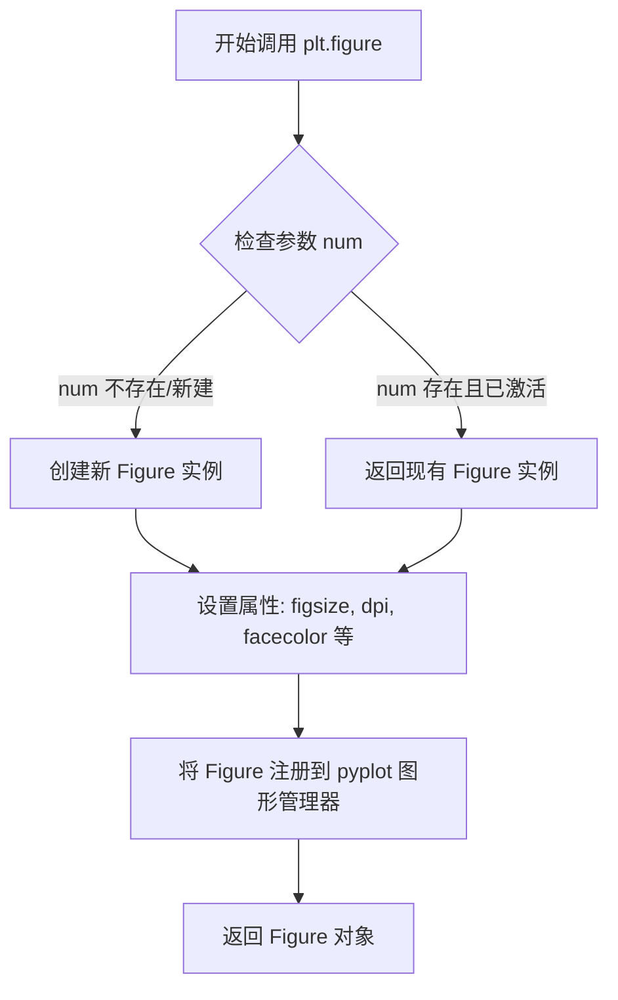
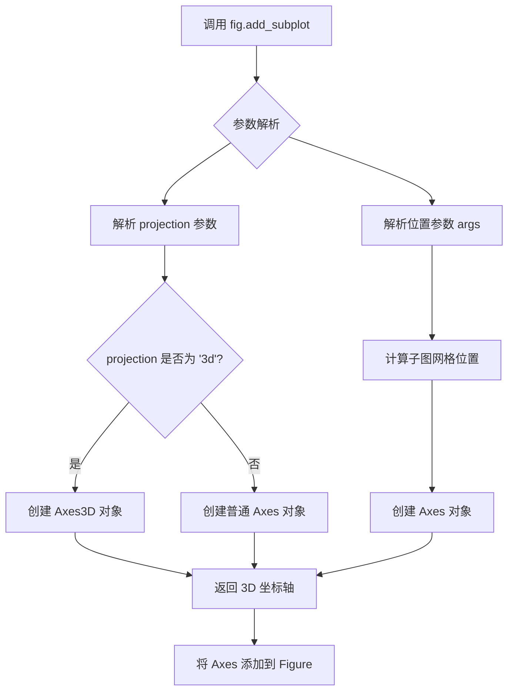
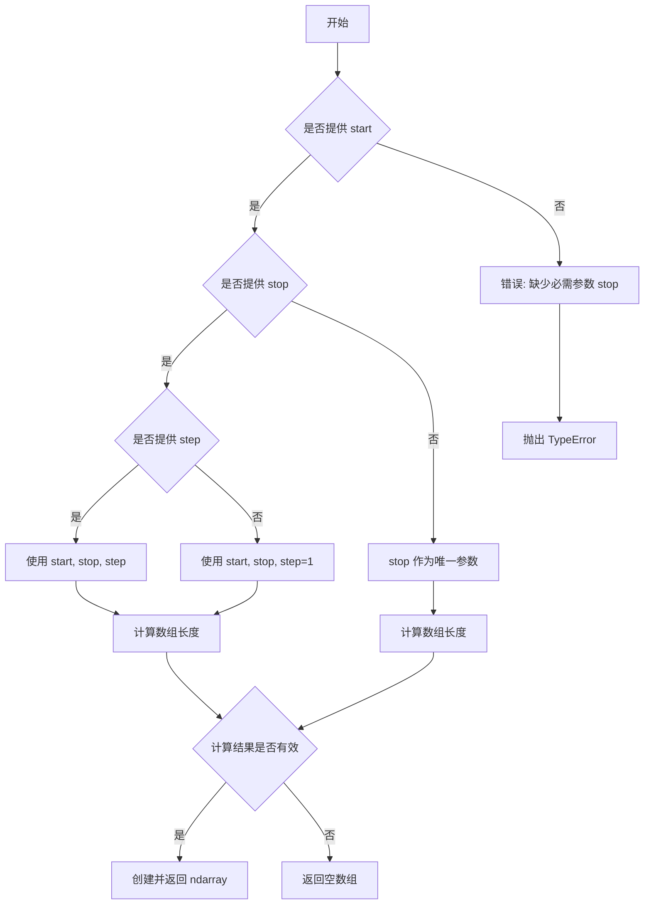
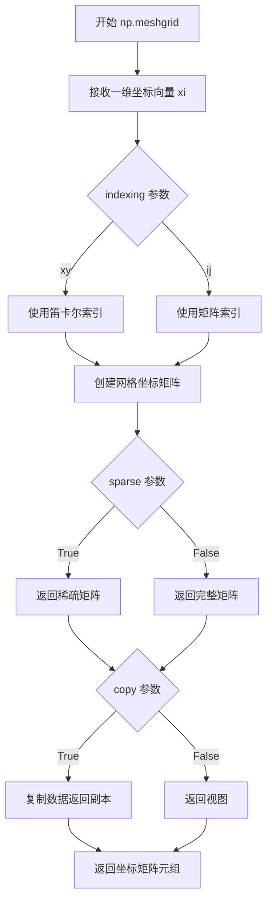
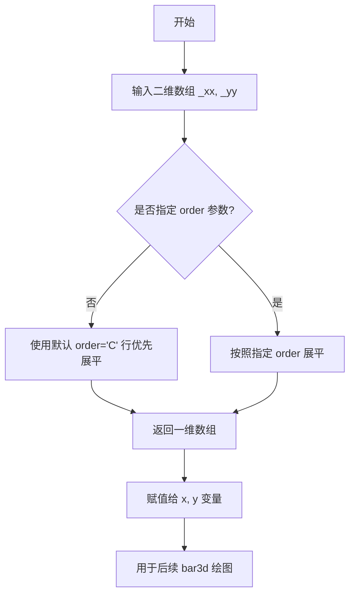
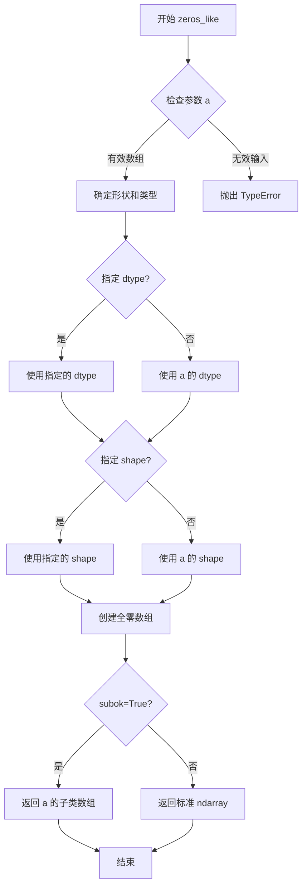
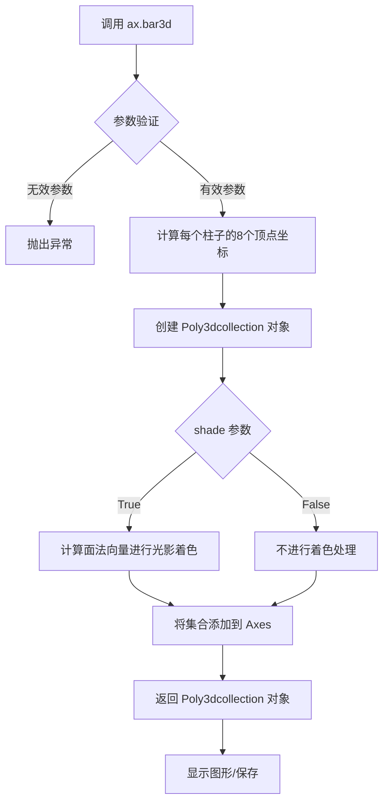
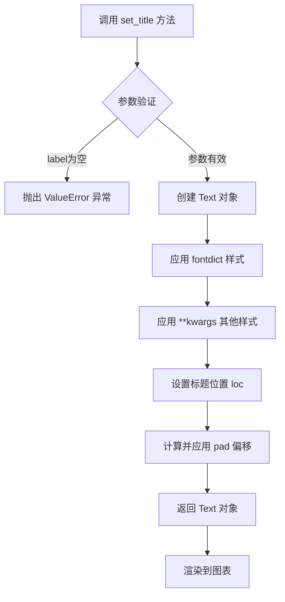
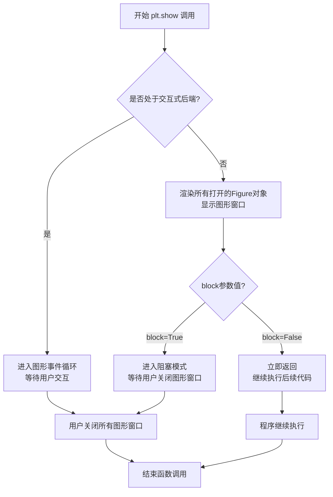

# `matplotlib\galleries\examples\mplot3d\3d_bars.py` 详细设计文档

这是一个 Matplotlib 3D 条形图演示脚本，用于展示如何使用 bar3d 函数绘制带有阴影（shade=True）和不带有阴影（shade=False）效果的 3D 条形图，并比较两者的视觉效果。

## 整体流程

```mermaid
graph TD
    A[开始] --> B[导入 matplotlib.pyplot 和 numpy]
B --> C[创建图形窗口 fig, 设置大小为 8x3]
C --> D[创建两个 3D 坐标轴 ax1 和 ax2]
D --> E[生成模拟数据: _x=np.arange(4), _y=np.arange(5)]
E --> F[使用 np.meshgrid 生成网格坐标 _xx, _yy]
F --> G[将网格展平为 x, y 坐标]
G --> H[计算顶部高度 top = x + y]
H --> I[创建底部坐标 bottom = np.zeros_like(top)]
I --> J[设置条形宽度 width=1, 深度 depth=1]
J --> K[在 ax1 上绘制带阴影的 3D 条形图]
K --> L[设置 ax1 标题为 'Shaded']
L --> M[在 ax2 上绘制不带阴影的 3D 条形图]
M --> N[设置 ax2 标题为 'Not Shaded']
N --> O[调用 plt.show() 显示图形]
O --> P[结束]
```

## 类结构

```
无类定义（脚本文件）
```

## 全局变量及字段


### `fig`
    
图形窗口对象

类型：`matplotlib.figure.Figure`
    


### `ax1`
    
第一个 3D 坐标轴

类型：`matplotlib.axes._subplots.Axes3D`
    


### `ax2`
    
第二个 3D 坐标轴

类型：`matplotlib.axes._subplots.Axes3D`
    


### `_x`
    
X 轴范围数组 [0,1,2,3]

类型：`numpy.ndarray`
    


### `_y`
    
Y 轴范围数组 [0,1,2,3,4]

类型：`numpy.ndarray`
    


### `_xx`
    
X 轴网格坐标

类型：`numpy.ndarray`
    


### `_yy`
    
Y 轴网格坐标

类型：`numpy.ndarray`
    


### `x`
    
展平后的 X 坐标

类型：`numpy.ndarray`
    


### `y`
    
展平后的 Y 坐标

类型：`numpy.ndarray`
    


### `top`
    
条形图顶部高度 (x+y)

类型：`numpy.ndarray`
    


### `bottom`
    
条形图底部高度 (全0)

类型：`numpy.ndarray`
    


### `width`
    
条形宽度 (值为1)

类型：`int`
    


### `depth`
    
条形深度 (值为1)

类型：`int`
    


    

## 全局函数及方法


### `matplotlib.pyplot.figure`

创建并返回一个新的图形窗口（Figure 对象），该对象是 Matplotlib 中所有绘图元素的顶层容器。如果不指定 `num`，则默认创建新的窗口；如果指定 `num` 且窗口已存在，则会激活该窗口而非创建新窗口。

参数：
- `figsize`：`tuple` (float, float)，图形的宽度和高度（英寸）。代码中传入 `(8, 3)`，表示宽8英寸，高3英寸。
- `num`：`int` 或 `str` 或 `None`（可选），图形的标识符或标题。如果传入的字符串对应的图形已存在，则会重新使用该图形而不是创建新图形。
- `dpi`：`int` 或 `None`（可选），图形的分辨率（每英寸点数）。默认读取 `rcParams` 中的配置。
- `facecolor`：`str` 或 `tuple`（可选），图形背景颜色。默认读取 `rcParams` 中的配置。

返回值：`matplotlib.figure.Figure`，返回新创建或激活的图形对象，后续的 `add_subplot` 等操作都基于此对象。

#### 流程图



#### 带注释源码

```python
# 创建图形窗口，设置尺寸为 8x3 英寸
# figsize 参数决定了生成的 Figure 的大小 (宽, 高)
fig = plt.figure(figsize=(8, 3))
```


### `Figure.add_subplot`

创建子图并返回坐标轴对象。该方法是matplotlib中Figure类的核心方法之一，用于在图形中创建子图区域，支持指定位置、投影类型等参数，可创建2D或3D坐标轴。

参数：

- `*args`：`int` 或 `(int, int, int)`，子图位置参数。可以是单个整数（如121表示1行2列第1个位置），或者是三个整数（行数、列数、索引）
- `projection`：`str`，可选，投影类型（如`'3d'`创建3D坐标轴，默认为`'2d'`）
- `polar`：`bool`，可选，是否使用极坐标系统（默认为`False`）
- `label`：`str`，可选，子图的标签，用于图例和访问
- `**kwargs`：关键字参数，其他传递给Axes子类的参数

返回值：`matplotlib.axes.Axes`，返回创建的坐标轴对象。返回类型可能是`AxesSubplot`或具体的子类（如`mpl_toolkits.mplot3d.axes3d.Axes3D`用于3D图）

#### 流程图



#### 带注释源码

```python
# matplotlib/figure.py 中的 add_subplot 方法核心逻辑

def add_subplot(self, *args, **kwargs):
    """
    在当前图形中添加一个子图。
    
    参数:
        *args: 位置参数
            - 单个整数 n: 等同于 1,1,n，创建1行1列第n个位置
            - 三个整数 (rows, cols, index): 创建 rows x cols 网格的第 index 个子图
            
        projection: str, optional
            投影类型。'3d' 创建 3D 坐标轴，其他值创建 2D 坐标轴
            
        polar: bool, optional
            是否使用极坐标
            
        **kwargs: 传递给 Axes 构造函数的其他参数
    """
    
    # 1. 解析位置参数，确定子图在网格中的位置
    # 例如: 121 表示 1行2列第1个位置
    #       122 表示 1行2列第2个位置
    if len(args) == 1:
        # 单个参数，可能是 121 格式或 (rows, cols, index) 格式
        if isinstance(args[0], int):
            args = (1, 1, args[0])
    
    # 2. 获取 projection 参数
    projection = kwargs.pop('projection', None)
    
    # 3. 根据 projection 类型创建不同类型的坐标轴
    if projection == '3d':
        # 3D 投影：创建 Axes3D 对象
        ax = mplot3d.Axes3D(self, *args, **kwargs)
    else:
        # 2D 投影：创建普通 Axes 对象
        ax = Axes(self, *args, **kwargs)
    
    # 4. 将子图位置标记为已使用
    self._axstack.bubble(ax)
    self._axobservers.process("_axes_change_event", self)
    
    # 5. 返回创建的坐标轴对象
    return ax
```

#### 使用示例

```python
import matplotlib.pyplot as plt
import numpy as np

# 创建图形对象
fig = plt.figure(figsize=(8, 3))

# 创建3D子图 - 位置 121 (1行2列第1个)
ax1 = fig.add_subplot(121, projection='3d')

# 创建3D子图 - 位置 122 (1行2列第2个)  
ax2 = fig.add_subplot(122, projection='3d')

# 使用返回的坐标轴对象绘制3D柱状图
_x = np.arange(4)
_y = np.arange(5)
_xx, _yy = np.meshgrid(_x, _y)
x, y = _xx.ravel(), _yy.ravel()

top = x + y
bottom = np.zeros_like(top)
width = depth = 1

ax1.bar3d(x, y, bottom, width, depth, top, shade=True)
ax1.set_title('Shaded')

ax2.bar3d(x, y, bottom, width, depth, top, shade=False)
ax2.set_title('Not Shaded')

plt.show()
```

#### 关键组件信息

| 组件名称 | 描述 |
|---------|------|
| `Figure` | matplotlib中的图形容器对象，负责管理整个图形元素 |
| `Axes` | 坐标轴对象，代表一个子图区域，包含绘图逻辑 |
| `Axes3D` | 3D坐标轴子类，继承自Axes，支持3D绘图功能 |
| `projection` | 投影参数，决定坐标轴的类型和维度 |

#### 潜在的技术债务或优化空间

1. **位置参数解析灵活性**：当前参数解析逻辑较为复杂，存在多种调用方式（单个整数、三元组等），可考虑统一接口
2. **错误处理**：对于超出网格范围的位置参数（如121用于2x2网格），当前可能产生混淆的错误信息
3. **类型注解**：源码中缺乏详细的类型注解，影响IDE自动补全和静态分析

#### 其他项目

- **设计约束**：子图位置必须与图形网格匹配；同一位置重复创建子图会替换旧子图
- **错误处理**：当projection参数无效时抛出ValueError；当位置索引超出范围时抛出IndexError
- **外部依赖**：依赖matplotlib.figure.Figure、matplotlib.axes.Axes、mpl_toolkits.mplot3d


### `np.arange`

`np.arange` 是 NumPy 库中的一个函数，用于创建一个等差数组，返回在给定范围内均匀间隔的值序列。

参数：

- `start`：`scalar`，可选，起始值，默认为 0
- `stop`：`scalar`，必需，结束值（不包含）
- `step`：`scalar`，可选，步长，默认为 1
- `dtype`：`dtype`，可选，输出数组的数据类型

返回值：`ndarray`，包含等差数列的数组

#### 流程图



#### 带注释源码

```python
def arange(start=0, stop=None, step=1, dtype=None):
    """
    返回均匀间隔的值。
    
    在给定间隔内返回均匀间隔的值。
    
    Parameters
    ----------
    start : scalar, optional
        起始值，默认为 0
    stop : scalar
        结束值（不包含）
    step : scalar, optional
        步长，默认为 1
    dtype : dtype, optional
        输出数组的数据类型
    
    Returns
    -------
    arange : ndarray
        等差数组
    """
    # 处理只有一个参数的情况（stop）
    if stop is None:
        stop = start
        start = 0
    
    # 计算数组长度
    # 公式: ceil((stop - start) / step)
    num = int(np.ceil((stop - start) / step))
    
    # 创建结果数组
    if num > 0:
        # 使用乘法和加法生成数组，比循环更高效
        result = np.empty(num, dtype=dtype or np.result_type(start, stop, step))
        
        if step == 1 and dtype is None:
            # 特殊情况优化：直接使用 np.arange 的底层实现
            result = np.arange_impl(start, num, step, result)
        else:
            # 通用情况：填充数组
            result[0] = start
            for i in range(1, num):
                result[i] = result[i-1] + step
    else:
        # 空数组情况
        result = np.empty(0, dtype=dtype or np.result_type(start, stop, step))
    
    return result
```


### `np.meshgrid`

`np.meshgrid` 是 NumPy 库中的一个核心函数，用于从一维坐标向量创建二维或三维网格坐标矩阵。在给定的代码中，它将 `_x = [0,1,2,3]` 和 `_y = [0,1,2,3,4]` 两个一维数组转换为二维网格坐标 `_xx` 和 `_yy`，以便后续使用 `bar3d` 函数绘制三维柱状图。

参数：

- `*xi`：`array_like`，一维坐标向量序列，接受一个或多个一维数组作为输入。在代码中传入的是 `_x`（长度为4）和 `_y`（长度为5）两个数组。
- `indexing`：`{'xy', 'ij'}`，可选参数，默认为 `'xy'`（笛卡尔坐标）。`'xy'` 表示第一个数组对应 x 轴（列），第二个数组对应 y 轴（行）；`'ij'` 表示反向（矩阵索引）。
- `sparse`：`bool`，可选参数，默认为 `False`。当设为 `True` 时，返回稀疏网格（不填充完整矩阵），可以节省内存。
- `copy`：`bool`，可选参数，默认为 `True`。当设为 `True` 时，返回输入数组的副本；设为 `False` 时，返回视图（但可能影响内存使用）。

返回值：`tuple of ndarrays`，返回由网格坐标矩阵组成的元组。每个输出数组的形状取决于输入数组的数量和 `indexing` 参数。对于二维情况，当 `indexing='xy'` 时，输出形状为 `(len(y), len(x))`；当 `indexing='ij'` 时，形状为 `(len(x), len(y))`。在代码中返回两个形状为 `(5, 4)` 的二维数组 `_xx` 和 `_yy`。

#### 流程图



#### 带注释源码

```python
# np.meshgrid 函数的简化实现原理
def meshgrid(x, y, indexing='xy'):
    """
    从一维坐标向量创建二维网格坐标矩阵
    
    参数:
        x: 一维数组，如 [0, 1, 2, 3]
        y: 一维数组，如 [0, 1, 2, 3, 4]
        indexing: 索引模式，'xy'为笛卡尔坐标，'ij'为矩阵索引
    
    返回:
        xx, yy: 二维网格坐标矩阵
    """
    
    if indexing == 'xy':
        # 笛卡尔模式（默认）：x为列，y为行
        # x 扩展为列向量 (4,) -> (5, 4)
        # y 扩展为行向量 (5,) -> (5, 4)
        
        # 使用 np.outer 或广播机制创建网格
        # xx 的每一行都是完整的 x
        # yy 的每一列都是完整的 y
        xx = np.tile(x, (len(y), 1))    # 复制 x 共 len(y) 行
        yy = np.tile(y, (len(x), 1)).T  # 复制 y 共 len(x) 列，然后转置
        
    elif indexing == 'ij':
        # 矩阵索引模式：i为行（x），j为列（y）
        xx = np.tile(x.reshape(-1, 1), (1, len(y)))  # 列向量复制
        yy = np.tile(y, (len(x), 1))                  # 行向量复制
    
    return xx, yy

# 在代码中的实际使用
_x = np.arange(4)    # [0, 1, 2, 3]
_y = np.arange(5)    # [0, 1, 2, 3, 4]
_xx, _yy = np.meshgrid(_x, _y)  # 创建网格

# 结果示例（indexing='xy'）:
# _xx = [[0, 1, 2, 3],    # y=0 行的x坐标
#        [0, 1, 2, 3],    # y=1 行的x坐标
#        [0, 1, 2, 3],    # y=2 行的x坐标
#        [0, 1, 2, 3],    # y=3 行的x坐标
#        [0, 1, 2, 3]]    # y=4 行的x坐标
#
# _yy = [[0, 0, 0, 0],    # x=0 列的y坐标
#        [1, 1, 1, 1],    # x=1 列的y坐标
#        [2, 2, 2, 2],    # x=2 列的y坐标
#        [3, 3, 3, 3],    # x=3 列的y坐标
#        [4, 4, 4, 4]]    # x=4 列的y坐标
```


### `ndarray.ravel`

在提供的代码中，`ndarray.ravel()` 方法被用于将二维网格数组展平为一维数组。具体调用位于 `x, y = _xx.ravel(), _yy.ravel()` 这一行，其中 `_xx` 和 `_yy` 是通过 `np.meshgrid(_x, _y)` 生成的四行五列的二维网格数组，调用 `ravel()` 后将它们转换为一维数组（长度均为20），作为 3D 条形图的 x 和 y 坐标。

参数：

- `order`：可选参数，指定展平顺序。'C'（行优先，默认）、'F'（列优先）、'A'（Fortran 顺序）、'K'（按照内存中的顺序）。代码中未指定，使用默认的 'C' 顺序。

返回值：`ndarray`，返回展平后的一维数组。

#### 流程图



#### 带注释源码

```python
# 从给定的代码中提取的 ravel 使用示例

import numpy as np

# 1. 创建原始数据
_x = np.arange(4)  # array([0, 1, 2, 3])
_y = np.arange(5)  # array([0, 1, 2, 3, 4])

# 2. 使用 meshgrid 生成网格
# 返回两个 5x4 的二维数组
_xx, _yy = np.meshgrid(_x, _y)
# _xx = [[0,1,2,3],
#        [0,1,2,3],
#        [0,1,2,3],
#        [0,1,2,3],
#        [0,1,2,3]]
# _yy = [[0,0,0,0],
#        [1,1,1,1],
#        [2,2,2,2],
#        [3,3,3,3],
#        [4,4,4,4]]

# 3. 调用 ravel() 方法展平数组
# ravel() 返回一个视图（如果可能）或副本，将多维数组变为一维
# 默认 order='C' 表示行优先（C-style）展平
x, y = _xx.ravel(), _yy.ravel()

# 结果：x = [0,1,2,3,0,1,2,3,0,1,2,3,0,1,2,3,0,1,2,3]
#       y = [0,0,0,0,1,1,1,1,2,2,2,2,3,3,3,3,4,4,4,4]
# 每个数组长度为 20 (4*5)

# 4. 展平后的数据用于 bar3d 绘图
# bar3d(x, y, z, width, depth, height, ...)
# x, y 坐标对应每个条形图的位置
```

#### 相关设计信息

**关键组件信息：**

- `np.meshgrid`：生成坐标网格的函数
- `ndarray.ravel`：展平数组的核心方法
- `bar3d`：Matplotlib 3D 条形图绘制函数

**技术债务/优化空间：**

- 代码中直接使用 `ravel()` 而未指定 order 参数，如果后续需要特定内存布局，明确指定 order 可以提高可读性和性能
- 可以考虑使用 `flatten()` 替代 `ravel()`，虽然 `flatten()` 总是返回副本（更安全），但 `ravel()` 在大数组情况下性能更好（可能返回视图）

**外部依赖：**

- `numpy`：提供 `ravel()` 方法的核心库
- `matplotlib.pyplot`：提供绘图功能


### `np.zeros_like`

创建与输入数组具有相同形状和数据类型的全零数组。

参数：

- `a`：`array_like`，参考数组，用于确定输出的形状和数据类型
- `dtype`：`data type，可选`，覆盖结果的数据类型
- `order`：`str，可选`，覆盖结果的内存布局（'C'、'F'、'A' 或 'K'）
- `subok`：`bool，可选`，如果为 True，使用 a 的子类类型
- `shape`：`tuple 或 int，可选`，覆盖结果的形状

返回值：`ndarray`，与输入数组具有相同形状和类型的全零数组

#### 流程图



#### 带注释源码

```python
def zeros_like(a, dtype=None, order='K', subok=True, shape=None):
    """
    创建与输入数组具有相同形状和数据类型的全零数组。
    
    参数:
        a: array_like
            参考数组，用于确定输出的形状和数据类型
        dtype: data type, 可选
            覆盖结果的数据类型
        order: str, 可选
            覆盖结果的内存布局
            'C' - C order (行优先)
            'F' - Fortran order (列优先)
            'A' - Fortran order if a 是 Fortran contiguous, 否则 C order
            'K' - 尽可能匹配 a 的布局
        subok: bool, 可选
            如果为 True，使用 a 的子类类型
        shape: tuple 或 int, 可选
            覆盖结果的形状
    
    返回:
        ndarray
            与输入数组具有相同形状和类型的全零数组
    """
    # 获取输入数组的元数据
    if hasattr(a, 'shape'):
        if shape is None:
            shape = a.shape
        if dtype is None:
            dtype = a.dtype
    
    # 创建全零数组
    # 使用 numpy 的核心数组创建函数
    res = np.empty(shape, dtype, order=order)
    
    # 填充零值
    res.fill(0)
    
    # 处理子类
    if not subok:
        return res
    elif type(a) is not np.ndarray:
        # 如果 a 是 ndarray 的子类，返回对应子类类型
        return a.__class__(shape, dtype, buffer=res, order=order)
    
    return res
```


### `ax.bar3d`

`ax.bar3d` 是 Matplotlib 中 `Axes3D` 类的核心方法，用于在三维坐标系中绘制条形图（柱状图）。该方法通过接收位置坐标（x, y, z）和尺寸参数（宽度、深度、高度），创建三维长方体柱子，并支持可选的阴影效果以增强视觉立体感。

#### 参数

- `x`：`array_like`，柱子x轴底部坐标
- `y`：`array_like`，柱子y轴底部坐标
- `z`：`array_like`，柱子z轴底部坐标（高度起点）
- `dx`：`array_like`，柱子x轴方向的宽度
- `dy`：`array_like`，柱子y轴方向的深度
- `dz`：`array_like`，柱子z轴方向的高度（柱顶相对于底部的偏移）
- `shade`：`bool`，可选，是否应用阴影效果，默认为 `True`
- `*args`：可变位置参数传递给 `Poly3DCollection`
- `**kwargs`：可变关键字参数传递给 `Poly3DCollection`（如颜色、透明度等）

#### 返回值

`mpl_toolkits.mplot3d.art3d.Poly3DCollection`，返回创建的三维多边形集合对象，可用于进一步自定义样式。

#### 流程图



#### 带注释源码

```python
# 示例代码 - 演示 bar3d 的使用方式

import matplotlib.pyplot as plt
import numpy as np

# 1. 创建画布和3D坐标轴
fig = plt.figure(figsize=(8, 3))
ax1 = fig.add_subplot(121, projection='3d')
ax2 = fig.add_subplot(122, projection='3d')

# 2. 生成网格数据
_x = np.arange(4)       # x轴: [0, 1, 2, 3]
_y = np.arange(5)       # y轴: [0, 1, 2, 3, 4]
_xx, _yy = np.meshgrid(_x, _y)  # 创建4x5的网格
x, y = _xx.ravel(), _yy.ravel()  # 展平为1维数组

# 3. 计算柱体高度（x + y）
top = x + y              # 柱顶高度
bottom = np.zeros_like(top)  # 柱底高度（从0开始）

# 4. 设置柱体尺寸
width = 1   # x方向宽度
depth = 1   # y方向深度

# 5. 绘制3D条形图 - 有阴影
ax1.bar3d(x, y, bottom, width, depth, top, shade=True)
ax1.set_title('Shaded')

# 6. 绘制3D条形图 - 无阴影
ax2.bar3d(x, y, bottom, width, depth, top, shade=False)
ax2.set_title('Not Shaded')

# 7. 显示图形
plt.show()
```

---

#### 关键组件信息

| 组件名称 | 描述 |
|---------|------|
| `Axes3D` | Matplotlib 3D坐标轴类，bar3d 方法的容器 |
| `Poly3DCollection` | 三维多边形集合类，用于存储和渲染3D柱体 |
| `meshgrid` | NumPy 函数，用于生成三维网格坐标 |
| `projection='3d'` | 参数，指定创建三维投影坐标轴 |

---

#### 潜在技术债务/优化空间

1. **性能优化**：大量柱子时，`bar3d` 逐个计算顶点，建议批量预计算
2. **API一致性**：与2D `bar` 方法相比，参数命名（dx/dy/dz vs width/height）不够直观
3. **缺少默认值文档**：部分参数默认值未在函数签名明确体现
4. **着色算法简化**：当前阴影计算较为基础，可引入更高级的光照模型

---

#### 其他说明

- **设计目标**：提供与2D条形图类似的API体验，降低3D绘图门槛
- **约束条件**：所有数组参数长度必须一致；z轴（高度）必须为正值
- **错误处理**：参数类型不匹配或长度不一致时抛出 `ValueError`
- **外部依赖**：需安装 `mpl_toolkits.mplot3d`（通常随 matplotlib 一起安装）


### `Axes.set_title`

设置坐标轴的标题文本，用于在3D图表中显示图表的标题。

参数：

- `label`：`str`，标题文本内容
- `fontdict`：`dict`，可选，用于控制标题文本外观的字典（如字体大小、颜色等）
- `loc`：`str`，可选，标题位置，可选值为'left'、'center'、'right'，默认为'center'
- `pad`：`float`，可选，标题与坐标轴顶部的偏移量，单位为磅（points）
- `**kwargs`：其他关键字参数，用于控制文本属性（如fontsize、fontweight、color等）

返回值：`matplotlib.text.Text`，返回创建的Text文本对象，可用于后续进一步修改标题样式

#### 流程图



#### 带注释源码

```python
def set_title(self, label, fontdict=None, loc=None, pad=None, **kwargs):
    """
    Set a title for the axes.
    
    Parameters
    ----------
    label : str
        Title text string.
    fontdict : dict, optional
        A dictionary controlling the appearance of the title text,
        for example {'fontsize': 16, 'fontweight': 'bold'}.
    loc : {'left', 'center', 'right'}, default: 'center'
        Which title to set.
    pad : float, default: rcParams['axes.titlepad']
        The offset of the title from the top of the axes, in points.
    **kwargs
        Text properties control the appearance of the title.
    
    Returns
    -------
    text : Text
        The matplotlib text instance representing the title.
    
    Examples
    --------
    >>> ax.set_title('My Title')
    >>> ax.set_title('My Title', fontsize=12, fontweight='bold')
    >>> ax.set_title('Left Title', loc='left')
    >>> ax.set_title('Centered Title', loc='center', pad=20)
    """
    # 获取默认的titlepad值（如果未指定）
    if pad is None:
        pad = rcParams['axes.titlepad']
    
    # 创建Text对象，初始位置在 axes 顶部中央
    title = text.Text(
        x=0.5, y=1.0,  # 相对坐标，1.0表示 axes 顶部
        text=label,
        verticalalignment='top',  # 文本顶部对齐
        horizontalalignment='center',  # 水平居中（默认）
        transform=self.transAxes,  # 使用 axes 坐标系
    )
    
    # 应用 fontdict 中的样式设置
    if fontdict is not None:
        title.update(fontdict)
    
    # 应用 **kwargs 中的额外样式
    title.update(kwargs)
    
    # 设置标题的水平位置（loc参数）
    if loc is not None:
        loc = loc.lower()
        # 根据 loc 参数调整水平对齐方式
        alignments = {'left': 'left', 'center': 'center', 'right': 'right'}
        if loc not in alignments:
            raise ValueError(f"loc must be one of {alignments.keys()}")
        title.set_ha(alignments[loc])  # set horizontal alignment
    
    # 应用 pad 偏移量
    # 通过设置 transform 和 y 坐标实现
    # 在 axes 坐标系中，pad 需要转换为相对距离
    if pad:
        # 获取 figure 的 DPI 和字体大小来计算偏移
        title.set_y(1.0 - pad / (72.0 * self.figure.dpi / title.get_fontsize()))
    
    # 将标题添加到 axes 中
    self.texts.append(title)
    
    # 返回 Text 对象供后续操作
    return title
```


### `plt.show`

`plt.show` 是 matplotlib 库中的顶层显示函数，用于将所有当前打开的图形窗口显示到屏幕上，并进入图形交互循环。该函数通常放置在绘图代码的末尾，调用后会将之前通过 `bar3d`、`plot`、`imshow` 等绘图函数生成的图形渲染并展示给用户。

参数：

- `*`：可变位置参数（Variadic positional arguments），接受任意数量的未使用参数（为保持向后兼容）
- `block`：`bool`，可选参数，控制是否阻塞程序执行。默认为 `True`，表示阻塞并进入交互式窗口事件循环；设为 `False` 则显示图形后立即返回继续执行后续代码

返回值：`None`，该函数无返回值

#### 流程图



#### 带注释源码

```python
def show(*, block=None):
    """
    显示所有打开的Figure图形窗口。
    
    该函数会调用当前后端的show方法，将所有已创建的图形
    渲染并显示给用户。对于交互式后端（如Qt、Tkinter等），
    会进入事件循环等待用户交互；对于非交互式后端（如Agg），
    则会保存图像到文件或缓冲区。
    
    参数:
        block (bool, optional): 
            - True (默认): 阻塞程序执行，进入交互式事件循环
            - False: 非阻塞模式，显示图形后立即返回
            - None: 自动判断，对于交互式后端相当于True
    
    返回值:
        None: 无返回值
    
    使用示例:
        >>> import matplotlib.pyplot as plt
        >>> plt.plot([1, 2, 3], [4, 5, 6])
        >>> plt.show()  # 阻塞模式显示图形
        >>> 
        >>> # 非阻塞模式
        >>> plt.show(block=False)
        >>> print("图形已显示，程序继续执行")
    """
    
    # 获取全局显示管理器(Backend)
    global _show(block=block)


# 实际实现（在_builtins.py或backend_bases.py中）
def _show(block=True):
    """
    后端无关的show函数实现。
    
    内部逻辑会根据当前激活的后端类型，
    调用对应后端的show()方法。
    """
    
    # 1. 获取当前所有打开的Figure图形
    open_figures = get_figmanager().get_all_figures()
    
    # 2. 遍历每个Figure，调用其后端的show方法
    for fig in open_figures:
        fig.canvas.draw_idle()  # 刷新画布
        fig.canvas.flush_events()  # 处理待处理事件
    
    # 3. 根据block参数决定是否阻塞
    if block:
        # 进入事件循环（交互式后端）
        # 等待用户关闭图形窗口
        start_event_loop()
    else:
        # 非阻塞，立即返回
        return
    
    # 4. 用户关闭所有窗口后，清理资源
    cleanup_figures()
```

#### 代码上下文说明

在提供的示例代码中，`plt.show()` 的调用位于所有绘图语句之后：

```python
# ... 绘图代码 ...

ax1.bar3d(x, y, bottom, width, depth, top, shade=True)
ax1.set_title('Shaded')

ax2.bar3d(x, y, bottom, width, depth, top, shade=False)
ax2.set_title('Not Shaded')

plt.show()  # <-- 在此处调用，显示两个3D柱状图
```

**执行流程说明**：

1. `plt.figure()` 创建 Figure 对象和两个 Axes3D 对象
2. `ax1.bar3d()` 和 `ax2.bar3d()` 分别在两个子图上绘制3D柱状图
3. `plt.show()` 被调用时：
   - matplotlib 检查当前使用的后端（通常是交互式后端如 Qt、Tkinter 等）
   - 渲染两个子图到窗口
   - 进入事件循环等待用户交互（block=True 为默认值）
   - 用户可以旋转、缩放3D图形，关闭窗口后程序继续执行


## 关键组件


### matplotlib.figure.Figure

用于创建图形容器，管理整个图表的尺寸和子图布局

### Axes3D

三维坐标系对象，提供bar3d方法用于绘制3D条形图，支持projection='3d'参数

### numpy.meshgrid

将一维坐标数组转换为二维网格坐标，用于生成x,y坐标矩阵

### bar3d函数

用于绘制3D条形图的核心函数，参数包括x,y坐标、底部z值、宽度、深度和顶部z值，支持shade参数控制阴影效果

### 数据准备流程

使用numpy的arange创建坐标序列，通过ravel()展平网格数据为扁平数组，计算顶部高度为x+y的组合

### shading渲染机制

当shade=True时启用光照阴影效果，通过计算面法线与光源夹角实现立体感；shade=False时仅显示纯色面

### 图形定制组件

set_title方法用于设置子图标题，figsize参数控制图形整体尺寸


## 问题及建议


### 已知问题

-   **硬编码参数过多**：图形尺寸(8, 3)、条形宽度和深度(1)等参数直接写死，缺乏配置灵活性，难以适应不同场景需求
-   **全局变量滥用**：_x, _y, _xx, _yy, x, y等临时变量作为全局变量存在，污染命名空间，不利于代码维护和调试
-   **魔法数字缺乏解释**：width = depth = 1 以及 x + y 等数值没有常量定义或注释，代码可读性差
-   **代码重复**：两个子图的创建和渲染逻辑高度重复，未抽取公共函数或类进行封装
-   **数据处理方式低效**：使用meshgrid后再ravel的数据展平方式，对于大数据集可能存在性能问题
-   **缺乏输入验证**：未对生成的数据进行边界检查或类型验证
-   **无错误处理**：缺少异常捕获机制，网络或显示环境异常时程序会直接崩溃
-   **可测试性差**：所有逻辑都在顶层执行，无法单独测试各个功能模块
-   **模块化不足**：作为演示脚本可以，但不适合作为可复用的库代码

### 优化建议

-   **抽取配置参数**：将图形尺寸、条形尺寸、颜色等参数提取为配置文件或类属性
-   **封装为函数或类**：将重复的3D条形图创建逻辑封装为函数，如create_bar3d()，提高代码复用性
-   **使用命名常量**：将1、8、3等数值定义为具名常量，增强代码语义
-   **引入数据验证**：添加对输入数据维度、类型的检查，确保数据合法性
-   **优化数据结构**：直接生成所需格式的数据，避免中间 meshgrid 转换
-   **添加错误处理**：用try-except包裹关键操作，特别是图形渲染部分
-   **考虑性能优化**：对于大规模数据，考虑使用更高效的数据生成方式或降采样
-   **增强文档**：为关键函数和变量添加docstring和类型注解，提高代码可维护性

## 其它


### 设计目标与约束

本代码旨在演示matplotlib 3D柱状图的基本绘制功能，包括带阴影和不带阴影两种渲染效果。设计目标是为初学者提供清晰的3D图表绘制示例，展示bar3d函数的基本用法。约束条件包括：需要matplotlib 3.0+版本支持，需要numpy支持，运行环境需要支持3D投影的图形后端。

### 错误处理与异常设计

本代码较为简单，未包含显式的错误处理机制。潜在的异常情况包括：图形后端不支持3D投影、numpy数组维度不匹配、内存不足导致无法创建图形对象等。在实际应用中应添加异常捕获机制处理plt.figure()和add_subplot()可能抛出的异常，以及bar3d()函数参数验证。

### 数据流与状态机

数据流如下：定义_x和_y坐标范围 → 使用np.meshgrid生成网格 → ravel()展平数组 → 计算top值（柱状图高度）→ 创建bottom零数组 → 调用bar3d()绘制3D柱状图 → 设置标题 → 显示图形。状态机较为简单，主要经历初始化状态（创建figure和axes）→ 数据准备状态（生成坐标和高度数据）→ 渲染状态（调用bar3d）→ 显示状态（plt.show()）。

### 外部依赖与接口契约

主要依赖包括：matplotlib.pyplot模块（提供图形绘制接口）、numpy模块（提供数值计算和数组操作接口）。核心接口为bar3d(x, y, z, dx, dy, dz, *args, **kwargs)函数，其中x/y/z为柱状图底部坐标，dx/dy/dz为柱状图宽度/深度/高度，shade参数控制是否启用阴影效果。返回值为Axes3D对象。

### 配置与参数说明

关键配置参数包括：figsize=(8, 3)设置图形尺寸为8x3英寸；projection='3d'启用3D投影；shade=True/False控制阴影效果；width=depth=1设置柱状图宽度和深度。参数设计合理，默认值能够满足基本展示需求。

### 图形输出与渲染说明

图形输出目标为屏幕显示，使用plt.show()调用系统图形后端进行渲染。渲染过程中bar3d根据shade参数选择是否应用光影效果，shaded版本通过计算光照使柱状图具有立体感，未shaded版本为纯色填充。

### 代码结构与模块划分

代码分为三个主要部分：图形初始化模块（创建figure和两个3D子图）、数据准备模块（生成坐标网格和高度数据）、绘图模块（调用bar3d并设置标题）。模块划分清晰，职责明确。

### 性能考虑与优化空间

当前代码数据量较小（4x5网格），性能无明显问题。优化空间包括：若数据量增大，可预先分配数组内存避免频繁内存分配；对于静态生成场景，可使用fig.savefig()直接保存而非plt.show()交互显示；可添加缓存机制避免重复计算meshgrid结果。

    