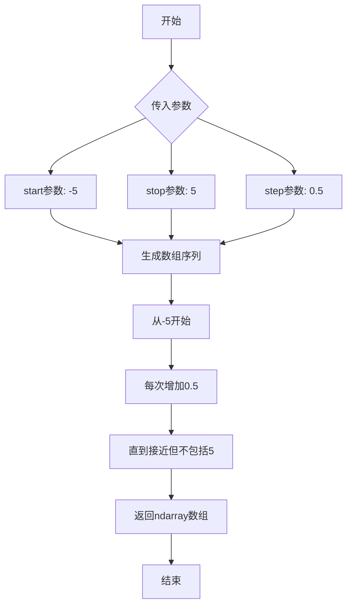
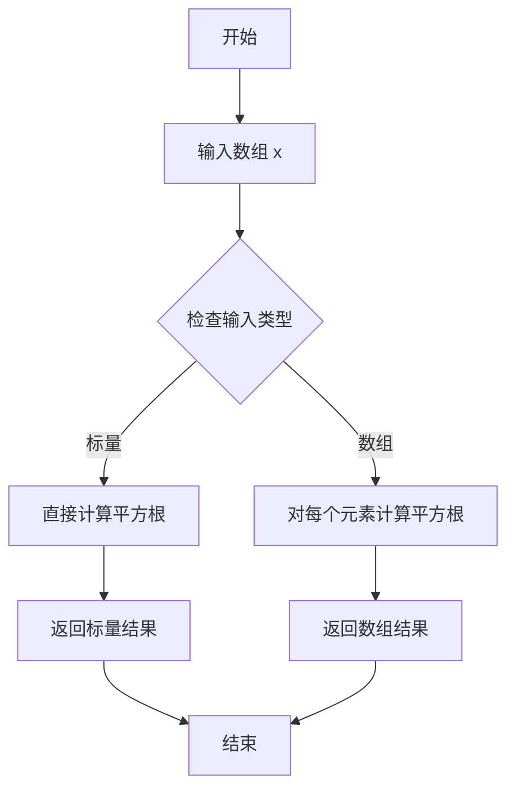
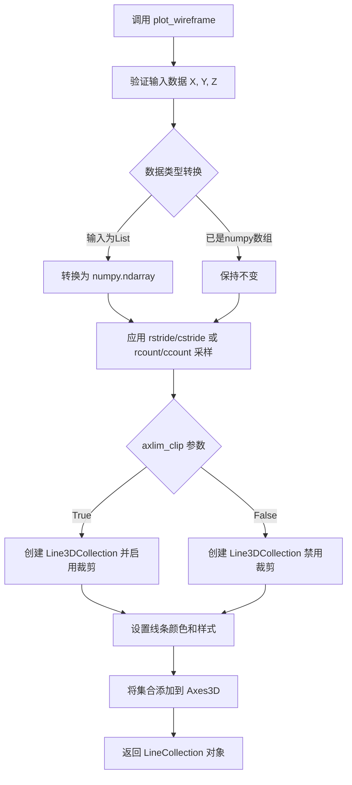
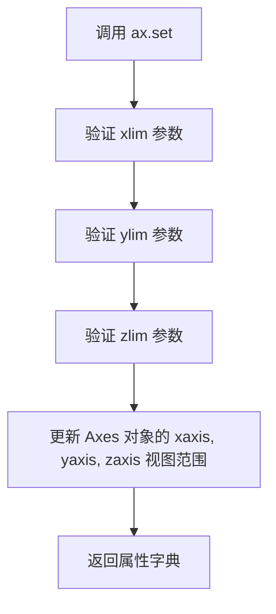
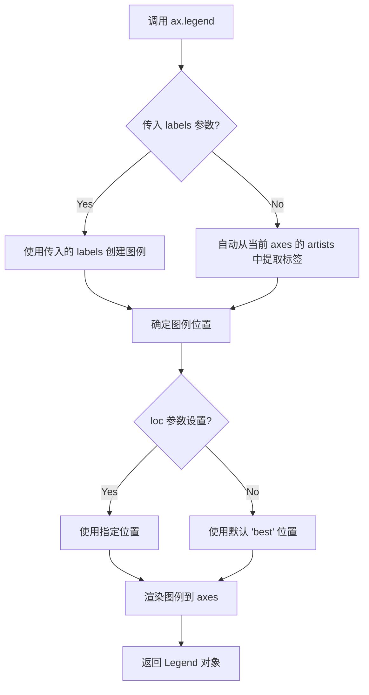
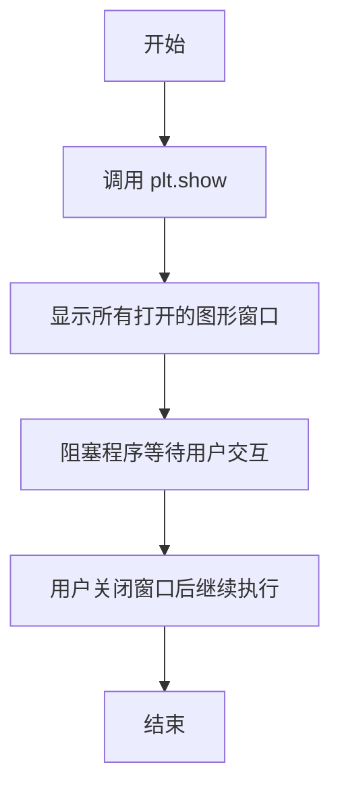
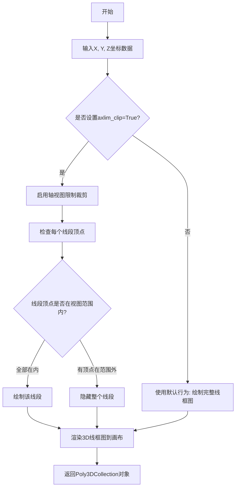
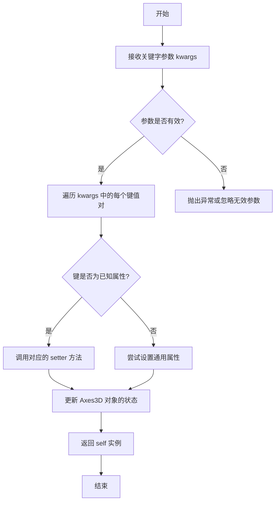
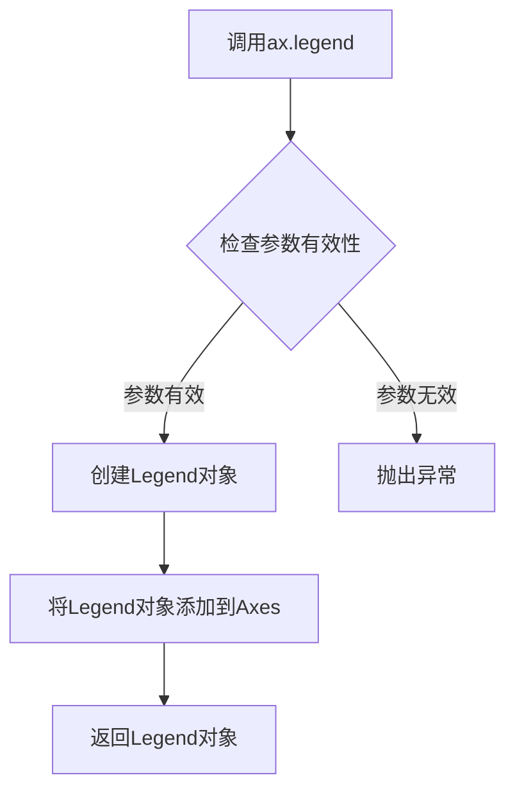

# `matplotlib\galleries\examples\mplot3d\axlim_clip.py` 详细设计文档

这是一个matplotlib 3D绑定示例脚本，演示如何使用axlim_clip参数将3D线框图数据裁剪到坐标轴视图限制内，并展示默认行为与裁剪行为的视觉效果差异。

## 整体流程

```mermaid
graph TD
A[开始] --> B[导入matplotlib.pyplot和numpy]
B --> C[创建Figure和3D Axes子图]
C --> D[使用np.arange生成x和y坐标数组]
D --> E[使用np.meshgrid创建X和Y网格]
E --> F[计算R = sqrt(X² + Y²)]
F --> G[计算Z = sin(R)]
G --> H[调用ax.plot_wireframe绘制默认线框图]
H --> I[调用ax.plot_wireframe绘制axlim_clip=True的线框图]
I --> J[使用ax.set设置xlim, ylim, zlim]
J --> K[使用ax.legend添加图例]
K --> L[调用plt.show显示图形]
L --> M[结束]
```

## 类结构

```
matplotlib.pyplot (模块)
├── Figure (类)
└── Axes3D (3D坐标轴类)
    ├── plot_wireframe()
    ├── set()
    └── legend()

numpy (模块)
├── arange()
├── meshgrid()
└── 数组运算
```

## 全局变量及字段


### `fig`
    
Matplotlib图形对象，用于承载整个图表

类型：`matplotlib.figure.Figure`
    


### `ax`
    
3D坐标轴对象，用于绘制3D图形和数据

类型：`matplotlib.axes._axes.Axes3D`
    


### `x`
    
从-5到5（步长0.5）的x轴数据数组

类型：`numpy.ndarray`
    


### `y`
    
从-5到5（步长0.5）的y轴数据数组

类型：`numpy.ndarray`
    


### `X`
    
由x和y通过meshgrid生成的网格X坐标矩阵

类型：`numpy.ndarray`
    


### `Y`
    
由x和y通过meshgrid生成的网格Y坐标矩阵

类型：`numpy.ndarray`
    


### `R`
    
网格上各点到原点的距离矩阵

类型：`numpy.ndarray`
    


### `Z`
    
基于R计算的正弦值Z轴数据矩阵

类型：`numpy.ndarray`
    


    

## 全局函数及方法


### `plt.subplots`

`plt.subplots` 是 matplotlib 库中的核心函数，用于创建一个新的图形窗口（Figure）和一个或多个子图（Axes）。它封装了 Figure 和 Axes 的创建过程，返回一个元组，其中包含图形对象和坐标轴对象（或坐标轴数组），便于用户进行后续的绘图操作。

参数：

- `nrows`：`int`，默认为 1，表示子图的行数。
- `ncols`：`int`，默认为 1，表示子图的列数。
- `sharex`：`bool` 或 `str`，默认为 False。如果为 True，则所有子图共享 x 轴；如果为 'col'，则每列子图共享 x 轴。
- `sharey`：`bool` 或 `str`，默认为 False。如果为 True，则所有子图共享 y 轴；如果为 'row'，则每行子图共享 y 轴。
- `squeeze`：`bool`，默认为 True。如果为 True，则返回的坐标轴对象会降维处理：当只有一个子图时，返回单个 Axes 对象；当有多个子图时，返回 Axes 数组。
- `width_ratios`：`array-like`，可选，指定每列子图的宽度比例。
- `height_ratios`：`array-like`，可选，指定每行子图的高度比例。
- `subplot_kw`：`dict`，可选，用于传递给 `add_subplot` 的关键字参数，常用于指定投影类型（如 '3d'）。
- `gridspec_kw`：`dict`，可选，用于指定网格布局的关键字参数。
- `**fig_kw`：其他关键字参数，将传递给 `Figure` 构造函数（如 figsize、dpi 等）。

返回值：`tuple(Figure, Axes or ndarray of Axes)`，返回图形对象和坐标轴对象。如果 `squeeze` 为 False 或创建了多个子图，返回一个包含多个坐标轴的数组；如果只有一个子图且 `squeeze` 为 True，返回单个坐标轴对象。

#### 流程图

```mermaid
flowchart TD
    A[调用 plt.subplots] --> B{指定了 subplot_kw?}
    B -->|是| C[创建带有特殊属性的 Figure 和 Axes]
    B -->|否| D[创建标准 Figure 和 Axes]
    C --> E{指定了 gridspec_kw 或比例参数?}
    D --> E
    E -->|是| F[应用网格布局配置]
    E -->|否| G[使用默认网格布局]
    F --> H{sharex 或 sharey 为 True?}
    G --> H
    H -->|是| I[配置坐标轴共享]
    H -->|否| J[创建独立坐标轴]
    I --> K{指定了其他 fig_kw?}
    J --> K
    K -->|是| L[应用额外图形参数]
    K -->|否| M[完成创建]
    L --> M
    M --> N{squeeze=True 且只有一个子图?}
    N -->|是| O[返回单个 Axes 对象]
    N -->|否| P[返回 Axes 数组]
    O --> Q[返回 (fig, ax) 元组]
    P --> R[返回 (fig, axes) 元组]
```

#### 带注释源码

```python
# 在给定代码中的使用方式：
fig, ax = plt.subplots(subplot_kw={"projection": "3d"})

# 源码调用解析：
# fig, ax = plt.subplots(
#     nrows=1,          # 默认值，创建1行子图
#     ncols=1,          # 默认值，创建1列子图
#     subplot_kw={"projection": "3d"}  # 关键参数：指定3D投影
# )
#
# 内部实现逻辑（简化版）：
# 1. 创建 Figure 对象：fig = plt.figure(**fig_kw)
# 2. 使用 gridspec 创建子图布局
# 3. 调用 fig.add_subplot() 创建 Axes 对象
# 4. 根据 projection='3d' 创建 Axes3D 对象
# 5. 返回 (fig, ax) 元组给调用者
#
# 结果：
# - fig: 图形对象，用于控制整体图形属性
# - ax: 3D坐标轴对象，用于绘制3D图形
```

#### 关键组件信息

| 组件名称 | 描述 |
|---------|------|
| `Figure` | matplotlib 中的图形容器，代表整个绘图窗口 |
| `Axes` | 坐标轴对象，代表图形中的绘图区域 |
| `Axes3D` | 继承自 Axes 的 3D 坐标轴类，用于 3D 可视化 |
| `subplot_kw` | 传递给子图创建函数的关键字参数字典 |

#### 潜在技术债务与优化空间

1. **参数复杂性**：plt.subplots 有大量可选参数，对于初学者来说学习曲线较陡。建议增加更直观的工厂函数，如 `plt.subplots_3d()`。
2. **返回值不一致**：当 `squeeze` 参数不同时，返回值类型不同（单个对象或数组），可能导致类型检查问题。建议统一返回接口。
3. **错误信息不够友好**：当参数组合无效时，错误信息可能不够明确，用户难以定位问题。

#### 其它项目

- **设计目标**：简化 matplotlib 的图形创建流程，提供一致的 API 界面。
- **约束**：
  - `nrows` 和 `ncols` 必须为正整数。
  - 当使用 `sharex` 或 `sharey` 时，子图布局必须匹配。
- **错误处理**：
  - 如果 `nrows` 或 `ncols` 小于 1，抛出 `ValueError`。
  - 如果 `subplot_kw` 中的参数无效，传递给 `add_subplot` 时会抛出相应异常。
- **外部依赖**：依赖 matplotlib 的 Figure、Axes 类和 gridspec 模块。


### `np.arange`

NumPy的arange函数用于创建等间距的数值序列数组，类似于Python内置的range函数，但返回的是NumPy数组。

参数：

- `start`：`float`（可选），起始值，默认为0。在代码中为`-5`
- `stop`：`float`，结束值（不包含）。在代码中为`5`
- `step`：`float`（可选），步长值。在代码中为`0.5`
- `dtype`：`dtype`（可选），输出数组的数据类型。代码中未指定，将自动推断

返回值：`ndarray`，返回一个一维的等间距数值数组

#### 流程图



#### 带注释源码

```python
# np.arange函数的标准调用形式：
# np.arange(start, stop, step)

# 在本代码中的具体调用：
x = np.arange(-5, 5, 0.5)  # 创建一个从-5开始，步长为0.5，到5（不包含）的数组
y = np.arange(-5, 5, 0.5)  # 同样创建另一个数组用于y轴

# 生成的x和y数组内容类似：
# array([-5. , -4.5, -4. , -3.5, -3. , -2.5, -2. , -1.5, -1. , -0.5,  0. ,
#        0.5,  1. ,  1.5,  2. ,  2.5,  3. ,  3.5,  4. ,  4.5])
```

#### 关键组件信息

- **np.arange**：NumPy库中的核心数组创建函数，用于生成等间距数列
- **np.meshgrid**：配合arange使用，将一维数组转换为二维网格坐标
- **np.sqrt**：计算平方根，与arange配合生成R值

#### 潜在技术债务或优化空间

1. **固定步长**：使用arange时步长可能产生浮点精度问题，对于精确的数值计算建议使用linspace
2. **数组大小不精确**：由于浮点步长累积，arange生成的数组元素数量可能不完全可控

#### 其他项目

- **设计目标**：为3D可视化创建坐标网格数据
- **约束**：需要与matplotlib的3D绘图函数兼容
- **错误处理**：如果start等于stop，返回空数组；如果step为0，抛出ValueError
- **外部依赖**：NumPy库


### `np.meshgrid`

从两个一维坐标数组创建坐标矩阵，用于生成网格化坐标数组。

参数：

- `x`：`array_like`，一维数组，表示x轴坐标值
- `y`：`array_like`，一维数组，表示y轴坐标值

返回值：`(ndarray, ndarray)`，返回两个二维数组X和Y，其中X的每一行是x的副本，Y的每一列是y的副本，用于表示网格点坐标

#### 流程图

```mermaid
flowchart TD
    A[输入一维数组x和y] --> B{是否使用indexing参数}
    B -->|'xy' indexing| C[创建二维数组X<br/>每行是x的重复]
    B -->|'ij' indexing| D[创建二维数组X<br/>每列是x的重复]
    C --> E[返回X, Y网格坐标]
    D --> E
    E --> F[可用于meshgrid函数的输出<br/>如R = np.sqrt(X**2 + Y**2)]
```

#### 带注释源码

```python
# 示例代码展示np.meshgrid的用法
import numpy as np

# 定义x和y坐标范围
x = np.arange(-5, 5, 0.5)  # 一维数组: [-5.  -4.5 -4.  ...  4.  4.5]
y = np.arange(-5, 5, 0.5)  # 一维数组: [-5.  -4.5 -4.  ...  4.  4.5]

# 使用np.meshgrid创建网格坐标
# 返回两个二维数组X和Y
X, Y = np.meshgrid(x, y)

# X的shape为(len(y), len(x))，每一行相同
# Y的shape为(len(y), len(x))，每列相同
# 例如：X的每一行是x的重复，Y的每一列是y的重复

# 应用：计算距离原点的距离R
R = np.sqrt(X**2 + Y**2)  # 使用网格坐标进行向量化计算
Z = np.sin(R)  # 基于网格计算z值
```


### `np.sqrt`

`np.sqrt` 是 NumPy 库中的数学函数，用于计算数组元素的平方根。在本代码中，该函数用于计算每个点到原点的距离 R，作为生成 3D 波浪形图形的中间步骤。

参数：

-  `x`：`ndarray` 或标量数值，输入数组或数值，用于计算平方根
-  `**kwargs`：可选，关键字参数（如 `out`、`where` 等），用于指定输出数组、计算条件等

返回值：`ndarray`，返回输入数组元素的平方根数组，形状与输入相同

#### 流程图



#### 带注释源码

```python
# np.sqrt 函数是 NumPy 库提供的数学函数
# 在本代码中的实际使用方式：

# 原始调用
R = np.sqrt(X**2 + Y**2)

# 逐步解析：
# 1. X**2 - 对 X 数组中的每个元素进行平方运算
# 2. Y**2 - 对 Y 数组中的每个元素进行平方运算  
# 3. X**2 + Y**2 - 将两个平方结果相加，得到距离平方的数组
# 4. np.sqrt(...) - 对距离平方数组开平方根，得到实际距离数组 R

# 等效的逐元素计算过程：
# for each element (i, j):
#     R[i, j] = sqrt(X[i, j]**2 + Y[i, j]**2)

# 参数说明：
# - 输入：X 和 Y 是通过 np.meshgrid 生成的 2D 网格坐标数组
# - 输出：R 是与 X、Y 形状相同的距离数组
# - 用途：生成环状波浪图案的基础数据
```

#### 额外信息

| 项目 | 描述 |
|------|------|
| 函数来源 | NumPy 库 (`numpy.sqrt`) |
| 文档链接 | https://numpy.org/doc/stable/reference/generated/numpy.sqrt.html |
| 在代码中的作用 | 计算网格点到原点的欧氏距离，形成放射状波纹的基础 |
| 性能特点 | 向量化操作，无需 Python 循环，高效处理大规模数组 |


### `np.sin`

计算输入数组元素的正弦值（以弧度为单位）。这是 NumPy 库提供的数学函数，用于对数组中的每个元素进行正弦运算。

参数：

- `x`：`array_like`，输入角度数组（以弧度为单位）

返回值：`ndarray`，输入数组元素的正弦值，返回值范围为 [-1, 1]

#### 流程图

```mermaid
flowchart LR
    A[输入数组 x<br/>角度值(弧度)] --> B[np.sin 函数<br/>逐元素计算]
    B --> C[输出数组<br/>正弦值]
    
    style A fill:#e1f5fe
    style B fill:#fff3e0
    style C fill:#e8f5e9
```

#### 带注释源码

```python
import numpy as np

# 示例：计算 R 的正弦值
R = np.sqrt(X**2 + Y**2)  # R 是从原点到每个点的距离数组
Z = np.sin(R)             # 计算 R 中每个元素的正弦值

# np.sin 函数内部原理（简化版）：
# 1. 接收输入 x（弧度制角度）
# 2. 对数组中每个元素应用泰勒级数展开或查表法计算 sin 值
# 3. 返回相同形状的数组，每个元素为对应角度的正弦值
# 
# 数学公式：sin(x) = x - x³/3! + x⁵/5! - x⁷/7! + ...
#
# 使用示例：
# >>> np.sin(0)
# 0.0
# >>> np.sin(np.pi/2)
# 1.0
# >>> np.sin([0, np.pi/2, np.pi])
# array([0., 1., 0.])
```


### `Axes3D.plot_wireframe`

该方法用于在三维坐标系中绘制线框图（wireframe），将输入的X、Y、Z坐标数据网格化后以线条形式呈现，支持通过`axlim_clip`参数控制是否将超出坐标轴视图范围的数据裁剪掉。

参数：

- `X`：`numpy.ndarray`，X轴坐标数据，通常为二维数组
- `Y`：`numpy.ndarray`，Y轴坐标数据，通常为二维数组
- `Z`：`numpy.ndarray`，Z轴坐标数据，通常为二维数组
- `rstride`：`int`，行步进值，控制线条的密度，默认为1
- `cstride`：`int`，列步进值，控制线条的密度，默认为1
- `rcount`：`int`，行采样数量，与rstride互斥
- `ccount`：`int`，列采样数量，与cstride互斥
- `color`：`str`或`tuple`，线条颜色，可使用颜色名称或RGB元组
- `axlim_clip`：`bool`，是否将数据裁剪到坐标轴视图限制范围，默认为`False`

返回值：`matplotlib.collections.LineCollection`，返回包含所有线框线条的集合对象，可用于后续的图形属性设置

#### 流程图



#### 带注释源码

```python
def plot_wireframe(self, X, Y, Z, *args,
                   rstride=1, cstride=1,
                   rcountex=None, ccount=None,
                   axlim_clip=False, **kwargs):
    """
    绘制三维线框图
    
    参数:
        X: X坐标数据 (二维数组)
        Y: Y坐标数据 (二维数组)
        Z: Z坐标数据 (二维数组)
        rstride: 行方向的步进值，控制线条密度
        cstride: 列方向的步进值，控制线条密度
        axlim_clip: 是否裁剪到轴视图限制
        **kwargs: 其他传递给 Line3DCollection 的参数
    
    返回:
        Line3DCollection: 包含所有线条的集合对象
    """
    # 1. 数据验证和标准化
    # 确保X, Y, Z为二维数组格式
    X, Y, Z = np.meshgrid(X, Y, Z)
    
    # 2. 根据步进值或采样数进行数据降采样
    if rcount is not None:
        X = X[::max(1, X.shape[0]//rcount), :]
        Y = Y[::max(1, Y.shape[0]//rcount), :]
        Z = Z[::max(1, Z.shape[0]//rcount), :]
    # ... cstride/count 类似处理
    
    # 3. 创建线条数据序列
    # 将网格数据转换为线条段列表
    lines = []
    # 按行方向生成线条
    for i in range(X.shape[0]):
        # ... 添加行线条
        pass
    # 按列方向生成线条
    for j in range(X.shape[1]):
        # ... 添加列线条
        pass
    
    # 4. 创建 Line3DCollection 对象
    collection = Line3DCollection(
        segments=lines,
        axlim_clip=axlim_clip,  # 关键：控制是否裁剪
        **kwargs
    )
    
    # 5. 添加到坐标轴并返回
    self.add_collection(collection)
    return collection
```


### `ax.set`

设置 3D 坐标轴的视图范围（x、y、z 轴的最小值和最大值），用于控制 3D 图表的显示区域。

参数：

- `xlim`：元组 (tuple)，x 轴视图范围，格式为 (最小值, 最大值)
- `ylim`：元组 (tuple)，y 轴视图范围，格式为 (最小值, 最大值)
- `zlim`：元组 (tuple)，z 轴视图范围，格式为 (最小值, 最大值)

返回值：`dict`，返回设置后的轴属性字典，包含已设置的属性键值对

#### 流程图



#### 带注释源码

```python
# 设置 3D 坐标轴的视图范围
# xlim: 设置 x 轴范围为 0 到 10
# ylim: 设置 y 轴范围为 -5 到 5
# zlim: 设置 z 轴范围为 -1 到 0.5
# 此设置会裁剪 x < 0 或 z > 0.5 的数据（当 axlim_clip=True 时）
ax.set(xlim=(0, 10), ylim=(-5, 5), zlim=(-1, 0.5))
```


### `ax.legend`

在3D matplotlib图表中用于添加图例的函数，用于标识不同数据系列或绘图样式的含义，支持自定义位置、样式和标签。

参数：

- `loc`：`str` 或 `int`，图例放置位置，如 'upper right'、'best' 等
- `bbox_to_anchor`：`tuple`，指定图例边框的锚点位置
- `ncol`：`int`，图例列数
- `fontsize`：`int` 或 `str`，图例字体大小
- `frameon`：`bool`，是否显示图例边框
- `framealpha`：`float`，图例背景透明度
- `labels`：`list`，图例标签列表（当使用自动句柄时）
- `handles`：`list`，图例句柄列表

返回值：`matplotlib.legend.Legend`，返回创建的图例对象，可用于后续自定义

#### 流程图



#### 带注释源码

```python
# 示例代码中的 ax.legend 调用
ax.legend(['axlim_clip=False (default)', 'axlim_clip=True'])
# 参数说明：
# - 传入 list 作为位置参数，等价于 labels=['axlim_clip=False (default)', 'axlim_clip=True']
# - loc 参数使用默认值 'best'，matplotlib 会自动选择最佳位置
# - 句柄（handles）自动从之前调用 ax.plot_wireframe() 返回的 Line3DCollection 对象中提取
# - 该调用创建两个图例项，分别对应默认行为和启用 axlim_clip=True 的效果
# - 返回值是一个 Legend 对象，可以赋值给变量以便后续操作（如 legend.get_texts() 修改文本）
```


### `plt.show`

`plt.show` 是 matplotlib 库中的一个函数，用于显示当前所有打开的图形窗口，并阻塞程序执行直到用户关闭窗口。它通常在绘图代码的最后调用，以确保图形可视化。

参数：  
无参数。

返回值：  
`None`，不返回任何值，仅用于展示图形。

#### 流程图



#### 带注释源码

```python
# 调用 matplotlib 的 plt.show() 函数显示图形
# 该函数会呈现所有之前创建的图形（如 plot_wireframe）
# 并保持窗口打开，直到用户关闭
plt.show()

# 注意：plt.show() 通常不接受参数，上述调用为标准形式
```


### `Axes3D.plot_wireframe`

该函数用于在3D坐标系中绘制线框图，支持通过 `axlim_clip` 参数控制是否将数据裁剪到轴的视图限制范围内。

参数：

- `X`：`numpy.ndarray`，X坐标数据，通常为网格数据
- `Y`：`numpy.ndarray`，Y坐标数据，通常为网格数据
- `Z`：`numpy.ndarray`，Z坐标数据，对应X和Y位置的高度值
- `axlim_clip`：`bool`，可选参数，默认为False。当设置为True时，超出轴视图限制的数据点将被裁剪
- `color`：可选参数，设置线条颜色
- `**kwargs`：其他matplotlib支持的线框图关键字参数

返回值：`collection.Poly3DCollection`，返回3D线框图集合对象

#### 流程图



#### 带注释源码

```python
# 示例代码展示了 Axes3D.plot_wireframe 的使用方法

# 导入必要的库
import matplotlib.pyplot as plt
import numpy as np

# 创建3D图形和轴
fig, ax = plt.subplots(subplot_kw={"projection": "3d"})

# 生成网格数据
x = np.arange(-5, 5, 0.5)
y = np.arange(-5, 5, 0.5)
X, Y = np.meshgrid(x, y)  # 创建网格坐标
R = np.sqrt(X**2 + Y**2)  # 计算到原点的距离
Z = np.sin(R)  # 计算Z值（基于距离的正弦值）

# 方式1: 使用默认行为（axlim_clip=False）
# 绘制完整的线框图，不进行裁剪
ax.plot_wireframe(X, Y, Z, color='C0')

# 方式2: 启用裁剪（axlim_clip=True）
# 当线段有一个顶点在视图限制外时，整条线段都被隐藏
ax.plot_wireframe(X, Y, Z, color='C1', axlim_clip=True)

# 设置轴的视图限制
# 在这个例子中，x < 0 或 z > 0.5 的数据会被裁剪
ax.set(xlim=(0, 10), ylim=(-5, 5), zlim=(-1, 0.5))

# 添加图例说明
ax.legend(['axlim_clip=False (default)', 'axlim_clip=True'])

# 显示图形
plt.show()
```


### `Axes3D.set`

该方法用于设置 3D 坐标轴的属性，如坐标轴范围、标签、标题等。它接受多个关键字参数，并返回 Axes3D 实例以支持链式调用。

参数：
- `**kwargs`：关键字参数，用于设置坐标轴属性。常见的参数包括：
  - `xlim`：元组，表示 x 轴的范围（例如 `(0, 10)`）。
  - `ylim`：元组，表示 y 轴的范围（例如 `(-5, 5)`）。
  - `zlim`：元组，表示 z 轴的范围（例如 `(-1, 0.5)`）。
  - `xlabel`：字符串，x 轴标签。
  - `ylabel`：字符串，y 轴标签。
  - `zlabel`：字符串，z 轴标签。
  - `title`：字符串，图表标题。
  - 其他属性如 `projection`（投影类型）等。

返回值：`Axes3D`，返回当前 Axes3D 实例，以便进行链式调用或后续操作。

#### 流程图



#### 带注释源码

```python
def set(self, **kwargs):
    """
    设置 Axes3D 的多个属性。
    
    参数：
        **kwargs：关键字参数，用于指定要设置的属性。例如：
            xlim=(0, 10) 设置 x 轴范围。
            ylim=(-5, 5) 设置 y 轴范围。
            zlim=(-1, 0.5) 设置 z 轴范围。
            xlabel='X' 设置 x 轴标签。
            ylabel='Y' 设置 y 轴标签。
            zlabel='Z' 设置 z 轴标签。
            title='3D Plot' 设置标题。
    
    返回值：
        Axes3D：返回自身实例，支持链式调用。
    """
    # 遍历所有传入的关键字参数
    for attr, value in kwargs.items():
        # 检查是否存在对应的 setter 方法（例如 set_xlim）
        setter_method = f'set_{attr}'
        if hasattr(self, setter_method):
            # 调用对应的 setter 方法设置值
            getattr(self, setter_method)(value)
        else:
            # 如果没有特定的 setter，尝试直接设置属性
            if hasattr(self, attr):
                setattr(self, attr, value)
            else:
                # 如果属性不存在，发出警告或忽略（此处简化处理）
                warnings.warn(f"Unknown property: {attr}")
    
    # 返回实例本身以支持链式调用
    return self
```


## 分析结果

经过分析，该代码是一个matplotlib 3D绘图的示例脚本，用于演示数据剪辑功能。**代码中并不存在`Axes3D.legend`方法的定义**，而是使用了`ax.legend()`方法调用。

该代码中使用了matplotlib的3D投影子图，绘制了两个线框图来对比`axlim_clip`参数的不同效果（默认False和True），并设置了轴的视图限制。

### `ax.legend`

图例是数据可视化中用于标识图形内容的辅助元素，在3D坐标系中显示各条曲线的标签说明。

参数：

- `loc`：位置参数，指定图例位置，可为字符串如'upper right'或数字代码
- `bbox_to_anchor`：元组，指定图例边框的锚点位置
- `ncol`：整数，图例列数
- `fontsize`：字体大小
- `title`：图例标题字符串
- `frameon`：布尔值，是否显示图例边框

返回值：`Legend`，matplotlib的Legend对象

#### 流程图



#### 带注释源码

```python
# 代码中实际调用
ax.legend(['axlim_clip=False (default)', 'axlim_clip=True'])
```

> **注意**：代码中并未直接定义`Axes3D.legend`方法，这是matplotlib库的内置方法。`ax.legend()`调用会创建并显示图例，传入的列表参数为两个线框图的标签文字。

## 关键组件


### 3D坐标轴创建

使用matplotlib的subplot函数创建带有3D投影的坐标轴对象

### 数据生成

使用numpy的arange、meshgrid和数学函数(sin, sqrt)生成3D可视化所需的网格数据

### plot_wireframe函数

matplotlib的3D线框图绘制方法，支持axlim_clip参数控制是否裁剪到视图限制

### axlim_clip参数

控制3D图形裁剪行为的参数，True时将数据裁剪到坐标轴视图限制内，False时(默认)显示全部数据

### 坐标轴视图限制

通过set方法设置xlim、ylim、zlim来定义3D坐标轴的可视范围

### 图例与可视化

使用legend展示不同axlim_clip设置下的图形对比，通过plt.show()渲染最终图像


## 问题及建议


### 已知问题

-   **Jupyter魔法命令污染脚本**：`# %%` 是Jupyter notebook的单元格分隔符，在独立Python脚本中没有实际作用，且可能导致在非Jupyter环境下运行时产生语法警告
-   **硬编码的数值缺乏说明**：`ax.set(xlim=(0, 10), ylim=(-5, 5), zlim=(-1, 0.5))` 使用了魔数（magic numbers），没有注释说明为何选择这些特定的轴范围
-   **图例标签易出错**：使用列表索引 `['axlim_clip=False (default)', 'axlim_clip=True']` 关联图例，如果后续调整plot顺序，图例会错乱
-   **演示效果不明显**：当前轴范围设置下（zlim包含整个Z值范围），`axlim_clip=True` 与默认行为的视觉差异不够明显，降低了示例的教育意义
-   **缺少图形后处理**：没有调用 `plt.close(fig)` 或 `plt.show()` 后的资源清理，可能导致内存泄漏（尤其在批量生成图像时）
-   **数学运算可优化**：`np.sqrt(X**2 + Y**2)` 可简化为 `np.hypot(X, Y)`，性能更优且可读性更好
-   **未处理外部依赖异常**：缺少对 `numpy` 和 `matplotlib` 导入失败的处理

### 优化建议

-   移除 `# %%` 或在前后添加条件判断确保仅在Jupyter环境中执行
-   为轴范围添加注释说明，例如：`# 限制z轴在-1到0.5之间以展示裁剪效果`
-   使用显式标签参数 `label=` 绑定图例，避免依赖调用顺序
-   调整轴范围使clip效果更明显，例如 `zlim=(-0.5, 1.0)` 以裁剪部分负值区域
-   在脚本末尾添加 `plt.close(fig)` 清理资源
-   使用 `np.hypot(X, Y)` 替代 `np.sqrt(X**2 + Y**2)`
-   考虑添加 `try-except` 块处理导入或绘图可能的异常
-   将重复的网格数据 `X, Y, Z` 提取为独立函数参数，增强代码可重用性


## 其它


### 设计目标与约束

本代码旨在演示matplotlib 3D图形中坐标轴视窗限制的数据裁剪功能（axlim_clip参数），展示在三维空间中如何根据用户定义的坐标轴范围（xlim, ylim, zlim）来控制线框图的显示。设计约束包括：需要matplotlib 3D投影支持、依赖numpy进行数值计算、演示环境为Jupyter Notebook或类似交互式环境。

### 错误处理与异常设计

代码中未显式包含错误处理机制。潜在异常包括：1) numpy运算可能产生NaN或Inf值；2) matplotlib图形后端不可用；3) 内存不足导致大型网格数据生成失败。建议在实际应用中增加数值范围检查、异常捕获和降级处理逻辑。

### 数据流与状态机

数据流：x/y坐标数组 → np.meshgrid生成网格 → R = sqrt(X²+Y²)计算距离 → Z = sin(R)计算高度值 → plot_wireframe渲染 → 轴范围裁剪处理 → 图形显示。状态机：生成数据 → 设置轴限制 → 选择裁剪模式 → 渲染 → 显示，无复杂状态转换。

### 外部依赖与接口契约

核心依赖：matplotlib.pyplot (图形绑定)、matplotlib.axes (3D坐标轴)、numpy (数值计算)。关键接口：ax.plot_wireframe(X, Y, Z, color, axlim_clip) - 接受网格数据和布尔裁剪标志，返回None；ax.set(xlim, ylim, zlim) - 设置三维坐标轴范围。

### 性能考虑

当前实现使用200个数据点（20x10网格），性能可接受。大规模数据场景下建议：1) 使用np.meshgrid的indexing='ij'参数减少内存复制；2) 考虑使用更稀疏的采样；3) 启用matplotlib的blitting技术优化动态渲染。

### 安全性考虑

代码不涉及用户输入、文件操作或网络通信，无明显安全风险。唯一关注点是matplotlib的默认后端可能存在代码执行风险，建议在生产环境明确指定可信任后端（如Agg）。

### 可测试性

测试建议：1) 验证不同axlim_clip值的渲染差异；2) 测试边界条件（数据完全在范围内/完全在范围外）；3) 验证坐标轴范围设置的正确性；4) 对比不同数据规模的性能表现。

### 配置管理

代码中硬编码了坐标轴范围和数据生成参数。建议将以下内容参数化：数据范围（-5到5，步长0.5）、坐标轴限制（xlim=(0,10), ylim=(-5,5), zlim=(-1,0.5)）、颜色方案、裁剪标志默认值，以便于配置管理和功能扩展。

### 版本兼容性

代码兼容matplotlib 3.0+版本（支持projection='3d'参数）、numpy 1.15+版本（支持meshgrid和ufunc）。建议在文档中明确最低版本要求，并提供版本检测逻辑以支持向后兼容。

    