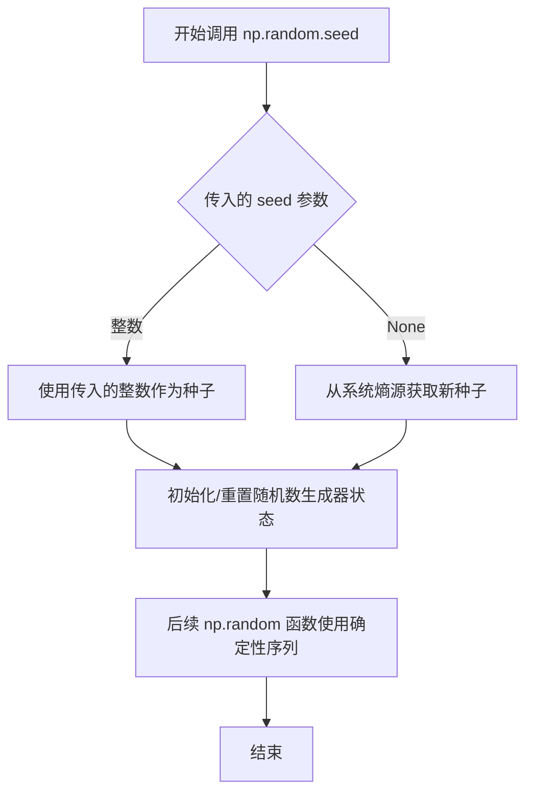
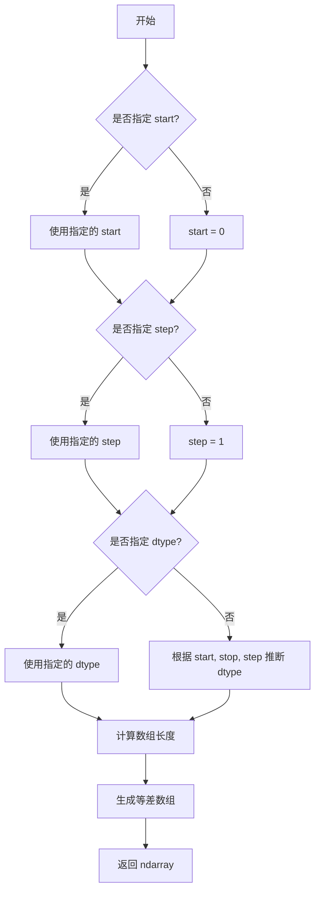
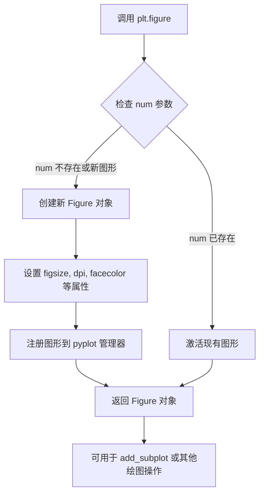
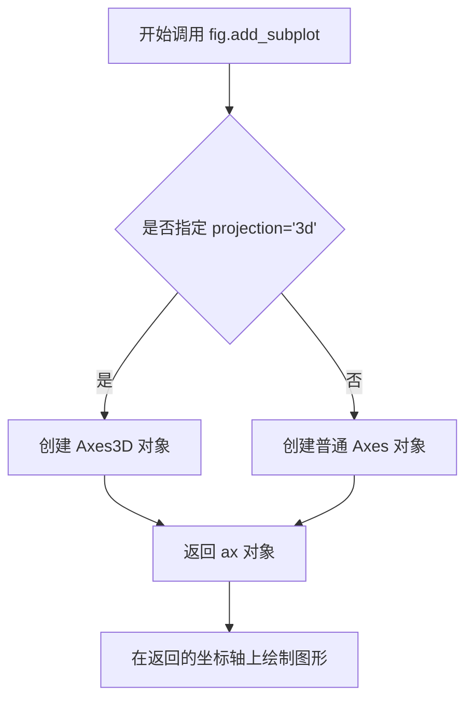
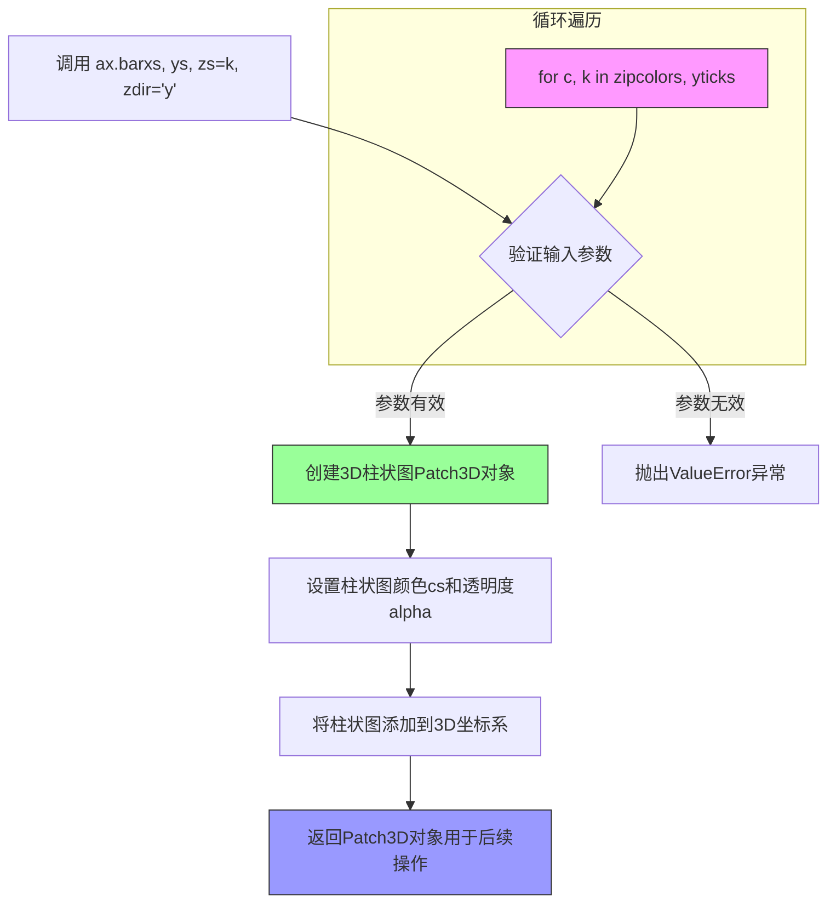
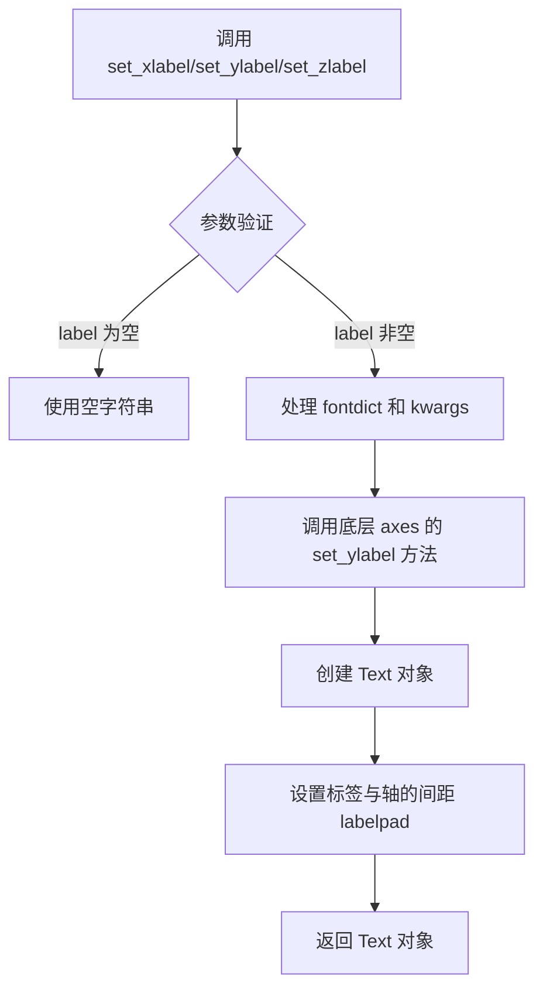
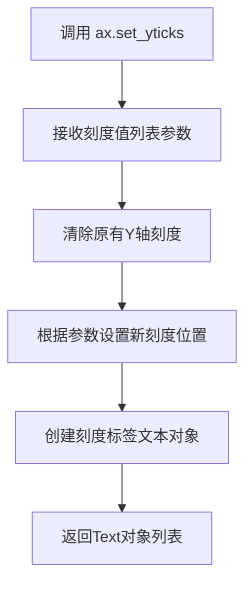
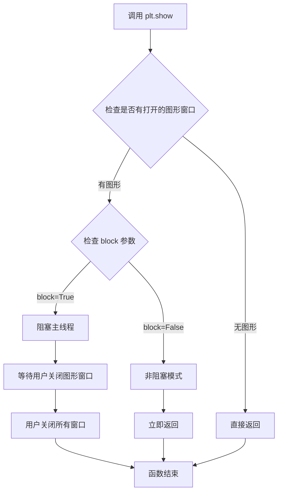
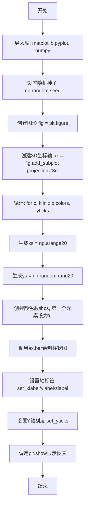

# `matplotlib\galleries\examples\mplot3d\bars3d.py` 详细设计文档

该代码演示如何使用matplotlib在3D空间中绘制投影在各个y平面（y=0,1,2,3）上的2D柱状图，通过随机生成数据并使用不同颜色区分，展示3D数据可视化的基本用法。

## 整体流程

```mermaid
graph TD
    A[开始] --> B[设置随机种子 np.random.seed(19680801)]
    B --> C[创建3D图表 fig = plt.figure()]
    C --> D[添加3D子图 ax = fig.add_subplot(projection='3d')]
    D --> E[定义颜色列表和y轴刻度]
    E --> F{遍历颜色和y刻度}
    F -->|每次迭代| G[生成xs=np.arange(20), ys=随机数据]
    G --> H[构建颜色数组cs，将第一个柱设为青色]
    H --> I[绘制柱状图 ax.bar(xs, ys, zs=k, zdir='y')]
    I --> F
    F -->|完成| J[设置XYZ轴标签]
    J --> K[设置y轴刻度]
    K --> L[调用plt.show()显示图表]
```

## 类结构

```
该脚本为面向过程式编程，未定义任何类
主要使用matplotlib.pyplot和numpy两个库的函数
```

## 全局变量及字段


### `fig`
    
matplotlib.figure.Figure对象，整个图表容器

类型：`matplotlib.figure.Figure`
    


### `ax`
    
matplotlib.axes._axes.Axes3D对象，3D坐标系对象

类型：`matplotlib.axes._axes.Axes3D`
    


### `colors`
    
包含['r','g','b','y']四种颜色字符串的列表

类型：`list`
    


### `yticks`
    
包含[3,2,1,0]四个y轴刻度值的列表

类型：`list`
    


### `xs`
    
0到19的整数序列，作为柱状图的x坐标

类型：`numpy.ndarray`
    


### `ys`
    
20个0到1之间的随机浮点数

类型：`numpy.ndarray`
    


### `cs`
    
颜色列表，长度与xs相同，用于给每个柱子着色

类型：`list`
    


### `c`
    
当前循环遍历的颜色值

类型：`str`
    


### `k`
    
当前循环遍历的y轴位置

类型：`int`
    


    

## 全局函数及方法


### `np.random.seed`

设置 NumPy 随机数生成器的种子，确保后续生成的随机数序列可复现。

参数：

- `seed`：`int` 或 `None`，随机数种子值。传入整数时使用该值作为种子；传入 `None` 时，每次调用会从系统熵源获取不同的随机种子。

返回值：`None`，该函数无返回值，直接修改全局随机数生成器的内部状态。

#### 流程图



#### 带注释源码

```python
import numpy as np

# 固定随机状态以确保可复现性
# seed 参数：19680801 是任意选择的整数，用于初始化随机数生成器
# 设置后，后续所有 np.random 调用将产生相同的随机数序列
np.random.seed(19680801)

# 例如：每次运行此代码，rand(20) 产生的数据都相同
ys = np.random.rand(20)
```

#### 上下文使用示例

```python
import matplotlib.pyplot as plt
import numpy as np

# Fixing random state for reproducibility
# 目的：确保生成的随机数据在多次运行中保持一致
# 便于调试、复现结果或与他人共享精确一致的图表
np.random.seed(19680801)

# 后续代码使用相同的随机数据绘制 3D 柱状图
# 无论何时运行这段代码，图表中的数据都完全相同
```


### `np.random.rand`

生成指定形状的随机数组，元素取值范围为[0, 1)，即均匀分布的随机浮点数。

参数：

- `*shape`：可变数量的整数参数（int），表示输出数组的维度。例如，传入单个整数n生成一维数组(n,)，传入两个整数(m, n)生成二维数组m×n，以此类推。
- `d0, d1, ..., dn`：`int`，维度参数（当作为关键字参数或位置参数传入时），定义输出数组的形状。

返回值：`ndarray`，返回指定形状的随机浮点数数组，元素值在[0, 1)区间内均匀分布。

#### 流程图

```mermaid
flowchart TD
    A[开始] --> B{是否传入维度参数?}
    B -->|是| C[根据参数数量确定输出数组维度]
    B -->|否| D[返回单个随机浮点数]
    C --> E[创建指定形状的ndarray]
    E --> F[为每个元素生成[0,1均匀分布的随机值]
    F --> G[返回填充好的数组]
    D --> G
    G --> H[结束]
```

#### 带注释源码

```python
# np.random.rand 函数源码逻辑（基于NumPy实现）

# 函数签名: numpy.random.rand(d0, d0, ..., dn)
# 参数: 可变数量的整数维度参数
# 返回: 指定形状的随机数组

# 实际调用示例（在给定代码中）:
# ys = np.random.rand(20)

# 等价于:
# 1. 接收维度参数 20
# 2. 创建形状为 (20,) 的一维数组
# 3. 使用均匀分布 [0, 1) 填充数组每个元素
# 4. 返回结果数组

# 在给定代码上下文中的使用:
xs = np.arange(20)              # 生成0到19的整数序列作为x轴
ys = np.random.rand(20)         # 生成20个[0,1)区间内的随机浮点数作为y轴高度
# 这20个随机值将决定每个柱子的高度

# 函数内部简化逻辑:
# def rand(*shape):
#     return random_sample(shape)
# 
# 其中 random_sample 使用 Mersenne Twister 等随机数生成器
# 生成均匀分布的伪随机数
```

#### 在给定代码中的具体调用

```python
# 代码第18行
ys = np.random.rand(20)

# 参数:
# - 20: int，指定生成20个随机数，即一维数组长度为20

# 返回值:
# - ys: ndarray，形状为(20,)，包含20个[0,1)区间内的随机浮点数

# 在3D柱状图中的作用:
# 决定每个x位置（xs对应）处柱子的高度（z轴方向的长度）
```


### `np.arange`

生成均匀间隔的数值序列，返回一个包含从起始值到结束值（不包含）的连续数值的 NumPy 数组。

参数：

- `start`：`int` 或 `float`，可选，起始值，默认为 0
- `stop`：`int` 或 `float`，必需，结束值（不包含）
- `step`：`int` 或 `float`，可选，步长，默认为 1
- `dtype`：`dtype`，可选，输出数组的数据类型，若未指定则从输入参数推断

返回值：`numpy.ndarray`，包含均匀间隔数值的数组

#### 流程图



#### 带注释源码

```python
# numpy.arange 函数源码示例
# 对应代码中的使用: xs = np.arange(20)

# 函数调用: np.arange(20)
# 等价于: np.arange(start=0, stop=20, step=1, dtype=None)

# 1. 参数解析
start = 0          # 起始值，默认0
stop = 20          # 结束值（不包含）
step = 1           # 步长，默认1
dtype = None       # 数据类型自动推断

# 2. 计算数组长度
# num = ceil((stop - start) / step)
# num = ceil(20 / 1) = 20
num = 20

# 3. 生成数组
# 使用 np.linspace 类似逻辑生成等差数列
# result = start + step * np.arange(num)
# result = 0 + 1 * [0, 1, 2, ..., 19]
# result = [0, 1, 2, 3, ..., 19]

# 4. 返回结果数组
# array([0, 1, 2, 3, 4, 5, 6, 7, 8, 9, 10, 11, 12, 13, 14, 15, 16, 17, 18, 19])
```


### `plt.figure`

创建并返回一个新的图形窗口（Figure 对象），用于后续的绘图操作。该函数是 matplotlib 中所有绘图的起点，可以设置图形的尺寸、DPI、背景色等属性。

参数：

- `figsize`：`tuple` (width, height)，可选，默认为 `[6.4, 4.8]`，以英寸为单位的图形宽高
- `dpi`：`int`，可选，默认为 `100`，图形的分辨率（每英寸点数）
- `facecolor`：`str` 或 `color`，可选，默认为 `'white'`，图形的背景颜色
- `edgecolor`：`str` 或 `color`，可选，默认为 `'white'`，图形的边框颜色
- `frameon`：`bool`，可选，默认为 `True`，是否显示图形边框
- `FigureClass`：`class`，可选，默认使用 `matplotlib.figure.Figure`，自定义 Figure 类
- `num`：`int` 或 `str`，可选，图形的标识符，如果存在则激活已存在的图形
- `clear`：`bool`，可选，默认为 `False`，如果图形已存在是否清除

返回值：`matplotlib.figure.Figure`，新创建或已激活的图形对象

#### 流程图



#### 带注释源码

```python
# 从 matplotlib.pyplot 模块导入 figure 函数
# 以下为 plt.figure() 的核心实现逻辑

def figure(num=None,  # 图形标识符，可以是整数或字符串
           figsize=None,  # 图形尺寸 (宽度, 高度) 英寸
           dpi=None,  # 分辨率
           facecolor=None,  # 背景色
           edgecolor=None,  # 边框色
           frameon=True,  # 是否显示边框
           FigureClass=Figure,  # 自定义 Figure 类
           clear=False,  # 是否清除已存在的图形
           **kwargs):
    """
    创建一个新的图形窗口
    
    参数:
        num: 图形的唯一标识符，便于后续引用
        figsize: 图形大小，默认为 [6.4, 4.8] 英寸
        dpi: 分辨率，默认 100
        facecolor: 背景颜色，默认白色
        edgecolor: 边框颜色，默认白色
        frameon: 是否显示边框，默认显示
        FigureClass: Figure 类，默认使用 matplotlib.figure.Figure
        clear: 如果图形已存在是否清空，默认 False
        **kwargs: 传递给 Figure 构造器的其他参数
    
    返回:
        Figure: 新创建或激活的图形对象
    """
    
    # 获取全局图形管理器
    manager = _pylab_helpers.Gcf.get_figure_manager(num)
    
    # 如果存在对应 num 的图形且不清除
    if manager is not None and not clear:
        # 激活现有图形并返回
        fig = manager.canvas.figure
        return fig
    
    # 创建新的 Figure 对象
    # 参数传递给 Figure 类的构造器
    fig = FigureClass(
        figsize=figsize,
        dpi=dpi,
        facecolor=facecolor,
        edgecolor=edgecolor,
        frameon=frameon,
        **kwargs
    )
    
    # 创建图形管理器
    manager = FigureCanvasBase(fig)
    
    # 注册到全局管理器
    Gcf.register(manager, num)
    
    # 如果需要清除旧图形
    if clear and manager is not None:
        fig.clear()
    
    # 返回新创建的 Figure 对象
    return fig

# 在示例代码中的使用
fig = plt.figure()  # 创建新图形，保存返回的 Figure 对象
ax = fig.add_subplot(projection='3d')  # 在图形上添加子图
```


### `matplotlib.figure.Figure.add_subplot()`

在matplotlib中，add_subplot()方法用于向图形添加一个子图。当传入projection='3d'参数时，该方法会创建一个三维坐标系，返回一个Axes3D对象，用于在三维空间中进行数据可视化。

参数：

- `*args`：位置参数，可选，用于指定子图的位置和布局。常见格式包括：
  - 三个整数（行数、列数、索引），如(1,1,1)或111
  - 在Python 3.6+也可以直接传递三个整数作为位置参数
- `projection`：字符串，可选，指定投影类型。传入'3d'时创建三维坐标系，默认值为None（2D坐标系）
- `**kwargs`：关键字参数传递给Axes构造函数，可包含alpha（透明度）、facecolor（背景色）等

返回值：`matplotlib.axes._axes.Axes3D`，返回一个三维坐标轴对象，用于绘制3D图表（如3D柱状图、3D散点图等）

#### 流程图



#### 带注释源码

```python
# 创建图形窗口
fig = plt.figure()

# 调用 add_subplot 方法创建 3D 子图
# 参数 projection='3d' 指定创建三维坐标系
ax = fig.add_subplot(projection='3d')

# 解释：
# 1. fig 是通过 plt.figure() 创建的 Figure 对象
# 2. add_subplot() 方法将子图添加到图形中
# 3. projection='3d' 参数告诉 matplotlib 创建 3D 坐标系统而非默认的 2D
# 4. 返回的 ax 是 Axes3D 类型对象，用于后续的 3D 绘图操作

# 示例：在 3D 坐标系中绘制柱状图
colors = ['r', 'g', 'b', 'y']
yticks = [3, 2, 1, 0]
for c, k in zip(colors, yticks):
    xs = np.arange(20)
    ys = np.random.rand(20)
    cs = [c] * len(xs)
    cs[0] = 'c'
    # ax.bar() 在 3D 空间中绘制柱状图
    ax.bar(xs, ys, zs=k, zdir='y', color=cs, alpha=0.8)

# 设置坐标轴标签
ax.set_xlabel('X')
ax.set_ylabel('Y')
ax.set_zlabel('Z')

plt.show()
```


### `ax.bar()` / `Axes3D.bar()`

在3D空间中绘制柱状图，通过zs参数指定z位置，zdir='y'指定对齐方向为y轴。

参数：

- `xs`：`array-like`，x轴上的柱状图位置
- `ys`：`array-like`，柱状图的高度（数值）
- `zs`：`float or array-like`，默认值为0，z轴上的位置（本例中为k，即3, 2, 1, 0）
- `zdir`：`{'x', 'y', 'z', '0', '1'}`，默认值为'z'，指定哪个方向作为z轴（本例中为'y'）
- `zorder`：`int or float`，默认值为2，绘图顺序
- `color`：`color or list of color`，柱状图的颜色（本例中为['r', 'g', 'b', 'y']的循环）
- `alpha`：`float`，默认值为None，透明度（本例中为0.8，即80%不透明）

返回值：`mpl_toolkits.mplot3d.art3d.Patch3D`，返回3D柱状图对象

#### 流程图



#### 带注释源码

```python
# 循环遍历颜色和y轴位置
for c, k in zip(colors, yticks):  # colors=['r','g','b','y'], yticks=[3,2,1,0]
    # 生成x轴数据：0到19的整数
    xs = np.arange(20)
    # 生成20个随机数作为柱状图的高度
    ys = np.random.rand(20)
    
    # 创建与xs长度相同的颜色列表，初始为当前循环颜色c
    cs = [c] * len(xs)
    # 将第一个柱状图的颜色设置为青色'c'以作区分
    cs[0] = 'c'
    
    # 调用3D柱状图绘制方法
    # 参数说明：
    #   xs: x轴位置（0-19）
    #   ys: 柱状图高度（随机生成的值）
    #   zs=k: 将柱状图放置在z轴的k位置（本例中为3,2,1,0）
    #   zdir='y': 指定y轴作为深度方向，即柱状图沿着y轴排列
    #   color=cs: 柱状图颜色（包含青色点缀）
    #   alpha=0.8: 80%不透明度，20%透明度
    ax.bar(xs, ys, zs=k, zdir='y', color=cs, alpha=0.8)
```

#### 关键组件信息

| 组件名称 | 一句话描述 |
|---------|-----------|
| `ax.bar()` | matplotlib 3D坐标系的柱状图绘制方法，支持在指定平面上绘制2D柱状图 |
| `colors` | 用于区分不同y层的颜色列表['r', 'g', 'b', 'y'] |
| `yticks` | y轴上离散的数据点位置[3, 2, 1, 0] |
| `xs` | x轴位置数组，从0到19 |
| `ys` | 随机生成的柱状图高度值 |
| `cs` | 动态构建的颜色列表，首个元素为青色'c'用于标识 |

#### 潜在技术债务与优化空间

1. **数据生成位置**：随机数据在循环内部生成，每次运行结果不同，建议将随机种子固定或数据生成移到循环外
2. **颜色列表构建**：`cs = [c] * len(xs)` 每次循环都创建新列表，可优化为预分配
3. **硬编码参数**：颜色、透明度等参数可提取为配置常量，提高可维护性
4. **标签缺失**：缺少图例（legend）说明每个颜色代表的含义

#### 其它说明

- **设计目标**：演示如何在3D图表的不同平面上绘制2D柱状图（多平面投影效果）
- **约束条件**：`zdir='y'` 意味着柱状图沿着y轴方向排列，形成平行的平面
- **错误处理**：当xs和ys长度不匹配时，matplotlib会抛出ValueError异常
- **外部依赖**：依赖 `matplotlib.pyplot`、`numpy` 和 `mpl_toolkits.mplot3d`


### `Axes3D.set_xlabel/set_ylabel/set_zlabel`

这三个方法用于设置 3D 图表的坐标轴标签，分别对应 X 轴、Y 轴和 Z 轴的标签设置。它们的实现逻辑基本相同，只是针对不同的坐标轴。

参数：

- `label`：`str`，坐标轴标签的文本内容
- `fontdict`：`dict`，可选，用于控制标签外观的字典（如字体大小、颜色等）
- `labelpad`：`float`，可选，标签与坐标轴之间的间距（磅值）
- `**kwargs`：其他关键字参数，用于设置文本属性（fontsize, color, fontweight 等）

返回值：`matplotlib.text.Text`，返回创建的标签文本对象，可用于后续操作如设置样式

#### 流程图



#### 带注释源码

```python
# matplotlib Axes3D 类中的方法实现（简化版）

def set_xlabel(self, xlabel, fontdict=None, labelpad=None, **kwargs):
    """
    Set the label for the x-axis.
    
    参数:
        xlabel: str - x 轴标签文本
        fontdict: dict - 控制文本外观的字典
        labelpad: float - 标签与轴的间距
        **kwargs: 其他文本属性参数
    """
    # 如果提供了 fontdict，将其与 kwargs 合并
    if fontdict:
        kwargs.update(fontdict)
    
    # 调用底层方法设置 x 轴标签
    # self.xaxis 访问 x 轴对象
    # self.xaxis.set_label_text() 设置标签文本
    return self.xaxis.set_label_text(xlabel, **kwargs)

def set_ylabel(self, ylabel, fontdict=None, labelpad=None, **kwargs):
    """
    Set the label for the y-axis.
    
    参数:
        ylabel: str - y 轴标签文本
        fontdict: dict - 控制文本外观的字典
        labelpad: float - 标签与轴的间距
        **kwargs: 其他文本属性参数
    """
    if fontdict:
        kwargs.update(fontdict)
    
    # 调用底层方法设置 y 轴标签
    return self.yaxis.set_label_text(ylabel, **kwargs)

def set_zlabel(self, zlabel, fontdict=None, labelpad=None, **kwargs):
    """
    Set the label for the z-axis.
    
    参数:
        zlabel: str - z 轴标签文本
        fontdict: dict - 控制文本外观的字典
        labelpad: float - 标签与轴的间距
        **kwargs: 其他文本属性参数
    """
    if fontdict:
        kwargs.update(fontdict)
    
    # 调用底层方法设置 z 轴标签
    # self.zaxis 访问 z 轴对象
    return self.zaxis.set_label_text(zlabel, **kwargs)

# 使用示例（来自代码）
ax.set_xlabel('X')    # 设置 X 轴标签为 'X'
ax.set_ylabel('Y')    # 设置 Y 轴标签为 'Y'
ax.set_zlabel('Z')    # 设置 Z 轴标签为 'Z'
```


### `Axes3D.set_yticks`

该方法用于设置3D坐标系中Y轴的刻度值（刻度位置），允许用户自定义Y轴上显示的刻度线，而不是使用自动计算的刻度。

参数：

- `ticks`：`list` 或 `array-like`，要设置的Y轴刻度值列表，在本例中为 `[3, 2, 1, 0]`

返回值：`list of matplotlib.text.Text`，返回设置后的刻度标签文本对象列表

#### 流程图



#### 带注释源码

```python
# 代码中的实际调用
yticks = [3, 2, 1, 0]  # 定义要设置的Y轴刻度值列表
ax.set_yticks(yticks)  # 设置Y轴刻度为指定的离散值

# 内部实现逻辑（matplotlib核心逻辑简化）
def set_yticks(self, ticks):
    """
    Set the y ticks with list of ticks
    
    参数:
        ticks: array-like - 刻度值列表
    
    返回:
        list of Text - 刻度标签对象列表
    """
    # 1. 将输入转换为数组
    ticks = np.asarray(ticks)
    
    # 2. 获取Y轴刻度定位器并设置新刻度
    ax = self.yaxis
    ax.set_major_locator(mticker.FixedLocator(ticks))
    
    # 3. 返回刻度标签以便进一步自定义
    return ax.get_major_ticks()[0].label1.get_text() if ticks.size else []
```


### `plt.show`

`plt.show()` 是 matplotlib 库中的全局函数，用于显示所有当前打开的图形窗口。在调用此函数之前，图形对象会被创建但不会立即显示；在调用 `plt.show()` 后，图形会被渲染并展示给用户。此函数通常放在脚本末尾，用于阻塞程序执行直到用户关闭图形窗口（在某些后端中）。

参数：

- `block`：`bool`，默认为 `True`。当设置为 `True` 时，函数会阻塞程序执行，直到用户关闭所有打开的图形窗口；当设置为 `False` 时，函数会立即返回，图形窗口会保持打开但不会阻塞主线程（在某些交互式后端中）。

返回值：`None`，该函数没有返回值。

#### 流程图



#### 带注释源码

```python
def show(*, block=None):
    """
    显示所有打开的图形窗口。
    
    参数:
        block: bool, 可选
            是否阻塞程序执行以便与图形窗口交互。
            默认为 True，程序会阻塞直到用户关闭窗口。
            设为 False 可使函数立即返回（在支持的交互式后端中）。
    
    返回值:
        None
    
    注意:
        在某些后端（如 Agg）中，此函数可能不执行任何操作，
        因为这些后端不支持交互式显示。
    """
    # 获取当前图形管理器
    # _pylab_helpers 模块管理图形窗口的生命周期
    global _backend_mod, allnums
    
    # 检查是否有活动的图形
    # Gcf 是一个类，用于跟踪所有活动的图形
    managers = Gcf.get_all_fig_managers()
    
    if not managers:
        # 如果没有打开的图形，直接返回
        return
    
    # 如果 block 参数为 None，根据后端类型决定是否阻塞
    # 在交互式后端（如 TkAgg, Qt5Agg）中默认阻塞
    # 在非交互式后端（如 Agg, PDF）中默认不阻塞
    if block is None:
        # 检查是否为交互式后端
        block = is_interactive() and get_backend() in interactive_bk
    
    # 遍历所有图形管理器并显示
    for manager in managers:
        # 调用后端的显示方法
        # 通常是 plt.draw() 的包装
        manager.show()
        
        # 如果是阻塞模式，进入事件循环
        # 这允许用户与图形窗口交互
        if block:
            # 在不同后端中实现方式不同
            # Qt: QApplication.exec_()
            # Tk: mainloop()
            # MacOSX: 启动Cocoa运行循环
            manager._show(block=True)
    
    # 对于非阻塞模式，立即返回
    # 图形窗口保持打开但程序继续执行
    # 此时通常需要在事件循环中调用 figure.draw_if_interactive()
    
    return None  # 无返回值
```

---

### 文档总结

#### 核心功能描述

该代码示例展示了如何使用 matplotlib 创建一个 3D 图表，并在不同的 Y 平面（y=0, 1, 2, 3）上绘制 2D 柱状图，最终通过 `plt.show()` 将生成的图形显示给用户。

#### 关键组件信息

| 组件名称 | 一句话描述 |
|---------|-----------|
| `plt.figure()` | 创建并返回一个新的图形窗口/画布 |
| `fig.add_subplot(projection='3d')` | 向图形添加一个 3D 坐标轴子图 |
| `ax.bar(xs, ys, zs=k, zdir='y', ...)` | 在指定的 3D 平面上绘制柱状图 |
| `plt.show()` | 渲染并显示所有打开的图形窗口 |

#### 潜在技术债务与优化空间

1. **随机数据生成**：使用 `np.random.seed(19680801)` 固定随机种子是良好的可重现性实践，但如果需要动态数据，应考虑外部配置或参数化。

2. **硬编码颜色与标签**：颜色数组 `['r', 'g', 'b', 'y']` 和 Y 轴刻度值是硬编码的，建议提取为配置常量或从数据中动态生成。

3. **缺乏错误处理**：代码未处理可能的异常情况（如无效的数据长度、图形创建失败等）。

#### 其它说明

- **设计目标**：演示如何在 Matplotlib 中创建带有 2D 柱状图投影的 3D 图表。
- **外部依赖**：该代码依赖 `matplotlib` 和 `numpy` 库。
- **交互行为**：`plt.show()` 在不同操作系统和后端下的行为可能略有差异（如 macOS 的某些后端可能需要特殊的退出操作）。

## 关键组件


### 核心功能概述

该代码使用Matplotlib创建一个3D图表，在四个不同的y平面（y=0, 1, 2, 3）上绘制2D柱状图，展示如何在三维空间中可视化多组二维数据，并通过不同颜色和透明度增强视觉效果。

### 文件运行流程

1. 导入matplotlib.pyplot和numpy库
2. 设置随机种子(19680801)确保数据可重现性
3. 创建图形窗口和3D投影坐标轴
4. 定义颜色列表和y轴刻度值
5. 循环遍历每个y平面，生成随机数据并绘制柱状图
6. 为每个y层设置不同颜色，并将每组第一个柱子设为青色
7. 设置X、Y、Z轴标签
8. 设置Y轴刻度为特定的离散值
9. 调用plt.show()显示图表

### 类和函数详细信息

#### 全局变量

| 名称 | 类型 | 描述 |
|------|------|------|
| fig | matplotlib.figure.Figure | 图形窗口对象 |
| ax | matplotlib.axes._axes.Axes | 3D坐标轴对象 |
| colors | list | 包含四种颜色的列表 ['r','g','b','y'] |
| yticks | list | Y轴刻度值列表 [3,2,1,0] |
| xs | numpy.ndarray | X轴数据，0-19的整数序列 |
| ys | numpy.ndarray | Y轴（实际上是Z方向高度）随机数据 |
| cs | list | 颜色数组，每组第一个元素为'c'(青色) |

#### 全局函数/方法

| 名称 | 参数 | 参数类型 | 参数描述 | 返回类型 | 返回描述 | 流程图 |
|------|------|----------|----------|----------|----------|--------|
| np.random.seed() | seed | int | 随机种子确保可重现性 | None | 设置随机数生成器初始状态 | - |
| fig.add_subplot() | projection | str | 设为'3d'创建3D坐标轴 | AxesSubplot | 返回3D坐标轴对象 | - |
| ax.bar() | xs, ys, zs, zdir, color, alpha | various | xs为X位置，ys为柱高，zs为y平面位置，zdir指定方向，color为颜色，alpha为透明度 | BarContainer | 返回柱状图容器对象 | 见下方mermaid |
| ax.set_xlabel/ylabel/zlabel() | label | str | 设置各轴标签 | Text | 返回标签文本对象 | - |
| ax.set_yticks() | ticks | list | 设置Y轴特定刻度位置 | list | 返回刻度位置列表 | - |
| plt.show() | - | - | 显示图形窗口 | None | 渲染并展示图表 | - |



```python
# 带注释源码
import matplotlib.pyplot as plt  # 导入matplotlib绘图库
import numpy as np  # 导入numpy数值计算库

# Fixing random state for reproducibility
# 设置随机种子确保每次运行生成相同的随机数据
np.random.seed(19680801)

# 创建图形窗口
fig = plt.figure()
# 添加3D投影子图，返回3D坐标轴对象
ax = fig.add_subplot(projection='3d')

# 定义四种颜色用于区分不同的y平面
colors = ['r', 'g', 'b', 'y']
# 定义y轴刻度值，对应四个不同的y平面
yticks = [3, 2, 1, 0]

# 遍历每种颜色和y平面位置
for c, k in zip(colors, yticks):
    # Generate the random data for the y=k 'layer'.
    # 生成X轴数据：0到19的整数序列
    xs = np.arange(20)
    # 生成Y轴数据（实际上是柱子的高度）：20个0-1之间的随机数
    ys = np.random.rand(20)

    # You can provide either a single color or an array with the same length as
    # xs and ys. To demonstrate this, we color the first bar of each set cyan.
    # 为每个柱子创建颜色数组，默认使用同一种颜色
    cs = [c] * len(xs)
    # 将每组柱状图的第一个柱子设为青色'c'以作区分
    cs[0] = 'c'

    # Plot the bar graph given by xs and ys on the plane y=k with 80% opacity.
    # 在y=k平面绘制柱状图，zdir='y'表示沿y轴方向排列
    # alpha=0.8设置80%透明度使图表更美观
    ax.bar(xs, ys, zs=k, zdir='y', color=cs, alpha=0.8)

# 设置坐标轴标签
ax.set_xlabel('X')
ax.set_ylabel('Y')
ax.set_zlabel('Z')

# On the y-axis let's only label the discrete values that we have data for.
# 只在有数据的y值位置显示刻度标签
ax.set_yticks(yticks)

# 显示图形
plt.show()
```

### 关键组件信息

### 3D柱状图渲染引擎

使用Matplotlib的3D Axes子模块，通过bar()方法的zdir参数控制柱状图在三维空间中的排列方向，实现多平面数据可视化。

### 随机数据生成器

使用NumPy的rand()函数生成均匀分布的随机浮点数，配合固定种子确保结果可重现。

### 多平面颜色管理系统

通过颜色数组动态控制每个柱状图的颜色，实现同一平面内不同柱子的颜色差异化。

### 透明度渲染系统

通过alpha参数控制柱状图透明度，使重叠或相邻的柱子视觉上更容易区分。

### 潜在技术债务与优化空间

### 硬编码参数问题

颜色列表、y平面值、随机种子等参数均硬编码在代码中，缺乏可配置性。建议将这些参数提取为配置文件或函数参数。

### 数据生成逻辑内联

随机数据生成逻辑直接嵌入循环内部，未与渲染逻辑分离，不利于单元测试和代码复用。

### 魔法数字

20这个数值（柱状图数量）出现多次，应定义为常量避免重复。

### 错误处理缺失

未对add_subplot返回的轴对象进行空值检查，也未处理可能的图形创建失败情况。

### 图表尺寸未优化

未指定图形尺寸( figsize参数)，可能不适合特定展示场景需求。

### 其他项目

#### 设计目标与约束

目标是演示在三维坐标系中绘制多组二维柱状图的技术，使用固定颜色方案和80%透明度确保视觉清晰度。

#### 错误处理与异常设计

当前实现未包含任何异常捕获机制，依赖Matplotlib内置的错误处理。

#### 数据流与状态机

数据流为：随机种子设置 → 数据生成 → 图形渲染 → 展示。无复杂状态机逻辑。

#### 外部依赖与接口契约

依赖Matplotlib 3D绘图模块和NumPy数值计算库，接口契约由这两个库的API决定。

#### 可扩展性分析

可通过添加函数参数支持自定义颜色方案、数据来源和渲染样式，便于在其他项目中复用核心逻辑。


## 问题及建议


### 已知问题

- 硬编码的随机种子`np.random.seed(19680801)`导致每次运行生成相同的随机数据，缺乏灵活性
- 魔法数字散布在代码中（如20、0.8），缺乏常量定义，可维护性差
- 颜色列表`colors`和yticks列表`yticks`分开定义但长度必须保持一致，容易导致同步错误
- 循环内重复创建`cs = [c] * len(xs)`列表，效率较低
- alpha值硬编码为0.8，且注释写成"80%"与代码不统一
- 缺乏参数化设计，柱状图数量(20)和层级数量(4)固定，无法适应不同数据规模
- 没有函数封装，难以复用和扩展
- x轴和z轴使用默认刻度，而y轴做了刻度定制，整体不一致

### 优化建议

- 将随机种子改为可配置参数或移除，使用真正的随机数据
- 定义常量类或配置文件集中管理数值参数（如`NUM_BARS = 20`, `ALPHA = 0.8`）
- 使用字典或元组列表配对颜色和yticks，确保同步（如`configs = [('r', 3), ('g', 2), ...]`）
- 将`cs`初始化移至循环外或使用列表推导式优化
- 提取绘图逻辑为函数，接收数据、颜色、位置等参数，提高代码复用性
- 为`bar`方法添加错误处理和数据验证
- 考虑使用`ax.set_xticks`和`ax.set_zticks`与y轴保持一致的风格
- 添加类型注解和文档字符串，提升代码可读性和可维护性


## 其它


### 一段话描述

该代码使用matplotlib库在三维坐标系中创建2D柱状图，将四组不同颜色的柱状图分别投影到y=0、y=1、y=2、y=3四个不同的垂直平面上，展示了如何在3D空间中可视化多组2D数据，并设置了坐标轴标签和y轴刻度。

### 文件的整体运行流程

1. 导入必要的库：matplotlib.pyplot和numpy
2. 设置随机种子以确保可重复性
3. 创建图形窗口和3D坐标轴
4. 定义颜色列表和y轴刻度值
5. 循环遍历颜色和y值，为每个y平面绘制柱状图
6. 设置坐标轴标签（X、Y、Z）
7. 设置y轴的离散刻度
8. 调用plt.show()显示图形

### 全局变量

| 名称 | 类型 | 描述 |
|------|------|------|
| fig | matplotlib.figure.Figure | 图形对象，用于容纳所有绘图元素 |
| ax | matplotlib.axes._axes.Axes | 3D坐标轴对象，用于执行所有绘图操作 |
| colors | list[str] | 包含四种颜色名称的列表：红、绿、蓝、黄 |
| yticks | list[int] | y轴刻度值列表 [3, 2, 1, 0] |
| xs | numpy.ndarray | x轴数据，值为0-19的整数序列 |
| ys | numpy.ndarray | y轴（实际为z轴高度）随机数据 |
| cs | list[str] | 颜色数组，用于设置每个柱子的颜色 |

### 全局函数

该脚本没有定义全局函数，所有操作均为过程式代码，直接在模块级别执行。

### 关键组件信息

| 名称 | 描述 |
|------|------|
| matplotlib.pyplot | Python可视化库，用于创建各种类型的图表 |
| numpy.random | 随机数生成模块，用于生成示例数据 |
| ax.bar() | 3D坐标轴的柱状图绘制方法，支持在指定平面绘制柱状图 |
| projection='3d' | 参数，指定为3D投影模式 |

### 潜在的技术债务或优化空间

1. **硬编码数据**：颜色列表、y轴刻度值和数据量都是硬编码的，缺乏灵活性
2. **无错误处理**：没有对输入数据进行验证，缺乏异常处理机制
3. **重复代码**：循环中的柱状图创建逻辑可以进一步封装为函数
4. **注释不足**：代码缺少对关键参数（如zdir、alpha）的详细解释
5. **可配置性差**：无法通过参数配置柱状图数量、颜色方案、数据范围等

### 设计目标与约束

- **设计目标**：在3D空间中直观展示多组2D柱状图数据，便于比较不同y平面上的数据分布
- **约束条件**：依赖于matplotlib和numpy库，需要Python 3.x环境运行

### 错误处理与异常设计

- 当前代码未实现错误处理机制
- 潜在的异常场景：数据维度不匹配、颜色列表长度不足、随机数生成失败等
- 建议改进：添加数据验证、异常捕获和有意义的错误提示信息

### 数据流与状态机

- **数据流向**：随机种子设置 → 数据生成(xs, ys) → 颜色映射(cs) → 图形绘制(ax.bar) → 图形展示(plt.show)
- **状态变化**：初始状态(空图形) → 数据填充状态(绘制柱状图) → 标签设置状态 → 显示状态

### 外部依赖与接口契约

- **matplotlib**：核心绘图库，版本需支持3D投影功能
- **numpy**：数值计算库，用于生成随机数据和数组操作
- **接口契约**：ax.bar()方法接受xs(数组)、ys(数组)、zs(平面位置)、zdir(方向)、color(颜色)、alpha(透明度)参数

### 代码可测试性分析

- 当前代码难以进行单元测试，因为所有逻辑直接执行
- 建议将核心绘图逻辑封装为函数，接受数据、颜色等参数，提高可测试性
- 随机数据生成应可通过种子控制，便于测试验证

### 性能考虑

- 当前数据量较小（20个柱子×4组），性能表现良好
- 如需扩展到大规模数据，建议使用向量化操作替代循环
- 对于实时可视化场景，可考虑使用交互式后端


    