# `matplotlib\galleries\examples\mplot3d\box3d.py` 详细设计文档

该代码使用Matplotlib创建了一个3D盒式表面图，通过在三维网格体积的三个坐标面上绘制填充等高线来可视化体数据，并添加了坐标轴标签、视口设置和颜色条。

## 整体流程

```mermaid
graph TD
    A[开始] --> B[定义维度 Nx=100, Ny=300, Nz=500]
B --> C[创建网格坐标 X, Y, Z 使用 np.meshgrid]
C --> D[生成模拟数据 data = (((X+100)**2 + (Y-20)**2 + 2*Z)/1000+1)]
D --> E[创建图形 fig 和 3D 坐标轴 ax]
E --> F[在z方向绘制 contourf (offset=0)]
F --> G[在y方向绘制 contourf (offset=0)]
G --> H[在x方向绘制 contourf (offset=X.max)]
H --> I[设置坐标轴 limits]
I --> J[绘制3D盒子边缘线条]
J --> K[设置坐标轴标签和刻度]
K --> L[设置视角 view_init 和缩放 zoom]
L --> M[添加颜色条 colorbar]
M --> N[调用 plt.show 显示图形]
```

## 类结构

```
该脚本为过程式代码，无自定义类
主要使用 Matplotlib 库的对象:
├── matplotlib.figure.Figure
└── matplotlib.axes._axes.Axes3D
```

## 全局变量及字段


### `Nx`
    
X轴方向的网格维度常量，表示X方向上的采样点数

类型：`int`
    


### `Ny`
    
Y轴方向的网格维度常量，表示Y方向上的采样点数

类型：`int`
    


### `Nz`
    
Z轴方向的网格维度常量，表示Z方向上的采样点数

类型：`int`
    


### `X`
    
使用meshgrid生成的三维X坐标数组，表示空间中的X坐标分布

类型：`numpy.ndarray`
    


### `Y`
    
使用meshgrid生成的三维Y坐标数组，表示空间中的Y坐标分布

类型：`numpy.ndarray`
    


### `Z`
    
使用meshgrid生成的三维Z坐标数组，表示空间中的Z坐标分布（负方向）

类型：`numpy.ndarray`
    


### `data`
    
基于X、Y、Z坐标计算的三维数据数组，用于可视化的高度或颜色值

类型：`numpy.ndarray`
    


### `kw`
    
包含等高线绘制参数的字典，包含vmin、vmax和levels键值对

类型：`dict`
    


### `fig`
    
Matplotlib创建的Figure对象，用于承载3D axes和显示窗口

类型：`matplotlib.figure.Figure`
    


### `ax`
    
Matplotlib的3D坐标轴对象，用于绘制三维等高线曲面图

类型：`matplotlib.axes.Axes3D`
    


### `C`
    
最后一个contourf调用返回的等高线集合对象，用于colorbar显示

类型：`matplotlib.collections.PolyCollection`
    


### `edges_kw`
    
包含边缘绘制参数的字典，定义线条颜色、宽度和zorder

类型：`dict`
    


### `xmin`
    
X坐标的最小值，用于设置3D图的X轴显示范围

类型：`float`
    


### `xmax`
    
X坐标的最大值，用于设置3D图的X轴显示范围

类型：`float`
    


### `ymin`
    
Y坐标的最小值，用于设置3D图的Y轴显示范围

类型：`float`
    


### `ymax`
    
Y坐标的最大值，用于设置3D图的Y轴显示范围

类型：`float`
    


### `zmin`
    
Z坐标的最小值，用于设置3D图的Z轴显示范围

类型：`float`
    


### `zmax`
    
Z坐标的最大值，用于设置3D图的Z轴显示范围

类型：`float`
    


    

## 全局函数及方法


### `np.meshgrid`

创建三维坐标网格，用于在三维空间中表示数据点的坐标数组。

参数：

- `np.arange(Nx)`：`ndarray`，第一个维度的坐标数组（X轴）
- `np.arange(Ny)`：`ndarray`，第二个维度的坐标数组（Y轴）
- `-np.arange(Nz)`：`ndarray`，第三个维度的坐标数组（Z轴，取负值）

返回值：`tuple of ndarray`，返回三个三维数组 (X, Y, Z)，分别表示网格中每个点的X、Y、Z坐标。

#### 流程图

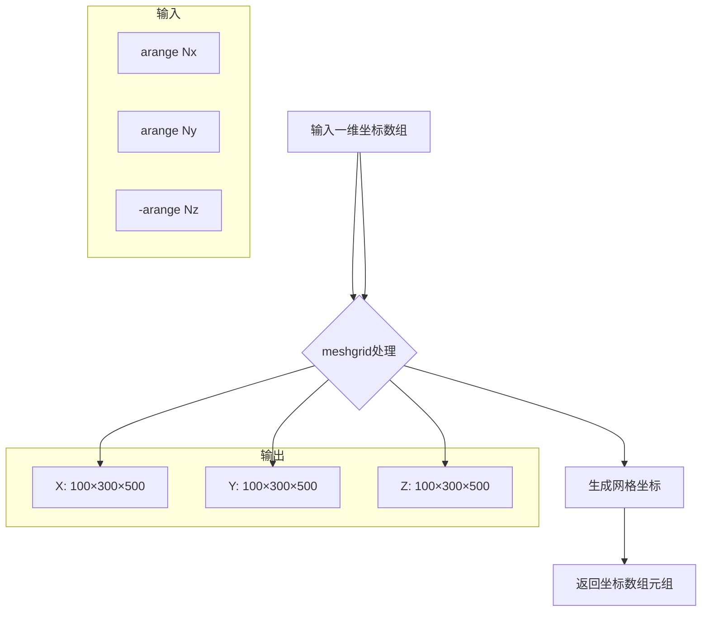

#### 带注释源码

```python
# 定义维度大小
Nx, Ny, Nz = 100, 300, 500

# 使用 np.meshgrid 创建三维网格坐标
# 参数说明：
#   - np.arange(Nx): 生成 0 到 Nx-1 的整数序列，作为X轴坐标
#   - np.arange(Ny): 生成 0 到 Ny-1 的整数序列，作为Y轴坐标  
#   - -np.arange(Nz): 生成 0 到 -(Nz-1) 的负整数序列，作为Z轴坐标（向下为负）
#
# 返回值：
#   - X: 三维数组，shape (Ny, Nx, Nz)，每个元素为该点的X坐标
#   - Y: 三维数组，shape (Ny, Nx, Nz)，每个元素为该点的Y坐标
#   - Z: 三维数组，shape (Ny, Nx, Nz)，每个元素为该点的Z坐标

X, Y, Z = np.meshgrid(np.arange(Nx), np.arange(Ny), -np.arange(Nz))

# 示例结果：
# X[0, 0, 0] = 0,    Y[0, 0, 0] = 0,    Z[0, 0, 0] = 0
# X[0, 1, 0] = 1,    Y[0, 1, 0] = 0,    Z[0, 1, 0] = 0
# X[0, 0, 1] = 0,    Y[0, 0, 1] = 0,    Z[0, 0, 1] = -1
```


### `np.arange`

创建等差数组（Arange）是NumPy库中的一个核心函数，用于生成具有均匀间隔值的一维数组。它类似于Python内置的`range()`函数，但返回的是NumPy数组而非迭代器，支持浮点数步长和多种数据类型。

参数：

- `start`：`int` 或 `float`，可选参数，序列的起始值，默认为0
- `stop`：`int` 或 `float`，必选参数，序列的结束值（不包含）
- `step`：`int` 或 `float`，可选参数，数组元素之间的步长，默认为1
- `dtype`：`dtype`，可选参数，输出数组的数据类型，如果未指定则从输入参数推断

返回值：`numpy.ndarray`，返回一个一维数组，包含从start到stop（不包含）的等差数列

#### 流程图

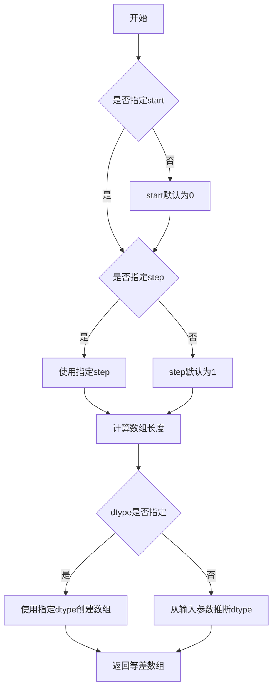

#### 带注释源码

```python
# numpy.arange函数源码分析

# 代码中的实际使用示例：
X, Y, Z = np.meshgrid(np.arange(Nx), np.arange(Ny), -np.arange(Nz))

# np.arange(Nx) - 创建从0到Nx-1的整数数组
# 参数：Nx = 100
# 返回：array([0, 1, 2, ..., 99])

# np.arange(Ny) - 创建从0到Ny-1的整数数组
# 参数：Ny = 300
# 返回：array([0, 1, 2, ..., 299])

# -np.arange(Nz) - 创建从0到-(Nz-1)的负整数数组（用于Z轴向下）
# 参数：Nz = 500
# 返回：array([0, -1, -2, ..., -499])

# 完整函数签名：
# numpy.arange([start, ]stop, [step, ]dtype=None, *, like=None)

# start参数：起始值（包含），默认为0
# stop参数：结束值（不包含）
# step参数：步长，可正可负
# dtype参数：指定输出数组的数据类型

# 使用示例：
# np.arange(10)        # array([0, 1, 2, 3, 4, 5, 6, 7, 8, 9])
# np.arange(0, 10, 2)  # array([0, 2, 4, 6, 8])
# np.arange(10, 0, -1) # array([10, 9, 8, 7, 6, 5, 4, 3, 2, 1])
# np.arange(0, 1, 0.1)  # array([0. , 0.1, 0.2, 0.3, 0.4, 0.5, 0.6, 0.7, 0.8, 0.9])
```


### `np.linspace`

生成指定数量的等间距样本数组，常用于创建均匀分布的数值范围，在本代码中用于生成等间距的等值线级别。

参数：

- `start`：`float`，起始值，本代码中为 `data.min()`，即数据的最小值
- `stop`：`float`，终止值，本代码中为 `data.max()`，即数据的最大值
- `num`：`int`，生成的样本数量，本代码中为 `10`，即生成10个等间距的数值

返回值：`ndarray`，返回一个包含 `num` 个等间距样本的一维数组

#### 流程图

```mermaid
flowchart TD
    A[开始] --> B[接收start, stop, num参数]
    B --> C[验证参数有效性]
    C --> D{num是否大于1?}
    D -->|否| E[返回空数组或单个值]
    D -->|是| F[计算步长step = (stop - start) / (num - 1)]
    F --> G[生成等间距数组: start, start+step, ..., stop]
    G --> H[返回ndarray]
    E --> H
```

#### 带注释源码

```python
# np.linspace 函数原型及核心逻辑
def linspace(start, stop, num=50, endpoint=True, retstep=False, dtype=None, axis=0):
    """
    生成指定数量的等间距样本数组。
    
    参数:
        start: 数组起始值
        stop: 数组结束值
        num: 生成的样本数量，默认为50
        endpoint: 是否包含结束点，默认为True
        retstep: 是否返回步长，默认为False
        dtype: 输出数组的数据类型
        axis: 输出的轴（用于多维数组）
    
    返回:
        ndarray: 等间距的一维数组
    """
    
    # 在本代码中的调用方式:
    # np.linspace(data.min(), data.max(), 10)
    # 相当于: np.linspace(起始值, 终止值, 样本数量)
    
    # 核心逻辑:
    # step = (stop - start) / (num - 1)  # 计算步长
    # result = [start, start+step, start+2*step, ..., stop]
    
    # 本代码用途:
    # 用于生成matplotlib等值线图的级别(levels)参数
    # 创建从数据最小值到最大值的10个等间距点
```


### `numpy.ndarray.min() / numpy.ndarray.max()`

计算数组的最小值和最大值，用于确定数据的范围和创建等高线图的级别。

参数：

- `axis`：`int`（可选），指定沿哪个轴计算最小值，默认为 None 即展平数组
- `out`：`ndarray`（可选），用于存储结果的数组
- `keepdims`：`bool`（可选），是否保持原始维度

返回值：`numpy scalar` 或 `ndarray`，返回数组中的最小值/最大值

#### 流程图

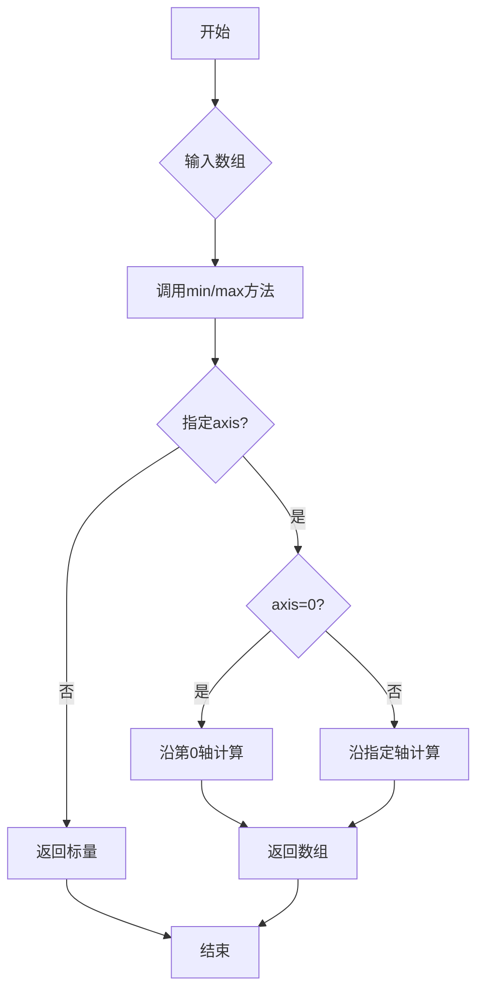

#### 带注释源码

```python
# 定义维度
Nx, Ny, Nz = 100, 300, 500
# 创建网格坐标，Z轴取负
X, Y, Z = np.meshgrid(np.arange(Nx), np.arange(Ny), -np.arange(Nz))

# 创建假数据：基于X, Y, Z的函数
data = (((X+100)**2 + (Y-20)**2 + 2*Z)/1000+1)

# 定义绘图参数，使用min/max确定数据范围
kw = {
    'vmin': data.min(),    # 获取data数组的最小值
    'vmax': data.max(),    # 获取data数组的最大值
    'levels': np.linspace(data.min(), data.max(), 10),  # 在[min, max]区间创建10个等差级别
}

# ... 后续绘图代码 ...

# 从坐标数组获取极值，用于设置坐标轴范围
xmin, xmax = X.min(), X.max()  # X数组的最小值和最大值
ymin, ymax = Y.min(), Y.max()  # Y数组的最小值和最大值
zmin, zmax = Z.min(), Z.max()  # Z数组的最小值和最大值
ax.set(xlim=(xmin, xmax), ylim=(ymin, ymax), zlim=(zmin, zmax))
```

---

### `np.min() / np.max()`

NumPy 函数形式的极值计算，功能与数组方法相同。

参数：

- `a`：`array_like`，输入数组
- `axis`：`int`（可选），计算极值的轴
- `out`：`ndarray`（可选），输出数组
- `keepdims`：`bool`（可选），是否保持维度
- `initial`：`scalar`（可选），初始值（用于ufunc归约）
- `where`：`array_like`（可选），元素条件（用于ufunc归约）

返回值：`numpy scalar` 或 `ndarray`，返回数组中的最小值/最大值

#### 带注释源码

```python
# 在本代码中，虽然没有直接使用np.min()/np.max()函数，
# 但通过数组方法data.min()/data.max()实现了相同功能
# 两者在本质上是等价的：
#   data.min() 等价于 np.min(data)
#   data.max() 等价于 np.max(data)
```


### `Figure.add_subplot`

在matplotlib中，`Figure.add_subplot`方法用于向图形添加子图。在此代码中，它创建了一个具有3D投影的坐标轴对象，用于绘制3D盒状表面图。

参数：

- `*args`：位置参数，可接受三种形式：
  - 三个整数 `(rows, cols, index)`：如`111`表示1行1列的第1个子图
  - 一个三位数：如`111`等价于上述形式
  - `SubplotSpec`对象：直接指定子图规范
- `projection`：字符串，可选参数，指定坐标轴投影类型。此处传入`'3d'`创建3D坐标轴
- `**kwargs`：关键字参数，传递给`Axes`构造器的其他参数

返回值：`matplotlib.axes.Axes`，返回创建的3D坐标轴对象（实际类型为`mpl_toolkits.mplot3d.axes3d.Axes3D`）

#### 流程图

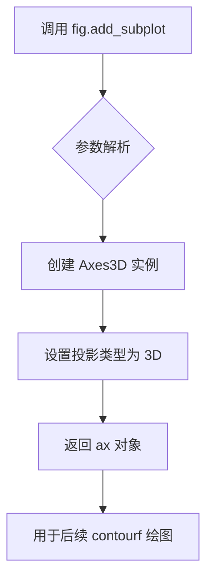

#### 带注释源码

```python
# 创建图形对象，设置图形大小为5x4英寸
fig = plt.figure(figsize=(5, 4))

# 向图形添加子图
# 参数 '111' 表示：1行1列的第1个位置（即整个图形）
# 关键字参数 projection='3d' 指定创建3D坐标轴而非2D
ax = fig.add_subplot(111, projection='3d')

# 上述调用等价于:
# ax = fig.add_subplot(1, 1, 1, projection='3d')
# 
# 返回的 ax 是 Axes3D 对象，它继承了 Axes 类并添加了：
# - set_zlim(), set_zlabel(), set_zticks() 等Z轴相关方法
# - view_init() 设置观察角度
# - contourf() 绘制填充等高线
# - plot() 绘制3D线条
# 等等
```


### `ax.contourf` (或 `Axes3D.contourf`)

该函数是matplotlib 3D坐标轴（Axes3D）的方法，用于在3D空间中绘制填充等高线图（filled contour）。它通过指定投影方向（zdir）和偏移量（offset），将3D数据投影到2D平面上并绘制填充等高线，常用于可视化三维标量场在不同切面上的分布。

#### 参数

- `X`：`numpy.ndarray`，第一个坐标数组（X坐标），通常为2D数组
- `Y`：`numpy.ndarray`，第二个坐标数组（Y坐标），通常为2D数组
- `Z`：`numpy.ndarray`，数据值数组（Z坐标/数据值），用于计算等高线
- `zdir`：`str`，可选，投影方向，指定哪个轴作为投影平面（'x'、'y'或'z'），默认为'z'
- `offset`：`float`，可选，投影平面的偏移量，默认为None
- `**kw`：其他关键字参数，包括：
  - `levels`：`int or array-like`，等高线的数量或具体级别
  - `vmin`, `vmax`：`float`，颜色映射的范围限制
  - `cmap`：`Colormap`，颜色映射
  - `extend`：`str`，是否扩展等高线（'neither'、'min'、'max'、'both'）
  - 等其他matplotlib.contour参数

#### 返回值：`matplotlib.collections.Poly3DCollection`

返回填充等高线的多边形集合对象，可用于添加颜色条（colorbar）或进一步修改样式。

#### 流程图

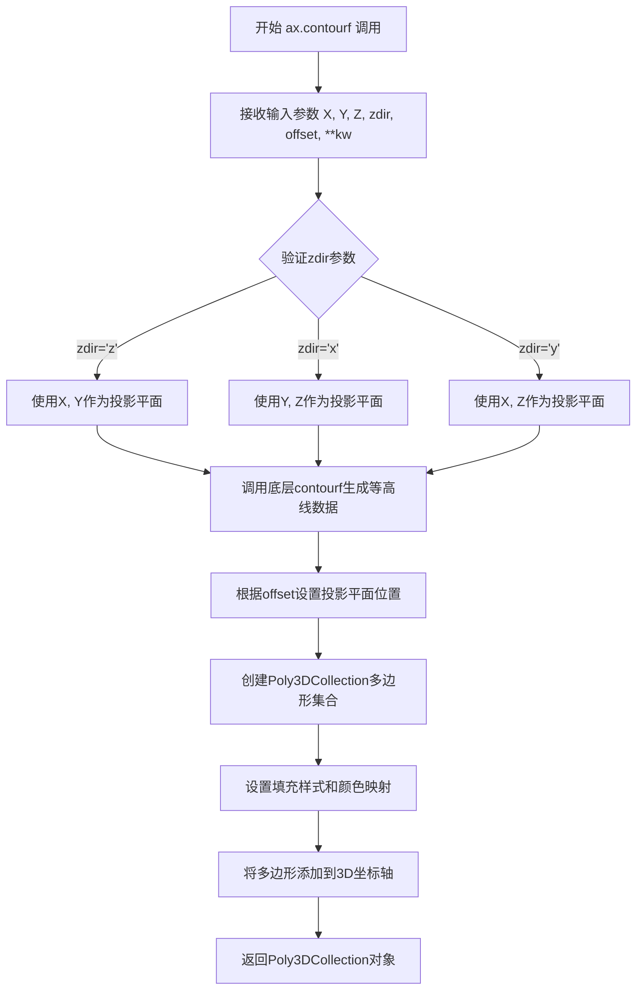

#### 带注释源码

```python
# 示例代码展示ax.contourf的三种典型用法

# 1. 在z=0平面上绘制填充等高线（zdir='z', offset=0）
_ = ax.contourf(
    X[:, :, 0],      # X坐标：取第一个z层的数据 (Nx, Ny)
    Y[:, :, 0],      # Y坐标：取第一个z层的数据 (Nx, Ny)  
    data[:, :, 0],   # 数据值：在z=0平面的数据 (Nx, Ny)
    zdir='z',        # 投影方向：沿z轴投影
    offset=0,        # 偏移量：在z=0处绘制
    **kw             # 其他参数：vmin, vmax, levels等
)

# 2. 在y=0平面上绘制填充等高线（zdir='y', offset=0）
_ = ax.contourf(
    X[0, :, :],      # X坐标：取第一个y面的数据 (Ny, Nz)
    data[0, :, :],   # 数据值：在y=0平面的数据 (Ny, Nz)
    Z[0, :, :],      # Z坐标：取第一个y面的数据 (Ny, Nz)
    zdir='y',        # 投影方向：沿y轴投影
    offset=0,        # 偏移量：在y=0处绘制
    **kw
)

# 3. 在x方向最大边界绘制填充等高线（zdir='x', offset=X.max()）
C = ax.contourf(
    data[:, -1, :],  # 数据值：在x最大边界面的数据 (Ny, Nz)
    Y[:, -1, :],     # Y坐标：取最后一个x面的数据 (Ny, Nz)
    Z[:, -1, :],     # Z坐标：取最后一个x面的数据 (Ny, Nz)
    zdir='x',        # 投影方向：沿x轴投影
    offset=X.max(), # 偏移量：在x最大值处绘制
    **kw
)

# C变量用于后续添加颜色条
fig.colorbar(C, ax=ax, fraction=0.02, pad=0.1, label='Name [units]')
```


### `ax.plot`

绘制3D线条，用于在3D坐标轴上绘制直线或曲线，支持指定线条颜色、线宽、Z顺序等属性。

参数：

- `X`：`array-like`，第一个点的x坐标和第二个点的x坐标数组
- `Y`：`array-like`，第一个点的y坐标和第二个点的y坐标数组
- `Z`：`float` 或 `array-like`，第一个点的z坐标（此处为0，表示在z=0平面上绘制）
- `**kwargs`：`dict`，可选关键字参数，包含`color`（线条颜色）、`linewidth`（线宽）、`zorder`（绘制顺序）等

返回值：`list of matplotlib.lines.Line3D`，返回创建的3D线条对象列表

#### 流程图

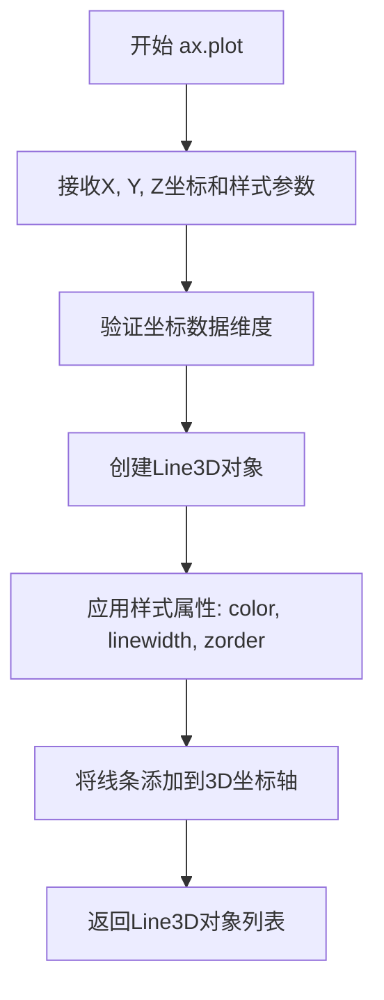

#### 带注释源码

```python
# 绘制3D边缘线条
# 参数说明：
# - [xmax, xmax]: X坐标，从xmax到xmax（垂直线）
# - [ymin, ymax]: Y坐标，从ymin到ymax
# - 0: Z坐标，固定为0（在z=0平面绘制）
# - **edges_kw: 样式字典，包含color='0.4', linewidth=1, zorder=1e3
ax.plot([xmax, xmax], [ymin, ymax], 0, **edges_kw)
```


### `ax.set`

设置3D坐标轴属性，用于配置坐标轴的显示范围、标签文本、刻度等属性。

参数：

- `xlim`：`tuple`，x轴的显示范围，格式为 (min, max)
- `ylim`：`tuple`，y轴的显示范围，格式为 (min, max)
- `zlim`：`tuple`，z轴的显示范围，格式为 (min, max)
- `xlabel`：`str`，x轴的标签文本
- `ylabel`：`str`，y轴的标签文本
- `zlabel`：`str`，z轴的标签文本
- `zticks`：`list`，z轴的刻度值列表

返回值：`None` 或 `matplotlib.axes._axes.Axes`，根据matplotlib版本而定，通常返回None或Axes对象本身

#### 流程图

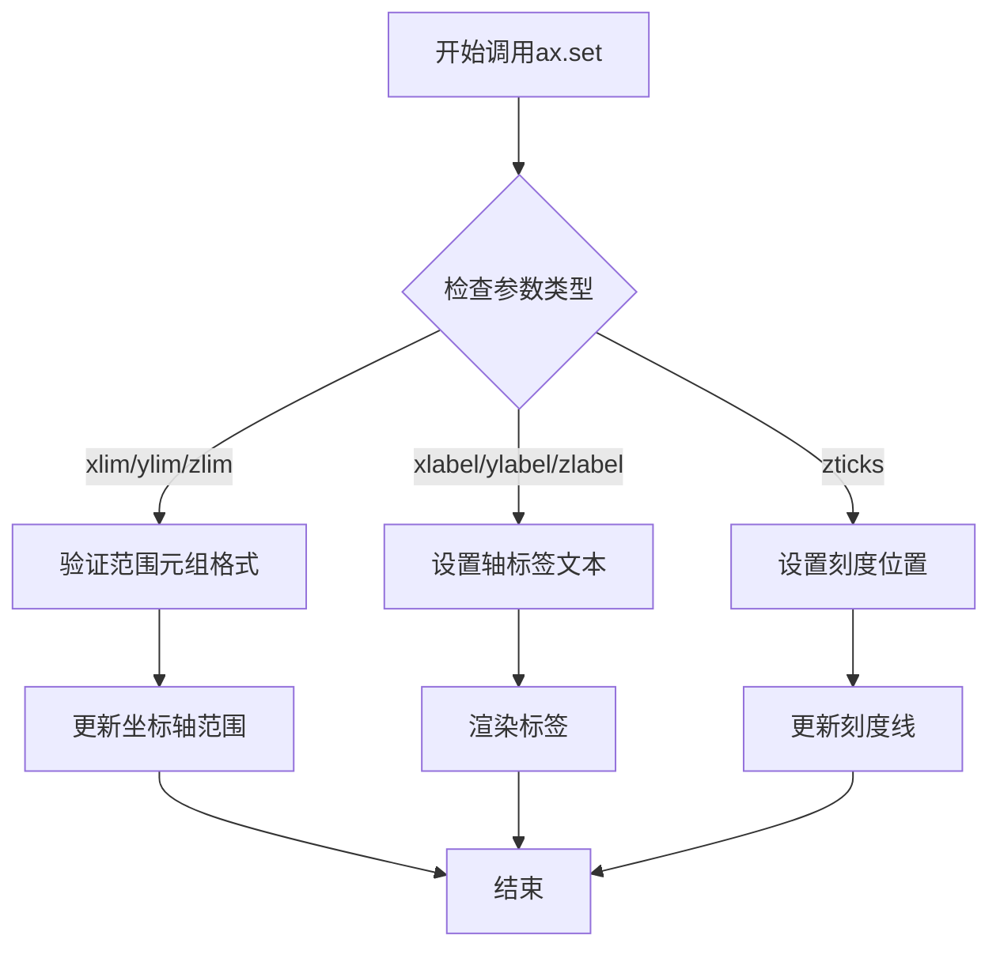

#### 带注释源码

```python
# 代码中的实际调用示例 1：设置坐标轴范围
ax.set(xlim=(xmin, xmax), ylim=(ymin, ymax), zlim=(zmin, zmax))
# xlim, ylim, zlim: tuple类型，分别设置x、y、z轴的最小和最大值
# 用于限制3D图中显示的数据范围

# 代码中的实际调用示例 2：设置坐标轴标签和刻度
ax.set(
    xlabel='X [km]',           # str: x轴显示的标签文本
    ylabel='Y [km]',           # str: y轴显示的标签文本
    zlabel='Z [m]',            # str: z轴显示的标签文本
    zticks=[0, -150, -300, -450],  # list: z轴刻度值的位置
)
# 这些参数用于设置3D坐标轴的标签文字和z轴的刻度位置
# xlabel, ylabel, zlabel: 坐标轴名称标签
# zticks: 自定义z轴刻度值列表
```


### `ax.view_init` / `Axes3D.view_init`

设置3D坐标轴的视角参数，包括俯仰角（elev）、方位角（azim）和翻滚角（roll），用于控制观察3D图形时的相机位置和方向。

参数：

- `elev`：`float`，俯仰角（elevation），表示观察点相对于XY平面的仰角，范围通常为-90到90度，正值表示从上方观察
- `azim`：`float`，方位角（azimuth），表示观察点绕Z轴旋转的水平角度，范围通常为-180到180度
- `roll`：`float`，翻滚角（roll），表示观察平面绕视线方向的旋转角度，默认为0

返回值：`None`，该方法直接修改Axes3D对象的视角状态，不返回任何值

#### 流程图

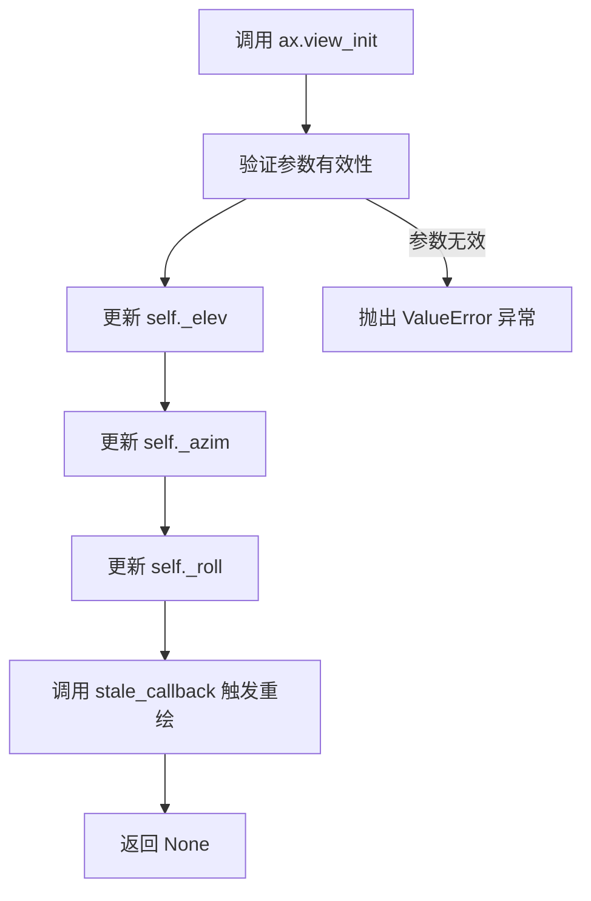

#### 带注释源码

```python
# 导入必要的库
import matplotlib.pyplot as plt
import numpy as np

# 创建图形和3D坐标轴
fig = plt.figure(figsize=(5, 4))
ax = fig.add_subplot(111, projection='3d')

# ... (此处省略绘图代码) ...

# 设置3D视角 - view_init方法调用
# 参数说明：
#   40: elev 俯仰角，表示从40度仰角观察
#  -30: azim 方位角，表示从-30度方向观察（顺时针30度）
#    0: roll 翻滚角，观察方向不旋转
ax.view_init(40, -30, 0)

# 设置坐标轴缩放
# zoom=0.9 表示缩放90%，留出边距
ax.set_box_aspect(None, zoom=0.9)

# 显示图形
plt.show()

# view_init 方法内部实现逻辑（简化版）:
"""
def view_init(self, elev=None, azim=None, roll=None):
    '''
    设置3D视图的视角
    
    Parameters
    ----------
    elev : float, optional
        观察仰角（度数），相对于XY平面
    azim : float, optional
        方位角（度数），绕Z轴旋转
    roll : float, optional
        翻滚角（度数），绕视线旋转
    '''
    # 更新视角参数
    if elev is not None:
        self._elev = elev
    if azim is not None:
        self._azim = azim
    if roll is not None:
        self._roll = roll
    
    # 标记坐标轴需要重绘
    self.stale_callback()
"""
```


### `Axes3D.set_box_aspect`

设置3D坐标轴盒子的长宽比，用于控制3D图形在显示时的比例关系。该方法允许用户自定义3D轴的盒子形状，使其在不同维度上呈现特定的比例，从而改善3D图形的视觉效果和可读性。

参数：

- `aspect`：参数类型：`tuple` 或 `float` 或 `str`，描述3D盒子在x、y、z三个方向上的比例因子。可以是`(x, y, z)`形式的三元组、`'auto'`（自动计算）、`None`（使用默认值1:1:1）或`np.nan`。
- `zoom`：参数类型：`float`，可选参数，默认值为`1.0`，用于整体缩放3D盒子的大小。

返回值：`None`，该方法直接修改Axes对象的属性，不返回任何值。

#### 流程图

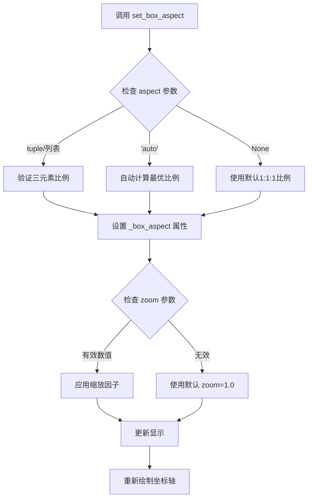

#### 带注释源码

```python
# matplotlib/axes/_base.py 中的简化示例
def set_box_aspect(self, aspect=None, zoom=1.0):
    """
    Set the axes box aspect.
    
    Parameters
    ----------
    aspect : tuple of 3 floats or None or 'auto'
        The aspect ratios of the axes box. A value of None
        resets the aspect to 1:1:1. A value of 'auto' means
        to automatically adjust the aspect.
    zoom : float, default: 1.0
        Zoom factor for the axes box.
    """
    # 验证aspect参数类型
    if aspect is not None and aspect != 'auto':
        if not isinstance(aspect, (tuple, list)):
            if np.isscalar(aspect):
                # 如果是标量，转换为三元组
                aspect = (aspect, aspect, aspect)
            else:
                raise TypeError(
                    f'aspect must be a tuple of 3 floats, '
                    f"'auto', or None, got {type(aspect).__name__}")
        
        # 验证三元组长度
        if len(aspect) != 3:
            raise ValueError(
                f'aspect must have 3 elements, got {len(aspect)}')
    
    # 验证zoom参数
    if not np.isscalar(zoom):
        raise TypeError(f'zoom must be a scalar, got {type(zoom).__name__}')
    
    if zoom <= 0:
        raise ValueError(f'zoom must be positive, got {zoom}')
    
    # 存储到私有属性
    self._box_aspect = aspect
    self._box_aspect_zoom = zoom
    
    # 标记需要重新计算
    self.stale_callback = True
    
    # 触发重新绘制
    self._request_scale3d_support()
    return None
```


### `Figure.colorbar`

用于在图形中添加颜色条，显示颜色映射的图例，方便直观地理解数据的数值范围与颜色的对应关系。在给定代码中，该方法将 3D 轮廓图的颜色条添加到图形中，并设置标签和布局参数。

参数：

- `mappable`：`matplotlib.contour.ContourSet`，代码中为 `C`，即 `ax.contourf` 返回的轮廓集合对象，作为颜色条映射的数据源。
- `ax`：`matplotlib.axes.Axes`，代码中为 `ax`，指定颜色条所属的坐标轴，这里是 3D 坐标轴对象。
- `fraction`：`float`，代码中为 `0.02`，表示颜色条宽度占坐标轴区域的比例。
- `pad`：`float`，代码中为 `0.1`，表示颜色条与坐标轴之间的间距（英寸）。
- `label`：`str`，代码中为 `'Name [units]'`，表示颜色条的标签文本。
- `**kwargs`：其他关键字参数，用于传递给 `Colorbar` 构造器，可选参数包括 `extend`、`orientation`、`shrink` 等，用于控制颜色条样式和行为。

返回值：`matplotlib.colorbar.Colorbar`，返回颜色条对象，可用于进一步自定义颜色条（如设置刻度、标签样式等）。

#### 流程图

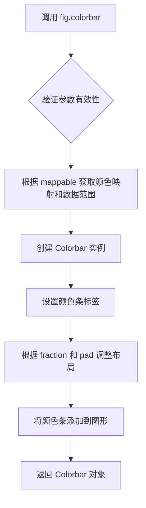

#### 带注释源码

```python
# 调用 fig.colorbar 方法添加颜色条
# 参数说明：
#   C: 由 ax.contourf 返回的 ContourSet 对象，包含了颜色映射的数据和配置
#   ax: 颜色条所属的坐标轴，这里是 3D 坐标轴 ax
#   fraction: 颜色条宽度占坐标轴区域的比例，0.02 表示 2%
#   pad: 颜色条与坐标轴之间的间距，单位为英寸，0.1 英寸
#   label: 颜色条的标签，显示在颜色条顶部
fig.colorbar(C, ax=ax, fraction=0.02, pad=0.1, label='Name [units]')
```


### `plt.show`

`plt.show` 是 matplotlib 库中的顶层函数，用于显示当前打开的所有图形窗口。在执行 `plt.show()` 时，matplotlib 会将所有通过 `Figure` 对象创建的图形渲染并显示在屏幕上，并进入交互模式等待用户操作。该函数通常放在脚本的最后，用于展示所有绘制的图表。

参数：

- 该函数无任何参数

返回值：`None`，无返回值

#### 流程图

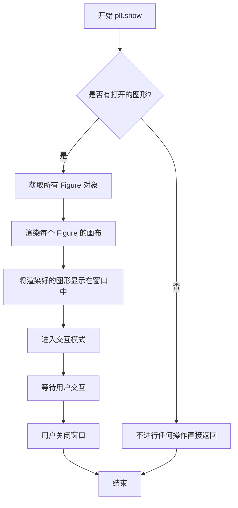

#### 带注释源码

```python
def show(*, block=None):
    """
    显示所有打开的 Figure 窗口。
    
    该函数会阻塞程序的执行（除非 block=False），
    直到用户关闭所有图形窗口为止。
    
    Parameters
    ----------
    block : bool, optional
        如果为 True（默认值），则阻塞程序直到窗口关闭。
        如果为 False，则立即返回并继续执行。
    
    Returns
    -------
    None
    
    Examples
    --------
    >>> import matplotlib.pyplot as plt
    >>> plt.figure()
    >>> plt.plot([1, 2, 3], [1, 4, 9])
    >>> plt.show()  # 显示图形窗口
    """
    # 获取全局的 _pylab_helpers 数组管理器
    # 用于管理所有打开的图形窗口
    managers =._pylab_helpers.Gcf.get_all_fig_managers()
    
    if not managers:
        # 如果没有打开的图形，直接返回
        return
    
    # 循环遍历所有图形管理器并显示它们
    for manager in managers:
        # 触发图形重绘和显示
        manager.show()
        
        # 如果 block 为 True，则进入交互模式
        # 通常在阻塞模式下，程序会暂停并等待用户操作
        if block:
            # 启动事件循环，处理用户输入（如鼠标、键盘事件）
            manager._show(block=block)
```

## 关键组件


### 数据网格生成 (meshgrid)

使用np.meshgrid创建三维坐标网格X, Y, Z，用于定义体积数据的空间位置

### 模拟数据生成 (data)

基于X, Y, Z坐标计算模拟的三维标量场数据，使用数学公式生成测试用的体积数据

### 3D坐标轴创建 (fig.add_subplot)

创建带有3D投影的matplotlib子图，为后续绘制三维等高线图准备画布

### 等高线表面绘制 (ax.contourf)

在三个正交方向(zdir='z', 'y', 'x')分别绘制等高线填充图，展示体积数据在不同切片上的分布

### 图形边界绘制 (ax.plot)

使用线条绘制3D盒子的边缘轮廓，增强空间感

### 坐标轴配置 (ax.set)

设置x, y, z轴的标签、刻度和显示范围

### 视角设置 (ax.view_init, ax.set_box_aspect)

配置3D视图的观察角度和缩放比例

### 颜色条添加 (fig.colorbar)

为等高线图添加颜色条，展示数据值与颜色的映射关系


## 问题及建议


### 已知问题

-   **魔法数字和硬编码值**：数据生成公式中的 `1000`、`1`、`2` 等数值缺乏注释说明，维度 `Nx, Ny, Nz`、颜色条参数 `fraction=0.02, pad=0.1`、zticks `[0, -150, -300, -450]` 等均为硬编码，缺乏可配置性
-   **代码可复用性差**：代码以脚本形式直接执行，未封装为函数，无法作为模块导入或在其他项目中复用
-   **缺少类型注解**：无任何函数参数或变量的类型标注，降低了代码的可读性和 IDE 支持
-   **变量命名不规范**：使用 `_ = ax.contourf(...)` 忽略返回值，虽然是常见做法，但不如显式变量名清晰
-   **无输入验证**：未对网格维度、数据有效性进行校验，可能在异常输入时产生难以追踪的错误
-   **资源管理缺失**：未显式调用 `plt.close(fig)` 释放图形资源，在批量处理场景中可能导致内存泄漏
-   **重复代码模式**：`kw` 字典在多处 contourf 调用中复用，但不同表面可能需要不同参数，当前实现灵活性不足
-   **性能考虑不足**：使用 100×300×500 的 meshgrid（约1500万个数据点），内存占用较高，且未考虑降采样或分块渲染策略

### 优化建议

-   将核心逻辑封装为函数，接受维度、颜色映射范围、输出路径等参数，提升可复用性
-   使用配置类或配置文件管理硬编码参数，避免多处修改
-   为关键函数添加类型注解和 docstring，说明参数含义和返回值
-   添加输入验证逻辑，确保维度为正整数、数据形状一致等前置条件
-   考虑使用 `with plt.style.context():` 或显式 `plt.close()` 管理图形生命周期
-   对于大数据量场景，增加采样或 LOD（Level of Detail）渲染选项
-   将数据生成逻辑与绘图逻辑分离，便于单元测试和替换数据源

## 其它


### 设计目标与约束

本代码的核心设计目标是展示如何使用matplotlib的3D绘图功能，在三维盒状体积的六个表面上绘制数据值的填充等高线图。主要设计约束包括：1）依赖matplotlib和numpy两个外部库；2）数据必须为三维网格化数据（通过meshgrid生成）；3）坐标系采用右手直角坐标系；4）Z轴方向为负值，表示深度或高度；5）图形输出为静态图像。

### 错误处理与异常设计

代码未实现显式的错误处理机制。潜在的异常情况包括：1）数据维度不匹配错误，当X、Y、Z维度不一致时会导致meshgrid失败；2）内存溢出错误，当Nx、Ny、Nz值过大时可能导致内存不足；3）数据类型错误，当data包含NaN或Inf值时可能影响颜色映射；4）图形渲染错误，当设置无效的视图角度或缩放比例时。建议添加数据验证逻辑、检查NaN/Inf值、处理空数据情况。

### 数据流与状态机

数据流分为四个主要阶段：初始化阶段（定义网格维度Nx、Ny、Nz）→ 数据生成阶段（通过meshgrid创建坐标网格，通过数学公式计算data值）→ 可视化配置阶段（设置vmin、vmax、levels等绘图参数）→ 渲染输出阶段（依次绘制三个表面的等高线、边框、标签、颜色条，最后调用plt.show()显示）。状态机转换顺序为：IDLE → DATA_GENERATED → PLOT_CONFIGURED → RENDERING_COMPLETED。

### 外部依赖与接口契约

主要外部依赖包括：1）matplotlib库（版本需支持3D投影），提供Figure、Axes3D、contourf、colorbar等接口；2）numpy库，提供meshgrid、arange、linspace、min、max等数组操作函数。接口契约方面：meshgrid返回三个三维数组；contourf方法接收二维数组作为x、y参数和zdir、offset参数，返回Collection类型对象；colorbar方法接收Collection对象和ax参数返回Colorbar对象；view_init方法接收elevation、azimuth、roll三个角度参数；set_box_aspect方法接收aspect参数和zoom参数。

### 性能考虑与优化空间

当前实现存在以下性能问题：1）数据量较大时（100×300×500=1500万个数据点）会消耗大量内存；2）三次调用contourf进行等高线计算，存在重复计算；3）未使用数据子采样技术。优化建议：1）根据实际需求调整Nx、Ny、Nz的取值；2）使用更高效的数据类型（如float32代替float64）；3）考虑使用plot_surface代替contourf以提高渲染效率；4）对于静态图生成，可预先计算等高线数据并缓存。

### 安全性考虑

代码本身为数据可视化脚本，不涉及用户输入、网络通信或文件操作，因此安全风险较低。但需注意：1）避免在data公式中执行恶意代码（当前为简单数学表达式）；2）如果未来从文件读取数据，需进行输入验证；3）plt.show()在某些后端可能导致代码挂起，需设置超时机制。

### 可维护性与扩展性

当前代码的可维护性较好，采用模块化结构，主要功能集中在配置参数、创建图表、绘制等高线三个部分。扩展方向包括：1）添加更多等高线样式选项（如不同着色方式）；2）支持动态数据更新（使用FuncAnimation）；3）支持导出为多种格式（PNG、PDF、SVG）；4）支持子图布局（多个3D图并排显示）；5）添加交互式控件（旋转、缩放）。建议将配置参数抽取为单独的字典或配置文件，提高代码复用性。

### 测试策略建议

由于当前代码为脚本性质，建议从以下角度设计测试：1）单元测试验证meshgrid生成的坐标数组维度正确；2）单元测试验证data数组的形状与坐标数组一致；3）集成测试验证图形能够成功创建且包含必要的元素（坐标轴、标题、颜色条）；4）性能测试验证大数据集下的执行时间和内存占用；5）回归测试确保修改代码后输出图像的一致性（可使用图像比对工具）。

### 配置与参数说明

关键配置参数包括：1）Nx=100, Ny=300, Nz=500定义网格分辨率；2）kw字典中的vmin/vmax控制颜色映射范围，levels定义等高线层级数量；3）zticks=[0, -150, -300, -450]定义Z轴刻度；4）view_init(40, -30, 0)设置视角（仰角40度，方位角-30度）；5）zoom=0.9控制图形缩放；6）colorbar的fraction和pad参数控制颜色条布局。这些参数均可根据具体数据特征和展示需求进行调整。

### 使用示例与变体

基础变体：修改data公式以适应不同类型的数据（如温度场、压力场）；改变levels数量以调整等高线密度；使用不同配色方案（cmap参数）。高级变体：1）添加等高线标签（使用clabel）；2）在等高线之间添加切片平面；3）结合2D子图展示不同角度的视图；4）使用交互式后端（notebook中启用%matplotlib widget）实现旋转缩放；5）导出为动画序列展示数据变化。

### 潜在技术债务

当前代码存在以下技术债务：1）硬编码的参数值（网格尺寸、视角、刻度）不易于配置；2）魔法数值（如除数1000、加法1）缺乏注释说明其含义；3）重复的ax.contourf调用可通过循环重构；4）缺乏文档字符串说明各参数的作用；5）_ = 的使用不够优雅，应直接忽略返回值；6）未设置matplotlib样式或主题，依赖默认配置。建议进行代码重构，提取配置参数、增加注释、简化重复逻辑。

    