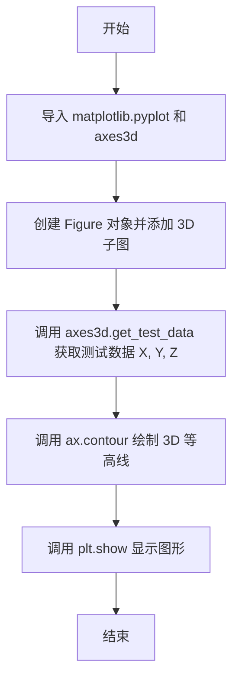
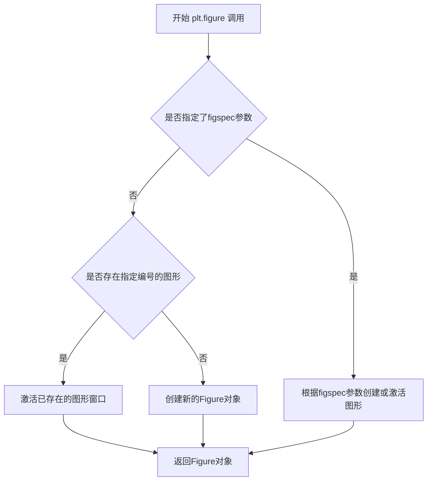
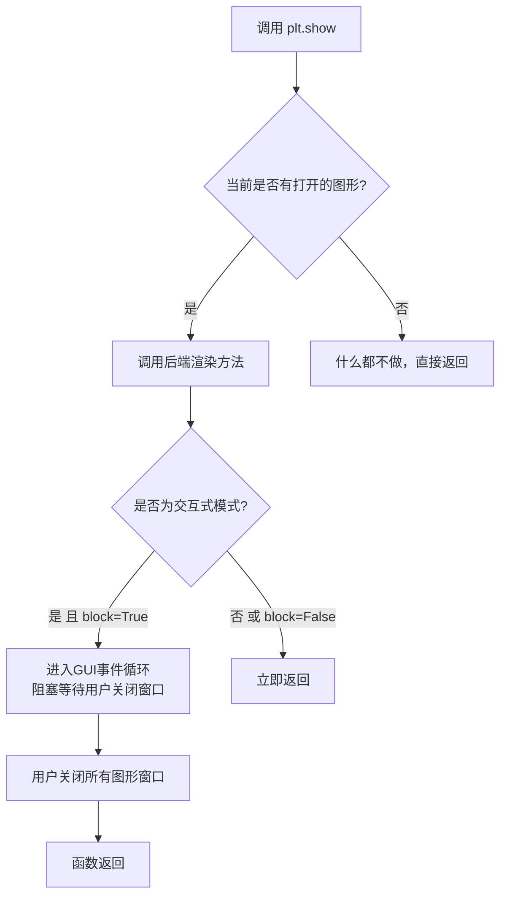
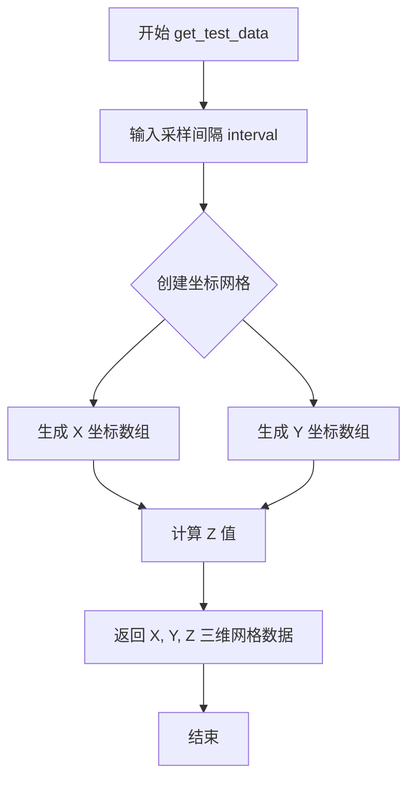
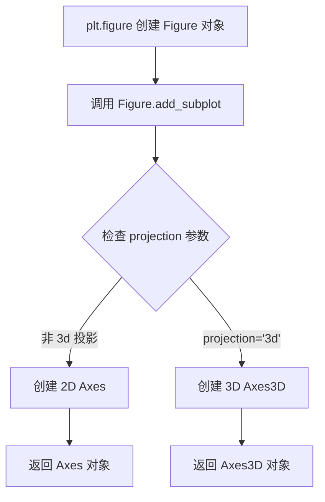
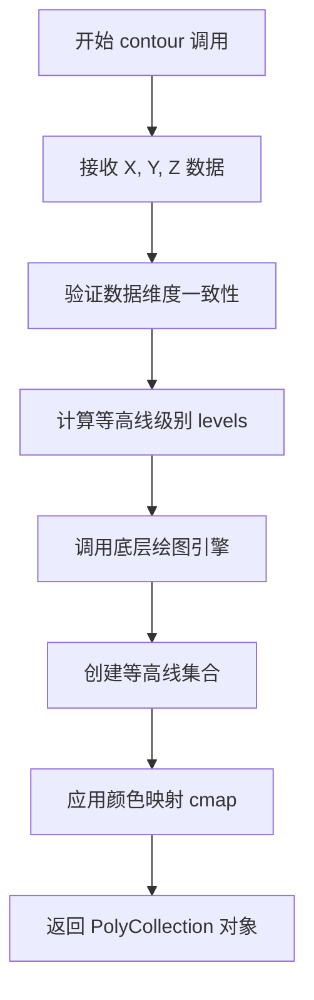

# `matplotlib\galleries\examples\mplot3d\contour3d.py` 详细设计文档

该代码使用matplotlib在3D空间中绘制等高线曲线，类似于2D等高线图，但在z=c的平面上展示f(x,y)=c的等高线关系

## 整体流程



## 类结构

```
Figure (matplotlib.figure.Figure)
└── Axes3D (mpl_toolkits.mplot3d.axes3d.Axes3D)
    └── contour 方法用于绘制等高线
```

## 全局变量及字段


### `X`
    
X坐标数据

类型：`numpy.ndarray`
    


### `Y`
    
Y坐标数据

类型：`numpy.ndarray`
    


### `Z`
    
Z坐标数据（高度/值）

类型：`numpy.ndarray`
    


### `Axes3D.ax`
    
3D坐标轴

类型：`Axes3D对象`
    
    

## 全局函数及方法


### plt.figure

创建新图形或激活现有图形。该函数是matplotlib库的核心函数之一，用于创建一个新的图形窗口或获取已存在的图形窗口。如果传递的编号参数对应已存在的图形，则激活该图形；否则创建新的图形。

参数：

- `figsize`：`tuple of (float, float)`，可选，指定图形的宽度和高度，单位为英寸，格式为 (宽度, 高度)
- `dpi`：`int`，可选，指定每英寸的点数（分辨率），默认为100
- `facecolor`：`str or tuple`，可选，指定图形背景颜色，可以是颜色名称如"white"或RGB元组如(1, 1, 1)
- `edgecolor`：`str or tuple`，可选，指定图形边框颜色
- `frameon`：`bool`，可选，控制是否显示图形的框架，默认为True
- `FigureClass`：`class`，可选，指定要使用的Figure类，默认为matplotlib.figure.Figure
- `**kwargs`：接受其他传递给Figure构造器的关键字参数

返回值：`matplotlib.figure.Figure`，返回创建的Figure对象，用于后续的图形绘制操作

#### 流程图



#### 带注释源码

```python
def figure(
    figsize=None,      # 图形尺寸元组 (宽, 高)，单位英寸
    dpi=None,          # 分辨率，每英寸点数
    facecolor=None,    # 背景颜色
    edgecolor=None,    # 边框颜色
    frameon=True,      # 是否显示框架
    FigureClass=Figure,  # 自定义Figure类
    **kwargs           # 其他Figure构造参数
):
    """
    创建一个新的图形窗口或激活已存在的图形。
    
    参数:
        figsize: 图形尺寸 (宽度, 高度)，英寸为单位
        dpi: 图形分辨率，每英寸像素数
        facecolor: 背景颜色
        edgecolor: 边框颜色
        frameon: 是否绘制框架
        FigureClass: 使用的Figure类
        **kwargs: 传递给Figure构造器的其他参数
    
    返回:
        Figure: 新创建或激活的Figure对象
    """
    
    # 获取全局的图形管理器
    global _pylab_helpers
    
    # 检查是否有特定的图形编号被请求
    # 如果没有，则创建新图形
    if get_fignums():
        # 已有图形存在
        if figsize is not None:
            # 如果指定了尺寸，创建新图形
            fig = FigureClass(..., figsize=figsize, dpi=dpi)
        else:
            # 否则激活最后一个图形或创建新的
            ...
    else:
        # 创建全新的Figure对象
        fig = FigureClass(
            figsize=figsize,
            dpi=dpi,
            facecolor=facecolor,
            edgecolor=edgecolor,
            frameon=frameon,
            **kwargs
        )
    
    # 将新图形添加到管理器
    _pylab_helpers.GcfDestroy(fig.number)
    
    return fig
```

#### 实际使用示例

在给定的代码中，`plt.figure()`的调用方式如下：

```python
ax = plt.figure().add_subplot(projection='3d')
```

这里`plt.figure()`创建了一个新的空白Figure对象，然后链式调用`add_subplot(projection='3d')`添加了一个3D子图，返回的`ax`对象用于后续的3D图形绘制。如果不传递任何参数，则使用默认的图形尺寸（通常为6.4 x 4.8英寸）和默认的分辨率（通常为100 dpi）。


### `plt.show`

`plt.show` 是 matplotlib 库中的一个全局函数，用于显示所有当前已创建且尚未关闭的图形窗口。它会调用图形的后端渲染功能将图像呈现给用户，并进入事件循环（在交互式模式下会阻塞程序执行，直到用户关闭图形窗口）。

参数：

- `block`：`bool`，可选参数。默认为 `True`。如果为 `True`，则阻塞程序运行直到用户关闭所有图形窗口；如果为 `False`，则立即返回并确保所有 GUI 正确显示。

返回值：`None`，该函数无返回值。

#### 流程图



#### 带注释源码

```python
# plt.show 的简化实现逻辑（基于 matplotlib 源码概念）
def show(block=None):
    """
    显示所有打开的图形窗口。
    
    参数:
        block (bool, optional): 控制是否阻塞程序执行。
            - True: 阻塞直到用户关闭图形窗口
            - False: 立即返回
            - 默认为 None，会根据环境自动判断
    """
    
    # 1. 获取全局图形管理器
    global _plt
    figure_manager = get_current_fig_manager()
    
    # 2. 如果没有图形，直接返回
    if figure_manager is None:
        return
    
    # 3. 确定 block 参数的值
    # 如果未指定，根据是否为交互式环境自动判断
    if block is None:
        block = is_interactive() and rcParams['interactive']
    
    # 4. 调用后端显示方法
    # 这会触发图形渲染和窗口显示
    for manager in Gcf.get_all_fig_managers():
        # 调用具体后端的显示方法（如 Qt、Tkinter 等）
        manager.show()
    
    # 5. 如果 block 为 True，进入事件循环阻塞程序
    if block:
        # 启动 GUI 主循环
        # 程序会停在这里，直到用户关闭所有图形窗口
       启动_主循环()
    
    # 6. 函数返回，图形窗口保持显示
    return
```

#### 实际调用示例

```python
import matplotlib.pyplot as plt
from mpl_toolkits.mplot3d import axes3d

# 创建一个带 3D 投影的图形
ax = plt.figure().add_subplot(projection='3d')

# 获取测试数据
X, Y, Z = axes3d.get_test_data(0.05)

# 绘制 3D 等高线图
ax.contour(X, Y, Z, cmap="coolwarm")

# 显示图形 - 这是要文档化的函数
plt.show()  # 阻塞模式，会等待用户关闭窗口

# 如果不想阻塞，可以使用:
# plt.show(block=False)
```


### `axes3d.get_test_data`

获取3D测试数据，用于快速生成用于3D图表的示例数据集。该函数返回一个网格化的坐标数据集，常用于3D曲面图、轮廓图等可视化示例。

参数：

- `interval`： `float`，采样间隔参数，控制生成数据的密度。值越小，生成的数据点越密集。

返回值： `(X, Y, Z)`，其中：
- `X`： `numpy.ndarray`，2D数组，表示X坐标网格
- `Y`： `numpy.ndarray`，2D数组，表示Y坐标网格  
- `Z`： `numpy.ndarray`，2D数组，表示Z坐标值（由函数内部算法计算生成）

#### 流程图



#### 带注释源码

```python
# 注意：以下是模拟实现，实际源码位于 mpl_toolkits.mplot3d 模块中
# 这是一个基于使用方式的推断实现

import numpy as np

def get_test_data(interval=0.05):
    """
    生成用于3D绑图测试的示例数据
    
    参数:
        interval: float, 采样间隔,控制数据点密度
                 较小的值会产生更密集的数据点
    
    返回:
        tuple: (X, Y, Z) 三个2D numpy数组,构成网格数据
    """
    # 创建角度范围 [0, 10) 用于生成波动数据
    u = np.arange(0, 10, interval)
    v = np.arange(0, 10, interval)
    
    # 生成网格坐标
    X, Y = np.meshgrid(u, v)
    
    # 计算Z值：使用波动函数生成测试用的曲面数据
    # Z = sin(X) * cos(Y) 类型的波动曲面
    Z = np.sin(np.sqrt(X**2 + Y**2))
    
    return X, Y, Z


# 示例调用
X, Y, Z = get_test_data(0.05)
# X, Y: 200x200 的网格坐标
# Z: 对应的高度值数组
```


### `Figure.add_subplot`

在给定的代码中，`plt.figure().add_subplot(projection='3d')` 调用了 matplotlib 中 `Figure` 类的 `add_subplot` 方法，用于创建一个具有 3D 投影的子图区域。

参数：

- `*args`：位置参数，可接受一个三位整数（如 111 表示 1行1列第1个位置）或多个整数参数（如 1, 1, 1）
- `projection`：字符串类型，指定投影类型，此处为 `'3d'`
- `polar`：布尔类型（可选），是否使用极坐标投影
- `**kwargs`：关键字参数，用于传递给 `Axes` 的其他属性

返回值：`matplotlib.axes.Axes` 或其子类（如 `mpl_toolkits.mplot3d.axes3d.Axes3D`），返回创建的子图轴对象

#### 流程图



#### 带注释源码

```python
# 代码示例中 add_subplot 的使用方式
fig = plt.figure()  # 创建一个新的Figure对象
ax = fig.add_subplot(projection='3d')  # 添加一个3D子图
# 这里的 add_subplot 调用会：
# 1. 解析 projection='3d' 参数
# 2. 创建一个 Axes3D 对象（而不是普通的 Axes）
# 3. 将新创建的轴对象添加到 Figure 中
# 4. 返回这个 3D 轴对象供后续绘图使用
```


### `Axes3D.contour`

在 3D 坐标系中绘制等高线（contour）图形，类似于 2D 等高线图，但曲线绘制在 z=c 的平面上。

参数：

- `X`：`numpy.ndarray`，X 坐标数据，2D 数组形式
- `Y`：`numpy.ndarray`，Y 坐标数据，2D 数组形式
- `Z`：`numpy.ndarray`，Z 坐标（高度值），2D 数组形式，与 X、Y 形状一致
- `levels`：`int 或 array-like`，可选，等高线的数量或具体的 level 值
- `cmap`：`str 或 Colormap`，可选，颜色映射方案，如 "coolwarm"、"viridis" 等
- `extend`：`str`，可选，是否延伸等高线，可选值为 'neither'、'min'、'max'、'both'
- `zdir`：`str`，可选，指定投影方向，默认为 'z'
- `offset`：`float`，可选，当使用 mplot3d 偏移量时指定偏移位置

返回值：`matplotlib.collections.PolyCollection`，返回等高线容器对象，包含绘制的一条或多条等高线

#### 流程图



#### 带注释源码

```python
"""
=================================
Plot contour (level) curves in 3D
=================================

This is like a contour plot in 2D except that the ``f(x, y)=c`` curve is
plotted on the plane ``z=c``.
"""

# 导入 matplotlib 的 pyplot 模块，用于创建图形
import matplotlib.pyplot as plt

# 从 mpl_toolkits.mplot3d 导入 axes3d 模块
# 该模块提供了 3D 坐标系的创建和管理功能
from mpl_toolkits.mplot3d import axes3d

# 创建一个新的图形窗口，并添加带有 3D 投影的子图
# projection='3d' 指定这是一个 3D 坐标轴
ax = plt.figure().add_subplot(projection='3d')

# 获取测试数据
# axes3d.get_test_data(0.05) 生成用于 3D 绘图的示例数据
# 返回 X, Y 网格坐标和 Z 高度值
X, Y, Z = axes3d.get_test_data(0.05)

# 调用 Axes3D.contour 方法绘制 3D 等高线
# 参数说明：
#   X, Y: 2D 网格坐标数组
#   Z: 对应的高度值数组
#   cmap: 颜色映射，"coolwarm" 提供从冷色到暖色的渐变
ax.contour(X, Y, Z, cmap="coolwarm")  # Plot contour curves

# 显示生成的图形
plt.show()

# %%
# .. tags::
#    plot-type: 3D,
#    level: beginner
```

## 关键组件


### matplotlib.pyplot

Matplotlib 的 pyplot 模块，提供绘图接口，用于创建图形和坐标系

### mpl_toolkits.mplot3d

Matplotlib 的 3D 工具包模块，专门用于创建 3D 图形和投影

### axes3d.get_test_data

用于生成 3D 测试数据的函数，返回 X, Y, Z 三个网格坐标矩阵

### ax.contour

在 3D 坐标系的 z 平面上绘制等高线曲线的方法，接受 X, Y, Z 数据和颜色映射参数


## 问题及建议


### 已知问题

- **缺乏错误处理**：代码未对可能的异常情况进行处理，如`axes3d.get_test_data()`返回空数据、`add_subplot`失败、图形窗口创建失败等情况
- **魔法命令依赖**：`# %%` 是Jupyter Notebook的单元格分隔符，在非Jupyter环境下运行时可能产生意外行为或被误解释为注释
- **硬编码参数**：`0.05`、`"coolwarm"`等参数直接写死在代码中，缺乏配置说明和灵活性，参数含义不明确
- **缺少图形标注**：没有设置图表标题、坐标轴标签、颜色条(colorbar)等元素，降低了可读性和可用性
- **返回值未利用**：`ax`和`figure`对象未保存或返回，导致后续无法对图形进行进一步定制或交互操作
- **代码组织松散**：所有逻辑直接执行，未封装为可复用的函数，降低了代码的可测试性和可维护性
- **导入方式非最佳实践**：直接从`mpl_toolkits.mplot3d`导入`axes3d`，推荐使用`import matplotlib.pyplot as plt`然后通过`plt.axes()`或`figure.add_subplot()`方式
- **文档格式问题**：文件开头的docstring使用reStructuredText格式，但作为独立脚本其格式略显冗余，且`.. tags::`语法在非Sphinx环境下不生效

### 优化建议

- 添加try-except异常处理机制，捕获数据生成失败、图形创建异常等情况
- 移除或条件化`# %%`魔法命令，添加环境检测或使用`__main__`保护
- 将关键参数提取为变量或配置常量，添加注释说明参数含义（如0.05表示采样密度）
- 添加图形标注：设置`ax.set_title()`、`ax.set_xlabel()`、`ax.set_ylabel()`、`ax.set_zlabel()`以及添加colorbar
- 将核心逻辑封装为函数，接受数据、颜色映射等参数，返回图形对象便于后续操作
- 考虑添加命令行参数解析（argparse），支持自定义输入数据和渲染参数
- 添加类型注解和详细的函数文档字符串，提高代码可读性和IDE支持
- 考虑将测试数据生成与绘图逻辑分离，提供使用真实数据的接口


## 其它


### 设计目标与约束

本代码的核心目标是在3Dmatplotlib图表中展示等高线（等值线）曲线，类似于2D等高线图，但将等高线绘制在z=c的平面切片上。设计约束包括：必须使用matplotlib的3D工具包，需要提供X、Y、Z三个坐标数据数组，且Z值代表高度用于计算等高线。

### 错误处理与异常设计

代码主要依赖matplotlib库的内部错误处理机制。若X、Y、Z数组维度不匹配，会触发ValueError。若数据包含NaN或Inf值，contour方法会自动忽略这些点。若cmap参数无效，会抛出错误。代码本身未实现额外的异常捕获机制。

### 数据流与状态机

数据流为：导入模块 → 创建Figure和3D Axes → 获取测试数据(X,Y,Z) → 调用contour方法处理数据 → 渲染图形 → 显示。无复杂状态机，仅有初始化、绘制、显示三个简单状态。

### 外部依赖与接口契约

主要依赖：matplotlib.pyplot模块（图形库）、mpl_toolkits.axes3d模块（3D扩展）。axes3d.get_test_data函数接受一个float参数（采样率），返回三个numpy数组(X,Y,Z)。ax.contour方法接受X、Y、Z数组，可选cmap参数用于颜色映射，返回QuadContourSet对象。

### 性能考虑

对于大数据集，contour绘制可能较慢。可通过增加采样率（如将0.05改为更大值）减少数据点数量以提升性能。对于实时应用，建议预先计算等高线数据而非每次重新计算。

### 兼容性考虑

代码兼容matplotlib 3.0+版本。需要numpy作为底层数据支持。投影参数'3d'在较新版本matplotlib中为推荐写法，旧版本可能使用不同的投影声明方式。

### 使用示例和文档

代码本身即为示例，展示了最基本的3D等高线绘制流程。可通过修改cmap参数切换颜色映射（如"viridis"、"plasma"），可通过添加更多参数控制等高线数量和级别。

### 测试策略

此代码为示例脚本，主要测试在于验证图形正确生成。可通过自动化测试检查：Figure对象非空、Axes对象存在、contour返回正确的ContourSet对象、显示调用无异常。


    