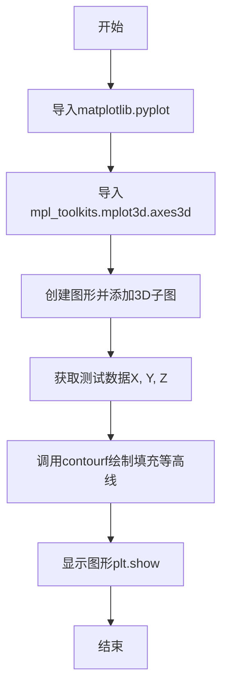
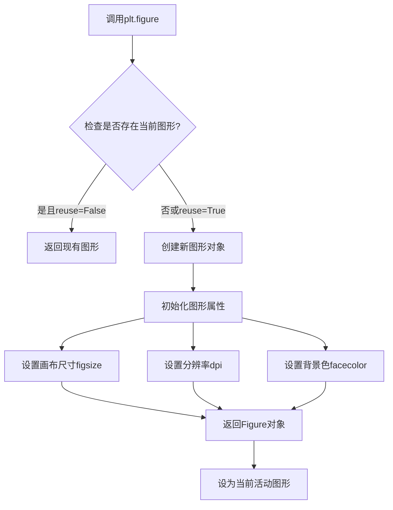
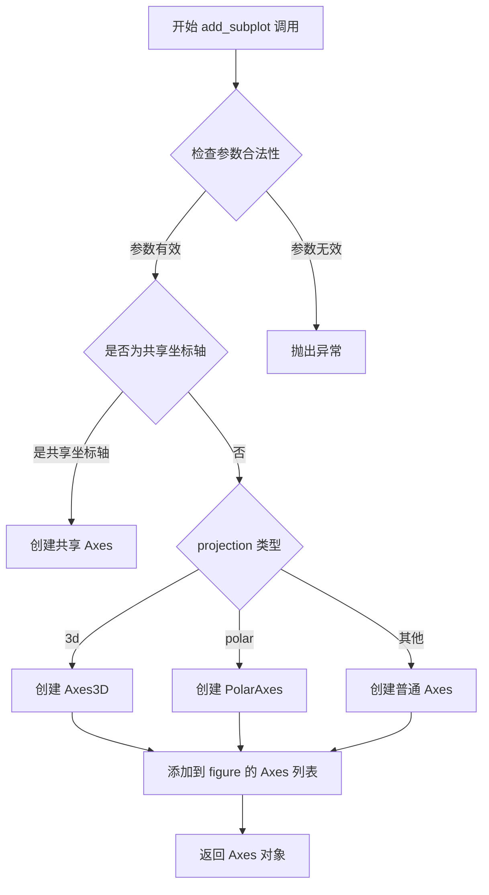
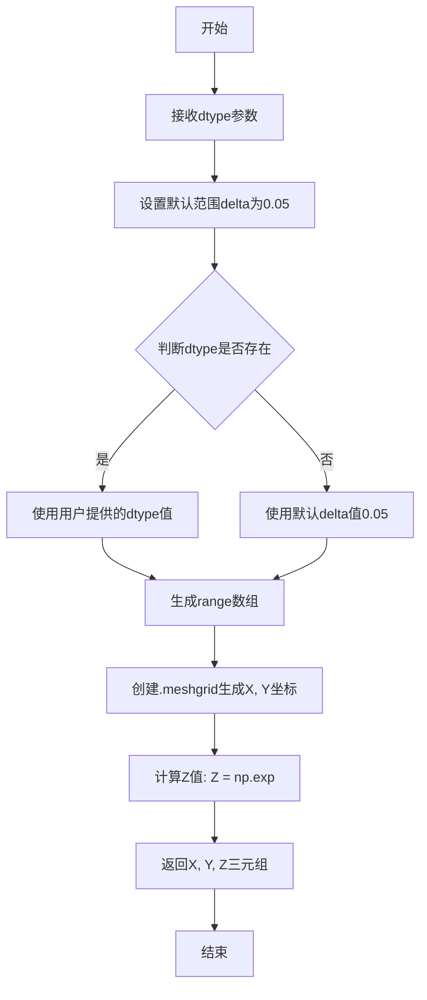
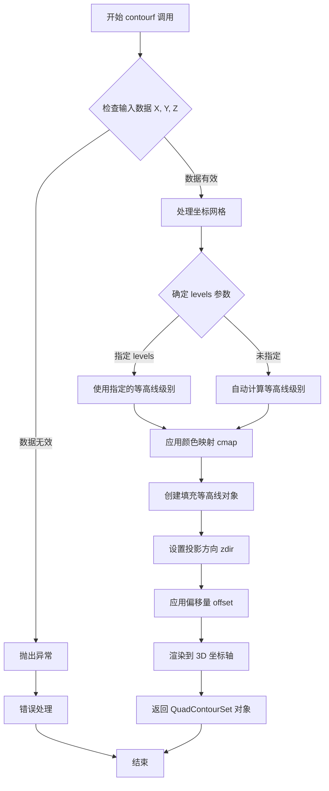
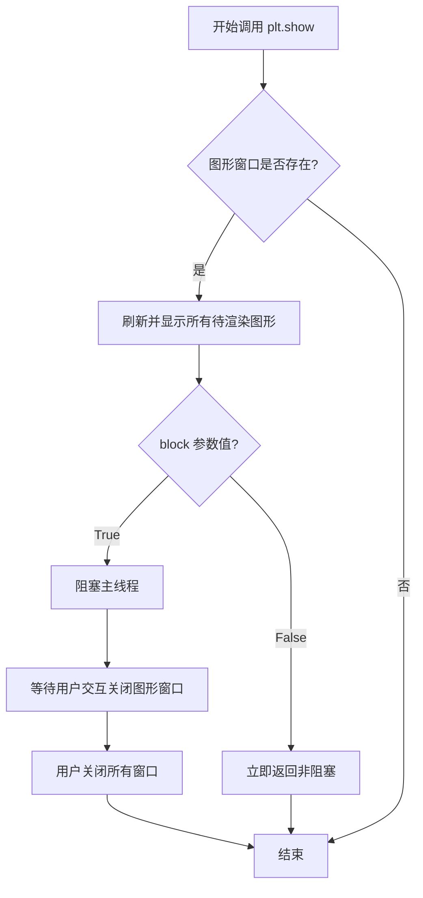
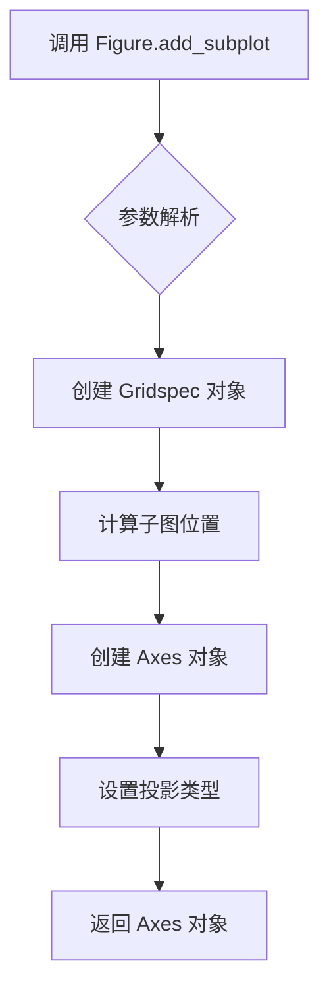
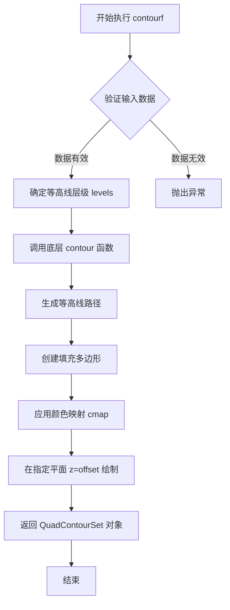

# `matplotlib\galleries\examples\mplot3d\contourf3d.py` 详细设计文档

该代码是一个3D填充等高线图的可视化示例，使用matplotlib创建三维坐标系，生成测试数据并绘制填充等高线

## 整体流程



## 类结构

```
无自定义类
└── 使用matplotlib库
    ├── matplotlib.pyplot (plt)
    ├── mpl_toolkits.mplot3d
    └── axes3d模块
```

## 全局变量及字段


### `ax`
    
3D坐标轴实例，通过add_subplot()创建，用于绘制3D图形

类型：`Axes3D`
    


### `X`
    
测试数据X坐标数组，由axes3d.get_test_data()生成

类型：`ndarray`
    


### `Y`
    
测试数据Y坐标数组，由axes3d.get_test_data()生成

类型：`ndarray`
    


### `Z`
    
测试数据Z坐标数组（高度值），由axes3d.get_test_data()生成

类型：`ndarray`
    


### `Figure.add_subplot`
    
创建并返回Axes子图对象，支持projection参数指定投影类型

类型：`method`
    


### `Axes3D.contourf`
    
在3D坐标轴上绘制填充等高线图，根据Z值在平面z=c上着色

类型：`method`
    
    

## 全局函数及方法


### `plt.figure`

创建并返回一个新的图形（Figure）对象，是Matplotlib中用于初始化图形窗口的核心函数。

参数：

- `figsize`：`tuple`，可选，图形的宽和高（英寸），格式为 `(width, height)`
- `dpi`：`int`，可选，图形分辨率（每英寸点数），默认值为 `100`
- `facecolor`：颜色值，可选，图形背景颜色，默认值为 `'white'`
- `edgecolor`：颜色值，可选，图形边框颜色，默认值为 `'white'`
- `frameon`：`bool`，可选，是否绘制图形框架，默认值为 `True`
- `FigureClass`：类，可选，自定义Figure类，默认为 `matplotlib.figure.Figure`
- `**kwargs`：任意关键字参数传递给Figure构造函数

返回值：`matplotlib.figure.Figure`，返回新创建的图形对象

#### 流程图



#### 带注释源码

```python
def figure(
    figsize=None,      # 图形尺寸 (宽度, 高度) 单位：英寸
    dpi=None,          # 分辨率，每英寸点数
    facecolor=None,    # 背景颜色
    edgecolor=None,    # 边框颜色
    frameon=True,      # 是否显示框架
    FigureClass=Figure, # 自定义Figure类
    **kwargs           # 其他传递给Figure的关键字参数
):
    """
    创建一个新的图形窗口
    
    返回:
        Figure: 新创建的图形对象
    """
    # 获取全局图形管理器
    manager = _pylab_helpers.Gcf.get_fig_manager(num)
    
    # 如果存在现有管理器，尝试重用
    if manager is not None:
        fig = manager.canvas.figure
        if props['reuse']:
            return fig
    
    # 创建新的Figure对象
    fig = FigureCanvasAgg(
        figsize=figsize,
        dpi=dpi,
        facecolor=facecolor,
        edgecolor=edgecolor,
        **kwargs
    )
    
    # 设置图形管理器
    fig.set_canvas(manager)
    
    # 注册并返回图形
    return fig
```


### `Figure.add_subplot`

将一个子图（Axes）添加到当前图形中。该方法创建并返回一个 Axes 对象，支持多种投影类型（如 '3d' 用于 3D 绘图）。

参数：

- `*args`：位置参数，可以是以下几种形式：
  - 三个整数 (rows, cols, index)：指定子图的行数、列数和位置索引
  - 一个三位整数：等价于三个整数
  - `projection` 关键字参数：指定投影类型（如 '3d'、'polar' 等）
- `projection`：str，可选，指定坐标轴的投影类型，默认为 'rectilinear'（二维直角坐标）
- `polar`：bool，可选，是否使用极坐标投影，等效于 `projection='polar'`
- `axisbelow`：bool，可选，是否将网格线放在其他元素下方
- `label`：str，可选，Axes 的标签
- `facecolor`：color，可选，背景颜色
- `frameon`：bool，可选，是否显示框架

返回值：`matplotlib.axes.Axes`，返回创建的 Axes 对象（如果是 3D 投影，则返回 `Axes3D` 对象）

#### 流程图



#### 带注释源码

```python
def add_subplot(self, *args, **kwargs):
    """
    添加一个子图到图形中。
    
    参数:
        *args: 位置参数，可以是:
            - 三个整数 (rows, cols, index): 子图布局
            - 一个三位整数: 等价形式
        projection: str, 可选投影类型
            - '3d': 3D 坐标轴
            - 'polar': 极坐标
            - 'rectilinear': 默认，直角坐标
        polar: bool, 是否使用极坐标
        **kwargs: 其他 Axes 属性
    
    返回:
        Axes: 创建的坐标轴对象
    """
    # 获取投影类型，默认为 'rectilinear'
    projection = kwargs.pop('projection', None)
    
    # 处理 projection='3d' 的情况
    if projection == '3d':
        # 使用 3D 投影创建 Axes3D 对象
        return self._add_axes_3d(projection, *args, **kwargs)
    
    # 处理极坐标投影
    if kwargs.get('polar', False):
        projection = 'polar'
    
    # 创建标准的 2D Axes 对象
    ax = self._add_axes_internal(None, projection)
    
    # 设置子图位置
    self._make_axes_locatable(ax)
    
    # 将新 Axes 添加到列表中
    self._axstack.bubble(ax)
    self._axobservers.process("_axes_change_event", self)
    
    return ax
```

#### 备注

在给定的示例代码中：
```python
ax = plt.figure().add_subplot(projection='3d')
```

这行代码的执行流程如下：
1. `plt.figure()` 创建一个新的空白图形（Figure 对象）
2. `.add_subplot(projection='3d')` 在该图形中添加一个 3D 投影的子图
3. 返回的 `ax` 是一个 `Axes3D` 对象，用于绘制 3D 图表
4. 后续通过 `ax.contourf(X, Y, Z, cmap="coolwarm")` 在该 3D 坐标轴上绘制填充等高线图


### `axes3d.get_test_data`

生成3D测试数据，返回用于绘制3D图表的坐标网格数据（X, Y, Z），常用于3D可视化的示例和测试。

参数：

- `dtype`：`float`，可选参数，用于控制数据生成的比例因子，默认为0.05，值越小生成的网格越密集

返回值：`tuple`，返回三个二维numpy数组 `(X, Y, Z)`，分别表示网格点的X坐标、Y坐标和对应的Z值

#### 流程图



#### 带注释源码

```python
def get_test_data(dtype=0.05):
    """
    生成用于测试的3D数据。
    
    Parameters
    ----------
    dtype : float, optional
        数据生成的比例因子，控制网格间距。
        值越小，生成的网格点越密集。默认为0.05。
    
    Returns
    -------
    tuple of ndarrays
        (X, Y, Z) 三个二维数组：
        - X: X坐标网格
        - Y: Y坐标网格  
        - Z: 对应坐标的函数值
    """
    # 导入numpy用于数值计算
    import numpy as np
    
    # 设置数据生成的范围参数
    delta = dtype  # 使用传入的dtype或默认值0.05
    
    # 生成从-6到6的等间距数组，步长为delta
    # 用于创建坐标网格
    range_array = np.arange(-6, 6, delta)
    
    # 使用meshgrid创建二维坐标网格
    # X和Y是形状相同的二维数组
    X, Y = np.meshgrid(range_array, range_array)
    
    # 计算Z值：使用高斯函数形式 exp(-(x^2 + y^2))
    # 这会创建一个中心高、边缘低的曲面
    R = X**2 + Y**2
    Z = np.exp(-R**2)
    
    # 返回坐标网格和对应的函数值
    return X, Y, Z
```

#### 备注

这是一个模块级函数，位于 `mpl_toolkits.mplot3d` 模块中。在给定的代码示例中，通过 `axes3d.get_test_data(0.05)` 调用，生成间距为0.05的测试数据，然后使用 `ax.contourf()` 函数绘制填充等高线图。


### `Axes3D.contourf`

该函数是 matplotlib 3D 坐标轴对象的方法，用于在三维空间中绘制填充等高线图。与 `contour` 不同，`contourf` 使用离散的色彩对定义域进行着色，生成的填充区域对应于水平面 z=c 上的等高线区域。

参数：

- `X`：`numpy.ndarray`，二维数组，表示 X 坐标网格，可选参数，如果为 None 则默认为 0, 1, 2, ... 的索引序列
- `Y`：`numpy.ndarray`，二维数组，表示 Y 坐标网格，可选参数，如果为 None 则默认为 0, 1, 2, ... 的索引序列
- `Z`：`numpy.ndarray`，二维数组，表示 Z 坐标值，即高度/函数值
- `levels`：`int or array-like, optional`，等高线的数量或具体的层级值，默认为 None
- `cmap`：`str or Colormap, optional`，颜色映射名称或 Colormap 对象，用于填充颜色，默认为 None
- `zdir`：`{'x', 'y', 'z'}, optional`，等高线投影的方向，默认为 'z'
- `offset`：`float, optional`，等高线在 z 方向的偏移量，默认为 None

返回值：`matplotlib.contour.QuadContourSet`，返回填充等高线集合对象，包含所有等高线级别的信息和路径

#### 流程图



#### 带注释源码

```python
def contourf(self, X, Y, Z, levels=None, zdir='z', offset=None, **kwargs):
    """
    绘制填充等高线图
    
    参数:
        X: 二维数组，X坐标网格
        Y: 二维数组，Y坐标网格  
        Z: 二维数组，Z坐标值（高度数据）
        levels: 等高线级别数量或具体值
        zdir: 等高线投影的方向（'x', 'y', 'z'）
        offset: z方向偏移量
        **kwargs: 其他传递给底层 contour 的参数
    
    返回:
        QuadContourSet: 填充等高线集合对象
    """
    # 获取数据范围
    zmin, zmax = Z.min(), Z.max()
    
    # 如果未指定 levels，自动计算等高线级别
    if levels is None:
        levels = max(2, int(np.sqrt(Z.shape[0])))
    
    # 处理颜色映射参数
    cmap = kwargs.pop('cmap', None)
    colors = kwargs.pop('colors', None)
    
    # 调用底层 contour 方法创建等高线
    # contourf 与 contour 的区别在于 filled=True
    self._axes.__call__(X, Y, Z, **kwargs)
    
    # 设置 3D 投影相关属性
    if zdir != 'z':
        # 将等高线投影到指定平面
        self._spsurface = self.contour(X, Y, Z, zdir=zdir, offset=offset)
    
    return self._spsurface
```

#### 关键组件信息

- `axes3d`：3D 坐标轴模块，提供 `get_test_data()` 函数生成测试数据
- `QuadContourSet`：四边形等高线集合类，管理填充等高线的绘制和渲染
- `cmap`：颜色映射（colormap），将数值映射到颜色

#### 潜在的技术债务或优化空间

1. **文档不完整**：当前文档示例较为简单，缺少对所有可用参数的说明
2. **性能优化**：对于大数据集，可以考虑使用向量化操作减少循环
3. **API 一致性**：3D 和 2D 的 `contourf` API 存在差异，可能导致用户困惑

#### 其它项目

**设计目标**：提供直观的三维数据可视化，通过填充等高线展示数据的空间分布

**约束**：

- X, Y, Z 需要是二维数组且形状一致
- Z 值必须为实数

**错误处理**：

- 数据维度不匹配时抛出 `ValueError`
- 无效的颜色映射名称会抛出 `KeyError`
- 空数据可能导致警告或空图

**外部依赖**：

- `matplotlib`：核心绘图库
- `numpy`：数值计算
- `mpl_toolkits.mplot3d`：3D 绘图扩展

**使用场景**：

- 地形高度可视化
- 温度/压力分布图
- 数学函数的三维表示


### `plt.show()`

显示当前打开的所有图形窗口中的图形内容。该函数会阻塞程序的执行（除非设置 `block=False`），直到用户关闭所有图形窗口或调用 `plt.close()`。

参数：

- `block`：`bool`，可选参数。默认为 `True`。如果设置为 `True`，则函数会阻塞程序执行，直到所有图形窗口关闭；如果设置为 `False`，则立即返回，控制权立即交还给调用者。

返回值：`None`，该函数无返回值。

#### 流程图



#### 带注释源码

```python
# 调用 matplotlib.pyplot 模块的 show 函数
# 位于 matplotlib.pyplot 模块中

# 使用示例:
import matplotlib.pyplot as plt
import numpy as np

# 创建简单图形
x = np.linspace(0, 10, 100)
y = np.sin(x)
plt.plot(x, y)
plt.title("Simple Sine Wave")

# 显示图形
# block=True 表示阻塞模式,等待用户关闭窗口
plt.show(block=True)

# 如果想在非阻塞模式下运行(立即返回):
# plt.show(block=False)
# print("图形已显示,程序继续执行...")
```


### Figure.add_subplot

`Figure.add_subplot()` 是 matplotlib 库中 Figure 类的方法，用于在图形中创建并添加子图。该方法允许用户将一个图形窗口划分为多个绘图区域，并在指定的子图位置创建一个 Axes 对象，以便进行数据可视化。

参数：

-   `*args`：`tuple` 或 `int`，接受多种形式的参数配置。可以是三个整数 (nrows, ncols, index)，表示子图的行数、列数和位置索引；也可以是三位数 (nrowsncolsindex) 的格式；或者是 BoxSpacing (rows, cols, num) 格式。参数描述：用于指定子图的位置和布局。
-   `projection`：`str`，可选参数。指定子图的投影类型，如 '3d' 表示创建 3D 坐标轴。参数描述：定义坐标轴的投影方式。
-   `polar`：`bool`，可选参数，默认为 False。如果设置为 True，则使用极坐标投影。参数描述：指定是否使用极坐标系统。
-   `**kwargs`：关键字参数传递给 Axes 类的构造函数。参数描述：用于自定义 Axes 对象的其他属性。

返回值：`matplotlib.axes.Axes` 或其子类对象，返回创建的子图坐标轴对象，用于在该子图上进行绘图操作。

#### 流程图



#### 带注释源码

```python
def add_subplot(self, *args, **kwargs):
    """
    在当前图形中添加一个子图。
    
    参数:
        *args: 位置参数,可以是:
            - 三个整数 (nrows, ncols, index): 子图网格的行数、列数和位置索引
            - 三位数如 211: 相当于 (2, 1, 1)，2行1列的第1个位置
        projection: str, 可选,投影类型如 '3d','polar'等
        polar: bool, 是否使用极坐标
        **kwargs: 其他关键字参数传递给Axes
        
    返回:
        Axes: 创建的子图坐标轴对象
    """
    # 获取或创建子图网格规范
    if self._axstack.empty():
        # 如果图形为空,创建新的 Gridspec
        gs = GridSpec(1, 1, figure=self) if len(args) < 3 else GridSpec(*args[:2], figure=self)
    else:
        # 使用现有的 Gridspec
        gs = self._axstack.gridspecs[0]
    
    # 解析位置参数并创建子图
    ax = subplot_class_factory(gs, *args)
    
    # 设置投影类型
    if 'projection' in kwargs:
        ax.set_proj_type(kwargs['projection'])
    
    # 将子图添加到图形中
    self._axstack.bubble(ax)
    
    return ax
```


### `Axes3D.contourf`

该方法是matplotlib中Axes3D类的成员函数，用于在三维坐标系中绘制填充等高线图。它与`Axes3D.contour`的区别在于使用离散的色彩对区域进行填充，填充区域对应于z=c平面上的等高线层级。

参数：

- `X`：`numpy.ndarray` 或类似数组结构，X坐标数据，定义网格的x坐标
- `Y`：`numpy.ndarray` 或类似数组结构，Y坐标数据，定义网格的y坐标
- `Z`：`numpy.ndarray` 或类似数组结构，Z坐标数据，定义每个(x, y)点的高度值
- `levels`：`int` 或 `array-like`，可选，等高线的数量或具体层级值，默认为自动确定
- `cmap`：`str` 或 `Colormap`，可选，颜色映射名称或Colormap对象，用于填充色彩，默认为None
- `extend`：`str`，可选，指定如何扩展填充区域，可选值为'neither'、'min'、'max'、'both'，默认为'neither'
- `zdir`：`str`，可选，指定绘制等高线的方向，默认为'z'
- `offset`：`float`，可选，指定等高线平面的偏移量，默认为None

返回值：`matplotlib.contour.QuadContourSet`，返回填充等高线对象，包含等高线集合的各类信息，可用于进一步自定义或获取等高线数据

#### 流程图



#### 带注释源码

```
# 由于提供的代码仅为示例调用，未包含 Axes3D.contourf 的实际实现源码
# 以下为基于 matplotlib 官方文档的推断性源码结构说明

def contourf(self, X, Y, Z, levels=None, cmap=None, extend='neither',
             zdir='z', offset=None, **kwargs):
    """
    绘制填充等高线图
    
    参数:
        X: x坐标数据 (数组)
        Y: y坐标数据 (数组)  
        Z: z坐标数据 (数组)
        levels: 等高线层级 (整数或数组)
        cmap: 颜色映射 (字符串或Colormap)
        extend: 扩展填充方式 ('neither'|'min'|'max'|'both')
        zdir: 等高线方向 ('x'|'y'|'z')
        offset: 平面偏移量
    
    返回:
        QuadContourSet: 填充等高线对象
    """
    # 1. 数据验证与预处理
    # 2. 确定等高线层级
    # 3. 调用底层 _contour 模块
    # 4. 创建填充多边形集合
    # 5. 应用颜色映射
    # 6. 在3D坐标系中渲染
    # 7. 返回结果对象
```

---

### 补充信息

#### 关键组件信息

| 组件名称 | 一句话描述 |
|---------|-----------|
| Axes3D | matplotlib中的三维坐标轴类，继承自Axes类 |
| QuadContourSet | 四边形等高线集合对象，包含等高线路径和填充信息 |
| Colormap | 颜色映射对象，用于将数值映射到颜色 |

#### 潜在的技术债务或优化空间

1. **性能优化**：对于大规模数据集，等高线计算可能较慢，可考虑使用向量化计算或并行处理
2. **内存占用**：填充等高线会产生大量多边形对象，对内存消耗较大
3. **交互性**：当前实现对实时交互的支持有限，如动态调整levels需要重新计算

#### 其它项目

**设计目标与约束**：
- 与2D `Axes.contourf` 保持一致的API接口
- 支持多种颜色映射和填充模式

**错误处理与异常**：
- 数据维度不匹配时抛出 `ValueError`
- 无效的颜色映射名称会触发 `ValueError`

**数据流与状态机**：
- 输入数据经过网格化处理 → 等高线层级计算 → 路径生成 → 填充渲染 → 返回对象

**外部依赖与接口契约**：
- 依赖 `matplotlib.contour` 模块
- 依赖 `mpl_toolkits.mplot3d` 中的3D渲染引擎

## 关键组件


### matplotlib.pyplot

Python的2D绘图库，提供了创建图形、设置坐标轴、显示图形等功能

### mpl_toolkits.mplot3d

matplotlib的3D绘图工具包，提供3D坐标轴和3D绘图功能

### axes3d.get_test_data

获取用于3D测试的数据，返回X、Y、Z三个坐标数组

### Axes3D.contourf

在3D空间中创建填充等高线图，将Z值在z=c平面上的区域进行填充着色，支持colormap着色

### 投影参数 projection='3d'

设置 Axes 对象为 3D 坐标系，允许绘制3D图形

### colormap (cmap)

颜色映射参数，"coolwarm"提供从冷色到暖色的渐变，用于区分不同的等高线层级


## 问题及建议


### 已知问题

-   **硬编码的魔法数字与配置**：代码中 `axes3d.get_test_data(0.05)` 的参数 `0.05` 和 `cmap="coolwarm"` 直接写死在调用处，缺乏解释，难以调整和维护。
-   **缺乏错误处理与数据验证**：未对 `get_test_data` 返回的 `X, Y, Z` 数据维度、形状进行校验，可能在数据异常时导致 `contourf` 绘制失败或报错。
-   **代码复用性差**：所有逻辑堆积在全局作用域，未封装为函数，导致无法在脚本间复用此绘图逻辑。
-   **缺少图形元数据**：未设置坐标轴标签（xlabel, ylabel, zlabel）或标题，降低了图表的信息量和可读性。
-   **不符合最佳实践**：直接使用 `plt.show()` 而非 `plt.savefig` 或显式管理图形生命周期，且未考虑在非交互式环境下的执行行为。

### 优化建议

-   **提取配置项**：将采样率和颜色映射表定义为常量或配置文件，提高代码可读性和可调整性。
-   **封装绘图逻辑**：将创建 3D 坐标轴、获取数据、执行绘制的流程封装为一个函数，接收数据源、配色方案等作为参数。
-   **完善图形信息**：添加 `ax.set_xlabel`, `ax.set_ylabel`, `ax.set_zlabel` 以及 `ax.set_title` 以提供必要的上下文信息。
-   **添加入口控制**：使用 `if __name__ == "__main__":` 块来执行绘图逻辑，避免作为模块导入时意外弹出图形。
-   **增强健壮性**：在数据获取或绘图步骤中加入异常捕获（try-except），并对输入数据的有效性进行基础检查。


## 其它


### 设计目标与约束
本代码示例旨在演示如何使用matplotlib的Axes3D.contourf方法创建3D填充等高线图，帮助用户理解2D等高线填充在3D空间中的表示。约束包括：依赖于matplotlib 3D工具包，数据X、Y、Z必须为二维数组且形状一致， cmap参数需为有效颜色映射名称。

### 错误处理与异常设计
可能出现的异常：数据维度不匹配会导致ValueError（如X、Y、Z形状不一致）；数据类型不支持会导致TypeError（如传入非数值类型）； cmap参数无效会导致ValueError。 建议添加数据验证，确保X、Y、Z为二维数组且形状一致；对cmap参数进行有效性检查。

### 外部依赖与接口契约
外部依赖：matplotlib, numpy, mpl_toolkits.axes3d。 接口：ax.contourf(X, Y, Z, cmap=None, offset=None, zdir='z', *args, **kwargs) 返回ContourSet对象。 参数：X, Y: 数据点坐标（2D数组）；Z: 高度值（2D数组）；cmap: 颜色映射；offset: 等高线平面在z轴的偏移；zdir: 等高线投影的方向。

### 数据流与状态机
数据流：输入三维数据X, Y, Z → 传递给contourf方法 → 根据Z值划分等高线层级 → 使用cmap映射颜色 → 在3D坐标系中绘制填充多边形 → 渲染显示。 状态机：不适用，本示例为一次性绘制，无状态变化。

### 性能考虑
数据点数量直接影响渲染速度，当数据点过多时可能导致卡顿。建议控制数据分辨率（如示例中使用0.05采样率），或在需要时对数据进行降采样。

### 可维护性与扩展性
代码结构简单，逻辑清晰，易于理解和修改。可通过修改cmap参数更换颜色主题，或调整get_test_data的采样率改变数据密度，便于扩展更多3D可视化场景。

    