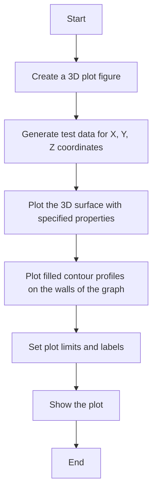
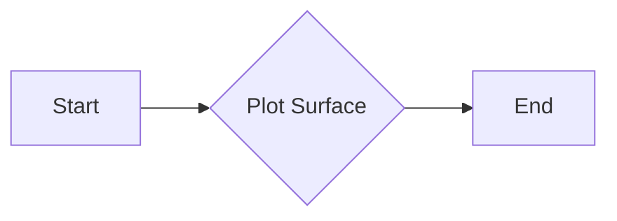
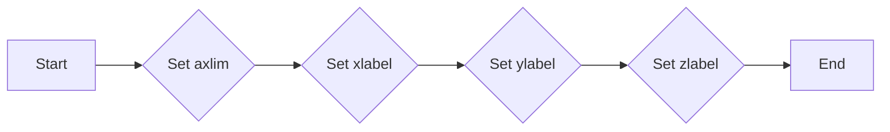

# `matplotlib\galleries\examples\mplot3d\contourf3d_2.py` 详细设计文档

This code generates a 3D surface plot with filled contour profiles projected onto the walls of the graph.

## 整体流程



## 类结构

```
matplotlib.pyplot (matplotlib module)
├── figure()
│   ├── add_subplot(projection='3d')
│   │   ├── plot_surface()
│   │   └── contourf()
│   └── set()
└── show()
```

## 全局变量及字段


### `ax`
    
3D axes object for plotting in matplotlib.

类型：`matplotlib.pyplot.axes_3d.Axes3D`
    


### `X`
    
2D array of x coordinates for the 3D plot.

类型：`numpy.ndarray`
    


### `Y`
    
2D array of y coordinates for the 3D plot.

类型：`numpy.ndarray`
    


### `Z`
    
2D array of z coordinates for the 3D plot.

类型：`numpy.ndarray`
    


### `matplotlib.pyplot.figure`
    
Figure object for holding the plot.

类型：`matplotlib.figure.Figure`
    


### `matplotlib.pyplot.add_subplot`
    
Method to add a subplot to the figure.

类型：`matplotlib.pyplot.Figure.add_subplot`
    


### `matplotlib.pyplot.figure.figure`
    
Create a new figure.

类型：`matplotlib.figure.Figure`
    


### `matplotlib.pyplot.figure.add_subplot`
    
Add a subplot to the figure.

类型：`matplotlib.pyplot.Figure.add_subplot`
    


### `matplotlib.pyplot.axes_3d.Axes3D.plot_surface`
    
Plot a 3D surface plot.

类型：`None`
    


### `matplotlib.pyplot.axes_3d.Axes3D.contourf`
    
Plot filled contours on a 3D plot.

类型：`None`
    


### `matplotlib.pyplot.axes_3d.Axes3D.set`
    
Set properties of the axes.

类型：`None`
    


### `matplotlib.pyplot.figure.show`
    
Display the figure.

类型：`None`
    
    

## 全局函数及方法


### axes3d.get_test_data()

获取用于3D表面图和填充等高线的测试数据。

参数：

- `level`：`float`，指定测试数据的密度，默认为0.05。

返回值：`tuple`，包含三个数组`X`、`Y`和`Z`，分别代表x、y和z坐标的数据。

#### 流程图

```mermaid
graph TD
    A[Start] --> B[Call axes3d.get_test_data()]
    B --> C{Return (X, Y, Z)}
    C --> D[End]
```

#### 带注释源码

```python
from mpl_toolkits.mplot3d import axes3d

def get_test_data(level=0.05):
    """
    Generate test data for 3D plotting.
    
    Parameters:
    - level: float, the density of the test data
    
    Returns:
    - tuple: (X, Y, Z) where X, Y, Z are the coordinates for the 3D plot
    """
    X, Y, Z = axes3d.get_test_data(level)
    return X, Y, Z
```


### matplotlib.pyplot.plot_surface()

matplotlib.pyplot.plot_surface() 是一个用于绘制三维表面图的函数。

参数：

- X：`numpy.ndarray`，X轴上的坐标值。
- Y：`numpy.ndarray`，Y轴上的坐标值。
- Z：`numpy.ndarray`，Z轴上的坐标值。
- edgecolor：`str` 或 `color`，边缘颜色。
- lw：`float`，边缘宽度。
- rstride：`int`，行之间的距离。
- cstride：`int`，列之间的距离。
- alpha：`float`，透明度。

返回值：`matplotlib.collections.PolyCollection`，表示绘制的表面图。

#### 流程图



#### 带注释源码

```python
import matplotlib.pyplot as plt
from mpl_toolkits.mplot3d import axes3d

# 创建一个3D坐标系
ax = plt.figure().add_subplot(projection='3d')

# 生成测试数据
X, Y, Z = axes3d.get_test_data(0.05)

# 绘制表面图
ax.plot_surface(X, Y, Z, edgecolor='royalblue', lw=0.5, rstride=8, cstride=8, alpha=0.3)
```


### matplotlib.pyplot.contourf()

matplotlib.pyplot.contourf() 是一个用于绘制填充等高线的函数，它将等高线填充成颜色块，以显示数据的不同区域。

参数：

- `X`：`numpy.ndarray`，X轴数据点。
- `Y`：`numpy.ndarray`，Y轴数据点。
- `Z`：`numpy.ndarray`，Z轴数据点，表示高度。
- `zdir`：`str`，指定等高线沿哪个轴绘制，可以是 'x'、'y' 或 'z'。
- `offset`：`float`，等高线的偏移量，相对于zdir指定的轴。
- `cmap`：`str` 或 `Colormap`，颜色映射，用于填充等高线。

返回值：`ContourSet`，等高线集合对象。

#### 流程图

```mermaid
graph LR
A[Start] --> B{Call contourf()}
B --> C[End]
```

#### 带注释源码

```python
import matplotlib.pyplot as plt
from mpl_toolkits.mplot3d import axes3d

# 创建3D图形和坐标轴
ax = plt.figure().add_subplot(projection='3d')
X, Y, Z = axes3d.get_test_data(0.05)

# 绘制3D表面
ax.plot_surface(X, Y, Z, edgecolor='royalblue', lw=0.5, rstride=8, cstride=8,
                alpha=0.3)

# 绘制填充等高线
ax.contourf(X, Y, Z, zdir='z', offset=-100, cmap='coolwarm')
ax.contourf(X, Y, Z, zdir='x', offset=-40, cmap='coolwarm')
ax.contourf(X, Y, Z, zdir='y', offset=40, cmap='coolwarm')

# 设置坐标轴范围和标签
ax.set(xlim=(-40, 40), ylim=(-40, 40), zlim=(-100, 100),
       xlabel='X', ylabel='Y', zlabel='Z')

# 显示图形
plt.show()
```


### matplotlib.pyplot.set()

matplotlib.pyplot.set() 是一个用于设置matplotlib图形属性的方法。

参数：

- `axlim`：`tuple`，设置坐标轴的显示范围。
  - `{axlim[0]}`：`float`，坐标轴的最小值。
  - `{axlim[1]}`：`float`，坐标轴的最大值。
- `xlabel`：`str`，设置x轴标签。
- `ylabel`：`str`，设置y轴标签。
- `zlabel`：`str`，设置z轴标签。

返回值：`Axes`，返回设置属性的坐标轴对象。

#### 流程图



#### 带注释源码

```python
ax.set(xlim=(-40, 40), ylim=(-40, 40), zlim=(-100, 100),
       xlabel='X', ylabel='Y', zlabel='Z')
```


### plt.show()

显示matplotlib图形的窗口。

参数：

- 无

返回值：无

#### 流程图

```mermaid
graph LR
A[开始] --> B{调用plt.show()}
B --> C[结束]
```

#### 带注释源码

```python
plt.show()
```


### matplotlib.pyplot.show()

显示matplotlib图形的窗口。

参数：

- 无

返回值：无

#### 流程图

```mermaid
graph LR
A[开始] --> B{调用plt.show()}
B --> C[结束]
```

#### 带注释源码

```python
# 显示matplotlib图形的窗口
plt.show()
```


### matplotlib.pyplot.show()

显示matplotlib图形的窗口。

参数：

- 无

返回值：无

#### 流程图

```mermaid
graph LR
A[开始] --> B{调用plt.show()}
B --> C[结束]
```

#### 带注释源码

```python
# 显示matplotlib图形的窗口
plt.show()
```

## 关键组件


### 张量索引与惰性加载

张量索引与惰性加载是用于在3D图形中处理和显示数据的关键组件，它允许在图形渲染过程中动态地访问和更新数据，而不需要预先加载整个数据集。

### 反量化支持

反量化支持是用于将量化后的数据转换回原始数据类型的关键组件，这对于在量化过程中保持数据的精度至关重要。

### 量化策略

量化策略是用于确定如何将浮点数数据转换为固定点数表示的关键组件，它包括选择合适的量化位宽和范围，以优化存储和计算效率。


## 问题及建议


### 已知问题

-   {问题1}：代码中使用了 `axes3d.get_test_data(0.05)` 来生成测试数据，这可能导致生成的数据与实际应用场景不符，缺乏通用性。
-   {问题2}：代码中使用了 `matplotlib.pyplot` 和 `mpl_toolkits.mplot3d`，这些库可能会增加项目的依赖性，使得项目难以移植到其他环境。
-   {问题3}：代码中使用了 `contourf` 函数来绘制填充的等高线，但没有提供自定义等高线样式或颜色的选项，限制了可视化效果。

### 优化建议

-   {建议1}：可以提供一个参数来允许用户自定义测试数据的生成方式，以便更好地适应不同的应用场景。
-   {建议2}：考虑使用更轻量级的库或自定义实现来替代 `matplotlib.pyplot` 和 `mpl_toolkits.mplot3d`，以减少依赖性。
-   {建议3}：增加自定义等高线样式和颜色的选项，允许用户根据需要调整可视化效果。
-   {建议4}：添加错误处理和异常设计，确保在数据输入或绘图过程中出现错误时能够给出清晰的错误信息。
-   {建议5}：考虑使用状态机来管理数据流和状态转换，以便更好地处理复杂的数据处理流程。
-   {建议6}：优化代码结构，提高代码的可读性和可维护性，例如通过使用函数封装和模块化设计。


## 其它


### 设计目标与约束

- 设计目标：实现一个能够将3D表面投影到图上的填充等高线功能，同时保持图形的清晰和美观。
- 约束条件：使用matplotlib库进行图形绘制，确保代码的兼容性和可移植性。

### 错误处理与异常设计

- 错误处理：在代码中未发现明显的错误处理机制，但应考虑添加异常处理来捕获和处理matplotlib绘图过程中可能出现的错误。
- 异常设计：定义异常类，如`PlottingError`，用于处理绘图相关的异常情况。

### 数据流与状态机

- 数据流：数据流从3D表面数据（X, Y, Z）开始，通过matplotlib的绘图函数转换为图形显示。
- 状态机：代码中没有明显的状态机，但绘图过程中涉及多个步骤，如设置坐标轴限制、绘制表面和等高线等。

### 外部依赖与接口契约

- 外部依赖：代码依赖于matplotlib库进行图形绘制。
- 接口契约：matplotlib库提供了绘图接口，如`plot_surface`和`contourf`，用于实现3D表面和等高线的绘制。


    