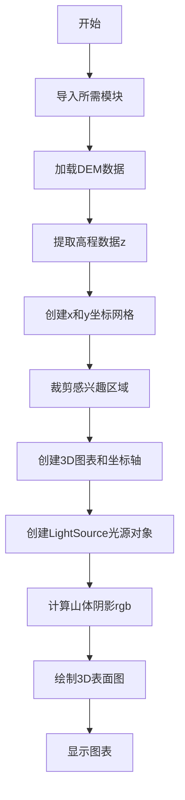
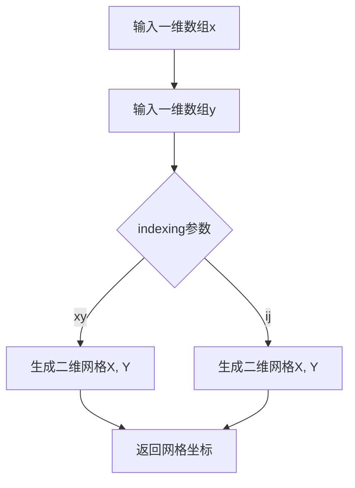
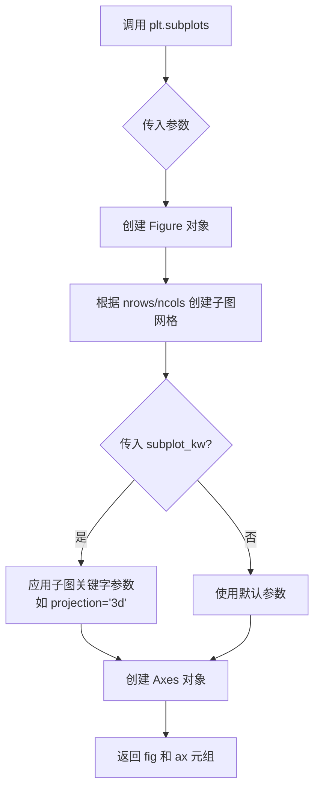
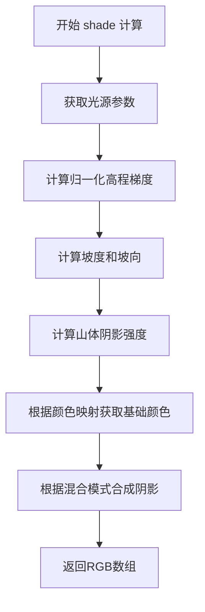
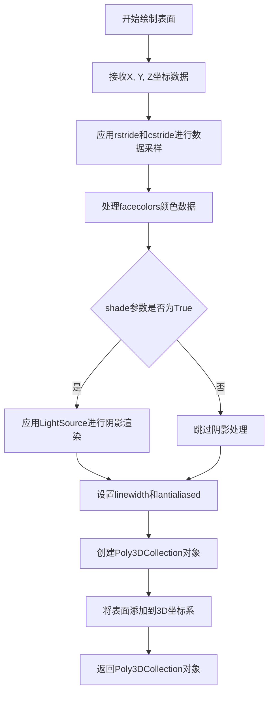
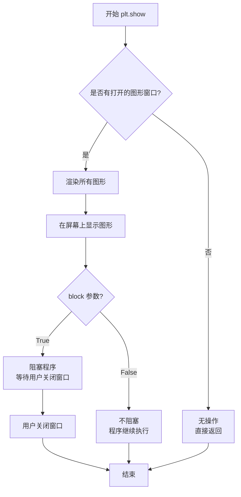
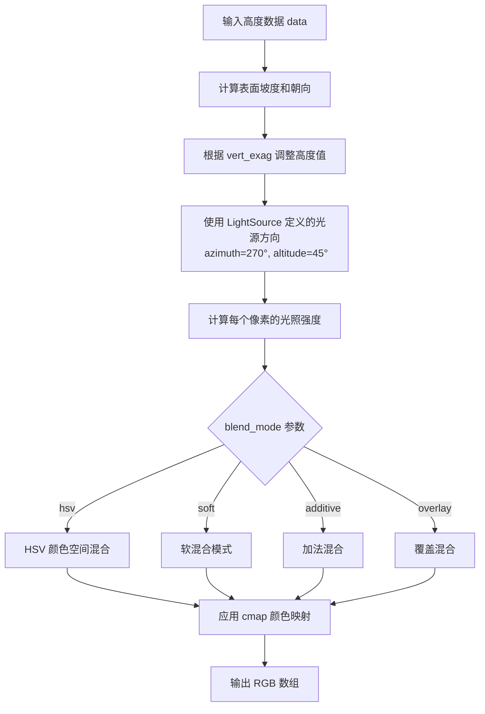
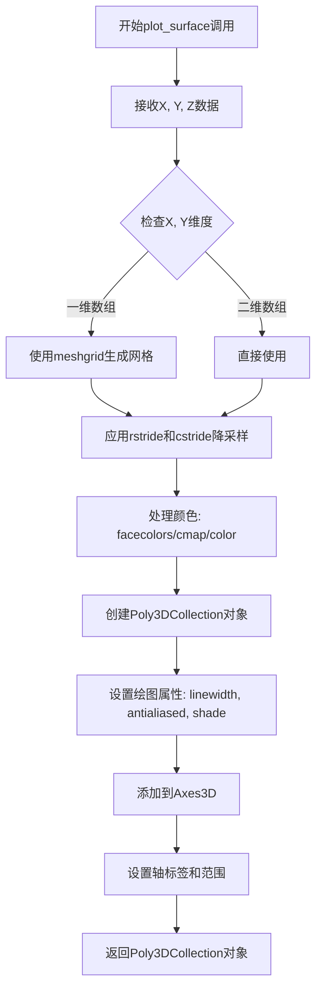

# `matplotlib\galleries\examples\mplot3d\custom_shaded_3d_surface.py` 详细设计文档

这是一个使用matplotlib展示3D表面图并应用自定义山体阴影（hillshading）的示例代码，通过加载DEM（数字高程模型）数据，创建LightSource光源对象，计算自定义阴影效果，并在3D坐标系中渲染地形表面。

## 整体流程



## 类结构

```
Python脚本 (无自定义类)
├── 导入模块部分
├── 数据加载与处理部分
└── 可视化渲染部分
```

## 全局变量及字段


### `dem`
    
DEM数字高程模型数据文件，包含高程和坐标范围信息

类型：`npz file (numpy data archive)`
    


### `z`
    
高程数据数组，存储地形的高度值

类型：`numpy.ndarray`
    


### `nrows`
    
高程数据的行数，对应Y方向采样点数量

类型：`int`
    


### `ncols`
    
高程数据的列数，对应X方向采样点数量

类型：`int`
    


### `x`
    
X坐标数组，表示地形在X轴方向的坐标位置

类型：`numpy.ndarray`
    


### `y`
    
Y坐标数组，表示地形在Y轴方向的坐标位置

类型：`numpy.ndarray`
    


### `x, y`
    
meshgrid生成的二维坐标网格，用于3D绘图

类型：`numpy.ndarray`
    


### `region`
    
切片区域对象，用于提取感兴趣的地形子区域

类型：`numpy.s_ (slice object)`
    


### `rgb`
    
阴影颜色数组，存储计算后的山体阴影RGB值

类型：`numpy.ndarray`
    


### `fig`
    
图表对象，表示整个matplotlib图形窗口

类型：`matplotlib.figure.Figure`
    


### `ax`
    
3D坐标轴对象，用于绘制3D表面图

类型：`matplotlib.axes._subplots.Axes3DSubplot`
    


### `ls`
    
光源对象，用于计算山体阴影效果

类型：`matplotlib.colors.LightSource`
    


### `surf`
    
3D表面图对象，包含渲染的地形曲面

类型：`matplotlib.collections.Poly3DCollection`
    


### `LightSource.azdeg`
    
方位角角度，决定光源在水平方向的位置

类型：`float`
    


### `LightSource.altdeg`
    
高度角角度，决定光源在垂直方向的高度

类型：`float`
    
    

## 全局函数及方法


### `cbook.get_sample_data()`

该函数是 Matplotlib 库中 `cbook` 模块提供的样本数据加载工具，用于获取 Matplotlib 捆绑的示例数据文件。在代码中，它加载了一个包含地形高程数据的 NPZ 文件，并返回一个类似字典的 numpy 归档文件对象，其中存储了高程矩阵以及地理坐标范围信息（xmin, xmax, ymin, ymax）。

参数：

-  `fname`：`str`，要加载的样本数据文件名，例如 `'jucksboro_fault_dem.npz'`
-  `asfileobj`：`bool`（可选），默认为 `True`，指定是否以文件对象形式返回数据，`False` 时返回文件路径

返回值：`npz`，返回一个 numpy 归档文件对象（类似字典），包含以下典型键值：
  - `'elevation'`：高程数据的 2D 数组
  - `'xmin'`、`'xmax'`：x 坐标的最小值和最大值
  - `'ymin'`、`'ymax'`：y 坐标的最小值和最大值

#### 流程图

```mermaid
flowchart TD
    A[开始] --> B[调用 cbook.get_sample_data fname]
    B --> C{asfileobj=True?}
    C -->|Yes| D[打开文件为文件对象]
    C -->|No| E[返回文件路径字符串]
    D --> F[返回 npz 归档文件对象]
    E --> F
    F --> G[通过键访问数据数组<br/>如 dem['elevation']]
    G --> H[结束]
```

#### 带注释源码

```python
# 调用 cbook.get_sample_data 获取样本地形数据
# 参数: 'jacksboro_fault_dem.npz' - NPZ 格式的地形高程数据文件
dem = cbook.get_sample_data('jacksboro_fault_dem.npz')

# 从返回的 npz 归档文件中提取高程数据
# dem 类似于字典，可通过键名访问内部存储的 numpy 数组
z = dem['elevation']  # 2D numpy array, 存储地形高度值

# 获取高程数据的行数和列数
nrows, ncols = z.shape

# 从 npz 文件中提取地理坐标范围
# xmin, xmax 定义东西方向的范围
# ymin, ymax 定义南北方向的范围
x = np.linspace(dem['xmin'], dem['xmax'], ncols)
y = np.linspace(dem['ymin'], dem['ymax'], nrows)

# 使用 meshgrid 创建网格坐标矩阵
x, y = np.meshgrid(x, y)
```


### `np.linspace`

创建指定数量的等间隔样本，返回一个在起止区间内均匀分布的数组。

参数：

- `start`：`array_like`，序列的起始值
- `stop`：`array_like`，序列的结束值，除非 `endpoint` 设为 False，在这种情况下，序列由 `num+1` 个点组成，忽略最后一个点
- `num`：`int`，生成的样本数量，默认为 50
- `endpoint`：`bool`，如果为 True，`stop` 是包含的最后一个样本，否则不包括，默认为 True
- `retstep`：`bool`，如果为 True，返回 (step, sample)，其中 step 是样本之间的间距，默认为 False
- `dtype`：`dtype`，输出数组的类型，如果未指定则从输入推断
- `axis`：`int`，结果的轴（只在多维数组输入时有意义），默认为 0

返回值：`ndarray`，如果 `retstep` 为 False，则返回 `num` 个样本；如果 `retstep` 为 True，则返回包含样本和步长的元组。

#### 流程图

```mermaid
flowchart TD
    A[开始 linspace] --> B{参数验证}
    B -->|start 和 stop 均为标量| C[计算步长 step = (stop - start) / (num - 1)]
    B -->|start 或 stop 为数组| D[广播计算步长]
    C --> E[生成等差序列: start, start+step, start+2*step, ...]
    D --> E
    E --> F{endpoint == True?}
    F -->|是| G[包含 stop 值]
    F -->|否| H[不包含 stop 值]
    G --> I{retstep == True?}
    H --> I
    I -->|是| J[返回 samples 和 step 元组]
    I -->|否| K[仅返回 samples 数组]
    J --> L[结束]
    K --> L
```

#### 带注释源码

```python
def linspace(start, stop, num=50, endpoint=True, retstep=False, dtype=None, axis=0):
    """
    返回指定间隔内均匀分布的数字。
    
    参数:
        start: 序列的起始值
        stop: 序列的结束值
        num: 生成的样本数量，默认为50
        endpoint: 是否包含stop值
        retstep: 是否返回步长
        dtype: 输出数组的数据类型
        axis: 结果数组的轴
    
    返回:
        samples: 均匀分布的样本数组
        step: 样本间的步长（如果retstep=True）
    """
    # 将输入转换为数组
    _arange = np.arange
    _dtype = float if dtype is None else np.dtype(dtype).type
    
    # 计算步长
    if endpoint:
        # 如果包含终点，步长 = 范围 / (样本数 - 1)
        step = (stop - start) / (num - 1)
    else:
        # 如果不包含终点，步长 = 范围 / 样本数
        step = (stop - start) / num
    
    # 生成序列
    if num == 0:
        return array([], dtype=_dtype)
    
    # 使用arange生成序列
    y = _arange(0, num, dtype=_dtype) * step + start
    
    # 处理endpoint情况
    if endpoint and num > 0:
        y[num-1] = stop
    
    # 返回结果
    if retstep:
        return y, step
    else:
        return y
```


### `np.meshgrid`

该函数用于从一维坐标向量创建二维网格坐标矩阵，常用于生成三维表面图的网格坐标。

参数：
- `x`：`ndarray`，一维数组，表示x轴坐标向量
- `y`：`ndarray`，一维数组，表示y轴坐标向量

返回值：`tuple of ndarray`，返回两个二维数组，其中第一个数组包含x坐标的网格，第二个数组包含y坐标的网格。

#### 流程图



#### 带注释源码

```python
import numpy as np

# 定义x和y坐标向量
x = np.linspace(dem['xmin'], dem['xmax'], ncols)
y = np.linspace(dem['ymin'], dem['ymax'], nrows)

# 使用meshgrid生成二维网格坐标
# x: 包含ncols列的二维数组，每行相同
# y: 包含nrows行的二维数组，每列相同
x, y = np.meshgrid(x, y)

# 区域切片示例
region = np.s_[5:50, 5:50]
x, y, z = x[region], y[region], z[region]
```


### `numpy.s_`（切片对象）

`numpy.s_` 是 NumPy 库中的一个特殊索引函数，用于方便地创建多维数组切片元组，常用于数组的索引操作。

参数：

- 该函数不需要显式参数调用，而是通过方括号语法 `np.s_[start:stop:step, ...]` 来创建切片。

返回值：`tuple`，返回一个由 `slice` 对象组成的元组，用于数组的多维索引切片操作。

#### 流程图

```mermaid
flowchart TD
    A[开始] --> B[调用 np.s_]
    B --> C{使用方括号语法}
    C --> D[输入切片参数如 5:50]
    E[解析切片参数] --> F[创建 slice 对象]
    F --> G[返回 slice 元组]
    G --> H[用于数组索引 x[region]]
    H --> I[结束]
    
    style B fill:#f9f,stroke:#333
    style G fill:#9f9,stroke:#333
    style I fill:#9ff,stroke:#333
```

#### 带注释源码

```python
# np.s_ 是 NumPy 提供的切片索引辅助函数
# 它不是一个普通函数，而是一个可以通过方括号语法调用的对象

# 使用方式：np.s_[start:stop:step, start:stop:step, ...]
region = np.s_[5:50, 5:50]

# 上述代码等价于：
# region = (slice(5, 50, None), slice(5, 50, None))

# 等价于手动创建切片元组：
# region = (slice(5, 50), slice(5, 50))

# 实际应用：将切片对象用于数组索引
x, y, z = x[region], y[region], z[region]
# 等价于：
# x, y, z = x[5:50, 5:50], y[5:50, 5:50], z[5:50, 5:50]

# np.s_ 的主要优势：
# 1. 可以在变量中存储切片操作，便于复用
# 2. 使代码更具可读性
# 3. 方便用于多维数组的复杂切片操作
```

#### 详细说明

| 属性 | 详情 |
|------|------|
| **名称** | `numpy.s_` |
| **类型** | 函数/索引对象 |
| **模块** | numpy |
| **语法** | `np.s_[slice1, slice2, ...]` |
| **返回值类型** | `tuple of slice` |
| **常见用途** | 数组切片、区域选择、数据子集提取 |

`np.s_` 返回的对象可以直接用于 NumPy 数组的索引操作，实现多维数组的高效切片。在本例中，它用于从地形数据中提取感兴趣的区域（50x50 的子矩阵）。


### `plt.subplots`

创建包含单个子图的图形和坐标轴对象，支持配置子图的关键字参数。

参数：

- `nrows`：`int`，可选，子图的行数，默认为 1
- `ncols`：`int`，可选，子图的列数，默认为 1
- `figsize`：`tuple`，可选，图形的大小，格式为 (宽度, 高度)
- `sharex`：`bool`，可选，是否共享 x 轴
- `sharey`：`bool`，可选，是否共享 y 轴
- `squeeze`：`bool`，可选，是否压缩返回的坐标轴数组维度
- `subplot_kw`：可选，传递给 `add_subplot` 的关键字参数字典，例如 `projection='3d'` 用于创建 3D 坐标轴
- `gridspec_kw`：可选，传递给 `GridSpec` 的关键字参数
- `**kwargs`：可选，其他传递给 `Figure.subplots` 的关键字参数

返回值：`tuple`，包含两个元素：

- `fig`：`matplotlib.figure.Figure`，图形对象
- `ax`：`matplotlib.axes.Axes` 或 `numpy.ndarray`，坐标轴对象或坐标轴数组

#### 流程图



#### 带注释源码

```python
# 调用 plt.subplots 创建 3D 投影的子图
# subplot_kw 参数传递字典，其中 projection='3d' 指定创建 3D 坐标轴
fig, ax = plt.subplots(subplot_kw=dict(projection='3d'))

# 解析：
# 1. plt.subplots() 是 matplotlib.pyplot 的函数
# 2. subplot_kw 接收一个字典，键为子图的关键字参数
# 3. dict(projection='3d') 创建字典 {'projection': '3d'}
# 4. 返回值 fig 是 Figure 对象（整个图形容器）
# 5. 返回值 ax 是 Axes3D 对象（3D 坐标轴，用于绘制 3D 图表）
```


### `LightSource.shade`

该方法通过给定的颜色映射和垂直夸张值计算3D表面的自定义山体阴影，返回表面各点的RGB颜色值，用于在3D表面图中实现自定义的山体阴影效果。

参数：

- `z`：`numpy.ndarray`，高程数据矩阵，表示地形表面的高度值
- `cmap`：`matplotlib.colors.Colormap`，颜色映射对象，用于将高程值映射为颜色
- `vert_exag`：`float`，垂直夸张值，用于增强或减小地形起伏的视觉效果，默认为1
- `blend_mode`：`str`，阴影混合模式，可选值为'soft'、'hsv'、'overlay'等，指定如何将阴影与基础颜色混合
- `dx`：`float`，可选，数据在x方向的间距
- `dy`：`float`，可选，数据在y方向的间距
- `altitude`：`float`，可选，光源高度角（度数），默认为90度（正上方）
- `azdeg`：`float`，可选，光源方位角（度数），默认为270度（西方向）

返回值：`numpy.ndarray`，返回与输入高程数据形状相同的RGB颜色数组，形状为(nrows, ncols, 3)，每个元素包含R、G、B三个通道的颜色值（范围0-1）

#### 流程图



#### 带注释源码

```python
# 该方法是matplotlib.colors.LightSource类的shade方法
# 以下为简化版实现逻辑说明

ls = LightSource(270, 45)  # 创建光源：方位角270度（西），高度角45度
rgb = ls.shade(
    z,                      # 输入：高程矩阵
    cmap=plt.colormaps["gist_earth"],  # 使用gist_earth颜色映射
    vert_exag=0.1,          # 垂直夸张值为0.1（减小起伏）
    blend_mode='soft'       # 使用软混合模式
)

# 内部处理流程：
# 1. 根据 cmap 将 z 值映射为 RGB 基础颜色
# 2. 计算高程数据的梯度（dx, dy）
# 3. 根据光源角度计算每个像素的阴影强度
# 4. 使用 blend_mode 指定的模式将阴影应用到基础颜色
# 5. 返回计算后的 RGB 数组用于 plot_surface 的 facecolors 参数
```


### `Axes3D.plot_surface`

该方法用于在3D坐标系中绘制表面图，接受X、Y、Z数据坐标以及多种样式参数（如颜色、步长、抗锯齿等），并返回一个包含所有绘制面的Poly3DCollection对象。

参数：

- `X`：`numpy.ndarray`，2D数组，表示表面的X坐标
- `Y`：`numpy.ndarray`，2D数组，表示表面的Y坐标
- `Z`：`numpy.ndarray`，2D数组，表示表面的Z坐标（高度值）
- `rstride`：`int`，行方向的步长，默认值为1
- `cstride`：`int`，列方向的步长，默认值为1
- `facecolors`：`array-like`，表面的颜色数组，用于自定义每个面的颜色
- `linewidth`：`float`，边缘线宽，默认值为0（无线条）
- `antialiased`：`bool`，是否启用抗锯齿，默认值为False
- `shade`：`bool`，是否应用阴影效果，默认值为True

返回值：`mpl_toolkits.mplot3d.art3d.Poly3DCollection`，返回创建的3D多边形集合对象，包含所有绘制的表面面片

#### 流程图



#### 带注释源码

```python
# 设置3D图表属性
fig, ax = plt.subplots(subplot_kw=dict(projection='3d'))

# 创建光源对象用于阴影处理
ls = LightSource(270, 45)

# 使用shade方法计算表面颜色
# 参数说明：
#   - z: 高度数据
#   - cmap: 颜色映射表（gist_earth）
#   - vert_exag: 垂直 exaggeration 因子，用于增强高度效果
#   - blend_mode: 混合模式（soft）
rgb = ls.shade(z, cmap=plt.colormaps["gist_earth"], vert_exag=0.1, blend_mode='soft')

# 调用plot_surface绘制3D表面
# 参数说明：
#   - x, y, z: 网格坐标数据
#   - rstride=1: 行方向每1个点采样一次
#   - cstride=1: 列方向每1个点采样一次
#   - facecolors=rgb: 使用计算好的阴影颜色
#   - linewidth=0: 无线条
#   - antialiased=False: 关闭抗锯齿
#   - shade=False: 关闭额外阴影（因为已经在shade中处理过了）
surf = ax.plot_surface(x, y, z, rstride=1, cstride=1, facecolors=rgb,
                       linewidth=0, antialiased=False, shade=False)

# 显示图表
plt.show()
```


### `plt.show()`

显示所有当前打开的图形窗口。在交互式模式下，调用该函数后程序会阻塞，直到用户关闭图形窗口；在非交互式模式下，该函数会确保图形被渲染并显示。

参数：

- `block`：布尔型，可选参数，默认为 `True`。如果设置为 `True`（默认行为），则在交互式模式下会阻塞程序执行，直到关闭所有图形窗口；如果设置为 `False`，则不会阻塞，程序继续执行。

返回值：`None`，该函数无返回值。

#### 流程图



#### 带注释源码

```python
# plt.show() 函数的简化实现逻辑说明
# 实际实现位于 matplotlib.backend_bases 模块中

def show(block=None):
    """
    显示所有打开的图形窗口。
    
    参数:
        block: bool, optional
            是否阻塞程序执行。默认为 True。
    """
    
    # 获取当前所有打开的图形管理器
    # _pylab_helpers.Gcf 是 matplotlib 内部管理图形对象的类
    managers = _pylab_helpers.Gcf.get_all_fig_managers()
    
    if not managers:
        # 如果没有打开的图形，直接返回
        return
    
    # 遍历所有图形管理器，进行渲染和显示
    for manager in managers:
        # 调用 backend 的 show 方法渲染图形
        # 不同的后端（如 Qt, Tk, Agg 等）有不同的实现
        manager.show()
    
    # 如果 block 为 True，则阻塞程序
    if block:
        # 在交互式模式下启动事件循环
        # 等待用户与图形交互并关闭窗口
        import matplotlib
        matplotlib.pyplot.switch_backend('qt')  # 示例后端
        # 进入主事件循环（具体实现依赖于后端）
        # ...
    
    # 函数返回 None
    return None
```


### LightSource.shade()

该函数是 matplotlib 中 LightSource 类的核心方法，用于根据给定的地形高度数据和颜色映射计算山体阴影颜色值，通过模拟光照方向和表面坡度来生成具有立体感的假彩色阴影图像。

参数：

- `self`：`LightSource` 实例，LightSource 对象本身，包含光源方向信息
- `data`：`numpy.ndarray`，二维数组，表示地形高度数据（DEM 数据）
- `cmap`：`Colormap`，matplotlib 颜色映射对象，用于将高度值映射为颜色
- `vert_exag`：`float`，垂直 exaggeration 因子，用于夸大垂直变化以增强视觉效果，默认为 100
- `blend_mode`：`str`，颜色混合模式，可选值包括 'hsv'、'soft'、'additive'、'soft' 等，默认为 'hsv'
- `dx`：`float`，x 方向采样间距，默认为 1
- `dy`：`float`，y 方向采样间距，默认为 1
- `fraction`：`float`，阴影强度分数，用于控制光照强度，默认为 0（无阴影）

返回值：`numpy.ndarray`，返回与输入数据形状相同的 RGB 颜色数组，形状为 (nrows, ncols, 4)，包含 RGBA 通道值

#### 流程图



#### 带注释源码

```python
# 创建 LightSource 实例
# 参数 270 表示方位角 azimuth（水平旋转角度，从北顺时针）
# 参数 45 表示高度角 altitude（光线入射角度，90 为正上方）
ls = LightSource(270, 45)

# 调用 shade 方法计算山体阴影
# 参数说明：
# - z: 地形高度数据（二维 numpy 数组）
# - cmap: 颜色映射表，gist_earth 适合地形可视化
# - vert_exag: 垂直 exaggeration = 0.1，用于夸大地形起伏
# - blend_mode: 'soft' 软混合模式，产生柔和的阴影效果
rgb = ls.shade(z,                       # 高度数据数组
               cmap=plt.colormaps["gist_earth"],  # 颜色映射
               vert_exag=0.1,          # 垂直夸大因子
               blend_mode='soft')       # 混合模式

# 返回值 rgb 是计算后的阴影颜色数组
# 形状为 (nrows, ncols, 4)，包含 RGBA 颜色值
# 可直接作为 facecolors 参数传给 plot_surface
surf = ax.plot_surface(x, y, z, 
                       rstride=1, cstride=1, 
                       facecolors=rgb,      # 使用计算的阴影颜色
                       linewidth=0, 
                       antialiased=False, 
                       shade=False)         # 禁用默认阴影，使用自定义
```


### `Axes3D.plot_surface`

绘制3D表面图的方法，用于在三维坐标系中根据给定的X、Y、Z数据绘制表面图形，支持自定义颜色映射、步长、抗锯齿和阴影效果。

参数：

- `X`：`numpy.ndarray`，X坐标数据，可以是二维数组（与Z同形状）或一维数组（将作为网格坐标）
- `Y`：`numpy.ndarray`，Y坐标数据，可以是二维数组（与Z同形状）或一维数组（将作为网格坐标）
- `Z`：`numpy.ndarray`，高度/值数据，二维数组，表示表面在每个(x, y)点的高度
- `rstride`：`int`，行步长，用于降低数据分辨率，默认为1（不降低）
- `cstride`：`int`，列步长，用于降低数据分辨率，默认为1（不降低）
- `rcount`：`int`，行采样数，与rstride互斥，指定要采样的行数
- `ccount`：`int`，列采样数，与cstride互斥，指定要采样的列数
- `color`：`str`或`tuple`，表面基础颜色，默认为None（使用cmap）
- `cmap`：`Colormap`，颜色映射对象，用于根据Z值着色表面
- `facecolors`：`array-like`，可选的面颜色数组，覆盖color和cmap设置
- `linewidth`：`float`，网格线宽度，默认为0（无网格线）
- `antialiased`：`bool`，是否启用抗锯齿，默认为False
- `shade`：`bool`，是否启用阴影效果，默认为True
- `vmin`、`vmax`：`float`，颜色映射的最小/最大值，用于归一化颜色
- `norm`：`Normalize`，matplotlib颜色归一化对象
- `offset`：`float`，多边形偏移，用于解决z排序问题
- `**kwargs`：其他传递给Poly3DCollection的关键字参数

返回值：`matplotlib.collections.Poly3DCollection`，返回创建的3D多边形集合对象，可用于进一步自定义（如设置颜色条）

#### 流程图



#### 带注释源码

```python
# 代码中的实际调用示例
fig, ax = plt.subplots(subplot_kw=dict(projection='3d'))  # 创建3D坐标系

# 准备数据
x = np.linspace(dem['xmin'], dem['xmax'], ncols)  # x坐标数组
y = np.linspace(dem['ymin'], dem['ymax'], nrows)  # y坐标数组
x, y = np.meshgrid(x, y)  # 生成网格坐标

# 创建LightSource对象用于计算阴影
ls = LightSource(270, 45)
# 计算自定义山体阴影颜色
rgb = ls.shade(z, cmap=plt.colormaps["gist_earth"], 
               vert_exag=0.1, blend_mode='soft')

# 调用plot_surface方法绘制3D表面
surf = ax.plot_surface(
    x,                      # X坐标: 二维数组
    y,                      # Y坐标: 二维数组
    z,                      # Z坐标: 高度数据
    rstride=1,              # 行步长: 1（不降采样）
    cstride=1,              # 列步长: 1（不降采样）
    facecolors=rgb,         # 使用预计算的自定义阴影颜色
    linewidth=0,            # 无网格线
    antialiased=False,      # 关闭抗锯齿
    shade=False             # 不使用默认阴影（已使用自定义）
)

# surf现在是Poly3DCollection对象
plt.show()
```


## 关键组件


### 数据加载模块 (Data Loading)

从Matplotlib的样本数据集中加载地形高程数据( DEM)，提取高程数组和地理边界信息

### 坐标网格生成 (Coordinate Grid Generation)

使用np.linspace和np.meshgrid创建覆盖DEM区域的x,y坐标网格

### 区域裁剪 (Region Slicing)

使用numpy切片(np.s_)裁剪出感兴趣的地形区域(5:50, 5:50)

### 光源配置 (LightSource Configuration)

创建LightSource对象，设定方位角270度(西)和高度角45度，用于计算山体阴影

### 山体阴影计算 (Hillshading Computation)

使用shade方法将高程数据转换为RGB颜色值，采用gist_earth色彩映射、0.1的垂直 exaggeration和'soft'混合模式

### 3D表面渲染 (3D Surface Rendering)

使用plot_surface绘制3D地形表面，自定义facecolors为预计算的山体阴影RGB值，关闭默认着色


## 问题及建议


### 已知问题

-   硬编码参数过多且缺乏解释：光源角度(270, 45)、垂直夸张度(0.1)、混合模式('soft')、区域切片(5:50)等魔法数字未提供任何注释说明
-   缺乏错误处理：未检查示例数据文件是否存在、未验证z数组形状、未验证x/y/z维度一致性
-   代码封装性差：整个代码块是扁平脚本形式，缺少函数封装，难以在其他项目中重用
-   图形信息不完整：缺少坐标轴标签、标题、图例或颜色条，用户无法理解图形表示的内容
-   性能配置不合理：rstride=1和cstride=1对于大网格数据可能导致渲染性能问题
-   缺乏类型注解：所有变量和函数均无类型标注，降低了代码的可读性和可维护性

### 优化建议

-   将核心逻辑封装为函数，接收数据路径、参数配置等作为输入，提高可复用性
-   添加参数校验逻辑，检查dem数据有效性、数组维度匹配等
-   为关键参数添加配置常量或配置字典，并附带解释性注释
-   添加坐标轴标签(fig.suptitle、ax.set_xlabel/ylabel/zlabel)和颜色条
-   考虑将rstride和cstride参数化或根据数据规模自动调整
-   使用with语句或显式关闭图形以确保资源释放
-   添加类型注解提升代码质量

## 其它


### 设计目标与约束

本示例旨在演示如何在Matplotlib的3D表面图中应用自定义山体阴影效果，核心目标是通过LightSource类实现逼真的地形可视化。约束条件包括：必须使用matplotlib支持的3D投影方式，必须预先计算rgb颜色值且禁用内置着色，以及数据必须是规则网格形式的二维高程数组。

### 错误处理与异常设计

代码主要依赖Matplotlib的数据加载机制，潜在的异常包括：数据文件不存在或损坏会导致npz加载失败，数组维度不匹配会导致meshgrid失败，不支持的colormap会导致渲染错误。建议在实际应用中增加文件存在性检查、数组形状验证和异常捕获机制。

### 外部依赖与接口契约

主要依赖包括：matplotlib.pyplot用于绘图，numpy用于数值处理，matplotlib.cbook用于样本数据获取，matplotlib.colors.LightSource用于山体阴影计算。接口契约方面，get_sample_data返回包含xmin、xmax、ymin、ymax和elevation字段的npz文件，LightSource.shade方法接受高程数组、颜色映射、垂直 exaggeration 和混合模式参数，返回RGB颜色数组。

### 性能考虑

当前实现使用rstride=1和cstride=1进行全分辨率渲染，对于大尺寸地形数据可能导致性能问题。优化方向包括：增大步长值降低采样率、使用缓冲区渲染技术、对大区域数据进行分块处理。rgb颜色预计算虽然增加了内存开销，但禁用了实时着色可提升交互性能。

### 数据格式与预处理

输入数据格式为NumPy的npz压缩文件，包含地形高程矩阵（2D数组）和地理坐标边界信息。预处理步骤包括：从完整数据中通过数组切片提取感兴趣区域（region），使用np.linspace生成规则网格坐标，使用np.meshgrid创建坐标矩阵。数据坐标系统假设为笛卡尔坐标系，原点在左下角。

### 可视化配置参数

关键配置参数包括：LightSource的方位角（270度）和高度角（45度）定义了光源位置，vert_exag=0.1控制垂直夸张程度以增强地形起伏视觉效果，blend_mode='soft'使用软混合模式处理阴影和高光。plot_surface参数中rstride和cstride控制行/列采样步长，linewidth=0去除网格线，antialiased=False禁用抗锯齿以提升性能，shade=False禁用内置阴影。

### 颜色映射方案

使用gist_earth颜色映射呈现自然地形效果，该映射将低海拔地区映射为绿色、高海拔映射为棕色和白色，模拟从山谷到山峰的自然色彩过渡。山体阴影通过计算光照与地形法线的点积生成明暗效果，与颜色映射结合后形成具有立体感的地形可视化。

### 坐标系和投影方式

使用Matplotlib的3D投影系统（projection='3d'），创建三维笛卡尔坐标系。X和Y轴表示地理平面坐标，Z轴表示高程。坐标范围由原始DEM数据的边界决定，通过np.linspace确保网格的规则分布。视点位置由Matplotlib自动设置，也可通过view_init方法自定义观察角度。

### 地形分析参数

山体阴影算法基于坡度和坡向计算：坡度决定接收的光照量，坡向确定表面相对于光源的朝向。vert_exag参数对Z值进行夸张处理，使平缓地形的高程变化更明显。混合模式'soft'（或称'hsv'）在RGB和HSV颜色空间之间混合，保留更多颜色细节而不会产生过度饱和的区域。

    