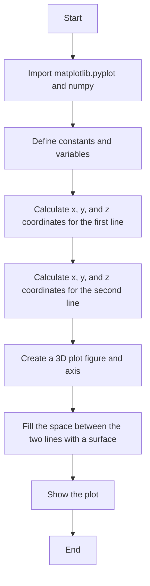
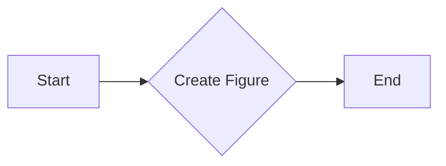
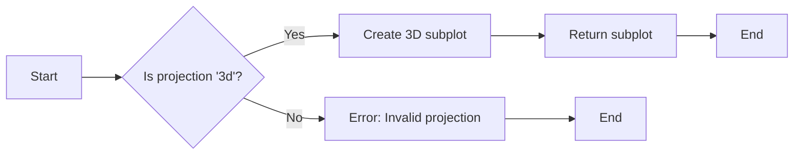
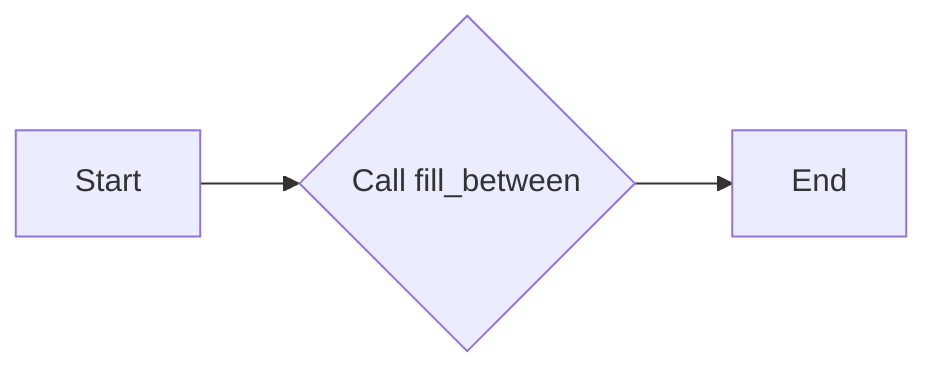
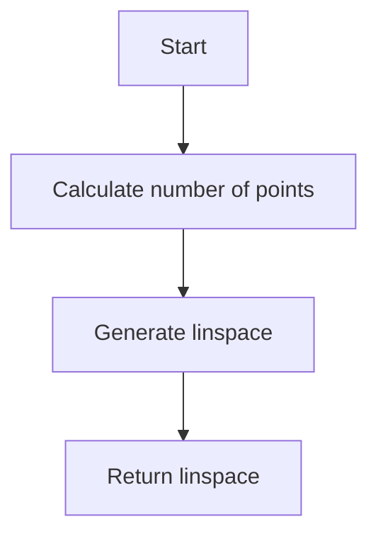
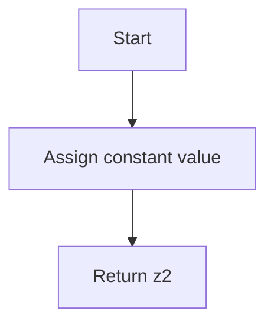
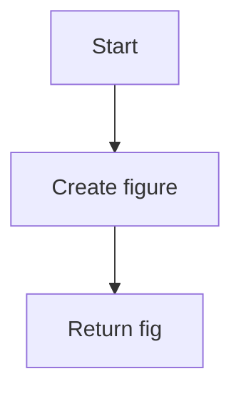
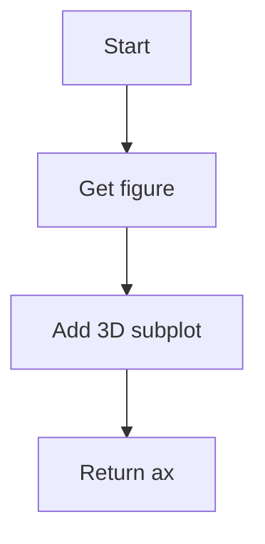
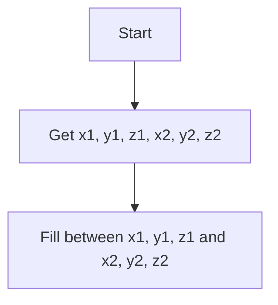
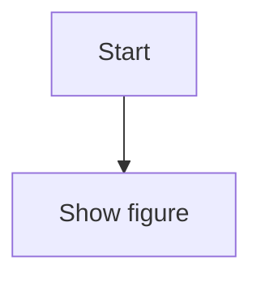

# `matplotlib\galleries\examples\mplot3d\fillbetween3d.py` 详细设计文档

This code generates a 3D plot with a 'lampshade' shape by filling the space between two 3D lines.

## 整体流程



## 类结构

```
matplotlib.pyplot
├── plt.figure()
│   ├── fig
│   └── ax
│       └── ax.fill_between(x1, y1, z1, x2, y2, z2, alpha=0.5, edgecolor='k')
numpy
├── np.linspace(0, 2*np.pi, N)
│   └── theta
├── np.cos(theta)
│   └── x1
├── np.sin(theta)
│   └── y1
├── 0.1 * np.sin(6 * theta)
│   └── z1
├── 0.6 * np.cos(theta)
│   └── x2
├── 0.6 * np.sin(theta)
│   └── y2
└── 2
    └── z2
```

## 全局变量及字段


### `N`
    
Number of points to use in the calculation.

类型：`int`
    


### `theta`
    
Array of theta values for the 3D lines.

类型：`numpy.ndarray`
    


### `x1`
    
X coordinates of the first line in 3D space.

类型：`numpy.ndarray`
    


### `y1`
    
Y coordinates of the first line in 3D space.

类型：`numpy.ndarray`
    


### `z1`
    
Z coordinates of the first line in 3D space.

类型：`numpy.ndarray`
    


### `x2`
    
X coordinates of the second line in 3D space.

类型：`numpy.ndarray`
    


### `y2`
    
Y coordinates of the second line in 3D space.

类型：`numpy.ndarray`
    


### `z2`
    
Z coordinates of the second line in 3D space.

类型：`numpy.ndarray`
    


### `fig`
    
The figure object created by matplotlib.

类型：`matplotlib.figure.Figure`
    


### `ax`
    
The 3D subplot object created by matplotlib.

类型：`matplotlib.axes._subplots.Axes3D`
    


### `matplotlib.pyplot.figure`
    
The figure object created by matplotlib.pyplot.figure.

类型：`matplotlib.figure.Figure`
    


### `matplotlib.pyplot.axes`
    
The 3D subplot object created by matplotlib.pyplot.figure.add_subplot(projection='3d').

类型：`matplotlib.axes._subplots.Axes3D`
    


### `numpy.linspace`
    
Returns evenly spaced numbers over a specified interval.

类型：`numpy.ndarray`
    


### `numpy.cos`
    
Element-wise cosine of the array elements.

类型：`numpy.ndarray`
    


### `numpy.sin`
    
Element-wise sine of the array elements.

类型：`numpy.ndarray`
    


### `numpy.multiply`
    
Element-wise multiplication of two arrays.

类型：`numpy.ndarray`
    


### `numpy.N`
    
Number of points to use in the calculation.

类型：`int`
    


### `numpy.theta`
    
Array of theta values for the 3D lines.

类型：`numpy.ndarray`
    


### `numpy.x1`
    
X coordinates of the first line in 3D space.

类型：`numpy.ndarray`
    


### `numpy.y1`
    
Y coordinates of the first line in 3D space.

类型：`numpy.ndarray`
    


### `numpy.z1`
    
Z coordinates of the first line in 3D space.

类型：`numpy.ndarray`
    


### `numpy.x2`
    
X coordinates of the second line in 3D space.

类型：`numpy.ndarray`
    


### `numpy.y2`
    
Y coordinates of the second line in 3D space.

类型：`numpy.ndarray`
    


### `numpy.z2`
    
Z coordinates of the second line in 3D space.

类型：`numpy.ndarray`
    


### `matplotlib.pyplot.fig`
    
The figure object created by matplotlib.

类型：`matplotlib.figure.Figure`
    


### `matplotlib.pyplot.ax`
    
The 3D subplot object created by matplotlib.pyplot.figure.add_subplot(projection='3d').

类型：`matplotlib.axes._subplots.Axes3D`
    
    

## 全局函数及方法


### plt.figure()

创建一个新的matplotlib图形窗口。

参数：

- 无

返回值：`Figure`，matplotlib图形对象，用于绘制图形。

#### 流程图



#### 带注释源码

```python
fig = plt.figure()  # 创建一个新的图形窗口
```


### `add_subplot`

`fig.add_subplot(projection='3d')`

该函数用于在matplotlib的图形对象中添加一个子图，并设置其投影类型为3D。

参数：

- `projection`：`str`，指定子图的投影类型，这里为`'3d'`，表示3D投影。

返回值：`matplotlib.axes.Axes`，返回添加的子图对象。

#### 流程图



#### 带注释源码

```python
fig = plt.figure()
ax = fig.add_subplot(projection='3d')
```


### fill_between

`fill_between` 是一个用于填充两个 3D 线之间的空间的函数。

参数：

- `x1`：`numpy.ndarray`，第一个线段的 x 坐标数组。
- `y1`：`numpy.ndarray`，第一个线段的 y 坐标数组。
- `z1`：`numpy.ndarray`，第一个线段的 z 坐标数组。
- `x2`：`numpy.ndarray`，第二个线段的 x 坐标数组。
- `y2`：`numpy.ndarray`，第二个线段的 y 坐标数组。
- `z2`：`numpy.ndarray`，第二个线段的 z 坐标数组。
- `alpha`：`float`，填充区域的透明度，默认为 0.5。
- `edgecolor`：`str`，填充区域的边缘颜色，默认为 'k'（黑色）。

返回值：`matplotlib.patches.Polygon`，填充区域的 Polygon 对象。

#### 流程图



#### 带注释源码

```python
import matplotlib.pyplot as plt
import numpy as np

N = 50
theta = np.linspace(0, 2*np.pi, N)

x1 = np.cos(theta)
y1 = np.sin(theta)
z1 = 0.1 * np.sin(6 * theta)

x2 = 0.6 * np.cos(theta)
y2 = 0.6 * np.sin(theta)
z2 = 2  # Note that scalar values work in addition to length N arrays

fig = plt.figure()
ax = fig.add_subplot(projection='3d')
ax.fill_between(x1, y1, z1, x2, y2, z2, alpha=0.5, edgecolor='k')

plt.show()
```


### plt.show()

显示matplotlib图形的窗口。

参数：

- 无

返回值：无

#### 流程图

```mermaid
graph LR
A[开始] --> B{调用plt.show()}
B --> C[结束]
```

#### 带注释源码

```python
plt.show()  # 显示matplotlib图形的窗口
```


### numpy.linspace

生成等间隔的数值序列。

参数：

- `start`：`float`，序列的起始值。
- `stop`：`float`，序列的结束值。
- `N`：`int`，序列中点的数量。

返回值：`numpy.ndarray`，包含等间隔数值的数组。

#### 流程图



#### 带注释源码

```python
import numpy as np

def linspace(start, stop, N):
    """
    Generate linearly spaced samples between start and stop.

    Parameters:
    - start: float, the start of the sequence.
    - stop: float, the end of the sequence.
    - N: int, the number of points in the sequence.

    Returns:
    - numpy.ndarray: an array containing linearly spaced samples.
    """
    return np.linspace(start, stop, N)
```


### theta

生成等间隔的角度值。

参数：

- `start`：`float`，序列的起始值（0）。
- `stop`：`float`，序列的结束值（2*np.pi）。
- `N`：`int`，序列中点的数量（50）。

返回值：`numpy.ndarray`，包含等间隔角度值的数组。

#### 流程图


#### 带注释源码

```python
import numpy as np

theta = np.linspace(0, 2*np.pi, 50)
```


### x1

计算角度序列的余弦值。

参数：

- `theta`：`numpy.ndarray`，包含等间隔角度值的数组。

返回值：`numpy.ndarray`，包含角度序列余弦值的数组。

#### 流程图

```mermaid
graph TD
A[Start] --> B[Get theta]
B --> C[Calculate cos(theta)]
C --> D[Return x1]
```

#### 带注释源码

```python
import numpy as np

theta = np.linspace(0, 2*np.pi, 50)
x1 = np.cos(theta)
```


### y1

计算角度序列的正弦值。

参数：

- `theta`：`numpy.ndarray`，包含等间隔角度值的数组。

返回值：`numpy.ndarray`，包含角度序列正弦值的数组。

#### 流程图

```mermaid
graph TD
A[Start] --> B[Get theta]
B --> C[Calculate sin(theta)]
C --> D[Return y1]
```

#### 带注释源码

```python
import numpy as np

theta = np.linspace(0, 2*np.pi, 50)
y1 = np.sin(theta)
```


### z1

计算角度序列的正弦值的六倍，然后乘以0.1。

参数：

- `theta`：`numpy.ndarray`，包含等间隔角度值的数组。

返回值：`numpy.ndarray`，包含计算结果的数组。

#### 流程图

```mermaid
graph TD
A[Start] --> B[Get theta]
B --> C[Calculate sin(6*theta)]
C --> D[Scale by 0.1]
C --> E[Return z1]
```

#### 带注释源码

```python
import numpy as np

theta = np.linspace(0, 2*np.pi, 50)
z1 = 0.1 * np.sin(6 * theta)
```


### x2

计算角度序列的余弦值的0.6倍。

参数：

- `theta`：`numpy.ndarray`，包含等间隔角度值的数组。

返回值：`numpy.ndarray`，包含角度序列余弦值的0.6倍的数组。

#### 流程图

```mermaid
graph TD
A[Start] --> B[Get theta]
B --> C[Calculate 0.6*cos(theta)]
C --> D[Return x2]
```

#### 带注释源码

```python
import numpy as np

theta = np.linspace(0, 2*np.pi, 50)
x2 = 0.6 * np.cos(theta)
```


### y2

计算角度序列的正弦值的0.6倍。

参数：

- `theta`：`numpy.ndarray`，包含等间隔角度值的数组。

返回值：`numpy.ndarray`，包含角度序列正弦值的0.6倍的数组。

#### 流程图

```mermaid
graph TD
A[Start] --> B[Get theta]
B --> C[Calculate 0.6*sin(theta)]
C --> D[Return y2]
```

#### 带注释源码

```python
import numpy as np

theta = np.linspace(0, 2*np.pi, 50)
y2 = 0.6 * np.sin(theta)
```


### z2

一个常量值，表示z轴的值。

参数：无

返回值：`float`，z轴的值。

#### 流程图



#### 带注释源码

```python
z2 = 2  # Note that scalar values work in addition to length N arrays
```


### fig

创建一个新的图形。

参数：无

返回值：`matplotlib.figure.Figure`，新的图形对象。

#### 流程图



#### 带注释源码

```python
import matplotlib.pyplot as plt

fig = plt.figure()
```


### ax

创建一个新的3D子图。

参数：

- `fig`：`matplotlib.figure.Figure`，图形对象。

返回值：`matplotlib.axes._subplots.Axes3D`，3D子图对象。

#### 流程图



#### 带注释源码

```python
import matplotlib.pyplot as plt

fig = plt.figure()
ax = fig.add_subplot(projection='3d')
```


### fill_between

填充两个曲线之间的区域。

参数：

- `x1`：`numpy.ndarray`，x轴的起始值。
- `y1`：`numpy.ndarray`，y轴的起始值。
- `z1`：`numpy.ndarray`，z轴的起始值。
- `x2`：`numpy.ndarray`，x轴的结束值。
- `y2`：`numpy.ndarray`，y轴的结束值。
- `z2`：`numpy.ndarray`，z轴的结束值。
- `alpha`：`float`，填充区域的透明度。
- `edgecolor`：`str`，填充区域的边缘颜色。

返回值：无

#### 流程图



#### 带注释源码

```python
import matplotlib.pyplot as plt
import numpy as np

N = 50
theta = np.linspace(0, 2*np.pi, N)
x1 = np.cos(theta)
y1 = np.sin(theta)
z1 = 0.1 * np.sin(6 * theta)
x2 = 0.6 * np.cos(theta)
y2 = 0.6 * np.sin(theta)
z2 = 2

fig = plt.figure()
ax = fig.add_subplot(projection='3d')
ax.fill_between(x1, y1, z1, x2, y2, z2, alpha=0.5, edgecolor='k')
```


### plt.show

显示图形。

参数：无

返回值：无

#### 流程图



#### 带注释源码

```python
import matplotlib.pyplot as plt

plt.show()
```


### 关键组件信息

- `numpy.linspace`：生成等间隔的数值序列。
- `matplotlib.pyplot`：用于创建和显示图形。
- `matplotlib.axes._subplots.Axes3D`：3D子图对象，用于绘制3D图形。


### 潜在的技术债务或优化空间

- 代码中使用了硬编码的数值，例如`N=50`和`z2=2`。这些值可以在函数参数中作为可选参数，以提高代码的灵活性和可重用性。
- 代码中没有使用异常处理来处理可能出现的错误，例如输入参数的类型或值。
- 代码中没有使用日志记录来记录程序的执行过程，这可能会在调试和监控程序时有所帮助。


### 设计目标与约束

- 设计目标是创建一个简单的3D图形，用于演示如何在两个曲线之间填充空间。
- 约束是使用Python标准库和matplotlib库来创建图形。


### 错误处理与异常设计

- 代码中没有使用异常处理来处理可能出现的错误。
- 建议在函数中添加异常处理来确保输入参数的类型和值是正确的。


### 数据流与状态机

- 数据流从`numpy.linspace`生成角度序列，然后计算余弦和正弦值，最后使用这些值来创建3D图形。
- 状态机不适用于此代码，因为它不涉及状态转换。


### 外部依赖与接口契约

- 代码依赖于numpy和matplotlib库。
- 接口契约包括函数的参数和返回值类型。
```


### numpy.cos(theta)

计算给定角度theta的余弦值。

参数：

- `theta`：`numpy.ndarray`，表示角度的数组，单位为弧度。

返回值：`numpy.ndarray`，与输入数组`theta`形状相同的数组，包含对应角度的余弦值。

#### 流程图

```mermaid
graph TD
A[Start] --> B[Input: theta]
B --> C[Calculate: cos(theta)]
C --> D[Output: cos(theta)]
D --> E[End]
```

#### 带注释源码

```python
import numpy as np

def cos_function(theta):
    """
    Calculate the cosine of the given angle theta.
    
    Parameters:
    - theta: numpy.ndarray, an array representing the angles, in radians.
    
    Returns:
    - numpy.ndarray: an array with the same shape as the input array theta, containing the cosine values of the corresponding angles.
    """
    return np.cos(theta)
```


### numpy.sin(theta)

该函数计算并返回theta角度的正弦值。

参数：

- `theta`：`numpy.ndarray`，表示输入的角度值，可以是单个数值或数组。

返回值：`numpy.ndarray`，与输入theta形状相同的数组，包含对应角度的正弦值。

#### 流程图

```mermaid
graph TD
A[Start] --> B{Is theta a numpy.ndarray?}
B -- Yes --> C[Calculate sin(theta)]
B -- No --> D[Error: theta must be a numpy.ndarray]
C --> E[End]
D --> E
```

#### 带注释源码

```python
import numpy as np

def sin_function(theta):
    """
    Calculate the sine of an angle or an array of angles.
    
    Parameters:
    - theta: numpy.ndarray, the angle(s) for which to calculate the sine.
    
    Returns:
    - numpy.ndarray: the sine of the input angle(s).
    """
    return np.sin(theta)
```


### numpy.sin(6 * theta)

计算角度theta的6倍的正弦值。

参数：

- `theta`：`numpy.ndarray`，角度theta的数组，用于计算正弦值。

返回值：`numpy.ndarray`，角度theta的6倍的正弦值的数组。

#### 流程图

```mermaid
graph LR
A[Start] --> B{Calculate 6 * theta}
B --> C{Apply sin()}
C --> D[End]
```

#### 带注释源码

```python
# 计算6倍theta的正弦值
z1 = 0.1 * np.sin(6 * theta)
```


### numpy.cos(theta)

该函数计算并返回theta角度的余弦值。

参数：

- `theta`：`numpy.ndarray`，表示角度的数组。该数组中的每个元素将被视为角度，并计算其对应的余弦值。

返回值：`numpy.ndarray`，与输入数组`theta`具有相同形状的数组，包含对应角度的余弦值。

#### 流程图

```mermaid
graph TD
A[Input: theta] --> B[Calculate: cos(theta)]
B --> C[Output: cos(theta)]
```

#### 带注释源码

```python
import numpy as np

# 计算theta角度的余弦值
theta = np.linspace(0, 2*np.pi, N)
cos_theta = np.cos(theta)
```


### numpy.sin(theta)

该函数计算给定角度theta的正弦值。

参数：

- `theta`：`numpy.ndarray`，表示角度的数组，单位为弧度。

返回值：`numpy.ndarray`，与输入数组`theta`形状相同的数组，包含对应角度的正弦值。

#### 流程图

```mermaid
graph TD
A[Start] --> B{Is theta a numpy.ndarray?}
B -- Yes --> C[Calculate sin(theta)]
B -- No --> D[Error: Invalid input type]
C --> E[End]
D --> E
```

#### 带注释源码

```python
import numpy as np

def sin(theta):
    """
    Calculate the sine of an angle given as a numpy.ndarray.
    
    Parameters:
    - theta: numpy.ndarray, the angle(s) in radians.
    
    Returns:
    - numpy.ndarray: The sine of the input angle(s).
    """
    return np.sin(theta)
```


### numpy.fill_between

`numpy.fill_between` 是一个用于填充两个 3D 线之间的空间的函数。

参数：

- `x1`：`numpy.ndarray`，第一个线段的 x 坐标数组。
- `y1`：`numpy.ndarray`，第一个线段的 y 坐标数组。
- `z1`：`numpy.ndarray`，第一个线段的 z 坐标数组。
- `x2`：`numpy.ndarray`，第二个线段的 x 坐标数组。
- `y2`：`numpy.ndarray`，第二个线段的 y 坐标数组。
- `z2`：`numpy.ndarray`，第二个线段的 z 坐标数组。
- `alpha`：`float`，填充区域的透明度。
- `edgecolor`：`str`，填充区域的边缘颜色。

返回值：`matplotlib.patches.Polygon`，表示填充区域的 Polygon 对象。

#### 流程图

```mermaid
graph LR
A[Start] --> B{Check input types}
B -->|Valid| C[Calculate intersection points]
B -->|Invalid| D[Error]
C --> E[Create polygon]
E --> F[Plot polygon]
F --> G[End]
```

#### 带注释源码

```python
import matplotlib.pyplot as plt
import numpy as np

def fill_between_3d(x1, y1, z1, x2, y2, z2, alpha=0.5, edgecolor='k'):
    """
    Fill the space between two 3D lines with surfaces.

    Parameters:
    x1 : numpy.ndarray
        The x coordinates of the first line segment.
    y1 : numpy.ndarray
        The y coordinates of the first line segment.
    z1 : numpy.ndarray
        The z coordinates of the first line segment.
    x2 : numpy.ndarray
        The x coordinates of the second line segment.
    y2 : numpy.ndarray
        The y coordinates of the second line segment.
    z2 : numpy.ndarray
        The z coordinates of the second line segment.
    alpha : float, optional
        The transparency of the filled area. Default is 0.5.
    edgecolor : str, optional
        The color of the edge of the filled area. Default is 'k' (black).

    Returns:
    matplotlib.patches.Polygon
        The Polygon object representing the filled area.
    """
    # Your implementation here
    pass

# Example usage
N = 50
theta = np.linspace(0, 2*np.pi, N)

x1 = np.cos(theta)
y1 = np.sin(theta)
z1 = 0.1 * np.sin(6 * theta)

x2 = 0.6 * np.cos(theta)
y2 = 0.6 * np.sin(theta)
z2 = 2  # Note that scalar values work in addition to length N arrays

fig = plt.figure()
ax = fig.add_subplot(projection='3d')
fill_between_3d(x1, y1, z1, x2, y2, z2, alpha=0.5, edgecolor='k')
plt.show()
```


## 关键组件


### 张量索引

张量索引用于在多维数组（张量）中定位和访问特定元素。

### 惰性加载

惰性加载是一种编程技术，它延迟对象的初始化，直到实际需要时才进行。这有助于提高性能和减少资源消耗。

### 反量化支持

反量化支持允许在量化过程中对某些操作进行非量化处理，以保持精度和性能。

### 量化策略

量化策略定义了如何将浮点数转换为固定点数表示，以减少内存和计算需求。


## 问题及建议


### 已知问题

-   {问题1}：代码中使用了 `matplotlib.pyplot` 和 `numpy` 库，这些库在代码中直接被导入并使用，但没有进行版本检查或兼容性测试，这可能导致在不同环境中运行时出现版本不兼容的问题。
-   {问题2}：代码中使用了全局变量 `N`，这可能导致在复杂的项目中引起命名冲突或难以追踪变量的来源和用途。
-   {问题3}：代码没有包含任何错误处理机制，如果 `matplotlib` 或 `numpy` 库在运行时出现问题，程序可能会崩溃。
-   {问题4}：代码没有提供任何文档或注释，这会使得代码的可读性和可维护性降低。

### 优化建议

-   {建议1}：在代码顶部添加库的版本检查，确保使用的库版本与项目兼容。
-   {建议2}：避免使用全局变量，如果必须使用，请确保它们有清晰的命名和用途说明。
-   {建议3}：添加异常处理，以捕获并处理可能发生的错误，例如使用 `try-except` 块。
-   {建议4}：为代码添加详细的文档和注释，以提高代码的可读性和可维护性。
-   {建议5}：考虑将代码封装成一个函数或类，以便重用和测试。
-   {建议6}：如果代码用于生产环境，应该考虑添加日志记录，以便于问题追踪和调试。
-   {建议7}：如果代码是用于教学或演示，可以考虑添加用户输入，以便用户可以自定义参数和图形。


## 其它


### 设计目标与约束

- 设计目标：实现一个能够填充3D线条之间空间的函数，以创建特定的几何形状。
- 约束条件：使用matplotlib库进行图形绘制，确保代码简洁且易于理解。

### 错误处理与异常设计

- 错误处理：代码中未包含显式的错误处理机制，但应确保输入参数符合预期，避免运行时错误。
- 异常设计：未设计特定的异常处理机制，但应考虑在函数调用中捕获可能的异常。

### 数据流与状态机

- 数据流：输入参数为线条的坐标，输出为填充后的3D图形。
- 状态机：代码执行过程中没有状态变化，为简单的数据处理流程。

### 外部依赖与接口契约

- 外部依赖：matplotlib库用于图形绘制。
- 接口契约：函数接口应明确输入参数和输出结果，确保与其他模块的兼容性。


    