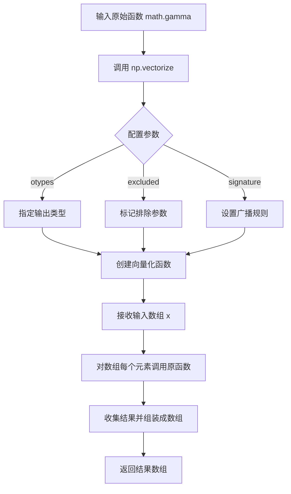
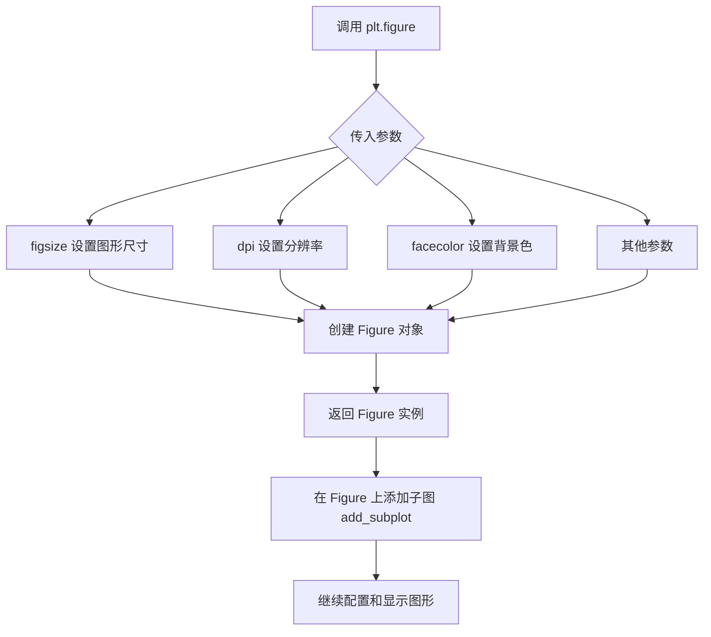
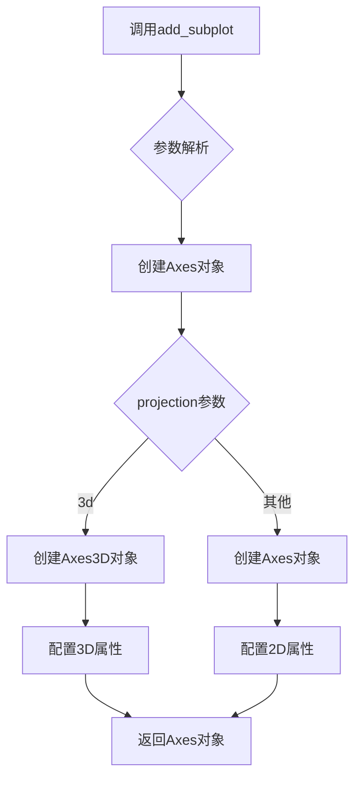
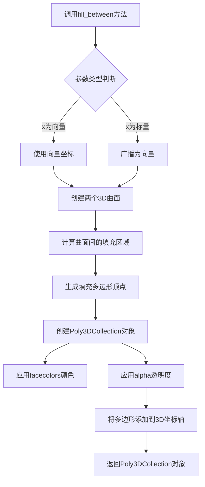

# `matplotlib\galleries\examples\mplot3d\fillunder3d.py` 详细设计文档

该脚本使用matplotlib创建一个3D图形，展示泊松分布的概率质量函数，并通过fill_between在3D空间中填充不同lambda值线条下的区域，形成半透明的'锯齿状彩色玻璃'效果。

## 整体流程

```mermaid
graph TD
    A[开始] --> B[导入依赖库: math, matplotlib.pyplot, numpy]
B --> C[使用np.vectorize包装math.gamma函数]
C --> D[定义参数: N=31, x从0到10, lambdas从1到8]
D --> E[创建3D坐标轴: ax = plt.figure().add_subplot(projection='3d')]
E --> F[定义颜色映射: facecolors使用viridis_r colormap]
F --> G[循环遍历lambdas]
G --> H{循环是否结束?}
H -- 否 --> I[调用ax.fill_between填充区域]
I --> G
H -- 是 --> J[设置坐标轴范围和标签]
J --> K[调用plt.show()显示图形]
K --> L[结束]
```

## 类结构

```
无类层次结构（脚本仅包含全局变量和函数调用）
```

## 全局变量及字段


### `gamma`
    
使用np.vectorize包装的math.gamma函数，用于计算伽马函数

类型：`numpy.vectorize`
    


### `N`
    
整数31，表示x轴数据点的数量

类型：`int`
    


### `x`
    
numpy数组，从0到10的等间距数组，共31个点

类型：`numpy.ndarray`
    


### `lambdas`
    
range对象，整数1到8，表示泊松分布的参数lambda

类型：`range`
    


### `ax`
    
Axes3D对象，3D坐标轴对象

类型：`matplotlib.axes._axes.Axes3D`
    


### `facecolors`
    
numpy数组，使用viridis_r颜色映射的颜色数组

类型：`numpy.ndarray`
    


### `i`
    
循环变量，表示当前索引

类型：`int`
    


### `l`
    
循环变量，表示当前lambda值

类型：`int`
    


    

## 全局函数及方法


### `math.gamma`

数学库中的伽马函数（Gamma Function），这是一个数学函数，用于计算阶乘的连续扩展。在给定代码中，通过 `np.vectorize(math.gamma)` 向量化后，用于计算泊松分布的概率质量函数中所需的阶乘值（(x+1)! = gamma(x+1)）。

参数：

-  `x`：`float`，输入参数，表示要计算伽马函数的数值

返回值：`float`，返回输入参数的伽马函数值

#### 流程图

```mermaid
flowchart TD
    A[开始] --> B[输入参数 x]
    B --> C{x >= 0?}
    C -->|是| D[计算 Gamma(x)]
    C -->|否| E[抛出 DomainError]
    D --> F[返回 Gamma(x) 结果]
    E --> G[错误处理]
    
    subgraph "在代码中的使用"
    H[输入 x+1] --> I[调用 math.gamma]
    I --> J[计算 gamma&#40;x+1&#41; = x!]
    J --> K[用于泊松分布计算<br/>P&#40;x&#41; = &#40;l^x * e^(-l)&#41; / x!]
    end
```

#### 带注释源码

```python
import math
import numpy as np

# 源代码中的使用方式:
# 1. 导入 math 库的 gamma 函数
# 2. 使用 np.vectorize 将其向量化以支持数组输入
gamma = np.vectorize(math.gamma)

# 在计算中使用:
# gamma(x + 1) 等价于 (x + 1)! 的阶乘计算
# 用于泊松分布的概率质量函数: P(x) = (λ^x * e^(-λ)) / x!
# 其中 x! = gamma(x + 1)

# 示例计算:
# x = np.array([0, 1, 2, 3, 4])
# gamma(x + 1) => [1, 1, 2, 6, 24] 相当于 0!, 1!, 2!, 3!, 4!

# 函数签名:
# math.gamma(x)
# 参数: x - 浮点数，必须 >= 0
# 返回: 浮点数，x 的伽马函数值

# 代码中的实际调用:
# l**x * np.exp(-l) / gamma(x + 1)
# 其中:
#   l 是泊松分布的 lambda 参数 (range 1-8)
#   x 是概率质量函数的输入值 (0-10)
#   gamma(x + 1) 计算 x! 用于归一化
```


### `np.vectorize`

将标量函数转换为可处理 NumPy 数组的向量化函数装饰器/函数，允许原函数对单个标量的操作应用于整个数组。

参数：

- `pyfunc`：`callable`，要向量化的 Python 函数（本例中为 `math.gamma`）
- `otypes`：`list of str or None`，输出数组的元素类型，默认为 None 自动推断
- `doc`：`str or None`，向量化函数的文档字符串，默认为原函数的文档
- `excluded`：`set or list`，不进行向量化的参数集合（本例中为 None）
- `cache`：`bool`，是否缓存函数调用结果，默认为 False
- `signature`：`str or None`，通用函数签名，用于广义向量化和广播，默认为 None

返回值：`callable`，返回一个新的向量化函数，该函数可以对 NumPy 数组进行逐元素操作

#### 流程图



#### 带注释源码

```python
# 从 NumPy 库导入 vectorize 函数
# vectorize 是一个非常实用的工具，它可以将只接受标量输入的函数
# 转换为可以接受数组输入的向量化函数

# 在本例中：
# math.gamma 是一个数学函数，只接受单个数值输入
# 使用 np.vectorize 包装后，gamma 函数可以接受 numpy 数组输入

gamma = np.vectorize(math.gamma)

# 这里的 np.vectorize 做了以下事情：
# 1. 创建一个新的函数，该函数可以处理数组输入
# 2. 对输入数组的每个元素调用 math.gamma
# 3. 将结果收集成一个与输入形状相同的数组返回
# 4. 这种方式虽然方便，但运行速度不如真正的向量化操作

# 示例使用：
# x = np.array([1, 2, 3])
# gamma(x)  # 等价于 np.array([math.gamma(1), math.gamma(2), math.gamma(3)])
```


### `plt.figure`

`plt.figure` 是 matplotlib 库中的一个函数，用于创建一个新的图形窗口（Figure 对象），并可指定图形的尺寸、分辨率、背景色等属性。在代码中用于创建包含 3D 坐标轴的新图形窗口。

#### 参数

- `figsize`：`tuple(float, float)`，图形的宽和高，以英寸为单位，默认为 `(6.4, 4.8)`
- `dpi`：`int`，图形每英寸的点数（分辨率），默认为 `100`
- `facecolor`：`str or tuple`，图形背景颜色，默认为 `'white'`
- `edgecolor`：`str or tuple`，图形边框颜色
- `frameon`：`bool`，是否显示边框，默认为 `True`
- `FigureClass`：`type`，可选的自定义 Figure 类
- `**kwargs`：其他关键字参数，用于传递给底层 `Figure` 构造器

#### 返回值

`matplotlib.figure.Figure`，返回新创建的图形对象，该对象包含整个图形的容器，可添加子图（subplot）

#### 流程图



#### 带注释源码

```python
# 导入 matplotlib.pyplot 并重命名为 plt
import matplotlib.pyplot as plt
import numpy as np

# 调用 plt.figure() 创建新的图形窗口
# 参数：
#   - figsize: (6.4, 4.8) 默认值，图形尺寸为 6.4x4.8 英寸
#   - dpi: 100 默认值，每英寸 100 点
#   - facecolor: 'white' 默认值，白色背景
# 返回值：Figure 对象实例
ax = plt.figure().add_subplot(projection='3d')

# 上述代码等价于：
# fig = plt.figure()           # 创建新图形，返回 Figure 对象
# ax = fig.add_subplot(111, projection='3d')  # 在图形上添加 3D 子图

# 示例代码中 plt.figure() 未使用参数，使用所有默认值
# 完整调用可写作：
# fig = plt.figure(figsize=(10, 6), dpi=100, facecolor='white')
```


### `Figure.add_subplot`

在图形（Figure）中添加一个子图（Axes），支持指定投影类型（如2D或3D）。该方法是matplotlib中创建子图的核心方法，返回一个Axes对象供后续绘图使用。

参数：

- `*args`：`tuple` 或 `int`，子图位置参数。可以是3个整数（行数、列数、索引）或单个3位数整数（如121表示1行2列第1个位置）
- `projection`：`str`，可选，投影类型。`'3d'`表示创建3D坐标轴，其他常见值包括`'polar'`、`'rectilinear'`等
- `**kwargs`：其他关键字参数，用于传递给Axes的初始化器

返回值：`matplotlib.axes.Axes`，返回创建的子图对象（Axes或Axes3D）

#### 流程图



#### 带注释源码

```python
# 代码中调用add_subplot的示例
ax = plt.figure().add_subplot(projection='3d')

# 详细解析：
# 1. plt.figure() - 创建一个新的空白图形对象（Figure实例）
# 2. .add_subplot(projection='3d') - 调用add_subplot方法
#    - projection='3d' 参数指定创建3D坐标轴
#    - 由于没有传入位置参数*args，默认创建单个子图（111）
# 3. 返回的ax是一个Axes3D对象，用于绘制3D图形

# 完整调用形式可能是：
# ax = plt.figure().add_subplot(1, 1, 1, projection='3d')
# 等价于：
# ax = plt.figure().add_subplot(111, projection='3d')
```

#### 使用场景说明

在给定的代码中，`add_subplot(projection='3d')`的作用是：

1. **创建3D图形上下文**：为后续的3D绘图（如`fill_between`的3D版本）提供坐标轴环境
2. **设置投影类型**：使matplotlib启用mplot3d工具包，创建能够处理x、y、z三轴数据的坐标系统
3. **返回Axes3D对象**：该对象支持3D特有的方法如`fill_between`（在3D空间中创建填充多边形）

#### 注意事项

- `add_subplot`每次调用会替换当前子图（如果位置相同）
- 若要创建多个子图，需多次调用或使用`subplots`方法
- 3D投影需要numpy数组作为数据输入
- 返回的Axes对象可进一步调用`set()`方法设置坐标轴范围、标签等属性


### `plt.colormaps['viridis_r']`

获取 matplotlib 中名为 'viridis_r' 的颜色映射对象（viridis 的反向版本），并通过调用该映射对象的 `__call__` 方法将输入的归一化值数组转换为对应的 RGBA 颜色值。

参数：

- `values`：`ndarray`，需要映射的归一化值数组，范围通常在 0 到 1 之间。在本代码中为 `np.linspace(0, 1, len(lambdas))`，即从 0 到 1 均匀分布的 8 个值。

返回值：`ndarray`，形状为 (N, 4) 的 RGBA 颜色数组，其中 N 是输入值的长度，每个颜色由红、绿、蓝、透明度四个通道组成，值域为 [0, 1]。

#### 流程图

```mermaid
flowchart TD
    A[开始调用 plt.colormaps['viridis_r']] --> B[获取 viridis_r 颜色映射对象]
    B --> C[调用 Colormap.__call__ 方法]
    C --> D[输入 values: np.linspace0, 1, 8)]
    D --> E{values 是否为标量?}
    E -->|是| F[返回单个 RGBA 颜色值]
    E -->|否| G[对每个 values[i] 进行映射]
    G --> H[将所有 RGBA 值堆叠为数组]
    H --> I[返回形状为 N×4 的 RGBA 数组]
    F --> J[结束]
    I --> J
```

#### 带注释源码

```python
# facecolors = plt.colormaps['viridis_r'](np.linspace(0, 1, len(lambdas)))
#
# 详细解析：
# 1. plt.colormaps 是 matplotlib 的颜色映射注册表（ColormapRegistry 对象）
# 2. plt.colormaps['viridis_r'] 通过名称获取 viridis_r 颜色映射对象
#    - viridis_r 是 viridis 的反向版本（r 表示 reverse）
#    - 返回值是一个 Colormap 对象
# 3. (np.linspace(0, 1, len(lambdas))) 调用 Colormap 的 __call__ 方法
#    - np.linspace(0, 1, 8) 生成 [0, 0.14285714, 0.28571429, ..., 1.0] 共8个值
#    - 这些值作为归一化的输入，映射到颜色空间
# 4. 返回值为形状 (8, 4) 的 ndarray，每行是一个 RGBA 颜色
#    - R: 红色通道 [0-1]
#    - G: 绿色通道 [0-1]
#    - B: 蓝色通道 [0-1]
#    - A: 透明度通道 [0-1]
#
# 在 fill_between 中的用途：
# facecolors[i] 传递给 ax.fill_between 的 facecolors 参数
# 为每条填充曲线分配不同的颜色（从 viridis_r 调色板中按位置选取）
```


### `np.linspace`

`np.linspace` 是 NumPy 库中的一个核心函数，用于创建在指定范围内等间距分布的数值数组。该函数在科学计算和数据分析中广泛应用，特别适用于需要生成均匀采样点的场景，例如绘图时的 x 轴坐标、信号处理中的时间序列等。

参数：

- `start`：`float`，序列的起始值
- `stop`：`float`，序列的结束值。当 `endpoint` 为 `True` 时，`stop` 为最后一个值；当 `endpoint` 为 `False` 时，生成的序列不包含 `stop`
- `num`：`int`（可选），生成样本的数量，默认为 `50`
- `endpoint`：`bool`（可选），如果为 `True`，`stop` 是最后一个样本；否则不包含，默认为 `True`
- `retstep`：`bool`（可选），如果为 `True`，返回 `(samples, step)`，其中 `step` 是样本之间的间距；否则只返回样本数组，默认为 `False`
- `dtype`：`dtype`（可选），输出数组的数据类型，如果没有指定，则从 `start` 和 `stop` 推断

返回值：`ndarray` 或 `(ndarray, float)`，当 `retstep=False` 时，返回等间距的数组；当 `retstep=True` 时，返回一个元组，包含样本数组和步长值

#### 流程图

```mermaid
flowchart TD
    A[开始] --> B[验证输入参数]
    B --> C[计算步长 step = (stop - start) / (num - 1) 或 (stop - start) / num]
    C --> D{endpoint == True?}
    D -->|Yes| E[使用 num 个点, 包含 stop]
    D -->|No| F[使用 num 个点, 不包含 stop]
    E --> G[生成等间距数组]
    F --> G
    G --> H{retstep == True?}
    H -->|Yes| I[返回 samples 和 step]
    H -->|No| J[只返回 samples]
    I --> K[结束]
    J --> K
```

#### 带注释源码

```python
def linspace(start, stop, num=50, endpoint=True, retstep=False, dtype=None, axis=0):
    """
    返回指定范围内等间距的数值数组。
    
    参数:
        start: 序列的起始值
        stop: 序列的结束值
        num: 生成样本的数量，默认50
        endpoint: 是否包含结束点，默认True
        retstep: 是否返回步长，默认False
        dtype: 输出数组的数据类型
        axis: 结果数组的轴（用于多维情况）
    
    返回:
        等间距的数组，或 (数组, 步长) 的元组
    """
    # 验证 num 参数必须为非负整数
    if num < 0:
        raise ValueError("Number of samples, %d, must be non-negative" % num)
    
    # 转换为数组以便后续操作
    # 注意：实际实现中使用 array_function_fromarrayobj 等底层机制
    delta = stop - start
    # 计算步长
    if endpoint:
        if num == 1:
            # 特殊情况：只有一个点
            step = delta
        else:
            step = delta / (num - 1)
    else:
        step = delta / num
    
    # 生成数组：使用 start + step * range(num)
    # 当 num 为 0 时返回空数组
    if num == 0:
        y = array([])
    else:
        # 核心生成逻辑
        y = start + step * _arange(num, step=step, dtype=dtype)
    
    # 处理 endpoint 为 False 的情况（排除结束点）
    if not endpoint:
        # 移除最后一个点
        y = y[:-1]
    
    # 返回结果
    if retstep:
        return y, step
    else:
        return y
```


### `Axes3D.fill_between`

该函数是matplotlib中3D坐标轴对象的填充方法，用于在3D空间中两个曲面之间创建填充多边形，常用于展示概率密度函数在特定区间下的体积面积等可视化效果。

参数：

- `x`：`array_like`，第一个曲面的x坐标数组，定义填充区域的x轴范围
- `y1`：scalar或array_like，第一个曲面的y坐标值（此处为lambda值），定义第一个曲面的高度
- `z1`：array_like，第一个曲面的z坐标数组（此处为泊松分布概率值），定义第一个曲面的顶部边界
- `x2`：array_like，第二个曲面的x坐标数组，定义填充区域的x轴范围（可与x相同）
- `y2`：scalar或array_like，第二个曲面的y坐标值（此处为lambda值），定义第二个曲面的高度
- `z2`：scalar或array_like，第二个曲面的z坐标值（此处为0），定义填充区域的底部边界
- `facecolors`：`color`或`colormap`，填充面的颜色，可使用colormap生成渐变色
- `alpha`：`float`，透明度值，范围0-1，数值越小填充越透明
- `**kwargs`：其他传递给`Poly3DCollection`的关键字参数，用于控制填充多边形的样式

返回值：`Poly3DCollection`，返回创建的3D多边形集合对象，可用于进一步设置多边形的属性

#### 流程图



#### 带注释源码

```python
# 示例代码来自matplotlib 3D填充图表演示
import math
import numpy as np
import matplotlib.pyplot as plt

# 定义gamma函数向量化为数组操作
gamma = np.vectorize(math.gamma)

# 设置参数：采样点数N=31，lambda范围1-8
N = 31
x = np.linspace(0., 10., N)  # x轴从0到10的等差数组
lambdas = range(1, 9)        # lambda参数取值1到8

# 创建3D图表对象
ax = plt.figure().add_subplot(projection='3d')

# 使用viridis_r colormap生成渐变色
facecolors = plt.colormaps['viridis_r'](np.linspace(0, 1, len(lambdas)))

# 循环为每个lambda值绘制填充区域
for i, l in enumerate(lambdas):
    """
    fill_between在3D中的调用格式：
    ax.fill_between(x, y1, z1, x2, y2, z2, **kwargs)
    
    参数说明：
    - x: x坐标数组 [0, 10]
    - y1: 第一个y坐标 = l (当前lambda值)
    - z1: 第一个z坐标 = l**x * exp(-l) / gamma(x+1) (泊松分布概率)
    - x2: 第二个x坐标数组 = x
    - y2: 第二个y坐标 = l (与y1相同，在同一平面)
    - z2: 第二个z坐标 = 0 (底部边界平面)
    - facecolors: 当前lambda对应的颜色
    - alpha: 透明度0.7
    """
    ax.fill_between(
        x,              # x轴坐标数组
        l,              # 第一个y坐标（固定lambda值平面）
        l**x * np.exp(-l) / gamma(x + 1),  # 第一个z坐标（概率密度函数）
        x,              # 第二个x坐标数组
        l,              # 第二个y坐标（与第一个y坐标相同）
        0,              # 第二个z坐标（底部边界为0）
        facecolors=facecolors[i],  # 填充颜色
        alpha=.7        # 透明度70%
    )

# 设置坐标轴标签和范围
ax.set(
    xlim=(0, 10), 
    ylim=(1, 9), 
    zlim=(0, 0.35),
    xlabel='x', 
    ylabel=r'$\lambda$', 
    zlabel='probability'
)

plt.show()
```


### `ax.set`

设置 3D 坐标轴的属性，包括坐标轴范围（xlim、ylim、zlim）和坐标轴标签（xlabel、ylabel、zlabel）。该方法是 matplotlib 中 Axes3D 对象的通用属性设置方法，支持关键字参数形式一次性设置多个属性。

参数：

- `xlim`：`tuple`，x 轴范围，格式为 (最小值, 最大值)
- `ylim`：`tuple`，y 轴范围，格式为 (最小值, 最大值)
- `zlim`：`tuple`，z 轴范围，格式为 (最小值, 最大值)
- `xlabel`：`str`，x 轴标签文本
- `ylabel`：`str`，y 轴标签文本
- `zlabel`：`str`，z 轴标签文本

返回值：`Axes3D`，返回 Axes3D 对象本身，支持链式调用

#### 流程图

```mermaid
flowchart TD
    A[开始 ax.set 调用] --> B{接收关键字参数}
    B --> C[设置 xlim: (0, 10)]
    B --> D[设置 ylim: (1, 9)]
    B --> E[设置 zlim: (0, 0.35)]
    B --> F[设置 xlabel: 'x']
    B --> G[设置 ylabel: '$\lambda$']
    B --> H[设置 zlabel: 'probability']
    C --> I[验证并应用 x 轴范围]
    D --> J[验证并应用 y 轴范围]
    E --> K[验证并应用 z 轴范围]
    F --> L[渲染 x 轴标签]
    G --> M[渲染 y 轴标签]
    H --> N[渲染 z 轴标签]
    I --> O[返回 Axes3D 对象]
    J --> O
    K --> O
    L --> O
    M --> O
    N --> O
```

#### 带注释源码

```python
# 代码中的实际调用示例
ax.set(
    xlim=(0, 10),      # tuple: 设置 x 轴显示范围从 0 到 10
    ylim=(1, 9),       # tuple: 设置 y 轴显示范围从 1 到 9
    zlim=(0, 0.35),    # tuple: 设置 z 轴显示范围从 0 到 0.35
    xlabel='x',        # str: 设置 x 轴标签为 'x'
    ylabel=r'$\lambda$',  # str: 设置 y 轴标签为希腊字母 lambda
    zlabel='probability'   # str: 设置 z 轴标签为 'probability'
)

# 源码位置: matplotlib/axes/_base.py 或 matplotlib/axes/_axes.py
# 方法签名 (近似):
# def set(self, **kwargs):
#     """
#     设置坐标轴的属性。
#     
#     参数:
#         **kwargs: 关键字参数，可包括:
#             - xlim, ylim, zlim: 坐标轴范围 (tuple)
#             - xlabel, ylabel, zlabel: 坐标轴标签 (str)
#             - xscale, yscale, zscale: 坐标轴刻度类型
#             - title: 图表标题
#             - box_aspect: 3D 盒子宽高比
#             等等...
#     
#     返回值:
#         self: 返回 Axes 对象以支持链式调用
#     """
#     for attr, value in kwargs.items():
#         setter_method = f'set_{attr}'
#         if hasattr(self, setter_method):
#             getattr(self, setter_method)(value)
#         else:
#             raise AttributeError(f"'{type(self).__name__}' object has no attribute '{setter_method}'")
#     return self
```


### `plt.show` (matplotlib.pyplot.show)

该函数是 Matplotlib 库中 `pyplot` 模块的核心显示方法，用于将当前上下文（Figure Canvas）中的图形渲染到屏幕或调用交互式后端。在非交互式后端（如 agg, pdf）中，它通常用于确保所有绘图命令执行完毕；在交互式后端（如 Qt, Tkinter）中，它会创建一个窗口并启动事件循环，阻塞主程序直至用户关闭该窗口。

参数：

-  `block`：`bool` 类型，可选参数，默认为 `True`。当设置为 `True` 时，函数会阻塞主线程以允许图形窗口进行交互（如缩放、平移）；当设置为 `False` 时，函数会立即返回，但在某些后端中窗口可能会闪现后关闭。

返回值：`None`，无返回值。

#### 流程图

```mermaid
graph TD
    A[脚本执行到 plt.show()] --> B{检查后端类型};
    B -->|交互式后端 (Qt/Tk)| C[创建图形窗口 & 启动事件循环];
    B -->|非交互式后端 (SVG/PNG)| D[渲染图形到内存/文件];
    C --> E[阻塞等待用户交互 (鼠标/键盘)];
    D --> F[操作完成];
    E --> G[用户关闭窗口];
    F --> H[返回 None];
    G --> H;
```

#### 带注释源码

在给定的代码片段中，`plt.show()` 位于脚本的末尾，是显示图形的最终步骤。

```python
# 设置坐标轴标签和范围
ax.set(xlim=(0, 10), ylim=(1, 9), zlim=(0, 0.35),
       xlabel='x', ylabel=r'$\lambda$', zlabel='probability')

# 调用 plt.show() 渲染并显示之前创建的所有 3D 图形
# 如果在交互式环境中，会弹出窗口；如果是脚本执行，会阻塞在此处
plt.show()
```

---

#### 补充：代码整体运行流程简述

1.  **数据准备**：使用 `numpy` 和 `math` 库生成阶乘相关的伽马函数数据，并定义 x 轴范围和 lambda 参数集合。
2.  **图形初始化**：创建一个包含 3D 投影子图的 Figure 对象。
3.  **绑定颜色映射**：从 'viridis_r' 颜色映射中生成对应 lambda 数量的颜色数组。
4.  **循环绘图**：遍历 lambda 值，使用 `ax.fill_between` 在 3D 空间中绘制填充多边形，展示泊松分布的概率密度。
5.  **配置视图**：设置坐标轴的显示范围和标签。
6.  **显示结果**：调用 `plt.show()` 将渲染好的 3D 可视化结果呈现给用户。

## 关键组件


### 3D坐标轴投影

使用`add_subplot(projection='3d')`创建三维坐标系，为后续绘制3D填充图提供绘图环境。

### fill_between 3D填充

在3D坐标系中使用`ax.fill_between()`方法填充两条曲线之间的区域，支持标量或向量坐标，创建"锯齿状彩色玻璃"效果。

### 伽马函数向量化

使用`np.vectorize(math.gamma)`将math.gamma函数向量化，以便处理numpy数组格式的输入数据。

### 泊松概率计算

计算泊松分布的概率质量函数：l^x * e^(-l) / gamma(x+1)，用于生成概率数据。

### viridis_r颜色映射

使用`plt.colormaps['viridis_r']()`生成反向viridis颜色映射，为不同lambda值分配不同颜色。

### 半透明填充效果

通过设置`alpha=.7`参数创建70%透明度的填充多边形，实现半透明叠加视觉效果。


## 问题及建议


### 已知问题

-   **低效的gamma函数调用**：使用`np.vectorize(math.gamma)`不是真正的向量化操作，效率低下，应使用`scipy.special.gamma`或`numpy.math`中的原生向量化版本
-   **未使用的导入**：`plt`对象的部分功能被使用，但`plt.show()`在某些后端环境下可能不会产生预期效果
-   **魔法命令残留**：代码中包含`# %%` Jupyter notebook单元格分隔符，在纯Python脚本中无实际意义且可能引起混淆
-   **硬编码参数**：N=31、x范围(0,10)、lambdas范围(1,9)等参数直接硬编码，缺乏配置灵活性
-   **缺少参数验证**：未对输入参数（如N的正整数性、lambdas的有效范围）进行有效性检查
-   **数值稳定性风险**：gamma(x+1)函数对于较大的x值可能产生数值溢出或下溢问题
-   **缺乏错误处理**：没有try-except块处理可能的异常情况（如内存不足、渲染失败等）
-   **注释误导性**：代码注释"Note fill_between can take coordinates as length N vectors, or scalars"描述了matplotlib的功能但未解释为何以这种方式使用
-   **全局变量污染**：模块级定义了gamma函数、N、x、lambdas等变量，可能与其他代码产生命名冲突
-   **后端依赖**：plt.show()的行为依赖于matplotlib配置的默认后端

### 优化建议

-   将`gamma = np.vectorize(math.gamma)`替换为`scipy.special.gamma`或`from math import gamma`配合numpy的向量化操作
-   使用argparse或配置对象替代硬编码参数，提高代码可配置性
-   添加输入参数验证函数，检查N、x范围等参数的有效性
-   移除`# %%`注释或添加条件判断使其在非Jupyter环境下安全
-   使用`plt.style.use()`或明确的Backend设置确保跨环境一致性
-   考虑使用dataclass或简单配置类封装相关参数
-   添加文档字符串说明模块功能、参数含义和返回值
-   对可能失败的代码块添加适当的异常处理（如导入scipy失败时的fallback）
-   考虑将全局变量封装到函数或类中，减少全局命名空间污染
-   添加类型提示提高代码可维护性和IDE支持


## 其它


### 设计目标与约束

本代码的主要设计目标是可视化泊松分布在不同参数λ下的概率质量函数，通过3D填充图的形式直观展示x从0到10范围内各λ值的分布情况。约束条件包括：使用matplotlib作为主要绘图库，依赖numpy和math库进行数值计算，确保代码在Python 3环境下运行，图形输出为3D投影且需要支持fill_between方法在3D坐标轴中的应用。

### 错误处理与异常设计

代码采用简化的脚本式设计，主要依赖matplotlib、numpy和math库的内置错误处理。对于数值计算可能出现的异常，如gamma函数的输入验证、数组维度不匹配等问题，由numpy和math库自动捕获并抛出异常。图形渲染过程中的错误（如无效的颜色映射、坐标范围设置错误）由matplotlib库处理。代码未实现自定义异常处理机制，建议在生产环境中添加参数验证和异常捕获逻辑。

### 数据流与状态机

数据流主要经过以下阶段：首先通过numpy.linspace生成x轴数据点（0到10，31个点），然后定义λ参数范围（1到8的整数），接着计算各λ值对应的泊松分布概率（使用l^x * e^(-l) / γ(x+1)公式），最后通过fill_between方法在3D空间中绘制填充多边形。状态机方面，代码为线性流程，无复杂状态转换，主要状态包括：初始化阶段（设置图形、坐标轴）、计算阶段（生成数据、计算概率）、渲染阶段（填充图形、设置标签）、显示阶段（调用plt.show()）。

### 外部依赖与接口契约

主要外部依赖包括：matplotlib.pyplot库（用于图形创建和显示）、numpy库（用于数值计算和数组操作）、math库（用于gamma函数计算）。接口契约方面，代码使用plt.figure().add_subplot()创建3D坐标轴，返回axes对象；使用ax.fill_between()方法进行填充，该方法接收x坐标、y坐标（作为z值）、起始z值、终止z值等参数；使用ax.set()方法设置坐标轴范围和标签。所有依赖库均为Python科学计算标准库，版本兼容性良好。

### 性能考虑

当前实现对于31个数据点和8条曲线，性能表现良好。潜在的优化空间包括：预先计算gamma函数值而非使用np.vectorize（vectorize效率较低），使用numba等JIT编译加速数值计算，以及对于更大数据集可考虑使用GPU加速。fill_between在3D模式下的渲染性能可能成为大数据集瓶颈，需要注意数据点数量与渲染效率的平衡。

### 兼容性考虑

代码兼容Python 3.x版本，依赖matplotlib 3.x、numpy 1.x版本。3D投影功能需要mpl_toolkits.mplot3d支持（matplotlib内置）。代码在Windows、Linux、macOS等主流操作系统上均可运行。需要注意不同matplotlib版本对fill_between 3D支持的差异，建议使用较新版本（3.x以上）以确保功能正常。

### 测试策略

建议添加以下测试用例：验证x数组和lambdas范围的正确性，检查gamma函数计算结果的数值稳定性，验证fill_between生成的多边形数量与lambdas数量一致，测试坐标轴范围设置的正确性，验证颜色映射的生成逻辑。由于代码为可视化脚本，测试重点应放在数值计算正确性和图形生成流程上，可通过保存生成的图形并进行视觉验证或使用图像对比工具进行自动化测试。

### 配置管理

代码中的可配置参数包括：数据点数量N（当前为31）、x轴范围（0到10）、λ值范围（1到8，共8个）、透明度alpha（0.7）、颜色映射（viridis_r）、坐标轴范围限制。这些参数可通过提取为配置文件或函数参数的方式实现灵活配置，便于用户根据需求调整可视化效果。当前实现为硬编码方式，建议重构为可配置参数以提高代码的灵活性和可维护性。

### 版本演化

当前版本为1.0版本，实现了基本的3D填充图功能。未来演化方向可包括：支持更多概率分布的可视化（如二项分布、正态分布等），添加交互式控件调整参数，集成到Jupyter Notebook的inline显示，支持导出为多种图像格式（PNG、SVG、PDF），添加动画功能展示参数变化效果，以及支持自定义颜色映射和主题样式。

    