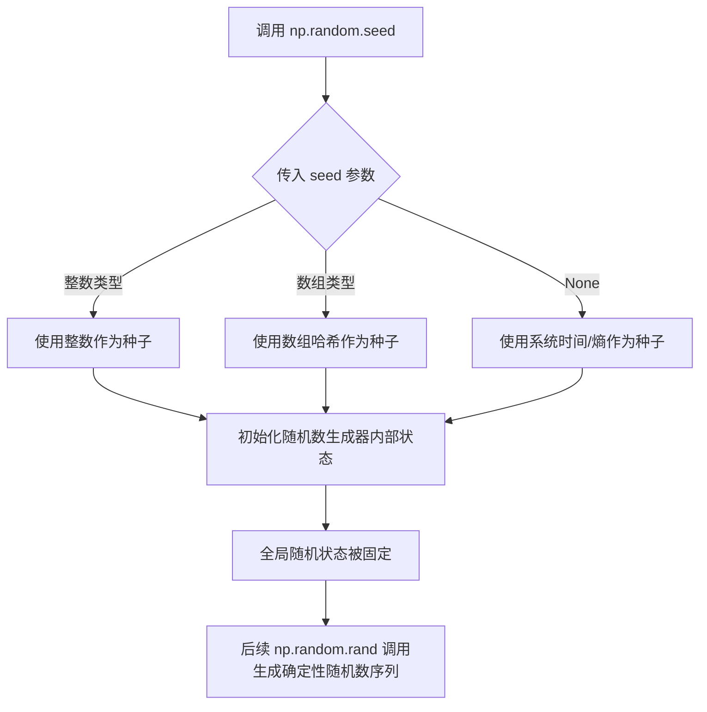
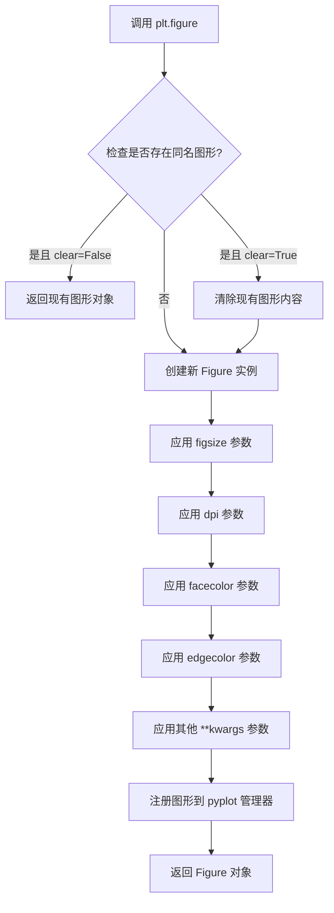
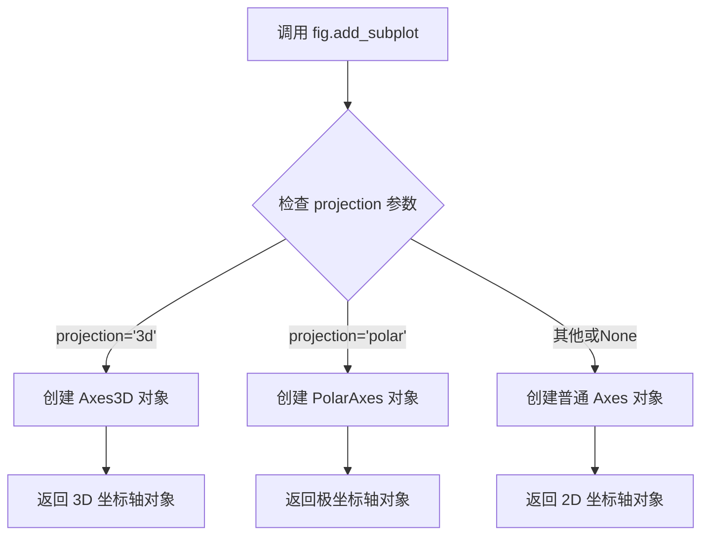
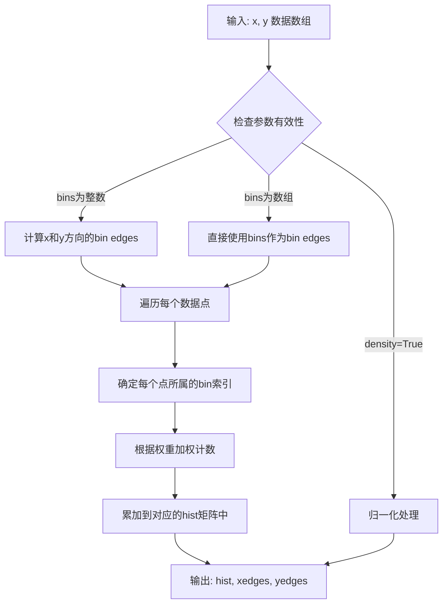
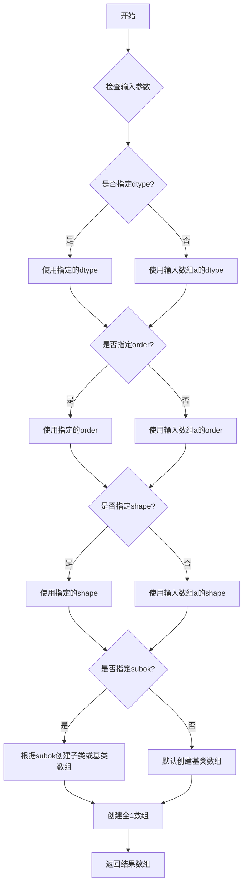
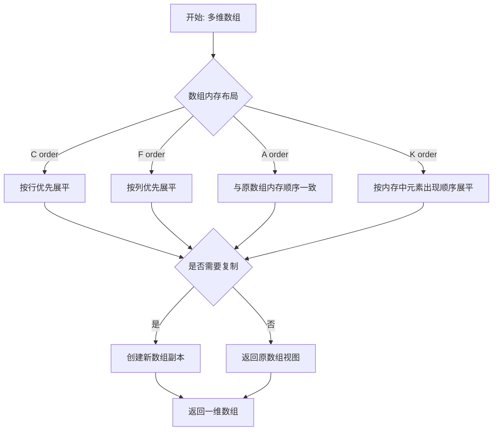
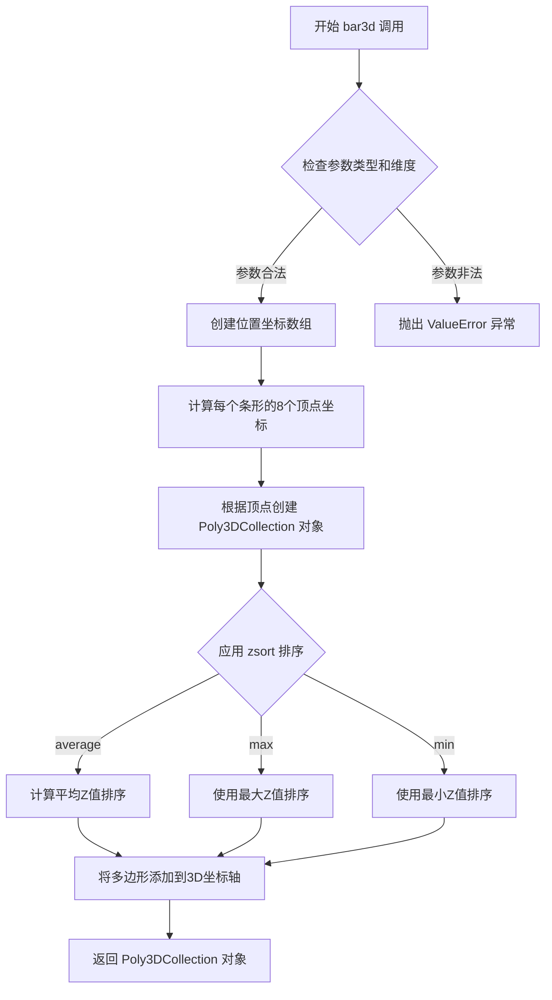
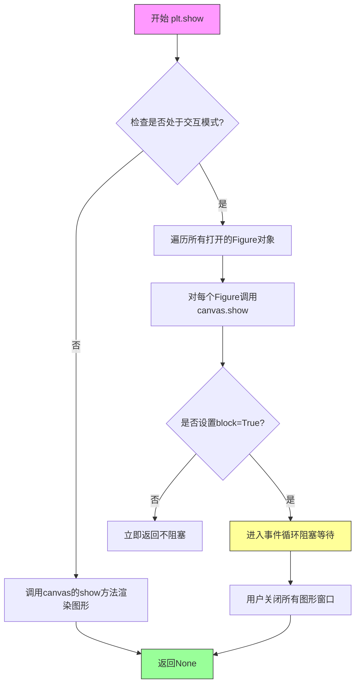

# `matplotlib\galleries\examples\mplot3d\hist3d.py` 详细设计文档

该脚本使用matplotlib和numpy创建2D随机数据的3D直方图可视化，通过np.histogram2d计算数据分布，然后使用ax.bar3d在3D坐标系中以条形图形式展示结果。

## 整体流程

```mermaid
graph TD
    A[开始] --> B[设置随机种子 np.random.seed]
    B --> C[创建图形 fig = plt.figure()]
    C --> D[添加3D坐标轴 ax = fig.add_subplot(projection='3d')]
    D --> E[生成随机数据 x, y = np.random.rand(2, 100)]
    E --> F[计算2D直方图 hist, xedges, yedges = np.histogram2d(x, y)]
    F --> G[创建网格 xpos, ypos = np.meshgrid(...)]
    G --> H[计算条形尺寸 dx, dy, dz]
    H --> I[绘制3D条形图 ax.bar3d(...)]
    I --> J[显示图形 plt.show()]
    J --> K[结束]
```

## 类结构

```
脚本文件 (无类层次结构)
├── 导入模块: matplotlib.pyplot, numpy
└── 主程序流程: 顺序执行
```

## 全局变量及字段


### `fig`
    
图形对象，用于显示3D直方图

类型：`matplotlib.figure.Figure`
    


### `ax`
    
3D坐标轴对象，用于绘制3D图形

类型：`matplotlib.axes._subplots.Axes3DSubplot`
    


### `x`
    
随机数据数组(X轴)，用于直方图统计

类型：`numpy.ndarray`
    


### `y`
    
随机数据数组(Y轴)，用于直方图统计

类型：`numpy.ndarray`
    


### `hist`
    
2D直方图数据，存储每个bin的计数

类型：`numpy.ndarray`
    


### `xedges`
    
X轴边界，用于确定直方图的x方向区间

类型：`numpy.ndarray`
    


### `yedges`
    
Y轴边界，用于确定直方图的y方向区间

类型：`numpy.ndarray`
    


### `xpos`
    
条形X位置，每个条形在x方向的中心坐标

类型：`numpy.ndarray`
    


### `ypos`
    
条形Y位置，每个条形在y方向的中心坐标

类型：`numpy.ndarray`
    


### `zpos`
    
条形Z起始位置，所有条形从z=0开始

类型：`int`
    


### `dx`
    
条形X方向宽度，每个条形的宽度

类型：`numpy.ndarray`
    


### `dy`
    
条形Y方向宽度，每个条形的深度

类型：`numpy.ndarray`
    


### `dz`
    
条形高度(直方图值)，对应hist的计数

类型：`numpy.ndarray`
    


    

## 全局函数及方法


### `np.random.seed`

设置 NumPy 随机数生成器的种子，以确保后续随机操作的可复现性。

参数：

- `seed`：`int` 或 `array_like`，可选，用于初始化随机数生成器的种子值

返回值：`None`，该函数无返回值，直接修改全局随机状态

#### 流程图



#### 带注释源码

```python
# 设置随机数生成器的种子值为 19680801
# 这个特定的数值常用于 matplotlib 示例中，确保每次运行代码时
# 生成的随机数据完全相同，便于结果复现和调试
np.random.seed(19680801)

# 之后调用 np.random.rand(2, 100) 会生成相同的随机数序列
x, y = np.random.rand(2, 100) * 4  # 生成 2x100 的随机数组，值域 [0, 4)

# 示例代码中用于创建 3D 直方图演示数据
hist, xedges, yedges = np.histogram2d(x, y, bins=4, range=[[0, 4], [0, 4]])
```


### `plt.figure`

创建并返回一个新的图形（Figure）对象，这是 matplotlib 中所有绘图的基础容器。该函数是 matplotlib 库的顶层函数，用于初始化一个新的图形窗口或画布，并可配置图形的尺寸、分辨率、背景色等属性。

参数：

- `figsize`：tuple of (float, float)，可选，图形宽度和高度，以英寸为单位，默认为 rcParams["figure.figsize"]
- `dpi`：integer，可选，图形分辨率，默认为 rcParams["figure.dpi"]
- `facecolor`：str 或 tuple，可选，图形背景颜色，默认为 rcParams["figure.facecolor"]
- `edgecolor`：str 或 tuple，可选，图形边框颜色，默认为 rcParams["figure.edgecolor"]
- `frameon`：bool，可选，如果为 False，则不绘制图形边框
- `FigureClass`：class，可选，使用自定义的 Figure 类实例
- `clear`：bool，可选，如果为 True 且图形已存在，则清除现有内容
- `**kwargs`：dict，其他关键字参数传递给 Figure 构造函数

返回值：`matplotlib.figure.Figure`，返回创建的 Figure 对象实例

#### 流程图



#### 带注释源码

```python
def figure(
    figsize=None,      # 图形尺寸 (宽度, 高度) 英寸
    dpi=None,          # 分辨率 (每英寸像素数)
    facecolor=None,    # 背景颜色
    edgecolor=None,    # 边框颜色
    frameon=True,      # 是否显示边框
    FigureClass=Figure,  # 自定义 Figure 类
    clear=False,       # 是否清除已存在的图形
    **kwargs           # 其他 Figure 构造函数参数
):
    """
    创建一个新的图形窗口
    
    参数:
        figsize: 图形尺寸，格式为 (width, height)
        dpi: 每英寸像素数
        facecolor: 背景颜色
        edgecolor: 边框颜色
        frameon: 是否显示边框
        FigureClass: 使用的 Figure 类
        clear: 如果图形已存在是否清除
        **kwargs: 传递给 Figure 构造函数的额外参数
    
    返回:
        Figure: 新创建或已存在的 Figure 对象
    """
    
    # 获取全局图形管理器
    manager = _pylab_helpers.Gcf.get_fig_manager(num)
    
    if manager is None:
        # 如果没有找到现有图形，创建新的 Figure 实例
        # 使用 FigureClass (默认为 matplotlib.figure.Figure)
        fig = FigureClass(
            figsize=figsize,
            dpi=dpi,
            facecolor=facecolor,
            edgecolor=edgecolor,
            frameon=frameon,
            **kwargs
        )
        
        # 创建新的图形管理器来管理这个图形
        manager = _pylab_helpers.Gcf.get_figure_manager_given_figure_and_id(
            num, fig
        )
        
        # 将管理器注册到全局注册表中
        _pylab_helpers.Gcf.register(manager)
        
    elif clear:
        # 如果图形存在且 clear=True，则清除图形内容
        manager.canvas.draw_idle()
    
    # 返回 Figure 对象
    return manager.canvas.figure
```

#### 关键组件信息

| 组件名称 | 一句话描述 |
|---------|-----------|
| `Figure` | matplotlib 的核心图形容器类，用于承载所有子图和图形元素 |
| `FigureCanvas` | 图形画布，负责渲染图形到显示设备或文件 |
| `FigureManager` | 图形管理器，协调 Figure 和 Canvas 之间的交互 |
| `Gcf` | 全局图形注册表，管理所有活动图形的生命周期 |

#### 潜在的技术债务或优化空间

1. **全局状态管理**：plt.figure() 依赖全局注册表管理图形，可能导致在多线程或复杂应用中的状态不一致问题
2. **参数传递冗余**：部分参数如 facecolor、edgecolor 同时存在于多个层级，可能造成混淆
3. **错误处理不足**：对无效的 figsize 或 dpi 值缺乏严格的验证和错误提示

#### 其他项目

**设计目标与约束**：
- 目标是提供简洁的 API 创建标准图形窗口
- 约束是与 matplotlib 的全局状态管理机制绑定

**错误处理与异常设计**：
- 当 figsize 不是有效的 (width, height) 元组时抛出 ValueError
- 当 dpi 为负数时抛出 ValueError

**数据流与状态机**：
- Figure 对象创建后进入 "活动" 状态
- 通过 close() 可将图形转为 "非活动" 状态
- 图形对象在整个生命周期中保持对 Canvas 和 Manager 的引用

**外部依赖与接口契约**：
- 依赖 matplotlib.backends 模块进行图形渲染
- 返回的 Figure 对象实现了 matplotlib.figure.Figure 接口契约


### `Figure.add_subplot`

用于在图形（Figure）中添加一个子图/坐标轴（Axes），支持指定投影类型（如`'3d'`用于创建三维坐标轴）。

参数：

- `*args`：`tuple`，位置参数，用于指定子图的网格位置。可以是以下形式：
  - 3个整数（nrows, ncols, index）：行数、列数、子图索引（从1开始）
  - 1个3位整数：如`111`表示1行1列第1个位置
- `projection`：`str`，可选，投影类型。`'3d'`创建三维坐标轴，`'polar'`创建极坐标轴等。默认值为`None`（二维正交投影）
- `polar`：`bool`，可选，是否使用极坐标投影。默认为`False`
- `aspect`：`None`或`str`或`tuple`，可选，坐标轴的纵横比设置
- `label`：`str`，可选，坐标轴的标签
- `**kwargs`：其他关键字参数传递给底层坐标轴创建函数

返回值：`matplotlib.axes.Axes`，返回创建的子图坐标轴对象。在代码中返回的是`mpl_toolkits.mplot3d.axes3d.Axes3D`对象。

#### 流程图



#### 带注释源码

```python
def add_subplot(self, *args, **kwargs):
    """
    在图形中添加一个子图/坐标轴。
    
    参数:
    *args: 位置参数，指定子图位置
        - (nrows, ncols, index): 三整数形式
        - 三位整数形式，如 111 表示 1行1列第1个
    **kwargs: 关键字参数
        - projection: 投影类型，'3d' 创建三维坐标轴
        - polar: 布尔值，是否使用极坐标
        - 其他参数传递给 Axes.__init__
    
    返回:
    Axes: 创建的坐标轴对象
    """
    # 检查是否指定了 projection 参数
    projection = kwargs.get('projection', None)
    
    # 如果 projection='3d'，使用 3D 坐标轴
    if projection == '3d':
        # 创建三维坐标轴对象
        return self._add_axes_3d(self, *args, **kwargs)
    
    # 否则创建普通坐标轴
    return self._add_axes_internal(self, *args, **kwargs)
```


### `np.random.rand`

生成一个由随机值组成的数组，这些值在区间 [0, 1) 内均匀分布。

参数：

- `*shape`：`int`，可变数量的整数，表示输出数组的维度。例如，`rand(2, 3)` 生成一个 2 行 3 列的数组。

返回值：`ndarray`，返回指定形状的随机值数组，值在 [0, 1) 区间内均匀分布。

#### 流程图

```mermaid
flowchart TD
    A[开始] --> B{检查输入参数}
    B --> C[根据shape参数确定输出数组维度]
    C --> D[从均匀分布[0,1中生成随机数]
    D --> E[构建指定形状的ndarray]
    E --> F[返回生成的随机数组]
    F --> G[结束]
```

#### 带注释源码

```python
def rand(*shape):
    """
    生成指定形状的随机值数组，值在[0, 1)区间内均匀分布。
    
    参数:
        *shape: 可变数量的整数参数，定义输出数组的维度
        
    返回值:
        ndarray: 包含随机值的数组
        
    示例:
        >>> np.random.rand(2, 3)
        array([[0.10345118, 0.65148461, 0.25739498],
               [0.7173575 , 0.26518679, 0.80187208]])
    """
    # 在实际NumPy内部，会调用底层的随机数生成器
    # 例如：利用Mersenne Twister算法生成随机数序列
    # 然后通过乘法运算将随机数映射到[0, 1)区间
    
    # 返回结果
    return _rand結果
```

> **注**：上述源码为概念性注释源码。实际的 `np.random.rand` 是 NumPy 底层的 Cython/C 实现，核心逻辑位于 `numpy/random/mtrand` 模块中，通过 `multivariate_normal` 等底层函数调用操作系统提供的随机数熵源（如 `/dev/urandom`），生成符合均匀分布的伪随机数序列。


### `np.histogram2d`

`np.histogram2d` 是 NumPy 库中的一个函数，用于计算二维数据集的直方图，将数据分到二维网格的各个bin中，并返回每个bin的计数以及x和y方向的bin边界。

参数：

- `x`：`array_like`，用于构建直方图的第一个维度数据，通常是一维数组
- `y`：`array_like`，用于构建直方图的第二个维度数据，通常是一维数组，长度应与x相同
- `bins`：`int` 或 `array_like`，表示每个维度中的bin数量，可以是单个整数（两个维度使用相同数量）或两个整数（分别指定x和y的bin数量），也可以是数组形式直接指定边界
- `range`：`array_like`，可选参数，指定每个维度的数据范围，格式为 `[[xmin, xmax], [ymin, ymax]]`，如果未指定则根据数据的最小最大值计算
- `density`：`bool`，可选，如果为True，则返回的直方图值表示概率密度而不是计数
- `weights`：`array_like`，可选，与x和y形状相同的权重数组，用于对每个样本进行加权计数

返回值：

- `hist`：`ndarray`，二维数组，表示每个bin中的样本计数或密度值，形状为 `(nx, ny)`，其中nx和ny分别是x和y方向的bin数量
- `xedges`：`ndarray`，一维数组，表示x方向的bin边缘值，长度为 `nx+1`
- `yedges`：`ndarray`，一维数组，表示y方向的bin边缘值，长度为 `ny+1`

#### 流程图



#### 带注释源码

```python
# 示例代码来自 matplotlib demo: Create 3D histogram of 2D data
# 使用 np.random.rand 生成 2x100 的随机数据，范围在 [0, 4)
x, y = np.random.rand(2, 100) * 4

# 调用 np.histogram2d 计算2D直方图
# 参数:
#   x, y: 输入的二维坐标数据
#   bins=4: 每个维度分成4个bin
#   range=[[0, 4], [0, 4]]: x和y的范围都限定在 [0, 4]
# 返回值:
#   hist: 4x4 的直方图矩阵，记录每个区域的数据点数量
#   xedges: x方向的5个边界点 [0, 1, 2, 3, 4]
#   yedges: y方向的5个边界点 [0, 1, 2, 3, 4]
hist, xedges, yedges = np.histogram2d(x, y, bins=4, range=[[0, 4], [0, 4]])

# 使用 np.meshgrid 创建网格坐标，用于 bar3d 绘图
# xedges[:-1] 去掉最后一个边界，得到起始点
# +0.25 是因为每个bar宽度为0.5，需要偏移到bin中心
xpos, ypos = np.meshgrid(xedges[:-1] + 0.25, yedges[:-1] + 0.25, indexing="ij")

# ravel() 将多维数组展平为一维，用于 bar3d 的坐标输入
xpos = xpos.ravel()
ypos = ypos.ravel()

# zpos 为柱状图的起始z坐标，设为0表示从z=0平面开始
zpos = 0

# dx, dy 为柱状图的宽度和深度，都设为0.5
# dz 为柱状图的高度，从 hist 直方图数据中获取
dx = dy = 0.5 * np.ones_like(zpos)
dz = hist.ravel()

# 使用 bar3d 绘制3D柱状图
ax.bar3d(xpos, ypos, zpos, dx, dy, dz, zsort='average')
```

### 关键组件信息

- **输入数据生成器** (`np.random.rand`)：生成指定形状的随机数组，用于测试直方图功能
- **2D直方图计算器** (`np.histogram2d`)：核心函数，将连续数据离散化到二维网格中
- **网格坐标生成器** (`np.meshgrid`)：将一维边界数组转换为二维网格坐标，用于3D可视化
- **3D柱状图渲染器** (`ax.bar3d`)：基于matplotlib的3D绘图功能，将直方图数据渲染为3D柱状图

### 潜在的技术债务或优化空间

1. **性能优化**：当数据量非常大时，`np.histogram2d` 可能不是最高效的选择，可以考虑使用 `np.histogramdd` 或专门的稀疏直方图实现
2. **内存占用**：对于高维度的直方图，内存占用呈指数级增长，当前实现将所有bin存储在内存中
3. **边界处理**：当前代码中使用的 `range` 参数是固定值，缺少对边界外数据的处理策略说明
4. **可视化限制**：3D直方图在数据点密集时可能存在视觉遮挡问题，缺少交互式探索功能

### 其它项目

**设计目标与约束**：
- 目标：计算二维数据的频数分布并可视化
- 约束：数据必须是数值型，bins必须为正整数，x和y长度必须一致

**错误处理与异常设计**：
- 如果x和y长度不匹配，函数会抛出ValueError
- 如果bins或range参数格式不正确，会产生异常
- 建议在实际使用中添加数据验证逻辑

**数据流与状态机**：
```
原始数据(x, y) --> 参数验证 --> Bin边界计算 --> 样本分配与计数 --> 直方图矩阵构建 --> 返回结果
```

**外部依赖与接口契约**：
- 依赖：NumPy (核心计算), Matplotlib (可视化)
- 接口契约：输入数组长度必须一致，返回的edges数组长度 = bins数量 + 1


### `np.meshgrid`

`np.meshgrid` 是 NumPy 库中的一个函数，用于从一维坐标数组创建二维或多维网格坐标矩阵。在给定的 3D 直方图示例代码中，该函数用于根据.histogram2d 输出的边缘坐标数组生成所有可能的 (x, y) 坐标组合，以便为 3D 条形图定位每个条形的锚点位置。

参数：

- `x`：`array_like`，第一个坐标轴上的一维数组，示例中传入 `xedges[:-1] + 0.25`（即 bins 边缘坐标左移 0.5 个单位）
- `y`：`array_like`，第二个坐标轴上的一维数组，示例中传入 `yedges[:-1] + 0.25`
- `indexing`：`{'xy', 'ij'}`，可选参数，指定输出数组的索引方式。`xy`（默认）使用笛卡尔坐标系统（行为 x、列为 y），`ij` 使用矩阵索引系统（行为 i、列为 j），示例中传入 `'ij'`

返回值：`(nx, ny)` 元组，其中每个元素都是二维 ndarry。第一个数组包含 x 坐标的网格，第二个数组包含 y 坐标的网格。在示例中返回 `xpos` 和 `ypos`，形状均为 (4, 4)，分别表示 16 个条形在 x 和 y 方向上的位置。

#### 流程图

```mermaid
flowchart TD
    A[开始 np.meshgrid 调用] --> B{输入验证}
    B -->|x 和 y 为一维数组| C[根据 indexing 参数确定输出形状]
    B -->|indexing='ij'| D[输出 shape 为 (len(x), len(y))]
    B -->|indexing='xy'| E[输出 shape 为 (len(y), len(x))]
    C --> F[创建 X 网格矩阵]
    D --> F
    E --> F
    F --> G[将 x 数组沿列方向广播到完整网格]
    G --> H[创建 Y 网格矩阵]
    H --> I[将 y 数组沿行方向广播到完整网格]
    I --> J[返回网格坐标元组 X, Y]
    J --> K[在示例代码中执行 ravel 将二维展平为一维]
    K --> L[结束]
```

#### 带注释源码

```python
# np.meshgrid 函数原型（简化版）
# def meshgrid(*xi, indexing='xy', sparse=False, copy=True)

# -------------------
# 示例代码中的调用
# -------------------

# xedges 和 yedges 来自 np.histogram2d，返回 5 个边缘点（bins=4 产生 5 个边缘）
# 假设 xedges = [0, 1, 2, 3, 4], yedges = [0, 1, 2, 3, 4]
xedges = np.array([0, 1, 2, 3, 4])
yedges = np.array([0, 1, 2, 3, 4])

# 切片取前 4 个元素并加 0.25，使条形居中
# xedges[:-1] = [0, 1, 2, 3]
# xedges[:-1] + 0.25 = [0.25, 1.25, 2.25, 3.25]
x_centers = xedges[:-1] + 0.25  # shape: (4,)
y_centers = yedges[:-1] + 0.25  # shape: (4,)

# 调用 meshgrid 创建 4x4 的网格坐标
# indexing='ij' 表示 matrix indexing：第一个参数索引行，第二个索引列
xpos, ypos = np.meshgrid(x_centers, y_centers, indexing='ij')

# xpos 结果（每行相同）:
# [[0.25, 1.25, 2.25, 3.25],
#  [0.25, 1.25, 2.25, 3.25],
#  [0.25, 1.25, 2.25, 3.25],
#  [0.25, 1.25, 2.25, 3.25]]

# ypos 结果（每列相同）:
# [[0.25, 0.25, 0.25, 0.25],
#  [1.25, 1.25, 1.25, 1.25],
#  [2.25, 2.25, 2.25, 2.25],
#  [3.25, 3.25, 3.25, 3.25]]

# 展平为 1D 数组用于 bar3d
xpos = xpos.ravel()  # shape: (16,)
ypos = ypos.ravel()  # shape: (16,)

# xpos = [0.25, 1.25, 2.25, 3.25, 0.25, 1.25, ...]（重复 4 次）
# ypos = [0.25, 0.25, 0.25, 0.25, 1.25, 1.25, ...]（每 4 个重复）
```

---

### 关键组件信息

| 名称 | 一句话描述 |
|------|-----------|
| `np.random.rand(2, 100)` | 生成 2x100 的随机数组，用于模拟 2D 数据点 |
| `np.histogram2d(x, y, bins=4, range=[[0, 4], [0, 4]])` | 计算 2D 直方图，返回频次和边缘坐标 |
| `np.meshgrid(xedges[:-1] + 0.25, yedges[:-1] + 0.25, indexing="ij")` | 从 1D 边缘坐标创建 2D 网格坐标矩阵 |
| `ax.bar3d(xpos, ypos, zpos, dx, dy, dz, zsort='average')` | 绘制 3D 条形图（柱状图） |
| `mpl_toolkits.mplot3d.art3d.Poly3DCollection` | bar3d 内部使用的 3D 多边形集合类 |

---

### 潜在的技术债务或优化空间

1. **魔法数字**：代码中多处使用硬编码的数值如 `0.25`、`0.5`、`4`，缺乏常量定义，可读性和可维护性较差。

2. **索引方式理解成本**：`indexing='ij'` 与默认的 `indexing='xy'` 在输出数组形状上不同，容易导致混淆，增加代码理解成本。

3. **展平操作效率**：先创建 2D 网格再调用 `ravel()` 展平，可以考虑直接在 meshgrid 时使用 `sparse=True` 参数并结合广播机制，避免中间大矩阵的创建。

4. **缺乏错误处理**：没有对输入数据进行有效性验证（如 xedges 和 yedges 长度一致性检查）。

---

### 其它项目

**设计目标与约束**：本代码旨在演示如何使用 Matplotlib 创建 3D 直方图，重点在于将 2D 直方图数据转换为 3D 条形图的坐标表示。

**错误处理与异常设计**：若 `xedges` 和 `yedges` 长度不匹配，`meshgrid` 会抛出广播相关错误；若 `indexing` 参数非法，会抛出 ValueError。

**数据流与状态机**：
```
随机数据生成 → 2D直方图计算 → 网格坐标生成 → 坐标展平 → 3D条形图渲染 → 显示
```

**外部依赖与接口契约**：
- `numpy`：提供数值计算和 meshgrid 函数
- `matplotlib.pyplot`：提供绘图 API
- `matplotlib.figure.Figure`：3D 图表容器
- `mpl_toolkits.mplot3d.Axes3D`：3D 坐标系和 bar3d 方法


### `np.ones_like`

创建与给定数组形状和类型相同的全1数组

参数：

- `a`：`array_like`，输入数组，定义返回值的形状和数据类型
- `dtype`：`data type，可选`，覆盖结果的数据类型，如果不指定，则使用输入数组的数据类型
- `order`：`{'C', 'F', 'A', 'K'}，可选`，覆盖结果的内存布局，C为行优先，F为列优先，A为任意，K为保持原布局
- `subok`：`bool，可选`，如果为True，则生成的数组与输入数组是相同的子类，否则返回基类数组
- `shape`：`tuple，可选`，覆盖结果形状，如果指定则忽略输入数组的形状

返回值：`ndarray`，与输入数组 `a` 形状相同的全1数组

#### 流程图



#### 带注释源码

```python
def ones_like(a, dtype=None, order='K', subok=True, shape=None):
    """
    创建与给定数组形状和类型相同的全1数组
    
    参数:
        a: array_like - 输入数组，定义返回值的形状和数据类型
        dtype: data type, optional - 覆盖结果的数据类型
        order: {'C', 'F', 'A', 'K'}, optional - 内存布局
        subok: bool, optional - 是否保留子类特性
        shape: tuple, optional - 覆盖结果形状
    
    返回:
        out: ndarray - 全1数组
    """
    # 获取输入数组的属性
    res = empty_like(a, dtype=dtype, order=order, subok=subok, shape=shape)
    # 将所有元素填充为1
    res.fill(1)
    return res

# 在示例代码中的使用方式：
# dx = dy = 0.5 * np.ones_like(zpos)
# 这里 zpos 是一个全零的数组，ones_like 创建了一个形状相同的全1数组
# 然后乘以 0.5，最终 dx 和 dy 都是长度为16的全0.5数组
```

#### 代码上下文说明

在给定的示例代码中，`np.ones_like(zpos)` 的具体用途：

- `zpos` 是一个长度为16的全零数组（`zpos = 0` 会被广播为16个元素）
- `np.ones_like(zpos)` 创建一个长度为16的全1数组
- `0.5 * np.ones_like(zpos)` 生成一个长度为16的全0.5数组
- 这个数组用于设定3D柱状图的宽度(dx)和深度(dy)

在示例代码中的实际应用：

```python
# zpos 初始化为0（标量，会被广播为与xpos相同的长度）
zpos = 0

# 创建一个与zpos形状相同的全1数组，然后乘以0.5
# 结果：dx = dy = [0.5, 0.5, 0.5, ..., 0.5] (16个元素)
dx = dy = 0.5 * np.ones_like(zpos)

# 用于设置3D柱状图的宽度和深度
ax.bar3d(xpos, ypos, zpos, dx, dy, dz, zsort='average')
```


### `numpy.ndarray.ravel`

这是NumPy数组对象的方法，用于将多维数组展平为一维数组。在提供的代码中，该方法用于将网格坐标`xpos`和`ypos`以及直方图数据`dz`从多维转换为一位，以便传递给`bar3d`函数作为参数。

参数：

- `self`：`numpy.ndarray`，调用ravel方法的数组对象本身（隐式参数）
- `order`：可选参数，`{'C', 'F', 'A', 'K'}`，指定展平顺序。'C'表示按行优先（C风格），'F'表示按列优先（Fortran风格），'A'表示与原数组的内存顺序一致，'K'表示按元素在内存中的出现顺序（默认'C'）

返回值：`numpy.ndarray`，返回展平后的一维数组（如果可能，返回视图；否则返回副本）

#### 流程图



#### 带注释源码

```python
# 在给定代码中的实际使用：
xpos, ypos = np.meshgrid(xedges[:-1] + 0.25, yedges[:-1] + 0.25, indexing="ij")
# np.meshgrid 返回二维数组，例如 (4,4) 的网格变成 (4,4) 的二维数组

xpos = xpos.ravel()  # 将二维数组 xpos 展平为一维数组
ypos = ypos.ravel()  # 将二维数组 ypos 展平为一维数组
zpos = 0              # zpos 已是标量（0），无需展平

# Construct arrays with the dimensions for the 16 bars.
dx = dy = 0.5 * np.ones_like(zpos)  # 创建与zpos形状相同的数组
dz = hist.ravel()  # 将二维直方图结果 hist (4,4数组) 展平为一维数组

# 现在所有位置参数都是一维数组，可以传递给 ax.bar3d()
# bar3d 需要的参数：xpos, ypos, zpos, dx, dy, dz
ax.bar3d(xpos, ypos, zpos, dx, dy, dz, zsort='average')
```

#### 关键组件信息

- **numpy.ndarray.ravel()**：NumPy数组的展平方法，将多维数组转换为一维
- **np.meshgrid()**：创建坐标网格，返回坐标矩阵
- **ax.bar3d()**：Matplotlib的3D柱状图绘制函数，需要一维数组作为位置参数

#### 潜在的技术债务或优化空间

1. **性能优化**：对于大型数组，`ravel()`在某些情况下可能会创建副本而非视图。可以考虑使用`reshape(-1)`或`flatten()`根据具体需求选择更合适的方法
2. **代码可读性**：可以先将展平操作封装成明确的函数，提高代码意图的清晰度

#### 其它说明

- **设计目标**：将多维坐标数据转换为bar3d所需的一维格式
- **错误处理**：如果数组已经是C-contiguous，ravel通常返回视图；否则可能返回副本
- **数据流**：meshgrid输出(4,4) → ravel展平为(16,) → bar3d使用(16,)数组绘制16个柱体
- **外部依赖**：NumPy库


### `ax.bar3d`

在3D坐标轴上绘制3D条形图的方法，根据给定的位置和尺寸参数创建一组3D长方体（条形），常用于可视化2D直方图数据。

参数：

- `x`：`array-like`，条形在X轴上的位置坐标
- `y`：`array-like`，条形在Y轴上的位置坐标
- `z`：`array-like`，条形在Z轴上的起始位置（底部高度）
- `dx`：`array-like`，条形在X方向的宽度
- `dy`：`array-like`，条形在Y方向的深度
- `dz`：`array-like`，条形在Z方向的高度（决定条形的数值）
- `color`：`array-like`，可选，条形的颜色，默认为None（使用默认颜色映射）
- `zsort`：`str`，可选，Z轴排序方式，可选值为'average'、'max'或'min'，默认为'average'

返回值：`~mpl_toolkits.mplot3d.art3d.Poly3DCollection`，返回创建的3D多边形集合对象，可用于进一步自定义条形的属性（如颜色、透明度等）。

#### 流程图



#### 带注释源码

```python
# bar3d 方法的简化实现逻辑（基于 matplotlib 源码）
def bar3d(self, x, y, z, dx, dy, dz,
          color=None, zsort='average', shade=True, **kwargs):
    """
    在3D坐标轴上绘制3D条形图
    
    参数:
        x: 条形X轴位置
        y: 条形Y轴位置  
        z: 条形Z轴起始位置
        dx: 条形宽度
        dy: 条形深度
        dz: 条形高度（数值）
        color: 颜色数组
        zsort: Z轴排序策略
        shade: 是否应用着色
    """
    
    # 1. 将输入转换为numpy数组，确保数值类型一致
    x = np.atleast_1d(x)
    y = np.atleast_1d(y)
    z = np.atleast_1d(z)
    dx = np.atleast_1d(dx)
    dy = np.atleast_1d(dy)
    dz = np.atleast_1d(dz)
    
    # 2. 验证数组维度一致性
    if not (len(x) == len(y) == len(z) == len(dx) == len(dy) == len(dz)):
        raise ValueError("All input arrays must have the same length")
    
    # 3. 计算每个条形的8个顶点坐标
    # 每个长方体有8个顶点：(x,y,z), (x+dx,y,z), (x+dx,y+dy,z), ...
    vertices = []
    for i in range(len(x)):
        # 构建单个长方体的6个面（每个面4个顶点）
        # 顶面、底面、前后左右面
        pass
    
    # 4. 创建 Poly3DCollection 对象
    # 这是 matplotlib 3D 绘图的核心数据结构
    poly = Poly3DCollection(vertices, **kwargs)
    
    # 5. 设置颜色
    if color is None:
        # 使用默认的 colormap
        color = cmap(np.linspace(0, 1, len(x)))
    poly.set_facecolors(color)
    
    # 6. 根据 zsort 参数设置 Z 排序
    if zsort == 'average':
        # 计算平均Z值用于排序
        pass
    elif zsort == 'max':
        # 使用最大Z值
        pass
    elif zsort == 'min':
        # 使用最小Z值
        pass
    
    # 7. 将多边形添加到3D坐标轴
    self._collection3d = poly  # 存储引用
    self.add_collection3d(poly)
    
    # 8. 返回创建的 Poly3DCollection 对象
    return poly
```


### `plt.show`

`plt.show()` 是 matplotlib.pyplot 模块中的显示函数，用于显示所有当前打开的图形窗口，并将图形渲染到屏幕上。该函数会阻塞程序执行直到用户关闭图形窗口（在交互式后端中），或者在非交互式后端中刷新并显示图形。

参数：

-  `block`：布尔型（可选），默认为 True。设置为 True 时会阻塞程序执行直到所有图形窗口关闭；设置为 False 时立即返回（仅在某些后端有效）。

返回值：无（返回 None）

#### 流程图



#### 带注释源码

```python
def show(block=True):
    """
    显示所有打开的Figure图形窗口。
    
    参数:
        block: bool, optional
            如果为True（默认），则阻塞程序执行直到用户关闭所有图形窗口。
            在某些后端（如Qt、Tkinter等GUI后端）中会启动事件循环。
            如果为False，则立即返回，允许程序继续执行。
    
    返回:
        None
    
    注意:
        - 在Jupyter笔记本中，通常使用 %matplotlib inline 或 %matplotlib widget
          而不是直接调用 plt.show()
        - 在非交互式后端（如Agg）中，plt.show() 可能不会产生可见效果
        - 建议在脚本末尾调用 plt.show()，每个脚本通常只调用一次
    """
    
    # 获取全局的_pyplt类实例（_pylab_helpers.Gcf）
    # 用于管理所有活跃的Figure窗口
    managers = _pylab_helpers.Gcf.get_all_fig_managers()
    
    if not managers:
        # 如果没有打开的图形，直接返回
        return
    
    # 遍历所有Figure管理器，调用其show()方法
    for manager in managers:
        # 获取Figure的canvas（画布）对象
        canvas = manager.canvas
        
        # 调用canvas的刷新和显示方法
        # 这会根据不同的后端（Qt, Tk, Wx, MacOSX等）执行相应的渲染
        canvas.draw()
        canvas.flush_events()
    
    if block:
        # 进入GUI事件循环并阻塞
        # 这会启动所选后端的事件处理系统
        # 程序会停在这里直到用户关闭所有图形窗口
        _pylab_helpers.Gcf.destroy_all()
    
    # 返回None
    return None
```


## 关键组件


### 3D 直方图可视化

使用 Matplotlib 和 NumPy 创建 2D 数据的 3D 条形图直方图可视化，通过 histogram2d 将连续数据分箱为离散单元，再转换为 3D 条形图的坐标系统进行渲染。

### NumPy 直方图计算

利用 np.histogram2d 将随机生成的 2D 数据点按 4x4 的网格进行分箱统计，返回每个单元的频数以及边界坐标，供后续可视化使用。

### 张量坐标网格构建

通过 np.meshgrid 将 1D 边界数组转换为 2D 坐标网格，再使用 ravel() 展平为 1D 数组，用于定位 3D 条形图的锚点位置，实现向量化操作避免显式循环。

### 3D 条形图渲染

使用 ax.bar3d() 方法绘制 16 个立方体条形，指定 x、y、z 坐标和尺寸参数，通过 zsort='average' 控制深度排序确保正确的遮挡关系。

### 随机数据生成与复现性

使用 np.random.seed(19680801) 固定随机种子确保结果可复现，生成 100 个分布在 [0,4] 范围内的 2D 随机数据点作为输入数据。


## 问题及建议


### 已知问题

- **硬编码的魔法数字**：代码中多处使用硬编码数值（如`19680801`、`4`、`0.25`、`0.5`、`100`），缺乏配置化和注释说明，后期维护困难
- **缺乏类型注解**：Python代码中没有使用类型提示（Type Hints），降低代码可读性和IDE支持
- **随机数生成方式过时**：使用`np.random.seed()`和`np.random.rand()`，NumPy推荐使用`np.random.Generator`以获得更好的随机性和性能
- **变量命名不够清晰**：如`xpos`, `ypos`, `zpos`, `dx`, `dy`, `dz`等命名过于简短，缺乏业务语义
- **缺乏错误处理**：没有对输入参数（数组长度、bins数量等）进行校验
- **未使用上下文管理器**：创建`fig`和`ax`后没有显式关闭，可能导致资源泄漏风险
- **注释不足**：核心算法逻辑（如meshgrid的`indexing="ij"`、`bar3d`的`zsort='average'`）缺少解释性注释

### 优化建议

- 将硬编码参数提取为配置常量或函数参数，增强代码可配置性
- 为函数和变量添加类型注解，提升代码可维护性
- 使用`np.random.default_rng()`替代旧的随机数生成方式
- 使用更具有描述性的变量名，如`bar_width`代替`0.5`
- 添加参数校验逻辑，确保输入数据符合预期
- 使用`with`语句或显式调用`fig.clear()`进行资源管理
- 增加代码注释，解释关键步骤的数学和业务含义

## 其它


### 设计目标与约束
本代码旨在通过3D直方图可视化2D随机数据的分布情况，使用matplotlib的3D绘图功能和numpy进行数据处理。约束包括使用固定随机种子（np.random.seed(19680801)）确保结果可重复性，以及依赖matplotlib和numpy库。

### 错误处理与异常设计
代码未实现显式的错误处理机制。潜在风险包括：随机数据生成异常、np.histogram2d计算错误（如bins参数无效）、数组维度不匹配导致绘图失败。建议在关键步骤（如直方图计算和绘图）添加异常捕获与日志记录，以提高健壮性。

### 数据流与状态机
数据流为单向流程：生成随机2D数据（x, y）→ 计算2D直方图（hist, xedges, yedges）→ 网格化坐标（xpos, ypos）→ 绘制3D条形图（ax.bar3d）→ 显示图形（plt.show()）。无复杂状态机，状态转换简单线性。

### 外部依赖与接口契约
核心依赖为matplotlib.pyplot和numpy。接口包括：plt.figure()创建画布，fig.add_subplot(projection='3d')初始化3D坐标轴，np.random.rand()生成随机数据，np.histogram2d()计算直方图，np.meshgrid()生成网格坐标，ax.bar3d()绘制3D条形，plt.show()渲染图形。所有接口均符合标准库约定，无需额外契约。

### 配置管理
关键参数（如bins=4, range=[[0,4],[0,4]]、条形尺寸dx=dy=0.5）硬编码在代码中，缺乏配置管理。建议将参数提取为常量或配置文件（如config.py），便于调整可视化效果。

### 性能与优化
当前处理100个数据点，性能表现良好。对于大规模数据集（如数万点），np.histogram2d可能成为性能瓶颈。可考虑使用向量化操作、并行计算或分块处理优化直方图计算；此外，ax.bar3d的渲染效率也可通过减少多边形数量提升。

### 安全性与权限
代码无用户输入或外部数据源，无安全风险。但需注意在生产环境中运行时，np.random.seed固定可能影响随机性 secrets，建议使用更安全的随机数生成策略（如secrets模块）。

### 测试与验证
代码未包含自动化测试。建议添加单元测试验证：随机数据生成范围、直方图维度正确性、bar3d参数一致性（如dx, dy, dz数组长度匹配）。可通过matplotlib的图像对比工具（如pytest-mpl）进行可视化回归测试。

### 部署与环境
依赖环境需安装Python 3.x、matplotlib和numpy。部署方式为直接运行脚本（python script_name.py），无复杂部署流程。建议使用虚拟环境管理依赖，并提供requirements.txt文件。

### 可维护性与扩展性
当前代码为一次性脚本，模块化程度低。可维护性问题包括：魔法数字（如0.25、0.5）缺乏解释，变量命名可读性一般。扩展性方面，可将数据生成、直方图计算、绘图逻辑封装为独立函数，支持参数化配置（如数据源、bin数量、颜色主题），从而适配不同数据集和可视化需求。
    