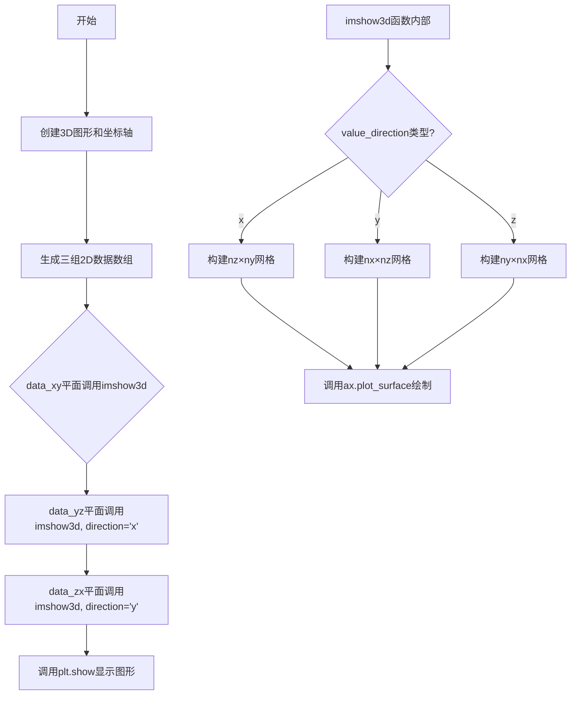
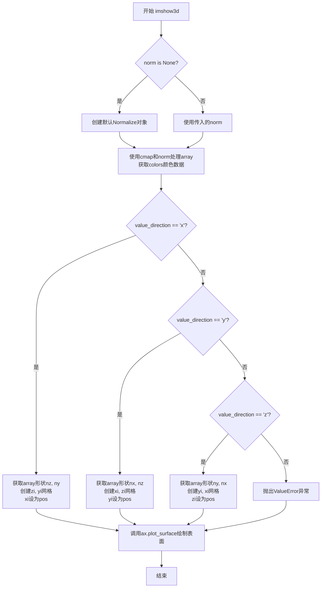
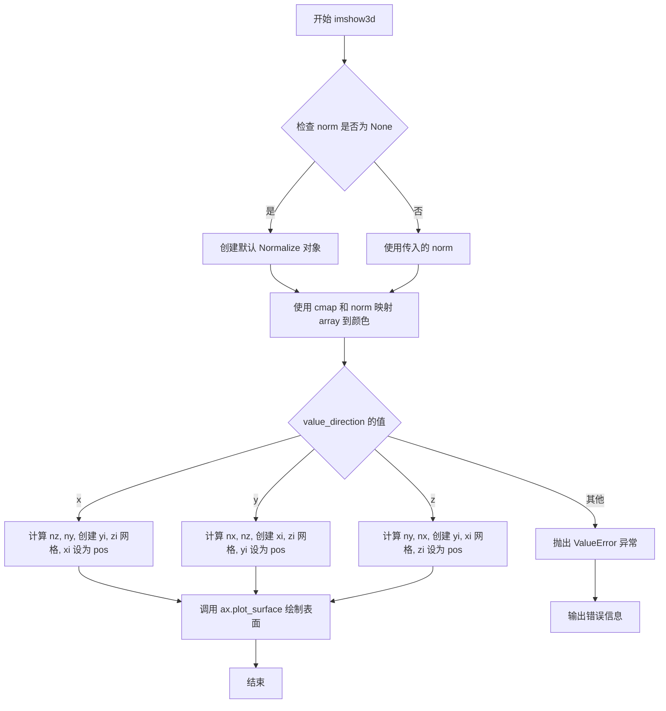
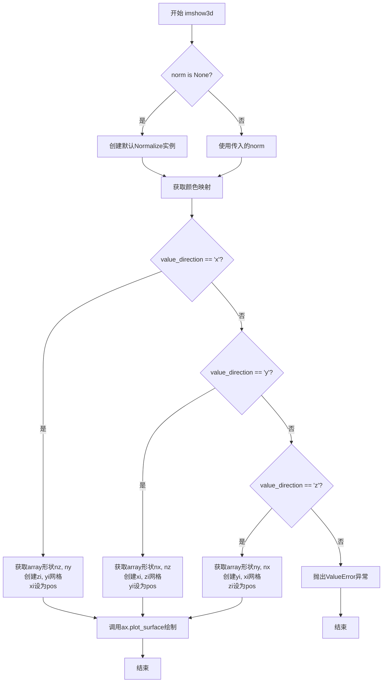

# `matplotlib\galleries\examples\mplot3d\imshow3d.py` 详细设计文档

该代码演示了如何使用Matplotlib的plot_surface函数将2D数组作为平面嵌入到3D空间中显示，提供了imshow3d函数来在x、y或z轴垂直的平面上绘制彩色编码的2D图像。

## 整体流程



## 类结构

```
无自定义类 (纯脚本文件)
使用Matplotlib库: plt, Axes3D, Normalize
使用NumPy库: np
```

## 全局变量及字段


### `fig`
    
3D图形对象，用于容纳和显示matplotlib图形

类型：`matplotlib.figure.Figure`
    


### `ax`
    
3D坐标轴对象，用于在三维空间中绘制图形和数据

类型：`matplotlib.axes._axes3d.Axes3D`
    


### `nx`
    
X方向数据维度，表示数据在X轴方向的大小

类型：`int`
    


### `ny`
    
Y方向数据维度，表示数据在Y轴方向的大小

类型：`int`
    


### `nz`
    
Z方向数据维度，表示数据在Z轴方向的大小

类型：`int`
    


### `data_xy`
    
XY平面2D数组数据，包含在XY平面上显示的图像像素值

类型：`np.ndarray`
    


### `data_yz`
    
YZ平面2D数组数据，包含在YZ平面上显示的图像像素值

类型：`np.ndarray`
    


### `data_zx`
    
ZX平面2D数组数据，包含在ZX平面上显示的图像像素值

类型：`np.ndarray`
    


    

## 全局函数及方法


### `imshow3d`

在3D坐标轴中显示2D数组为彩色平面，通过将2D图像数据映射到3D空间中的平面上来可视化。该函数利用matplotlib的plot_surface方法，根据指定的方向（x、y或z轴）将图像数据渲染为3D场景中的平面。

参数：

- `ax`：`matplotlib.axes.Axes3D`，3D坐标轴对象，用于绘制图像平面
- `array`：`numpy.ndarray`，二维 numpy 数组，表示要显示的图像数据
- `value_direction`：`str`，字符串，指定图像平面垂直的坐标轴方向，可选值为 'x'、'y' 或 'z'，默认为 'z'
- `pos`：`float`，数值，表示图像平面在 value_direction 轴上的位置，默认为 0
- `norm`：`matplotlib.colors.Normalize`，归一化对象，用于将标量数据映射到颜色，如果为 None 则使用默认的 Normalize，默认为 None
- `cmap`：`str` 或 `matplotlib.colors.Colormap`，颜色映射对象或注册的colormap名称，用于将数据值映射到颜色，默认为 None（使用rc参数中的默认值）

返回值：`None`，无返回值，该函数直接在给定的3D坐标轴上绘制图像平面

#### 流程图



#### 带注释源码

```python
def imshow3d(ax, array, value_direction='z', pos=0, norm=None, cmap=None):
    """
    Display a 2D array as a color-coded 2D image embedded in 3d.

    The image will be in a plane perpendicular to the coordinate axis *value_direction*.

    Parameters
    ----------
    ax : Axes3D
        The 3D Axes to plot into.
    array : 2D numpy array
        The image values.
    value_direction : {'x', 'y', 'z'}
        The axis normal to the image plane.
    pos : float
        The numeric value on the *value_direction* axis at which the image plane is
        located.
    norm : `~matplotlib.colors.Normalize`, default: Normalize
        The normalization method used to scale scalar data. See `imshow()`.
    cmap : str or `~matplotlib.colors.Colormap`, default: :rc:`image.cmap`
        The Colormap instance or registered colormap name used to map scalar data
        to colors.
    """
    # 如果没有提供norm，则创建默认的Normalize对象用于数据归一化
    if norm is None:
        norm = Normalize()
    
    # 使用colormap和norm将array数据转换为颜色值
    # colors的形状与array相同，最后一个维度为RGBA四个通道
    colors = plt.get_cmap(cmap)(norm(array))

    # 根据value_direction确定图像平面的方向和坐标网格
    if value_direction == 'x':
        # 当沿着x轴方向时，图像平面由y和z坐标决定
        nz, ny = array.shape  # 获取数组在y和z方向的尺寸
        # 创建网格，zi和yi覆盖整个图像范围
        # 注意：使用+1是为了绘制像素边界而不是像素中心
        zi, yi = np.mgrid[0:nz + 1, 0:ny + 1]
        # xi使用填充值，所有点都在指定的pos位置
        xi = np.full_like(yi, pos)
    elif value_direction == 'y':
        # 当沿着y轴方向时，图像平面由x和z坐标决定
        nx, nz = array.shape  # 获取数组在x和z方向的尺寸
        xi, zi = np.mgrid[0:nx + 1, 0:nz + 1]  # 创建x和z方向的网格
        yi = np.full_like(zi, pos)  # yi使用填充值
    elif value_direction == 'z':
        # 当沿着z轴方向时，图像平面由x和y坐标决定（这是默认情况）
        ny, nx = array.shape  # 获取数组在x和y方向的尺寸
        yi, xi = np.mgrid[0:ny + 1, 0:nx + 1]  # 创建y和x方向的网格
        zi = np.full_like(xi, pos)  # zi使用填充值
    else:
        # 如果value_direction不是有效的选项，抛出错误
        raise ValueError(f"Invalid value_direction: {value_direction!r}")
    
    # 使用plot_surface在3D坐标轴上绘制图像平面
    # rstride和cstride设为1表示每个像素绘制一个面
    # facecolors使用计算出的颜色，不进行着色(shade=False)以保持图像的真实性
    ax.plot_surface(xi, yi, zi, rstride=1, cstride=1, facecolors=colors, shade=False)
```


### imshow3d

在3D坐标轴中显示2D数组作为颜色编码的2D图像平面，图像位于垂直于指定坐标轴的平面上。

参数：

- `ax`：`Axes3D`，要绘制到的3D坐标轴对象
- `array`：`np.ndarray`，图像的2D数值数据
- `value_direction`：`str`，图像平面垂直的坐标轴（'x'、'y'或'z'）
- `pos`：`float`，图像平面在value_direction轴上的位置
- `norm`：`Normalize`，用于将标量数据缩放到颜色的归一化方法，默认为Normalize
- `cmap`：`str`或`Colormap`，用于将标量数据映射到颜色的颜色映射，默认为rc参数image.cmap

返回值：`None`，该函数无返回值，直接在ax对象上绘制3D表面

#### 流程图



#### 带注释源码

```python
def imshow3d(ax, array, value_direction='z', pos=0, norm=None, cmap=None):
    """
    Display a 2D array as a color-coded 2D image embedded in 3d.

    The image will be in a plane perpendicular to the coordinate axis *value_direction*.

    Parameters
    ----------
    ax : Axes3D
        The 3D Axes to plot into.
    array : 2D numpy array
        The image values.
    value_direction : {'x', 'y', 'z'}
        The axis normal to the image plane.
    pos : float
        The numeric value on the *value_direction* axis at which the image plane is
        located.
    norm : `~matplotlib.colors.Normalize`, default: Normalize
        The normalization method used to scale scalar data. See `imshow()`.
    cmap : str or `~matplotlib.colors.Colormap`, default: :rc:`image.cmap`
        The Colormap instance or registered colormap name used to map scalar data
        to colors.
    """
    # 如果未提供归一化方法，则使用默认的Normalize对象
    if norm is None:
        norm = Normalize()
    
    # 使用颜色映射将数组数据映射为RGBA颜色值
    colors = plt.get_cmap(cmap)(norm(array))

    # 根据value_direction确定坐标轴方向，创建相应的网格
    if value_direction == 'x':
        # 当图像垂直于x轴时
        nz, ny = array.shape  # 获取数组的高度和宽度
        # 创建网格：zi为z坐标，yi为y坐标
        zi, yi = np.mgrid[0:nz + 1, 0:ny + 1]
        # x坐标全部设置为pos（图像在x轴的位置）
        xi = np.full_like(yi, pos)
    elif value_direction == 'y':
        # 当图像垂直于y轴时
        nx, nz = array.shape
        xi, zi = np.mgrid[0:nx + 1, 0:nz + 1]
        yi = np.full_like(zi, pos)
    elif value_direction == 'z':
        # 当图像垂直于z轴时（默认情况）
        ny, nx = array.shape
        yi, xi = np.mgrid[0:ny + 1, 0:nx + 1]
        zi = np.full_like(xi, pos)
    else:
        # 如果value_direction不是有效的轴方向，抛出异常
        raise ValueError(f"Invalid value_direction: {value_direction!r}")
    
    # 使用plot_surface在3D坐标轴上绘制图像平面
    # rstride和cstride设置为1表示每个数据点绘制一个面
    # facecolors参数传入计算好的颜色数组
    # shade=False关闭阴影以获得更清晰的图像显示
    ax.plot_surface(xi, yi, zi, rstride=1, cstride=1, facecolors=colors, shade=False)
```


### `imshow3d`

在3D坐标轴中显示2D数组作为颜色编码的平面图像，通过指定法线方向（x、y或z）在三维空间中定位图像平面。

参数：

- `ax`：`Axes3D`，要在其中绘制图像的3D坐标轴对象
- `array`：`2D numpy array`，表示图像像素值的二维数组
- `value_direction`：`{'x', 'y', 'z'}`，图像平面垂直的坐标轴方向，默认为'z'
- `pos`：`float`，图像平面在*value_direction*轴上的位置，默认为0
- `norm`：`~matplotlib.colors.Normalize`，用于将标量数据映射到颜色的归一化方法，默认为Normalize()
- `cmap`：`str or ~matplotlib.colors.Colormap`，颜色映射表，默认为rc参数image.cmap

返回值：`None`，该函数直接在给定的3D坐标轴上绘制图像，无返回值

#### 流程图



#### 带注释源码

```python
def imshow3d(ax, array, value_direction='z', pos=0, norm=None, cmap=None):
    """
    Display a 2D array as a  color-coded 2D image embedded in 3d.

    The image will be in a plane perpendicular to the coordinate axis *value_direction*.

    Parameters
    ----------
    ax : Axes3D
        The 3D Axes to plot into.
    array : 2D numpy array
        The image values.
    value_direction : {'x', 'y', 'z'}
        The axis normal to the image plane.
    pos : float
        The numeric value on the *value_direction* axis at which the image plane is
        located.
    norm : `~matplotlib.colors.Normalize`, default: Normalize
        The normalization method used to scale scalar data. See `imshow()`.
    cmap : str or `~matplotlib.colors.Colormap`, default: :rc:`image.cmap`
        The Colormap instance or registered colormap name used to map scalar data
        to colors.
    """
    # 如果未提供norm，则创建默认的归一化对象
    if norm is None:
        norm = Normalize()
    
    # 使用指定的colormap将array数据映射为RGBA颜色数组
    colors = plt.get_cmap(cmap)(norm(array))

    # 根据value_direction确定图像平面的方向，并创建对应的坐标网格
    if value_direction == 'x':
        # 图像平面垂直于x轴（法线方向为x）
        nz, ny = array.shape  # 获取数组的维度
        # 创建坐标网格：zi范围[0, nz+1]，yi范围[0, ny+1]
        zi, yi = np.mgrid[0:nz + 1, 0:ny + 1]
        # x坐标全部设为pos（平面在x轴上的位置）
        xi = np.full_like(yi, pos)
    elif value_direction == 'y':
        # 图像平面垂直于y轴（法线方向为y）
        nx, nz = array.shape
        xi, zi = np.mgrid[0:nx + 1, 0:nz + 1]
        yi = np.full_like(zi, pos)
    elif value_direction == 'z':
        # 图像平面垂直于z轴（法线方向为z），默认值
        ny, nx = array.shape
        yi, xi = np.mgrid[0:ny + 1, 0:nx + 1]
        zi = np.full_like(xi, pos)
    else:
        # 无效的value_direction，抛出异常
        raise ValueError(f"Invalid value_direction: {value_direction!r}")
    
    # 使用plot_surface在3D空间中绘制图像平面
    # rstride=1, cstride=1表示每个数据点都绘制
    # facecolors使用计算出的颜色数组
    # shade=False禁用阴影以获得更清晰的图像效果
    ax.plot_surface(xi, yi, zi, rstride=1, cstride=1, facecolors=colors, shade=False)
```

## 关键组件


### 张量索引与坐标网格生成

代码使用 `np.mgrid` 和 `np.full_like` 为3D曲面生成坐标网格。根据 `value_direction` 参数的不同，代码动态构建 `(xi, yi, zi)` 坐标数组，将2D图像平面定位在3D空间中的指定位置。对于每个方向，代码正确地重新排列数组维度以匹配 `plot_surface` 的要求。

### 反量化支持与颜色映射

代码通过 `plt.get_cmap(cmap)(norm(array))` 实现反量化支持。首先使用 `Normalize` 对象将输入数组的值归一化到 [0, 1] 范围，然后通过 colormap 将归一化后的值映射为 RGBA 颜色。这允许用户自定义归一化方法和颜色映射，实现数据的可视化表达。

### 量化策略与归一化默认行为

当用户未提供 `norm` 参数时，代码默认使用 `Normalize()` 进行线性归一化。代码支持用户传入预定义的 `Normalize` 对象（如对数归一化、对称归一化等），从而实现灵活的量化策略。这种设计允许多个 `imshow3d` 调用共享同一个归一化器以实现统一的颜色尺度。

### 3D曲面绘制引擎

代码基于 `Axes3D.plot_surface` 方法实现2D图像在3D空间中的渲染。通过设置 `rstride=1, cstride=1` 确保每个像素都被绘制， `facecolors=colors` 指定每个面的颜色， `shade=False` 禁用阴影以获得与 `imshow` 相似的平面效果。

### 参数校验与错误处理

代码对 `value_direction` 参数进行严格校验，只接受 'x'、'y'、'z' 三个有效值。当传入无效值时，抛出 `ValueError` 异常并包含具体的错误值信息，帮助用户快速定位问题。


## 问题及建议


### 已知问题

- **参数验证不足**：`array`参数未验证是否为2D numpy数组，可能导致运行时错误；`pos`参数无范围验证；`cmap`为`None`时依赖`plt.get_cmap(None)`的隐式行为，不够显式
- **代码重复**：三个`value_direction`分支中的坐标网格创建逻辑高度相似，存在较多重复代码，可通过重构减少冗余
- **缺少类型注解**：函数缺乏Python类型提示（type hints），降低代码可读性和IDE支持
- **错误处理不完善**：未处理空数组、非法数组维度等边界情况；`ValueError`的错误信息可以更友好
- **性能优化空间**：对大数组使用`rstride=1, cstride=1`可能导致性能问题，未提供降采样选项；`np.mgrid`可能不是最高效的网格创建方式
- **功能缺失**：与文档中提到的`imshow`差异一致，缺少aspect处理、像素中心对齐、许多可选参数（如`extent`、`origin`等）
- **文档不完整**：返回值类型和描述缺失；缺少异常情况的说明

### 优化建议

- 添加输入参数验证逻辑，确保`array`是2D numpy数组，`value_direction`在允许范围内，`pos`为数值类型
- 提取坐标网格创建的公共逻辑到辅助函数，减少代码重复
- 为函数添加类型注解和完整的docstring，包括返回值和异常说明
- 考虑添加数组降采样选项或默认步长参数以提升大数组性能
- 增强错误信息的描述性，提供更清晰的异常提示
- 考虑添加更多`imshow`兼容参数（如`extent`、`origin`）以提升功能完整性

## 其它


### 设计目标与约束

本代码旨在为matplotlib的3D坐标轴添加类似imshow的2D图像显示功能，允许用户在3D空间中的任意坐标平面（垂直于x、y或z轴）上展示2D图像。主要设计约束包括：不支持平面相交（3D引擎限制）、不自动设置坐标轴比例（像素不一定为正方形）、像素边缘使用整数值而非像素中心、以及默认情况下多个imshow3d调用使用独立的归一化（norm）导致不同的颜色范围。

### 错误处理与异常设计

代码通过ValueError异常处理无效的value_direction参数，当传入非'x'、'y'、'z'的值时抛出异常并显示详细的错误信息。对于array参数，假设调用者传入有效的2D numpy数组，未进行显式的形状验证。norm参数默认为Normalize()实例，当cmap为None时使用rcParams中的默认值image.cmap。

### 数据流与状态机

数据流从输入的2D数组开始，经过Normalize对象进行值域映射到[0,1]区间，然后通过colormap将归一化后的值转换为RGBA颜色数组。根据value_direction参数确定图像平面的朝向和位置，生成对应的坐标网格（xi, yi, zi），最后调用Axes3D.plot_surface进行3D表面绘制。状态机主要涉及三个状态：参数解析与验证、坐标网格生成、3D表面绘制。

### 外部依赖与接口契约

主要依赖matplotlib的Axes3D类进行3D绘图，依赖numpy进行数组操作和网格生成，依赖matplotlib.colors.Normalize进行数据归一化，依赖matplotlib.pyplot获取colormap。对外接口为imshow3d函数，接受ax（3D坐标轴）、array（2D图像数据）、value_direction（平面法向方向）、pos（平面位置）、norm（归一化器）、cmap（颜色映射）参数。

### 性能考虑

使用np.mgrid生成坐标网格时额外+1边界以确保图像覆盖完整区域。plot_surface调用使用rstride=1和cstride=1表示逐像素绘制，facecolors参数直接传入预计算的颜色数组避免逐点计算。当处理大尺寸图像时性能可能受限，可考虑降采样或使用更粗的步长。

### 使用示例与API参考

示例代码展示了三种典型用法：在xy平面显示图像（默认value_direction='z'）、在yz平面显示（value_direction='x'）、在zx平面显示（value_direction='y'并指定位置）。通过预设norm可以实现多图像共享同一颜色范围，这对比较不同图像至关重要。cmap参数支持任何注册的matplotlib colormap名称。

### 版本历史与变更记录

该代码作为matplotlib示例文件存在，属于文档性质的功能演示。原始版本仅支持基本的3D图像显示，后续演进可能添加更多imshow的可选参数支持。变更记录可查阅matplotlib官方Git仓库的提交历史。

### 测试策略

由于为示例代码，未包含单元测试。实际生产环境中应测试：各种value_direction值的正确性、无效value_direction的异常抛出、不同尺寸array的处理、不同norm和cmap组合的效果、多平面同时显示的场景、以及与标准imshow的行为一致性验证。

### 已知限制与边界情况

主要限制包括：平面相交时存在绘制顺序问题导致错误的遮挡关系；不支持透明度和alpha通道；不维护坐标轴的aspect比例；像素边缘为整数坐标而非中心；不支持完整的imshow参数集（如extent、origin等）。边界情况包括空数组处理、单元素数组、极端值数组等均未做特殊处理。

### 配置与参数说明

value_direction参数必须是'x'、'y'或'z'之一，决定图像平面垂直于哪个坐标轴。pos参数为浮点数，表示平面在法向轴上的位置。norm参数接受任何matplotlib.colors.Normalize子类实例，用于自定义数据到颜色的映射。cmap参数接受colormap名称字符串或Colormap对象，默认读取rcParams['image.cmap']配置。

### 安全考虑

代码不涉及用户输入处理或网络通信，无明显安全风险。但由于依赖外部传入的numpy数组，应注意避免传入超大规模数组导致内存问题。colormap和norm的构造信任调用者提供的数据，不执行恶意代码检查。

    