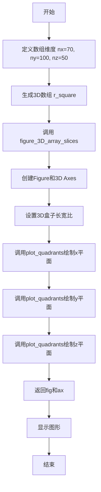
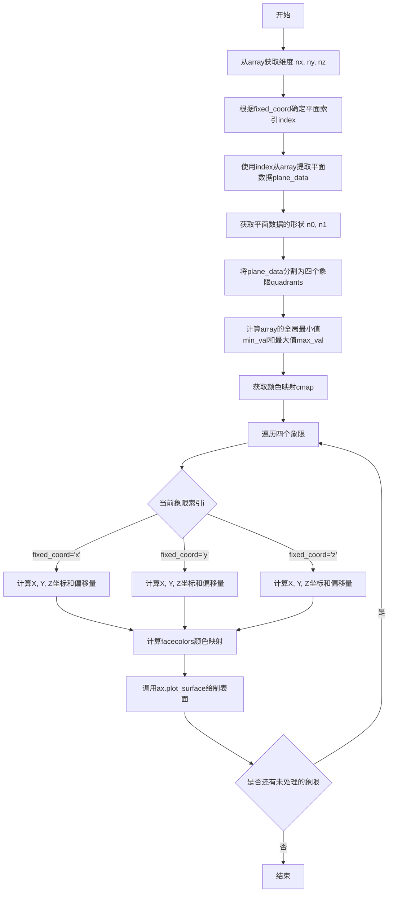
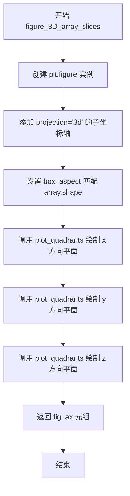
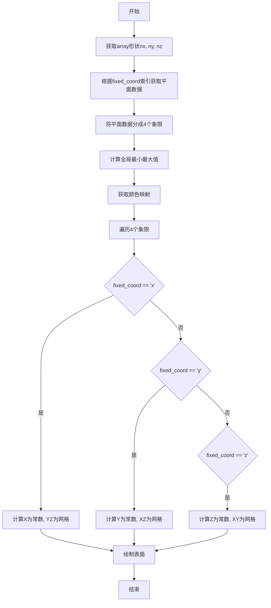
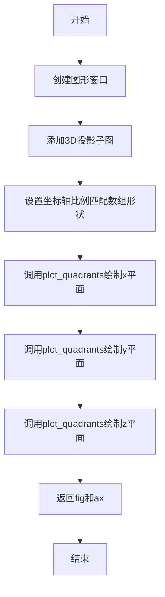

# `matplotlib\galleries\examples\mplot3d\intersecting_planes.py` 详细设计文档

该代码是一个Matplotlib 3D可视化示例，演示如何通过将平面分割为四个象限来解决mplot3d中相交平面相互重叠的问题，并使用三个相互垂直的中心平面展示3D数组数据。

## 整体流程



## 类结构

```
无类结构（纯函数模块）
└── 全局函数
    ├── plot_quadrants
    └── figure_3D_array_slices
```

## 全局变量及字段


### `nx`
    
数组x维度

类型：`int`
    


### `ny`
    
数组y维度

类型：`int`
    


### `nz`
    
数组z维度

类型：`int`
    


### `r_square`
    
3D平方距离数组

类型：`numpy.ndarray`
    


    

## 全局函数及方法


### `plot_quadrants`

该函数用于将给定的3D数组在指定坐标轴上绘制平面，并将平面分割成四个象限进行绘制，以解决matplotlib 3D绘图中平面相互重叠的问题。

参数：

- `ax`：`matplotlib.axes.Axes3D`，3D坐标轴对象，用于承载绘制的平面
- `array`：`numpy.ndarray`，三维数组，包含要可视化的数据
- `fixed_coord`：`str`，字符串，指定固定坐标轴，可选值为 `'x'`、`'y'` 或 `'z'`，表示沿哪个轴切分平面
- `cmap`：`str`，字符串，颜色映射名称，用于将数据值映射到颜色

返回值：`None`，该函数直接在传入的3D坐标轴上绘制图形，不返回任何值

#### 流程图



#### 带注释源码

```python
def plot_quadrants(ax, array, fixed_coord, cmap):
    """For a given 3d *array* plot a plane with *fixed_coord*, using four quadrants."""
    # 获取三维数组在三个维度上的大小
    nx, ny, nz = array.shape
    
    # 根据fixed_coord确定要切片的平面索引
    # 'x': 在x轴中间切分，取nx//2位置的平面
    # 'y': 在y轴中间切分，取ny//2位置的平面  
    # 'z': 在z轴中间切分，取nz//2位置的平面
    index = {
        'x': (nx // 2, slice(None), slice(None)),
        'y': (slice(None), ny // 2, slice(None)),
        'z': (slice(None), slice(None), nz // 2),
    }[fixed_coord]
    
    # 从三维数组中提取指定平面的一层数据
    plane_data = array[index]

    # 获取平面数据的维度
    n0, n1 = plane_data.shape
    
    # 将平面数据分割成四个象限
    # 左上象限: plane_data[:n0 // 2, :n1 // 2]
    # 右上象限: plane_data[:n0 // 2, n1 // 2:]
    # 左下象限: plane_data[n0 // 2:, :n1 // 2]
    # 右下象限: plane_data[n0 // 2:, n1 // 2:]
    quadrants = [
        plane_data[:n0 // 2, :n1 // 2],
        plane_data[:n0 // 2, n1 // 2:],
        plane_data[n0 // 2:, :n1 // 2],
        plane_data[n0 // 2:, n1 // 2:]
    ]

    # 计算全局最小值和最大值，用于颜色归一化
    min_val = array.min()
    max_val = array.max()

    # 获取指定的名字颜色映射
    cmap = plt.get_cmap(cmap)

    # 遍历四个象限分别绘制
    for i, quadrant in enumerate(quadrants):
        # 将数据值归一化到[0,1]范围并映射到颜色
        facecolors = cmap((quadrant - min_val) / (max_val - min_val))
        
        # 根据fixed_coord处理不同的坐标轴
        if fixed_coord == 'x':
            # 在x轴固定的平面上创建网格
            # Y和Z使用mgrid创建，X使用固定值
            Y, Z = np.mgrid[0:ny // 2, 0:nz // 2]
            X = nx // 2 * np.ones_like(Y)
            # 计算Y和Z方向的偏移量，用于将四个象限放置在正确位置
            Y_offset = (i // 2) * ny // 2
            Z_offset = (i % 2) * nz // 2
            # 绘制表面，rstride和cstride设置为1表示不采样
            ax.plot_surface(X, Y + Y_offset, Z + Z_offset, rstride=1, cstride=1,
                            facecolors=facecolors, shade=False)
                            
        elif fixed_coord == 'y':
            # 在y轴固定的平面上创建网格
            X, Z = np.mgrid[0:nx // 2, 0:nz // 2]
            Y = ny // 2 * np.ones_like(X)
            X_offset = (i // 2) * nx // 2
            Z_offset = (i % 2) * nz // 2
            ax.plot_surface(X + X_offset, Y, Z + Z_offset, rstride=1, cstride=1,
                            facecolors=facecolors, shade=False)
                            
        elif fixed_coord == 'z':
            # 在z轴固定的平面上创建网格
            X, Y = np.mgrid[0:nx // 2, 0:ny // 2]
            Z = nz // 2 * np.ones_like(X)
            X_offset = (i // 2) * nx // 2
            Y_offset = (i % 2) * ny // 2
            ax.plot_surface(X + X_offset, Y + Y_offset, Z, rstride=1, cstride=1,
                            facecolors=facecolors, shade=False)
```


### `figure_3D_array_slices`

该函数用于将三维数组可视化为三个相互相交的平面（分别在x、y、z三个方向上），通过将每个平面分割为四个象限来避免相互重叠的渲染问题，最终返回matplotlib的Figure和Axes3D对象以便用户进行进一步定制。

参数：

- `array`：`numpy.ndarray`，三维数组数据，用于生成相交平面的数值来源
- `cmap`：`str` 或 `None`，颜色映射方案，传递给`plot_quadrants`函数用于渲染平面颜色，默认为`None`

返回值：`tuple`，包含`fig`（`matplotlib.figure.Figure`对象，图形窗口）和`ax`（`matplotlib.axes._subplots.Axes3D`对象，三维坐标轴对象）

#### 流程图



#### 带注释源码

```python
def figure_3D_array_slices(array, cmap=None):
    """
    Plot a 3d array using three intersecting centered planes.
    
    Parameters:
    ----------
    array : numpy.ndarray
        3D array containing the data to be visualized as intersecting planes.
    cmap : str or None, optional
        Colormap name passed to plot_quadrants for coloring the plane surfaces.
        If None, the default colormap will be used.
    
    Returns:
    -------
    fig : matplotlib.figure.Figure
        The figure object containing the 3D plot.
    ax : matplotlib.axes._subplots.Axes3D
        The 3D axes object with the plotted planes.
    """
    # 创建新的Figure对象，用于容纳所有绘图元素
    fig = plt.figure()
    
    # 添加带有3D投影的子坐标轴，mplot3d不支持真正的3D渲染，
    # 只是将Artist投影到3D空间并按正确顺序绘制
    ax = fig.add_subplot(projection='3d')
    
    # 设置3D坐标轴的宽高比，使其与输入数组的形状匹配，
    # 确保可视化不会因比例失真而误导
    ax.set_box_aspect(array.shape)
    
    # 在x方向（垂直于x轴的平面）绘制被分割的平面
    # 通过plot_quadrants将每个平面分成四个象限来避免相互重叠
    plot_quadrants(ax, array, 'x', cmap=cmap)
    
    # 在y方向（垂直于y轴的平面）绘制被分割的平面
    plot_quadrants(ax, array, 'y', cmap=cmap)
    
    # 在z方向（垂直于z轴的平面）绘制被分割的平面
    plot_quadrants(ax, array, 'z', cmap=cmap)
    
    # 返回Figure和Axes3D对象，供调用者进一步自定义
    return fig, ax
```

## 关键组件


### 一段话描述

该代码是一个Matplotlib 3D可视化示例，通过将三维数组沿三个坐标轴（x、y、z）切分为四个象限来绘制相交平面，解决了mplot3d在绘制相互重叠的3D平面时的深度排序问题。

### 文件的整体运行流程

1. 定义`plot_quadrants`函数：接收3D数组、固定坐标轴和颜色映射，将平面分成四个象限并绘制
2. 定义`figure_3D_array_slices`函数：创建3D图形，设置坐标轴比例，依次调用`plot_quadrants`绘制三个相交平面
3. 生成测试数据：创建三维空间中的距离平方数组
4. 调用`figure_3D_array_slices`渲染图形并通过`plt.show()`显示

### 全局变量和全局函数详细信息

#### 全局变量

| 名称 | 类型 | 描述 |
|------|------|------|
| nx | int | x轴方向的采样点数(70) |
| ny | int | y轴方向的采样点数(100) |
| nz | int | z轴方向的采样点数(50) |
| r_square | numpy.ndarray | 三维空间距离平方的数组 |

#### 全局函数

##### plot_quadrants

| 项目 | 详情 |
|------|------|
| 名称 | plot_quadrants |
| 参数名称 | ax, array, fixed_coord, cmap |
| 参数类型 | axes3d, numpy.ndarray, str, str |
| 参数描述 | ax: 3D坐标轴对象; array: 三维数据数组; fixed_coord: 固定坐标轴名称('x'/'y'/'z'); cmap: 颜色映射名称 |
| 返回值类型 | None |
| 返回值描述 | 无返回值，直接在ax上绘制平面 |

**mermaid流程图**



**带注释源码**

```python
def plot_quadrants(ax, array, fixed_coord, cmap):
    """For a given 3d *array* plot a plane with *fixed_coord*, using four quadrants."""
    # 获取三维数组在各维度的尺寸
    nx, ny, nz = array.shape
    # 根据fixed_coord构建索引元组,选择中间切片
    index = {
        'x': (nx // 2, slice(None), slice(None)),
        'y': (slice(None), ny // 2, slice(None)),
        'z': (slice(None), slice(None), nz // 2),
    }[fixed_coord]
    # 提取平面数据
    plane_data = array[index]

    # 获取平面数据的形状
    n0, n1 = plane_data.shape
    # 将平面数据按象限分割成4个子数组
    quadrants = [
        plane_data[:n0 // 2, :n1 // 2],  # 第一象限
        plane_data[:n0 // 2, n1 // 2:],  # 第二象限
        plane_data[n0 // 2:, :n1 // 2],  # 第三象限
        plane_data[n0 // 2:, n1 // 2:]   # 第四象限
    ]

    # 计算全局最小最大值用于归一化
    min_val = array.min()
    max_val = array.max()

    # 获取颜色映射对象
    cmap = plt.get_cmap(cmap)

    # 遍历每个象限进行绘制
    for i, quadrant in enumerate(quadrants):
        # 将数据值映射到颜色
        facecolors = cmap((quadrant - min_val) / (max_val - min_val))
        if fixed_coord == 'x':
            # x平面: X为常数, YZ为网格
            Y, Z = np.mgrid[0:ny // 2, 0:nz // 2]
            X = nx // 2 * np.ones_like(Y)
            Y_offset = (i // 2) * ny // 2
            Z_offset = (i % 2) * nz // 2
            ax.plot_surface(X, Y + Y_offset, Z + Z_offset, rstride=1, cstride=1,
                            facecolors=facecolors, shade=False)
        elif fixed_coord == 'y':
            # y平面: Y为常数, XZ为网格
            X, Z = np.mgrid[0:nx // 2, 0:nz // 2]
            Y = ny // 2 * np.ones_like(X)
            X_offset = (i // 2) * nx // 2
            Z_offset = (i % 2) * nz // 2
            ax.plot_surface(X + X_offset, Y, Z + Z_offset, rstride=1, cstride=1,
                            facecolors=facecolors, shade=False)
        elif fixed_coord == 'z':
            # z平面: Z为常数, XY为网格
            X, Y = np.mgrid[0:nx // 2, 0:ny // 2]
            Z = nz // 2 * np.ones_like(X)
            X_offset = (i // 2) * nx // 2
            Y_offset = (i % 2) * ny // 2
            ax.plot_surface(X + X_offset, Y + Y_offset, Z, rstride=1, cstride=1,
                            facecolors=facecolors, shade=False)
```

##### figure_3D_array_slices

| 项目 | 详情 |
|------|------|
| 名称 | figure_3D_array_slices |
| 参数名称 | array, cmap |
| 参数类型 | numpy.ndarray, str |
| 参数描述 | array: 三维数据数组; cmap: 颜色映射名称 |
| 返回值类型 | tuple(figure, axes3d) |
| 返回值描述 | 返回创建的图形对象和3D坐标轴对象 |

**mermaid流程图**



**带注释源码**

```python
def figure_3D_array_slices(array, cmap=None):
    """Plot a 3d array using three intersecting centered planes."""
    # 创建新的图形窗口
    fig = plt.figure()
    # 添加3D投影坐标轴
    ax = fig.add_subplot(projection='3d')
    # 设置坐标轴比例以匹配数组形状
    ax.set_box_aspect(array.shape)
    # 绘制三个相互垂直的中心平面
    plot_quadrants(ax, array, 'x', cmap=cmap)
    plot_quadrants(ax, array, 'y', cmap=cmap)
    plot_quadrants(ax, array, 'z', cmap=cmap)
    return fig, ax
```

### 关键组件信息

#### 组件1: 张量索引与切片策略

使用NumPy的高级索引将三维数组沿固定坐标轴切分为四个象限。通过`slice(None)`和整数除法`//`实现中间切分，每个象限独立绘制以解决深度排序问题。

#### 组件2: 反量化与颜色映射

将原始数值数组通过归一化公式`(quadrant - min_val) / (max_val - min_val)`映射到[0,1]区间，再通过Matplotlib的colormap转换为RGBA颜色值，实现数据的可视化表达。

#### 组件3: 三维网格生成

使用`np.mgrid`生成坐标网格，根据不同fixed_coord构建相应的三维坐标数组，用于`plot_surface`绘制。

#### 组件4: 平面分割策略

将完整平面在中心点处分割成四个象限，使得每个象限独立渲染，解决mplot3d在处理相交平面时的渲染顺序问题。

### 潜在的技术债务或优化空间

1. **硬编码的中心分割**: 代码仅支持在数组中点处分割，不支持任意位置的平面切割
2. **象限数量固定**: 假设平面总是被均匀分成四份，无法处理非对称数据
3. **重复代码**: 三个坐标轴的绘制逻辑有大量重复代码，可通过抽象减少
4. **缺乏错误处理**: 未对输入array维度、cmap有效性等进行验证
5. **性能考虑**: 每次调用都重新计算min/max，可缓存以提升性能

### 其它项目

#### 设计目标与约束

- 目标：演示如何在mplot3d中绘制相交平面
- 约束：仅支持沿中心对称切割的平面，保持代码可读性

#### 错误处理与异常设计

- 未实现输入验证
- 假设输入为三维数值数组
- 假设cmap为有效colormap名称

#### 数据流与状态机

数据流：输入3D数组 → 提取三个正交平面 → 分象限 → 计算颜色 → 渲染表面 → 输出图形

#### 外部依赖与接口契约

- 依赖库：matplotlib.pyplot, numpy
- 输入：numpy.ndarray (3D), str (colormap name)
- 输出：matplotlib Figure, Axes3D


## 问题及建议


### 已知问题

- **硬编码的中点分割**：代码仅支持在网格中点（`nx // 2`, `ny // 2`, `nz // 2`）分割平面，不支持任意位置的切割，限制了功能的通用性。
- **代码重复**：在`plot_quadrants`函数中，x、y、z三个坐标轴的处理逻辑存在大量重复的代码模式，仅参数名称不同，可通过抽象进一步优化。
- **缺乏输入验证**：没有对输入数组维度、cmap参数有效性等进行验证，可能导致隐藏的错误或难以调试的异常。
- **全局变量污染**：nx、ny、nz和r_square作为全局变量定义，封装性不足。
- **重复计算**：在绘制四个象限的循环中，每次都重复计算`min_val`、`max_val`以及调用`cmap`，这些值在循环中保持不变，可以提到循环外预先计算。
- **魔法数字**：`rstride=1, cstride=1, shade=False`等参数被硬编码，缺少可配置性。
- **文档不完整**：函数文档字符串较为简单，缺少参数类型、返回值描述等完整信息。

### 优化建议

- 添加输入参数验证逻辑，检查数组维度是否为3D，以及cmap是否为有效的colormap名称。
- 将三个坐标轴的绘制逻辑提取为通用的子函数或使用配置字典来消除重复代码。
- 将全局变量迁移到函数内部或封装为类，提高封装性和可测试性。
- 将`min_val`、`max_val`和`cmap`的获取移到循环外部，避免重复计算。
- 为`rstride`、`cstride`、`shade`等参数添加可选参数选项，提高函数的可配置性。
- 增强文档字符串，添加完整的参数类型、返回值描述和示例用法。

## 其它


### 设计目标与约束

本代码旨在演示如何在matplotlib的mplot3d中绘制相交的3D平面，解决mplot3d不是真正的3D渲染器而是将Artist投影到3D并按顺序绘制时出现的相互重叠问题。设计目标包括：通过将平面分割为四象限来规避相互重叠的限制；使用三个相互垂直的中心平面展示3D数组数据；保持代码简洁易读以便作为概念演示。设计约束包括：仅适用于相互平分的平面（plane cut each other in halves）；不支持任意位置的切割；这不是一个 refined solution（精细解决方案），而是概念验证性质的演示代码。

### 错误处理与异常设计

代码未包含显式的错误处理和异常捕获机制。在`plot_quadrants`函数中，假设传入的`array`是有效的三维numpy数组，若传入非三维数组或空数组将导致索引错误或计算错误。`fixed_coord`参数仅接受'x'、'y'、'z'三个字符串值，若传入其他值将触发KeyError。`cmap`参数直接传递给`plt.get_cmap()`，若传入无效的colormap名称将抛出matplotlib的异常。`figure_3D_array_slices`函数假设`array`至少在每个维度上具有大于2的尺寸，否则平面分割操作（`n0 // 2`, `n1 // 2`）可能产生零尺寸数组导致警告或错误。调用`plt.show()`时会打开一个交互式窗口，若在无图形环境中运行可能出现问题。

### 外部依赖与接口契约

本代码依赖以下外部包：matplotlib（用于图形绑制）、numpy（用于数值计算和数组操作）。核心接口包括：`plot_quadrants(ax, array, fixed_coord, cmap)`函数接收axes对象、三维数组、固定坐标轴字符串和colormap名称，在指定位置绘制四象限平面；`figure_3D_array_slices(array, cmap=None)`函数接收三维数组和可选colormap，返回figure和axes对象。输入数组应至少为3D numpy数组且每个维度大于2，输出为matplotlib 3D图形。代码不保存任何状态，不修改全局变量，通过函数参数传递所有配置。

### 性能考虑

代码中使用了`np.mgrid`创建网格坐标，每次调用`plot_surface`都会生成新的坐标数组（Y, Z或X, Z或X, Y），对于70x100x50的数组，这会生成大量的临时数组。`plot_surface`的`rstride`和`cstride`参数设为1表示无下采样，这会导致渲染大量三角形面片，可能影响性能。四个象限的绘制涉及四次独立的`plot_surface`调用，增加了绘图开销。若需要提高性能，可考虑增大rstride和cstride的值以减少面片数量，或预先计算并缓存坐标网格数组。

### 局限性

本代码存在以下局限性：仅支持相互平分的平面切割，不适用于任意角度或位置的平面相交；每次只能展示三个相互垂直的中心平面（x=nx//2, y=ny//2, z=nz//2），无法自定义平面位置；四象限分割策略假设平面恰好在数组中心相交，非中心相交时可能产生视觉伪影；不支持透明或半透明效果，因为mplot3d的透明排序问题；不提供坐标轴标签、刻度或图例的默认设置；颜色映射基于全局最小值/最大值，不同平面可能具有不同的视觉对比度；仅适用于标量场数据可视化，不适用于矢量场。

### 使用示例与扩展方向

基本使用只需传入三维numpy数组和colormap名称即可生成图形。扩展方向包括：修改`index`字典可支持非中心平面的绘制；添加颜色条(colorbar)以显示数值映射关系；添加坐标轴标签和标题；实现任意位置平面切割功能；添加对多个数组或时间序列数据可视化的支持；考虑使用`plot_trisurf`或自定义三角形网格实现更灵活的3D渲染。当前实现是一个概念验证原型，不适合直接用于生产环境或复杂应用场景。


    