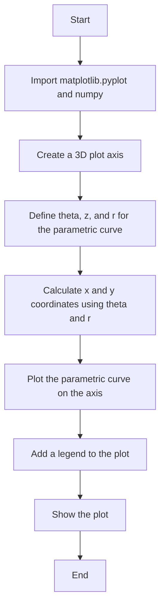
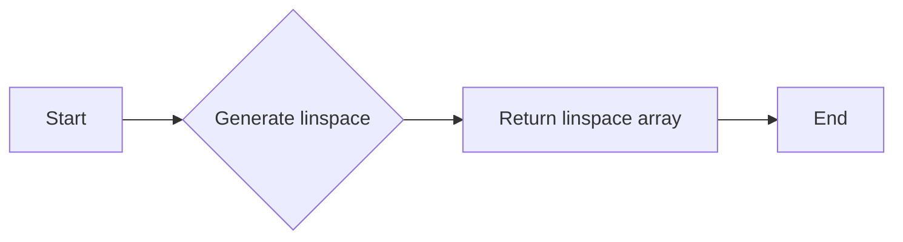
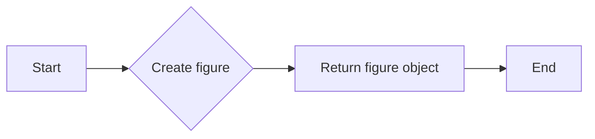
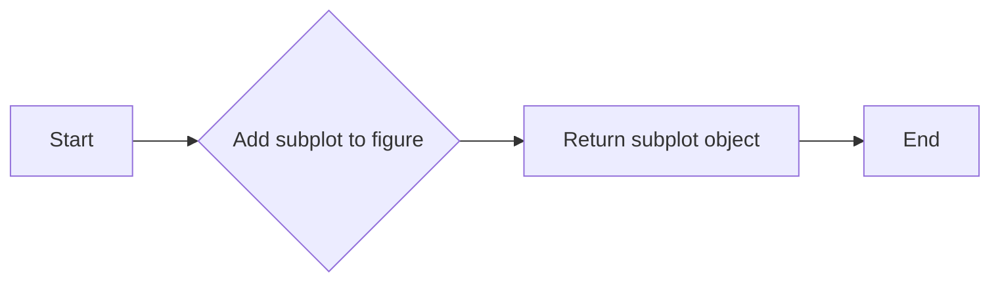
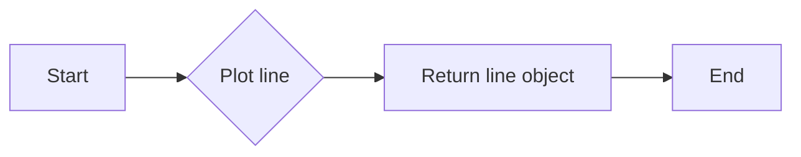
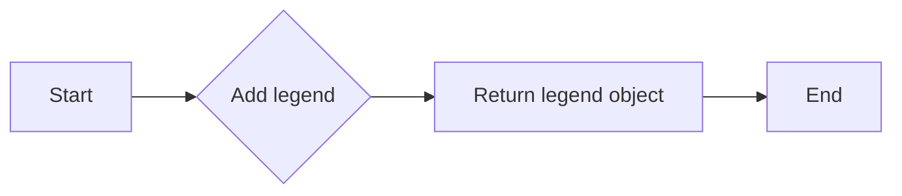
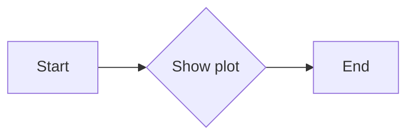
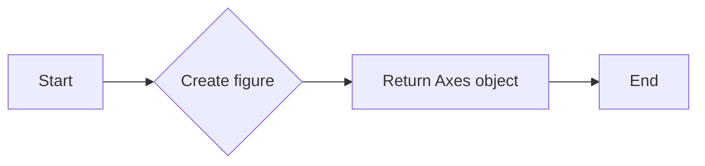
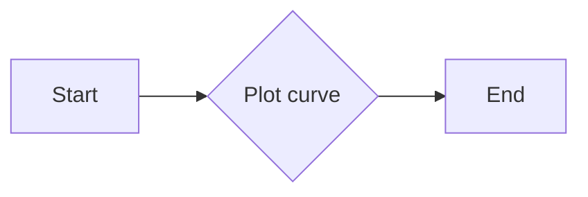
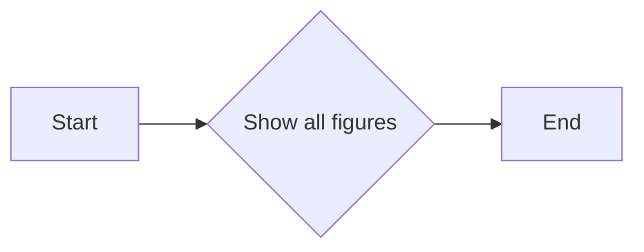

# `matplotlib\galleries\examples\mplot3d\lines3d.py` 详细设计文档

This code generates a 3D plot of a parametric curve using matplotlib and numpy.

## 整体流程



## 类结构

```
matplotlib.pyplot
├── figure()
│   └── add_subplot(projection='3d')
└── show()
```

## 全局变量及字段


### `ax`
    
3D axes object for plotting in matplotlib

类型：`matplotlib.pyplot.axes_3d.Axes3D`
    


### `theta`
    
Array of theta values for the parametric curve

类型：`numpy.ndarray`
    


### `z`
    
Array of z values for the parametric curve

类型：`numpy.ndarray`
    


### `r`
    
Array of r values calculated from z for the parametric curve

类型：`numpy.ndarray`
    


### `x`
    
Array of x values calculated from r and theta for the parametric curve

类型：`numpy.ndarray`
    


### `y`
    
Array of y values calculated from r and theta for the parametric curve

类型：`numpy.ndarray`
    


### `matplotlib.pyplot.figure.Figure.figure`
    
Figure object that contains all the plot elements

类型：`matplotlib.pyplot.figure.Figure`
    


### `matplotlib.pyplot.figure.Figure.add_subplot`
    
Method to add a subplot to the figure

类型：`function`
    


### `matplotlib.pyplot.figure.Figure.show`
    
Method to display the figure

类型：`function`
    
    

## 全局函数及方法


### np.linspace

`np.linspace` 是 NumPy 库中的一个函数，用于生成线性间隔的数组。

参数：

- `start`：`float`，起始值。
- `stop`：`float`，结束值。
- `num`：`int`，生成的数组中的元素数量。

参数描述：

- `start`：指定数组的起始值。
- `stop`：指定数组的结束值。
- `num`：指定数组中元素的数量。

返回值类型：`numpy.ndarray`

返回值描述：返回一个指定起始值、结束值和元素数量的线性间隔数组。

#### 流程图



#### 带注释源码

```python
import numpy as np

# Generate an array of 100 linearly spaced values between -4*pi and 4*pi
theta = np.linspace(-4 * np.pi, 4 * np.pi, 100)
```


### matplotlib.pyplot.figure

`matplotlib.pyplot.figure` 是 Matplotlib 库中的一个函数，用于创建一个新的图形窗口。

参数：

- 无

参数描述：无

返回值类型：`matplotlib.figure.Figure`

返回值描述：返回一个图形对象，可以用来添加轴、子图等。

#### 流程图



#### 带注释源码

```python
import matplotlib.pyplot as plt

# Create a new figure
fig = plt.figure()
```


### matplotlib.pyplot.figure.add_subplot

`matplotlib.pyplot.figure.add_subplot` 是 Matplotlib 库中的一个方法，用于向图形对象添加一个轴。

参数：

- `projection`：`str`，指定轴的投影类型。

参数描述：

- `projection`：指定轴的投影类型，例如 '3d' 用于三维图形。

返回值类型：`matplotlib.axes._subplots.AxesSubplot`

返回值描述：返回一个轴对象，可以用来绘制图形。

#### 流程图



#### 带注释源码

```python
import matplotlib.pyplot as plt

# Add a 3D subplot to the figure
ax = fig.add_subplot(projection='3d')
```


### matplotlib.pyplot.plot

`matplotlib.pyplot.plot` 是 Matplotlib 库中的一个函数，用于在轴上绘制二维线图。

参数：

- `x`：`array_like`，x轴数据。
- `y`：`array_like`，y轴数据。
- `label`：`str`，图例标签。

参数描述：

- `x`：x轴数据。
- `y`：y轴数据。
- `label`：图例标签。

返回值类型：`matplotlib.lines.Line2D`

返回值描述：返回一个线对象，可以用来添加图例、设置样式等。

#### 流程图



#### 带注释源码

```python
import matplotlib.pyplot as plt

# Plot a parametric curve in 3D
ax.plot(x, y, z, label='parametric curve')
```


### matplotlib.pyplot.legend

`matplotlib.pyplot.legend` 是 Matplotlib 库中的一个函数，用于在图形中添加图例。

参数：

- `labels`：`sequence`，图例标签。
- `loc`：`str`，图例位置。

参数描述：

- `labels`：图例标签。
- `loc`：图例位置。

返回值类型：`matplotlib.legend.Legend`

返回值描述：返回一个图例对象。

#### 流程图



#### 带注释源码

```python
import matplotlib.pyplot as plt

# Add a legend to the plot
ax.legend()
```


### matplotlib.pyplot.show

`matplotlib.pyplot.show` 是 Matplotlib 库中的一个函数，用于显示图形。

参数：

- 无

参数描述：无

返回值类型：`None`

返回值描述：无

#### 流程图



#### 带注释源码

```python
import matplotlib.pyplot as plt

# Show the plot
plt.show()
```


### 关键组件信息

- `np.linspace`：生成线性间隔的数组。
- `matplotlib.pyplot.figure`：创建一个新的图形窗口。
- `matplotlib.pyplot.figure.add_subplot`：向图形对象添加一个轴。
- `matplotlib.pyplot.plot`：在轴上绘制二维线图。
- `matplotlib.pyplot.legend`：在图形中添加图例。
- `matplotlib.pyplot.show`：显示图形。


### 潜在的技术债务或优化空间

- 代码中使用了硬编码的数值，例如 `4 * np.pi` 和 `-2`，这些值可以在函数参数中指定，以提高代码的灵活性和可重用性。
- 可以考虑将绘图代码封装到一个函数中，以便在不同的上下文中重用。
- 可以添加错误处理来确保输入参数的有效性。


### 设计目标与约束

- 设计目标：生成并绘制一个参数曲线。
- 约束：使用 NumPy 和 Matplotlib 库进行计算和绘图。


### 错误处理与异常设计

- 代码中没有显式的错误处理，但可以通过添加异常处理来确保输入参数的有效性。
- 可以使用 `try-except` 块来捕获并处理可能发生的异常。


### 数据流与状态机

- 数据流：从 `np.linspace` 生成线性间隔的数组，然后使用这些数组来计算曲线的 x、y 和 z 坐标，最后使用 `matplotlib.pyplot.plot` 绘制曲线。
- 状态机：代码中没有使用状态机，因为它是简单的线性流程。


### 外部依赖与接口契约

- 外部依赖：NumPy 和 Matplotlib 库。
- 接口契约：NumPy 和 Matplotlib 库的 API 文档定义了接口契约。
```


### np.sin

该函数计算输入角度的正弦值。

参数：

- `theta`：`numpy.ndarray`，输入的角度值数组，用于计算正弦值。

返回值：`numpy.ndarray`，与输入数组相同形状的正弦值数组。

#### 流程图

```mermaid
graph LR
A[Start] --> B{Is theta a numpy.ndarray?}
B -- Yes --> C[Calculate sin(theta)]
B -- No --> D[Error: Invalid input type]
C --> E[End]
D --> E
```

#### 带注释源码

```python
import numpy as np

def np_sin(theta):
    """
    Calculate the sine of an array of angles.
    
    Parameters:
    - theta: numpy.ndarray, the input array of angles.
    
    Returns:
    - numpy.ndarray, the array of sine values corresponding to the input angles.
    """
    return np.sin(theta)
```


### np.cos

`np.cos` 是 NumPy 库中的一个函数，用于计算输入数组中每个元素的余弦值。

参数：

- `theta`：`numpy.ndarray`，一个一维数组，包含要计算余弦值的输入角度。

返回值：`numpy.ndarray`，与输入数组相同形状的数组，包含每个输入角度的余弦值。

#### 流程图

```mermaid
graph TD
A[Start] --> B[Input: theta]
B --> C[Calculate: cos(theta)]
C --> D[Output: cos(theta)]
D --> E[End]
```

#### 带注释源码

```python
import numpy as np

# Prepare arrays x, y, z
theta = np.linspace(-4 * np.pi, 4 * np.pi, 100)
z = np.linspace(-2, 2, 100)
r = z**2 + 1
x = r * np.sin(theta)
y = r * np.cos(theta)  # Calculate the cosine of theta

# The rest of the code is for plotting the 3D parametric curve
ax = plt.figure().add_subplot(projection='3d')
ax.plot(x, y, z, label='parametric curve')
ax.legend()
plt.show()
```


### plt.figure()

该函数用于创建一个新的图形窗口，并返回一个Axes对象。

参数：

- 无

返回值：`Axes`，一个Axes对象，用于绘制图形。

#### 流程图



#### 带注释源码

```python
import matplotlib.pyplot as plt

# 创建一个新的图形窗口
fig = plt.figure()

# 返回一个Axes对象
ax = fig.add_subplot(projection='3d')
```


### ax.plot(x, y, z, label='parametric curve')

该函数用于在3D坐标系中绘制参数曲线。

参数：

- `x`：`numpy.ndarray`，x坐标的值。
- `y`：`numpy.ndarray`，y坐标的值。
- `z`：`numpy.ndarray`，z坐标的值。
- `label`：`str`，曲线的标签。

返回值：无

#### 流程图



#### 带注释源码

```python
# 绘制参数曲线
ax.plot(x, y, z, label='parametric curve')
```


### plt.show()

该函数用于显示所有图形。

参数：

- 无

返回值：无

#### 流程图



#### 带注释源码

```python
# 显示所有图形
plt.show()
```


### 关键组件信息

- `matplotlib.pyplot`：用于创建图形和可视化数据的库。
- `numpy`：用于科学计算和数据分析的库。

一句话描述：matplotlib.pyplot.figure用于创建一个新的图形窗口，并返回一个Axes对象，用于绘制图形。


### 潜在的技术债务或优化空间

- 代码中使用了硬编码的参数值，如`-4 * np.pi`和`4 * np.pi`，这些值可能需要根据具体情况进行调整。
- 代码中没有使用异常处理来处理可能出现的错误，如文件无法打开或图形无法显示。
- 代码中没有使用日志记录来记录程序的运行状态。


### 设计目标与约束

- 设计目标：创建一个3D参数曲线的图形。
- 约束：使用matplotlib.pyplot库进行图形绘制。


### 错误处理与异常设计

- 代码中没有使用异常处理来处理可能出现的错误。
- 建议在代码中添加异常处理来捕获和处理可能出现的错误。


### 数据流与状态机

- 数据流：从numpy生成x, y, z坐标，然后使用matplotlib.pyplot绘制图形。
- 状态机：程序从创建图形开始，然后绘制曲线，最后显示图形。


### 外部依赖与接口契约

- 外部依赖：matplotlib.pyplot和numpy。
- 接口契约：matplotlib.pyplot.figure和matplotlib.pyplot.show。
```


### matplotlib.pyplot.add_subplot

matplotlib.pyplot.add_subplot 是一个用于创建子图的方法。

参数：

- `projection`：`str`，指定子图的投影类型，例如 '3d' 用于三维图形。

返回值：`matplotlib.axes.Axes`，返回创建的子图对象。

#### 流程图

```mermaid
graph LR
A[Start] --> B{Call matplotlib.pyplot.figure()}
B --> C{Call matplotlib.pyplot.add_subplot(projection='3d')}
C --> D[Return Axes object]
D --> E[End]
```

#### 带注释源码

```python
import matplotlib.pyplot as plt

# 创建一个图形对象
fig = plt.figure()

# 在图形中添加一个子图，投影类型为3D
ax = fig.add_subplot(projection='3d')
```


### plt.show()

显示matplotlib图形的窗口。

参数：

- 无

返回值：无

#### 流程图


#### 带注释源码

```python
plt.show()  # 显示matplotlib图形的窗口
```


## 关键组件


### 张量索引与惰性加载

张量索引与惰性加载是用于处理大型数据集时的高效数据访问策略，它允许在需要时才计算数据，从而减少内存消耗和提高性能。

### 反量化支持

反量化支持是指系统对量化操作的反向操作，即从量化后的数据恢复到原始数据，以便进行进一步的处理或分析。

### 量化策略

量化策略是指将浮点数数据转换为固定点数表示的方法，以减少数据存储和计算所需的资源，同时保持足够的精度。通常包括定点量化、整数量化等策略。


## 问题及建议


### 已知问题

-   {问题1}：代码中使用了全局变量 `ax`，这可能导致代码的可重用性和可测试性降低。全局变量可能会在代码的不同部分被意外修改，从而引起难以追踪的错误。
-   {问题2}：代码没有进行任何错误处理，如果 `matplotlib` 或 `numpy` 库无法正常工作，程序可能会崩溃。
-   {问题3}：代码没有提供任何用户输入或配置选项，这意味着曲线的参数（如 `theta` 和 `z` 的范围）是硬编码的，缺乏灵活性。

### 优化建议

-   {建议1}：将全局变量 `ax` 移除，改为在需要的地方创建新的 `Axes3D` 对象，以提高代码的可重用性和可测试性。
-   {建议2}：添加错误处理机制，例如使用 `try-except` 块来捕获可能发生的异常，并给出友好的错误信息。
-   {建议3}：允许用户通过参数配置曲线的参数，例如通过命令行参数或配置文件，以提高代码的灵活性。
-   {建议4}：考虑使用面向对象的方法来封装曲线的生成和绘图逻辑，以便更好地组织代码并提高可维护性。
-   {建议5}：如果代码被用于教学或演示，可以考虑添加注释来解释代码的工作原理，帮助用户理解。


## 其它


### 设计目标与约束

- 设计目标：实现一个能够绘制3D参数曲线的函数，并展示其图形。
- 约束条件：使用matplotlib库进行图形绘制，不使用额外的图形库。

### 错误处理与异常设计

- 错误处理：代码中未包含显式的错误处理机制。
- 异常设计：如果matplotlib库不可用，代码将抛出ImportError异常。

### 数据流与状态机

- 数据流：用户输入参数曲线的参数，通过数学公式计算x, y, z坐标，最后通过matplotlib绘制图形。
- 状态机：代码没有使用状态机，它是一个简单的线性流程。

### 外部依赖与接口契约

- 外部依赖：matplotlib库用于图形绘制。
- 接口契约：matplotlib的接口用于创建图形和添加曲线。


    