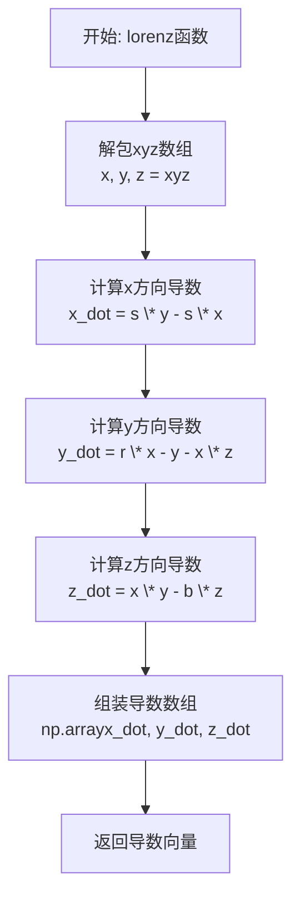

# `matplotlib\galleries\examples\mplot3d\lorenz_attractor.py` 详细设计文档

该代码实现了一个经典的混沌系统——Lorenz吸引子的数值计算与3D可视化。通过定义Lorenz微分方程，使用欧拉法进行数值积分，计算并绘制出Lorenz吸引子在三维空间中的轨迹曲线。

## 整体流程

```mermaid
graph TD
    A[开始] --> B[导入依赖模块]
    B --> C[定义lorenz函数]
    C --> D[设置参数: dt=0.01, num_steps=10000]
    D --> E[初始化xyzs数组]
    E --> F{i < num_steps?}
    F -- 是 --> G[调用lorenz计算偏导数]
    G --> H[更新坐标: xyzs[i+1] = xyzs[i] + lorenz(xyzs[i]) * dt]
    H --> I[i = i + 1]
    I --> F
    F -- 否 --> J[创建3D图形]
    J --> K[绘制轨迹曲线]
    K --> L[设置坐标轴标签和标题]
    L --> M[显示图形]
```

## 类结构

```
无类定义
└── 模块级脚本
    ├── 全局函数: lorenz()
    ├── 全局变量: dt, num_steps, xyzs
    └── 绘图代码: matplotlib 3D可视化
```

## 全局变量及字段


### `dt`
    
时间步长，控制数值积分的精度

类型：`float`
    


### `num_steps`
    
迭代次数，决定轨迹点的数量

类型：`int`
    


### `xyzs`
    
存储所有时间点的三维坐标，形状为(num_steps+1, 3)

类型：`numpy.ndarray`
    


    

## 全局函数及方法


### `lorenz`

计算Lorenz吸引子在三维空间给定点的偏导数（即三个方向的速度分量），用于数值积分求解Lorenz常微分方程系统。

参数：

- `xyz`：`array-like, shape (3,)`，三维空间中的兴趣点，包含x、y、z坐标
- `s`：`float`，Lorenz吸引子参数（默认10），控制x方向的速度衰减率
- `r`：`float`，Lorenz吸引子参数（默认28），控制系统对流强度（Rayleigh数）
- `b`：`float`，Lorenz吸引子参数（默认2.667），控制几何参数

返回值：`ndarray, shape (3,)`，Lorenz吸引子在给定点的偏导数值数组 `[x_dot, y_dot, z_dot]`

#### 流程图



#### 带注释源码

```python
def lorenz(xyz, *, s=10, r=28, b=2.667):
    """
    计算Lorenz吸引子的偏导数（速度分量）
    
    Parameters
    ----------
    xyz : array-like, shape (3,)
       三维空间中的兴趣点 [x, y, z]
    s, r, b : float
       Lorenz吸引子的三个标准参数:
       - s: 普兰特尔数（Prandtl number），默认10
       - r: 瑞利数（Rayleigh number），默认28  
       - b: 几何参数，默认2.667

    Returns
    -------
    xyz_dot : array, shape (3,)
       Lorenz吸引子方程在点xyz处的偏导数向量 [dx/dt, dy/dt, dz/dt]
    """
    # 从输入数组解包出x, y, z坐标
    x, y, z = xyz
    
    # dx/dt = s * (y - x)
    # x方向的速度等于 s 乘以 (y - x)，表示x方向的对流和扩散
    x_dot = s*(y - x)
    
    # dy/dt = r * x - y - x * z
    # y方向的速度由三部分组成：瑞利数驱动的增长、线性衰减、x与z的耦合
    y_dot = r*x - y - x*z
    
    # dz/dt = x * y - b * z
    # z方向的速度由x和y的乘积驱动（能量输入），减去几何衰减
    z_dot = x*y - b*z
    
    # 将三个方向的速度分量组装成NumPy数组返回
    return np.array([x_dot, y_dot, z_dot])
```

## 关键组件


### lorenz 函数

计算 Lorenz 吸引子系统的偏导数（微分方程），输入三维空间中的一个点及系统参数(s, r, b)，返回该点处三个方向的速度分量。

### 数值积分循环

使用欧拉法（Euler method）对 Lorenz 微分方程进行时间离散化，通过迭代计算从初始状态出发，经过指定步数(num_steps)演化得到整个轨迹数据(xyzs数组)。

### 3D可视化模块

利用 Matplotlib 的 mplot3d 库创建三维坐标系，将计算得到的 Lorenz 吸引子轨迹绘制为线条图，并设置坐标轴标签和标题。

### 全局配置参数

包括时间步长 dt=0.01（控制数值积分精度）和迭代步数 num_steps=10000（决定轨迹长度），两者共同影响最终可视化的完整性与计算效率。

### 初始状态向量

设置 Lorenz 系统运行的初始条件 xyz[0] = (0., 1., 1.05)，该初始点位于吸引子附近的特定位置，决定系统演化的轨道路径。


## 问题及建议


### 已知问题

- **硬编码参数**：Lorenz系统的参数(s=10, r=28, b=2.667)、时间步长(dt=0.01)和迭代次数(num_steps=10000)均以魔法数字形式硬编码，缺乏可配置性
- **数值积分精度不足**：使用简单欧尔(Euler)方法进行ODE求解，精度较低且数值不稳定，代码注释中已提及可使用SciPy但未采用
- **缺少类型注解**：函数参数和返回值均无类型提示，降低了代码可读性和IDE支持
- **无异常处理机制**：文件读写、绘图等操作均未做异常捕获，可能导致程序崩溃
- **循环未向量化**：主循环使用Python for循环而非NumPy向量化操作，在大规模迭代时性能较差
- **无单元测试**：缺乏测试用例覆盖，无法验证数值计算正确性
- **全局变量污染**：xyzs作为全局NumPy数组存储于模块级别，缺乏封装
- **缺少日志记录**：无日志系统，难以追踪运行状态和调试

### 优化建议

- **参数配置化**：使用argparse或配置类将系统参数、可视化选项提取为可配置项
- **提升数值精度**：使用scipy.integrate.odeint或solve_ivp替代欧尔方法，提高计算精度和稳定性
- **添加类型注解**：为函数添加typing模块的类型提示，包括ndarray的具体dtype
- **向量化计算**：将迭代循环改为NumPy向量运算或使用scipy.integrate.odeint一次计算全部轨迹
- **封装为类**：将 Lorenz 轨迹生成和可视化封装为独立类，提供配置、计算、绘图接口
- **增加错误处理**：对输入参数范围做校验，对文件操作、绘图异常进行捕获
- **添加基础单元测试**：使用pytest对lorenz函数返回值维度、已知固定点进行验证

## 其它


### 设计目标与约束

**设计目标**：实现Edward Lorenz 1963年提出的"Deterministic NonPeriodic Flow"（确定性非周期流）的三维可视化，即Lorenz吸引子的绘制。

**约束条件**：
- 依赖仅包括NumPy和Matplotlib，不使用SciPy的ODE求解器
- 使用欧拉法进行数值积分（简单但精度有限）
- 参数固定：s=10, r=28, b=2.667（经典的Lorenz系统参数）

### 错误处理与异常设计

- **输入验证**：lorenz函数接受array-like输入，但未进行类型和形状检查，可能在输入非三维向量时产生误导性错误
- **数值溢出**：当步数过多或dt过大时，数值积分可能发散，未进行边界检查
- **绘图错误**：Matplotlib显示失败时（如无GUI环境），程序会以静默方式终止

### 外部依赖与接口契约

- **numpy**：用于数组操作和数值计算
- **matplotlib.pyplot**：用于3D绘图
- **接口契约**：lorenz函数输入三维向量，返回三维导数向量

### 性能考量

- 数值积分循环使用纯Python实现，10000步尚可接受，更大规模计算建议使用NumPy向量化或Numba加速
- 3D绘图大量数据点（10000个）可能影响渲染性能，可考虑降采样

### 数值稳定性分析

- 使用一阶欧拉法，dt=0.01，对于Lorenz系统是合理的步长，但非最优
- 长期积分会有累积误差，高精度需求建议使用Runge-Kutta方法

### 可测试性

- lorenz函数为纯函数，便于单元测试，可验证特定输入的输出
- 主程序包含数值计算和可视化，难以进行自动化测试

### 参考文献

- Lorenz, E. N. (1963). "Deterministic Nonperiodic Flow". Journal of the Atmospheric Sciences.


    