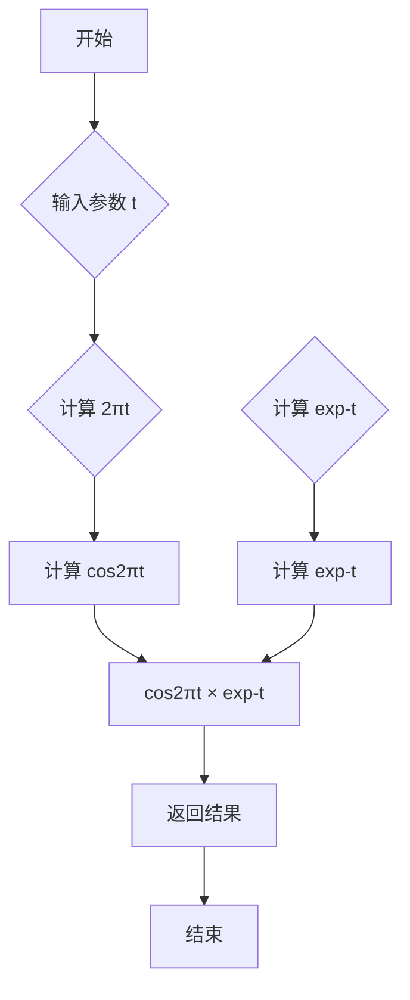

# `matplotlib\galleries\examples\mplot3d\mixed_subplots.py` 详细设计文档

该代码展示了如何在matplotlib的同一个Figure中同时绘制2D和3D图表，通过创建两个子图分别显示阻尼振荡曲线和3D表面图。

## 整体流程

```mermaid
graph TD
    A[开始] --> B[导入依赖库]
    B --> C[定义函数f(t)计算阻尼振荡]
    C --> D[创建Figure并设置尺寸]
D --> E[创建第一个2D子图]
E --> F[生成时间序列数据t1, t2, t3]
F --> G[绘制2D曲线]
G --> H[设置2D图表属性]
H --> I[创建第二个3D子图]
I --> J[生成网格数据X, Y]
J --> K[计算R和Z值]
K --> L[绘制3D表面图]
L --> M[设置3D图表属性]
M --> N[调用plt.show()显示图形]
N --> O[结束]
```

## 类结构

```
该代码为脚本式程序，未使用面向对象设计
无类层次结构
主要流程：函数定义 -> Figure创建 -> 子图添加 -> 数据绘制 -> 图形显示
```

## 全局变量及字段


### `fig`
    
matplotlib图形对象，作为整个图形的容器

类型：`matplotlib.figure.Figure`
    


### `ax`
    
第一个子图的2D坐标轴对象

类型：`matplotlib.axes.Axes`
    


### `ax_3d`
    
第二个子图的3D坐标轴对象

类型：`matplotlib.axes.Axes3D`
    


### `t1`
    
一维数组，时间范围0.0到5.0，步长0.1

类型：`numpy.ndarray`
    


### `t2`
    
一维数组，时间范围0.0到5.0，步长0.02

类型：`numpy.ndarray`
    


### `t3`
    
一维数组，时间范围0.0到2.0，步长0.01

类型：`numpy.ndarray`
    


### `X`
    
二维数组，从-5到5的网格数据

类型：`numpy.ndarray`
    


### `Y`
    
二维数组，从-5到5的网格数据

类型：`numpy.ndarray`
    


### `R`
    
二维数组，计算点到原点的距离

类型：`numpy.ndarray`
    


### `Z`
    
二维数组，R的正弦值（表面高度）

类型：`numpy.ndarray`
    


### `surf`
    
3D表面图对象

类型：`matplotlib.collections.Poly3DCollection`
    


    

## 全局函数及方法


### `f`

该函数计算阻尼振荡结果，返回 cos(2πt) * exp(-t) 的值，用于演示matplotlib中2D和3D子图的绘制。

参数：

- `t`：`numpy.ndarray` 或 `float`，时间参数，用于计算阻尼振荡的输入值

返回值：`numpy.ndarray` 或 `float`，返回阻尼振荡的计算结果，即 cos(2πt) * exp(-t)

#### 流程图



#### 带注释源码

```python
def f(t):
    """
    计算阻尼振荡函数
    
    参数:
        t: numpy.ndarray 或 float 时间参数
        
    返回:
        阻尼振荡值: cos(2πt) * exp(-t)
    """
    # 计算余弦部分: 2πt 表示一个周期内的角度
    # cos函数产生周期性振荡
    cosine_part = np.cos(2 * np.pi * t)
    
    # 计算指数衰减部分: exp(-t) 随时间增加而衰减
    # 用于模拟阻尼效果，使振荡逐渐消失
    exponential_decay = np.exp(-t)
    
    # 两者相乘得到阻尼振荡结果
    return cosine_part * exponential_decay
```

---

### 关键组件信息

| 名称 | 描述 |
|------|------|
| `f(t)` | 核心阻尼振荡计算函数 |
| `matplotlib.pyplot` | 用于创建图形和子图 |
| `numpy` | 用于数值计算和数组操作 |

---

### 潜在的技术债务或优化空间

1. **缺乏输入验证**：函数未对输入类型进行检查，可能导致运行时错误
2. **无文档字符串完整注释**：虽然有简单注释，但缺少详细的参数说明和返回值说明
3. **硬编码参数**：振荡频率(2π)和阻尼系数(1)硬编码在函数内，可考虑参数化
4. **无单元测试**：缺少对该函数的单元测试

---

### 其它项目

**设计目标与约束**：
- 目标：计算阻尼振荡数学函数，用于绘图演示
- 约束：输入必须是数值类型（float或numpy.ndarray）

**错误处理与异常设计**：
- 未实现异常处理，可能在输入非法类型时抛出numpy或Python异常

**数据流与状态机**：
- 简单的数学函数，无复杂状态管理
- 输入 → 计算 → 输出 的单向数据流

**外部依赖与接口契约**：
- 依赖 `numpy` 库
- 输入：数值或numpy数组
- 输出：与输入形状相同的numpy数组或float值

## 关键组件


### Figure对象 (fig)

matplotlib的Figure对象，作为整个图形的容器，通过figaspect(2.)创建了一个宽度一半高度的figure，并设置了总标题。

### 2D坐标轴 (ax - 第一个子图)

使用add_subplot(2,1,1)创建的二维坐标轴，用于绘制2D图形，包含网格、Y轴标签和两条曲线。

### 3D坐标轴 (ax - 第二个子图)

使用add_subplot(2,1,2,projection='3d')创建的三维坐标轴，用于绘制3D表面图，设置Z轴范围。

### 2D绘图函数 (ax.plot)

使用matplotlib的plot方法绘制两条2D曲线，一条使用蓝色圆点标记('bo')，另一条使用绿色标记的黑色虚线('--')。

### 3D表面图 (ax.plot_surface)

使用plot_surface方法绘制三维表面，基于X、Y网格数据和Z = sin(R)计算结果，使用rstride和cstride控制采样步进。

### 网格生成 (np.meshgrid)

使用numpy的meshgrid函数生成X、Y坐标网格，用于3D表面图的数据准备。

### 数学函数 (f)

定义了一个阻尼振荡函数 f(t) = cos(2πt) * exp(-t)，用于生成示例数据。

### 数据数组 (t1, t2, t3)

三个不同采样间隔的numpy数组，用于展示不同精度下的函数图像效果。


## 问题及建议


### 已知问题

- **硬编码的魔法数字和字符串**：代码中存在大量硬编码的数值（如 `5.0`、`0.1`、`0.02`、`-5`、`5`、`0.25`、`-1`、`1`）和字符串（如 `'bo'`、`'k--'`、`'green'`），缺乏可配置性和可读性
- **缺乏类型注解**：所有函数和变量均未添加类型提示（type hints），不利于静态分析和IDE辅助
- **缺少模块化和函数封装**：核心绘图逻辑全部在顶层执行，未封装为可复用的函数，难以进行单元测试和二次开发
- **重复计算风险**：`np.meshgrid(X, Y)` 生成的网格数据未做缓存或优化，`f(t)` 函数可能被重复调用
- **3D绘图性能配置不当**：使用 `rstride=1, cstride=1` 和 `linewidth=0, antialiased=False` 可能导致大数据集时性能问题
- **缺乏错误处理**：对输入参数（如数组维度、负值步长等）没有验证，运行时可能产生难以追踪的错误
- **全局导入模式**：使用 `import matplotlib.pyplot as plt` 和 `import numpy as np`，在大型项目中建议采用更精确的导入或使用相对导入

### 优化建议

- **提取配置参数**：将颜色、步长、范围等硬编码值提取为模块级常量或配置文件
- **添加类型注解**：为函数参数和返回值添加 `typing` 模块的类型提示
- **函数封装**：将子图创建逻辑封装为独立函数，如 `create_2d_subplot()` 和 `create_3d_subplot()`
- **性能优化**：对3D图采用适当的 `rstride` 和 `cstride` 值（如5-10），并考虑使用 `linewidth` 合理设置
- **添加输入验证**：在 `f(t)` 函数中添加参数类型和值范围的检查
- **使用 Enum 或 dataclass**：定义颜色方案、线型等可枚举的配置选项
- **文档增强**：为关键函数添加 NumPy 风格的文档字符串，说明参数、返回值和示例

## 其它


### 设计目标与约束

本示例的设计目标是演示如何在单个matplotlib图形窗口中同时展示2D和3D图表。约束条件包括：使用matplotlib作为唯一可视化库，图形尺寸比例为1:2（宽:高），2D子图位于上半部分，3D子图位于下半部分。

### 错误处理与异常设计

本代码主要依赖matplotlib和numpy库进行错误处理。潜在的异常情况包括：numpy的数学运算异常（如除零、溢出）、matplotlib图形创建失败、内存不足导致大数据集无法处理等。代码未显式实现异常捕获机制，属于简单的演示脚本。

### 数据流与状态机

数据流如下：
1. 2D数据生成：t1、t2、t3数组通过f(t)函数转换为对应的y值
2. 3D数据生成：通过meshgrid生成X、Y网格，计算R和Z值
3. 图形渲染：2D数据通过ax.plot()渲染，3D数据通过ax.plot_surface()渲染

状态机包含三个状态：初始化状态（创建图形和子图）、绘制状态（数据可视化）、显示状态（plt.show()渲染到屏幕）

### 外部依赖与接口契约

主要依赖包括：
- matplotlib.pyplot：图形创建和显示
- numpy：数值计算和数据生成
- mpl_toolkits.mplot3d：3D绘图支持（通过projection='3d'激活）

接口契约：f(t)函数接受numpy数组输入，返回相同形状的numpy数组；fig返回matplotlib.figure.Figure对象；ax返回axes.Axes或Axes3D对象

### 配置参数说明

关键配置参数：
- figsize=(plt.figaspect(2.))：图形高度为宽度的2倍
- rstride=1, cstride=1：3D表面的行/列步长
- antialiased=False：关闭3D表面的抗锯齿以提高性能
- grid(True)：启用2D子图的网格线
- set_zlim(-1, 1)：设置3D子图的z轴范围

    