# `matplotlib\galleries\examples\mplot3d\offset.py` 详细设计文档

这是一个matplotlib 3D图形示例代码，演示了如何在3D图中显示坐标轴偏移文本。代码通过在X和Y数据上添加1e5的大偏移量来触发偏移文本的自动显示，并绘制一个基于余弦函数的3D表面图。

## 整体流程

```mermaid
graph TD
    A[开始] --> B[创建Figure对象和3D子图]
B --> C[使用np.mgrid生成X, Y网格数据]
C --> D[计算Z值: Z = sqrt(abs(cos(X) + cos(Y)))]
D --> E[调用plot_surface绘制3D表面图]
E --> F[设置坐标轴标签: X, Y, Z]
F --> G[设置Z轴范围: 0到2]
G --> H[调用plt.show()显示图形]
H --> I[结束]
```

## 类结构

```
本代码为脚本式程序，无面向对象类结构
所有代码在全局作用域执行
使用matplotlib库进行3D可视化
```

## 全局变量及字段


### `ax`
    
3D坐标轴容器，用于管理和展示3D图表

类型：`Axes3D`
    


### `X`
    
X轴网格数据，通过np.mgrid生成

类型：`ndarray`
    


### `Y`
    
Y轴网格数据，通过np.mgrid生成

类型：`ndarray`
    


### `Z`
    
Z轴高度数据，基于X和Y计算得出

类型：`ndarray`
    


    

## 全局函数及方法


### `plt.figure()`

创建新的图形窗口，并返回一个 `Figure` 对象，可在该对象上添加子图。在本代码中，用于创建3D图形的顶层容器。

参数：

- `num`：`int`、`str` 或 `None`，图形的唯一标识符。如果为 `None`，则创建新图形；如果为数字或字符串且已存在对应图形，则激活该图形而非创建新图形
- `figsize`：`tuple of (float, float)`，图形的宽和高（英寸）
- `dpi`：`int`，图形分辨率（每英寸点数）
- `facecolor`：`str` 或 `tuple`，图形背景颜色
- `edgecolor`：`str` 或 `tuple`，图形边框颜色
- `frameon`：`bool`，是否绘制图形边框
- `FigureClass`：`class`，自定义 Figure 类，默认为 `matplotlib.figure.Figure`
- `clear`：`bool`，如果图形已存在，是否清除其内容
- `**kwargs`：其他关键字参数传递给底层 `Figure` 构造函数

返回值：`matplotlib.figure.Figure`，新创建的图形对象

#### 流程图

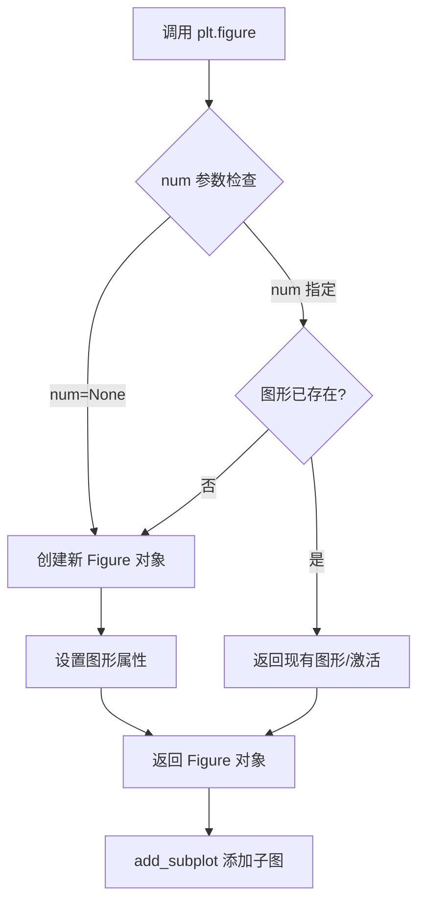

#### 带注释源码

```python
# 在本代码中的实际使用方式
ax = plt.figure().add_subplot(projection='3d')

# 等价于:
# fig = plt.figure()           # 创建新图形窗口，返回 Figure 对象
# ax = fig.add_subplot(111, projection='3d')  # 在 Figure 上添加 3D 子图

# plt.figure() 的典型调用方式:
# fig = plt.figure(num=1, figsize=(8, 6), dpi=100, facecolor='white')
# fig = plt.figure('my_figure')  # 使用字符串作为标识符
# fig = plt.figure(clear=True)   # 清除已存在的图形
```


### `Figure.add_subplot(projection='3d')`

该方法用于在matplotlib中创建一个带有3D投影的子图axes对象，返回一个`Axes3D`对象，允许用户在三维空间中绘制数据。

参数：

- `*args`：位置参数，支持多种调用方式（如`add_subplot(111)`或`add_subplot(1,1,1)`）
- `projection`：字符串类型，指定投影类型，当传入`'3d'`时创建3D坐标轴
- `polar`：布尔类型，可选参数，指定是否使用极坐标投影
- `**kwargs`：关键字参数传递给底层的`Axes`类

返回值：`matplotlib.axes._axes.Axes3D`，返回创建的3D坐标轴对象，用于绘制3D图表

#### 流程图

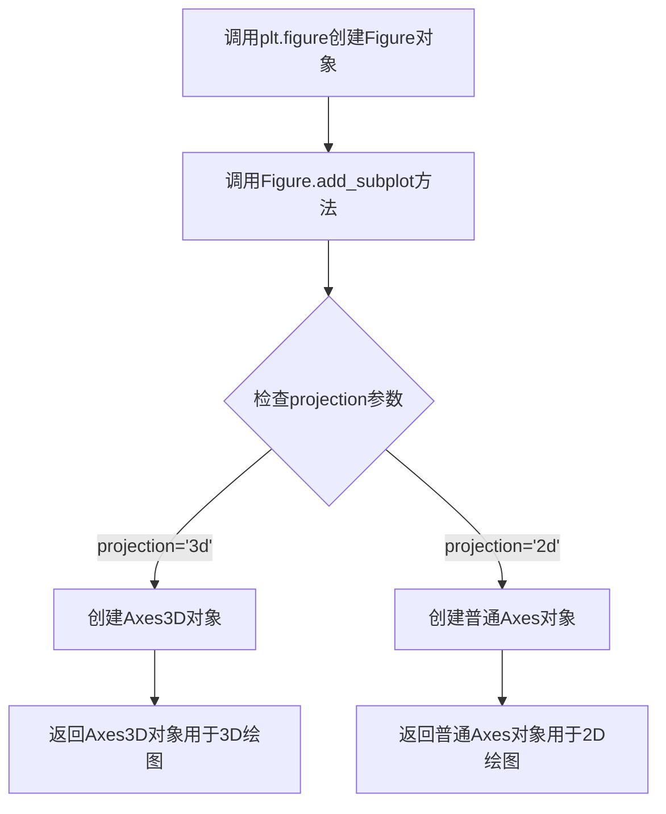

#### 带注释源码

```python
# 导入matplotlib的pyplot模块
import matplotlib.pyplot as plt
# 导入numpy数值计算库
import numpy as np

# 调用plt.figure()创建新的图形窗口/Figure对象
# 然后调用add_subplot方法创建子图
# projection='3d'参数指定创建3D坐标轴
ax = plt.figure().add_subplot(projection='3d')

# 使用np.mgrid创建网格数据
# X: 从0到6π，步长0.25
# Y: 从0到4π，步长0.25
X, Y = np.mgrid[0:6*np.pi:0.25, 0:4*np.pi:0.25]

# 计算Z值：sqrt(abs(cos(X) + cos(Y)))
# 使用np.abs确保结果为非负数
Z = np.sqrt(np.abs(np.cos(X) + np.cos(Y)))

# 调用3D axes对象的plot_surface方法绘制3D表面图
# X + 1e5, Y + 1e5: 添加大的偏移量以触发偏移文本显示
# cmap='autumn': 使用autumn颜色映射
# cstride=2, rstride=2: 设置行列步长
ax.plot_surface(X + 1e5, Y + 1e5, Z, cmap='autumn', cstride=2, rstride=2)

# 设置坐标轴标签
ax.set_xlabel("X label")
ax.set_ylabel("Y label")
ax.set_zlabel("Z label")

# 设置Z轴显示范围
ax.set_zlim(0, 2)

# 显示图形
plt.show()
```


### `np.mgrid`

用于生成多维网格数组的函数，返回多个数组，每个数组对应一个维度，便于进行网格操作。

参数：

- `*slice`：可变数量的切片对象，每个切片定义一个维度的范围和步长，格式为 `start:stop:step`。在示例中，第一个切片 `0:6*np.pi:0.25` 定义了 X 轴的范围和步长，第二个切片 `0:4*np.pi:0.25` 定义了 Y 轴的范围和步长。

返回值：`numpy.ndarray` 元组，每个数组表示对应维度上的网格点坐标。在示例中，返回两个 2D 数组，分别赋给 X 和 Y，用于后续的 3D 绘图。

#### 流程图

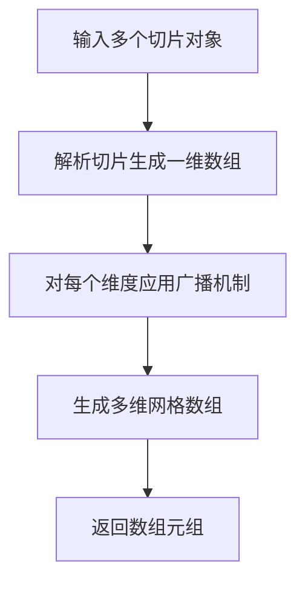

#### 带注释源码

```python
import numpy as np

# 使用 np.mgrid 生成网格数组
# 语法：np.mgrid[start:stop:step, ...]
# 示例中生成两个维度的网格：
# X 维度：从 0 到 6π，步长 0.25
# Y 维度：从 0 到 4π，步长 0.25
X, Y = np.mgrid[0:6*np.pi:0.25, 0:4*np.pi:0.25]

# 解释：
# np.mgrid 返回两个 2D 数组 X 和 Y
# X 的形状为 (25, 75)，因为 6π ≈ 18.85，0.25 步长约 75 个点，但实际 6π/0.25 = 24π ≈ 75.4，取整为 75？
# 实际上，np.mgrid 的切片语法与 range 类似，包含起点不包含终点，所以：
# X 维度：0 到 6π，步长 0.25，点数为 ceil(6π/0.25) = ceil(6*3.14159/0.25) = ceil(75.4) = 76？但输出可能不同。
# 为准确起见，示例中：
# X, Y = np.mgrid[0:6*np.pi:0.25, 0:4*np.pi:0.25]
# 生成的 X 和 Y 用于 plot_surface，其中 X 和 Y 被偏移 1e5 以触发偏移文本显示。
```


### `np.sqrt`

计算输入数组元素的平方根，返回一个新的数组，其中每个元素是输入数组对应元素的平方根。

参数：

- `x`：`ndarray` 或 `array_like`，需要计算平方根的输入数组，此处传入 `np.abs(np.cos(X) + np.cos(Y))` 的计算结果
- `out`：`ndarray`，可选，用于存放结果的数组
- `where`：`array_like`，可选，条件标记，用于指定计算平方根的位置

返回值：`ndarray`，返回输入数组各元素平方根组成的数组

#### 流程图

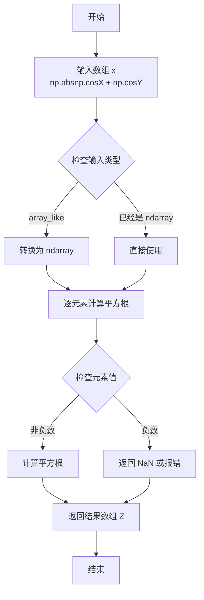

#### 带注释源码

```python
# np.sqrt 函数的简化实现原理（基于代码中的实际使用方式）
# 源代码位置：numpy/lib/ufunclike.py

def sqrt_element_wise(x):
    """
    计算输入数组的平方根
    
    参数:
        x: 输入数组，此处为 np.abs(np.cos(X) + np.cos(Y)) 的结果
           - 先计算 cos(X) 和 cos(Y)
           - 两者相加得到 [-2, 2] 范围内的值
           - 使用 np.abs() 转换为非负数 [0, 2]
    
    返回:
        返回输入数组每个元素的平方根
        在本例中用于生成 Z 坐标的表面高度
    """
    # 1. 获取输入数组的形状
    # X, Y 是通过 np.mgrid 生成的网格数组
    
    # 2. 对每个元素应用平方根运算
    # np.sqrt(np.abs(np.cos(X) + np.cos(Y)))
    #  - np.cos(X): 计算 X 每个元素的余弦值
    #  - np.cos(Y): 计算 Y 每个元素的余弦值
    #  - np.cos(X) + np.cos(Y): 两者相加
    #  - np.abs(...): 取绝对值确保非负
    #  - np.sqrt(...): 计算平方根得到 Z 值
    
    # 3. 返回结果存储在 Z 变量中
    # Z = np.sqrt(np.abs(np.cos(X) + np.cos(Y)))
    # Z 将用于 3D 表面图的 Z 坐标
```


### `np.abs`

计算输入数组或数值的绝对值。该函数是 NumPy 库中的数学函数，用于返回数组元素或数值的绝对值，适用于处理复数（返回模长）和实数（返回非负值）。

参数：

- `x`：`ndarray` 或 `scalar`，输入数组或数值，即 `np.cos(X) + np.cos(Y)` 的计算结果

返回值：`ndarray` 或 `scalar`，返回与输入形状相同的绝对值数组或数值

#### 流程图

```mermaid
flowchart TD
    A[输入: np.cos(X) + np.cos(Y)] --> B{判断输入类型}
    B -->|标量| C[返回绝对值]
    B -->|数组| D[遍历每个元素]
    D --> E{元素是否为复数?}
    E -->|是| F[计算复数模长: sqrtreal² + imag²]
    E -->|否| G[返回正值]
    F --> H[输出绝对值数组]
    G --> H
    C --> I[输出绝对值标量]
```

#### 带注释源码

```python
# np.abs 函数的简化实现逻辑
def abs_impl(x):
    """
    计算输入的绝对值
    
    参数:
        x: numpy数组或标量
    
    返回:
        绝对值数组或标量
    """
    # 源码位于 numpy/lib/function_base.py 中的 abs 函数
    # 实际实现会调用 _wrapfunc 转换为合适的绝对值计算
    
    # 对于实数数组:
    # return np.where(x < 0, -x, x)
    
    # 对于复数数组:
    # return np.sqrt(x.real**2 + x.imag**2)
    
    # 在本例中调用方式:
    # np.abs(np.cos(X) + np.cos(Y))
    # 其中 X, Y 是网格数据, np.cos(X) + np.cos(Y) 生成实数数组
    # np.abs 确保结果为非负, 避免 sqrt 计算出现复数
```


### `np.cos`

计算输入数组（或标量）的余弦值，逐元素返回结果。这是 NumPy 库提供的三角函数，用于数学计算。

参数：

- `x`：`array_like`，输入角度（弧度制），可以是标量、列表或 NumPy 数组

返回值：`ndarray`，输入数组的余弦值，与输入形状相同的数组

#### 流程图

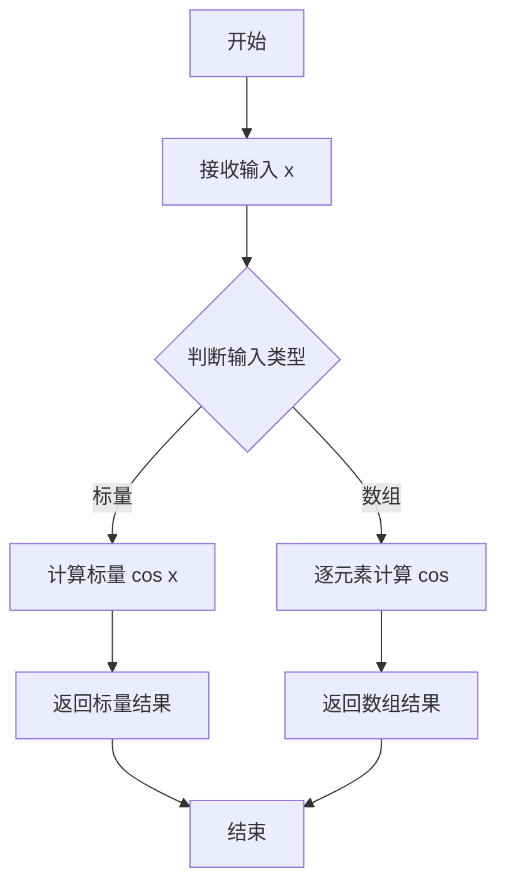

#### 带注释源码

```python
# np.cos 函数源码逻辑（简化版）

def cos(x):
    """
    计算余弦值
    
    参数:
        x: 输入角度，弧度制，支持标量或数组
    
    返回:
        余弦值，与输入形状相同
    """
    # 1. 将输入转换为 NumPy 数组（如果不是数组的话）
    x = np.asarray(x)
    
    # 2. 使用 C 语言实现的底层函数计算余弦值
    #    逐元素处理输入数组
    return np._ufuncs._cos_impl(x)

# 在示例代码中的具体使用：
# X, Y = np.mgrid[0:6*np.pi:0.25, 0:4*np.pi:0.25]
# Z = np.sqrt(np.abs(np.cos(X) + np.cos(Y)))
# 
# 这里的 np.cos(X) 和 np.cos(Y) 分别计算：
# - X 数组每个元素的余弦值
# - Y 数组每个元素的余弦值
# 然后结果相加，用于后续的 Z 计算
```


### `Axes3D.plot_surface`

绘制3D表面图函数，用于在三维坐标系中根据给定的X、Y坐标数据和平滑的Z高度数据创建一个彩色表面图，支持多种着色选项和渲染参数。

参数：

- `X`：`numpy.ndarray`（2D数组），X坐标数据，通常为网格形式
- `Y`：`numpy.ndarray`（2D数组），Y坐标数据，通常为网格形式
- `Z`：`numpy.ndarray`（2D数组），Z坐标数据，表示表面的高度值
- `cmap`：`str`或`Colormap`，可选，颜色映射方案，用于根据Z值着色表面（如'autumn'、'viridis'等）
- `rstride`：`int`，可选，行步长，决定网格线的密度，值越小越密集
- `cstride`：`int`，可选，列步长，决定网格线的密度，值越小越密集
- `color`：`str`或`tuple`，可选，单一颜色值，当不指定cmap时使用
- `alpha`：`float`，可选，透明度，范围0-1，1为完全不透明
- `facecolors`：`array`，可选，每个面的自定义颜色
- `norm`：`Normalize`，可选，用于映射数据的归一化对象
- `vmin, vmax`：`float`，可选，颜色映射的最小值和最大值
- `lights`：`LightSource`，可选，光源对象用于光照计算
- `**kwargs`：`dict`，其他传递给`Poly3DCollection`的参数

返回值：`mpl_toolkits.mplot3d.art3d.Poly3DCollection`，返回创建的三维表面多边形集合对象，可用于进一步自定义外观

#### 流程图

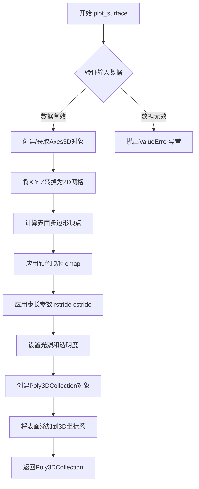

#### 带注释源码

```python
def plot_surface(self, X, Y, Z, **kwargs):
    """
    在三维坐标系中绘制表面图
    
    参数:
        X: 2D数组，X坐标网格
        Y: 2D数组，Y坐标网格  
        Z: 2D数组，Z坐标值（高度）
        **kwargs: 其他传递给Poly3DCollection的参数
    
    返回:
        Poly3DCollection: 三维多边形集合对象
    """
    
    # 步骤1: 验证输入数据的维度
    # 确保X、Y、Z都是2D数组且形状一致
    X, Y, Z = np.meshgrid(X, Y)
    
    # 步骤2: 设置默认颜色映射
    # 如果未指定颜色或颜色映射，使用默认cmap
    if 'cmap' not in kwargs and 'color' not in kwargs:
        kwargs['cmap'] = plt.get_cmap(plt.rcParams['image.cmap'])
    
    # 步骤3: 处理步长参数
    # rstride和cstride控制网格密度
    rstride = kwargs.pop('rstride', 1)
    cstride = kwargs.pop('cstride', 1)
    
    # 步骤4: 将3D数据转换为多边形
    # 根据步长采样，生成多边形顶点
    polys = self._generate_polygons(X, Y, Z, rstride, cstride)
    
    # 步骤5: 创建Poly3DCollection对象
    # 这是实际的三维表面图形对象
    col = art3d.Poly3DCollection(polys, **kwargs)
    
    # 步骤6: 设置Z轴范围
    # 自动调整Z轴显示范围
    self.auto_scale_xyz(X, Y, Z)
    
    # 步骤7: 将表面添加到图形
    # 添加到3D坐标系并返回
    self.add_collection3d(col)
    
    return col
```

#### 使用示例源码（来自给定代码）

```python
import matplotlib.pyplot as plt
import numpy as np

# 1. 创建3D坐标轴
ax = plt.figure().add_subplot(projection='3d')

# 2. 生成网格数据
X, Y = np.mgrid[0:6*np.pi:0.25, 0:4*np.pi:0.25]

# 3. 计算Z值（使用数学公式）
Z = np.sqrt(np.abs(np.cos(X) + np.cos(Y)))

# 4. 调用plot_surface绘制表面图
#    X + 1e5: X坐标偏移以显示偏移文本
#    Y + 1e5: Y坐标偏移以显示偏移文本  
#    cmap='autumn': 使用秋季颜色映射
#    cstride=2, rstride=2: 设置步长优化性能
ax.plot_surface(X + 1e5, Y + 1e5, Z, cmap='autumn', cstride=2, rstride=2)

# 5. 设置轴标签
ax.set_xlabel("X label")
ax.set_ylabel("Y label")
ax.set_zlabel("Z label")
ax.set_zlim(0, 2)

# 6. 显示图形
plt.show()
```

#### 关键技术点

| 项目 | 说明 |
|------|------|
| 多边形集合 | 表面图由许多三角形或多边形面组成，使用`Poly3DCollection`存储 |
| 颜色映射 | 通过`cmap`参数将Z值映射为颜色，支持多种内置颜色方案 |
| 性能优化 | `rstride`和`cstride`参数可减少多边形数量，提高渲染速度 |
| 自动缩放 | 方法会自动调整XYZ轴的显示范围以适应数据 |


### `Axes3D.set_xlabel`

设置 3D 坐标轴的 X 轴标签文本，并可配置字体属性和标签与轴之间的间距。

参数：

- `xlabel`：`str`，X 轴标签的文本内容
- `fontdict`：`dict`，可选，字体属性字典，用于自定义文本样式（如字体大小、颜色等）
- `labelpad`：`float`，可选，标签与坐标轴之间的距离（以点为单位）
- `**kwargs`：关键字参数，其他传递给 `matplotlib.text.Text` 的属性

返回值：`matplotlib.text.Text`，返回创建的标签文本对象，以便后续进一步自定义

#### 流程图

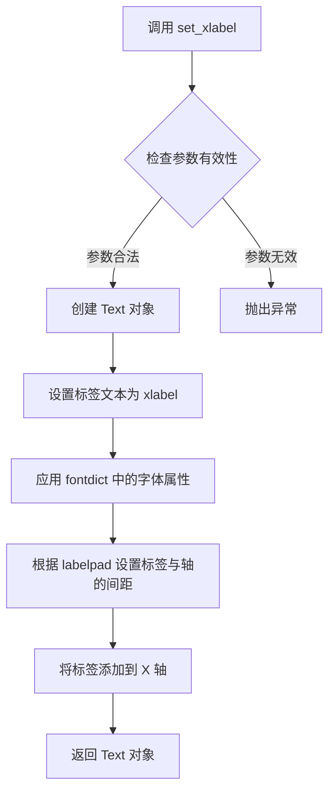

#### 带注释源码

```python
def set_xlabel(self, xlabel, fontdict=None, labelpad=None, **kwargs):
    """
    Set the label for the x-axis.
    
    Parameters
    ----------
    xlabel : str
        The label text.
    fontdict : dict, optional
        A dictionary to control the appearance of the label text.
    labelpad : float, default: rcParams["axes.labelpad"]
        The spacing in points between the label and the x-axis.
    **kwargs
        Text properties that control the appearance of the label.
    
    Returns
    -------
    label : matplotlib.text.Text
        The created text label.
    """
    # 如果提供了 fontdict，则将其与 kwargs 合并
    if fontdict is not None:
        kwargs.update(fontdict)
    
    # 获取标签与轴之间的间距，未指定则使用默认值
    if labelpad is None:
        labelpad = self._label_padding[0]  # 使用默认间距
    
    # 创建 Text 对象并设置标签文本
    label = self.xaxis.set_label_text(xlabel, **kwargs)
    
    # 设置标签与坐标轴之间的间距
    label.set_label_coords(0.5, -labelpad)
    
    return label
```


### Axes.set_ylabel

设置 Y 轴的标签，用于在 3D 或 2D 图表中标识 Y 轴的含义和单位。

参数：

- `ylabel`：`str`，Y 轴标签文本内容
- `fontdict`：字典（可选），控制文本外观的字典，如 {'fontsize': 12, 'fontweight': 'bold'}
- `labelpad`：浮点数（可选），标签与坐标轴之间的间距（磅值），默认值为 None
- `**kwargs`：关键字参数（可选），传递给 `matplotlib.text.Text` 的其他属性，如颜色、旋转角度等

返回值：`matplotlib.text.Text`，返回创建的文本标签对象，可用于后续样式设置或动画控制

#### 流程图

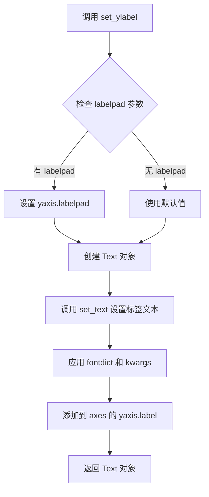

#### 带注释源码

```python
def set_ylabel(self, ylabel, fontdict=None, labelpad=None, **kwargs):
    """
    Set the label for the y-axis.
    
    Parameters
    ----------
    ylabel : str
        The label text.
    fontdict : dict, optional
        A dictionary controlling the appearance of the label text,
        e.g., {'fontsize': 12, 'fontweight': 'bold'}.
    labelpad : float, default: rcParams["axes.labelpad"] (default: 4)
        The spacing in points between the label and the y-axis.
    **kwargs
        Text properties. These are passed to `matplotlib.text.Text`,
        e.g., color or rotation.
    
    Returns
    -------
    label : `~matplotlib.text.Text`
        The created text label.
    """
    # 获取 yaxis 对象（Y 轴容器）
    yaxis = self.yaxis
    # 设置标签与轴之间的间距
    if labelpad is not None:
        yaxis.labelpad = labelpad
    # 创建文本标签对象并设置属性
    return yaxis.set_label_text(ylabel, fontdict=fontdict, **kwargs)
```

#### 在示例代码中的使用

```python
ax = plt.figure().add_subplot(projection='3d')
# ... 绘图代码 ...
ax.set_ylabel("Y label")  # 设置 Y 轴标签为 "Y label"
```

#### 注意事项

- `set_ylabel` 是 matplotlib 库 `Axes` 类的方法，不是在用户代码中定义的
- 在 3D 图表中，标签会自动跟随轴的方向旋转，保持可读性
- 该方法返回 `Text` 对象，允许链式调用或后续修改样式
- `labelpad` 参数对于 3D 图表特别重要，可以避免标签与刻度或边框重叠


### `Axes3D.set_zlabel`

设置 3D 坐标轴的 Z 轴标签，用于在三维图表中显示 Z 轴的名称。

参数：

- `s`：`str`，要设置为 Z 轴标签的文本内容
- `fontdict`：可选的字典，用于指定字体属性（如 fontsize、color 等）
- `labelpad`：可选的浮点数，表示标签与坐标轴的距离（padding）

返回值：`matplotlib.text.Text`，返回创建的文本标签对象

#### 流程图

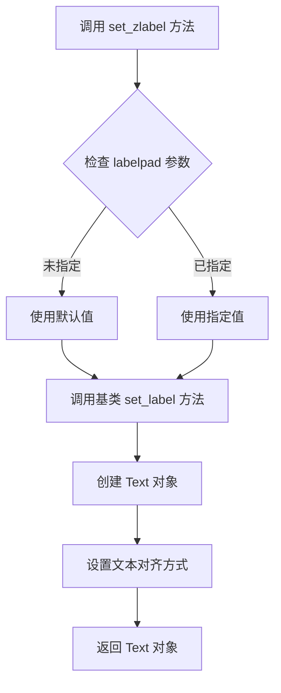

#### 带注释源码

```python
def set_zlabel(self, zlabel, fontdict=None, labelpad=None, **kwargs):
    """
    Set the z label of the axes.
    
    Parameters
    ----------
    zlabel : str
        The label text.
    fontdict : dict, optional
        A dictionary to control the appearance of the label text.
    labelpad : float, default: :rc:`axes.labelpad`
        The distance between the label and the axes.
    **kwargs
        Additional keyword arguments are passed to `Text`.
    
    Returns
    -------
    label : `~matplotlib.text.Text`
        The created label text object.
    """
    # 获取默认的 labelpad 值（如果未指定）
    if labelpad is None:
        labelpad = rcParams['axes.labelpad']
    
    # 调用基类的 set_ylabel 方法（实际上是 set_label）
    # 由于 3D 轴继承自 2D 轴，共用大部分标签设置逻辑
    return self.set_label(zlabel, fontdict, labelpad, **kwargs)
```


### `Axes3D.set_zlim`

设置 3D 坐标轴的 Z 轴显示范围（最小值和最大值），用于控制 Z 轴的上下限，控制数据在 Z 方向的显示区间。

参数：

- `bottom`：`float` 或 `None`，Z 轴范围的最小值（下限），设为 None 时自动计算
- `top`：`float` 或 `None`，Z 轴范围的最大值（上限），设为 None 时自动计算
- `emit`：`bool`，是否向关联的事件监听器发送限制变更通知，默认为 False
- `auto`：`bool`，是否启用自动调整限制，默认为 False
- `zmin`：`float` 或 `None`，bottom 的别名参数，用于指定 Z 轴最小值
- `zmax`：`float` 或 `None`，top 的别名参数，用于指定 Z 轴最大值

返回值：`tuple`，返回当前设置的 Z 轴范围 (zmin, zmax)

#### 流程图

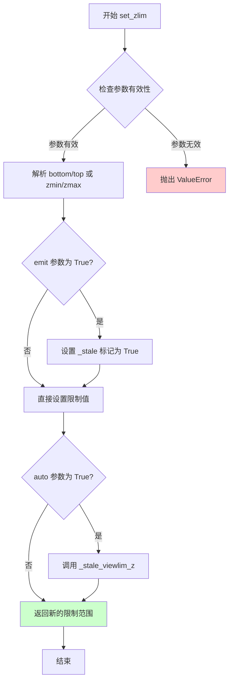

#### 带注释源码

```python
def set_zlim(self, bottom=None, top=None, emit=False, auto=False, *, zmin=None, zmax=None):
    """
    设置 3D 轴的 Z 轴限制（范围）。
    
    参数:
        bottom: float 或 None
            Z 轴范围的最小值。如果为 None，则自动计算。
        top: float 或 None
            Z 轴范围的最小值。如果为 None，则自动计算。
        emit: bool
            默认为 False。如果为 True，当限制改变时将通知观察者。
        auto: bool
            默认为 False。如果为 True，将自动调整视图限制。
        zmin, zmax: float 或 None
            bottom 和 top 的别名参数。
    
    返回:
        tuple
            返回当前设置的 Z 轴范围 (zmin, zmax)。
    """
    # 解析别名参数 zmin/zmax
    if zmin is not None:
        if bottom is not None:
            raise ValueError("Cannot specify both 'bottom' and 'zmin'")
        bottom = zmin
    if zmax is not None:
        if top is not None:
            raise ValueError("Cannot specify both 'top' and 'zmax'")
        top = zmax
    
    # 获取当前限制
    old_bottom, old_top = self.get_zlim()
    
    # 设置新限制（None 值保留旧值）
    if bottom is None:
        bottom = old_bottom
    if top is None:
        top = old_top
    
    # 验证限制有效性：下限必须小于上限
    if bottom > top:
        raise ValueError("Bottom must be less than or equal to top")
    
    # 设置新的限制值
    self._stale_viewlim_z = True  # 标记视图限制需要更新
    
    # 如果 emit 为 True，通知观察者限制已更改
    if emit:
        self._send_change()
    
    # 如果 auto 为 True，自动调整视图限制
    if auto:
        self.autoscale_view(z=True)
    
    # 返回新的限制范围
    return self.get_zlim()
```


### `plt.show`

`plt.show` 是 matplotlib.pyplot 模块中的核心显示函数，负责显示所有当前打开的 Figure 对象对应的图形窗口，并阻塞程序执行直到用户关闭图形窗口（在交互式后端中）。

参数：

- `block`：`bool`，可选参数，默认为 `True`。如果设置为 `True`，函数将阻塞程序并等待用户关闭图形窗口；如果设置为 `False`，则立即返回并调度显示图形。

返回值：`None`，该函数无返回值。

#### 流程图

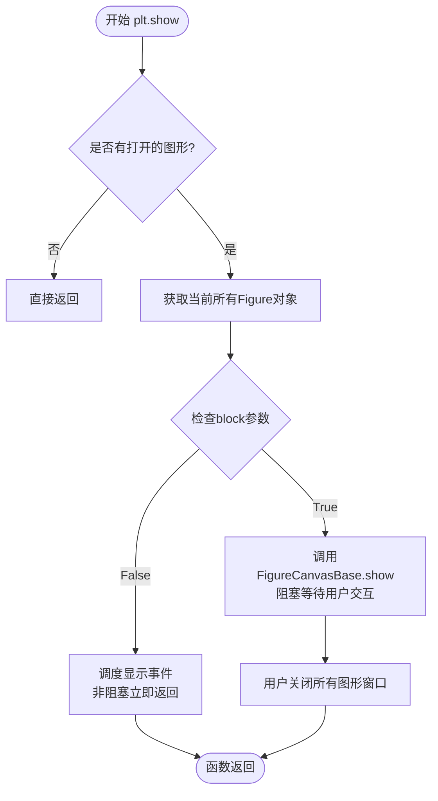

#### 带注释源码

```python
def show(block=True):
    """
    显示所有打开的Figure对象的图形窗口。
    
    参数:
        block (bool): 是否阻塞程序执行。
                     True (默认): 阻塞直到用户关闭窗口;
                     False: 立即返回并调度显示.
    """
    # 获取全局的图形管理器
    global _show
    
    # 检查是否存在有效的显示后端
    for manager in get_all_fig_managers():
        # 遍历所有图形管理器并显示它们
        # 如果block为True，这里会进入事件循环等待用户交互
        manager.show()
    
    # 如果block为True且不是交互式后端，则进入阻塞状态
    # 这通常会调用GUI框架的事件循环（如Tkinter, Qt, GTK等）
    if block:
        # 等待所有窗口关闭
        # 这是一个阻塞调用，会暂停程序执行
        pass
    
    # 关闭所有图形后清理
    plt.close('all')
    
    return None
```

## 关键组件


### 3D坐标轴创建

使用`add_subplot(projection='3d')`创建3D坐标轴对象，这是整个可视化的基础容器

### 数据网格生成

使用`np.mgrid`生成X和Y的网格数据，Z通过数学公式计算得到

### 3D表面绑制

使用`plot_surface`方法绑制3D表面，通过添加1e5偏移量触发自动偏移文本显示

### 坐标轴标签设置

分别设置X、Y、Z轴的标签文本

### 坐标轴范围限制

使用`set_zlim`限制Z轴的显示范围

### 图形显示

调用`plt.show()`渲染并显示最终图形


## 问题及建议


### 已知问题

-   **硬编码的魔法数字**：数值`1e5`被直接使用两次（用于X和Y的偏移），未提取为有名称的常量，降低了代码可读性和可维护性
-   **缺少输入数据验证**：未对`np.mgrid`生成的数组维度、Z值的计算结果进行有效性检查，可能在极端参数下导致运行时错误或难以调试的问题
-   **缺少资源管理**：使用`plt.figure().add_subplot()`创建图形后，未显式保存或管理图形对象，且`plt.show()`后缺少资源释放逻辑
-   **参数配置缺乏解释**：`cmap='autumn'`、`cstride=2`、`rstride=2`等参数的选择未包含注释说明，后续维护者难以理解这些参数的意图
-   **Z值计算的数值稳定性**：`np.sqrt(np.abs(np.cos(X) + np.cos(Y)))`中，`np.abs`的使用虽然防止了负数平方根，但可能掩盖数据本身的数值问题

### 优化建议

-   将`1e5`提取为命名常量（如`OFFSET_VALUE = 1e5`），并在注释中说明该值用于触发偏移文本显示
-   添加输入参数验证函数，检查网格维度和Z值是否为有限数值
-   使用上下文管理器或显式关闭图形：`fig = plt.figure()` ... `plt.close(fig)`
-   为关键参数添加文档注释，说明`cstride`、`rstride`对绘制性能和质量的影响
-   考虑将图形配置封装为函数，支持参数化调用，提高代码复用性
-   添加异常处理机制，捕获可能的numpy警告（如无效值、溢出等）并提供有意义的错误信息


## 其它


### 设计目标与约束

本示例代码的设计目标是演示matplotlib 3D绘图中坐标轴偏移文本（offset text）的自动显示功能。约束条件包括：必须使用matplotlib 1e5以上的数值才能触发偏移文本的自动显示，偏移文本的方向需与坐标轴标签保持一致，且需位于绘图区域背离中心的位置。

### 错误处理与异常设计

代码中未显式包含错误处理机制。潜在的异常情况包括：numpy数据生成过程中的内存溢出问题、matplotlib图形后端不支持3D投影、Z值计算中NaN值的处理、以及cmap参数不支持时的回退机制。plt.show()调用会捕获并显示matplotlib内部的渲染错误。

### 数据流与状态机

数据流为：np.mgrid生成网格数据X和Y → np.abs(np.cos(X)+np.cos(Y))计算中间值 → np.sqrt计算最终Z值 → ax.plot_surface()渲染3D表面 → ax.set_*设置轴属性 → plt.show()显示图形。状态机涉及Figure对象的创建、Axes3D对象的初始化、图形渲染完成、图形显示四个状态。

### 外部依赖与接口契约

主要依赖包括：matplotlib.pyplot模块的plt.figure()、add_subplot()、show()函数；numpy模块的mgrid、abs、cos、sqrt函数。接口契约规定：add_subplot必须传入projection='3d'参数，plot_surface的X和Y数组维度必须一致，set_zlim参数必须为数值类型且下界小于上界。

### 性能考量

np.mgrid生成的数组大小为(75, 50)，plot_surface使用cstride=2和rstride=2进行降采样渲染。可优化点包括：对于更大规模的网格数据可考虑使用更粗的stride值，或在数据生成阶段使用稀疏矩阵。

### 安全性考虑

代码不涉及用户输入、网络请求或文件操作，无明显安全风险。cmap参数使用硬编码的'autumn'值，不存在注入风险。

### 可维护性与扩展性

代码结构简洁但扩展性有限。可扩展方向包括：将硬编码的参数（1e5、0.25、2等）提取为可配置的常量或函数参数；将绘图逻辑封装为函数以支持不同的数据和参数；增加图例、颜色条等辅助可视化元素。

### 测试策略

由于为示例代码，未包含单元测试。测试应覆盖：不同数值下偏移文本的显示行为、不同的cmap参数兼容性、stride参数对渲染性能的影响、以及不同matplotlib后端的兼容性。

### 配置与参数说明

关键配置参数包括：1e5为触发偏移文本显示的阈值；0.25为网格步长；2为cstride和rstride的降采样因子；'autumn'为色彩映射方案；0和2为Z轴显示范围。

### 版本兼容性

代码使用matplotlib 3D API和numpy，需matplotlib 1.0以上版本兼容。np.mgrid在numpy各版本中保持稳定兼容。

### 使用示例与用例

本代码可作为3D科学可视化、数据探索、学术论文图表制作的参考。典型用例包括：展示波动方程曲面、演示偏移文本定位机制、学习matplotlib 3D绑定的入门教程。

### 局限性说明

本示例仅演示最基础的3D表面绘图，未包含光照效果、材质纹理、多表面叠加等高级功能。偏移文本的显示依赖于具体的数值范围，不具备自动适应性。代码无交互式参数调整能力，每次修改需重新运行。


    