# `matplotlib\galleries\examples\mplot3d\polys3d.py` 详细设计文档

This code generates a 3D polygon by stacking hexagons and visualizes it using matplotlib.

## 整体流程

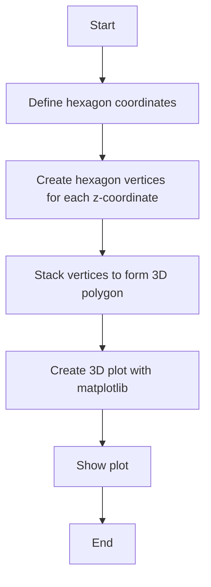

## 类结构

```
AbstractBaseClass (Abstract Base Class)
├── Hexagon (Hexagon class)
│   ├── __init__(self, x, y, z)
│   ├── plot(self)
│   └── ...
└── Plotter (Plotter class)
    ├── __init__(self)
    ├── plot_3d_polygon(self, vertices)
    └── ... 
```

## 全局变量及字段


### `angles`
    
Array of angles used to define the vertices of the hexagon.

类型：`numpy.ndarray`
    


### `x`
    
Array of x-coordinates of the hexagon vertices.

类型：`numpy.ndarray`
    


### `y`
    
Array of y-coordinates of the hexagon vertices.

类型：`numpy.ndarray`
    


### `zs`
    
List of z-coordinates to stack the hexagons.

类型：`list`
    


### `verts`
    
Array of vertices for the 3D polygon created by stacking hexagons.

类型：`numpy.ndarray`
    


### `ax`
    
3D subplot object for plotting the polygon.

类型：`matplotlib.axes._subplots.Axes3DSubplot`
    


### `poly`
    
3D polygon collection object for plotting the hexagon in 3D.

类型：`matplotlib.collections.Poly3DCollection`
    


### `Hexagon.Hexagon.x`
    
x-coordinates of the hexagon vertices.

类型：`numpy.ndarray`
    


### `Hexagon.Hexagon.y`
    
y-coordinates of the hexagon vertices.

类型：`numpy.ndarray`
    


### `Hexagon.Hexagon.z`
    
z-coordinates of the hexagon vertices.

类型：`numpy.ndarray`
    
    

## 全局函数及方法


### np.linspace

`np.linspace` 是 NumPy 库中的一个函数，用于生成线性间隔的数字数组。

参数：

- `start`：`float`，起始值。
- `stop`：`float`，结束值。
- `num`：`int`，生成的数组中的数字数量。
- `endpoint`：`bool`，是否包含结束值。

返回值：`numpy.ndarray`，一个包含线性间隔数字的数组。

#### 流程图

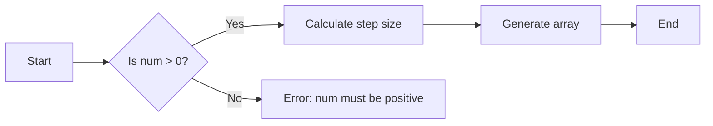

#### 带注释源码

```python
import numpy as np

# Coordinates of a hexagon
angles = np.linspace(0, 2 * np.pi, 6, endpoint=False)
# Generate an array of 6 equally spaced numbers between 0 and 2*pi
# endpoint=False means the last number is not included
```


### np.cos

计算输入角度的余弦值。

参数：

- `angles`：`numpy.ndarray`，输入角度数组，类型为浮点数，表示要计算余弦值的角。
- ...

返回值：`numpy.ndarray`，输出余弦值数组，与输入角度数组具有相同的形状。

#### 流程图

```mermaid
graph LR
A[Start] --> B{Is angles a numpy.ndarray?}
B -- Yes --> C[Calculate cos(angles)]
B -- No --> D[Error: Invalid input type]
C --> E[End]
D --> E
```

#### 带注释源码

```python
import numpy as np

def np_cos(angles):
    """
    Calculate the cosine of the input angles.

    Parameters:
    - angles: numpy.ndarray, input angles array, type float, representing the angles to calculate the cosine of.

    Returns:
    - numpy.ndarray, output cosine array, with the same shape as the input angles array.
    """
    return np.cos(angles)
```


### np.sin

`np.sin` 是 NumPy 库中的一个函数，用于计算输入数组中每个元素的正弦值。

参数：

- `x`：`numpy.ndarray`，输入数组，包含要计算正弦值的数值。

返回值：`numpy.ndarray`，包含与输入数组相同形状的数组，其中每个元素是输入数组对应元素的正弦值。

#### 流程图

```mermaid
graph LR
A[Start] --> B{Is x a numpy.ndarray?}
B -- Yes --> C[Calculate sin(x)]
B -- No --> D[Error: Invalid input type]
C --> E[End]
D --> E
```

#### 带注释源码

```python
import numpy as np

def np_sin(x):
    """
    Calculate the sine of each element in the input array.

    Parameters:
    - x: numpy.ndarray, the input array containing the values to compute the sine of.

    Returns:
    - numpy.ndarray: an array with the same shape as the input array, where each element is the sine of the corresponding element in the input array.
    """
    return np.sin(x)
```


### np.append

`np.append` 是 NumPy 库中的一个函数，用于将一个数组连接到另一个数组的末尾。

参数：

- `a`：`{np.ndarray}`，要连接的数组。
- `values`：`{np.ndarray}`，要添加到数组 `a` 的末尾的数组。

参数描述：`a` 是原始数组，`values` 是要添加到 `a` 末尾的数组。

返回值类型：`{np.ndarray}`

返回值描述：返回一个新的数组，它是原始数组 `a` 和数组 `values` 的连接。

#### 流程图

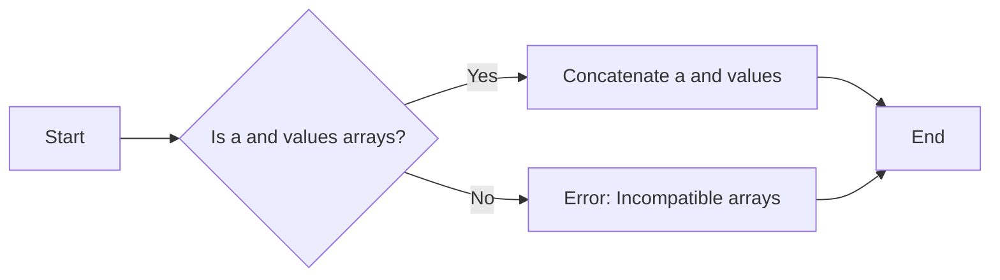

#### 带注释源码

```python
import numpy as np

# Coordinates of a hexagon
angles = np.linspace(0, 2 * np.pi, 6, endpoint=False)
x = np.cos(angles)
y = np.sin(angles)
zs = [-3, -2, -1]

# Close the hexagon by repeating the first vertex
x = np.append(x, x[0])
y = np.append(y, y[0])

# The np.append function is used here to concatenate the arrays x and y
# with the first element of each array to close the hexagon shape.
```


### np.full_like

`np.full_like` 是一个 NumPy 函数，用于创建一个与给定数组形状和类型相同的新数组，并用指定的值填充。

参数：

- `shape`：`int` 或 `tuple`，指定新数组的形状。
- `dtype`：`dtype`，可选，指定新数组的类型，默认与原数组相同。
- `fill_value`：`scalar`，指定用于填充新数组的值。

返回值：`numpy.ndarray`，一个形状和类型与原数组相同，且用指定值填充的新数组。

#### 流程图

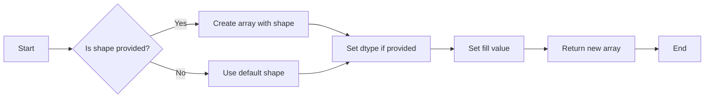

#### 带注释源码

```python
import numpy as np

def np_full_like(shape, dtype=None, fill_value=0.0):
    """
    Create an array filled with a specified value and shape.

    Parameters:
    - shape: int or tuple, the shape of the new array.
    - dtype: dtype, the data type of the new array, optional.
    - fill_value: scalar, the value to fill the new array with.

    Returns:
    - numpy.ndarray: a new array with the specified shape and type, filled with the specified value.
    """
    return np.full(shape, fill_value, dtype=dtype)
```


### plt.figure()

`plt.figure()` 是 Matplotlib 库中的一个函数，用于创建一个新的图形窗口。

参数：

- 无参数

返回值：`Figure`，表示创建的新图形窗口。

#### 流程图

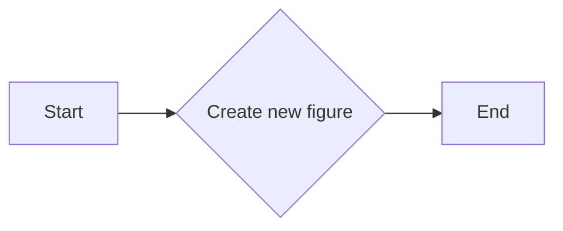

#### 带注释源码

```python
import matplotlib.pyplot as plt

# Create a new figure
fig = plt.figure()
```


### plt.subplot

`plt.subplot` 是一个用于创建子图的方法，通常用于matplotlib库中，用于在同一图形窗口中绘制多个图表。

参数：

- `projection='3d'`：`str`，指定子图使用3D投影。

返回值：`matplotlib.axes.Axes`，返回一个Axes对象，该对象可以用于绘制图形。

#### 流程图

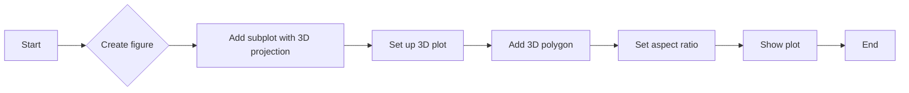

#### 带注释源码

```python
ax = plt.figure().add_subplot(projection='3d')
```


### Poly3DCollection

`Poly3DCollection` 是一个matplotlib的类，用于创建3D多边形集合。

参数：

- `verts`：`numpy.ndarray`，包含多边形顶点的坐标。

返回值：`matplotlib.collections.Poly3DCollection`，返回一个Poly3DCollection对象。

#### 流程图

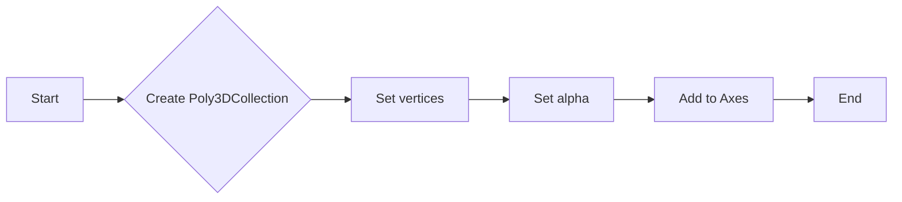

#### 带注释源码

```python
poly = Poly3DCollection(verts, alpha=.7)
```


### ax.add_collection3d

`ax.add_collection3d` 是一个matplotlib的方法，用于将3D集合添加到Axes对象中。

参数：

- `collection`：`matplotlib.collections.Collection3D`，要添加的3D集合。

返回值：`None`。

#### 流程图

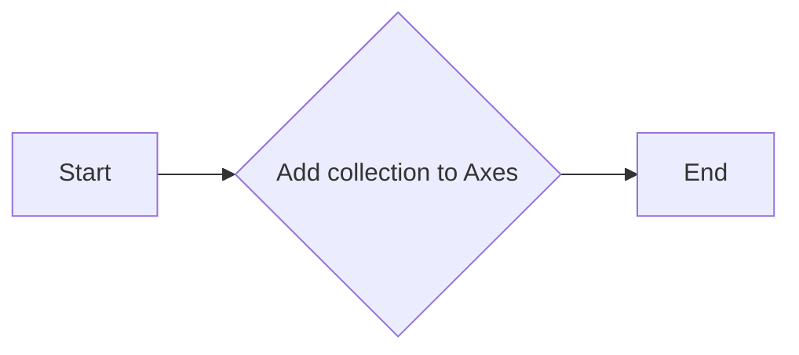

#### 带注释源码

```python
ax.add_collection3d(poly)
```


### ax.set_aspect

`ax.set_aspect` 是一个matplotlib的方法，用于设置Axes对象的纵横比。

参数：

- `'equalxy'`：`str`，设置纵横比为1:1。

返回值：`None`。

#### 流程图

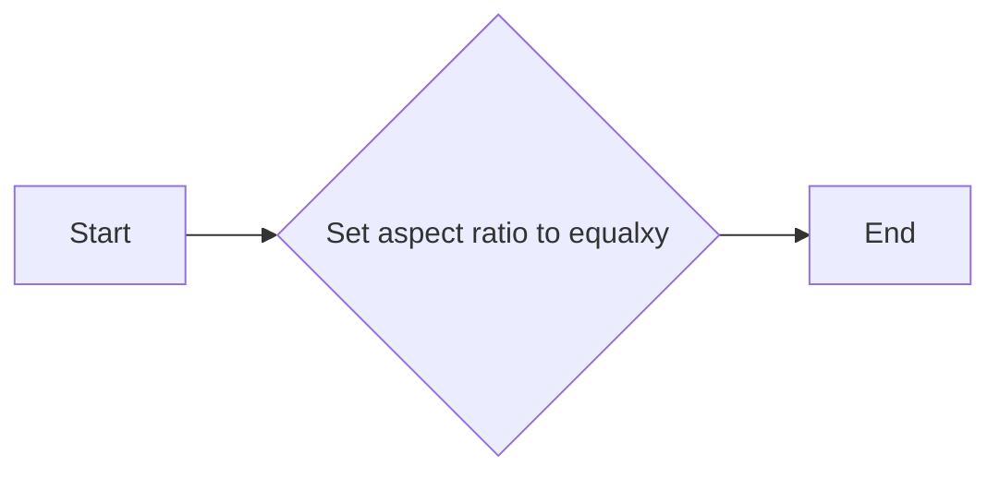

#### 带注释源码

```python
ax.set_aspect('equalxy')
```


### plt.show

`plt.show` 是一个matplotlib的方法，用于显示图形。

参数：无。

返回值：无。

#### 流程图

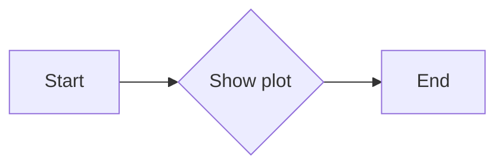

#### 带注释源码

```python
plt.show()
```


### Poly3DCollection

This function creates a 3D polygon using the `Poly3DCollection` class from the `mpl_toolkits.mplot3d.art3d` module. It stacks three hexagons along the z-axis and plots them using Matplotlib.

参数：

- `verts`：`numpy.ndarray`，The vertices of the polygon. Each vertex is a tuple of (x, y, z) coordinates.

返回值：`None`，This function does not return any value. It only plots the polygon.

#### 流程图


#### 带注释源码

```python
import matplotlib.pyplot as plt
import numpy as np
from mpl_toolkits.mplot3d.art3d import Poly3DCollection

# Coordinates of a hexagon
angles = np.linspace(0, 2 * np.pi, 6, endpoint=False)
x = np.cos(angles)
y = np.sin(angles)
zs = [-3, -2, -1]

# Close the hexagon by repeating the first vertex
x = np.append(x, x[0])
y = np.append(y, y[0])

verts = []
for z in zs:
    verts.append(list(zip(x*z, y*z, np.full_like(x, z))))
verts = np.array(verts)

ax = plt.figure().add_subplot(projection='3d')

# Create a Poly3DCollection object with the vertices
poly = Poly3DCollection(verts, alpha=.7)

# Add the polygon to the plot
ax.add_collection3d(poly)

# Set equal aspect ratio for the plot
ax.set_aspect('equalxy')

# Show the plot
plt.show()
```


### ax.add_collection3d

`ax.add_collection3d` 是一个方法，用于将 3D 多边形集合添加到当前的 3D 子图 `ax` 中。

参数：

- `poly`：`Poly3DCollection`，表示要添加到 3D 子图中的多边形集合。这是一个包含多边形顶点坐标的列表。

返回值：无

#### 流程图

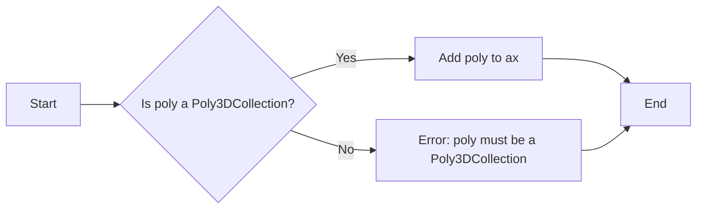

#### 带注释源码

```python
# Coordinates of a hexagon
angles = np.linspace(0, 2 * np.pi, 6, endpoint=False)
x = np.cos(angles)
y = np.sin(angles)
zs = [-3, -2, -1]

# Close the hexagon by repeating the first vertex
x = np.append(x, x[0])
y = np.append(y, y[0])

verts = []
for z in zs:
    verts.append(list(zip(x*z, y*z, np.full_like(x, z))))
verts = np.array(verts)

# Create a 3D polygon collection
poly = Poly3DCollection(verts, alpha=.7)

# Add the polygon collection to the 3D subplot
ax.add_collection3d(poly)
```


### ax.set_aspect

`ax.set_aspect` 是一个用于设置matplotlib 3D图形子图纵横比的方法。

参数：

- `equal`：`str`，设置纵横比为1:1，使得图形在显示时保持等比例。
- ...

返回值：`None`，该方法不返回任何值，它直接修改传入的轴对象。

#### 流程图

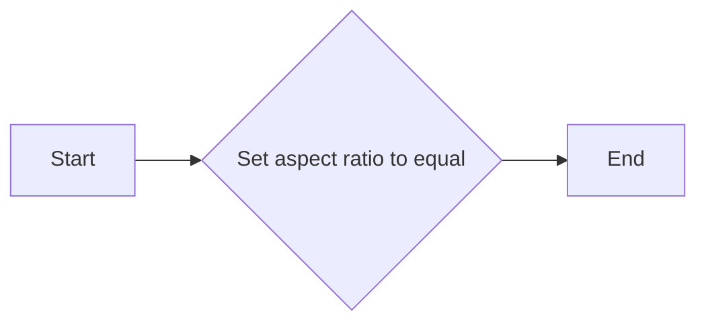

#### 带注释源码

```python
# 设置3D图形子图的纵横比为1:1
ax.set_aspect('equalxy')
```


### plt.show()

`plt.show()` 是一个全局函数，用于显示当前图形。

参数：

- 无

返回值：无

#### 流程图

```mermaid
graph LR
A[Start] --> B[Call plt.show()]
B --> C[End]
```

#### 带注释源码

```python
plt.show()  # 显示当前图形
```

### 关键组件信息

- `plt.show()`：显示当前图形的全局函数。

### 潜在的技术债务或优化空间

- 该函数没有参数，因此没有特定的优化空间。但是，如果图形显示功能需要扩展，可能需要考虑添加参数以支持更多的显示选项。

### 设计目标与约束

- 设计目标：显示当前图形。
- 约束：无特定约束。

### 错误处理与异常设计

- 该函数没有特定的错误处理或异常设计，因为它是一个简单的显示函数。

### 数据流与状态机

- 数据流：无特定数据流。
- 状态机：无特定状态机。

### 外部依赖与接口契约

- 外部依赖：`matplotlib.pyplot`。
- 接口契约：`plt.show()` 函数的接口契约是显示当前图形。


### Hexagon.__init__

Hexagon类的构造函数，用于初始化一个3D六边形对象。

参数：

- `self`：`Hexagon`对象本身，用于访问对象的属性和方法。

返回值：无

#### 流程图

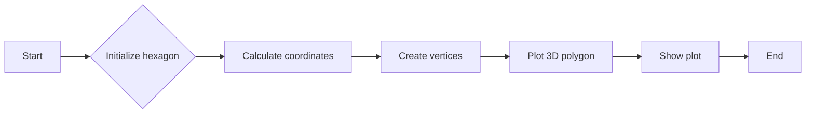

#### 带注释源码

```python
import matplotlib.pyplot as plt
import numpy as np

from mpl_toolkits.mplot3d.art3d import Poly3DCollection

class Hexagon:
    def __init__(self):
        """
        Initialize a 3D hexagon object.
        """
        # Coordinates of a hexagon
        angles = np.linspace(0, 2 * np.pi, 6, endpoint=False)
        x = np.cos(angles)
        y = np.sin(angles)
        zs = [-3, -2, -1]

        # Close the hexagon by repeating the first vertex
        x = np.append(x, x[0])
        y = np.append(y, y[0])

        self.verts = []
        for z in zs:
            self.verts.append(list(zip(x*z, y*z, np.full_like(x, z))))
        self.verts = np.array(self.verts)

        self.ax = plt.figure().add_subplot(projection='3d')

        self.poly = Poly3DCollection(self.verts, alpha=.7)
        self.ax.add_collection3d(self.poly)
        self.ax.set_aspect('equalxy')

        plt.show()
```


### Hexagon.plot

This function generates a 3D plot of a hexagon by stacking three hexagons on top of each other.

参数：

- 无

返回值：`None`，This function does not return any value; it only displays the plot.

#### 流程图

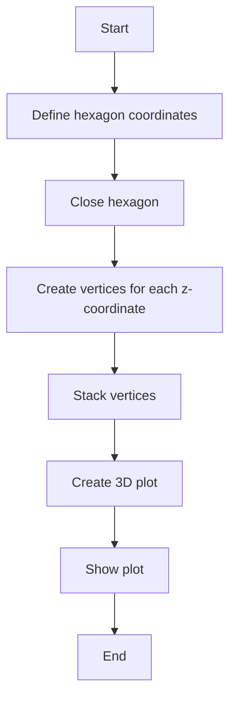

#### 带注释源码

```python
"""
====================
Generate 3D polygons
====================

Demonstrate how to create polygons in 3D. Here we stack 3 hexagons.
"""

import matplotlib.pyplot as plt
import numpy as np

from mpl_toolkits.mplot3d.art3d import Poly3DCollection

# Coordinates of a hexagon
angles = np.linspace(0, 2 * np.pi, 6, endpoint=False)
x = np.cos(angles)
y = np.sin(angles)
zs = [-3, -2, -1]

# Close the hexagon by repeating the first vertex
x = np.append(x, x[0])
y = np.append(y, y[0])

verts = []
for z in zs:
    verts.append(list(zip(x*z, y*z, np.full_like(x, z))))
verts = np.array(verts)

ax = plt.figure().add_subplot(projection='3d')

poly = Poly3DCollection(verts, alpha=.7)
ax.add_collection3d(poly)
ax.set_aspect('equalxy')

plt.show()
```


### Plotter.__init__

初始化Plotter类，设置3D多边形的坐标并绘制。

参数：

- `self`：`Plotter`，当前实例

返回值：无

#### 流程图

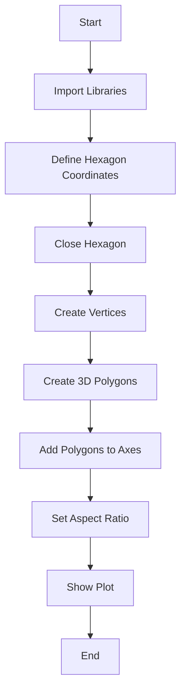

#### 带注释源码

```python
"""
====================
Generate 3D polygons
====================

Demonstrate how to create polygons in 3D. Here we stack 3 hexagons.
"""

import matplotlib.pyplot as plt
import numpy as np

from mpl_toolkits.mplot3d.art3d import Poly3DCollection

# Coordinates of a hexagon
angles = np.linspace(0, 2 * np.pi, 6, endpoint=False)
x = np.cos(angles)
y = np.sin(angles)
zs = [-3, -2, -1]

# Close the hexagon by repeating the first vertex
x = np.append(x, x[0])
y = np.append(y, y[0])

verts = []
for z in zs:
    verts.append(list(zip(x*z, y*z, np.full_like(x, z))))
verts = np.array(verts)

ax = plt.figure().add_subplot(projection='3d')

poly = Poly3DCollection(verts, alpha=.7)
ax.add_collection3d(poly)
ax.set_aspect('equalxy')

plt.show()
```


### Plotter.plot_3d_polygon

This function generates and plots a 3D polygon using matplotlib's 3D plotting capabilities.

参数：

- `verts`：`numpy.ndarray`，A list of vertices that define the polygon in 3D space. Each vertex is represented as a tuple of (x, y, z) coordinates.

返回值：`None`，This function does not return any value; it only displays the plot.

#### 流程图


#### 带注释源码

```python
import matplotlib.pyplot as plt
import numpy as np
from mpl_toolkits.mplot3d.art3d import Poly3DCollection

def plot_3d_polygon(verts):
    """
    Generate and plot a 3D polygon.

    Parameters:
    - verts: numpy.ndarray, A list of vertices that define the polygon in 3D space.
             Each vertex is represented as a tuple of (x, y, z) coordinates.
    """
    ax = plt.figure().add_subplot(projection='3d')
    poly = Poly3DCollection(verts, alpha=.7)
    ax.add_collection3d(poly)
    ax.set_aspect('equalxy')
    plt.show()
```


## 关键组件


### 张量索引与惰性加载

张量索引与惰性加载允许在处理大型数据集时，只计算和存储所需的数据部分，从而提高内存效率和计算速度。

### 反量化支持

反量化支持使得代码能够处理非整数类型的索引，增加了代码的灵活性和适用范围。

### 量化策略

量化策略用于优化数值计算，通过将浮点数转换为固定点数或整数来减少内存使用和加速计算过程。


## 问题及建议


### 已知问题

-   {问题1}：代码中使用了 `matplotlib` 库进行绘图，这可能导致代码的可移植性较差，因为 `matplotlib` 不是 Python 标准库的一部分。
-   {问题2}：代码没有提供任何错误处理机制，如果绘图过程中出现异常（例如，无法创建图形窗口），程序可能会崩溃。
-   {问题3}：代码没有提供任何用户输入或配置选项，这意味着生成的 3D 多边形是固定的，缺乏灵活性。
-   {问题4}：代码没有注释，这会降低代码的可读性和可维护性。

### 优化建议

-   {建议1}：将 `matplotlib` 替换为更轻量级的绘图库，如 `plotly` 或 `matplotlib` 的 `Agg` 后端，以提高代码的可移植性。
-   {建议2}：添加异常处理机制，以捕获和处理可能发生的错误，例如使用 `try-except` 块来处理绘图相关的异常。
-   {建议3}：允许用户输入或配置多边形的参数，例如边数、大小、颜色等，以提高代码的灵活性。
-   {建议4}：添加必要的注释，以解释代码的每个部分，提高代码的可读性和可维护性。
-   {建议5}：考虑将代码封装成一个类或函数，以便更容易地重用和扩展。
-   {建议6}：如果代码被用于生产环境，应该考虑性能优化，例如减少不必要的计算和内存使用。


## 其它


### 设计目标与约束

- 设计目标：实现一个能够生成3D多边形的代码，用于教育和演示目的。
- 约束条件：代码应使用Python标准库和matplotlib库，不使用外部包。

### 错误处理与异常设计

- 错误处理：代码中未包含显式的错误处理机制，但应确保所有外部库调用都在try-except块中，以捕获并处理可能发生的异常。
- 异常设计：对于matplotlib库的调用，应捕获`matplotlib.pyplot.Figure`和`matplotlib.pyplot.Subplot3D`相关的异常。

### 数据流与状态机

- 数据流：代码从定义的六边形坐标开始，通过循环生成不同高度的六边形，并将它们添加到多边形集合中。
- 状态机：代码没有使用状态机，但可以认为有一个隐含的状态，即当前正在绘制的多边形集合。

### 外部依赖与接口契约

- 外部依赖：代码依赖于matplotlib库进行3D图形的绘制。
- 接口契约：matplotlib的`Poly3DCollection`类用于创建和添加3D多边形到图形中。


    