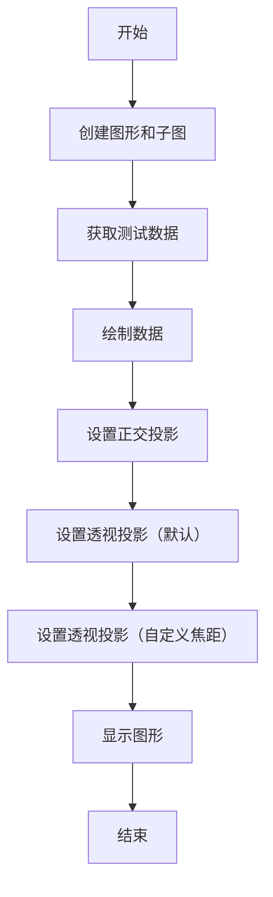
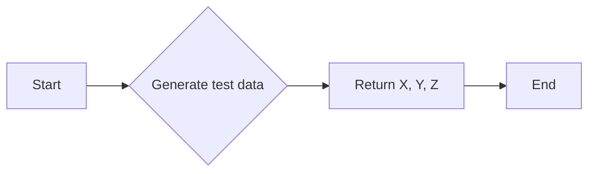

# `matplotlib\galleries\examples\mplot3d\projections.py` 详细设计文档

This code demonstrates different camera projections for 3D plots and the effects of changing the focal length for a perspective projection using Matplotlib.

## 整体流程



## 类结构

```
matplotlib.pyplot (全局模块)
├── axes3d (全局模块)
│   ├── fig (全局变量)
│   ├── axs (全局变量)
│   ├── X (全局变量)
│   ├── Y (全局变量)
│   └── Z (全局变量)
│   ├── plot_wireframe (全局函数)
│   └── get_test_data (全局函数)
└── plt (全局变量)
```

## 全局变量及字段


### `fig`
    
The main figure object created by plt.subplots() for plotting.

类型：`matplotlib.figure.Figure`
    


### `axs`
    
An array of axes objects, each representing a subplot in the figure.

类型：`numpy.ndarray of matplotlib.axes.Axes`
    


### `X`
    
The x-coordinates of the test data for the 3D plot.

类型：`numpy.ndarray`
    


### `Y`
    
The y-coordinates of the test data for the 3D plot.

类型：`numpy.ndarray`
    


### `Z`
    
The z-coordinates of the test data for the 3D plot.

类型：`numpy.ndarray`
    


### `plt`
    
The matplotlib.pyplot module, providing a high-level interface for drawing static, interactive, and animated plots with Matplotlib.

类型：`matplotlib.pyplot`
    


    

## 全局函数及方法


### plot_wireframe

`plot_wireframe` is a method used to plot a 3D wireframe of a surface defined by x, y, and z coordinates.

参数：

- `X`：`numpy.ndarray`，The x-coordinates of the vertices of the wireframe.
- `Y`：`numpy.ndarray`，The y-coordinates of the vertices of the wireframe.
- `Z`：`numpy.ndarray`，The z-coordinates of the vertices of the wireframe.
- `rstride`：`int`，The stride for the rows.
- `cstride`：`int`，The stride for the columns.

返回值：`None`，This method does not return any value.

#### 流程图


#### 带注释源码

```python
# Plot the data
for ax in axs:
    ax.plot_wireframe(X, Y, Z, rstride=10, cstride=10)
```


### get_test_data

This function generates test data for 3D plotting.

参数：

- `axes3d`: `Axes3DSubplot`，The 3D axes object from matplotlib's mplot3d toolkit.

返回值：`X, Y, Z`：`numpy.ndarray`，The test data for the X, Y, and Z coordinates of the 3D plot.

#### 流程图



#### 带注释源码

```python
from mpl_toolkits.mplot3d import axes3d

def get_test_data(axes3d):
    # Generate test data
    X, Y, Z = axes3d.get_test_data(0.05)
    return X, Y, Z
```


## 关键组件


### 张量索引与惰性加载

张量索引与惰性加载是用于处理和操作多维数据结构（如张量）的技术，它允许在数据未完全加载到内存中时进行索引和访问。

### 反量化支持

反量化支持是指系统或算法能够处理和解释量化后的数据，通常用于优化模型大小和加速计算。

### 量化策略

量化策略是指将浮点数数据转换为固定点数表示的方法，以减少模型大小和计算资源消耗。


## 问题及建议


### 已知问题

-   {问题1}：代码中使用了 `matplotlib` 库，这是一个外部依赖，可能会增加项目的复杂性和维护成本。
-   {问题2}：代码中使用了全局变量 `fig` 和 `axs`，这可能导致代码的可读性和可维护性降低，尤其是在大型项目中。
-   {问题3}：代码中使用了硬编码的标题和注释，这可能会在文档更新时导致不一致性。

### 优化建议

-   {建议1}：考虑将 `matplotlib` 替换为其他绘图库，如 `plotly` 或 `bokeh`，这些库可能提供更好的交互性和更现代的API。
-   {建议2}：将全局变量封装在类中，以提高代码的可读性和可维护性。
-   {建议3}：使用配置文件或环境变量来管理标题和注释，以便在文档更新时保持一致性。
-   {建议4}：添加错误处理和异常设计，以确保代码在遇到错误时能够优雅地处理。
-   {建议5}：考虑使用设计模式，如工厂模式或策略模式，来处理不同的投影类型，以提高代码的灵活性和可扩展性。
-   {建议6}：对代码进行性能分析，以识别和优化任何潜在的性能瓶颈。
-   {建议7}：编写单元测试，以确保代码的稳定性和可靠性。


## 其它


### 设计目标与约束

- 设计目标：实现一个3D图形投影类型展示，展示不同相机投影和改变透视投影焦距的效果。
- 约束条件：使用Matplotlib库进行图形绘制，确保代码简洁且易于理解。

### 错误处理与异常设计

- 错误处理：代码中未包含显式的错误处理机制，但应确保所有外部库调用都进行了异常捕获。
- 异常设计：对于可能出现的异常，如Matplotlib库的调用失败，应提供适当的错误消息和恢复策略。

### 数据流与状态机

- 数据流：数据流从Matplotlib库的3D数据生成函数开始，通过设置不同的投影类型和焦距，最终展示在图形界面上。
- 状态机：代码中没有明确的状态机，但可以通过设置不同的投影类型和焦距来模拟不同的状态。

### 外部依赖与接口契约

- 外部依赖：代码依赖于Matplotlib库进行3D图形的绘制。
- 接口契约：Matplotlib库的接口契约确保了代码的正确性和可维护性。


    