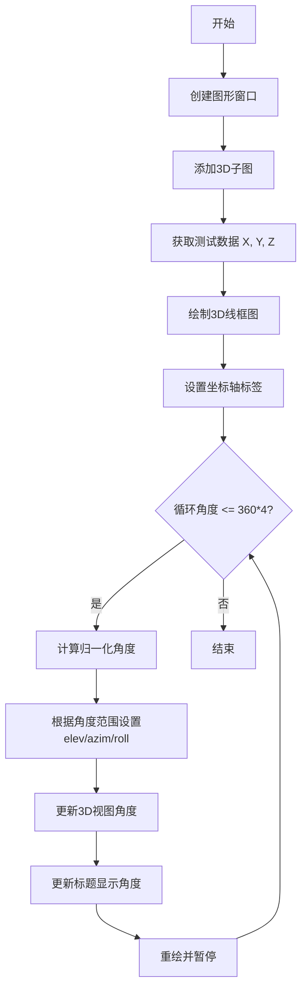
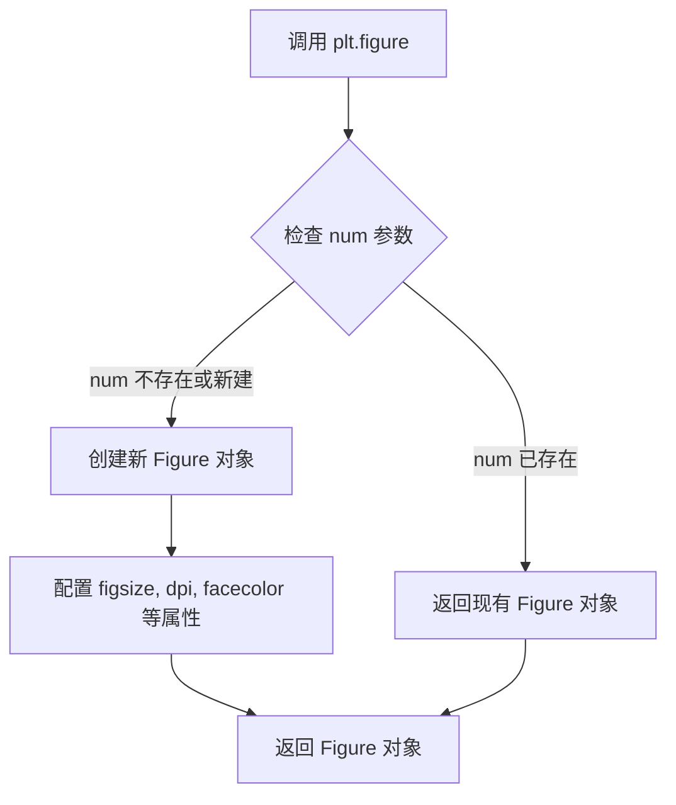
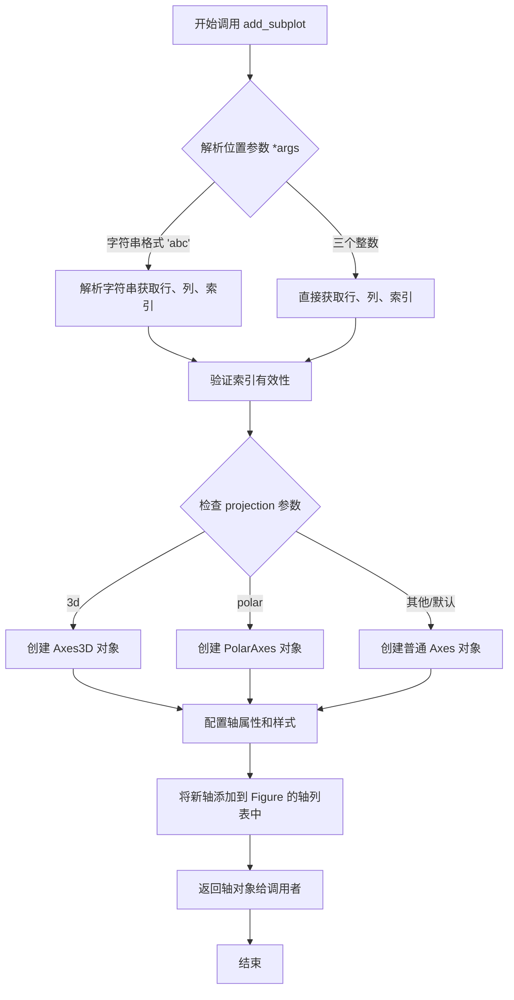
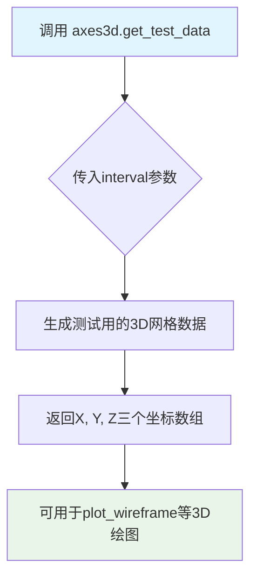
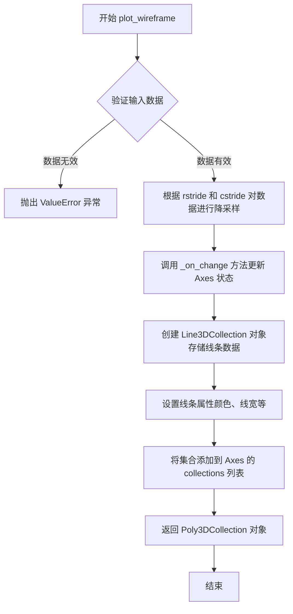
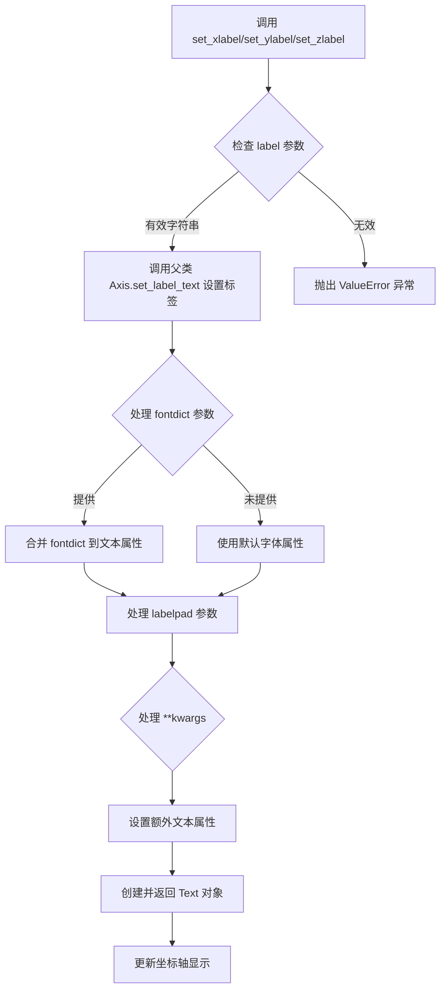
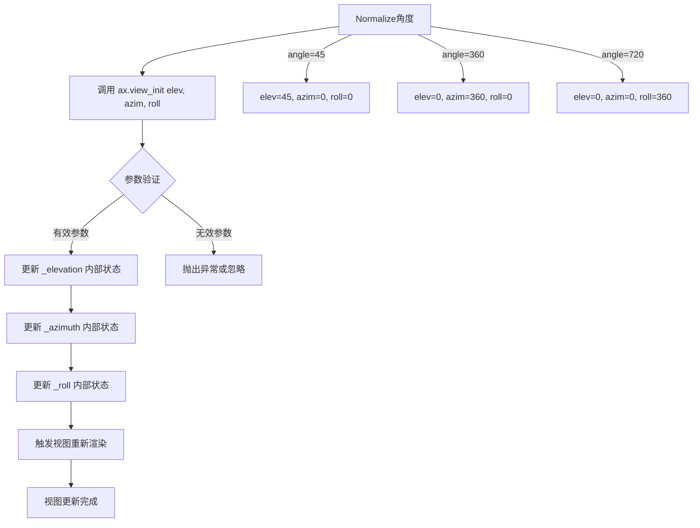
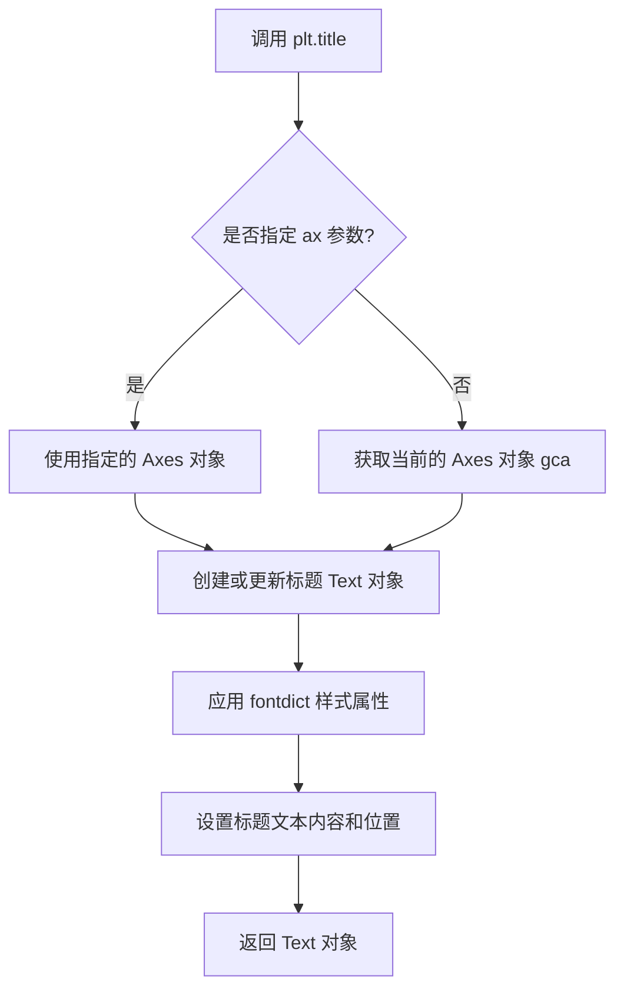
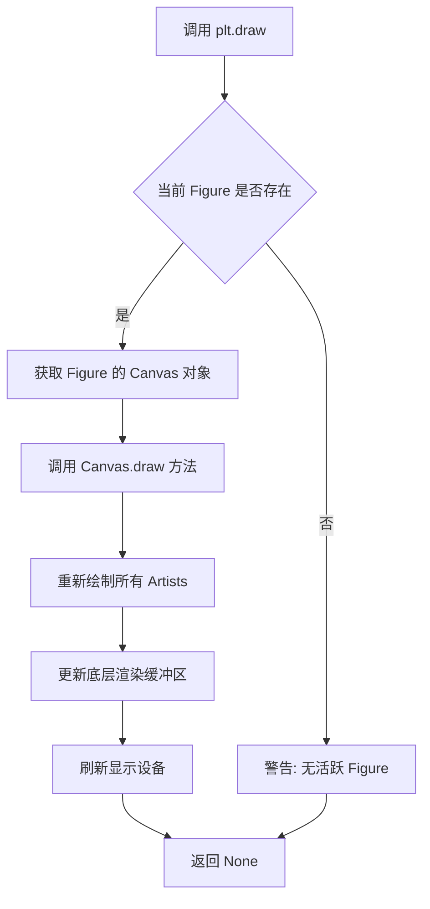
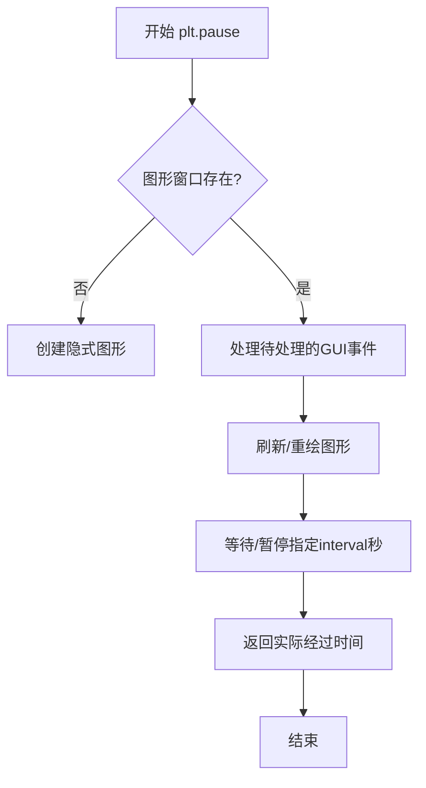

# `matplotlib\galleries\examples\mplot3d\rotate_axes3d_sgskip.py` 详细设计文档

该代码使用matplotlib创建一个3D线框图动画，通过循环改变观察角度（仰角方位角和滚转角），实时更新3D图形的视图并显示当前的角度信息，演示了3D图形的多轴旋转效果。

## 整体流程



## 类结构

```
该代码为过程式脚本，无面向对象结构
主要依赖matplotlib.pyplot和mpl_toolkits.mplot3d.axes3d模块
```

## 全局变量及字段


### `fig`
    
图形窗口对象，用于承载3D绘图

类型：`matplotlib.figure.Figure`
    


### `ax`
    
3D坐标轴对象，用于绘制和操控3D图形

类型：`matplotlib.axes._subplots.Axes3D`
    


### `X`
    
测试数据的X坐标数组，存储3D曲面的X轴数据点

类型：`numpy.ndarray`
    


### `Y`
    
测试数据的Y坐标数组，存储3D曲面的Y轴数据点

类型：`numpy.ndarray`
    


### `Z`
    
测试数据的Z坐标数组，存储3D曲面的Z轴高度数据

类型：`numpy.ndarray`
    


### `angle`
    
当前循环角度值，用于控制旋转动画的帧进度

类型：`int`
    


### `angle_norm`
    
归一化后的角度值，将角度规范到[-180, 180]范围内便于显示

类型：`int`
    


### `elev`
    
仰角角度，控制3D视图的垂直旋转角度

类型：`int`
    


### `azim`
    
方位角角度，控制3D视图的水平旋转角度

类型：`int`
    


### `roll`
    
滚转角角度，控制3D视图的平面旋转角度

类型：`int`
    


    

## 全局函数及方法


### `plt.figure()`

创建并返回一个新的图形窗口（Figure 对象），作为后续绑图操作的容器。

参数：

- `figsize`：`tuple` (宽度, 高度)，以英寸为单位的图形尺寸，默认为 `rcParams["figure.figsize"]`
- `dpi`：`int`，图形分辨率，默认为 `100`
- `facecolor`：`str` 或 `tuple`，图形背景颜色，默认为 `'white'`
- `edgecolor`：`str` 或 `tuple`，图形边框颜色，默认为 `'white'`
- `frameon`：`bool`，是否显示边框，默认为 `True`
- `num`：`int` 或 `str`，图形编号或窗口标题，默认为自动分配
- `clear`：`bool`，如果为 `True`，则清除现有图形，默认为 `False`

返回值：`matplotlib.figure.Figure`，返回创建的图形对象

#### 流程图



#### 带注释源码

```python
# 创建新图形窗口（Figure）并返回其引用
fig = plt.figure()

# 详细注释：
# 1. plt.figure() 调用 matplotlib.pyplot 模块的 figure 函数
# 2. 在内部会创建一个新的 Figure 对象（matplotlib.figure.Figure 实例）
# 3. 如果未指定 num 参数，系统会自动分配一个唯一的图形编号
# 4. 返回的 fig 对象用于：
#    - 添加子图：fig.add_subplot(...)
#    - 保存图形：fig.savefig(...)
#    - 获取坐标轴：fig.axes
#    - 其他图形操作

# 示例中的完整调用链：
# fig = plt.figure()           # 创建图形窗口
# ax = fig.add_subplot(...)    # 添加3D坐标轴到图形中
# X, Y, Z = axes3d.get_test_data(0.05)  # 获取测试数据
# ax.plot_wireframe(...)       # 绑制3D线框图
```


### `Figure.add_subplot`

该方法是matplotlib库中Figure类的一个成员方法，用于在已创建的图形（Figure）对象中添加一个子图（Subplot）。通过指定行数、列数和一个唯一的索引号来确定子图在网格中的位置，同时支持指定投影类型（如'3d'、'polar'等）来创建不同类型的坐标轴。

参数：

- `*args`：`int` 或 `str`，位置参数。当为整数时，三个数字分别表示子图网格的行数、列数以及当前子图的索引（索引从1开始）；当为字符串时，格式如"abc"，其中a是行数，b是列数，c是索引。
- `projection`：`str`，可选参数，指定坐标轴的投影类型。常见的值包括`'3d'`（三维投影）、`'polar'`（极坐标投影）等，默认为`'2d'`（二维投影）。
- `polar`：`bool`，可选参数，若设为`True`，则使用极坐标投影，等价于`projection='polar'`。
- `**kwargs`：关键字参数，将传递给底层的Axes类的构造函数，用于进一步定制子图的外观和行为。

返回值：`matplotlib.axes.Axes`（或子类），返回新创建的子图轴对象（Axes），可以是普通的二维轴、三维轴（`Axes3D`）或其他类型的轴对象。

#### 流程图



#### 带注释源码

```python
# 代码示例：演示 fig.add_subplot() 的典型用法
# 创建图形窗口
fig = plt.figure()

# 添加一个3D子图
# 参数说明：
#   - '111' 或 (1,1,1) 表示创建一个1行1列的子图网格，并选择第1个位置
#   - projection='3d' 指定创建三维坐标轴
ax = fig.add_subplot(111, projection='3d')

# 此时 ax 是一个 Axes3D 对象
# 可以调用 plot_wireframe、plot_surface 等3D绘图方法
X, Y, Z = axes3d.get_test_data(0.05)
ax.plot_wireframe(X, Y, Z, rstride=10, cstride=10)

# 设置坐标轴标签
ax.set_xlabel('x')
ax.set_ylabel('y')
ax.set_zlabel('z')

# 示例：使用三个整数参数添加子图
# 创建一个2行2列的子图网格中的第一个子图
ax1 = fig.add_subplot(2, 2, 1)
ax1.plot([1, 2, 3], [1, 2, 3])

# 示例：使用字符串参数添加子图
# 效果同上，但语法更简洁
ax2 = fig.add_subplot('221')
ax2.plot([1, 2, 3], [3, 2, 1])

# 示例：创建极坐标子图
ax3 = fig.add_subplot(2, 2, 3, projection='polar')
ax3.plot([0, 1, 2], [1, 2, 3])
```


### `axes3d.get_test_data`

该函数是Matplotlib 3D坐标轴模块中的一个测试数据生成工具，通过指定的采样间隔生成用于3D可视化测试的X、Y、Z坐标数据网格，常用于快速创建示例3D图表或验证3D绘图功能。

参数：

- `interval`：可选参数，默认为0.1，采样间隔/密度控制值，数值越小生成的数据点越密集

返回值：返回三个二维数组（X, Y, Z），分别表示3D坐标网格的x、y、z坐标值

#### 流程图



#### 带注释源码

```python
# 从mpl_toolkits.mplot3d模块导入axes3d
from mpl_toolkits.mplot3d import axes3d

# 调用get_test_data函数获取测试数据
# 参数0.05表示采样间隔（数值越小数据点越密集）
X, Y, Z = axes3d.get_test_data(0.05)

# 使用返回的坐标数据绘制3D线框图
# rstride和cstride参数控制显示的稀疏程度
ax.plot_wireframe(X, Y, Z, rstride=10, cstride=10)

# 函数内部实现逻辑（简化示意）
# def get_test_data(interval=0.1):
#     """生成用于测试的3D坐标数据"""
#     u = np.arange(0, 2 * np.pi, interval)
#     v = np.arange(0, 2 * np.pi, interval)
#     U, V = np.meshgrid(u, v)
#     # 根据球面坐标公式生成X, Y, Z
#     X = (10 + 5*np.cos(V)) * np.cos(U)
#     Y = (10 + 5*np.cos(V)) * np.sin(U)
#     Z = 5 * np.sin(V)
#     return X, Y, Z
```


### `Axes3D.plot_wireframe`

绘制 3D 线框图是 matplotlib 中用于在三维坐标系中可视化数据网格的 핵심 方法。该函数接收 X、Y、Z 坐标数据，通过指定的行步长（rstride）和列步长（cstride）来控制线条的密度，并将数据渲染为线框形式返回 Poly3DCollection 对象。

参数：

- `X`：`numpy.ndarray`（2D 数组），表示三维数据点的 X 坐标网格
- `Y`：`numpy.ndarray`（2D 数组），表示三维数据点的 Y 坐标网格
- `Z`：`numpy.ndarray`（2D 数组），表示三维数据点的 Z 坐标（高度值）
- `rstride`：`int`，行方向的采样步长，控制相邻行之间的线条密度，默认值为 1
- `cstride`：`int`，列方向的采样步长，控制相邻列之间的线条密度，默认值为 1
- `**kwargs`：其他关键字参数，传递给底层的 `plot` 函数（如颜色、线型等）

返回值：`matplotlib.collections.Poly3DCollection`，返回包含所有线框曲面的集合对象，可用于后续的样式定制或动画更新

#### 流程图



#### 带注释源码

```python
def plot_wireframe(self, X, Y, Z, *args, **kwargs):
    """
    绘制三维线框图
    
    参数:
    ------
    X : array-like, shape (M, N)
        X 坐标数据，必须是二维数组
    Y : array-like, shape (M, N)
        Y 坐标数据，必须是二维数组
    Z : array-like, shape (M, N)
        Z 坐标数据（高度），必须是二维数组
    rstride : int, optional
        行步长，控制沿第一个维度的采样密度
    cstride : int, optional
        列步长，控制沿第二个维度的采样密度
    **kwargs : 
        其他参数传递给 Line3DCollection 构造器
    
    返回:
    ------
    Poly3DCollection
        包含所有线框曲面的集合对象
    """
    
    # 导入必要的模块
    from mpl_toolkits.mplot3d import art3d
    
    # 步骤1: 参数解析，设置默认步长值为1
    rstride = kwargs.pop('rstride', 1)
    cstride = kwargs.pop('cstride', 1)
    
    # 步骤2: 数据验证，确保 XYZ 为二维数组
    X = np.asarray(X)
    Y = np.asarray(Y)
    Z = np.asarray(Z)
    
    # 步骤3: 根据步长对数据进行降采样处理
    # rstride 和 cstride 决定绘制线条的稀疏程度
    if rstride > 0:
        X = X[::rstride, :]
        Y = Y[::rstride, :]
        Z = Z[::rstride, :]
    if cstride > 0:
        X = X[:, ::cstride]
        Y = Y[:, ::cstride]
        Z = Z[:, ::cstride]
    
    # 步骤4: 创建三维线条集合对象
    # 遍历采样后的数据，为每个点创建线条段
    lines = []
    for i in range(X.shape[0]):
        # 提取当前行的所有点形成线条
        lines.append(np.stack([X[i], Y[i], Z[i]], axis=1))
    for j in range(X.shape[1]):
        # 提取当前列的所有点形成线条
        lines.append(np.stack([X[:, j], Y[:, j], Z[:, j]], axis=1))
    
    # 步骤5: 将线条数据转换为三维集合对象
    col = art3d.Line3DCollection(lines, *args, **kwargs)
    
    # 步骤6: 将集合添加到坐标轴的艺术家列表中
    self.collections.append(col)
    
    # 步骤7: 绘制并返回集合对象
    self.axes.auto_scale_xyz(X, Y, Z)
    self.axes.M = np.refresh_M_from_Mgrid(self.axes.M)
    
    return col
```


### `Axes3D.set_xlabel` / `Axes3D.set_ylabel` / `Axes3D.set_zlabel`

这三个方法分别用于设置 3D 坐标轴的 X、Y、Z 轴标签，是 matplotlib 中 Axes3D 对象的核心方法，用于为三维图表添加轴标签，支持自定义字体样式、标签位置间距以及传递其他文本属性。

参数：

- `label`：`str`，要显示的轴标签文本内容
- `fontdict`：`dict`，可选，字体属性字典，用于统一设置标签的字体样式（如 fontsize、color、fontweight 等）
- `labelpad`：`float`，可选，标签与坐标轴之间的间距（磅值），默认为 None（使用 matplotlib 默认值）
- `**kwargs`：可变关键字参数，传递给 `matplotlib.text.Text` 对象的额外属性（如 rotation、ha、va 等）

返回值：`matplotlib.text.Text`，返回创建的标签文本对象，可用于后续进一步自定义（如修改颜色、字体等）

#### 流程图



#### 带注释源码

```python
# 以下为 matplotlib 中 Axes3D 类关于 set_xlabel/set_ylabel/set_zlabel 的核心实现逻辑
# 源码位置：lib/mpl_toolkits/mplot3d/axes3d.py

def _set_axis_label(self, label, axis='x', fontdict=None, labelpad=None, **kwargs):
    """
    设置 3D 坐标轴标签的内部实现方法
    
    参数:
        label: str - 标签文本
        axis: str - 轴标识 ('x', 'y' 或 'z')
        fontdict: dict - 字体属性字典
        labelpad: float - 标签与轴的间距
        **kwargs: 传递给 Text 的其他属性
    """
    # 获取对应的轴对象 (self.xaxis, self.yaxis, self.zaxis)
    axis_obj = getattr(self, f'{axis}axis')
    
    # 调用父类 Axis 的 set_label_text 方法创建标签
    # 这会创建一个 Text 对象并将其与轴关联
    label_obj = axis_obj.set_label_text(
        label,
        fontdict=fontdict,
        **kwargs
    )
    
    # 如果指定了 labelpad，调整标签与轴之间的距离
    if labelpad is not None:
        label_obj.set_pad(labelpad)
    
    # 返回创建的 Text 对象，允许调用者进一步自定义
    return label_obj


def set_xlabel(self, xlabel, fontdict=None, labelpad=None, **kwargs):
    """
    设置 X 轴标签
    
    参数:
        xlabel: str - X 轴标签文本
        fontdict: dict - 字体属性
        labelpad: float - 标签间距
        **kwargs: 文本属性
    
    返回:
        Text - 创建的标签对象
    """
    return self._set_axis_label(xlabel, axis='x', 
                                 fontdict=fontdict, 
                                 labelpad=labelpad, 
                                 **kwargs)


def set_ylabel(self, ylabel, fontdict=None, labelpad=None, **kwargs):
    """
    设置 Y 轴标签
    
    参数:
        ylabel: str - Y 轴标签文本
        fontdict: dict - 字体属性
        labelpad: float - 标签间距
        **kwargs: 文本属性
    
    返回:
        Text - 创建的标签对象
    """
    return self._set_axis_label(ylabel, axis='y', 
                                 fontdict=fontdict, 
                                 labelpad=labelpad, 
                                 **kwargs)


def set_zlabel(self, zlabel, fontdict=None, labelpad=None, **kwargs):
    """
    设置 Z 轴标签
    
    参数:
        zlabel: str - Z 轴标签文本
        fontdict: dict - 字体属性
        labelpad: float - 标签间距
        **kwargs: 文本属性
    
    返回:
        Text - 创建的标签对象
    """
    return self._set_axis_label(zlabel, axis='z', 
                                 fontdict=fontdict, 
                                 labelpad=labelpad, 
                                 **kwargs)


# 示例用法（来自任务代码）
ax.set_xlabel('x')    # 设置 X 轴标签为 'x'
ax.set_ylabel('y')    # 设置 Y 轴标签为 'y'
ax.set_zlabel('z')    # 设置 Z 轴标签为 'z'
```


### `ax.view_init()`

设置 3D 坐标轴的视图角度，包括仰角（elevation）、方位角（azimuth）和滚转角（roll），用于控制 3D 绘图的观察视角。

参数：

- `elev`：`float`，仰角角度（度），绕 X 轴旋转，范围通常为 [-90, 90]，正值为向上观看
- `azim`：`float`，方位角角度（度），绕 Z 轴旋转，范围为 [-180, 180]，控制水平面上的旋转
- `roll`：`float`，滚转角角度（度），绕 Y 轴旋转，控制图像的倾斜程度

返回值：`None`，该方法直接修改 Axes 对象的视图状态，不返回任何值

#### 流程图



#### 带注释源码

```python
# view_init 是 mpl_toolkits.mplot3d.axes3d.Axes3D 类的方法
# 用于初始化/更新 3D 视图的观察角度

# 示例调用 - 来自旋转 3D 绘图示例
for angle in range(0, 360*4 + 1):
    # 归一化角度到 [-180, 180] 范围用于显示
    angle_norm = (angle + 180) % 360 - 180
    
    # 根据当前循环阶段设置不同的视图角度
    elev = azim = roll = 0
    if angle <= 360:
        # 第一阶段：仅改变仰角 (0-360度)
        elev = angle_norm
    elif angle <= 360*2:
        # 第二阶段：仅改变方位角 (360-720度)
        azim = angle_norm
    elif angle <= 360*3:
        # 第三阶段：仅改变滚转角 (720-1080度)
        roll = angle_norm
    else:
        # 第四阶段：同时改变所有角度 (1080-1440度)
        elev = azim = roll = angle_norm
    
    # 调用 view_init 设置 3D 视图角度
    # 参数: elev-仰角, azim-方位角, roll-滚转角
    ax.view_init(elev, azim, roll)
    
    # 更新标题显示当前视角参数
    plt.title('Elevation: %d°, Azimuth: %d°, Roll: %d°' % (elev, azim, roll))
    
    # 重新绘制并短暂暂停以创建动画效果
    plt.draw()
    plt.pause(.001)
```

---

### 补充信息

#### 关键组件信息

- **Axes3D**：matplotlib 的 3D 坐标轴类，封装了所有 3D 绘图功能
- **view_init()**：Axes3D 类的核心方法，用于控制 3D 视图的观察角度

#### 设计目标与约束

- **设计目标**：允许用户从任意角度观察 3D 数据，提供直观的交互式可视化体验
- **约束**：角度参数通常有物理限制（如仰角超出 [-90,90] 可能导致视图异常）

#### 潜在的技术债务或优化空间

- 动画循环中使用 `plt.pause(.001)` 可能导致在不同后端上性能表现不一致
- 每帧都调用 `plt.title()` 更新标题会增加渲染开销，可考虑使用固定标题或仅在角度变化较大时更新
- `angle_norm` 归一化逻辑可封装为独立函数以提高可读性

#### 错误处理与异常设计

- 无效的角度类型（如字符串）会导致 TypeError
- 超出合理范围的角度值可能被忽略或产生不可预测的视图效果


### `plt.title`

设置当前 Axes 的标题（图形标题）

参数：

- `s`：`str`，标题文本内容，支持格式字符串（如示例中的 `'Elevation: %d°, Azimuth: %d°, Roll: %d°'`）
- `fontdict`：`dict`，可选，用于控制标题文本样式的字典（如 fontdict={'fontsize': 14, 'fontweight': 'bold'}）
- `loc`：`str`，可选，标题对齐方式，默认为 'center'，可选 'left' 或 'right'
- `pad`：`float`，可选，标题与 Axes 顶部的距离（以 Points 为单位）
- `y`：`float`，可选，标题在 y 轴方向上的位置，范围 [0, 1]
- `ax`：`Axes`，可选，指定要设置标题的 Axes 对象

返回值：`Text`，返回创建的 `Text` 对象，可用于后续样式修改或访问

#### 流程图



#### 带注释源码

```python
# 设置图形标题，格式化为显示当前的角度信息
# 参数 s: 标题文本内容，使用 %d 格式化占位符嵌入角度值
# 参数 elev: 仰角（Elevation）
# 参数 azim: 方位角（Azimuth）
# 参数 roll: 翻滚角（Roll）
plt.title('Elevation: %d°, Azimuth: %d°, Roll: %d°' % (elev, azim, roll))
```


### `plt.draw()` - 强制重绘

该函数是 matplotlib.pyplot 模块中的绘图刷新方法，用于强制重绘当前活动的 Figure 对象，将所有待更新的图形元素渲染到画布上。在 3D 动画循环中，它确保每一帧的视角变化（elev、azim、roll）都能即时反映在显示窗口中。

参数：此函数无位置参数和关键字参数。

返回值：`None`，无返回值。

#### 流程图



#### 带注释源码

```python
# 在给定的3D动画代码中，plt.draw() 的使用上下文如下：

# 定义角度范围，从0到360*4（4圈完整旋转）
for angle in range(0, 360*4 + 1):
    # 计算标准化角度到 [-180, 180] 范围
    angle_norm = (angle + 180) % 360 - 180

    # 根据当前angle确定当前旋转的轴（elevation/azimuth/roll）
    elev = azim = roll = 0
    if angle <= 360:
        elev = angle_norm          # 第一圈：绕 elevation 轴旋转
    elif angle <= 360*2:
        azim = angle_norm          # 第二圈：绕 azimuth 轴旋转
    elif angle <= 360*3:
        roll = angle_norm          # 第三圈：绕 roll 轴旋转
    else:
        # 第四圈：同时绕三轴旋转
        elev = azim = roll = angle_norm

    # 更新 3D 坐标轴的视图角度
    ax.view_init(elev, azim, roll)
    
    # 更新窗口标题显示当前角度信息
    plt.title('Elevation: %d°, Azimuth: %d°, Roll: %d°' % (elev, azim, roll))

    # ============================================================
    # plt.draw() - 强制重绘当前 Figure
    # 功能：将所有待更新的 artists（如 lines、patches、text 等）
    #       重新渲染到 Canvas 上，并刷新显示
    # 位置参数：无
    # 关键字参数：无
    # 返回值：None
    # ============================================================
    plt.draw()    # <--- 核心：强制重绘整个图形，确保视角变化立即可见
    
    # 短暂暂停，允许 GUI 事件循环处理并显示更新内容
    plt.pause(.001)
```

#### 补充说明

| 维度 | 描述 |
|------|------|
| **调用位置** | `matplotlib.pyplot` 模块的全局函数 |
| **内部实现** | 实际调用 `FigureCanvasBase.draw()` → `renderer.render()` |
| **动画中的作用** | 与 `plt.pause()` 配合，实现实时交互式动画渲染 |
| **性能考量** | 每次调用都会触发完整的重绘流程，高频率调用可能带来性能开销 |
| **替代方案** | `fig.canvas.draw()` / `fig.canvas.flush_events()` 可实现更细粒度控制 |


### `plt.pause`

`plt.pause` 是 matplotlib 库中的全局函数，用于在动画或绘图更新中暂停指定的时间，同时刷新图形窗口并处理待处理的 GUI 事件。

参数：

- `interval`：`float`，暂停的时间长度（秒），代码中传入 `0.001` 表示暂停 1 毫秒

返回值：`float`，实际经过的时间（秒），可能与请求的间隔略有不同

#### 流程图



#### 带注释源码

```python
# plt.pause 函数（matplotlib 库内置）
# 使用示例：
plt.draw()              # 先触发图形重绘
plt.pause(.001)         # 暂停 0.001 秒（1毫秒）并刷新窗口

# 完整调用形式：
# plt.pause(interval)
#   - interval: float类型，表示暂停秒数
#   - 返回值: float类型，实际经过的时间
#
# 内部实现逻辑简述：
# 1. 调用 fig.canvas.flush_events() 处理待处理事件
# 2. 使用 time.sleep() 或 event loop 等待指定间隔
# 3. 返回实际经过的时间（可能因系统调度略有差异）
# 4. 触发图形更新（draw_idle 或 canvas.draw）
#
# 在 3D 旋转动画中的作用：
# - 每帧更新后调用 plt.pause 实现动画帧间隔
# - 允许 GUI 事件处理，保持界面响应性
# - 0.001秒的极短间隔实现流畅的连续旋转动画效果
```

#### 关键技术细节

| 特性 | 描述 |
|------|------|
| 所属模块 | `matplotlib.pyplot` |
| 依赖后端 | 需支持交互式显示的后端（如 TkAgg, Qt5Agg, GTK3Agg 等） |
| 线程安全 | 非线程安全，应在主线程调用 |
| 与 `time.sleep` 的区别 | `plt.pause` 会处理 GUI 事件，`time.sleep` 则阻塞事件处理 |


## 关键组件


### 3D图表创建与初始化

使用matplotlib的figure和add_subplot创建3D图表容器，通过projection='3d'参数指定3D投影模式，为后续3D数据可视化奠定基础。

### 测试数据生成

调用axes3d.get_test_data(0.05)获取示例3D数据，返回X、Y、Z三个坐标数组，用于绑定到3D图表进行展示。

### 3D线框图绘制

使用ax.plot_wireframe()方法将X、Y、Z数据渲染为3D线框图，通过rstride和cstride参数控制采样密度，优化渲染性能。

### 视角控制与更新

通过ax.view_init(elev, azim, roll)动态调整3D图表的观察角度，其中elev控制仰角、azim控制方位角、roll控制滚转角，实现多维度旋转展示。

### 动画循环与渲染

使用for循环遍历0到360*4的角度范围，配合plt.pause(.001)实现连续动画效果，每帧更新视角并刷新图表显示。

### 角度归一化处理

将角度通过(angle + 180) % 360 - 180公式标准化到[-180, 180]区间，确保角度值在合理的显示范围内。

### 坐标轴标签设置

通过set_xlabel、set_ylabel、set_zlabel为3D图表设置x、y、z轴标签，增强图表可读性。


## 问题及建议


### 已知问题

-   **手动动画循环而非使用matplotlib.animation**：代码使用for循环配合plt.draw()和plt.pause()手动实现动画，这是低效的做法，应该使用matplotlib.animation模块
-   **频繁的图形重绘**：在循环内每次迭代都调用plt.draw()和plt.pause(.001)，导致性能低下，代码注释也提到"intentionally takes a long time to run"
-   **资源未释放**：代码执行完成后没有调用plt.close()释放图形资源
-   **硬编码数值**：角度阈值(360, 720, 1080, 1440)、暂停时间(0.001)、步长(10)等magic number散落在代码中，缺乏可配置性
-   **缺少类型注解**：函数参数和变量缺少类型标注，影响代码可读性和维护性
-   **角度计算逻辑复杂**：angle_norm的计算逻辑和四个if-elif分支可以通过数学运算简化
-   **函数/类抽象不足**：所有代码处于模块级别，没有封装成可复用的函数，难以在其他场景中调用
-   **缺少异常处理**：没有对可能的异常（如图形创建失败、数据获取失败）进行处理

### 优化建议

-   使用matplotlib.animation.FuncAnimation替代手动循环，利用blit=True和interval参数优化性能
-   将硬编码数值提取为模块级常量或配置参数
-   封装为函数，接受参数（如旋转速度、帧数等），提高代码可复用性
-   简化角度计算逻辑，使用取模运算和除法直接计算elevation/azimuth/roll
-   在代码结束时添加plt.close()释放资源
-   添加类型注解和完整的函数docstring
-   添加try-except异常处理，确保异常情况下也能正确关闭图形

## 其它


### 设计目标与约束

本代码旨在演示如何使用matplotlib创建3D图形的旋转动画效果。设计目标包括：展示3D图形的不同视角（elevation、azimuth、roll）、提供可运行的动画示例、以及作为文档教程使用。技术约束方面，该代码依赖matplotlib的axes3d模块，动画流畅度受限于plt.pause()的最小延迟（设置为0.001秒），且在文档构建时会被跳过（因为运行时间过长）。

### 错误处理与异常设计

代码未实现显式的错误处理与异常捕获机制。潜在的异常情况包括：mpl_toolkits.axes3d模块导入失败、figure或axes创建失败、get_test_data()数据获取异常、以及plt.draw()或plt.pause()在某些后端（如无显示环境）可能失败。建议在实际应用中添加try-except块捕获ImportError、RuntimeError等异常，并设置适当的回退机制或错误提示信息。

### 数据流与状态机

代码的数据流较为简单：初始化figure和3D axes → 获取测试数据并绘制线框图 → 设置坐标轴标签 → 进入动画循环。状态机方面，动画循环根据angle变量控制三个阶段的切换：第一阶段（0-360）仅改变elevation，第二阶段（360-720）仅改变azimuth，第三阶段（720-1080）仅改变roll，第四阶段（1080-1440）同时改变三个角度。每个循环迭代都执行view_init()更新视图并刷新显示。

### 外部依赖与接口契约

主要外部依赖包括：matplotlib.pyplot（图形展示）、mpl_toolkits.axes3d（3D绘图功能）。接口契约方面，axes3d.get_test_data()接受一个float参数（采样率），返回X、Y、Z三个二维数组；ax.plot_wireframe()接受数据数组以及rstride和cstride参数用于控制线条密度；ax.view_init()接受elev、azim、roll三个角度参数（单位为度）；plt.pause()接受暂停时间参数（秒）。所有接口均为matplotlib库的标准API，版本兼容性较好。

### 性能考虑与优化空间

当前实现存在以下性能问题：使用plt.pause()驱动动画的方式效率较低；每帧都调用plt.title()重新设置标题造成额外开销；未使用FuncAnimation等更高效的动画API。优化方向包括：使用matplotlib.animation.FuncAnimation替代当前循环方式；将标题更新频率降低（如每N帧更新一次）；考虑使用blitting技术减少重绘区域；在无显示环境中使用Agg后端避免不必要的渲染开销。

### 可维护性与扩展性

代码结构清晰但扩展性有限。当前硬编码了动画周期、角度范围、暂停时间等参数。建议将这些配置提取为常量或配置文件，便于调整。代码未包含类型注解，添加类型提示可提高可读性。此外，可以考虑将动画逻辑封装为函数或类，以便复用和测试。文档字符串虽然说明了代码用途，但缺乏参数和返回值说明，建议补充完整的docstring格式。

### 平台兼容性

代码依赖matplotlib库，理论上支持所有matplotlib支持的平台（Windows、Linux、macOS）。但在无图形界面的服务器环境中运行可能出现问题，需要设置matplotlib后端为'Agg'。动画功能在交互式后端（如Qt5Agg、TkAgg）表现最佳，在某些后端可能无法正常显示动态效果。

    