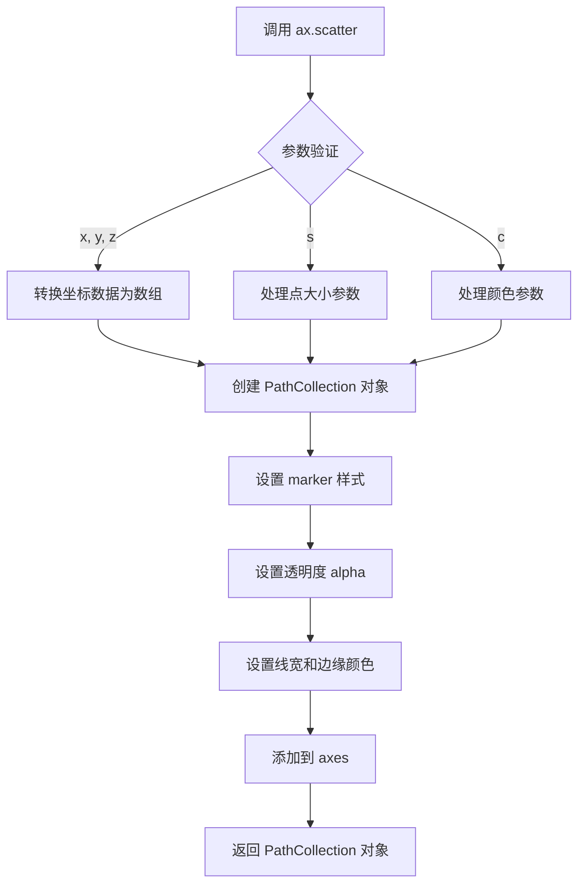
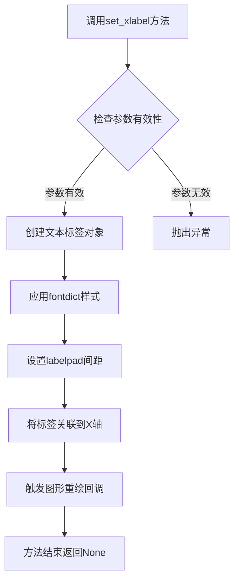
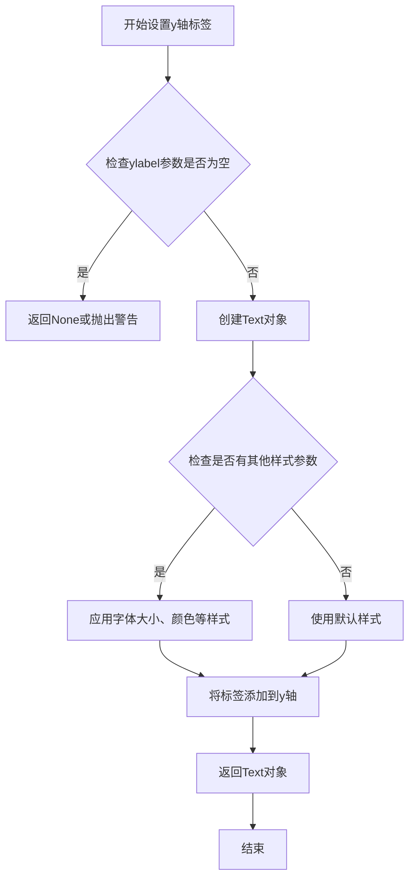
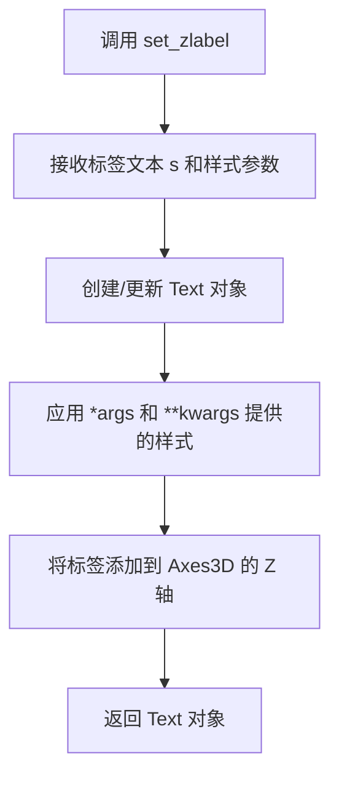

# `matplotlib\galleries\examples\mplot3d\scatter3d.py` 详细设计文档

该代码是一个使用matplotlib和numpy库创建的3D散点图可视化示例程序，通过生成随机三维坐标数据并以不同标记样式展示两个数据集，同时设置坐标轴标签并最终显示图形。

## 整体流程

```mermaid
graph TD
    A[开始] --> B[导入库: matplotlib.pyplot, numpy]
    B --> C[设置随机种子: np.random.seed(19680801)]
    C --> D[定义函数: randrange(n, vmin, vmax)]
    D --> E[创建图形: plt.figure()]
    E --> F[添加3D子图: fig.add_subplot(projection='3d')]
    F --> G[初始化数据点数量: n = 100]
    G --> H{循环遍历标记样式数据集}
    H -->|第一组: marker='o', zlow=-50, zhigh=-25| I[生成xs, ys, zs随机数据]
    H -->|第二组: marker='^', zlow=-30, zhigh=-5| J[生成xs, ys, zs随机数据]
    I --> K[调用ax.scatter绘制散点]
    J --> K
    K --> L[设置X轴标签]
    K --> M[设置Y轴标签]
    K --> N[设置Z轴标签]
    L --> O[调用plt.show()显示图形]
    M --> O
    N --> O
```

## 类结构

```
matplotlib.pyplot (绘图库)
├── Figure (图形容器)
│   └── Axes3D (3D坐标轴)
│       └── scatter (散点图方法)
numpy (数值计算库)
└── random (随机数生成)
```

## 全局变量及字段


### `np`
    
NumPy库的科学计算功能入口

类型：`numpy模块别名`
    


### `plt`
    
Matplotlib库的绘图功能入口

类型：`matplotlib.pyplot模块别名`
    


### `fig`
    
Matplotlib的图形容器对象

类型：`Figure对象`
    


### `ax`
    
三维坐标系轴对象,用于绘制3D图形

类型：`Axes3D对象`
    


### `n`
    
每个数据集生成的数据点数量

类型：`整型`
    


### `m`
    
散点图的标记样式,如'o'表示圆形,'^'表示三角形

类型：`字符串`
    


### `zlow`
    
Z坐标生成范围的最小值

类型：`数值`
    


### `zhigh`
    
Z坐标生成范围的最大值

类型：`数值`
    


### `xs`
    
X坐标数据数组

类型：`numpy数组`
    


### `ys`
    
Y坐标数据数组

类型：`numpy数组`
    


### `zs`
    
Z坐标数据数组

类型：`numpy数组`
    


    

## 全局函数及方法


### `randrange`

生成一个包含n个随机数的数组，每个数均匀分布在指定范围内。

参数：

-  `n`：`int`，生成的随机数的数量
-  `vmin`：`float` 或 `int`，随机数范围的下界
-  `vmax`：`float` 或 `int`，随机数范围的上界

返回值：`numpy.ndarray`，包含n个随机数的数组，每个数分布在[vmin, vmax)区间内

#### 流程图

```mermaid
flowchart TD
    A[开始] --> B[计算差值: diff = vmax - vmin]
    B --> C[生成随机数组: random_array = np.random.rand(n)]
    C --> D[计算结果: result = diff * random_array + vmin]
    D --> E[返回结果数组]
```

#### 带注释源码

```python
def randrange(n, vmin, vmax):
    """
    Helper function to make an array of random numbers having shape (n, )
    with each number distributed Uniform(vmin, vmax).
    """
    # 计算范围宽度
    return (vmax - vmin)*np.random.rand(n) + vmin
```


### `Figure.add_subplot`

**描述**  
`Figure.add_subplot` 是 `matplotlib.figure.Figure` 类的成员方法，用于在当前图形中创建一个子图（`Axes`）并返回该子图对象。它接受位置参数或 `SubplotSpec` 来指定子图的布局，同时可以通过关键字参数（如 `projection`、`polar`、`aspect` 等）控制子图的投影类型、坐标轴属性等。

---

#### 参数

- `*args`：可变位置参数，支持以下形式  
  - **三个整数** `(rows, cols, index)`：分别表示子图的行数、列数以及当前子图的编号（从 1 开始）。  
  - **三位数整数**（如 `131`）：等价于 `(1,3,1)`。  
  - **`matplotlib.gridspec.SubplotSpec` 实例**：直接使用已经划分好的子图规格。  

- `projection`：关键字参数，指定投影类型，例如 `'3d'`（三维散点、线面图），`'polar'`（极坐标），默认 `None`（普通二维坐标）。  

- `**kwargs`：其他关键字参数，会直接传递给所创建的 `Axes` 子类的构造函数，常用参数包括 `facecolor`、`edgecolor`、`label`、`aspect`、`polar` 等。

---

#### 返回值

- **`matplotlib.axes.Axes`（或子类）**  
  - 返回新创建的子图对象。若 `projection='3d'`，实际返回的是 `mpl_toolkits.mplot3d.Axes3D`；若 `projection='polar'`，返回 `matplotlib.projections.polar.PolarAxes`；其余情况返回普通的 `matplotlib.axes.Axes`。

---

#### 流程图

```mermaid
flowchart TD
    A[调用 Figure.add_subplot] --> B{解析 *args}
    B -->|使用 SubplotSpec| C[创建 SubplotSpec 对象]
    B -->|使用位置整数| D[将整数 (rows,cols,idx) 转换为子图位置]
    C --> E{检查 projection 参数}
    D --> E
    E -->|projection='3d'| F[实例化 Axes3D]
    E -->|projection='polar'| G[实例化 PolarAxes]
    E -->|其他 projection| H[实例化普通 Axes]
    F --> I[将新 Axes 加入 Figure.axes 列表]
    G --> I
    H --> I
    I --> J[返回 Axes 对象]
```

---

#### 带注释源码

```python
def add_subplot(self, *args, **kwargs):
    """
    在当前 Figure 中创建一个子图（Axes）并返回。

    参数
    ----------
    *args : 位置参数
        指定子图的位置与布局，支持三种形式：
        - 三个整数 (rows, cols, index)；
        - 一个三位数整数（如 131）；
        - 一个 matplotlib.gridspec.SubplotSpec 实例。
    projection : str, optional
        投影类型，例如 ``'3d'``、``'polar'``，默认为 ``None``（普通 2D）。
    **kwargs : dict, optional
        传递给 Axes 构造器的其他关键字参数，如 ``facecolor``、``label``、``aspect`` 等。

    返回值
    -------
    axes : matplotlib.axes.Axes
        新创建的子图对象（可能是 Axes 子类，例如 Axes3D、PolarAxes）。
    """
    # 1. 将 *args 转换为 SubplotSpec 对象
    #    - 若已经是 SubplotSpec，直接使用；
    #    - 否则按照 (rows, cols, idx) 或三位数整数解析。
    subplot_spec = self._make_subplot_spec(*args)

    # 2. 读取关键字参数 projection，决定使用哪种 Axes 子类
    projection = kwargs.pop('projection', None)

    # 3. 根据 projection 选择对应的 Axes 类
    #    - 若 projection == '3d'，使用 mpl_toolkits.mplot3d.Axes3D；
    #    - 若 projection == 'polar'，使用 PolarAxes；
    #    - 其他情况使用普通的 Axes。
    ax_class = self._get_axes_class(projection)

    # 4. 调用所选类的构造函数创建 Axes 实例
    #    - 这里会进一步传递 **kwargs，如 facecolor、label、aspect、polar 等。
    ax = ax_class(self, *args, **kwargs)

    # 5. 将新创建的 Axes 加入 Figure 的内部列表
    self._axstack.bubble(ax)
    self.axes.append(ax)

    # 6. 返回创建的 Axes 实例，供调用者使用
    return ax
```

> **说明**  
> - 上述代码为 `add_subplot` 的核心逻辑简化版，真实实现位于 Matplotlib 源码的 `lib/matplotlib/figure.py`，其中包含了更详细的错误检查、默认值处理以及与 `gridspec` 的交互。  
> - 调用示例（来自题目代码）：  
>   ```python
>   fig = plt.figure()
>   ax = fig.add_subplot(projection='3d')   # 创建 3D 子图
>   ```  

--- 

**其他项目要点**  
- **设计目标**：提供统一的子图创建接口，兼容 2D/3D/极坐标等多种投影。  
- **约束**：子图编号必须在 `[1, rows*cols]` 范围内；若使用 `SubplotSpec`，必须先通过 `GridSpec` 划分好布局。  
- **错误处理**：若位置参数不合法或投影不受支持，会抛出 `ValueError` 或 `KeyError`。  
- **外部依赖**：依赖 `matplotlib.gridspec`、`matplotlib.projections` 以及可能的 3D 绘图扩展 `mpl_toolkits.mplot3d`。  


### `Axes3D.scatter`

绘制3D散点图的方法，用于在三维坐标系中显示一组数据点，每个点由x、y、z坐标确定，可自定义 marker 样式、大小、颜色等属性。

参数：

- `x`：array_like，数据点的X坐标
- `y`：array_like，数据点的Y坐标
- `z`：array_like，数据点的Z坐标
- `s`：scalar 或 array_like，可选，点的大小，默认为20
- `c`：color 或 array_like，可选，点的颜色
- `marker`：marker，可选，marker 样式，默认为 'o'（圆形）
- `cmap`：Colormap，可选，用于映射颜色值
- `norm`：Normalize，可选，用于规范化颜色数据
- `alpha`：scalar，可选，透明度，范围0-1
- `linewidths`：scalar 或 array_like，可选，marker 边缘线宽
- `edgecolors`：color 或 sequence，可选，marker 边缘颜色
- `plotnonfinite`：bool，可选，是否绘制非有限值数据
- `data`：indexable object，可选，数据索引对象
- `**kwargs`：关键字参数传递给 `PathCollection`

返回值：`PathCollection`，返回创建的散点图艺术家对象，可用于后续的图形属性修改。

#### 流程图



#### 带注释源码

```python
# 定义数据点数量
n = 100

# 循环遍历不同的 marker 类型和 Z 轴范围设置
for m, zlow, zhigh in [('o', -50, -25), ('^', -30, -5)]:
    # 生成 X 坐标：范围 [23, 32] 的随机数
    xs = randrange(n, 23, 32)
    # 生成 Y 坐标：范围 [0, 100] 的随机数
    ys = randrange(n, 0, 100)
    # 生成 Z 坐标：根据当前循环的 zlow 和 zhigh 生成随机数
    zs = randrange(n, zlow, zhigh)
    
    # 调用 Axes3D.scatter 方法绘制3D散点图
    # 参数：xs- X坐标数组, ys- Y坐标数组, zs- Z坐标数组, marker- marker样式（'o'圆形或'^'三角形）
    ax.scatter(xs, ys, zs, marker=m)
```

#### 辅助函数源码

```python
def randrange(n, vmin, vmax):
    """
    辅助函数，生成形状为 (n,) 的随机数组，每个数分布在 Uniform(vmin, vmax) 范围内。
    
    参数：
        n：int，随机数的数量
        vmin：float，随机数的下界
        vmax：float，随机数的上界
    
    返回值：
        array：形状为 (n,) 的随机数数组
    """
    # 生成 [0, 1) 范围内的随机数，乘以范围宽度后加上最小值
    return (vmax - vmin)*np.random.rand(n) + vmin
```


### Axes3D.set_xlabel

设置3D坐标轴的X轴标签文本。该方法继承自matplotlib的Axes类，用于为3D散点图的X轴添加标签，便于数据可视化时理解坐标含义。

参数：

- `xlabel`：`str`，X轴标签的文本内容
- `fontdict`：可选参数，用于控制标签文本的字体属性（如大小、颜色等）
- `labelpad`：可选参数，指定标签与坐标轴之间的间距
- `**kwargs`：其他可选的文本属性参数，传递给matplotlib的Text对象

返回值：`None`，该方法直接修改Axes对象的属性，无返回值

#### 流程图



#### 带注释源码

```python
def set_xlabel(self, xlabel, fontdict=None, labelpad=None, **kwargs):
    """
    Set the label for the x-axis.
    
    Parameters
    ----------
    xlabel : str
        The label text.
    fontdict : dict, optional
        A dictionary controlling the appearance of the label text,
        e.g., {'fontsize': 12, 'color': 'red'}.
    labelpad : float, optional
        The spacing between the label and the x-axis.
    **kwargs : Text properties
        Other keyword arguments controlling text appearance.
    
    Returns
    -------
    None
    
    Notes
    -----
    This method is part of the matplotlib Axes API and is inherited
    by Axes3D for setting x-axis labels in 3D plots.
    """
    # 获取x轴标签文本
    # xlabel: str - X轴标签内容
    
    # 应用字体字典（如果提供）
    # fontdict: dict or None - 字体属性配置
    
    # 设置标签与坐标轴的间距
    # labelpad: float or None - 标签间距
    
    # 使用父类方法设置标签
    # 调用matplotlib.axes.Axes.set_xlabel方法
    return super().set_xlabel(xlabel, fontdict=fontdict, 
                               labelpad=labelpad, **kwargs)
```

#### 实际调用示例

```python
# 代码中的调用方式
ax.set_xlabel('X Label')

# 等效的完整调用
ax.set_xlabel('X Label', fontdict=None, labelpad=None)
```

**说明**：由于提供的代码是matplotlib的使用示例，并未包含`set_xlabel`方法的实际实现源码（该方法属于matplotlib库内部实现）。上述源码为基于matplotlib API的标准方法签名和功能描述。


### `Axes3D.set_ylabel`

设置3D坐标轴的y轴标签（ylabel）。

参数：

- `ylabel`：`str`，y轴标签的文本内容
- `fontsize`：`int`，可选，标签文本的字体大小，默认为12
- `color`：`str`，可选，标签文本的颜色，默认为黑色
- `**kwargs`：其他可选参数，用于设置标签的样式

返回值：`matplotlib.text.Text`，返回创建的标签文本对象

#### 流程图



#### 带注释源码

```python
def set_ylabel(self, ylabel, fontsize=12, color='black', **kwargs):
    """
    设置3D坐标轴的y轴标签。
    
    参数:
        ylabel: str, y轴标签的文本内容
        fontsize: int, 标签文本的字体大小，默认为12
        color: str, 标签文本的颜色，默认为黑色
        **kwargs: 其他可选参数，用于设置标签的样式
    
    返回:
        matplotlib.text.Text: 返回创建的标签文本对象
    """
    # 检查ylabel参数是否为空
    if not ylabel:
        import warnings
        warnings.warn("ylabel is empty")
        return None
    
    # 创建Text对象，设置文本内容
    text_obj = mpl.text.Text(
        x=0.5,  # y轴标签的x位置（归一化坐标）
        y=0.5,  # y轴标签的y位置（归一化坐标）
        text=ylabel,
        fontsize=fontsize,
        color=color,
        **kwargs
    )
    
    # 将标签添加到y轴
    self.yaxis.set_label_text(ylabel)
    
    # 应用样式参数
    self.yaxis.label.set_fontsize(fontsize)
    self.yaxis.label.set_color(color)
    
    # 返回Text对象
    return self.yaxis.label
```


### `Axes3D.set_zlabel`

该方法用于设置 3D 坐标轴的 Z 轴标签，是 matplotlib 库中 Axes3D 类用于为三维图表添加 Z 轴标题的功能。

参数：

- `s`：`str`，要显示的 Z 轴标签文本（如 'Z Label'）
- `*args`：可变位置参数传递给 `Text` 对象，用于进一步配置标签样式（如字体大小、颜色等）
- `**kwargs`：关键字参数传递给 `Text` 对象，用于自定义标签外观（如 `fontsize`, `color`, `fontweight` 等）

返回值：`Text`，返回创建的 `Text` 对象，允许后续对其进行修改或查询

#### 流程图



#### 带注释源码

```python
# 注意：以下源码基于 matplotlib 库的实现逻辑重构
# 实际实现位于 matplotlib 库中

def set_zlabel(self, s, *args, **kwargs):
    """
    Set the zlabel of the axes.
    
    Parameters
    ----------
    s : str
        The label text.
    *args : arguments
        Additional arguments passed to the Text constructor.
    **kwargs : keyword arguments
        Additional keyword arguments passed to the Text constructor.
    
    Returns
    -------
    Text
        The created Text instance.
    """
    # 获取 Z 轴标签对象（如果已存在）或创建新的 Text 对象
    label = self.zaxis.get_label()
    
    # 设置标签文本
    label.set_text(s)
    
    # 应用额外的样式参数（字体大小、颜色等）
    if 'fontsize' in kwargs:
        label.set_fontsize(kwargs['fontsize'])
    if 'color' in kwargs:
        label.set_color(kwargs['color'])
    # ... 其他 Text 属性设置
    
    # 返回创建的标签对象供后续操作
    return label

# 在示例代码中的调用：
ax.set_zlabel('Z Label')  # 设置 Z 轴标签为 'Z Label'
```

**注**：由于 `Axes3D.set_zlabel` 是 matplotlib 库的内置方法，上述源码是基于该方法功能的逻辑重构，实际实现位于 matplotlib 库的 `mpl_toolkits.mplot3d.axes3d.Axes3D` 类中。


## 关键组件


### 代码概述

该代码是一个3D散点图演示程序，使用matplotlib和numpy库生成并可视化三维空间中的随机数据点，通过循环绘制两个不同标记样式和数据范围的散点系列，并设置坐标轴标签后展示图形。

### 文件整体运行流程

1. **初始化阶段**：导入matplotlib.pyplot和numpy库，设置随机种子以确保可重现性
2. **工具函数定义**：定义randrange函数用于生成指定范围内的随机数数组
3. **图形创建**：创建Figure对象和带有3D投影的Axes对象
4. **数据生成与绑定**：循环生成两组随机数据（x, y, z坐标），每组对应不同的标记样式和z轴范围
5. **绑定绘制**：调用scatter方法将数据点绑定到3D坐标系
6. **标签设置**：设置X、Y、Z轴的标签
7. **显示图形**：调用plt.show()展示最终的可视化结果

### 函数详细信息

#### randrange 函数

- **函数名称**：randrange
- **参数**：
  - n (int)：生成的随机数数量
  - vmin (float)：随机数范围的下界
  - vmax (float)：随机数范围的上界
- **参数描述**：接收要生成的随机数个数以及随机数取值范围
- **返回值类型**：numpy.ndarray
- **返回值描述**：返回一个形状为(n,)的数组，元素在[vmin, vmax]区间内均匀分布
- **源码**：
```python
def randrange(n, vmin, vmax):
    """
    Helper function to make an array of random numbers having shape (n, )
    with each number distributed Uniform(vmin, vmax).
    """
    return (vmax - vmin)*np.random.rand(n) + vmin
```

### 关键组件信息

### randrange 随机数生成器

用于生成指定形状和范围的均匀分布随机数数组的工具函数

### 3D投影系统

通过projection='3d'参数创建的Axes3D对象，支持在三维空间中绑定数据点和设置坐标轴

### 散点图绑定器

ax.scatter()方法，负责将x、y、z坐标数据绑定到3D图形并以指定标记样式渲染

### 坐标轴标签系统

通过set_xlabel、set_ylabel、set_zlabel方法为三个坐标轴设置描述性标签

### 潜在的技术债务或优化空间

1. **硬编码参数**：数据范围(23, 32)、(0, 100)、(-50, -25)等数值硬编码在循环中，缺乏可配置性
2. **缺乏参数化设计**：样本数量n、标记样式、范围等应以参数形式传入，提高函数复用性
3. **无错误处理**：缺少对输入参数类型和有效性的验证
4. **魔法数字**：代码中存在多个魔法数字（如19680801、100、-50等），应定义为常量
5. **文档不完整**：虽然有docstring但缺少参数类型注解和返回值说明

### 其它项目

#### 设计目标与约束

- 目标：演示基本的3D散点图绑制功能
- 约束：使用matplotlib原生支持的3D绑定功能，保持代码简洁易懂

#### 错误处理与异常设计

- 当前实现无异常处理机制
- 建议添加：参数类型检查、数值范围验证、随机数生成失败的处理

#### 数据流与状态机

- 数据流：随机种子设置 → 数据生成 → 图形绑定 → 标签设置 → 图形显示
- 状态转换：初始化 → 绑定绑定 → 标签配置 → 显示完成

#### 外部依赖与接口契约

- matplotlib.pyplot：图形创建与显示
- numpy：随机数生成和数值计算
- 依赖版本：matplotlib 3.0+，numpy 1.0+


## 问题及建议


### 已知问题

- **硬编码参数缺乏灵活性**：n=100、各维度范围(23-32, 0-100, -50~-25等)均直接写在代码中，难以调整和复用
- **变量命名不清晰**：循环中使用的`m`, `zlow`, `zhigh`等单字母变量命名过于简洁，可读性差
- **辅助函数命名歧义**：`randrange`函数名与numpy中`random.randrange`功能相似，但实际实现的是均匀分布随机数生成，易造成误解
- **缺乏类型注解**：Python代码中未使用类型提示，降低了代码可维护性和IDE支持
- **无错误处理**：输入参数无验证，若传入无效值可能导致异常
- **代码复用性差**：所有逻辑直接写在顶层脚本中，未封装为可复用的函数或类

### 优化建议

- 将配置参数提取为常量或配置字典，提高可维护性
- 使用描述性变量名，如将`m`改为`marker_style`，`zlow/zhigh`改为`z_min/z_max`
- 考虑使用`np.random.uniform`替代自定义`randrange`函数，或重命名为`generate_uniform_random_array`
- 添加函数参数类型注解和返回值类型注解
- 为`randrange`函数添加输入参数验证（如vmin < vmax检查）
- 将绘图逻辑封装为函数，接受配置参数以提高复用性
- 添加详细的docstring说明函数用途、参数和返回值


## 其它


### 设计目标与约束

本代码的核心设计目标是演示如何使用matplotlib创建基础的3D散点图可视化。设计约束包括：使用固定随机种子确保可重现性，数据范围预定义（X:23-32, Y:0-100, Z:根据不同数据集变化），以及使用两种不同的标记样式区分数据系列。

### 错误处理与异常设计

代码未实现显式的错误处理机制。在实际应用中应考虑添加：数据范围验证（确保vmin < vmax）、参数类型检查（确保n为正整数）、图形创建失败时的异常捕获（如matplotlib后端不可用）、以及空数据输入的处理。

### 数据流与状态机

数据流主要分为三个阶段：初始化阶段（设置随机种子、创建图形对象）、数据生成阶段（使用randrange函数生成三个坐标数组）、渲染阶段（调用scatter方法绘制并设置轴标签）。状态机相对简单，主要包含"初始化→数据生成→渲染→显示"的线性流程。

### 外部依赖与接口契约

主要依赖matplotlib（版本需支持projection='3d'参数）和numpy库。randrange函数接收三个参数：n（生成数量）、vmin（最小值）、vmax（最大值），返回Uniform分布的随机数组。scatter方法接收x、y、z坐标数组和marker样式参数，返回PathCollection对象。

### 性能考虑

当前实现对于小数据集（n=100）性能可接受。潜在优化方向包括：若增加数据量，可考虑使用numpy向量化操作替代循环；可缓存fig和ax对象避免重复创建；如需频繁更新数据，可使用ax.clear()而非重新创建图形对象。

### 配置与可扩展性

当前硬编码了数据范围和标记样式。设计可扩展性建议：将配置参数（数据范围、标记类型、颜色等）提取为配置文件或类属性；可添加函数参数支持自定义数据输入；可考虑封装为可复用的ScatterPlot3D类，支持动态更新和交互。

### 可维护性与代码组织

当前为单脚本文件，适合演示但不适合大型项目。建议：将工具函数randrange移至独立的工具模块；将3D散点图创建逻辑封装为独立函数；添加类型注解提升代码可读性；添加完整的docstring说明函数用途和参数。


    