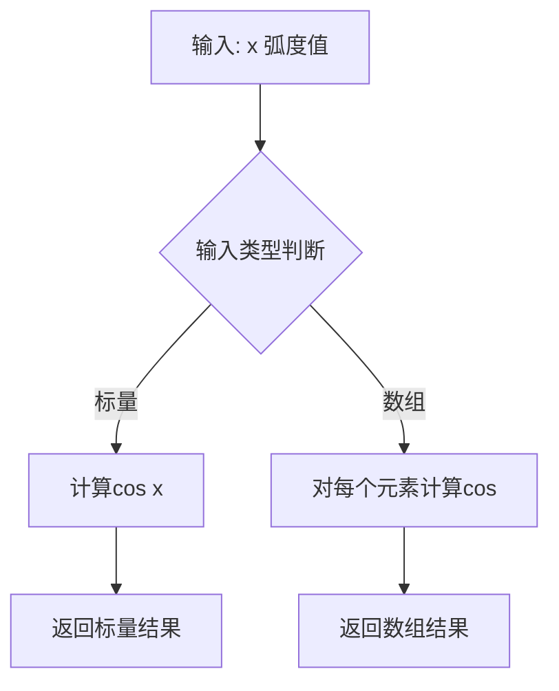
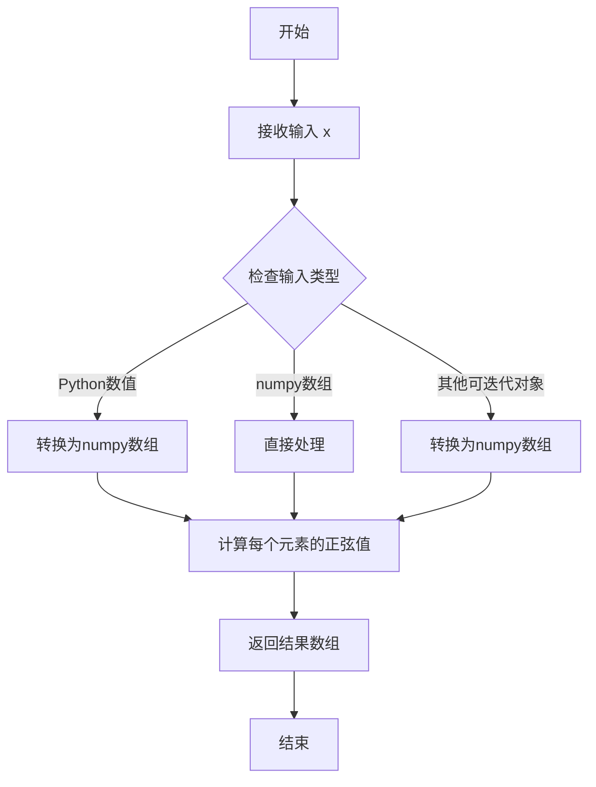
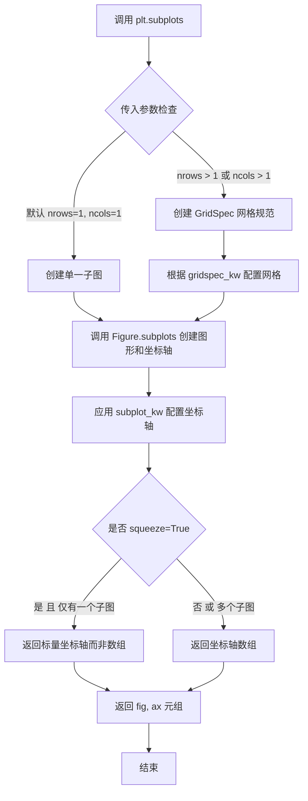
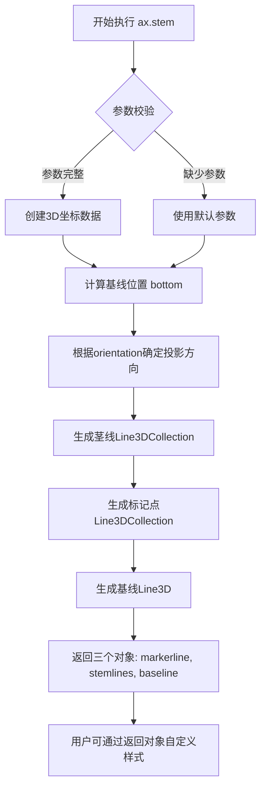
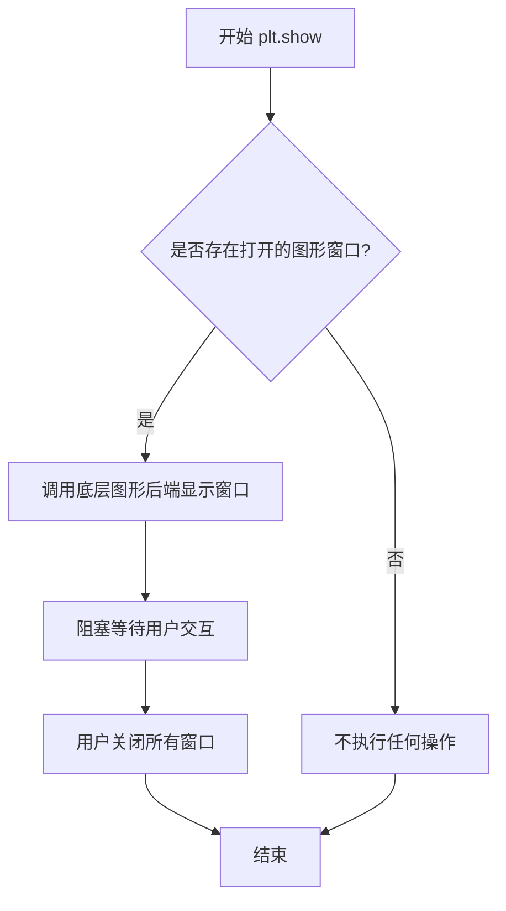
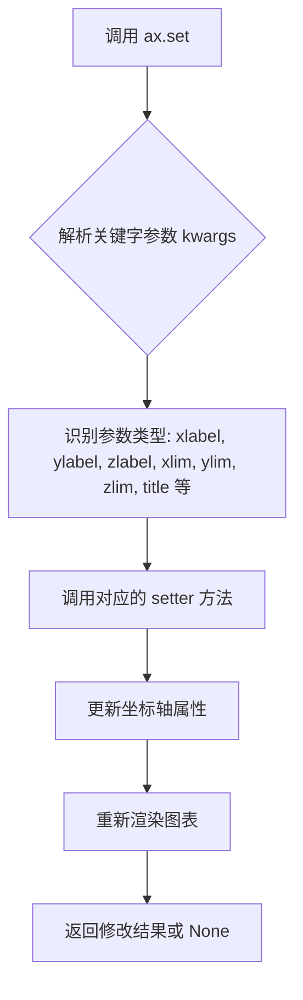
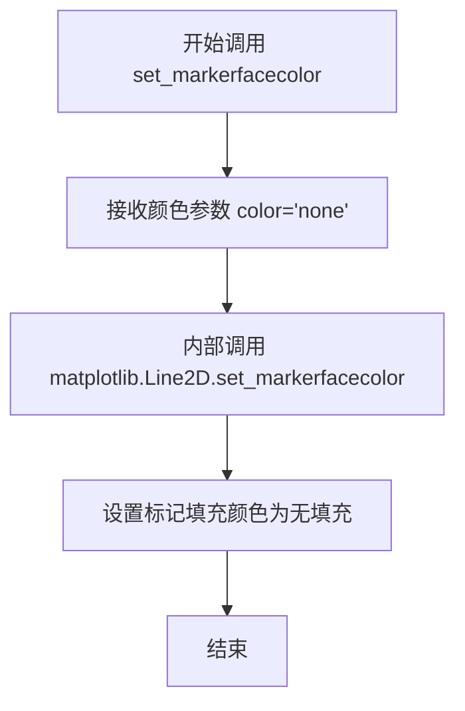

# `matplotlib\galleries\examples\mplot3d\stem3d_demo.py` 详细设计文档

这是一个matplotlib 3D stem图的演示代码，用于展示如何绘制从基线到z坐标的垂直线（stem lines），并在尖端放置标记（markers），同时演示了如何自定义基线位置、线条格式和标记方向。

## 整体流程

```mermaid
graph TD
    A[开始] --> B[导入 matplotlib.pyplot 和 numpy]
B --> C[生成角度数据 theta = linspace(0, 2π)]
C --> D[计算坐标 x=cos(θ-π/2), y=sin(θ-π/2), z=θ]
D --> E[创建3D子图 fig, ax = subplots(subplot_kw=dict(projection='3d'))]
E --> F[调用 ax.stem(x, y, z) 绘制第一个stem图]
F --> G[调用 plt.show() 显示图形]
G --> H[创建第二个stem图，自定义 linefmt, markerfmt, bottom 参数]
H --> I[设置 markerfacecolor='none' 去除填充]
I --> J[调用 plt.show() 显示图形]
J --> K[创建第三个stem图，设置 orientation='x' 改变方向]
K --> L[设置坐标轴标签 xlabel, ylabel, zlabel]
L --> M[调用 plt.show() 显示最终图形]
```

## 类结构

```
本代码为脚本文件，无自定义类层次结构
主要使用 matplotlib.pyplot 和 numpy 库的函数式API
核心组件: matplotlib.axes3d.Axes3D
关键方法: Axes3D.stem()
```

## 全局变量及字段


### `theta`
    
从0到2π的角度数组

类型：`numpy.ndarray`
    


### `x`
    
x坐标，等于cos(θ-π/2)

类型：`numpy.ndarray`
    


### `y`
    
y坐标，等于sin(θ-π/2)

类型：`numpy.ndarray`
    


### `z`
    
z坐标，等于θ

类型：`numpy.ndarray`
    


### `fig`
    
图形对象

类型：`matplotlib.figure.Figure`
    


### `ax`
    
3D坐标轴对象

类型：`matplotlib.axes._subplots.Subplot3D`
    


### `markerline`
    
stem图的标记线对象

类型：`matplotlib.collections.PathCollection`
    


### `stemlines`
    
stem图的茎线对象

类型：`matplotlib.collections.LineCollection`
    


### `baseline`
    
stem图的基线对象

类型：`matplotlib.lines.Line2D`
    


    

## 全局函数及方法


### `np.linspace`

`np.linspace` 是 NumPy 库中的一个函数，用于生成指定范围内的等间距数值序列。它接受起始值、终止值和样本数量作为主要参数，返回一个包含从起始值到终止值的均匀间隔数值的 NumPy 数组，常用于创建测试数据、坐标轴和数值序列。

参数：

- `start`：`float`，序列的起始值
- `stop`：`float`，序列的终止值（如果 `endpoint` 为 True，则包含该值）
- `num`：`int`，可选参数，默认为 50，要生成的样本数量
- `endpoint`：`bool`，可选参数，默认为 True，如果为 True，则 stop 是最后一个样本
- `retstep`：`bool`，可选参数，默认为 False，如果为 True，则返回 (samples, step)
- `dtype`：`dtype`，可选参数，默认为 None，输出数组的数据类型
- `axis`：`int`，可选参数，默认为 0，结果数组中存储样本的轴（仅当 stop 是数组或涉及多维操作时使用）

返回值：`ndarray`，包含等间距数值的数组；如果 `retstep` 为 True，则返回元组 (samples, step)，其中 step 是样本之间的间距

#### 流程图

```mermaid
flowchart TD
    A[开始调用 np.linspace] --> B[验证参数合法性]
    B --> C{num > 0?}
    C -->|否| D[抛出 ValueError]
    C -->|是| E{stop 是数组?}
    E -->|是| F[处理数组输入]
    E -->|否| G[计算步长 step]
    G --> H{endpoint 为 True?}
    H -->|是| I[step = (stop - start) / (num - 1)]
    H -->|否| J[step = (stop - start) / num]
    I --> K[生成等间距数组]
    J --> K
    F --> K
    K --> L{retstep 为 True?}
    L -->|是| M[返回数组和步长元组]
    L -->|否| N[仅返回数组]
    M --> O[结束]
    N --> O
    D --> O
```

#### 带注释源码

```python
def linspace(start, stop, num=50, endpoint=True, retstep=False, dtype=None, axis=0):
    """
    返回指定范围内的等间距数值序列。
    
    参数:
        start: 序列的起始值
        stop: 序列的终止值
        num: 生成的样本数量（默认50）
        endpoint: 是否包含终止值（默认True）
        retstep: 是否返回步长（默认False）
        dtype: 输出数组的数据类型
        axis: 存储样本的轴
    
    返回:
        ndarray 或 (ndarray, float): 等间距数组，可选返回步长
    """
    # 验证样本数量必须为非负整数
    if num < 0:
        raise ValueError("Number of samples must be non-negative")
    
    # 处理步长计算
    if endpoint:
        # 包含终止值，步长 = 范围 / (样本数 - 1)
        step = (stop - start) / (num - 1) if num > 1 else 0
    else:
        # 不包含终止值，步长 = 范围 / 样本数
        step = (stop - start) / num
    
    # 使用arange生成序列并乘以步长加上起始值
    # 最终生成num个等间距的样本点
    y = _arange_or_nan(stop, step, num, start)
    
    # 处理dtype转换
    if dtype is not None:
        y = y.astype(dtype, copy=False)
    
    # 根据retstep决定返回值
    if retstep:
        return y, step
    else:
        return y
```

#### 关键组件信息

| 组件名称 | 一句话描述 |
|---------|-----------|
| `np.linspace` | 生成指定范围内等间距数值序列的核心函数 |
| `np.arange` | 用于生成基础数值序列的辅助函数 |
| `step` (步长) | 控制相邻数值之间间隔的计算结果 |

#### 潜在技术债务或优化空间

1. **参数验证不够全面**：当前实现对某些边界情况的验证可以加强，例如对 `dtype` 参数的类型检查
2. **文档可改进**：可以添加更多关于 `axis` 参数在多维场景下行为的详细说明
3. **性能优化**：对于大规模数组生成，可以考虑使用更高效的底层实现

#### 其他项目

**设计目标与约束**：
- 设计目标：提供简单直观的等间距数值序列生成接口
- 约束：`num` 必须为非负整数，`endpoint` 决定是否包含终止值

**错误处理与异常设计**：
- 当 `num < 0` 时抛出 `ValueError`
- 当 `num == 0` 时返回空数组
- 当 `num == 1` 且 `endpoint=True` 时返回仅包含起始值的数组

**数据流与状态机**：
- 输入：起始值、终止值、样本数量及可选参数
- 处理：计算步长 → 生成序列 → 类型转换
- 输出：等间距数值数组或包含数组和步长的元组

**外部依赖与接口契约**：
- 依赖 NumPy 核心库
- 属于 NumPy 数组创建函数族（与 `np.arange`、`np.logspace` 等相关）


### `np.cos`

NumPy库的余弦函数，计算输入数组或标量中每个元素的余弦值（以弧度为单位）。

参数：

-  `x`：`float` 或 `array_like`，输入角度（弧度制），可以是标量值或数组

返回值：`ndarray` 或 `scalar`，返回输入角度的余弦值，类型与输入相同

#### 流程图



#### 带注释源码

```python
# np.cos 函数的实现原理（概念层面）
# 在NumPy中，np.cos 是基于C/Fortran实现的高效三角函数

# 代码中的实际使用示例：
theta = np.linspace(0, 2*np.pi)  # 生成0到2π的等间距数组
x = np.cos(theta - np.pi/2)      # 计算每个角度减去π/2后的余弦值
# 解释：将角度偏移π/2后计算余弦，相当于计算-sin

# 数学原理：
# cos(θ - π/2) = sin(θ)  （余弦的相位移动性质）
# 因此 x = sin(theta)，y = cos(theta)
```


### np.sin

正弦三角函数，计算输入数组中每个元素的正弦值（以弧度为单位）。该函数是 NumPy 库中的数学函数，接受弧度制的角度输入并返回对应角度的正弦值，结果数组中每个元素均在 [-1, 1] 范围内。

参数：

- `x`：`numpy.ndarray` 或类似可迭代对象，输入角度值（弧度制），可以是标量或数组

返回值：`numpy.ndarray`，输入角度对应的正弦值，类型为 float64 的 numpy 数组

#### 流程图



#### 带注释源码

```python
# np.sin 函数源码说明
# 来源：NumPy 库核心数学函数

# 示例用法（在给定代码中）
theta = np.linspace(0, 2*np.pi)  # 生成0到2π的等间距数组
y = np.sin(theta - np.pi/2)      # 计算theta - π/2的正弦值

# np.sin 函数内部实现逻辑（概念性）
def sin(x):
    """
    计算输入的正弦值
    
    参数:
        x: 输入角度，弧度制
    
    返回:
        正弦值数组
    """
    # 将输入转换为numpy数组（如果还不是）
    x = np.asarray(x)
    
    # 使用C语言实现的sin函数计算每个元素
    # 返回结果与输入形状相同的numpy数组
    return np.sin(x)  # 内部调用C/Cython实现的高效计算
```


### `plt.subplots`

`plt.subplots` 是 matplotlib 库中的一个重要函数，用于创建一个新的图形窗口（Figure）以及一个或多个子图坐标轴（Axes）。该函数将图形和坐标轴的创建合并为一步，返回图形对象和坐标轴对象（或坐标轴数组），便于后续绑图操作。在 3D 绑图中，通常配合 `subplot_kw=dict(projection='3d')` 参数来创建支持 3D 绑图的坐标轴对象。

参数：

- `nrows`：`int`，可选，默认值为 1，表示子图的行数
- `ncols`：`int`，可选，默认值为 1，表示子图的列数
- `sharex`：`bool` 或 `str`，可选，默认值为 False，如果为 True，则所有子图共享 x 轴
- `sharey`：`bool` 或 `str`，可选，默认值为 False，如果为 True，则所有子图共享 y 轴
- `squeeze`：`bool`，可选，默认值为 True，如果为 True，则返回的坐标轴对象数组维度会被优化
- `width_ratios`：`array-like`，可选，定义每列的宽度相对比例
- `height_ratios`：`array-like`，可选，定义每行的相对高度比例
- `subplot_kw`：`dict`，可选，传递给 `add_subplot` 的关键字参数，用于配置子图，在 3D 绑图中通常传入 `dict(projection='3d')`
- `gridspec_kw`：`dict`，可选，传递给 `GridSpec` 的关键字参数
- `**fig_kw`：额外关键字参数，传递给 `Figure` 构造函数的参数

返回值：`tuple(Figure, Axes or array of Axes)`，返回创建的图形对象和坐标轴对象（或坐标轴对象数组）

#### 流程图



#### 带注释源码

```python
# plt.subplots 函数源码结构示意（基于 matplotlib 源码简化）

def subplots(nrows=1, ncols=1, *, sharex=False, sharey=False, 
             squeeze=True, width_ratios=None, height_ratios=None,
             subplot_kw=None, gridspec_kw=None, **fig_kw):
    """
    创建图形和子图坐标轴的便捷函数
    
    参数:
        nrows: 子图行数
        ncols: 子图列数
        sharex: 是否共享 x 轴
        sharey: 是否共享 y 轴
        squeeze: 是否优化返回的坐标轴维度
        width_ratios: 每列宽度比例
        height_ratios: 每行高度比例
        subplot_kw: 子图关键字参数（如 projection='3d'）
        gridspec_kw: 网格规范关键字参数
        **fig_kw: 传递给 Figure 的额外参数
    """
    
    # 1. 创建图形对象，传入 Figure 构造参数
    fig = Figure(**fig_kw)
    
    # 2. 处理 gridspec 网格规范配置
    if gridspec_kw is None:
        gridspec_kw = {}
    
    # 3. 设置宽高比例
    if width_ratios is not None:
        gridspec_kw['width_ratios'] = width_ratios
    if height_ratios is not None:
        gridspec_kw['height_ratios'] = height_ratios
    
    # 4. 调用图形的 subplots 方法创建子图
    # 此处会创建 Axes 对象并应用 subplot_kw 配置
    axes = fig.subplots(nrows=nrows, ncols=ncols, 
                        sharex=sharex, sharey=sharey,
                        squeeze=squeeze, 
                        subplot_kw=subplot_kw,
                        gridspec_kw=gridspec_kw)
    
    # 5. 返回图形和坐标轴元组
    return fig, axes


# 在 3D 绑图中的典型使用示例
fig, ax = plt.subplots(subplot_kw=dict(projection='3d'))
# subplot_kw=dict(projection='3d') 会传递给 Axes3D 构造函数
# 使其创建支持 3D 绑图功能的坐标轴对象
```


### `ax.stem` / `Axes3D.stem`

该函数用于在3D坐标系中绘制stem图（茎叶图/须图），通过从基线到z坐标的垂直线段表示数据点，并在端点处放置标记符，常用于展示一维数据沿某一轴的分布或离散数据点的可视化。

参数：

- `x`：`array-like`，X轴坐标数据，定义每个stem线端点的X位置
- `y`：`array-like`，Y轴坐标数据，定义每个stem线端点的Y位置
- `z`：`array-like`，Z轴坐标数据，定义每个stem线端点的高度（Z坐标），也是stem线的终点
- `linefmt`：`str`，可选，茎线的格式字符串，控制线条颜色、线型等属性，默认为None
- `markerfmt`：`str`，可选，标记点的格式字符串，控制顶部标记的样式，默认为None
- `basefmt`：`str`，可选，基线的格式字符串，控制底部基线的样式，默认为None
- `bottom`：`float`或`array-like`，可选，基线的Z坐标位置，默认为0
- `orientation`：`str`，可选，stem线的投影方向，可选值为'x'、'y'或'z'，默认为'z'

返回值：

- `markerline`：`Line3DCollection`，返回顶部标记的线条集合对象，可通过set_markerfacecolor等方法进一步自定义样式
- `stemlines`：`Line3DCollection`，返回茎线（从基线到数据点）的线条集合对象
- `baseline`：`Line3D`，返回基线对象

#### 流程图



#### 带注释源码

```python
# 示例代码来源：matplotlib Axes3D.stem 方法调用示例

# ============ 基础用法 ============
fig, ax = plt.subplots(subplot_kw=dict(projection='3d'))  # 创建3D坐标轴
ax.stem(x, y, z)  # 绘制基本3D stem图

# ============ 自定义格式用法 ============
fig, ax = plt.subplots(subplot_kw=dict(projection='3d'))
# 调用stem方法并传入格式参数，返回三个对象
markerline, stemlines, baseline = ax.stem(
    x, y, z,              # 坐标数据
    linefmt='grey',       # 茎线颜色为灰色
    markerfmt='D',        # 标记形状为菱形(Diamond)
    bottom=np.pi)         # 基线位置在z=π处
# 通过返回的markerline对象自定义标记样式
markerline.set_markerfacecolor('none')  # 设置标记无填充

# ============ 方向控制用法 ============
fig, ax = plt.subplots(subplot_kw=dict(projection='3d'))
# orientation='x'表示茎线沿x方向投影，基线在yz平面
markerline, stemlines, baseline = ax.stem(
    x, y, z, 
    bottom=-1,            # 基线位置在z=-1
    orientation='x')      # 沿x轴方向投影
ax.set(xlabel='x', ylabel='y', zlabel='z')  # 设置坐标轴标签

plt.show()  # 显示图形
```

---

#### 关键组件信息

| 组件名称 | 一句话描述 |
|---------|-----------|
| `Axes3D.stem` | matplotlib 3D坐标轴类中绘制茎叶图的核心方法 |
| `Line3DCollection` | 用于存储多条3D线条的集合对象，支持批量设置样式 |
| `Line3D` | 单条3D线条对象，用于表示基线 |
| `subplot_kw` | 创建子图时的关键字参数，用于指定投影类型为3D |

#### 潜在的技术债务或优化空间

1. **格式参数受限**：与`Axes3D.plot`不同，`stem`方法并非所有属性都可通过关键字参数配置，用户需要通过返回的Line对象进行二次自定义，增加学习成本
2. **文档一致性**：不同绘图方法（如plot vs stem）的参数接口设计不一致，可能导致API使用上的困惑
3. **性能考量**：当数据点数量较大时，stem图可能产生较多独立的线条对象，渲染性能可能受影响

#### 其它项目

**设计目标与约束**：
- 目标：提供一种在3D空间中可视化离散数据点分布的方式，通过垂直线段清晰展示数据沿某一轴的相对关系
- 约束：格式自定义能力有限，不支持所有matplotlib line属性的直接传入

**错误处理与异常设计**：
- 当`x`, `y`, `z`长度不一致时，NumPy会抛出广播相关错误
- `orientation`参数仅接受'x'/'y'/'z'三个有效值，其他值可能导致异常

**外部依赖与接口契约**：
- 依赖`matplotlib.pyplot`和`numpy`库
- 返回的三个Line对象继承自matplotlib.collections.Collection，可使用其所有样式方法


### `plt.show`

显示所有当前打开的图形窗口。该函数会阻塞程序执行，直到用户关闭所有显示的图形窗口，通常放在绘图代码的最后以展示结果。

参数：无需参数

返回值：`None`，无返回值

#### 流程图



#### 带注释源码

```python
import matplotlib.pyplot as plt
import numpy as np

# 创建数据
theta = np.linspace(0, 2*np.pi)
x = np.cos(theta - np.pi/2)
y = np.sin(theta - np.pi/2)
z = theta

# 创建3D图形和轴
fig, ax = plt.subplots(subplot_kw=dict(projection='3d'))

# 绘制3D stem图
ax.stem(x, y, z)

# 显示图形窗口，阻塞程序直到用户关闭窗口
plt.show()

# %% 第二个示例

# 重新创建图形，使用自定义格式
fig, ax = plt.subplots(subplot_kw=dict(projection='3d'))
markerline, stemlines, baseline = ax.stem(
    x, y, z, linefmt='grey', markerfmt='D', bottom=np.pi)
markerline.set_markerfacecolor('none')

# 再次显示图形
plt.show()

# %% 第三个示例

# 创建带方向参数的图形
fig, ax = plt.subplots(subplot_kw=dict(projection='3d'))
markerline, stemlines, baseline = ax.stem(x, y, z, bottom=-1, orientation='x')
ax.set(xlabel='x', ylabel='y', zlabel='z')

# 显示第三个图形
plt.show()
```


### `Axes.set`

设置坐标轴的属性，如标签、标题、范围等。该方法是 matplotlib 中 Axes 类的核心方法，用于配置坐标轴的各种视觉和功能属性。

参数：

-  `**kwargs`：关键字参数，用于设置各种坐标轴属性。常见的参数包括：
  - `xlabel`：字符串，设置 x 轴标签
  - `ylabel`：字符串，设置 y 轴标签
  - `zlabel`：字符串，设置 z 轴标签（3D 坐标轴）
  - `xlim`：元组，设置 x 轴范围 (min, max)
  - `ylim`：元组，设置 y 轴范围 (min, max)
  - `zlim`：元组，设置 z 轴范围 (min, max)（3D 坐标轴）
  - `title`：字符串，设置图表标题
  -  以及其他众多属性如颜色、刻度、网格等

返回值：`set` 方法在 matplotlib 旧版本中返回修改后的 Artist 列表，新版本中通常返回 None 或调用链。

#### 流程图



#### 带注释源码

```python
# 代码中的实际调用示例
fig, ax = plt.subplots(subplot_kw=dict(projection='3d'))
markerline, stemlines, baseline = ax.stem(x, y, z, bottom=-1, orientation='x')
# 设置坐标轴标签
ax.set(xlabel='x', ylabel='y', zlabel='z')

# set 方法的典型实现原理（简化版）
def set(self, **kwargs):
    """
    设置坐标轴的多个属性。
    
    参数:
        **kwargs: 关键字参数，键为属性名，值为属性值。
    """
    # 遍历所有传入的关键字参数
    for key, value in kwargs.items():
        # 根据属性名获取对应的 setter 方法
        setter = getattr(self, f'set_{key}', None)
        if setter is not None:
            # 调用对应的 setter 方法设置属性
            setter(value)
        else:
            # 如果没有对应的 setter，尝试直接设置属性
            if hasattr(self, key):
                setattr(self, key, value)
    
    # 返回 self 以支持链式调用（旧版本行为）
    return self
```

在代码中，`ax.set(xlabel='x', ylabel='y', zlabel='z')` 的作用是：
1. 设置 x 轴标签为 'x'
2. 设置 y 轴标签为 'y'  
3. 设置 z 轴标签为 'z'

这是 3D 坐标轴的标准配置，使得图表能够正确显示各轴的含义。


### `markerline.set_markerfacecolor`

设置 3D stem 图中标记的填充颜色。

参数：
- `color`：字符串或元组，标记填充颜色。在代码中传入 `'none'` 表示无填充（即透明）。

返回值：无，该方法直接修改对象状态，不返回有意义的值。

#### 流程图



#### 带注释源码

```python
# 调用 markerline 对象的 set_markerfacecolor 方法
# 参数 'none' 表示设置标记填充颜色为无（即透明）
markerline.set_markerfacecolor('none')
```

## 关键组件


### 3D Stem Plot 渲染组件

使用matplotlib的Axes3D.stem()方法在三维坐标系中绘制茎图，展示了从基准面(bottom)延伸到数据点的垂直线序列，并在每个数据点处放置标记符号，形成类似"茎"的视觉效果。

### 三角函数数据生成组件

利用numpy的linspace生成角度序列theta，然后通过cos()和sin()函数计算x、y坐标（构成圆形路径），z轴使用theta值直接赋值，形成螺旋上升的三维数据点集合。

### 3D坐标轴配置组件

通过plt.subplots()的subplot_kw参数设置projection='3d'，创建带有三维投影的Axes3D对象，用于承载stem图的可视化渲染。

### Stem函数参数控制组件

支持多种参数定制化显示效果：linefmt控制茎线样式、markerfmt控制标记样式、basefmt控制基准线样式、bottom参数调整基准面位置、orientation参数改变茎线的投影方向（'x'、'y'、'z'三个方向）。

### 图形对象返回组件

stem()方法返回三个图形对象句柄：markerline（标记线对象，可通过set_markerfacecolor()等方法进一步美化）、stemlines（所有茎线的Line3D集合）、baseline（基准线的Line3D对象），允许用户进行细粒度的样式调整。


## 问题及建议


### 已知问题

- 魔法数字与硬编码值：代码中使用了 `np.pi/2`、`np.pi` 等数值以及 `'grey'`、`'D'`、`'none'` 等字符串常量，缺乏常量定义，可读性和可维护性差
- 缺少输入数据验证：没有验证 x、y、z 数组长度是否一致，可能导致运行时错误
- 代码重复：创建 figure 和 ax 的模式在三个示例中重复出现三次，未进行封装
- 缺乏类型注解：Python 代码未使用类型提示，降低了代码的可读性和 IDE 支持
- 文档不够详细：模块级文档字符串仅简单描述功能，缺少参数说明、返回值说明和示例用法
- 资源未正确释放：创建多个 figure 后未显式关闭，可能导致资源泄漏
- 异常处理缺失：未处理 matplotlib 版本不支持 3D 投影、数据类型不支持等情况

### 优化建议

- 定义常量：将 `np.pi`、`np.pi/2`、`'grey'`、`'D'` 等提取为模块级常量或配置参数
- 封装为函数：将重复的 fig/ax 创建逻辑封装为函数，接受参数并返回 axes 对象
- 添加类型注解：为函数参数和返回值添加类型提示
- 增强文档：为模块和关键函数添加 NumPy 风格或 Google 风格的详细文档字符串
- 添加输入验证：在数据处理前验证数组维度和类型一致性
- 添加异常处理：使用 try-except 捕获可能的异常，如 `ProjectionNotFoundError`
- 资源管理：使用 `plt.close(fig)` 或上下文管理器管理图形资源
- 使用更现代的 numpy：考虑使用 `np.full_like`、`np.arange` 等更表达性的 API


## 其它


### 设计目标与约束

本代码演示matplotlib 3D stem图的用法，属于教学示例性质。设计目标包括：展示3D stem图的基本用法、演示不同参数(linefmt/markerfmt/basefmt)的效果、展示orientation参数对图形方向的影响。约束条件为依赖matplotlib和numpy库，需要支持3D投影的Axes对象。

### 错误处理与异常设计

本示例代码未包含显式的错误处理机制。潜在错误场景包括：数据维度不匹配时matplotlib会抛出ValueError；不支持的projection类型会触发AttributeError；numpy数组维度不一致时会产生广播错误。在实际应用中应添加数据验证、异常捕获和友好的错误提示。

### 数据流与状态机

数据流：theta数组 → x/y/z坐标计算 → stem方法调用 → 图形渲染。状态转换：初始化数据 → 创建3D坐标轴 → 调用stem绘图 → 显示图形。stem方法内部创建三种图形元素：markerline(标记点)、stemlines(连线)、baseline(基准线)，返回三个艺术对象供后续自定义修改。

### 外部依赖与接口契约

主要依赖：matplotlib.pyplot提供绘图接口，numpy提供数值计算。关键接口：ax.stem(x, y, z, linefmt, markerfmt, basefmt, bottom, orientation)方法，返回(markerline, stemlines, baseline)三元组。linefmt/markerfmt/basefmt接受格式字符串，bottom接受数值设置基准面位置，orientation支持'x'/'y'/'z'方向。

### 配置与参数说明

核心参数：x/y/z为等长数组表示3D坐标点；linefmt控制连线样式(默认'C0-')；markerfmt控制标记样式(默认'C0o')；basefmt控制基准线样式(默认'r-')；bottom设置基准面z值(默认0)；orientation设置投影方向(默认'z')。

### 图形渲染流程

plt.subplots创建Figure和Axes对象 → subplot_kw=dict(projection='3d')启用3D投影 → ax.stem()计算并绘制stem元素 → plt.show()渲染显示。stem内部实现：计算每个(x,y,z)点到bottom基准面的连线，在z位置绘制标记，绘制底部的基准线/面。

### 技术实现细节

代码使用参数化圆周(θ从0到2π)生成环形数据分布，x=cos(θ-π/2)、y=sin(θ-π/2)创建圆在xy平面，z=θ沿z轴延伸形成螺旋结构。第二/三幅图展示返回值的高级用法：通过返回的artist对象自定义样式(set_markerfacecolor等)。

### 潜在的技术债务或优化空间

当前示例缺乏交互性，无用户输入验证。代码复用性低，每个示例独立创建figure。注释可更详细说明返回值各元素的类型和可用方法。建议封装为函数接受不同参数组合，增强代码模块化程度。

### 关键组件信息

ax.stem方法：Axes3D类的核心绘图方法，负责计算3Dstem图形的所有几何元素并返回三个Line3DCollection对象供进一步自定义。markerline：Line3D对象集合，表示数据点的标记符号。stemlines：Line3D对象集合，表示数据点到基准面的连线。baseline：Line3D对象，表示基准面线/面。

    