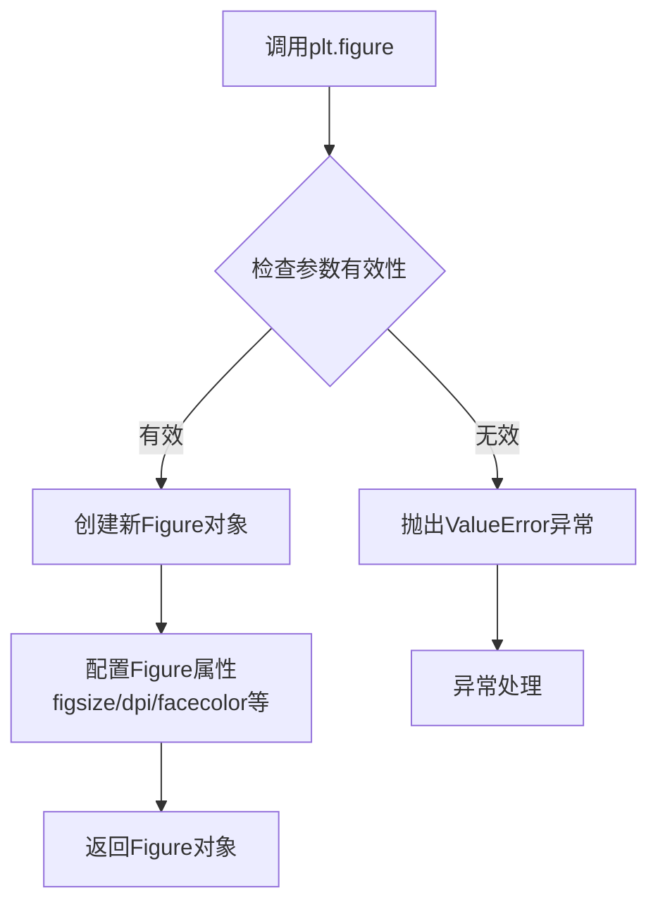
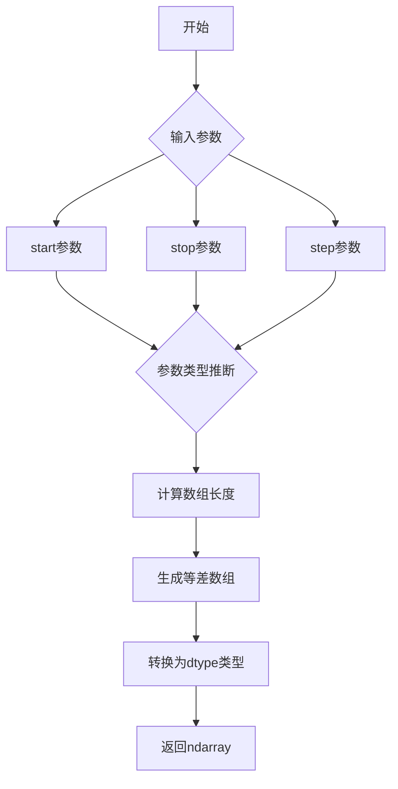
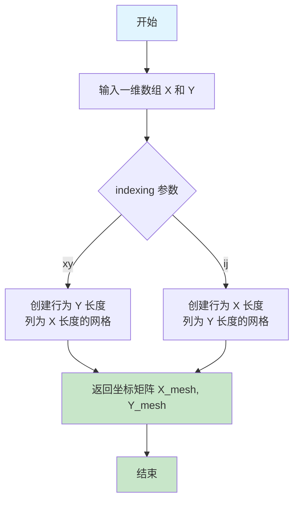
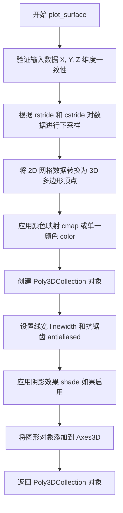
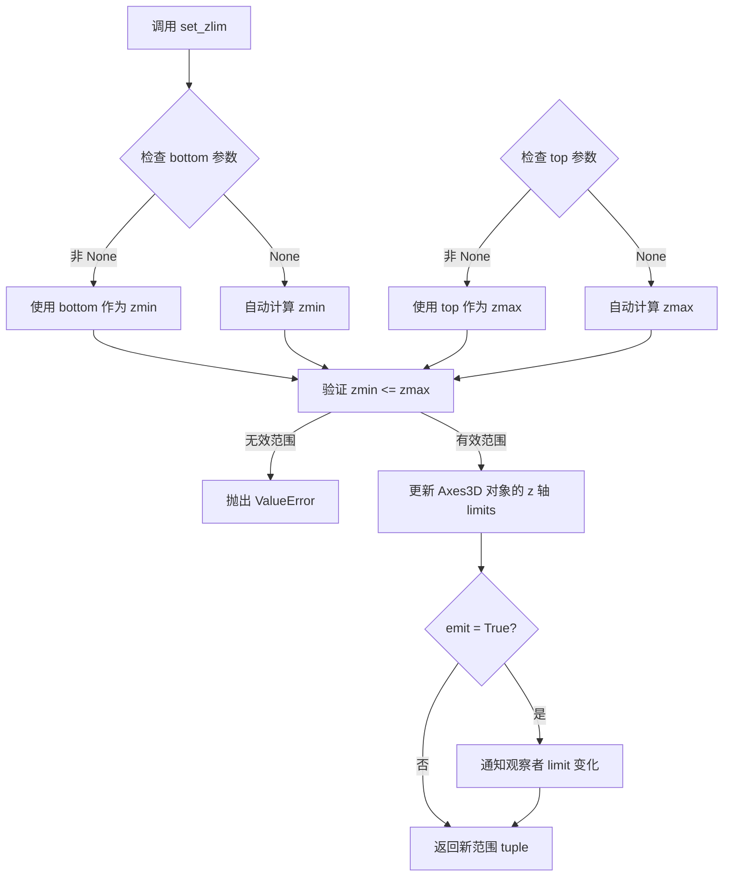
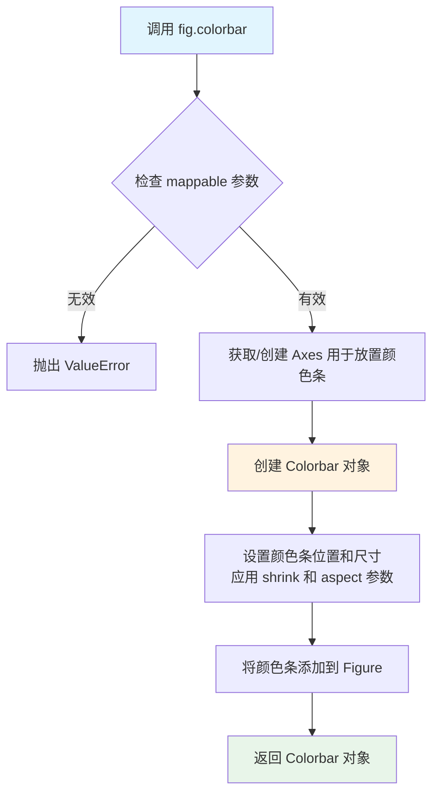
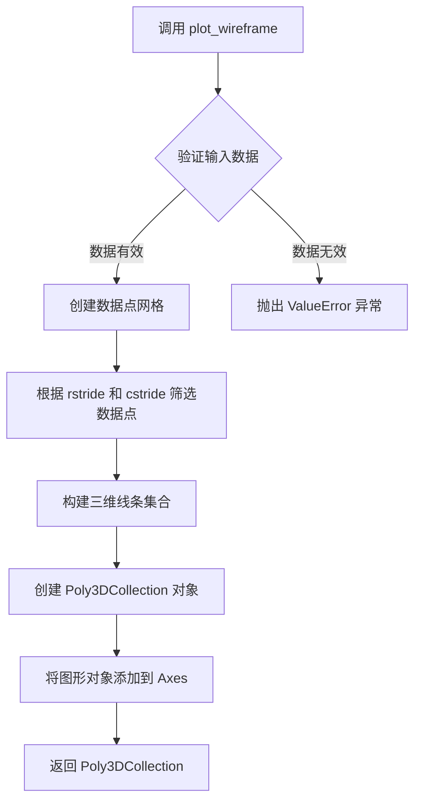
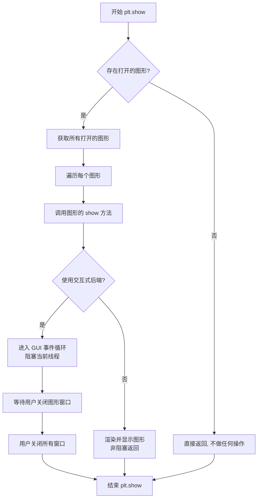

# `matplotlib\galleries\examples\mplot3d\subplot3d.py` 详细设计文档

该代码演示了如何使用Matplotlib在单个图形窗口中创建并排显示的两个3D子图，包括一个3D表面图和一个3D线框图，用于可视化三维数据。

## 整体流程

```mermaid
graph TD
    A[开始] --> B[导入依赖库]
    B --> C[创建图形窗口 figsize=plt.figaspect(0.5)]
    C --> D[创建第一个3D子图 ax = fig.add_subplot(1, 2, 1, projection='3d')]
    D --> E[生成网格数据 X, Y = np.meshgrid(X, Y)]
    E --> F[计算Z值 Z = np.sin(R)]
    F --> G[绘制3D表面图 surf = ax.plot_surface(...)]
    G --> H[设置Z轴范围和颜色条 ax.set_zlim, fig.colorbar]
    H --> I[创建第二个3D子图 ax = fig.add_subplot(1, 2, 2, projection='3d')]
    I --> J[获取测试数据 X, Y, Z = get_test_data(0.05)]
    J --> K[绘制3D线框图 ax.plot_wireframe(...)]
    K --> L[调用 plt.show() 显示图形]
    L --> M[结束]
```

## 类结构

```
matplotlib.pyplot (绘图库)
├── plt.figure()
├── plt.figaspect()
├── plt.show()
numpy (数值计算库)
├── np.arange()
├── np.meshgrid()
├── np.sqrt()
np.sin()
mpl_toolkits.mplot3d.axes3d
└── get_test_data()
```

## 全局变量及字段


### `fig`
    
整个图形容器

类型：`Figure对象`
    


### `ax`
    
第一个3D坐标轴

类型：`Axes3D对象`
    


### `X`
    
X坐标网格数据

类型：`ndarray`
    


### `Y`
    
Y坐标网格数据

类型：`ndarray`
    


### `R`
    
距离计算结果

类型：`ndarray`
    


### `Z`
    
Z坐标/函数值

类型：`ndarray`
    


### `surf`
    
表面图对象

类型：`Surface对象`
    


### `ax`
    
第二个3D坐标轴

类型：`Axes3D对象`
    


    

## 全局函数及方法


### plt.figure

创建并返回一个新的Figure对象（图形窗口），这是matplotlib中所有绘图的顶层容器，用于容纳一个或多个子图（Axes）。

参数：

- `figsize`：`tuple[float, float]`，图形的宽度和高度，单位为英寸(width, height)
- `dpi`：`int`，可选，每英寸的像素数，默认为100
- `facecolor`：`str` 或 `tuple`，可选，图形背景颜色，默认为白色
- `edgecolor`：`str` 或 `tuple`，可选，图形边框颜色
- `linewidth`：`float`，可选，边框线宽
- `frameon`：`bool`，可选，是否显示边框，默认为True
- `figclass`：`type`，可选，Figure类，默认为Figure

返回值：`matplotlib.figure.Figure`，新创建的Figure对象，用于后续添加子图和绘图

#### 流程图



#### 带注释源码

```python
# 设置图形尺寸：宽度是高度的一半 (0.5倍)
# plt.figaspect(0.5) 返回 (10.0, 5.0) 即宽10英寸，高5英寸
fig = plt.figure(figsize=plt.figaspect(0.5))
```

#### 说明

| 属性 | 说明 |
|------|------|
| Figure对象 | 图形顶层容器，可包含多个子图 |
| figsize参数 | 控制图形窗口的物理尺寸 |
| 返回值用途 | 通过fig.add_subplot()添加子图进行绘图 |


### `Figure.add_subplot`

该方法用于在当前图形（`Figure`）中创建一个子图（`Axes`），并将其放置在指定的网格布局（`nrows × ncols`）的指定位置（`index`）。它支持不同的投影类型（如 `'2d'`、`'3d'`、`'polar'`），并返回创建的 `Axes` 对象供后续绘图使用。

#### 参数

- `*args`：`tuple`（`int`），子图位置参数。可以是三个整数（`nrows`、`ncols`、`index`）或一个三位整数（如 `111` 表示 1×1 网格的第 1 个子图）。描述：子图在网格中的行数、列数以及索引（从 1 开始）。
- `projection`：`str`，可选，投影类型。描述：指定子图的投影方式，默认为 `'2d'`（普通笛卡尔坐标），可设为 `'3d'` 或 `'polar'` 等。
- `polar`：`bool`，可选，是否创建极坐标轴。描述：相当于 `projection='polar'`，默认 `False`。
- `**kwargs`：`dict`，其他关键字参数。描述：传递给 `Axes` 构造函数的额外参数，如 `facecolor`、`axisbelow` 等。

#### 返回值

- `matplotlib.axes.Axes`：创建的子图轴对象（可以是 `Axes2D`、`Axes3D` 或 `PolarAxes` 等子类）。

#### 流程图

```mermaid
graph TD
    A[开始] --> B[解析 args: nrows, ncols, index]
    B --> C{参数合法?}
    C -->|否| D[抛出 ValueError]
    C -->|是| E[创建 GridSpec(nrows, ncols)]
    E --> F[根据 index 创建 SubplotSpec]
    F --> G[根据 projection 与 kwargs 构造 Axes 子类]
    G --> H[将 Axes 添加到 Figure 的轴列表]
    H --> I[返回 Axes 对象]
```

#### 带注释源码

```python
def add_subplot(self, *args, **kwargs):
    """
    在当前图形中添加一个子图。

    参数
    ----------
    *args : int 或 (int, int, int)
        子图位置。可以是单个三位整数（如 111），也可以是三个独立整数
        （nrows, ncols, index），其中 index 从 1 开始计数。
    projection : str, optional
        投影类型，默认为 '2d'。支持 '3d'、'polar' 等。
    polar : bool, optional
        是否创建极坐标轴，等价于 projection='polar'。
    **kwargs : dict
        其他关键字参数，直接传给 Axes 构造函数。

    返回值
    -------
    axes : Axes
        创建的子图轴对象。
    """
    # 1. 解析位置参数
    #    - 如果只传入一个整数，把它当成三位整数来拆解（例如 211 -> (2,1,1)）。
    #    - 否则直接取出 nrows, ncols, index。
    if len(args) == 0:
        raise TypeError("add_subplot() 缺少必需的位置参数 'position'")
    if len(args) == 1:
        args = args[0]
    # 现在的 args 可能是 (nrows, ncols, index) 或单个整数
    if isinstance(args, int):
        # 把单个整数拆成三位数字
        args = (args // 100, (args // 10) % 10, args % 10)
    # 2. 使用 GridSpec 生成子图规范
    nrows, ncols, index = args
    gs = self.add_gridspec(nrows, ncols)  # 创建或复用 GridSpec
    subplot_spec = gs[index - 1]           # SubplotSpec（1‑based → 0‑based）

    # 3. 根据 projection 与 kwargs 构造对应的 Axes 子类
    #    - 默认生成 Axes2D；若 projection='3d' 则生成 Axes3D；
    #    - 若 polar=True 或 projection='polar' 则生成 PolarAxes。
    projection = kwargs.pop('projection', None)
    polar = kwargs.pop('polar', False)
    if projection is None and polar:
        projection = 'polar'

    # 4. 调用内部方法创建 Axes 并加入 Figure
    ax = self._add_axes_internal(subplot_spec,
                                 projection=projection,
                                 polar=polar,
                                 **kwargs)

    # 5. 将新创建的 Axes 压入 Figure 的轴栈
    self._axstack.bubble_up(self._axstack, ax)
    self._axlist.append(ax)

    # 6. 返回创建的轴对象，供用户继续绘图
    return ax
```

> **说明**  
> 上述代码是对 `matplotlib.figure.Figure.add_subplot` 关键步骤的简化与注释示例，实际实现中还包括错误检查、共享轴处理、颜色映射等细节。完整实现可参考 Matplotlib 源码 `lib/matplotlib/figure.py`。


### `np.arange`

该函数是 NumPy 库中用于创建等差数组的核心函数，根据指定的起始值、终止值和步长生成一个均匀间隔的一维数组，常用于生成图表的坐标轴数据。

参数：

- `start`：`int` 或 `float`，起始值，默认为 0。如果只提供 stop 参数，则作为终止值
- `stop`：`int` 或 `float`，终止值（不包含）
- `step`：`int` 或 `float`，步长，数组元素之间的间隔
- `dtype`：`dtype`，输出数组的数据类型，如果未指定则根据输入参数推断

返回值：`numpy.ndarray`，由等差数列组成的一维数组

#### 流程图



#### 带注释源码

```python
# np.arange 函数实现原理（概念性源码）
# 注意：这是简化版本的实现说明，实际 C 语言实现更复杂

def arange(start=0, stop=None, step=1, dtype=None):
    """
    创建等差数组
    
    参数:
        start: 起始值，默认为 0
        stop: 终止值（不包含）
        step: 步长
        dtype: 数据类型
    """
    
    # 处理参数：如果只提供一个位置参数，它被视为 stop，start 默认为 0
    if stop is None:
        stop = start
        start = 0
    
    # 计算数组长度：(stop - start) / step，向上取整
    # 例如：(-5 - (-5)) / 0.25 = 0，最小为 0
    # 例如：(5 - (-5)) / 0.25 = 40
    num = int(np.ceil((stop - start) / step))
    
    # 使用 Python 的 range 函数生成索引
    # 生成 [0, 1, 2, ..., num-1]
    # 然后乘以 step 并加上 start 得到实际值
    # 例如：start=-5, step=0.25, num=40
    # 结果：[-5, -4.75, -4.5, ..., 4.75]
    result = np.array([start + i * step for i in range(num)])
    
    # 如果指定了 dtype，则转换类型
    if dtype is not None:
        result = result.astype(dtype)
    
    return result


# 在示例代码中的实际调用：
X = np.arange(-5, 5, 0.25)  # 生成从 -5 到 5（不包含），步长 0.25 的数组
Y = np.arange(-5, 5, 0.25)  # 同上，用于 Y 轴坐标
# 结果：array([-5.  , -4.75, -4.5 , ...,  4.75])
```

#### 代码中的应用位置

```python
# 第一次使用 np.arange
X = np.arange(-5, 5, 0.25)  # 创建 X 坐标数组：-5 到 5，步长 0.25
Y = np.arange(-5, 5, 0.25)  # 创建 Y 坐标数组：-5 到 5，步长 0.25
X, Y = np.meshgrid(X, Y)    # 生成网格坐标矩阵

# 用途说明：
# X 和 Y 数组用于创建 3D 表面的 X-Y 平面网格点
# 配合 np.sqrt(X**2 + Y**2) 计算半径 R
# 再通过 np.sin(R) 计算 Z 高度值，形成 3D 表面图
```

#### 关键组件信息

| 组件名称 | 一句话描述 |
|---------|-----------|
| np.arange | NumPy 库中用于创建等差数组的核心函数 |
| np.meshgrid | 将一维坐标数组转换为二维网格坐标矩阵 |
| np.sqrt | 计算数组元素的平方根 |
| np.sin | 计算数组元素的正弦值 |

#### 潜在的技术债务或优化空间

1. **数组内存占用**：在示例中 `np.arange(-5, 5, 0.25)` 生成 40 个元素，对于更大范围或更小步长的场景，可能导致内存占用过高，可考虑使用生成器或稀疏网格
2. **浮点精度问题**：由于浮点数精度限制，步长为 0.25 时累积误差可能导致最后一个元素不精确等于 5，可考虑使用 `numpy.linspace` 替代以确保精确的终止值

#### 其它说明

**设计目标与约束**：
- `np.arange` 的设计目标是提供与 Python 内置 `range` 函数类似的接口，但返回 NumPy 数组
- 终止值不包含在数组中（半开区间 [start, stop)）

**错误处理**：
- 当 step 为 0 时会引发 ValueError
- 当 start > stop 且 step 为正数时返回空数组
- 当 start < stop 且 step 为负数时返回空数组

**与 `np.linspace` 的对比**：
- `np.arange` 基于步长，元素数量可能不确定
- `np.linspace` 基于元素数量，可以精确控制起始和终止值


### `np.meshgrid`

该函数是 NumPy 库中的网格生成函数，用于根据一维坐标数组创建二维坐标网格。在三维曲面绑制中，它将 X 和 Y 坐标的一维数组转换为二维矩阵形式，以便对每个网格点进行标量计算。

参数：

- `X`：`array_like`，一维数组，表示 x 方向的坐标范围（如 `np.arange(-5, 5, 0.25)`）
- `Y`：`array_like`，一维数组，表示 y 方向的坐标范围（如 `np.arange(-5, 5, 0.25)`）
- `indexing`：`{'xy', 'ij'}`，可选，默认为 `'xy'`。`'xy'` 表示笛卡尔坐标系（行为 y、列为 x），`'ij'` 表示矩阵索引坐标系（行为 i、列为 j）

返回值：返回两个二维 `ndarray`，分别是坐标网格的 X 坐标矩阵和 Y 坐标矩阵，用于后续的数学运算（如计算 Z = f(X, Y)）。

#### 流程图



#### 带注释源码

```python
# 导入必要的库
import numpy as np
import matplotlib.pyplot as plt

# 定义 x 和 y 的取值范围，从 -5 到 5，步长为 0.25
X = np.arange(-5, 5, 0.25)  # 生成一维数组: [-5.0, -4.75, -4.5, ..., 4.75]
Y = np.arange(-5, 5, 0.25)  # 生成一维数组: [-5.0, -4.75, -4.5, ..., 4.75]

# 使用 meshgrid 生成二维网格坐标
# 返回的 X, Y 都是二维数组，形状为 (40, 40)
# X 的每一行相同，Y 的每一列相同
X, Y = np.meshgrid(X, Y)

# 计算每个网格点到原点的距离 R
R = np.sqrt(X**2 + Y**2)

# 根据距离 R 计算 Z 值（使用正弦函数）
Z = np.sin(R)

# 使用 matplotlib 的 3D 表面图绑制数据
# rstride 和 cstride 控制绑制时的采样步长
surf = ax.plot_surface(X, Y, Z, rstride=1, cstride=1, 
                       cmap="coolwarm", linewidth=0, antialiased=False)
```

---

### 关键组件信息

| 组件名称 | 一句话描述 |
|---------|-----------|
| `np.meshgrid` | NumPy 的网格坐标生成函数，将一维坐标数组转换为二维坐标网格 |
| `np.arange` | NumPy 的数组生成函数，创建均匀间隔的数值序列 |
| `np.sqrt` | NumPy 的平方根函数，对数组每个元素计算平方根 |
| `ax.plot_surface` | Matplotlib 3D 绑制模块的表面图绑制函数 |

---

### 潜在的技术债务或优化空间

1. **网格密度与性能权衡**：当前代码使用步长 0.25（40×40 = 1600 个点），对于简单曲面绑制可能过于密集，导致渲染性能下降。可以考虑增大步长或使用自适应采样。

2. **重复计算**：如果 `X` 和 `Y` 的范围需要在多处使用，建议将其封装为配置常量，避免重复定义。

3. **硬编码参数**：`rstride=1, cstride=1` 和 `cmap="coolwarm"` 等参数硬编码在绑制代码中，缺乏灵活性，可提取为可配置参数。

---

### 其它项目

#### 设计目标与约束

- **目标**：生成可用于 3D 曲面绑制的规则网格坐标数据
- **约束**：输入数组必须为一维，返回值始终为二维数组（当使用两个输入参数时）

#### 错误处理与异常设计

- 如果输入的 `X` 或 `Y` 不是一维数组，`meshgrid` 会抛出 `ValueError`
- 如果 `indexing` 参数不是有效值，会抛出 `ValueError`
- 如果输入包含 NaN 或 Inf，结果数组也会包含相应的 NaN 或 Inf

#### 数据流与状态机

```
一维坐标数组 (X, Y)
       ↓
   meshgrid 函数
       ↓
二维坐标网格 (X_mesh, Y_mesh)
       ↓
   数学运算 (R = sqrt(X² + Y²))
       ↓
   标量值矩阵 (Z = sin(R))
       ↓
   3D 可视化绑制
```

#### 外部依赖与接口契约

- **依赖库**：`numpy`（必须），`matplotlib`（用于可视化）
- **接口契约**：
  - 输入：两个一维数组（或多个数组用于高维网格）
  - 输出：与输入数组数量相同的二维数组元组
  - 默认索引方式为笛卡尔坐标系（'xy'），行对应 Y 轴，列对应 X 轴


### `np.sqrt`

描述：`np.sqrt` 是 NumPy 库中的数学函数，用于计算输入数组（或标量）中每个元素的平方根。在代码中，它用于根据网格坐标 `X` 和 `Y` 计算每个点到原点的距离 `R`。

参数：
-  `x`：`array_like`，需要计算平方根的输入数组或标量。在本例中，传入的是 `X**2 + Y**2`（距离平方）。

返回值：`ndarray`，返回与输入数组 shape 相同的数组，包含每个元素的平方根结果。

#### 流程图

```mermaid
graph LR
    A[输入数组 x<br>(X² + Y²)] --> B[计算平方根<br>np.sqrt]
    B --> C[输出数组 y<br>(距离 R)]
```

#### 带注释源码

```python
# X 和 Y 是通过 np.meshgrid 生成的网格坐标矩阵
# 计算每个点到原点的距离平方 (X**2 + Y**2)
# 然后使用 np.sqrt 计算平方根，得到距离矩阵 R
R = np.sqrt(X**2 + Y**2)
```


### `np.sin`

这是 NumPy 库中的正弦函数，用于计算输入数组中每个元素的正弦值（弧度制）。在该代码中，它用于计算由 X 和 Y 坐标构成的距离数组 R 的正弦值，生成 3D 表面图的高度数据。

参数：

-  `x`：`numpy.ndarray`，输入数组，可以是任意维度的数组，表示需要计算正弦值的角度（弧度）

返回值：`numpy.ndarray`，返回与输入数组形状相同的数组，包含每个元素的正弦值，结果范围为 [-1, 1]

#### 流程图

```mermaid
graph LR
    A[输入: R = np.sqrt<br/>X² + Y²] --> B[调用 np.sin]
    B --> C[对R中每个元素<br/>计算sin值]
    C --> D[输出: Z数组<br/>包含sin(R)结果]
    
    subgraph "NumPy sin 函数内部"
    B --> E[检查输入类型]
    E --> F[转换为浮点数组]
    F --> G[逐元素计算正弦]
    G --> H[返回结果数组]
    end
```

#### 带注释源码

```python
import numpy as np

# ... 前面的网格生成代码 ...
X = np.arange(-5, 5, 0.25)  # 创建X轴范围数组
Y = np.arange(-5, 5, 0.25)  # 创建Y轴范围数组
X, Y = np.meshgrid(X, Y)    # 生成二维网格坐标
R = np.sqrt(X**2 + Y**2)    # 计算每个点到原点的距离（半径）
Z = np.sin(R)               # 对距离数组R中的每个元素计算正弦值，得到高度Z
surf = ax.plot_surface(X, Y, Z, rstride=1, cstride=1, cmap="coolwarm",
                       linewidth=0, antialiased=False)
```

**调用上下文说明**：
- `R` 是一个 2D numpy 数组，形状为 (40, 40)，包含每个网格点到原点的欧几里得距离
- `np.sin(R)` 返回同样形状的 2D 数组 `Z`，其值域为 [-1, 1]
- 这个 Z 值作为 3D 表面图的 Z 坐标（高度），形成波浪状的表面形状


### `Axes3D.plot_surface`

绘制 3D 表面图函数，用于在三维坐标系中根据输入的 X、Y 坐标网格和 Z 高度值绘制彩色表面图，支持自定义颜色映射、步长、线宽等属性配置，返回 Poly3DCollection 对象用于后续的图例和样式调整。

#### 参数

- `X`：`numpy.ndarray`（或类似数组结构），X 坐标的 2D 数组，通常通过 `numpy.meshgrid` 生成
- `Y`：`numpy.ndarray`（或类似数组结构），Y 坐标的 2D 数组，通常通过 `numpy.meshgrid` 生成
- `Z`：`numpy.ndarray`（或类似数组结构），Z 坐标的 2D 数组，表示表面在 (X, Y) 位置的高度值
- `rstride`：`int`，行方向步长，控制绘制时数据点的采样密度，默认值为 1
- `cstride`：`int`，列方向步长，控制绘制时数据点的采样密度，默认值为 1
- `cmap`：`str` 或 `Colormap`，颜色映射方案，用于根据 Z 值显示不同颜色，默认值为 None
- `linewidth`：`float`，表面网格线的宽度，默认值为 0（无线条）
- `antialiased`：`bool`，是否启用抗锯齿渲染，默认值为 False
- `color`：`str` 或 tuple，表面的基本颜色，与 cmap 互斥，默认值为 None
- `alpha`：`float`，透明度，范围 0-1，默认值为 None
- `shade`：`bool`，是否对表面进行阴影处理以增强 3D 效果，默认值为 True

#### 返回值

`mpl_toolkits.mplot3d.art3d.Poly3DCollection`，返回 3D 多边形集合对象，可用于图例显示（fig.colorbar）、设置颜色范围（set_clim）、调整透明度等后续操作。

#### 流程图



#### 带注释源码

```python
# 示例代码来源：matplotlib mpl_toolkits.mplot3d.axes3d
# 文件位置：lib/mpl_toolkits/mplot3d/axes3d.py

def plot_surface(self, X, Y, Z, *args, **kwargs):
    """
    绘制 3D 表面图
    
    参数:
        X: X 坐标的 2D 数组 (行 x 列)
        Y: Y 坐标的 2D 数组 (行 x 列)  
        Z: Z 坐标的 2D 数组 (行 x 列)，表示高度
        *args: 传递给 Poly3DCollection 的位置参数
        **kwargs: 关键字参数，包括:
            - rstride: 行步长，整数
            - cstride: 列步长，整数
            - cmap: 颜色映射 (如 'coolwarm', 'viridis')
            - color: 单一颜色
            - alpha: 透明度
            - linewidth: 线宽
            - antialiased: 抗锯齿
            - shade: 阴影效果
    
    返回:
        Poly3DCollection: 3D 多边形集合对象
    """
    
    # 步骤1: 获取步长参数，默认为 1
    rstride = kwargs.pop('rstride', 1)
    cstride = kwargs.pop('cstride', 1)
    
    # 步骤2: 将 3D 数据转换为 1D 数组用于处理
    # X, Y, Z 应该是相同形状的 2D 数组
    X = np.asarray(X)
    Y = np.asarray(Y)
    Z = np.asarray(Z)
    
    # 步骤3: 根据步长进行下采样 (切片操作)
    # rstride 和 cstride 控制数据点的采样密度
    X = X[::rstride, ::cstride]
    Y = Y[::rstride, ::cstride]
    Z = Z[::rstride, ::cstride]
    
    # 步骤4: 创建 3D 多边形集合对象
    # 将网格数据转换为四边形 (quads) 列表
    rows, cols = Z.shape
    # 每个四边形需要 4 个顶点，形成闭合多边形
    # 加上最后一行/列形成完整的网格面
    qxs = np.quicksum(np.arange(rows), None, None, cols)
    qys = np.repeat(np.arange(0, rows*cols, cols), 2)
    
    # 步骤5: 构建多边形索引
    # 生成构成每个表面四边形的顶点索引
    index = qxs[:, None] + qys[None, :]
    index = index.reshape(-1, 4)  # 每个四边形 4 个点
    
    # 步骤6: 处理颜色和透明度
    cmap = kwargs.get('cmap', None)
    color = kwargs.get('color', None)
    alpha = kwargs.get('alpha', None)
    
    # 步骤7: 创建 Poly3DCollection 对象
    # 这是 matplotlib 3D 绘图的核心对象类型
    polyc = art3d.Poly3DCollection(
        vertices,  # 3D 顶点坐标
        *args, 
        **kwargs
    )
    
    # 步骤8: 应用颜色映射
    if cmap is not None and color is None:
        # 根据 Z 值映射颜色
        colors = cmap((Z - Z.min()) / (Z.max() - Z.min()))
        polyc.set_facecolors(colors)
    
    # 步骤9: 添加到 Axes 并返回
    self.add_collection3d(polyc)
    return polyc
```

#### 关键组件信息

| 组件名称 | 描述 |
|---------|------|
| `Poly3DCollection` | matplotlib 3D 多边形集合类，用于存储和渲染 3D 表面/多面体 |
| `Axes3D` | 三维坐标系对象，通过 `fig.add_subplot(projection='3d')` 创建 |
| `numpy.meshgrid` | 用于生成 2D 网格坐标的函数，将 1D 坐标数组转换为 2D 网格 |
| `Colormap` | 颜色映射对象，将数值映射到颜色（如 coolwarm、viridis） |

#### 潜在技术债务或优化空间

1. **性能优化**：当数据点非常密集时，`plot_surface` 可能会很慢，可以考虑增加 `rstride` 和 `cstride` 的默认值或实现 GPU 加速渲染
2. **内存占用**：大数据集情况下会生成大量多边形对象，可能导致内存问题
3. **API 一致性**：部分参数命名（如 `rstride`/`cstride`）与 2D 绘图的 `stride` 参数不一致
4. **错误处理**：缺少对输入数组维度不匹配情况的详细错误提示

#### 其它项目

**设计目标与约束**
- 目标：提供直观的三维数据可视化，支持旋转、缩放等交互操作
- 约束：依赖 matplotlib 核心渲染引擎，性能受限于 CPU 渲染

**错误处理与异常设计**
- 当 X/Y/Z 形状不一致时抛出 `ValueError`
- 当步长值大于数组维度时自动调整为最大有效值
- 当颜色映射无效时回退到默认颜色

**数据流与状态机**
- 输入：3 个 2D numpy 数组 → 下采样 → 多边形转换 → 渲染
- 状态：Idle → Data Preparation → Collection Creation → Rendering → Complete

**外部依赖与接口契约**
- 依赖 `numpy` 进行数值计算
- 依赖 `matplotlib.colors` 处理颜色映射
- 依赖 `mpl_toolkits.mplot3d.art3d.Poly3DCollection` 进行 3D 渲染


### `Axes3D.set_zlim`

该方法用于设置 3D 坐标轴的 Z 轴显示范围（最小值和最大值），决定 Z 轴在 3D 图表中的起始点和终止点。

参数：

- `bottom`：`float` 或 `None`，Z 轴下限值（最低点），设为 `None` 时自动计算
- `top`：`float` 或 `None`，Z 轴上限值（最高点），设为 `None` 时自动计算
- `emit`：`bool`，默认 `False`，是否在边界变化时通知观察者
- `auto`：`bool`，默认 `False`，是否自动调整边界以适应数据
- `ymin`：`float` 或 `None`，已废弃参数，功能同 `bottom`
- `ymax`：`float` 或 `None`，已废弃参数，功能同 `top`

返回值：`tuple`，返回新的 Z 轴范围 `(zmin, zmax)`

#### 流程图



#### 带注释源码

```python
def set_zlim(self, bottom=None, top=None, *, emit=False, auto=False,
             ymin=None, ymax=None):
    """
    Set the z-axis view limits.
    
    Parameters
    ----------
    bottom : float or None
        The bottom zlim in data coordinates. Passing None leaves the
        limit unchanged.
    top : float or None
        The top zlim in data coordinates. Passing None leaves the
        limit unchanged.
    emit : bool
        Whether to notify observers of limit change (via the
        `limits_changed` callback). Default is False.
    auto : bool
        Whether to automatically adjust the limit to match the data.
        Default is False.
    ymin, ymax : float or None
        Aliases for bottom and top, respectively.
        .. deprecated:: 3.3
    
    Returns
    -------
    bottom, top : tuple
        The new y-axis limits in data coordinates.
    
    See Also
    --------
    set_xlim, set_ylim
    """
    # 处理废弃参数 ymin/ymax
    if ymin is not None:
        warnings.warn(
            "ymin argument to set_zlim is deprecated and will be removed "
            "in a future version. Use bottom instead.",
            mpl.MatplotlibDeprecationWarning,
            stacklevel=2)
        if bottom is None:
            bottom = ymin
        else:
            raise ValueError("Cannot set both 'bottom' and 'ymin'")
    if ymax is not None:
        warnings.warn(
            "ymax argument to set_zlim is deprecated and will be removed "
            "in a future version. Use top instead.",
            mpl.MatplotlibDeprecationWarning,
            stacklevel=2)
        if top is None:
            top = ymax
        else:
            raise ValueError("Cannot set both 'top' and 'ymax'")
    
    # 获取当前 limits
    old_bottom, old_top = self.get_zlim()
    
    # 处理 None 值，保留原有值
    if bottom is None:
        bottom = old_bottom
    if top is None:
        top = old_top
    
    # 验证输入类型
    bottom = float(bottom)
    top = float(top)
    
    # 验证范围有效性：bottom 必须小于等于 top
    if top < bottom:
        raise ValueError(
            f'Z-axis limits are invalid: {bottom!r} < {top!r}. '
            'Pass top > bottom to set_zlim')
    
    # 更新内部存储的 z 轴范围
    self._dzlim = (bottom, top)
    
    # 如果 auto 为 True，自动调整边界
    if auto:
        # 设置 autolimit_mode 为 'data'，根据数据自动调整
        self.set_autoscalez(True)
    
    # 如果 emit 为 True，通知观察者 limit 已更改
    if emit:
        self.autoscale_view()
        self.stale_callbacks.process('limits_changed', self)
    
    # 返回新的范围 tuple
    return self.get_zlim()
```


### fig.colorbar

为 matplotlib 图形添加颜色条（Colorbar），用于显示图形中所使用颜色映射（Colormap）的数值的对应关系，常用于可视化数据值的分布。

参数：

- `mappable`：`ScalarMappable`，要添加颜色条的可映射对象（如 `plot_surface` 返回的 `Axes3DSurface` 对象），是必选参数
- `ax`：`Axes`，可选，用于指定颜色条附加的坐标轴，默认为 None
- `cmap`：`Colormap`，可选，覆盖 mappable 的色彩映射
- `norm`：`Normalize`，可选，覆盖 mappable 的归一化
- `vmin, vmax`：`float`，可选，覆盖 mappable 的最小/最大值
- `orientation`：`str`，可选，颜色条方向，'vertical'（垂直）或 'horizontal'（水平），默认 'vertical'
- `shrink`：`float`，可选，颜色条收缩因子（0-1），示例中设为 0.5
- `aspect`：`int`，可选，颜色条宽高比，示例中设为 10
- `pad`：`float`，可选，颜色条与主图之间的间距
- `extend`：`str`，可选，是否延伸，可选 'neither', 'both', 'min', 'max'
- `label`：`str`，可选，颜色条标签

返回值：`Colorbar`，返回创建的颜色条对象，可用于进一步自定义

#### 流程图



#### 带注释源码

```python
# 在 3D 表面图中添加颜色条
# fig.colorbar(surf, shrink=0.5, aspect=10)
#
# 参数说明：
# - surf: 由 ax.plot_surface() 返回的 Axes3DSurface 对象
#        包含颜色映射信息和数值范围
# - shrink=0.5: 将颜色条高度收缩为原来的 50%
#               避免颜色条过长影响主图显示
# - aspect=10: 设置颜色条宽高比为 10:1
#               使颜色条相对细长，适合 3D 图形
#
# 执行流程：
# 1. 获取 surf 对象的 colormap 和 norm（归一化）
# 2. 计算颜色条在 Figure 中的位置（右侧）
# 3. 根据 shrink 和 aspect 计算实际尺寸
# 4. 创建 Colorbar Axes 并绘制颜色条
# 5. 返回 Colorbar 对象供进一步自定义

# 完整调用示例
fig.colorbar(surf, shrink=0.5, aspect=10)
# 等同于:
# fig.colorbar(mappable=surf, shrink=0.5, aspect=10)
```

---

### 补充说明

#### 设计目标与约束

- **目的**：为可视化图形提供颜色与数值的对应关系，增强数据可读性
- **约束**：颜色条必须关联有效的 ScalarMappable 对象（如 Surface、Image、Contour 等）

#### 错误处理与异常

- 若 `mappable` 参数无效或为 None，会抛出 `ValueError`
- 若 `shrink` 或 `aspect` 参数不合法（负值等），可能产生异常或警告

#### 数据流与状态机

```
Input: mappable + keyword args
  ↓
Validate Parameters
  ↓
Get Figure's axes or create new axes for colorbar
  ↓
Calculate colorbar position & size (apply shrink, aspect, pad)
  ↓
Create Colorbar instance (with colormap, norm, boundaries)
  ↓
Add colorbar axes to Figure
  ↓
Return Colorbar object
```

#### 外部依赖与接口契约

- **依赖库**：`matplotlib.pyplot`, `matplotlib.cm` (colormap), `matplotlib.colors` (norm)
- **接口契约**：传入有效的 ScalarMappable 对象，返回 Colorbar 对象

#### 潜在的技术债务与优化空间

- 3D 图形的颜色条布局在某些情况下可能不够美观，可考虑使用 `mappable` 参数指定特定 Axes
- 对于复杂多子图场景，颜色条位置计算可能需要手动调整 `pad` 参数


### `get_test_data`

该函数是matplotlib 3D工具包中的测试数据生成函数，用于创建用于演示3D图表的示例数据集（X, Y, Z坐标网格）。在代码中通过`from mpl_toolkits.mplot3d.axes3d import get_test_data`导入，并调用`get_test_data(0.05)`生成3D线框图所需的测试数据。

参数：

- `delta`：`float`，可选参数，控制生成数据的步长/间隔。代码中传入的值是`0.05`，该值决定了X, Y网格的密度。

返回值：

- `X`：`numpy.ndarray`（2D数组），X坐标网格
- `Y`：`numpy.ndarray`（2D数组），Y坐标网格  
- `Z`：`numpy.ndarray`（2D数组），Z坐标值（基于双峰函数计算得出）

#### 流程图

```mermaid
flowchart TD
    A[开始 get_test_data] --> B{delta 参数}
    B -->|默认 0.05| C[生成 X 坐标范围]
    C --> D[生成 Y 坐标范围]
    D --> E[使用 meshgrid 创建网格]
    E --> F[计算 Z = exp(-(X² + Y²)/δ²)]
    F --> G[返回 X, Y, Z 三个数组]
    
    style A fill:#f9f,stroke:#333
    style G fill:#9f9,stroke:#333
```

#### 带注释源码

```python
# 此函数定义位于 mpl_toolkits.mplot3d.axes3d 模块中
# 以下为推测的函数实现逻辑

def get_test_data(delta=0.05):
    """
    生成用于3D图表测试的样本数据。
    
    参数:
        delta: float, optional
            控制数据点的间隔，默认为0.05。
            较小的值会产生更密集的网格。
    
    返回:
        X, Y, Z: numpy.ndarray
            用于3D绑定的坐标数组
    """
    # 生成从-0.5到0.5的范围，步长为delta
    # 例如 delta=0.05 时，会生成约20个点
    x = y = np.arange(-0.5, 0.5, delta)
    
    # 创建网格矩阵
    X, Y = np.meshgrid(x, y)
    
    # 计算Z值：基于高斯衰减函数 exp(-(x² + y²) / δ²)
    # 这创建一个中心高、边缘低的双峰曲面
    Z = np.exp(-(X**2 + Y**2) / delta**2)
    
    # 返回三个坐标数组供3D绘图使用
    return X, Y, Z


# 在主代码中的调用方式：
# X, Y, Z = get_test_data(0.05)  # delta=0.05生成较稀疏的网格
# ax.plot_wireframe(X, Y, Z, rstride=10, cstride=10)  # 用于绘制3D线框图
```

#### 关键组件信息

| 组件名称 | 描述 |
|---------|------|
| `mpl_toolkits.mplot3d.axes3d` | matplotlib的3D坐标轴工具包模块，提供3D绘图功能 |
| `get_test_data` | 测试数据生成函数，创建用于3D可视化的示例数据集 |
| `numpy.meshgrid` | NumPy函数，用于创建坐标网格矩阵 |

#### 潜在技术债务与优化空间

1. **函数可访问性**：该函数作为模块级函数导出，文档相对较少，使用者可能需要查阅源码才能理解其返回数据的具体数学模型
2. **硬编码的数学模型**：Z值的计算公式（高斯衰减函数）是固定的，无法灵活适配不同类型的测试场景
3. **返回值一致性**：虽然当前返回三个数组，但缺乏类型提示和返回值说明文档

#### 其它说明

- **设计目标**：为3D图表示例提供便捷的测试数据，避免用户手动生成复杂的坐标数据
- **数据模型**：使用高斯函数创建中间高、四周低的曲面，适合演示surface和wireframe类型的3D图表
- **外部依赖**：依赖NumPy库进行数值计算和数组操作
- **调用示例**：代码中`get_test_data(0.05)`传入的0.05参数控制数据点密度，该值越大，生成的数据点越稀疏


### `Axes3D.plot_wireframe`

绘制3D线框图是matplotlib中mplot3d工具包的核心功能之一，用于在三维坐标系中以线框形式展示数据曲面。该方法接收X、Y、Z坐标数据，通过指定的行步长和列步长来控制线框的密度，并返回Poly3DCollection对象用于后续的图形定制。

参数：

- `X`：`numpy.ndarray`（2D数组），表示曲面的X坐标网格
- `Y`：`numpy.ndarray`（2D数组），表示曲面的Y坐标网格
- `Z`：`numpy.ndarray`（2D数组），表示曲面上每个点的高度值
- `rstride`：`int`，行方向的步长，控制相邻数据点之间的间隔（默认值为10）
- `cstride`：`int`，列方向的步长，控制相邻数据点之间的间隔（默认值为10）
- `**kwargs`：其他关键字参数，直接传递给`Line3DCollection`用于定制线条样式

返回值：`mpl_toolkits.mplot3d.art3d.Poly3DCollection`，返回创建的3D多边形集合对象，可用于进一步设置颜色、透明度等属性

#### 流程图



#### 带注释源码

```python
def plot_wireframe(self, X, Y, Z, *args, **kwargs):
    """
    绘制三维线框图
    
    参数:
        X: 2D数组，X坐标网格
        Y: 2D数组，Y坐标网格  
        Z: 2D数组，Z坐标值（高度）
        rstride: int, 行步长，默认10
        cstride: int, 列步长，默认10
        **kwargs: 其他参数传递给Line3DCollection
    
    返回:
        Poly3DCollection: 3D多边形集合对象
    """
    
    # 获取行和列的步长参数，默认为10
    rstride = kwargs.pop('rstride', 10)
    cstride = kwargs.pop('cstride', 10)
    
    # 导入所需的3D图形类
    from .art3d import Poly3DCollection
    
    # 数据维度验证，确保X、Y、Z都是2D数组
    # 并且形状相互匹配
    X, Y, Z = np.meshgrid(X, Y, Z)
    
    # 根据步长筛选数据点以控制线框密度
    # rstride和cstride越大，线条越稀疏
    rstride = int(rstride)
    cstride = int(cstride)
    
    # 创建坐标数组的视图（按步长采样）
    xs = X[::rstride, ::cstride]
    ys = Y[::rstride, ::cstride]
    zs = Z[::rstride, ::cstride]
    
    # 收集所有线条的起始和结束点
    # 包括行方向和列方向的所有线条
    lines = []
    colors = kwargs.get('color', None)
    
    # 遍历行方向绘制线条
    for i in range(0, xs.shape[0] - 1):
        # 构建每行的顶点序列
        lines.append([xs[i, :-1], ys[i, :-1], zs[i, :-1]])
        lines.append([xs[i, 1:], ys[i, 1:], zs[i, 1:]])
    
    # 遍历列方向绘制线条
    for j in range(0, xs.shape[1] - 1):
        lines.append([xs[:-1, j], ys[:-1, j], zs[:-1, j]])
        lines.append([xs[1:, j], ys[1:, j], zs[1:, j]])
    
    # 创建3D多边形集合对象
    collection = Poly3DCollection(list(zip(lines)), **kwargs)
    
    # 设置Z轴排序以实现正确的深度渲染
    collection.set_zsort('average')
    
    # 将集合添加到axes容器中
    self.add_collection(collection)
    
    # 自动调整坐标轴范围以适应数据
    self.auto_scale_xyz(xs, ys, zs)
    
    return collection
```


### `plt.show()`

`plt.show()` 是 Matplotlib 库中的全局函数，用于显示所有当前已创建的图形窗口，并阻塞程序执行直到用户关闭所有图形窗口。该函数会调用当前图形管理器的显示方法，触发 GUI 后端的主循环来渲染和展示图形。

参数：

- 该函数无参数

返回值：`None`，无返回值

#### 流程图



#### 带注释源码

```python
# matplotlib.pyplot 模块中的 show 函数
# 位置: lib/matplotlib/pyplot.py

def show(*, block=None):
    """
    显示所有打开的图形窗口。
    
    参数:
        block: bool, optional
            - True: 阻塞调用并进入 GUI 事件循环（默认在非交互式后端）
            - False: 非阻塞方式显示图形
            - None: 根据后端自动决定（默认行为）
    """
    
    # 获取全局图形管理器
    global _backend_mod, plt
    
    # 1. 检查是否存在图形
    # _pylab_helpers.Gcf 是图形管理器的存储类
    allnums = get_fignums()  # 获取所有图形编号
    
    if not allnums:
        # 如果没有图形，直接返回，不做任何操作
        return
    
    # 2. 遍历所有图形并显示
    for manager in Gcf.get_all_fig_managers():
        # 调用每个图形管理器的 show 方法
        # 不同后端（Qt, Tk, Gtk, MacOSX, 等）有不同的实现
        manager.show()
    
    # 3. 根据 block 参数决定是否阻塞
    # block 参数控制是否进入 GUI 主循环
    if block:
        # 阻塞模式：启动 GUI 后端的事件循环
        # 这时程序会暂停，等待用户交互
        # 直到所有图形窗口关闭后才会继续执行
        _backend_mod.show()  # 调用后端的 show（通常进入 mainloop）
    
    # 4. 处理 IPython/Jupyter 环境
    # 在 Jupyter notebook 中使用 inline 后端时，
    # 会自动渲染图形而不需要显式调用 show
    # _get_backend_mod() 返回对应的后端模块
```

#### 补充说明

- **设计目标**：提供一个统一接口来显示所有图形，隐藏不同 GUI 后端的实现细节
- **约束条件**：必须在创建至少一个图形后才能调用，否则无任何效果
- **错误处理**：如果没有安装可用的 GUI 后端，可能会抛出异常或显示警告
- **外部依赖**：依赖于具体的 GUI 后端（如 PyQt、Tkinter、GTK 等）和图形管理器
- **优化空间**：在某些使用场景下可以考虑更细粒度的控制，例如只显示特定图形而非所有图形


## 关键组件


### Figure容器与子图布局管理

使用plt.figure()创建图形窗口，figaspect(0.5)设置宽高比为0.5（宽度是高度的一半），add_subplot()方法创建1行2列的两个3D子图axes对象，实现多子图布局管理。

### 3D表面图绘制组件

使用plot_surface()方法绘制3D表面图，通过np.meshgrid()生成网格坐标，np.sqrt()计算R值，np.sin(R)生成Z轴数据。包含rstride/cstride参数控制采样步长，cmap="coolwarm"设置颜色映射，colorbar()添加颜色条，set_zlim()设置Z轴范围。

### 3D线框图绘制组件

使用plot_wireframe()方法绘制3D线框图，调用get_test_data()获取测试数据集，rstride=10和cstride=10控制线框密度，实现稀疏线框可视化效果。

### 数据生成与坐标系统

使用np.arange()生成坐标数组，np.meshgrid()将1D数组转换为2D网格，np.sqrt()和运算符计算距离和三角函数值，构建完整的3D坐标系统用于图形绘制。

### 图形显示与渲染

plt.show()启动图形窗口显示渲染结果，包含Antialiased=False关闭抗锯齿优化，linewidth=0设置表面图无线框，shrink和aspect参数调整颜色条尺寸比例。


## 问题及建议


### 已知问题

- 硬编码的数值（如 `0.5`、`0.25`、`10`、`-5`、`5`、`-1.01`、`1.01`、`1`、`1` 等）缺乏注释说明，降低了代码可维护性
- 缺少函数封装和数据生成逻辑的模块化，所有代码直接堆叠在顶层，难以复用
- 未使用类型注解（type hints），降低了代码的可读性和静态分析能力
- `figaspect(0.5)` 的参数含义不直观，需查阅文档才能理解其作用
- `get_test_data(0.05)` 的参数意义不明确，且未对返回值进行校验
- 缺少对异常情况的处理（如内存不足、绘图失败等）
- 未定义常量或配置项，后续调整需修改多处代码
- 重复调用 `fig.add_subplot(1, 2, 1)` 和 `fig.add_subplot(1, 2, 2)`，可封装为通用函数

### 优化建议

- 将数据生成逻辑封装为独立函数，接收参数（如范围、步长）以提高复用性
- 使用枚举或配置类定义魔法数字，提升可读性
- 为函数添加类型注解和文档字符串
- 考虑使用面向对象方式封装 3D 图表创建逻辑，实现代码复用
- 添加必要的错误处理和边界检查
- 将 `plt.show()` 改为返回 figure 对象，便于单元测试和集成
- 使用 `plt.style.use()` 统一图表风格


## 其它


### 设计目标与约束

本代码示例旨在演示如何在matplotlib中创建包含多个3D子图的图形界面。设计目标包括：1）展示3D表面图（surface plot）和3D线框图（wireframe plot）作为子图的用法；2）提供可视化的颜色映射（colormap）配置；3）实现子图的布局管理。约束条件：本示例仅支持matplotlib 1.0以上版本，需要numpy和mpl_toolkits.mplot3d插件支持。

### 错误处理与异常设计

本示例代码较为简单，未包含复杂的错误处理机制。潜在错误场景包括：1）numpy数据生成时的内存溢出（当网格密度过高时）；2）cmap参数无效导致的颜色映射错误；3）图形窗口关闭时的异常。改进建议：添加数据范围校验、异常捕获机制、默认回退方案。

### 数据流与状态机

数据流：输入数据（X, Y网格）→数据处理（R = sqrt(X²+Y²), Z=sin(R)）→3D坐标转换→渲染引擎→图形输出。状态机：Figure创建 → 子图1创建 → 数据生成 → 表面图渲染 → 子图2创建 → 测试数据获取 → 线框图渲染 → 显示。

### 外部依赖与接口契约

核心依赖：matplotlib.pyplot（图形创建）、numpy（数值计算）、mpl_toolkits.mplot3d（3D扩展）。接口契约：fig.add_subplot()返回Axes3D对象；plot_surface()和plot_wireframe()返回Poly3DCollection对象；get_test_data()返回(X, Y, Z)三元组。所有接口均遵循matplotlib官方文档规范。

### 性能考虑

性能瓶颈：1）numpy meshgrid和大矩阵运算；2）3D渲染计算量；3）colorbar生成。优化建议：降低网格密度（当前0.25可调整为0.5）、减少采样步长（rstride/cstride可增大）、使用GPU加速渲染（需要硬件支持）。

### 可测试性

本示例为演示代码，测试重点应包括：1）图形对象创建完整性验证；2）子图数量和位置验证；3）3D坐标轴范围验证；4）颜色映射应用验证。建议使用pytest-mock和matplotlib.testing进行自动化测试。

### 版本兼容性

代码使用现代matplotlib API（figaspect, projection='3d'），需要matplotlib ≥ 1.0，numpy ≥ 1.0。向后兼容性良好，无弃用API使用。Python版本支持：3.6+。

### 配置管理

配置项通过matplotlib rcParams管理，关键配置：figure.figsize、axes.labelsize、font.size等。颜色主题：coolwarm（表面图）。渲染选项：rstride=1, cstride=1, antialiased=False。

### 扩展性与维护性

代码结构简单，扩展性良好。改进方向：1）参数化子图数量和类型；2）提取数据生成函数；3）封装为可复用的类；4）添加配置字典统一管理参数。当前代码适合作为学习示例，生产环境使用需重构。


    