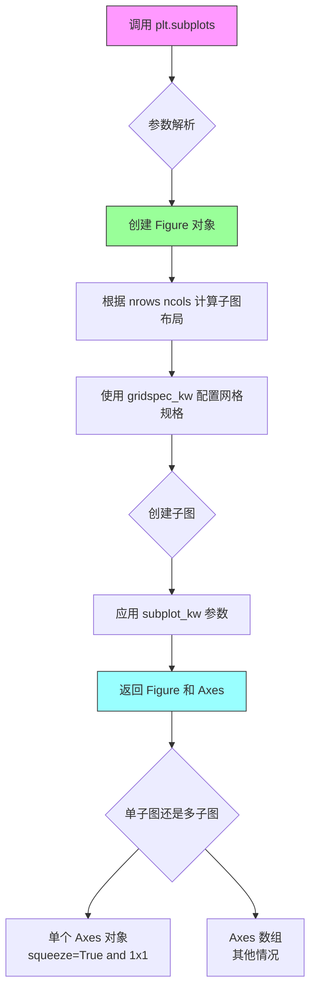
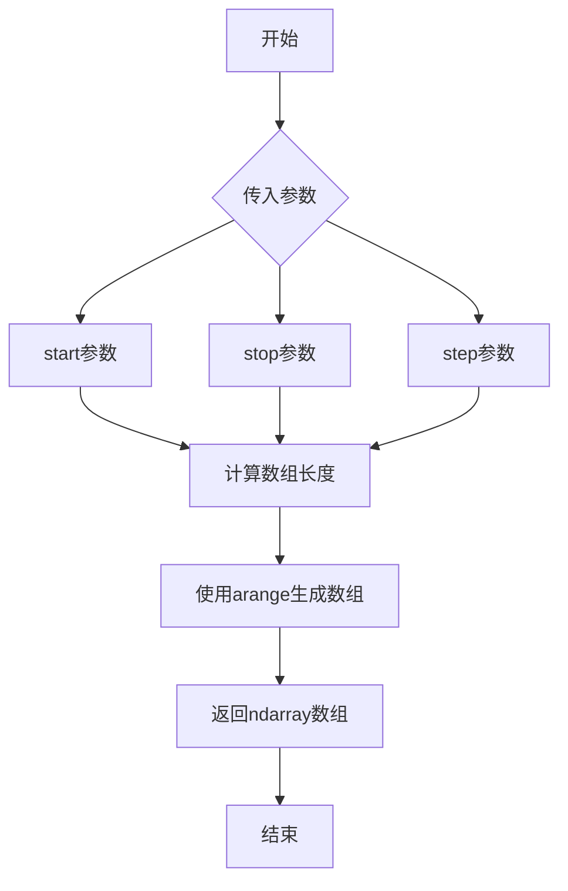
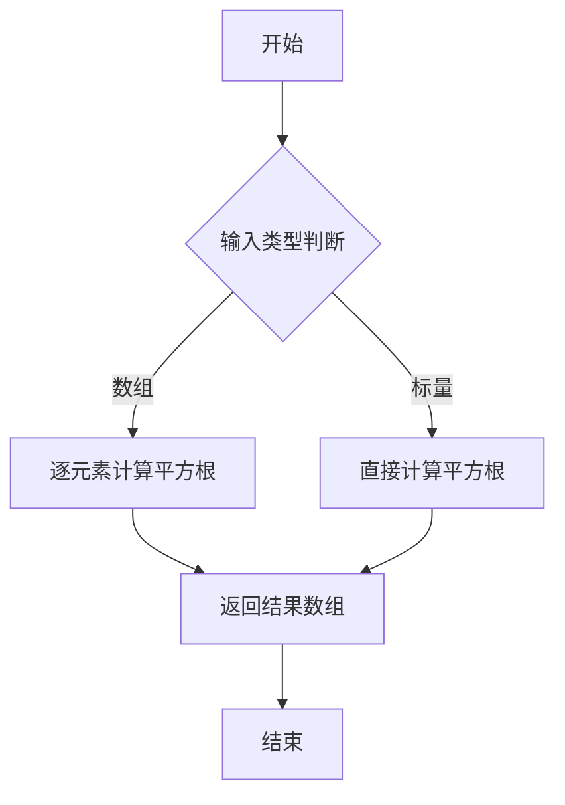
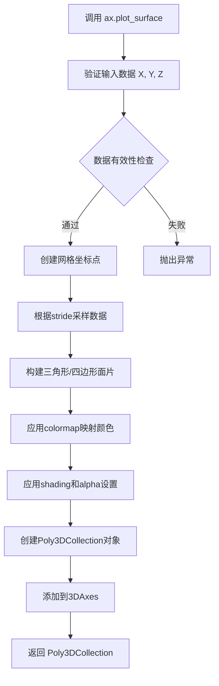
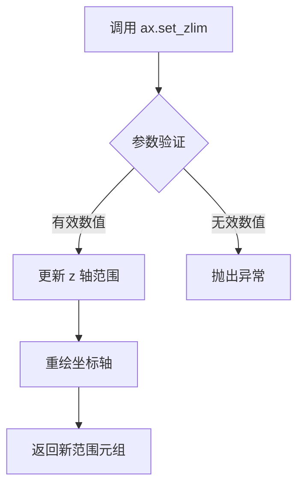
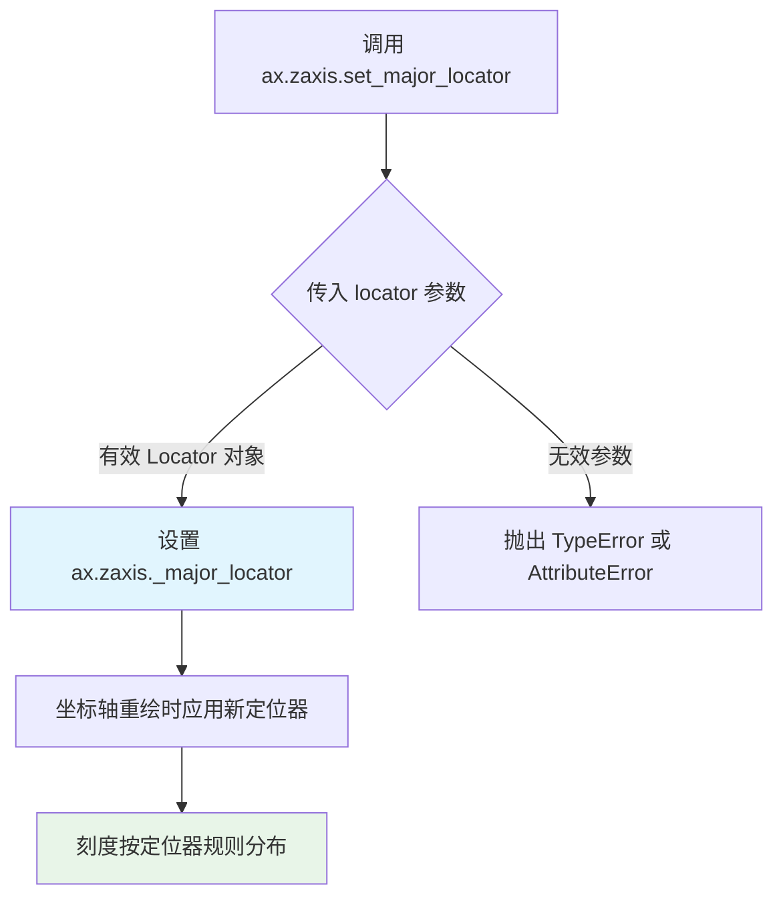
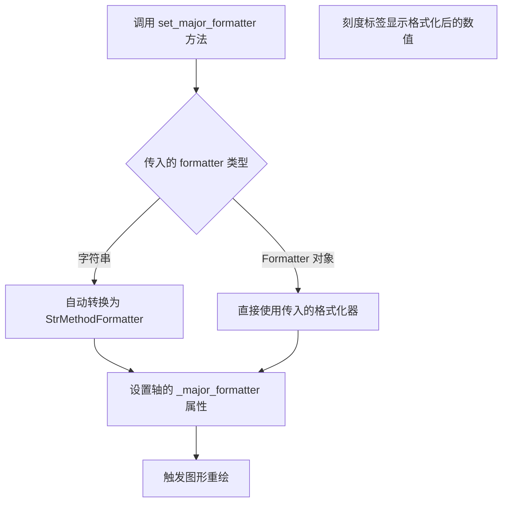
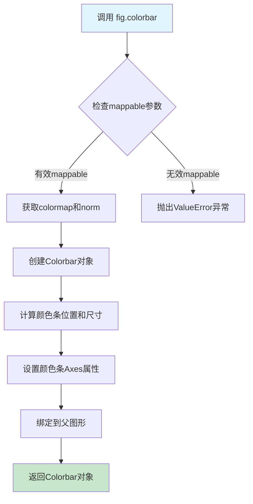
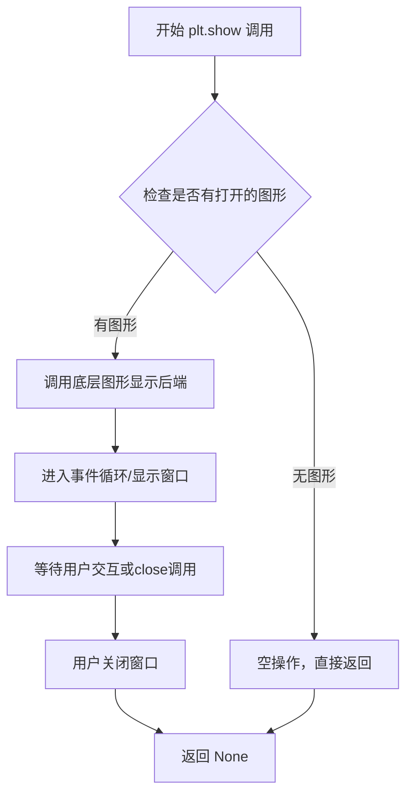

# `matplotlib\galleries\examples\mplot3d\surface3d.py` 详细设计文档

该脚本使用Matplotlib绘制了一个基于X-Y坐标计算的3D表面图，通过coolwarm色彩映射展示Z值的分布，并添加了自定义的z轴刻度定位器和颜色条。

## 整体流程

```mermaid
graph TD
    A[开始] --> B[导入依赖库]
    B --> C[创建Figure和3D Axes]
    C --> D[生成网格数据X, Y]
    D --> E[计算R = sqrt(X² + Y²)]
    E --> F[计算Z = sin(R)]
    F --> G[绘制3D表面图]
    G --> H[设置z轴范围和刻度]
    H --> I[添加颜色条]
    I --> J[显示图像]
```

## 类结构

```
无显式类定义 (脚本模式)
└── 隐含对象层次:
    ├── Figure (matplotlib.figure.Figure)
    └── Axes3D (matplotlib.axes.Axes3D)
```

## 全局变量及字段


### `fig`
    
Figure对象，画布容器，用于承载和显示所有绘图元素

类型：`matplotlib.figure.Figure`
    


### `ax`
    
Axes3D对象，3D坐标轴，提供三维空间的绘图功能

类型：`matplotlib.axes.Axes3D`
    


### `X`
    
ndarray，X轴网格数据，由arange和meshgrid生成

类型：`numpy.ndarray`
    


### `Y`
    
ndarray，Y轴网格数据，由arange和meshgrid生成

类型：`numpy.ndarray`
    


### `R`
    
ndarray，径向距离计算结果，基于X和Y的平方和开根号

类型：`numpy.ndarray`
    


### `Z`
    
ndarray，Z轴高度值，由R的正弦值计算得到

类型：`numpy.ndarray`
    


### `surf`
    
Surface对象，3D表面图对象，由plot_surface返回

类型：`matplotlib.collections.Poly3DCollection`
    


    

## 全局函数及方法


### `plt.subplots`

`plt.subplots()` 是 Matplotlib 库中的一个函数，用于创建一个新的图形窗口（Figure）和一个或多个子图（Axes）。它将 figure 和 axes 的创建合并为一步，返回 Figure 对象和 Axes 对象（或数组），便于后续的绘图操作。

参数：

- `nrows`：`int`，默认值 1， subplot 的行数
- `ncols`：`int`，默认值 1， subplot 的列数
- `sharex`：`bool` 或 `{'none', 'all', 'row', 'col'}`，默认值 False，是否共享 x 轴
- `sharey`：`bool` 或 `{'none', 'all', 'row', 'col'}`，默认值 False，是否共享 y 轴
- `squeeze`：`bool`，默认值 True，是否压缩返回的 Axes 数组维度
- `width_rates`：`array-like`，可选，指定子图宽度比例
- `height_rates`：`array-like`，可选，指定子图高度比例
- `subplot_kw`：`dict`，可选，传递给 `add_subplot` 或 `add_axes` 的关键字参数，用于配置子图属性（如投影类型）
- `gridspec_kw`：`dict`，可选，传递给 GridSpec 构造函数的关键字参数
- `**fig_kw`：所有额外的关键字参数传递给 `figure()` 函数，用于配置 Figure 属性

返回值：`tuple(Figure, Axes or ndarray of Axes)`，返回一个元组，包含 Figure 对象和 Axes 对象（或 Axes 对象数组）。如果 `nrows` 和 `ncols` 都为 1，返回单个 Axes 对象；否则返回 Axes 数组。

#### 流程图



#### 带注释源码

```python
# matplotlib.pyplot.subplots 函数简化实现逻辑

def subplots(nrows=1, ncols=1, 
             sharex=False, sharey=False, 
             squeeze=True, 
             width_rates=None, height_rates=None,
             subplot_kw=None, gridspec_kw=None, 
             **fig_kw):
    """
    创建一个包含子图的图形窗口
    
    参数:
        nrows: 行数
        ncols: 列数
        sharex: 是否共享x轴
        sharey: 是否共享y轴
        squeeze: 是否压缩维度
        subplot_kw: 子图关键字参数(如projection='3d')
        gridspec_kw: 网格规格参数
        **fig_kw: 传递给figure的关键字参数
    
    返回:
        fig: Figure对象
        ax: Axes对象或数组
    """
    
    # 步骤1: 创建 Figure 对象
    # 所有 fig_kw 参数传递给 figure() 函数
    fig = figure(**fig_kw)
    
    # 步骤2: 配置网格规格 (GridSpec)
    if gridspec_kw is None:
        gridspec_kw = {}
    
    # 步骤3: 创建子图布局
    # 根据 nrows, ncols, width_rates, height_rates 创建 Axes
    gs = GridSpec(nrows, ncols, **gridspec_kw)
    
    # 步骤4: 创建子图并应用 subplot_kw
    # subplot_kw 包含投影类型等参数
    ax = fig.add_subplot(gs[i, j], **subplot_kw)
    
    # 步骤5: 处理共享轴
    if sharex:
        # 配置x轴共享
        pass
    if sharey:
        # 配置y轴共享
        pass
    
    # 步骤6: 根据 squeeze 参数处理返回值
    if squeeze:
        # 压缩数组维度
        ax = np.squeeze(ax)
    
    return fig, ax


# 在示例代码中的实际调用:
# fig, ax = plt.subplots(subplot_kw={"projection": "3d"})
#
# 等价于:
# fig = plt.figure()
# ax = fig.add_subplot(111, projection="3d")
#
# 其中 subplot_kw={"projection": "3d"} 指定了3D投影
```


### `np.arange`

`np.arange()` 是 NumPy 库中的一个函数，用于生成一个等差数列的一维数组。它接受起始值、结束值和步长作为参数，返回一个包含等差数列的 NumPy 数组。

参数：

- `start`：`float` 或 `int`，起始值（可选，默认为 0）
- `stop`：`float` 或 `int`，结束值（不包含）
- `step`：`float` 或 `int`，步长（可选，默认为 1）

返回值：`numpy.ndarray`，包含等差数列的数组

#### 流程图



#### 带注释源码

```python
# 使用 np.arange() 生成等差数组
# 参数说明：
# -5: 起始值（start），数组从 -5 开始
# 5: 结束值（stop），数组到 5 结束（不包含 5）
# 0.25: 步长（step），相邻元素之间的差值为 0.25
X = np.arange(-5, 5, 0.25)

# 上述代码生成的数组类似于:
# array([-5.  , -4.75, -4.5 , -4.25, -4.  , -3.75, -3.5 , -3.25, -3.  ,
#       -2.75, -2.5 , -2.25, -2.  , -1.75, -1.5 , -1.25, -1.  , -0.75,
#       -0.5 , -0.25,  0.  ,  0.25,  0.5 ,  0.75,  1.  ,  1.25,  1.5 ,
#        1.75,  2.   ,  2.25,  2.5 ,  2.75,  3.   ,  3.25,  3.5 ,  3.75,
#        4.   ,  4.25,  4.5 ,  4.75])
```


### `np.meshgrid`

该函数用于根据一维坐标数组生成二维或三维的网格坐标矩阵，常用于创建笛卡尔坐标网格以便对二维函数进行求值或可视化。

参数：

- `x`：`array_like`，一维数组，表示网格第一个维度的坐标
- `y`：`array_like`，一维数组，表示网格第二个维度的坐标
- `indexing`：`str`，可选，默认为 `'xy'`，指定索引方式（`'xy'` 为笛卡尔索引，`'ij'` 为矩阵索引）

返回值：`tuple of ndarray`，返回两个二维数组（X, Y），其中 X 包含沿第一个维度的坐标重复，Y 包含沿第二个维度的坐标重复

#### 流程图

```mermaid
flowchart TD
    A[开始] --> B[输入一维坐标数组 x 和 y]
    B --> C{indexing 参数}
    C -->|xy| D[笛卡尔索引方式]
    C -->|ij| E[矩阵索引方式]
    D --> F[生成 X 矩阵: x 沿列方向重复]
    D --> G[生成 Y 矩阵: y 沿行方向重复]
    E --> H[生成 X 矩阵: x 沿行方向重复]
    E --> I[生成 Y 矩阵: y 沿列方向重复]
    F --> J[返回 (X, Y) 元组]
    G --> J
    H --> J
    I --> J
    J --> K[结束]
```

#### 带注释源码

```python
# 示例代码片段（来源：matplotlib官方示例）
import numpy as np

# 定义一维坐标范围
X = np.arange(-5, 5, 0.25)  # 一维数组：x轴坐标点，从-5到5，步长0.25
Y = np.arange(-5, 5, 0.25)  # 一维数组：y轴坐标点，从-5到5，步长0.25

# 调用 meshgrid 生成二维网格坐标
# X: 2D array, shape (len(Y), len(X))
# Y: 2D array, shape (len(Y), len(X))
X, Y = np.meshgrid(X, Y)

# 验证输出形状
# X 的每一行相同，Y 的每一列相同
# 例如：X[0, :] = [-5, -4.75, -4.5, ...]
#      Y[:, 0] = [-5, -5, -5, ...]

R = np.sqrt(X**2 + Y**2)  # 计算每个点到原点的距离
Z = np.sin(R)  # 使用网格计算z值，形成3D表面
```


### `np.sqrt`

计算输入数组或数值的平方根，返回一个新的数组，其中每个元素是输入数组对应元素的平方根。

参数：

-  `x`：`ndarray` 或 `scalar`，输入数组或数值，用于计算平方根

返回值：`ndarray`，返回与输入数组形状相同的数组，其中每个元素是输入对应元素的平方根

#### 流程图



#### 带注释源码

```python
# 使用 np.sqrt 计算 R 的平方根
# R 是 X**2 + Y**2 的结果，是一个二维数组
# np.sqrt 会对 R 中的每个元素计算平方根
R = np.sqrt(X**2 + Y**2)

# 详细说明：
# X 和 Y 是通过 meshgrid 生成的二维网格坐标数组
# X**2 + Y**2 计算每个点到原点的距离的平方
# np.sqrt() 计算距离的平方根，得到实际距离
# 结果 R 是一个与 X、Y 形状相同的二维数组
```


### `np.sin`

这是 NumPy 库中的正弦函数，用于计算输入数组（或标量）中每个元素的正弦值。在本代码中，它接收一个二维网格数组 R（即 sqrt(X² + Y²)），并返回对应位置的 sin(R) 值，生成3D表面的高度数据。

参数：

-  `x`：`ndarray` 或 `scalar`，输入角度值（弧度），在本例中为通过 meshgrid 和 sqrt 生成的二维平面距离数组 R

返回值：`ndarray`，返回与输入数组形状相同的正弦值数组，在本例中为用于绘制3D表面的Z坐标值

#### 流程图

```mermaid
graph LR
    A[X, Y 网格数据] --> B[np.meshgrid 转换]
    B --> C[计算 R = sqrt(X² + Y²)]
    C --> D[np.sin 计算]
    D --> E[Z = sinR 结果数组]
    
    subgraph np.sin 内部处理
        D --> D1[逐元素取正弦值]
        D1 --> D2[弧度转正弦值]
    end
```

#### 带注释源码

```python
# 导入必要的库
import matplotlib.pyplot as plt
import numpy as np
from matplotlib.ticker import LinearLocator

# 创建图形和3D坐标轴
fig, ax = plt.subplots(subplot_kw={"projection": "3d"})

# 生成X和Y坐标数据（范围-5到5，步长0.25）
X = np.arange(-5, 5, 0.25)
Y = np.arange(-5, 5, 0.25)

# 将一维X,Y数组转换为二维网格矩阵
# X, Y 现在都是二维数组，形状为 (40, 40)
X, Y = np.meshgrid(X, Y)

# 计算每个点到原点的距离R（平面距离）
R = np.sqrt(X**2 + Y**2)

# =============================================
# np.sin() 正弦计算函数调用
# =============================================
# 输入: R - 二维 ndarray，包含每个网格点到原点的距离（弧度）
# 输出: Z - 二维 ndarray，包含每个点的正弦值
# 功能: 对R中的每个元素计算正弦值，生成波浪形表面
Z = np.sin(R)  # Z = sin(R)，生成起伏的表面高度数据

# 绘制3D表面，使用coolwarm配色方案
surf = ax.plot_surface(X, Y, Z, cmap="coolwarm",
                       linewidth=0, antialiased=False)

# 设置Z轴范围和刻度
ax.set_zlim(-1.01, 1.01)
ax.zaxis.set_major_locator(LinearLocator(10))
ax.zaxis.set_major_formatter('{x:.02f}')

# 添加颜色条
fig.colorbar(surf, shrink=0.5, aspect=5)

# 显示图形
plt.show()
```

### 关键组件信息

| 组件名称 | 一句话描述 |
|---------|-----------|
| `np.sin` | NumPy库中的向量化正弦函数，支持数组输入的逐元素计算 |
| `np.meshgrid` | 将一维坐标数组转换为二维坐标网格的函数 |
| `np.sqrt` | 计算数组元素平方根的函数 |
| `ax.plot_surface` | matplotlib的3D表面绘制函数 |

### 潜在的技术债务或优化空间

1. **性能优化**：对于大规模网格数据，可以考虑使用 `numexpr` 库来加速 `np.sqrt(X**2 + Y**2)` 的计算，避免创建中间数组
2. **精度处理**：在计算 `R = np.sqrt(X**2 + Y**2)` 时，当 X 或 Y 值很大时可能存在数值精度问题，可考虑使用 `nphypot` 替代
3. **代码复用性**：当前的网格参数（-5到5，步长0.25）硬编码在代码中，建议提取为可配置参数

### 其它项目

**设计目标与约束**：
- 目标：展示如何使用3D表面图可视化数学函数 sin(sqrt(x² + y²))
- 约束：使用 matplotlib 3D绘图功能，配合 coolwarm 色图

**错误处理与异常设计**：
- 输入类型检查：np.sin 要求输入为数值类型（int, float, complex）
- 数值范围：无特殊限制，但复数输入会返回复数结果

**数据流与状态机**：
- 数据流向：X/Y数组 → meshgrid → R计算 → sin(R)计算 → 3D绘图
- 状态变化：静态数据准备 → 图形渲染 → 交互显示

**外部依赖与接口契约**：
- 依赖库：matplotlib, numpy
- 接口：np.sin 接受任意形状的数值数组，返回同形状的正弦值数组


### `ax.plot_surface`

该方法用于在3D坐标系中绘制彩色表面图。它接受X、Y坐标网格和Z高度数据，通过指定的colormap映射颜色，并返回一个`Poly3DCollection`对象，可用于进一步定制（如添加颜色条）。

参数：

- `X`：`numpy.ndarray`（2维数组），表示曲面的X坐标，通常通过`numpy.meshgrid`生成
- `Y`：`numpy.ndarray`（2维数组），表示曲面的Y坐标，通常通过`numpy.meshgrid`生成
- `Z`：`numpy.ndarray`（2维数组），表示曲面上每点的高度值（Z坐标）
- `cmap`：`str`或`matplotlib.colors.Colormap`，可选参数，用于映射Z值到颜色的colormap名称（如"coolwarm"、"viridis"等）
- `linewidth`：`float`，可选，默认值为0，线条宽度，设为0表示无线条
- `antialiased`：`bool`，可选，默认值为False，是否启用抗锯齿，设为False可提高性能
- `stride`：`int`，可选，默认值为1，网格采样步长，用于减少数据点数量提高性能
- `cstride`：`int`，可选，默认值为1，列方向采样步长
- `shade`：`bool`，可选，默认值为True，是否对表面进行着色
- `alpha`：`float`，可选，透明度，范围0-1
- `edgecolors`：`str`或`array-like`，可选，边缘颜色
- `norm`：`matplotlib.colors.Normalize`，可选，自定义归一化对象
- `vmin, vmax`：`float`，可选，颜色映射的最小值和最大值
- `shading`：`str`，可选，着色方案（'flat', 'gouraud', 'nearest'）

返回值：`matplotlib.collections.Poly3DCollection`，返回包含所有多边形面的集合对象，可用于颜色条绑定

#### 流程图



#### 带注释源码

```python
# 示例代码：绘制3D表面图
import matplotlib.pyplot as plt
import numpy as np
from matplotlib.ticker import LinearLocator

# 1. 创建图形和3D坐标轴
fig, ax = plt.subplots(subplot_kw={"projection": "3d"})

# 2. 生成网格数据
X = np.arange(-5, 5, 0.25)  # X坐标范围
Y = np.arange(-5, 5, 0.25)  # Y坐标范围
X, Y = np.meshgrid(X, Y)    # 生成2D网格
R = np.sqrt(X**2 + Y**2)    # 计算距离
Z = np.sin(R)               # 计算Z值（高度）

# 3. 调用plot_surface绘制表面
surf = ax.plot_surface(
    X, Y, Z,          # 坐标数据
    cmap="coolwarm",  # 使用coolwarm颜色映射
    linewidth=0,      # 无边缘线
    antialiased=False # 关闭抗锯齿提高性能
)

# 4. 自定义Z轴范围和刻度
ax.set_zlim(-1.01, 1.01)              # 设置Z轴范围
ax.zaxis.set_major_locator(LinearLocator(10))  # 设置刻度数量
ax.zaxis.set_major_formatter('{x:.02f}')      # 设置刻度格式

# 5. 添加颜色条（绑定到surface对象）
fig.colorbar(surf, shrink=0.5, aspect=5)

# 6. 显示图形
plt.show()
```


### `Axes3D.set_zlim`

设置 3D 坐标轴的 z 轴显示范围，用于控制 z 轴的最小值和最大值，从而实现对 3D 图表纵向显示区间的控制。

参数：

- `bottom`：`float` 或 `None`，z 轴下限值（代码中传入 `-1.01`）
- `top`：`float` 或 `None`，z 轴上限值（代码中传入 `1.01`）

返回值：`tuple`，返回新的 z 轴范围 `(zmin, zmax)`

#### 流程图



#### 带注释源码

```python
# 导入必要的库
import matplotlib.pyplot as plt
import numpy as np
from matplotlib.ticker import LinearLocator

# 创建画布和3D坐标轴
fig, ax = plt.subplots(subplot_kw={"projection": "3d"})

# 生成测试数据 - 创建X, Y网格
X = np.arange(-5, 5, 0.25)
Y = np.arange(-5, 5, 0.25)
X, Y = np.meshgrid(X, Y)

# 计算径向距离R和高度Z
R = np.sqrt(X**2 + Y**2)
Z = np.sin(R)

# 绘制3D表面图，使用coolwarm配色
surf = ax.plot_surface(X, Y, Z, cmap="coolwarm",
                       linewidth=0, antialiased=False)

# ==================== 核心调用 ====================
# 设置z轴的显示范围为 -1.01 到 1.01
# 参数1 (bottom): z轴下限 -1.01
# 参数2 (top):    z轴上限  1.01
# =================================================
ax.set_zlim(-1.01, 1.01)

# 设置z轴刻度定位器为线性定位器，共10个刻度
ax.zaxis.set_major_locator(LinearLocator(10))

# 设置z轴刻度格式化器，保留2位小数
ax.zaxis.set_major_formatter('{x:.02f}')

# 添加颜色条，显示colormap映射关系
fig.colorbar(surf, shrink=0.5, aspect=5)

# 显示图形
plt.show()
```

#### 补充说明

| 属性 | 说明 |
|------|------|
| **所属类** | `matplotlib.axes._axes.Axes3D`（继承自 `Axes`） |
| **调用对象** | `ax` - 3D 坐标轴对象 |
| **功能** | 限制 z 轴的显示范围，常用于确保 z 轴从特定值开始显示，或将数据裁剪到特定区间 |
| **注意事项 | 设置范围时应考虑数据的实际取值，本例中 `sin(R)` 的值域为 `[-1, 1]`，所以设置 `-1.01` 到 `1.01` 略留余量 |


### `matplotlib.axis.Axis.set_major_locator`

该方法用于设置坐标轴的主要刻度定位器（Locator），控制坐标轴上主要刻度线的位置和数量。在3D图表中，`ax.zaxis.set_major_locator()` 专门用于设置Z轴的主要刻度定位器，通过传入不同的Locator对象（如LinearLocator、MaxNLocator等）来定义Z轴刻度的分布规则。

参数：

-  `locator`：`matplotlib.ticker.Locator`，用于指定主要刻度的定位器对象，决定刻度线的位置和数量

返回值：`None`，该方法直接修改轴的属性，不返回任何值

#### 流程图



#### 带注释源码

```python
# 在 matplotlib 库中的实现（位于 lib/matplotlib/axis.py）

def set_major_locator(self, locator):
    """
    Set the major locator of the axis.
    
    Parameters
    ----------
    locator : Locator
        The major locator to use.
    """
    # 检查 locator 是否为有效的 Locator 子类实例
    if not isinstance(locator, ticker.Locator):
        raise TypeError(
            "locator must be a subclass of matplotlib.ticker.Locator")
    
    # 调用 _set_major_locator 方法进行实际设置
    self._set_major_locator(locator)
    
    # 触发 autoscale，确保新定位器不影响轴的范围计算
    self._autoscale_on = self._autoscale_on

# 具体到 Z 轴（matplotlib axis.py 中 Axis 类的子类）
# ax.zaxis 是 matplotlib.axis.ZAxis 的实例
# ZAxis 继承自 Axis 类，因此继承 set_major_locator 方法

# 在示例代码中的使用：
ax.zaxis.set_major_locator(LinearLocator(10))

# 解释：
# 1. ax.zaxis 获取 3D 图表的 Z 轴对象
# 2. set_major_locator() 方法设置 Z 轴的主要刻度定位器
# 3. LinearLocator(10) 创建一个线性定位器，在 Z 轴范围内均匀分布 10 个主要刻度
# 4. 设置后，Z 轴刻度将按照 LinearLocator 的规则分布显示
```

#### 关联代码片段分析

```python
# ==================== 示例代码上下文 ====================

# 导入必要的模块
from matplotlib.ticker import LinearLocator  # 导入线性定位器类

# ... (数据准备代码省略) ...

# 设置 Z 轴的刻度定位器
ax.zaxis.set_major_locator(LinearLocator(10))

# ==================== 代码功能说明 ====================
# ax.zaxis: 获取 3D 坐标轴对象的 Z 轴（ZAxis 实例）
# set_major_locator(): 设置主要刻度定位器的方法
# LinearLocator(10): 创建具有10个均匀分布主刻度的定位器

# ==================== 后续相关设置 ====================
ax.zaxis.set_major_formatter('{x:.02f}')
# 设置刻度标签格式为保留两位小数的浮点数
```


### `ax.zaxis.set_major_formatter()`

该方法用于设置 3D 坐标轴的主要刻度标签格式化器，将数值按照指定的格式字符串转换为可读的文字标签。在本例中，将 Z 轴的刻度值格式化为保留两位小数的小数形式（如 `0.50`、`-0.75` 等）。

参数：

- `formatter`：`str` 或 `matplotlib.ticker.Formatter`，格式化器对象或格式字符串。字符串格式会被自动转换为 `StrMethodFormatter`，`{x}` 表示刻度值，`:.02f` 表示保留两位小数。

返回值：`None`，该方法直接修改轴对象的内部状态，不返回任何值。

#### 流程图



#### 带注释源码

```python
# 从 matplotlib.ticker 导入 LinearLocator，用于设置刻度位置
from matplotlib.ticker import LinearLocator

# 创建 3D 图表和轴对象
fig, ax = plt.subplots(subplot_kw={"projection": "3d"})

# ... (数据准备和表面绘制代码) ...

# 设置 Z 轴的显示范围
ax.set_zlim(-1.01, 1.01)

# 设置 Z 轴主刻度的位置 locator，使用 LinearLocator 将范围分为 10 个区间
ax.zaxis.set_major_locator(LinearLocator(10))

# 设置 Z 轴主刻度的格式化器
# 参数是一个格式字符串 '{x:.02f}'，其中：
#   {x} - 代表刻度值
#   :.02f - 格式说明符，表示浮点数格式，保留两位小数
ax.zaxis.set_major_formatter('{x:.02f}')

# 在代码中，matplotlib 内部会将字符串 '{x:.02f}' 转换为 StrMethodFormatter 对象
# StrMethodFormatter 是 Formatter 的子类，专门用于处理基于字符串模板的格式
# 转换过程大致如下（简化示意）：
# formatter = matplotlib.ticker.StrMethodFormatter('{x:.02f}')
# ax.zaxis._major_formatter = formatter

# 添加颜色条
fig.colorbar(surf, shrink=0.5, aspect=5)

# 显示图形
plt.show()
```


### `matplotlib.figure.Figure.colorbar`

为图形添加颜色条（colorbar），用于显示颜色映射与数据值的对应关系。在给定的3D表面图中，该函数将surf表面的颜色映射可视化，使读者能够理解颜色所代表的数据值。

参数：

- `mappable`：`matplotlib.cm.ScalarMappable`，需要显示颜色映射的可绘制对象，通常为plot函数返回的曲面对象（如本例中的surf）
- `shrink`：`float`，可选，颜色条在垂直方向的缩放比例，值为0到1之间。本例中设为0.5，表示颜色条长度为原来的50%
- `aspect`：`float`，可选，颜色条的宽高比（宽度/高度），控制颜色条的纤细程度。本例中设为5，表示宽度是高度的1/5
- `ax`：`matplotlib.axes.Axes`，可选，指定颜色条所属的坐标轴，默认为None时会自动推断
- `cax`：`matplotlib.axes.Axes`，可选，用于放置颜色条的Axes对象
- `use_gridspec`：`bool`，可选，是否使用GridSpec进行颜色条定位，默认为True

返回值：`matplotlib.colorbar.Colorbar`，颜色条对象，包含颜色条的所有属性和配置方法，可用于进一步自定义颜色条的外观

#### 流程图



#### 带注释源码

```python
# 调用fig.colorbar()添加颜色条
# fig: matplotlib.figure.Figure - 图形对象
# surf: 来自ax.plot_surface()返回的曲面对象，包含颜色映射信息

# 参数说明：
# surf (mappable): ScalarMappable对象，包含colormap和norm信息
#                 在本例中由plot_surface自动创建，包含coolwarm颜色映射
# shrink=0.5: 颜色条高度收缩为原长度的50%
# aspect=5: 颜色条宽度是高度的1/5 (aspect = width/height)

fig.colorbar(surf, shrink=0.5, aspect=5)

# 执行流程：
# 1. 获取surf对象中存储的colormap (coolwarm) 和 norm (数据范围归一化)
# 2. 根据colormap创建颜色渐变
# 3. 在图形右侧创建新的axes用于放置颜色条
# 4. 设置axes的尺寸: 宽度=原宽度*aspect/100, 高度=原高度*shrink
# 5. 在新axes上绘制颜色渐变
# 6. 添加刻度标签显示数据值
# 7. 返回Colorbar对象供进一步操作

# 完整调用等价于:
# cbar = fig.colorbar(surf, ax=ax, shrink=0.5, aspect=5)
# 其中ax参数指定父坐标轴，colorbar会自动调整位置避免遮挡主图
```


### plt.show

`plt.show()` 是 matplotlib.pyplot 模块中的核心函数，用于显示当前所有打开的图形窗口并进入事件循环。该函数会阻塞程序执行（取决于后端设置），直到用户关闭所有图形窗口或调用 `plt.close()`。

参数：

- `*args`：`tuple`，可变位置参数，用于传递底层图形显示后端所需的额外参数（通常不需要手动传递）
- `**kwargs`：关键字参数，传递给底层 `show()` 实现的配置选项。常用参数包括：
  - `block`：`bool`，是否阻塞程序执行以等待用户交互（在某些后端默认为 True）

返回值：`None`，无返回值。该函数的作用是显示图形，不返回任何数据。

#### 流程图



#### 带注释源码

```python
# plt.show() 源码结构示意（位于 matplotlib.pyplot 模块中）

def show(*args, **kwargs):
    """
    显示所有打开的图形窗口。
    
    参数:
        *args: 传递给底层显示后端的可选参数
        **kwargs: 关键字参数，
                  常用选项:
                  - block: bool 控制是否阻塞等待窗口关闭
    """
    
    # 1. 获取当前所有打开的图形（通过 Gcf 函数）
    #    Gcf = GetCurrentFigure，管理所有活动图形的注册表
    allnums = get_fignums()
    
    # 2. 检查是否存在需要显示的图形
    if not allnums:
        # 如果没有打开的图形，直接返回（空操作）
        return
    
    # 3. 遍历所有图形并调用后端的 show 方法
    for manager in Gcf.get_all_fig_managers():
        # 4. 传递 block 参数给底层实现
        #    block=True 表示阻塞等待用户关闭窗口
        #    在某些交互式后端（如 Qt、Tkinter）中默认阻塞
        #    在非交互式后端（如 agg）中可能立即返回
        manager.show(block=kwargs.get('block', True))
    
    # 5. 刷新缓冲区，确保图形渲染完成
    #    强制重绘所有待渲染的画家对象
    draw_all()
    
    # 6. 进入事件循环（如果后端支持）
    #    这是一个阻塞调用，等待用户交互
    #    用户关闭所有窗口后，函数返回 None
```

---

**补充说明**：
- `plt.show()` 会调用当前图形后端（如 Qt5Agg、TkAgg、agg 等）的 `show()` 方法
- 在 Jupyter Notebook 中，通常使用 `%matplotlib inline` 或 `%matplotlib widget` 来配置显示行为
- 如果需要在不阻塞的情况下显示图形，可以考虑使用 `fig.canvas.draw()` 配合 `fig.canvas.flush_events()` 的组合

## 关键组件


### 3D Surface 绘图

使用 matplotlib 的 `plot_surface` 方法绘制三维曲面，并通过 `cmap="coolwarm"` 参数应用 coolwarm 颜色映射来实现彩色可视化效果。

### 坐标网格生成

使用 `np.meshgrid` 函数将一维的 X 和 Y 数组转换为二维网格坐标，用于计算三维曲面的 Z 值。

### Z 轴刻度定位器

使用 `matplotlib.ticker.LinearLocator` 设置 Z 轴的主刻度数量为 10，实现均匀分布的刻度线。

### Z 轴格式化器

使用 z-axis 的 `set_major_formatter` 方法设置刻度标签格式为保留两位小数的浮点数格式 (`'{x:.02f}'`)。

### 颜色条组件

使用 `fig.colorbar` 创建颜色条，将数值映射到颜色，通过 `shrink` 和 `aspect` 参数控制颜色条的大小和宽高比。

### 不透明渲染

通过设置 `antialiased=False` 和 `linewidth=0` 关闭抗锯齿和线条绘制，使表面呈现不透明效果。

### 曲面数据计算

基于网格坐标计算距离 R（sqrt(X**2 + Y**2)），然后使用 sin 函数生成 Z 值，形成典型的波纹状三维曲面。


## 问题及建议


### 已知问题

-   **硬编码的魔法数字**：代码中存在多个硬编码的数值（如网格步长0.25、范围-5到5、locator数量10、colorbar的shrink=0.5和aspect=5、z轴限制-1.01到1.01），这些值缺乏解释且难以维护
-   **缺乏输入验证**：没有对输入数据范围、类型或有效性的检查，X、Y、Z的计算结果未进行验证
-   **缺少错误处理**：没有try-except块来处理可能的异常（如内存不足、渲染失败等）
-   **代码复用性差**：所有代码都写在全局作用域，没有封装成函数或类，无法在其他项目中复用
-   **缺少类型提示**：Python代码中完全没有类型注解，降低了代码的可读性和IDE支持
-   **antialiased=False的权衡**：虽然注释说明是为了不透明效果，但关闭抗锯齿会影响渲染质量，在现代硬件上通常不需要这样做

### 优化建议

-   **提取配置参数**：将所有魔法数字提取为模块级常量或配置字典，提供默认值和解释
-   **封装为函数**：将核心绘图逻辑封装为函数，接受参数（如范围、步长、颜色映射等），提高复用性
-   **添加类型提示**：为函数参数和返回值添加类型注解，使用typing模块
-   **添加错误处理**：用try-except包装可能的异常，特别是绘图和计算部分
-   **性能优化考虑**：如果数据量很大，考虑使用downsample或marching cubes等算法优化
-   **改进可视化**：可以考虑添加网格线、调整视角、添加标题等增强可视化效果
-   **文档增强**：为函数添加详细的docstring，说明参数、返回值和示例


## 其它


### 设计目标与约束

本示例代码旨在演示如何使用matplotlib绘制带有colormap的3D表面图。设计目标包括：1）使用coolwarm颜色映射可视化Z值与X、Y的关系；2）通过antialiased=False实现不透明表面渲染；3）使用LinearLocator和自定义格式化器定制Z轴刻度；4）添加颜色条映射数值到颜色。约束条件包括：依赖matplotlib、numpy库；需要在支持3D绘图的matplotlib后端运行。

### 错误处理与异常设计

代码未显式包含错误处理机制。潜在异常包括：1）numpy.meshgrid输入维度不匹配；2）cmap参数不支持的颜色映射名称；3）Z值超出显示范围导致截断；4）内存不足无法处理大规模网格数据。建议在实际应用中增加数据验证、异常捕获和用户友好的错误提示。

### 外部依赖与接口契约

本代码依赖以下外部库：1）matplotlib.pyplot - 绘图框架；2）numpy - 数值计算；3）matplotlib.ticker.LinearLocator - 刻度定位器。接口契约包括：plot_surface()接受X、Y、Z数组参数及cmap、linewidth、antialiased关键字参数；colorbar()接受surface对象及shrink、aspect参数。

### 性能考虑与优化空间

当前实现使用0.25步长的网格，可能产生较大内存占用。优化方向：1）根据实际需求调整采样密度；2）使用内存效率更高的数据类型；3）对于实时渲染可考虑降采样；4）可启用blending优化渲染性能。

### 可扩展性设计

代码具备以下扩展能力：1）可通过修改cmap参数更换其他颜色映射；2）可调整X、Y范围和步长适应不同数据；3）可添加多子图展示不同视角；4）可集成动画功能实现动态3D可视化；5）可扩展为函数接受外部数据输入。

### 兼容性考虑

本代码兼容matplotlib 3.x版本和numpy 1.x版本。Python版本要求3.6以上。部分3D后端（如Agg）不支持交互式显示，建议在支持3D渲染的环境（如Qt5Agg、TkAgg）中运行。

### 参考文献与延伸阅读

代码注释中列出了相关API文档链接，包括matplotlib.pyplot.subplots、Axis.set_major_formatter、Axis.set_major_locator、LinearLocator、StrMethodFormatter等。可参考matplotlib官方3D教程深入学习表面图、线框图等多种3D可视化技术。

    