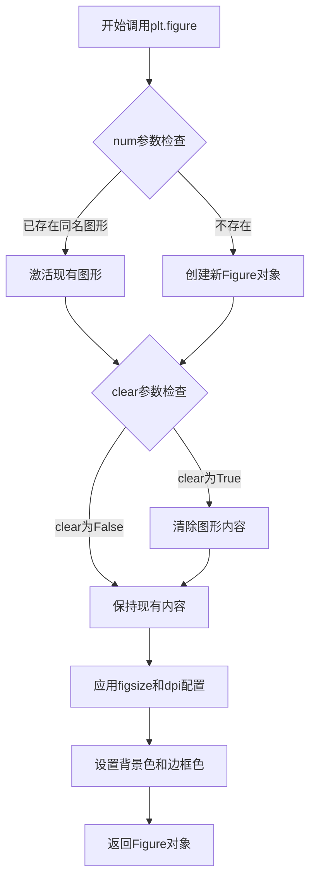
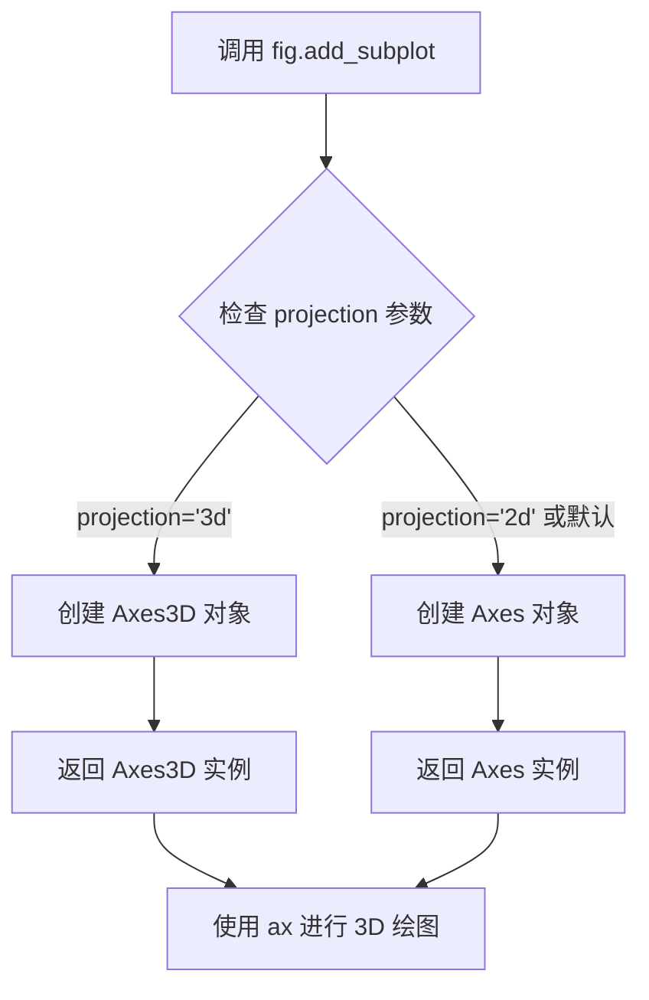
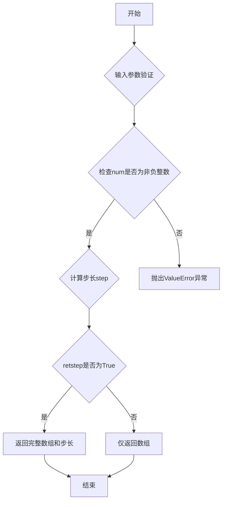
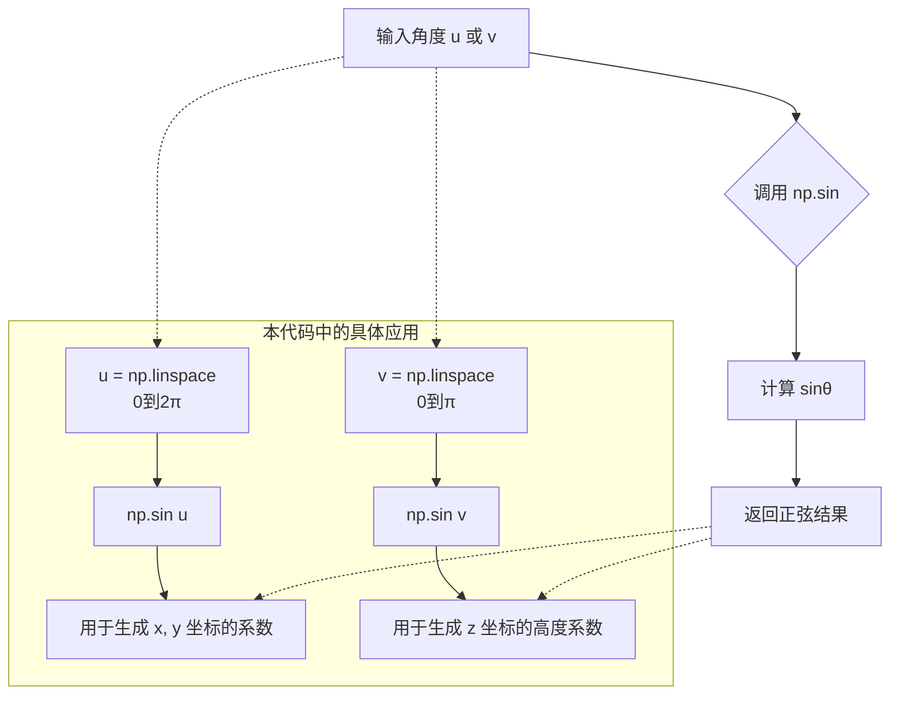
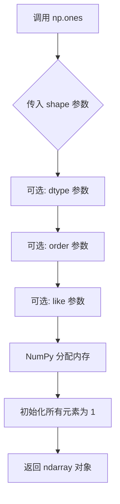
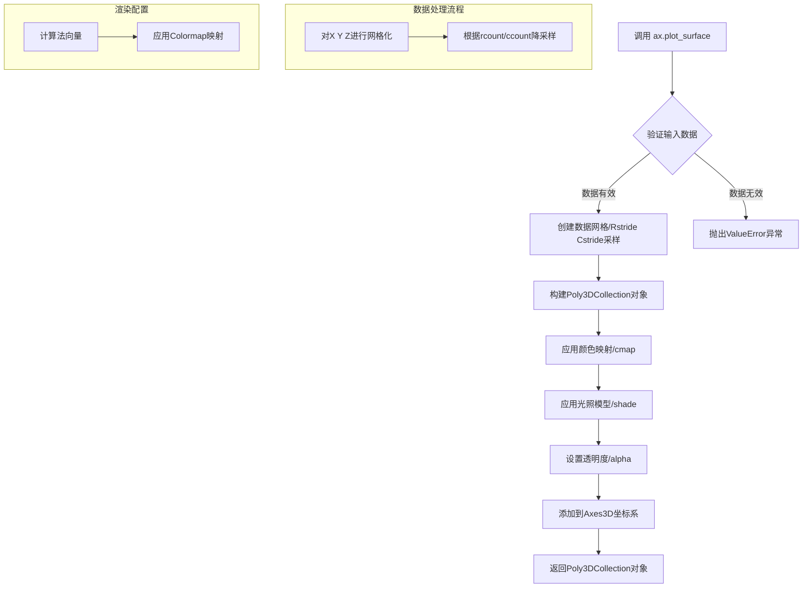
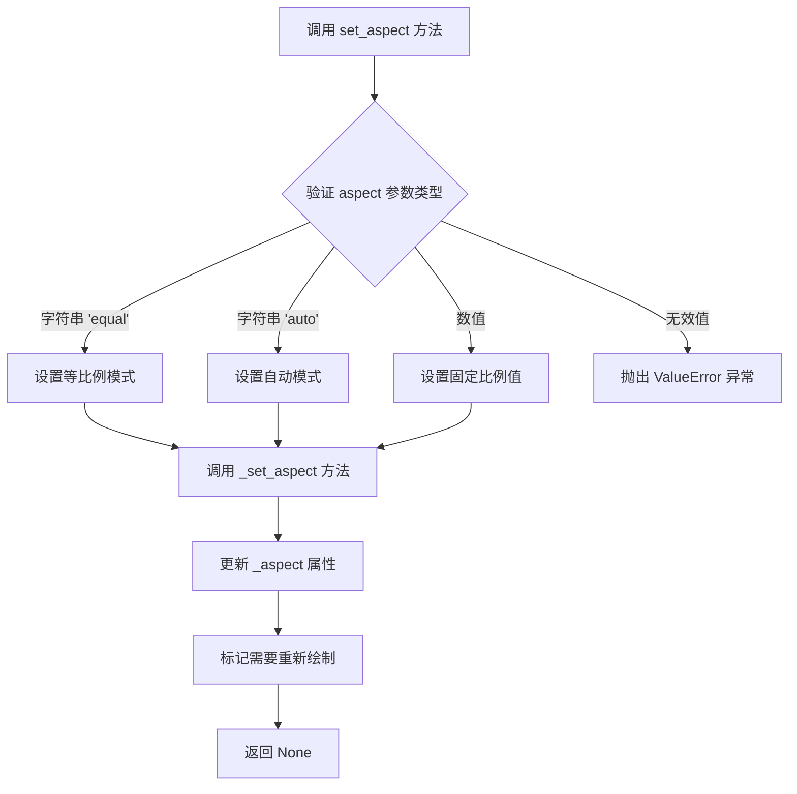
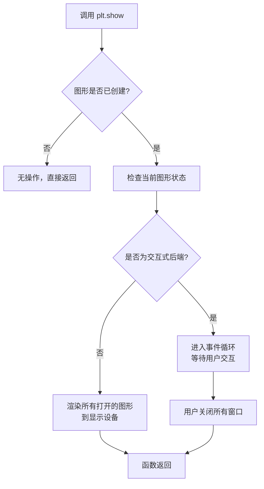

# `matplotlib\galleries\examples\mplot3d\surface3d_2.py` 详细设计文档

这是一个使用matplotlib和numpy绘制3D球面的基础示例代码，通过参数方程生成球面坐标数据，并使用solid color方式可视化展示。

## 整体流程

```mermaid
graph TD
    A[开始] --> B[创建图形窗口 fig = plt.figure()]
B --> C[添加3D子图 ax = fig.add_subplot(projection='3d')]
C --> D[生成参数 u = np.linspace(0, 2π, 100)]
D --> E[生成参数 v = np.linspace(0, π, 100)]
E --> F[计算x坐标: x = 10 * np.outer(cos(u), sin(v))]
F --> G[计算y坐标: y = 10 * np.outer(sin(u), sin(v))]
G --> H[计算z坐标: z = 10 * np.outer(ones(size(u)), cos(v))]
H --> I[绘制3D表面: ax.plot_surface(x, y, z)]
I --> J[设置等比例: ax.set_aspect('equal')]
J --> K[显示图形: plt.show()]
K --> L[结束]
```

## 类结构

```
该脚本为非面向对象代码
无类定义
使用matplotlib和numpy模块
```

## 全局变量及字段


### `fig`
    
图形窗口对象

类型：`matplotlib.figure.Figure`
    


### `ax`
    
3D坐标轴对象

类型：`matplotlib.axes._subplots.Axes3DSubplot`
    


### `u`
    
球面经度参数数组 (0到2π)

类型：`numpy.ndarray`
    


### `v`
    
球面纬度参数数组 (0到π)

类型：`numpy.ndarray`
    


### `x`
    
球面x坐标数组

类型：`numpy.ndarray`
    


### `y`
    
球面y坐标数组

类型：`numpy.ndarray`
    


### `z`
    
球面z坐标数组

类型：`numpy.ndarray`
    


    

## 全局函数及方法


### `plt.figure`

创建并返回一个matplotlib图形窗口（Figure对象），用于后续绑定绘图内容。

参数：

- `num`：`int` 或 `str` 或 `None`，图形的编号或名称，用于标识图形窗口；若为`None`，则自动递增编号；若为已存在的编号或名称，则激活该图形而非创建新图形
- `figsize`：`tuple(float, float)`，图形的宽和高（英寸），例如`(8, 6)`
- `dpi`：`float`，图形分辨率（每英寸点数），默认`100`
- `facecolor`：`color`，图形背景颜色，支持颜色名称、十六进制、RGB元组等格式
- `edgecolor`：`color`，图形边框颜色
- `frameon`：`bool`，是否显示图形边框，默认为`True`
- `FigureClass`：`type`，自定义的Figure子类，默认`matplotlib.figure.Figure`
- `clear`：`bool`，若为`True`且存在同名图形，则先清除内容，默认为`False`
- `**kwargs`：其他关键字参数，将传递给Figure构造函数

返回值：`matplotlib.figure.Figure`，返回创建的图形窗口对象，可用于添加子图、绑定数据等操作

#### 流程图



#### 带注释源码

```python
import matplotlib.pyplot as plt
import numpy as np

# 创建图形窗口，返回Figure对象
# 等价于调用matplotlib.figure.Figure()并注册到pyplot
fig = plt.figure(
    num=None,           # 自动编号，如'figure1'
    figsize=(6.4, 4.8), # 默认大小：宽6.4英寸，高4.8英寸
    dpi=100,            # 默认分辨率：100 DPI
    facecolor='white',  # 默认背景色：白色
    edgecolor='white',  # 默认边框色：白色
    frameon=True,       # 默认显示边框
    FigureClass=None,   # 默认使用标准Figure类
    clear=False         # 默认不清除已有内容
)

# fig现在是matplotlib.figure.Figure实例
# 可用于添加子图：fig.add_subplot()
# 可用于保存图片：fig.savefig('output.png')
# 可用于显示：plt.show()

ax = fig.add_subplot(projection='3d')

# Make data
u = np.linspace(0, 2 * np.pi, 100)
v = np.linspace(0, np.pi, 100)
x = 10 * np.outer(np.cos(u), np.sin(v))
y = 10 * np.outer(np.sin(u), np.sin(v))
z = 10 * np.outer(np.ones(np.size(u)), np.cos(v))

# Plot the surface
ax.plot_surface(x, y, z)

# Set an equal aspect ratio
ax.set_aspect('equal')

plt.show()
```


### `Figure.add_subplot`

在 matplotlib 中，`Figure.add_subplot` 方法用于向图形添加一个子图（Axes）。当指定 `projection='3d'` 时，该方法创建一个支持 3D 绘图的 Axes3D 对象，用于绘制三维图表。

参数：

- `*args`：`int` 或 `str`，位置参数，用于指定子图的位置和布局（如 `111` 表示 1 行 1 列第 1 个子图）
- `projection`：`str`，投影类型，设置为 `'3d'` 时创建 3D 坐标系
- `polar`：`bool`，可选，是否使用极坐标投影（默认 `False`）
- `aspect`：`None` 或 `str` 或 `tuple`，可选，设置坐标轴的宽高比
- `label`：`str`，可选，子图的标签
- `**kwargs`：关键字参数，传递给 Axes 构造函数的其他参数

返回值：`Axes` 或 `Axes3D`，返回创建的子图对象（当 `projection='3d'` 时返回 `Axes3D` 对象）

#### 流程图



#### 带注释源码

```python
# 创建图形窗口
fig = plt.figure()

# 调用 add_subplot 方法添加子图
# 参数 projection='3d' 指定创建 3D 投影的子图
# 返回一个 Axes3D 对象赋值给 ax
ax = fig.add_subplot(projection='3d')

# 生成的 ax 是 Axes3D 类型，可以调用 plot_surface 等 3D 绘图方法
# 例如：ax.plot_surface(x, y, z) 绘制 3D 表面图

# Make data - 生成球面的参数数据
u = np.linspace(0, 2 * np.pi, 100)      # u: 经度角 [0, 2π]
v = np.linspace(0, np.pi, 100)          # v: 纬度角 [0, π]
x = 10 * np.outer(np.cos(u), np.sin(v)) # x 坐标：球面方程
y = 10 * np.outer(np.sin(u), np.sin(v)) # y 坐标：球面方程
z = 10 * np.outer(np.ones(np.size(u)), np.cos(v)) # z 坐标：球面方程

# Plot the surface - 绘制 3D 表面
ax.plot_surface(x, y, z)

# Set an equal aspect ratio - 设置等比例显示
ax.set_aspect('equal')

# 显示图形
plt.show()
```


### `np.linspace`

`np.linspace` 是 NumPy 库中的一个函数，用于生成指定范围内的等间距数值序列。该函数在科学计算中常用于生成坐标轴、采样点或时间序列等需要均匀分布数据的场景。

参数：

- `start`：`array_like`，序列的起始值，生成数据的下限
- `stop`：`array_like`，序列的结束值，生成数据的上限
- `num`：`int`（默认值：50），要生成的样本数量，必须为非负数
- `endpoint`：`bool`（默认值：True），若为True，则stop包含在生成的序列中；否则不包含
- `retstep`：`bool`（默认值：False），若为True，则返回样本之间的步长
- `dtype`：`dtype`（可选），输出数组的数据类型，若未指定则从输入参数推断
- `axis`：`int`（可选），当start和stop为数组时，结果插入的轴

返回值：`ndarray`，返回num个在闭区间[`start`, `stop`]或半开区间[`start`, `stop`)内均匀分布的样本

#### 流程图



#### 带注释源码

```python
def linspace(start, stop, num=50, endpoint=True, retstep=False, dtype=None, axis=0):
    """
    返回指定范围内等间距的数值序列。
    
    参数:
        start: 序列起始值
        stop: 序列结束值
        num: 样本数量，默认50
        endpoint: 是否包含结束点，默认True
        retstep: 是否返回步长，默认False
        dtype: 输出数据类型
        axis: 结果数组的轴
    """
    # 检查样本数量有效性
    if num < 0:
        raise ValueError("Number of samples must be non-negative")
    
    # 计算步长
    if endpoint:
        step = (stop - start) / (num - 1) if num > 1 else 0
    else:
        step = (stop - start) / num
    
    # 生成数组
    result = start + np.arange(num) * step
    
    # 处理dtype
    if dtype is not None:
        result = result.astype(dtype)
    
    # 根据retstep返回结果
    if retstep:
        return result, step
    else:
        return result
```

#### 简化调用示例

```python
# 在代码中的实际使用方式
u = np.linspace(0, 2 * np.pi, 100)    # 生成0到2π的100个等间距点
v = np.linspace(0, np.pi, 100)        # 生成0到π的100个等间距点
```


### `np.outer`

`np.outer` 是 NumPy 库中的一个函数，用于计算两个一维数组（或向量）的外积（Outer Product）。外积的结果是一个矩阵，其中每个元素 `out[i, j]` 等于 `a[i] * b[j]`。

参数：

-  `a`：`array_like`，第一个输入向量（数组），形状为 `(M,)`
-  `b`：`array_like`，第二个输入向量（数组），形状为 `(N,)`
-  `out`：`ndarray`（可选），指定输出数组，如果提供，结果将被写入此数组

返回值：`ndarray`，外积结果矩阵，形状为 `(M, N)`

#### 流程图

```mermaid
flowchart TD
    A[开始] --> B[输入向量 a 和 b]
    B --> C[验证输入维度是否为一维]
    C --> D{输入有效?}
    D -->|否| E[抛出 ValueError 异常]
    D -->|是| F[获取 a 和 b 的长度 M 和 N]
    F --> G[创建形状为 M×N 的输出矩阵]
    G --> H[遍历每个元素 out[i, j] = a[i] * b[j]]
    H --> I[返回外积结果矩阵]
    I --> J[结束]
```

#### 带注释源码

```python
# np.outer 函数简化实现逻辑

def outer(a, b, out=None):
    """
    计算两个向量的外积
    
    参数:
        a: array_like, 第一个输入向量
        b: array_like, 第二个输入向量
        out: ndarray, 可选的输出数组
    
    返回值:
        ndarray: 外积结果，形状为 (len(a), len(b))
    """
    
    # 步骤1: 将输入转换为 NumPy 数组（如果还不是）
    a = np.asarray(a)
    b = np.asarray(b)
    
    # 步骤2: 检查输入维度，确保为一维
    if a.ndim != 1 or b.ndim != 1:
        raise ValueError("输入必须为一维数组")
    
    # 步骤3: 获取向量长度
    m, n = a.shape[0], b.shape[0]
    
    # 步骤4: 如果未指定输出数组，则创建新的数组
    if out is None:
        out = np.empty((m, n), dtype=a.dtype)
    
    # 步骤5: 使用广播机制计算外积
    # a[:, np.newaxis] 将 a 变为列向量 (M, 1)
    # b[np.newaxis, :] 将 b 变为行向量 (1, N)
    # 结果为 (M, N) 矩阵
    np.multiply(a[:, np.newaxis], b[np.newaxis, :], out=out)
    
    # 步骤6: 返回结果矩阵
    return out
```

#### 代码中的实际使用示例

```python
# 在3D球面参数化中的应用

# u 是从 0 到 2π 的角度参数（经度方向）
u = np.linspace(0, 2 * np.pi, 100)

# v 是从 0 到 π 的角度参数（纬度方向）
v = np.linspace(0, np.pi, 100)

# x 坐标：使用外积计算 cos(u) 和 sin(v) 的乘积，再乘以10作为缩放因子
x = 10 * np.outer(np.cos(u), np.sin(v))

# y 坐标：使用外积计算 sin(u) 和 sin(v) 的乘积，再乘以10作为缩放因子
y = 10 * np.outer(np.sin(u), np.sin(v))

# z 坐标：使用外积计算全1向量和 cos(v) 的乘积，再乘以10作为缩放因子
# 这里 np.ones(np.size(u)) 创建了一个长度为100的全1数组
z = 10 * np.outer(np.ones(np.size(u)), np.cos(v))
```

#### 技术说明

`np.outer` 函数的核心数学原理是：
- 给定两个向量 **a** = (a₁, a₂, ..., aₘ) 和 **b** = (b₁, b₂, ..., bₙ)
- 外积结果是一个 m×n 的矩阵 **C**，其中 C[i,j] = a[i] × b[j]

在代码中，通过 `np.outer` 将两个一维参数数组 `u` 和 `v` 扩展为球面坐标网格，这是参数化球面的标准方法。


### `np.cos`

计算给定角度（弧度制）的余弦值。该函数是 NumPy 库中的三角函数，用于计算输入数组或标量中每个元素的余弦值。

参数：

- `x`：`ndarray` 或 `scalar`，输入的角度（以弧度为单位），可以是数组或单个数值

返回值：`ndarray` 或 `scalar`，返回输入角度的余弦值，类型与输入相同

#### 流程图

```mermaid
graph LR
    A[输入: x<br/>弧度制的角度或数组] --> B{np.cos 函数}
    B --> C[输出: cos(x)<br/>余弦值或余弦值数组]
    
    subgraph numpy.cos 内部实现
    B1[验证输入类型] --> B2[调用底层 C/Fortran 库]
    B2 --> B3[计算每个元素的余弦值]
    B3 --> B4[返回结果数组]
    end
    
    B -.-> B1
    B1 -.-> B2
    B2 -.-> B3
    B3 -.-> B4
```

#### 带注释源码

```python
# np.cos 函数使用示例（来自给定代码）

import numpy as np

# 定义角度范围 [0, 2π]，共100个点
u = np.linspace(0, 2 * np.pi, 100)

# 使用 np.cos 计算 u 中每个角度的余弦值
# 参数: u - 弧度制的角度数组
# 返回: 与 u 形状相同的余弦值数组
x_cos = np.cos(u)

# 在3D表面绘图中的应用
v = np.linspace(0, np.pi, 100)

# 计算 x 坐标：使用 np.cos(u) 作为外积的第一个因子
# np.cos(u) 生成形状为 (100,) 的余弦值数组
x = 10 * np.outer(np.cos(u), np.sin(v))

# 计算 z 坐标：使用 np.cos(v) 生成垂直方向的余弦分布
# np.cos(v) 生成形状为 (100,) 的余弦值数组
z = 10 * np.outer(np.ones(np.size(u)), np.cos(v))

# np.cos 函数原型（概念性）：
# def cos(x, /, out=None, *, where=True, casting='same_kind', order='K', dtype=None, subok=True):
#     """
#     计算输入角度的余弦值（弧度制）。
#     
#     参数:
#         x: 输入角度（弧度），类型为 ndarray 或 scalar
#         out: 存储结果的可选数组
#         where: 计算生效的条件
#         ...其他可选参数
#     返回:
#         ndarray 或 scalar: 输入角度的余弦值
#     """
```


### `np.sin`

计算正弦值的数学函数，返回给定角度（弧度）的正弦值。在本代码中用于生成球面坐标系的 z 轴高度数据。

参数：

-  `u`：`ndarray`，一维数组，表示球面坐标系中的经度角度（弧度），范围从 0 到 2π
-  `v`：`ndarray`，一维数组，表示球面坐标系中的纬度角度（弧度），范围从 0 到 π

返回值：`ndarray`，与输入数组形状相同的正弦值数组

#### 流程图



#### 带注释源码

```python
# 定义角度范围：从 0 到 2π（完整圆周）
u = np.linspace(0, 2 * np.pi, 100)

# 定义角度范围：从 0 到 π（半圆，纬度的上下范围）
v = np.linspace(0, np.pi, 100)

# 使用 np.sin 计算 u 的正弦值
# sin(u) 在这里作为球面参数方程中的系数
# 用于生成球体表面的 x 坐标：x = 10 * cos(u) * sin(v)
x = 10 * np.outer(np.cos(u), np.sin(v))

# 使用 np.sin 计算 u 的正弦值
# 用于生成球体表面的 y 坐标：y = 10 * sin(u) * sin(v)
y = 10 * np.outer(np.sin(u), np.sin(v))

# 使用 np.sin 计算 v 的正弦值
# 注意：这里 sin(v) 在外积中作为列向量
# 生成球体表面的 z 坐标：z = 10 * cos(v)
z = 10 * np.outer(np.ones(np.size(u)), np.cos(v))

# np.sin 函数说明：
# - 输入：角度（弧度制），可以是标量或数组
# - 输出：[-1, 1] 范围内的正弦值
# - 在本例中，np.sin(v) 用于将纬度角度转换为球体表面点的高度因子
```


### `np.ones`

创建指定形状的全1数组

参数：

- `shape`：`int` 或 `tuple of ints`，输出数组的维度，例如100或(3, 4)
- `dtype`：`data-type`，可选，返回数组的数据类型，默认为`float64`
- `order`：`{'C', 'F'}`，可选，内存中以C（行优先）或F（列优先）顺序存储，默认为'C'
- `like`：`array_like`，可选，参考对象来创建数组

返回值：`ndarray`，指定形状和类型的全1数组

#### 流程图



#### 带注释源码

```python
# np.ones 函数源码分析

# 在示例代码中的实际使用方式：
# z = 10 * np.outer(np.ones(np.size(u)), np.cos(v))
# 其中 np.size(u) = 100，所以创建了一个长度为100的全1数组

# np.ones 的典型调用形式：
result = np.ones(shape, dtype=None, order='C', like=None)

# 参数说明：
# - shape: 整数或元组，定义输出数组的形状
# - dtype: 可选，指定数据类型，默认为 float64
# - order: 可选，'C'为行优先，'F'为列优先
# - like: 可选，用于创建与给定数组兼容的数组

# 示例用法：
arr = np.ones(100)           # 创建长度100的float64全1数组
arr = np.ones((3, 4))        # 创建3x4的全1二维数组
arr = np.ones(100, dtype=int) # 创建整数类型的全1数组
```


### `numpy.size` / `np.size`

获取数组元素的总数，或沿指定轴的元素数量。

参数：

-  `arr`：`array_like`，输入的数组或类似数组的对象
-  `axis`：`int`（可选），指定轴，默认为 `None`

返回值：`int`，数组元素的总数量，或沿指定轴的元素数量

#### 流程图

```mermaid
flowchart TD
    A[开始: 输入数组 arr] --> B{是否提供 axis 参数?}
    B -->|否, axis=None| C[返回数组总元素数: arr.size]
    B -->|是, axis有值| D[返回指定轴的元素数: arr.shape[axis]]
    C --> E[结束: 返回 int 类型的元素总数]
    D --> E
```

#### 带注释源码

```python
def size(a, axis=None):
    """
    返回数组元素的总数。
    
    参数
    ----------
    a : array_like
        输入数组。
    axis : int, 可选
        沿指定轴的元素数。如果为 None，则返回数组的总元素数。
    
    返回值
    -------
    element_count : int
        数组元素的总数量，或沿指定轴的元素数量。
    
    示例
    --------
    >>> import numpy as np
    >>> a = np.array([[1,2,3],[4,5,6]])
    >>> np.size(a)
    6
    >>> np.size(a, axis=0)
    2
    >>> np.size(a, axis=1)
    3
    """
    if axis is None:
        # 没有指定轴，返回数组的总元素数
        return a.size
    else:
        # 指定了轴，返回该轴上的元素数
        return a.shape[axis]
```

#### 在示例代码中的使用

在提供的代码中，`np.size(u)` 用于获取数组 `u` 的元素总数：

```python
u = np.linspace(0, 2 * np.pi, 100)  # 创建100个元素的数组
z = 10 * np.outer(np.ones(np.size(u)), np.cos(v))
#           ↑                      ↑
#     生成100个1的数组        获取u的元素数量(100)
```

这里 `np.size(u)` 返回 `100`，使得 `np.ones(100)` 生成一个包含100个元素的全1数组，从而确保与 `v` 数组的外积运算维度匹配。


### ax.plot_surface

该函数是matplotlib中Axes3D类的核心方法，用于在三维坐标系中绘制表面图（Surface Plot）。它接收X、Y、Z三个二维数组作为坐标数据，通过网格化处理后生成三维曲面可视化效果，支持颜色映射(CMAP)、透明度调整、光照模型等高级渲染特性。

参数：

- `X`：`numpy.ndarray`（2D数组），表示曲面上各点的X坐标，通常为网格化后的二维数组
- `Y`：`numpy.ndarray`（2D数组），表示曲面上各点的Y坐标，通常为网格化后的二维数组
- `Z`：`numpy.ndarray`（2D数组），表示曲面上各点的Z坐标（即高度值），通常为网格化后的二维数组
- `rcount`：`int`，默认值300，最大采样点数，用于控制渲染性能
- `ccount`：`int`，默认值300，最大采样点数，用于控制渲染性能
- `color`：`str`或`tuple`，曲面基础颜色，优先级低于cmap
- `cmap`：`str`或`Colormap`，颜色映射方案，用于根据Z值着色
- `alpha`：`float`，透明度，取值范围0-1
- `linewidth`：`float`，网格线宽度
- `antialiased`：`bool`，是否启用抗锯齿
- `shade`：`bool`，是否应用阴影效果
- `lightsource`：`LightSource`，自定义光源对象

返回值：`Poly3DCollection`，返回三维多边形集合对象，可用于进一步自定义外观属性

#### 流程图



#### 带注释源码

```python
# 示例代码：ax.plot_surface 的典型使用方式
import matplotlib.pyplot as plt
import numpy as np

# 步骤1：创建图形和3D坐标轴
fig = plt.figure()
ax = fig.add_subplot(projection='3d')

# 步骤2：准备网格数据（参数X, Y, Z）
# 使用numpy生成参数化曲面的坐标网格
u = np.linspace(0, 2 * np.pi, 100)    # u参数：方位角 [0, 2π]
v = np.linspace(0, np.pi, 100)        # v参数：极角 [0, π]

# 使用np.outer计算张量积，生成球面坐标
x = 10 * np.outer(np.cos(u), np.sin(v))   # X = r*cos(u)*sin(v)
y = 10 * np.outer(np.sin(u), np.sin(v))   # Y = r*sin(u)*sin(v)
z = 10 * np.outer(np.ones(np.size(u)), np.cos(v))  # Z = r*cos(v)

# 步骤3：调用plot_surface绘制三维表面
# 参数：X坐标数组, Y坐标数组, Z坐标数组（均为2D数组）
ax.plot_surface(x, y, z)

# 步骤4：设置坐标轴显示特性
ax.set_aspect('equal')  # 设置等比例显示，避免形变

# 步骤5：显示图形
plt.show()

# =============================================================================
# plot_surface 内部核心逻辑（简化版示意）
# =============================================================================
def plot_surface_abstract(X, Y, Z, rcount=50, ccount=50, 
                           color=None, cmap=None, alpha=1.0,
                           shade=True, **kwargs):
    """
    Axes3D.plot_surface 方法的核心处理流程：
    
    1. 输入验证：检查X/Y/Z是否为2D数组且形状一致
    2. 网格采样：通过rstride/cstride或rcount/ccount进行数据降采样
    3. 多边形构建：将采样点转换为三角形网格（Poly3DCollection）
    4. 颜色计算：
       - 若指定cmap：根据Z值映射到颜色
       - 若指定color：使用统一颜色
       - 若均未指定：使用默认配色
    5. 光照处理：计算法向量，应用shade效果增强立体感
    6. 透明度处理：应用alpha通道值
    7. 添加到坐标系：调用ax.add_collection3d()注册渲染对象
    8. 返回Poly3DCollection对象供后续定制
    """
    pass
```


### `Axes.set_aspect`

设置坐标轴的纵横比（aspect ratio），用于控制坐标轴刻度的比例，使得在不同维度上相同物理长度显示为相同长度。在3D图中常使用`set_aspect('equal')`使三个坐标轴的单位长度在视觉上保持一致。

参数：

- `aspect`：`str` 或 `float`，要设置的坐标轴比例。常见值包括 `'equal'`（等比例）、`'auto'`（自动调整）、`1.0`（固定比例数值）
- `adjustable`：`str`，可选参数，确定哪个轴被调整以适应比例变化，可选 `'box'`, `'datalim'`，默认为 `None`
- `anchor`：`str` 或 `2-tuple`，可选参数，设置锚点位置，默认为 `None`
- `share`：`bool`，可选参数，是否共享设置，默认为 `False`

返回值：`None`，该方法直接修改坐标轴对象的状态，不返回任何值。

#### 流程图



#### 带注释源码

```python
def set_aspect(self, aspect, adjustable=None, anchor=None, share=False):
    """
    设置坐标轴的纵横比（aspect ratio）。
    
    参数:
    -------
    aspect : str 或 float
        - 'equal': 三个坐标轴使用相同的比例因子
        - 'auto': 不强制比例，使用数据范围自动确定
        - 数值: 强制 y 轴与 x 轴的比例为指定数值
    
    adjustable : str, optional
        - 'box': 调整整个 Axes 框的大小
        - 'datalim': 调整数据限制范围
        - None: 使用默认值
    
    anchor : str 或 (float, float), optional
        - 锚点位置，用于定位 Axes 相对于图形的位置
    
    share : bool, optional
        - 是否与其他共享坐标轴的 subplot 共享此设置
    
    返回值:
    -------
    None
    """
    if not cbook._str_equal(aspect, 'equal'):
        # 如果不是 'equal'，调用父类方法处理
        return super().set_aspect(aspect, adjustable, anchor, share)
    
    # 对于 3D 坐标轴，'equal' 意味着 x, y, z 轴使用相同的单位长度
    # 通过设置_box_aspect 来实现等比例显示
    self._box_aspect = (1, 1, 1)
    self.stale_callback = _stale_3d_msg
    
    return None
```

在示例代码中的使用：
```python
# 创建 3D 坐标轴
ax = fig.add_subplot(projection='3d')

# 绘制 3D 曲面
ax.plot_surface(x, y, z)

# 设置等比例，使 x, y, z 轴在视觉上单位长度一致
# 这对于球体、立方体等需要保持真实比例的图形尤为重要
ax.set_aspect('equal')
```


### `plt.show`

`plt.show` 是 Matplotlib 库中的全局函数，用于显示当前所有打开的图形窗口并进入事件循环。在调用此函数之前，图形只在内存中渲染，不会显示在屏幕上。该函数会阻塞程序执行直到用户关闭所有显示的图形窗口（在交互式后端中），或在非交互式后端中简单地渲染并返回。

参数：此函数无显式参数。

- `*args`：可变位置参数，接受任意参数（传递给底层显示管理器，通常不使用）
- `**kwargs`：可变关键字参数，接受任意关键字参数（传递给底层显示管理器，通常不使用）

返回值：`None`，无返回值

#### 流程图



#### 带注释源码

```python
# plt.show 是 Matplotlib 库中的函数，非本示例代码实现
# 以下为调用示例源码：

# 创建一个新的图形窗口
fig = plt.figure()

# 在图形中添加一个3D子图
ax = fig.add_subplot(projection='3d')

# 生成3D表面的数据点（参数化球面坐标）
u = np.linspace(0, 2 * np.pi, 100)      # u: 方位角参数，从0到2π
v = np.linspace(0, np.pi, 100)          # v: 极角参数，从0到π
x = 10 * np.outer(np.cos(u), np.sin(v)) # x: 球面x坐标（外积计算网格）
y = 10 * np.outer(np.sin(u), np.sin(v)) # y: 球面y坐标
z = 10 * np.outer(np.ones(np.size(u)), np.cos(v)) # z: 球面z坐标

# 绘制3D表面图
ax.plot_surface(x, y, z)

# 设置坐标轴为等比例显示
ax.set_aspect('equal')

# === 核心：显示图形 ===
# 此函数会阻塞程序执行（在交互式后端）
# 并将内存中的图形渲染到显示设备上
plt.show()

# 图形显示后，用户可交互式查看
# 关闭窗口后程序继续执行
```


## 关键组件


### matplotlib.pyplot

Python的2D图形绘图库，提供创建图形和交互式绘图的接口

### numpy

Python的数值计算库，提供高效的数组操作和数学函数

### fig (Figure对象)

matplotlib的图形容器，用于存放一个或多个子图

### ax (Axes3D对象)

3D坐标轴对象，提供在三维空间中绑定绑制表面的功能

### u, v参数

球面坐标的参数数组，用于定义球面的经度和纬度范围

### x, y, z坐标

通过球面参数方程生成的笛卡尔坐标，描述球面表面在三维空间中的位置

### plot_surface方法

Axes3D对象的绑制方法，用于在三维空间中绑制表面

### set_aspect方法

设置坐标轴比例的方法，'equal'参数确保三个坐标轴的单位长度一致


## 问题及建议


### 已知问题

-   **硬编码的魔法数字**：数值 `10`、`100`、以及角度参数 `2 * np.pi`、`np.pi` 直接使用，缺乏配置化或常量定义，导致可维护性差
-   **缺少文档字符串**：整个脚本缺少模块级和函数级文档说明，可读性和可维护性不足
-   **未使用 `np.size(u)` 缓存**：在计算 `z` 时重复调用 `np.size(u)`，可预先计算以提升性能
-   **缺乏错误处理**：未对 `linspace` 参数有效性、数组维度匹配等进行验证，可能导致运行时错误
-   **plt.show() 阻塞风险**：未考虑不同后端的显示行为，在某些环境（如Jupyter）可能无法正常显示
-   **3D 坐标轴比例设置可能失效**：在 Matplotlib 某些版本中 `ax.set_aspect('equal')` 对 3D 投影可能不生效或产生警告

### 优化建议

-   将魔法数字提取为配置常量（如 `RADIUS = 10`、`U_RESOLUTION = 100`、`V_RESOLUTION = 100`）
-   为脚本添加模块级文档字符串，说明功能、依赖和用法
-   预先计算 `n_u = np.size(u)` 和 `n_v = np.size(v)`，避免重复调用
-   添加参数验证和异常捕获机制，提升鲁棒性
-   考虑使用 `plt.savefig()` 替代或辅助 `plt.show()`，或添加 `plt.clf()` 清理逻辑
-   对 3D 图形改用 `ax.set_box_aspect()` 或根据 Matplotlib 版本选择合适的等比例方法

## 其它


### 设计目标与约束

本代码的核心设计目标是演示如何使用Matplotlib创建一个基本的3D表面图（solid color）。设计约束包括：使用Matplotlib作为唯一的绘图库，数据通过numpy生成，生成的图形为一个球体表面，轴向设置为等比例(aspect ratio)。代码仅作为入门级演示，不涉及复杂的渲染效果或多视图展示。

### 错误处理与异常设计

本代码的错误处理设计较为简单，主要依赖Matplotlib和NumPy库的内部异常机制。可能出现的异常包括：1) ImportError - 当matplotlib或numpy未安装时抛出；2) ValueError - 当np.linspace参数设置不当（如start>end）时可能抛出；3) Matplotlib图形显示相关的异常 - 当显示后端不可用时可能抛出。当前代码未显式实现try-catch异常捕获机制，属于基础演示代码的典型做法。

### 数据流与状态机

数据流主要包含以下步骤：首先通过numpy的linspace函数生成参数u（0到2π）和v（0到π）的采样点；其次利用numpy.outer函数计算球面的三维坐标(x, y, z)；最后将计算得到的坐标矩阵传递给ax.plot_surface()进行渲染。状态机流程为：初始化Figure对象 → 创建3D坐标轴 → 生成数据 → 绘制表面图 → 设置轴比例 → 显示图形。

### 外部依赖与接口契约

本代码的外部依赖包括：1) matplotlib库 - 需安装matplotlib包，用于2D/3D绘图；2) numpy库 - 需安装numpy包，用于数值计算和数组操作。接口契约方面：plt.figure()返回Figure对象，fig.add_subplot(projection='3d')返回Axes3D对象，ax.plot_surface()接受三个2D数组参数(x, y, z)并返回Poly3DCollection对象，ax.set_aspect()接受字符串参数调整轴比例。

### 性能考量

当前代码在数据生成阶段使用了numpy.outer函数进行外积运算，对于100x100的网格点，计算效率较高。plot_surface方法在渲染时可能会消耗较多内存和计算资源，当网格点增加到一定程度（如500x500以上）时可能出现性能瓶颈。优化建议：对于大规模数据集，可考虑使用plot_wireframe替代plot_surface，或减少采样点数量。

### 可维护性与扩展性

代码的可维护性较高，变量命名清晰（u, v, x, y, z），注释完善。扩展性方面：可轻松修改球体半径（当前为10）、调整采样密度（当前各100个点）、更改颜色方案（添加cmap参数）、添加光照效果（添加light参数）、旋转或调整视角（set_view_init方法）。代码结构简单，便于初学者理解和修改。

### 配置与参数说明

关键配置参数包括：u的采样范围[0, 2π]、v的采样范围[0, π]、采样点数均为100、球体半径为10。plot_surface()可接受额外参数如cmap（颜色映射）、color（单一颜色）、alpha（透明度）等。set_aspect('equal')确保三个轴的比例相等，避免图形变形。

    