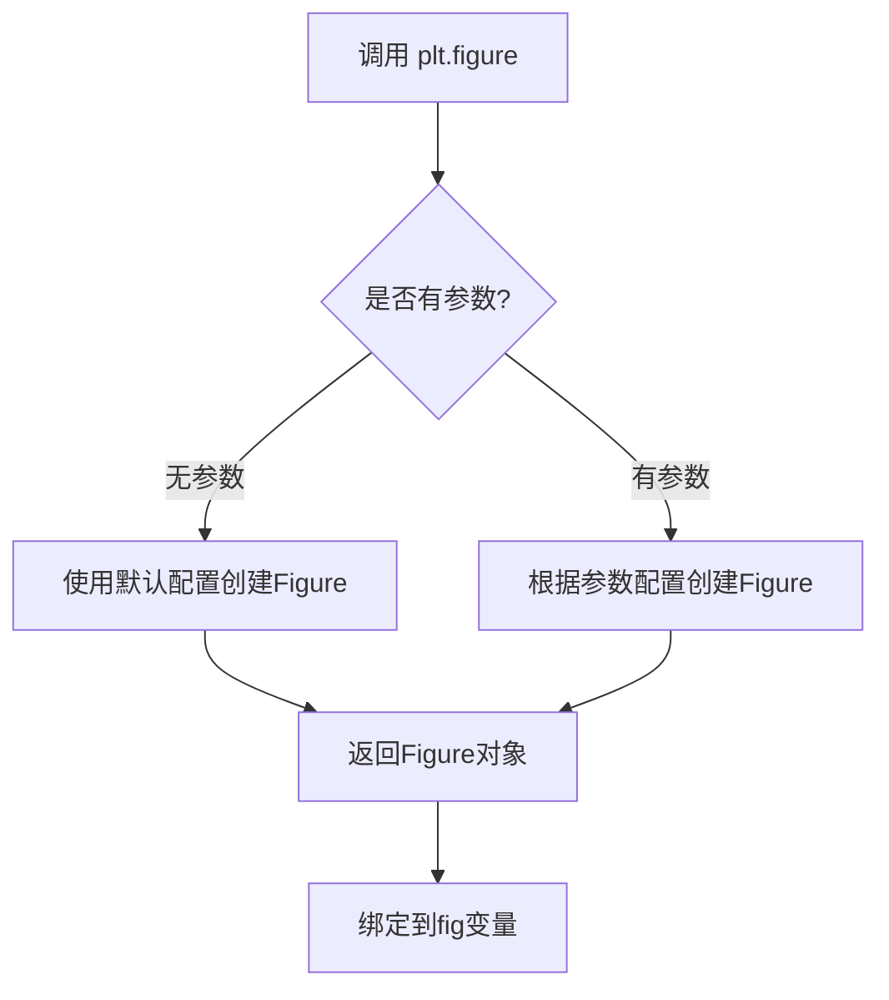
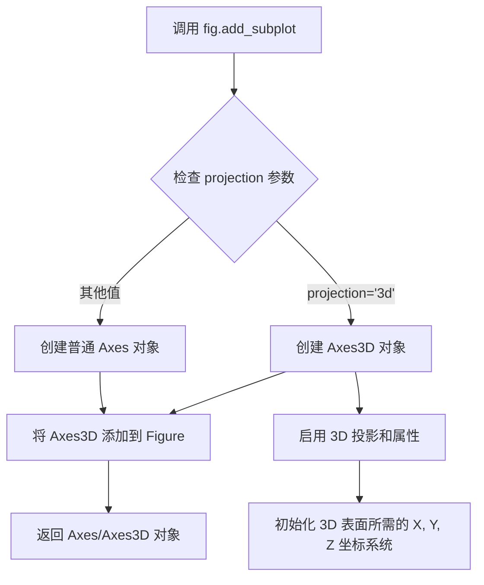
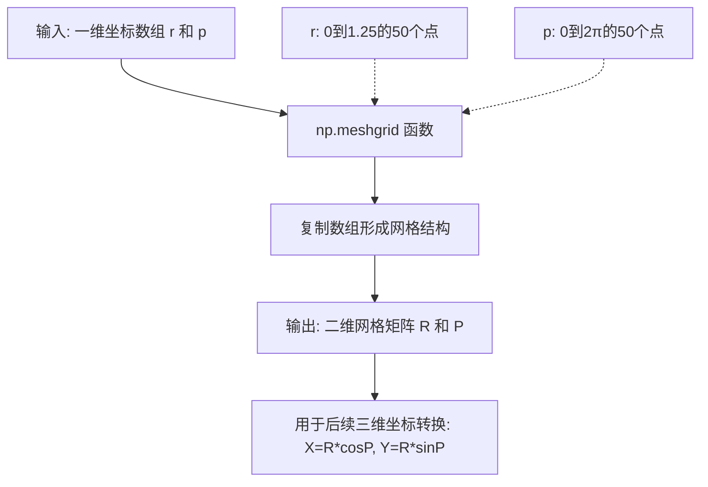
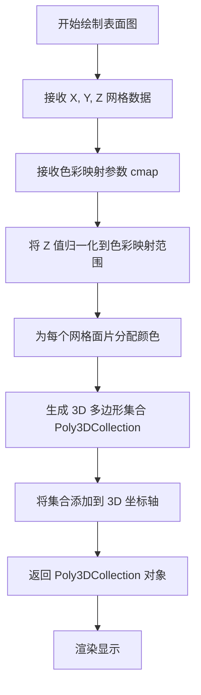
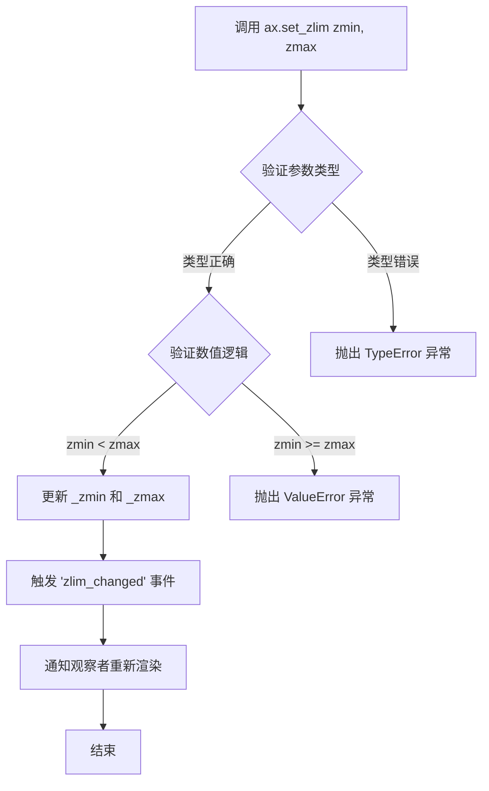
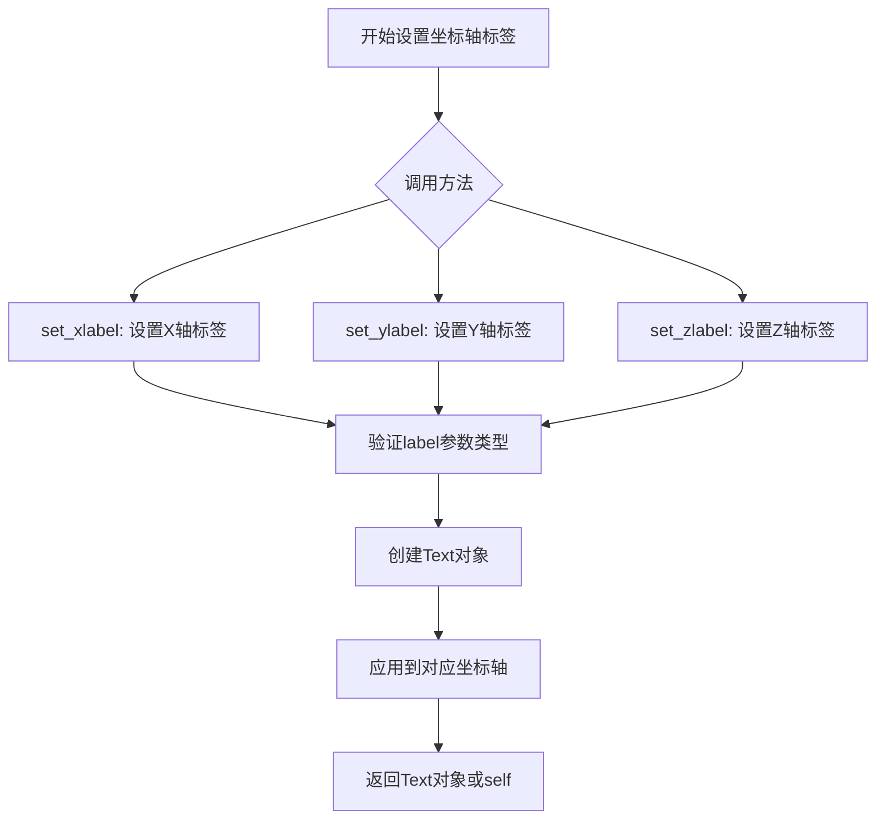

# `matplotlib\galleries\examples\mplot3d\surface3d_radial.py` 详细设计文档

该脚本使用 matplotlib 在极坐标系中创建 3D 表面图，通过 np.linspace 生成极坐标网格，使用 meshgrid 构建二维网格，计算 Z = (R² - 1)² 表达式，然后将极坐标转换为笛卡尔坐标，最后使用 YlGnBu_r 反向颜色映射绘制 3D 表面并设置 LaTeX 数学模式的坐标轴标签

## 整体流程

```mermaid
graph TD
    A[开始] --> B[导入模块: matplotlib.pyplot 和 numpy]
B --> C[plt.figure() 创建图形]
C --> D[fig.add_subplot 添加 3D 投影子图]
D --> E[np.linspace 生成半径数组 r: 0 到 1.25]
E --> F[np.linspace 生成角度数组 p: 0 到 2π]
F --> G[np.meshgrid 创建 R, P 网格矩阵]
G --> H[计算 Z = (R² - 1)²]
H --> I[极坐标转笛卡尔: X = R*cos(P), Y = R*sin(P)]
I --> J[ax.plot_surface 绘制 3D 表面]
J --> K[ax.set_zlim 设置 Z 轴范围 0-1]
K --> L[ax.set_xlabel/ylabel/zlabel 设置 LaTeX 标签]
L --> M[plt.show 显示图形]
```

## 类结构

```
该代码为脚本式程序，无类层次结构
所有代码直接在模块级别执行
```

## 全局变量及字段


### `fig`
    
Figure 对象，matplotlib 图形容器

类型：`matplotlib.figure.Figure`
    


### `ax`
    
Axes3D 对象，3D 坐标轴

类型：`matplotlib.axes._axes.Axes3D`
    


### `r`
    
ndarray，极坐标半径数组 (50个点, 0到1.25)

类型：`numpy.ndarray`
    


### `p`
    
ndarray，极坐标角度数组 (50个点, 0到2π)

类型：`numpy.ndarray`
    


### `R`
    
ndarray，meshgrid 生成的半径网格

类型：`numpy.ndarray`
    


### `P`
    
ndarray，meshgrid 生成的角度网格

类型：`numpy.ndarray`
    


### `Z`
    
ndarray，计算的表面高度值 (R²-1)²

类型：`numpy.ndarray`
    


### `X`
    
ndarray，笛卡尔坐标 X 分量

类型：`numpy.ndarray`
    


### `Y`
    
ndarray，笛卡尔坐标 Y 分量

类型：`numpy.ndarray`
    


    

## 全局函数及方法


### `plt.figure`

创建新的图形窗口（Figure），并返回与之关联的 Figure 对象。该函数是 matplotlib 中用于初始化绘图环境的入口函数。

参数：

- 该函数在无参数调用时使用默认配置创建图形窗口

返回值：`matplotlib.figure.Figure`，返回新创建的图形对象，可用于添加子图和绘制各种类型的图表

#### 流程图



#### 带注释源码

```python
# 导入matplotlib的pyplot模块，用于绑制各种类型的图表
import matplotlib.pyplot as plt
# 导入numpy库，用于数值计算和数组操作
import numpy as np

# 创建新的图形窗口（Figure），返回Figure对象并赋值给变量fig
# 此时创建一个空白的图形窗口，准备用于后续绘图
fig = plt.figure()

# 向fig中添加一个3D投影的子图，projection='3d'指定为三维坐标系
# 返回的ax对象用于在三维空间中绑制数据
ax = fig.add_subplot(projection='3d')

# 创建极坐标下的半径和角度网格
r = np.linspace(0, 1.25, 50)       # 半径从0到1.25，均匀取50个点
p = np.linspace(0, 2*np.pi, 50)    # 角度从0到2π，均匀取50个点

# 使用np.meshgrid生成二维网格矩阵R和P
R, P = np.meshgrid(r, p)

# 计算Z值，这里使用((R**2 - 1)**2)公式，创建一个类似碗状的曲面
Z = ((R**2 - 1)**2)

# 将极坐标网格转换为笛卡尔坐标系统
X = R * np.cos(P)    # X = R * cos(θ)
Y = R * np.sin(P)    # Y = R * sin(θ)

# 绘制三维曲面，使用YlGnBu_r（黄-绿-蓝反向）颜色映射
ax.plot_surface(X, Y, Z, cmap="YlGnBu_r")

# 设置Z轴的显示范围为0到1
ax.set_zlim(0, 1)

# 设置三个坐标轴的标签，使用LaTeX数学模式
ax.set_xlabel(r'$\phi_\mathrm{real}$')   # X轴标签
ax.set_ylabel(r'$\phi_\mathrm{im}$')     # Y轴标签
ax.set_zlabel(r'$V(\phi)$')              # Z轴标签

# 显示绑制结果
plt.show()
```


### `Figure.add_subplot`

向当前图形添加一个 3D 子图，返回可用于绘制 3D 数据的 Axes3D 对象。

参数：

- `projection`：`str`，指定投影类型，此处传入 `'3d'` 表示创建 3D 坐标轴
- `*args`：可变位置参数，支持传递 `rows, cols, index` 格式的子图位置参数（如 `111`），或 `SubplotSpec` 对象
- `**kwargs`：关键字参数，可包含 `projection`、`polar`、`label` 等子图属性

返回值：`matplotlib.axes._axes.Axes3D`，返回的 3D 坐标轴对象，用于调用 `plot_surface`、`plot_trisurf` 等 3D 绘图方法

#### 流程图



#### 带注释源码

```python
# 在 matplotlib 库中，Figure.add_subplot 方法的核心实现逻辑（简化版）

def add_subplot(self, *args, **kwargs):
    """
    向图形添加一个子图。
    
    参数:
        *args: 位置参数，可以是:
            - 三个整数 (rows, cols, index) 如 111, 221 等
            - 一个三位数如 111 等同于 (1,1,1)
            - SubplotSpec 对象
        **kwargs: 关键字参数，关键参数之一是 projection:
            - '2d': 默认值，创建 2D 坐标轴
            - '3d': 创建 3D 坐标轴 (Axes3D)
            - 'polar': 创建极坐标轴
    """
    
    # 获取 projection 参数，默认为 '2d'
    projection = kwargs.get('projection', '2d')
    
    # 如果 projection 是 '3d'
    if projection == '3d':
        # 创建 Axes3D 对象（3D 坐标轴）
        ax = Axes3D(self, *args, **kwargs)
    else:
        # 创建普通的 Axes 对象（2D 坐标轴）
        ax = Axes(self, *args, **kwargs)
    
    # 将创建的坐标轴添加到图形的子图列表中
    self._axstack.bubble(ax)
    self._axobservers.process("_axes_change_event", self)
    
    return ax  # 返回 Axes 或 Axes3D 对象
```


### np.linspace

创建等间距的一维数组，返回包含 `num` 个在闭区间 [`start`, `stop`] 或半开区间 [`start`, `stop`) 中均匀分布的样本。

参数：

- `start`：`float`，序列的起始值
- `stop`：`float`，序列的结束值
- `num`：`int`（可选，默认值为50），要生成的样本数量
- `endpoint`：`bool`（可选，默认值为True），如果为True，则stop是最后一个样本；否则不包含
- `retstep`：`bool`（可选，默认值为False），如果为True，则返回(samples, step)
- `dtype`：`dtype`（可选），输出数组的类型
- `axis`：`int`（可选），结果的轴（用于多维数组）

返回值：`ndarray`，如果 `retstep` 为 False，则返回等间距数组；否则返回 (samples, step) 元组

#### 流程图

```mermaid
flowchart TD
    A[开始 np.linspace] --> B{参数验证}
    B -->|num == 0| C[返回空数组]
    B -->|num == 1| D[返回只含start的数组]
    B -->|num > 1| E[计算步长step]
    E --> F{endpoint是否为True}
    F -->|True| G[step = (stop - start) / (num - 1)]
    F -->|False| H[step = (stop - start) / num]
    G --> I[生成等间距数组]
    H --> I
    I --> J{retstep是否为True}
    J -->|True| K[返回数组和step]
    J -->|False| L[仅返回数组]
    K --> M[结束]
    L --> M
    C --> M
    D --> M
```

#### 带注释源码

```python
def linspace(start, stop, num=50, endpoint=True, retstep=False, dtype=None, axis=0):
    """
    创建等间距的一维数组
    
    参数:
        start: 序列起始值
        stop: 序列结束值  
        num: 样本数量，默认50
        endpoint: 是否包含终点，默认True
        retstep: 是否返回步长，默认False
        dtype: 输出数据类型
        axis: 结果数组的轴
    
    返回:
        ndarray 或 (ndarray, float) 元组
    """
    # 参数num必须为非负整数
    if num < 0:
        raise ValueError("Number of samples must be non-negative")
    
    # 特殊情况处理
    if num == 0:
        return array([], dtype=dtype)
    
    if num == 1:
        # 只有一个样本时，只返回start
        if endpoint:
            return array([start], dtype=dtype)
        else:
            # 注意：endpoint=False且num=1时，返回值行为需特殊处理
            return array([start], dtype=dtype)
    
    # 计算步长
    if endpoint:
        step = (stop - start) / (num - 1)
    else:
        step = (stop - start) / num
    
    # 使用arange生成数组
    # 注意：这里简化了实现，实际NumPy有更复杂的逻辑处理浮点精度
    result = arange(num, dtype=dtype) * step + start
    
    if endpoint and num > 0:
        # 确保最后一个值精确等于stop
        result[-1] = stop
    
    if retstep:
        return result, step
    
    return result
```


### `np.meshgrid`

该函数是NumPy库中用于创建坐标网格矩阵的核心函数，它从多个一维坐标数组生成网格坐标数组，使得可以对非规则网格进行向量化计算，常用于三维图形的坐标转换和数值计算场景。

参数：

- `*xi`：`可变数量的array_like`，任意数量的一维坐标数组，每个数组表示一个维度的坐标值。在本例中包含：
  - `r`：`numpy.ndarray`，从0到1.25的50个等间距点的一维数组，表示径向坐标
  - `p`：`numpy.ndarray`，从0到2π的50个等间距点的一维数组，表示角度坐标

返回值：`tuple of ndarray`，返回由输入数组生成的网格坐标矩阵元组。在本例中返回：
  - `R`：`numpy.ndarray`，二维数组，shape为(50, 50)，由r和p生成的径向坐标网格
  - `P`：`numpy.ndarray`，二维数组，shape为(50, 50)，由r和p生成的角度坐标网格

#### 流程图



#### 带注释源码

```python
# 从给定的坐标数组创建网格矩阵
# r: 一维数组 [0, 0.0255, 0.051, ..., 1.25] 共50个元素
# p: 一维数组 [0, 0.127, 0.255, ..., 6.283] 共50个元素
# 
# meshgrid 会将 r 作为列向量复制，将 p 作为行向量复制
# 输出两个 50x50 的二维数组
R, P = np.meshgrid(r, p)

# R 的每一行都是 r 的完整复制
# R 的形状: (50, 50)
# R[0, :] = [0, 0.0255, ..., 1.25]
# R[1, :] = [0, 0.0255, ..., 1.25]
# ...

# P 的每一列都是 p 的完整复制  
# P 的形状: (50, 50)
# P[:, 0] = [0, 0.127, ..., 6.283]
# P[:, 1] = [0, 0.127, ..., 6.283]
# ...

# 后续用于将极坐标转换为笛卡尔坐标
# X = R * cos(P)  # X坐标
# Y = R * sin(P)  # Y坐标
```


### `ax.plot_surface`

绘制 3D 表面图是 matplotlib 中用于在三维坐标系中可视化曲面数据的核心方法，它接收 X、Y 网格坐标和对应的 Z 值（高度），并通过指定的色彩映射（cmap）将高度值映射为颜色，生成可供直观分析的 3D 可视化效果。

参数：

- `X`：`numpy.ndarray` 或类数组对象，表示曲面的 X 坐标网格，通常通过 `meshgrid` 生成
- `Y`：`numpy.ndarray` 或类数组对象，表示曲面的 Y 坐标网格，通常通过 `meshgrid` 生成
- `Z`：`numpy.ndarray` 或类数组对象，表示曲面上每个点的高度值（Z 坐标），代表表面的物理意义如电位、温度等
- `cmap`：`str` 或 `Colormap` 对象指定颜色映射方案，用于将 Z 值映射为可视化颜色，如 `"YlGnBu_r"` 表示黄-绿-蓝反转色阶

返回值：`matplotlib.collections.Poly3DCollection`，返回三维多边形集合对象，可用于进一步自定义图形外观（如设置透明度、边框颜色等）

#### 流程图



#### 带注释源码

```python
# 导入必要的库
import matplotlib.pyplot as plt
import numpy as np

# 创建图形窗口
fig = plt.figure()
# 添加 3D 投影的子图，返回 Axes3D 对象
ax = fig.add_subplot(projection='3d')

# =============================================
# 准备曲面数据（极坐标系统）
# =============================================

# r: 从 0 到 1.25 的径向距离采样，共 50 个点
r = np.linspace(0, 1.25, 50)
# p: 从 0 到 2π 的角度采样，共 50 个点
p = np.linspace(0, 2*np.pi, 50)
# R, P: 使用 meshgrid 生成极坐标网格矩阵
R, P = np.meshgrid(r, p)
# Z: 计算高度值（这里使用 (R² - 1)² 公式）
Z = ((R**2 - 1)**2)

# =============================================
# 坐标变换：极坐标 → 笛卡尔坐标
# =============================================

# 将极坐标网格转换为笛卡尔坐标 X, Y
# X = R * cos(P), Y = R * sin(P)
X, Y = R*np.cos(P), R*np.sin(P)

# =============================================
# 调用 plot_surface 绘制 3D 曲面
# =============================================

# 参数说明：
#   X: 笛卡尔 X 坐标网格 (50x50 矩阵)
#   Y: 笛卡尔 Y 坐标网格 (50x50 矩阵)
#   Z: 高度值网格 (50x50 矩阵)
#   cmap: 色彩映射为 'YlGnBu_r'（黄绿蓝反转色）
# 返回值: surface 是 Poly3DCollection 对象
surface = ax.plot_surface(X, Y, Z, cmap="YlGnBu_r")

# =============================================
# 图形美化与标签设置
# =============================================

# 设置 Z 轴显示范围为 0 到 1
ax.set_zlim(0, 1)
# 设置轴标签（使用 LaTeX 数学模式）
ax.set_xlabel(r'$\phi_\mathrm{real}$')   # 实部 φ
ax.set_ylabel(r'$\phi_\mathrm{im}$')     # 虚部 φ
ax.set_zlabel(r'$V(\phi)$')              # 势能 V(φ)

# 显示图形
plt.show()
```


### `Axes3D.set_zlim`

设置3D坐标轴的Z轴显示范围，用于控制Z轴的最小值和最大值，限制3D表面或线型图的可见高度区间。

参数：

- `zmin`：`float` 或 `int`，Z轴的下限值，定义Z轴显示的最小高度
- `zmax`：`float` 或 `int`，Z轴的上限值，定义Z轴显示的最大高度

返回值：`None`，该方法直接修改`Axes3D`对象的属性，不返回任何值

#### 流程图



#### 带注释源码

```python
def set_zlim(self, bottom=None, top=None, *, emit=False, auto=False, 
             ymin=None, ymax=None):
    """
    设置3D轴的Z轴范围。
    
    参数:
        bottom: float 或 None
            Z轴下限值。如果为None，则自动从当前数据中推断。
        top: float 或 None
            Z轴上限值。如果为None，则自动从当前数据中推断。
        emit: bool (默认=False)
            是否向观察者发送'limits_changed'事件。
        auto: bool (默认=False)
            是否自动调整视图范围。
        ymin, ymax: float 或 None
            已废弃参数，仅用于向后兼容。
    
    返回值:
        tuple: 返回新的Z轴范围 (zmin, zmax)
    
    异常:
        TypeError: 当bottom或top类型不正确时抛出。
        ValueError: 当bottom >= top时抛出。
    """
    
    # 获取当前轴的zmin和zmax值
    self._stale_viewlims = True  # 标记视图需要更新
    
    # 验证输入参数类型
    if bottom is not None and not isinstance(bottom, (int, float)):
        raise TypeError("bottom参数必须是float或int类型")
    if top is not None and not isinstance(top, (int, float)):
        raise TypeError("top参数必须是float或int类型")
    
    # 验证数值的逻辑有效性
    if bottom is not None and top is not None and bottom >= top:
        raise ValueError("Z轴下限必须小于上限")
    
    # 使用父类Axes的set_xlim方法处理逻辑
    return super().set_xlim(  # 注意：这里实际调用的是父类方法
        bottom=bottom, 
        top=top, 
        emit=emit, 
        auto=auto
    )
```

> **注**：上述源码为简化版本，展示了核心逻辑。实际Matplotlib实现中，`set_zlim`继承自`Axes`类并复用了`set_xlim`的逻辑，通过`stale_viewlims`标志触发重新渲染。该方法在设置完范围后会自动调用`autoscale_view()`方法根据新的限制重新计算坐标轴。


### `Axes3D.set_xlabel` / `set_ylabel` / `set_zlabel`

这三个方法用于设置 3D 坐标轴的标签，支持 LaTeX 数学模式语法，常用于科学计算可视化中标注物理量或数学符号。

参数：

- `label`：`str`，坐标轴标签文本内容，支持 LaTeX 格式（如 `r'$\phi_\mathrm{real}$'`）

返回值：`str` 或 `Text`，返回设置后的标签文本对象，支持链式调用

#### 流程图



#### 带注释源码

```python
# 设置X轴标签 (水平坐标轴)
ax.set_xlabel(r'$\phi_\mathrm{real}$')

# 设置Y轴标签 (垂直坐标轴)  
ax.set_ylabel(r'$\phi_\mathrm{im}$')

# 设置Z轴标签 (深度坐标轴)
ax.set_zlabel(r'$V(\phi)$')

# 参数说明：
# - label: 字符串类型，支持原始字符串(r'...')避免转义
# - LaTeX数学模式: 使用$...$包裹，如$\phi$表示希腊字母φ
# - 下标: 使用_\mathrm{}实现，如$\mathrm{real}$显示为正体real
# 
# 方法返回值：Text对象，可用于进一步自定义标签样式
# 例如: ax.set_xlabel(...).set_fontsize(12).set_color('red')
```


### `plt.show()`

显示当前图形并进入事件循环，等待用户交互。该函数会阻塞程序执行（除非设置block=False），直到所有图形窗口关闭为止。

参数：

- `block`：`bool`，可选，默认为`True`。如果设置为`True`，则阻塞程序直到所有图形窗口关闭；如果设置为`False`，则立即返回（仅在某些后端有效）。

返回值：`None`，无返回值

#### 流程图

```mermaid
flowchart TD
    A[调用 plt.show()] --> B{图形后端类型}
    B -->|交互式后端| C[显示图形窗口]
    B -->|非交互式后端| D[无操作或输出到文件]
    C --> E{参数 block?}
    E -->|True| F[进入事件循环<br/>阻塞等待用户交互]
    E -->|False| G[立即返回<br/>非阻塞模式]
    F --> H[用户关闭所有窗口]
    G --> I[程序继续执行]
    H --> J[函数返回]
    I --> J
    J --> K[返回 None]
```

#### 带注释源码

```python
# 导入matplotlib.pyplot模块，用于绘图
import matplotlib.pyplot as plt

# ... (前文代码创建3D表面图形) ...

# 设置Z轴显示范围为0到1
ax.set_zlim(0, 1)

# 设置各轴标签，使用LaTeX数学模式
ax.set_xlabel(r'$\phi_\mathrm{real}$')  # X轴标签：实部φ
ax.set_ylabel(r'$\phi_\mathrm{im}$')    # Y轴标签：虚部φ
ax.set_zlabel(r'$V(\phi)$')             # Z轴标签：势函数V(φ)

# 显示图形并进入事件循环
# 阻塞主线程，等待用户关闭图形窗口
plt.show()  # <-- 提取的目标函数

# 注释说明：
# - 默认block=True，程序会在此等待
# - 用户关闭所有图形窗口后程序继续执行
# - 返回值为None
```

#### 关键组件信息

| 组件名称 | 一句话描述 |
|---------|-----------|
| matplotlib.pyplot | Python 2D绘图库，提供类似MATLAB的绘图接口 |
| FigureCanvas | 图形画布，负责渲染图形到窗口或文件 |
| Event Loop | 事件循环，处理用户输入（如鼠标、键盘事件） |

#### 潜在技术债务与优化空间

1. **阻塞行为**：默认阻塞模式可能导致GUI应用无响应，建议在交互式应用中使用`block=False`或集成到GUI框架中
2. **后端依赖**：不同后端（如Qt、Tkinter、MacOSX）对`block=False`的支持不一致，跨平台需注意
3. **缺少错误处理**：未对图形后端初始化失败等情况进行处理

#### 其它说明

- **设计目标**：提供简洁的图形显示接口，模拟MATLAB的绘图流程
- **约束**：必须在创建图形之后调用；同一脚本中多次调用只会显示最新图形
- **错误处理**：若后端不可用可能抛出`RuntimeError`；无图形时调用可能显示空窗口或无效果
- **外部依赖**：依赖matplotlib已安装的后端（如Qt5Agg、TkAgg等）


## 关键组件


### 极坐标网格创建

使用np.linspace生成r和p的等间距数组，再通过np.meshgrid生成完整的极坐标网格R和P，用于后续计算Z值和坐标转换。

### Z轴函数计算

根据极坐标半径R计算Z值，公式为Z = ((R**2 - 1)**2)，这是一个在极坐标中定义的表面函数，创建一个类似于甜甜圈形状的三维表面。

### 坐标系统转换

将极坐标(R, P)转换为笛卡尔坐标(X, Y)，使用X = R*cos(P)和Y = R*sin(P)公式，以便matplotlib的plot_surface函数能够正确绘制。

### 3D表面绘制

使用ax.plot_surface函数绘制三维表面，指定X、Y、Z数据和"YlGnBu_r"（反转的YlGnBu）色图来实现可视化。

### 图表轴标签与限制

设置z轴范围为0到1，使用LaTeX数学模式添加三个坐标轴的标签（phi_real、phi_im、V(phi)），使图表更具科学性和可读性。


## 问题及建议


### 已知问题

-   **魔法数字硬编码**：网格分辨率50、半径上限1.25等数值直接写在代码中，缺乏可配置性
-   **变量命名不清晰**：p实际表示角度θ（theta），X/Y/Z变量名缺乏物理意义描述
-   **缺乏参数验证**：未对输入参数范围进行校验
-   **无错误处理机制**：meshgrid、plot_surface等操作失败时无异常捕获
-   **重复计算**：R**2在Z的计算中使用了两次，可以缓存中间结果
-   **Z计算冗余括号**：Z = ((R**2 - 1)**2) 双层括号不必要的
-   **标签与物理含义不匹配**：轴标签使用了phi_real/phi_im，但代码实际是极坐标r和theta

### 优化建议

-   将网格分辨率、半径范围等提取为可配置常量
-   使用更语义化的变量名，如theta替代p，r_grid替代r等
-   添加输入参数校验函数，确保r和theta范围合理
-   为关键操作添加try-except异常处理
-   优化Z的计算表达式：Z = (R**2 - 1)**2
-   统一轴标签与实际物理量含义
-   考虑将绘图配置抽取为独立函数以提高可复用性


## 其它


### 设计目标与约束

本示例代码的设计目标是演示如何使用matplotlib在极坐标系中绘制3D表面图。核心约束包括：必须使用matplotlib的3D投影功能、必须将极坐标转换为笛卡尔坐标进行绘图、必须使用特定的颜色映射（YlGnBu_r反转版本）、轴标签必须使用LaTeX数学模式表示。

### 错误处理与异常设计

代码未实现显式的错误处理机制。潜在错误包括：numpy的linspace参数无效导致ValueError、matplotlib后端不支持3D绘图导致RuntimeError、内存不足导致MemoryError。建议在实际应用中添加参数验证、异常捕获和降级处理逻辑。

### 数据流与状态机

数据流分为四个阶段：1)初始化阶段创建极坐标网格（r, p）；2)计算阶段根据公式Z=((R**2-1)**2)计算Z值；3)转换阶段将极坐标(R,P)转换为笛卡尔坐标(X,Y)；4)渲染阶段调用plot_surface绘制3D表面。状态机包含IDLE、DATA_GENERATION、COORDINATE_TRANSFORM、RENDERING四个状态。

### 外部依赖与接口契约

代码依赖两个外部库：matplotlib>=3.0.0（提供3D绘图功能）和numpy>=1.20.0（提供数值计算和网格生成功能）。接口契约包括：fig.add_subplot必须传入projection='3d'参数、plot_surface必须传入X、Y、Z三个相同形状的数组、颜色映射参数cmap必须为有效的matplotlib colormap名称。

### 性能考虑与优化空间

当前代码使用50x50的网格分辨率，在性能与视觉效果之间取得平衡。优化空间包括：对于静态图可预先计算Z值并缓存、对实时应用可使用更粗的网格（如20x20）提高响应速度、对于高分辨率需求可考虑使用GPU加速的plot_surface实现。

### 可维护性与扩展性

代码结构清晰但扩展性有限。改进方向：1)将参数提取为可配置的常量或配置文件；2)封装为可复用的函数，接受r、p范围和分辨率作为参数；3)添加颜色映射、标题等可视化选项的定制接口；4)增加返回Figure对象的支持以便集成到GUI应用中。

### 版本兼容性说明

代码使用Python 3语法，兼容Python 3.8+。matplotlib 3.0+版本支持projection='3d'参数，早期版本使用mpl_toolkits.mplot3d。numpy的meshgrid函数在所有现代版本中行为一致。代码不依赖于任何平台特定的功能，具有良好的跨平台兼容性。

### 使用示例与运行要求

代码可直接运行生成独立的窗口图形。运行要求：1)Python环境中已安装matplotlib和numpy；2)具有图形显示能力（配置好matplotlib后端）；3)在Jupyter环境中可使用%matplotlib inline或%matplotlib widget显示。示例数据生成了名为"蒙脱石"型电位表面的可视化效果。

### 图形输出规范

输出图形包含：X轴标签为φ_real（实部相位）、Y轴标签为φ_im（虚部相位）、Z轴标签为V(φ)（电位函数），Z轴范围限制在0到1之间。图形使用YlGnBu_r颜色映射，采用默认视角和光照设置。图形可通过plt.savefig保存为多种格式（PNG、PDF、SVG等）。

### 代码注释与文档

源代码包含Sphinx格式的文档字符串，用于生成API文档。代码标签标记为：plot-type包含3D和polar、level为beginner。这些元数据用于示例分类和检索。代码贡献者信息包含在文档字符串中。


    