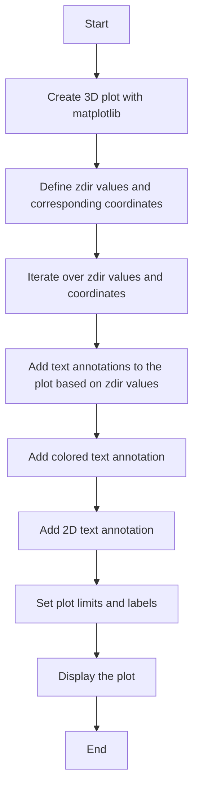
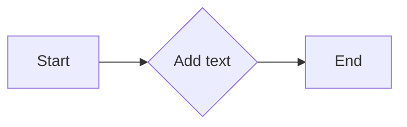
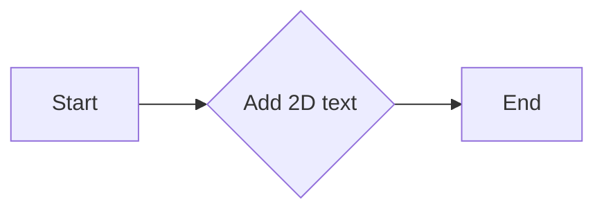
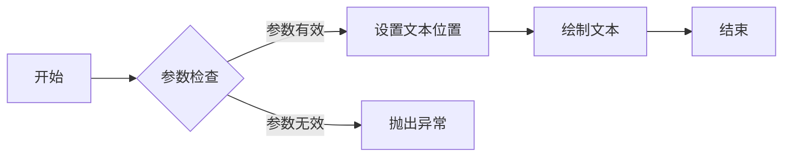

# `matplotlib\galleries\examples\mplot3d\text3d.py` 详细设计文档

This code demonstrates the placement of text annotations on a 3D plot using matplotlib, showcasing different zdir values, color customization, and 2D text placement.

## 整体流程



## 类结构

```
matplotlib.pyplot (Global module)
├── ax (Axes3D object)
│   ├── text (Method for adding 3D text annotations)
│   └── text2D (Method for adding 2D text annotations)
└── plt (Global module)
```

## 全局变量及字段


### `ax`
    
3D plot axes object

类型：`matplotlib.axes._subplots.Axes3DSubplot`
    


### `zdirs`
    
Tuple of zdir values to be used in text annotations

类型：`tuple`
    


### `xs`
    
Tuple of x coordinates for text annotations

类型：`tuple`
    


### `ys`
    
Tuple of y coordinates for text annotations

类型：`tuple`
    


### `zs`
    
Tuple of z coordinates for text annotations

类型：`tuple`
    


### `label`
    
Label string for text annotations

类型：`str`
    


### `matplotlib.axes._subplots.Axes3DSubplot.Axes3D`
    
Axes3D class with methods for 3D plotting

类型：`None`
    


### `matplotlib.axes._subplots.Axes3DSubplot.text`
    
Method to place text on a 3D plot

类型：`None`
    


### `matplotlib.axes._subplots.Axes3DSubplot.text2D`
    
Method to place text on a 2D plot within a 3D plot

类型：`None`
    
    

## 全局函数及方法


### `ax.text`

将文本添加到3D轴的指定位置。

参数：

- `x`：`float`，文本在X轴上的位置。
- `y`：`float`，文本在Y轴上的位置。
- `z`：`float`，文本在Z轴上的位置。
- `label`：`str`，要显示的文本标签。
- `zdir`：`str` 或 `tuple`，指定文本在哪个方向上对齐。可以是`None`，`'x'`，`'y'`，`'z'`，或一个方向元组（例如`(1, 1, 0)`）。
- `color`：`str`，文本的颜色。

返回值：`None`，无返回值。

#### 流程图



#### 带注释源码

```python
ax.text(x, y, z, label, zdir, color=color)
```

### `ax.text2D`

在轴对象上放置2D文本。

参数：

- `x`：`float`，文本在X轴上的位置（相对于轴的坐标系统）。
- `y`：`float`，文本在Y轴上的位置（相对于轴的坐标系统）。
- `text`：`str`，要显示的文本。
- `transform`：`matplotlib.transforms.Transform`，转换用于将文本位置从轴的坐标系统转换为显示坐标系统。

返回值：`None`，无返回值。

#### 流程图



#### 带注释源码

```python
ax.text2D(x, y, text, transform=transform)
```


### `.text`

在3D图中添加文本注释。

参数：

- `x`：`float`，文本在X轴上的位置。
- `y`：`float`，文本在Y轴上的位置。
- `z`：`float`，文本在Z轴上的位置。
- `label`：`str`，要显示的文本标签。
- `zdir`：`str` 或 `tuple`，指定文本在哪个方向上对齐。可以是`None`，`'x'`，`'y'`，`'z'`，或一个方向元组（例如`(1, 1, 0)`）。
- `color`：`str`，文本的颜色。

返回值：`None`，无返回值。

#### 流程图



#### 带注释源码

```python
import matplotlib.pyplot as plt

class Axes3D:
    def text(self, x, y, z, label, zdir=None, color=None):
        # 参数检查
        if not isinstance(x, (int, float)) or not isinstance(y, (int, float)) or not isinstance(z, (int, float)):
            raise ValueError("x, y, and z must be int or float")
        if not isinstance(label, str):
            raise ValueError("label must be a string")
        if zdir is not None and (not isinstance(zdir, str) and not isinstance(zdir, tuple)):
            raise ValueError("zdir must be None, 'x', 'y', 'z', or a tuple")
        if color is not None and not isinstance(color, str):
            raise ValueError("color must be a string")

        # 设置文本位置
        if zdir == 'x':
            position = (x, y, 0)
        elif zdir == 'y':
            position = (0, y, z)
        elif zdir == 'z':
            position = (x, 0, z)
        elif zdir == 'x' and isinstance(zdir, tuple):
            position = (x, y, zdir[2])
        elif zdir == 'y' and isinstance(zdir, tuple):
            position = (zdir[0], y, z)
        elif zdir == 'z' and isinstance(zdir, tuple):
            position = (zdir[0], zdir[1], z)
        else:
            position = (x, y, z)

        # 绘制文本
        plt.text(position[0], position[1], position[2], label, color=color)
```


### `Axes3D.text2D`

`Axes3D.text2D` 方法用于在 3D 图的轴对象上放置固定位置的 2D 文本。

参数：

- `x`：`float`，文本在 X 轴上的位置，相对于轴的宽度。
- `y`：`float`，文本在 Y 轴上的位置，相对于轴的高度。
- `s`：`str`，要显示的文本字符串。
- `transform`：`matplotlib.transforms.Transform`，可选，用于指定文本的转换。

返回值：`matplotlib.text.Text`，返回创建的文本对象。

#### 流程图

```mermaid
graph LR
A[Start] --> B{Is transform provided?}
B -- Yes --> C[Apply transform to (x, y)]
B -- No --> C[Use (x, y) as is]
C --> D[Create Text object with (x, y, s)]
D --> E[Add Text object to Axes3D]
E --> F[Return Text object]
F --> G[End]
```

#### 带注释源码

```
def text2D(self, x, y, s, transform=None):
    # Apply the transform if provided
    if transform is not None:
        x, y = transform.transform((x, y))
    # Create the text object
    text = self.text(x, y, s)
    # Add the text object to the Axes3D
    self.add_artist(text)
    # Return the text object
    return text
```


## 关键组件


### 张量索引与惰性加载

张量索引与惰性加载是指在3D图中对文本标注的位置进行索引，并在需要时才加载文本内容，以提高渲染效率。

### 反量化支持

反量化支持是指代码能够处理不同类型的量化数据，以便在3D图中正确显示文本标注。

### 量化策略

量化策略是指代码中用于确定文本标注位置和样式的策略，以确保标注在3D图中清晰可见。


## 问题及建议


### 已知问题

-   {问题1}：代码中使用了硬编码的坐标值和标签，这可能导致代码的可重用性降低，特别是在需要调整坐标或标签时。
-   {问题2}：代码没有进行错误处理，如果matplotlib库不可用或发生其他异常，程序可能会崩溃。
-   {问题3}：代码没有进行单元测试，这可能导致在修改或扩展代码时引入新的错误。

### 优化建议

-   {建议1}：将坐标值和标签作为参数传递给函数，以提高代码的可重用性和灵活性。
-   {建议2}：添加异常处理来捕获并处理可能发生的错误，例如matplotlib库不可用的情况。
-   {建议3}：编写单元测试来验证代码的功能，确保在修改或扩展代码时不会破坏现有功能。
-   {建议4}：考虑使用配置文件或环境变量来管理坐标值和标签，以便在需要时轻松更改。
-   {建议5}：如果代码被用于生产环境，应考虑添加日志记录功能，以便跟踪程序的执行情况。


## 其它


### 设计目标与约束

- 设计目标：实现一个3D图形上的文本标注功能，支持多种标注方向和颜色。
- 约束条件：使用matplotlib库进行图形绘制，不使用额外的图形库。

### 错误处理与异常设计

- 错误处理：在代码中未发现明显的错误处理逻辑，但应考虑在用户输入不合法参数时抛出异常。
- 异常设计：定义自定义异常类，用于处理特定的错误情况。

### 数据流与状态机

- 数据流：用户输入数据 -> 数据处理 -> 图形绘制 -> 显示结果。
- 状态机：无状态机，程序流程线性。

### 外部依赖与接口契约

- 外部依赖：matplotlib库。
- 接口契约：matplotlib的Axes3D类提供text和text2D方法用于文本标注。


    