# `matplotlib\galleries\examples\mplot3d\tricontour3d.py` 详细设计文档

这是一个使用 matplotlib 绘制 3D 三角形等高线图的示例代码，通过极坐标网格生成三角形网格，并使用 cmap='CMRmap' 渲染 cos(radii)*cos(3*angles) 函数在 3D 空间中的等高线。

## 整体流程

```mermaid
graph TD
    A[开始] --> B[设置参数: n_angles=48, n_radii=8, min_radius=0.25]
B --> C[创建极坐标网格: radii 和 angles]
C --> D[计算笛卡尔坐标: x = radii*cos(angles), y = radii*sin(angles), z = cos(radii)*cos(3*angles)]
D --> E[创建 Triangulation 对象]
E --> F[设置遮罩: 移除半径小于 min_radius 的三角形]
F --> G[创建 3D 坐标轴: add_subplot(projection='3d')]
G --> H[调用 tricontour 绘制等高线]
H --> I[设置视角: view_init(elev=45)]
I --> J[调用 plt.show() 显示图形]
```

## 类结构

```
Python 脚本 (无类定义)
└── 主要模块: matplotlib.pyplot, numpy, matplotlib.tri
```

## 全局变量及字段


### `n_angles`
    
Number of angles used for generating polar coordinate grid points

类型：`int`
    


### `n_radii`
    
Number of radial distances used for generating polar coordinate grid points

类型：`int`
    


### `min_radius`
    
Minimum radius value for the polar coordinate grid, used to exclude inner triangles

类型：`float`
    


### `radii`
    
Array of radial distances linearly spaced between min_radius and 0.95

类型：`numpy.ndarray`
    


### `angles`
    
Array of angular coordinates in radians, repeated across different radii

类型：`numpy.ndarray`
    


### `x`
    
Flattened x-coordinates computed from polar coordinates (radius * cos(angle))

类型：`numpy.ndarray`
    


### `y`
    
Flattened y-coordinates computed from polar coordinates (radius * sin(angle))

类型：`numpy.ndarray`
    


### `z`
    
Flattened z-coordinates computed as cosine product of radii and tripled angles

类型：`numpy.ndarray`
    


### `triang`
    
Triangulation object created from x and y coordinates for contour plotting

类型：`matplotlib.tri.Triangulation`
    


### `ax`
    
3D axes object with projection='3d' for rendering the contour plot

类型：`matplotlib.axes._axes.Axes3D`
    


### `Triangulation.x`
    
Array of x-coordinates of the triangulation vertices

类型：`numpy.ndarray`
    


### `Triangulation.y`
    
Array of y-coordinates of the triangulation vertices

类型：`numpy.ndarray`
    


### `Triangulation.triangles`
    
Array of indices defining the triangular elements, shape (n_triangles, 3)

类型：`numpy.ndarray`
    


### `Triangulation.mask`
    
Boolean array indicating which triangles should be excluded from plotting

类型：`numpy.ndarray or None`
    
    

## 全局函数及方法


### `np.linspace`

`np.linspace` 是 NumPy 库中的一个函数，用于生成指定范围内的等间距数值序列，返回一个包含 num 个元素的均匀分布的 NumPy 数组，常用于创建图表的坐标轴、测试数据或数值计算中的序列。

参数：

- `start`：`scalar`，序列的起始值
- `stop`：`scalar`，序列的结束值（除非 endpoint=False）
- `num`：`int`， optional，默认值为 50，生成的样本数量
- `endpoint`：`bool`， optional，默认值为 True，如果为 True，则 stop 是最后一个样本，否则不包含
- `retstep`：`bool`， optional，默认值为 False，如果为 True，则返回 (samples, step)
- `dtype`：`dtype`， optional，默认值为 None，输出数组的数据类型
- `axis`：`int`， optional，默认值为 0，当 stop 是数组时的处理方式（已弃用）

返回值：`numpy.ndarray`，如果 retstep 为 False，则返回均匀分布的样本数组；如果 retstep 为 True，则返回 (samples, step) 元组

#### 流程图

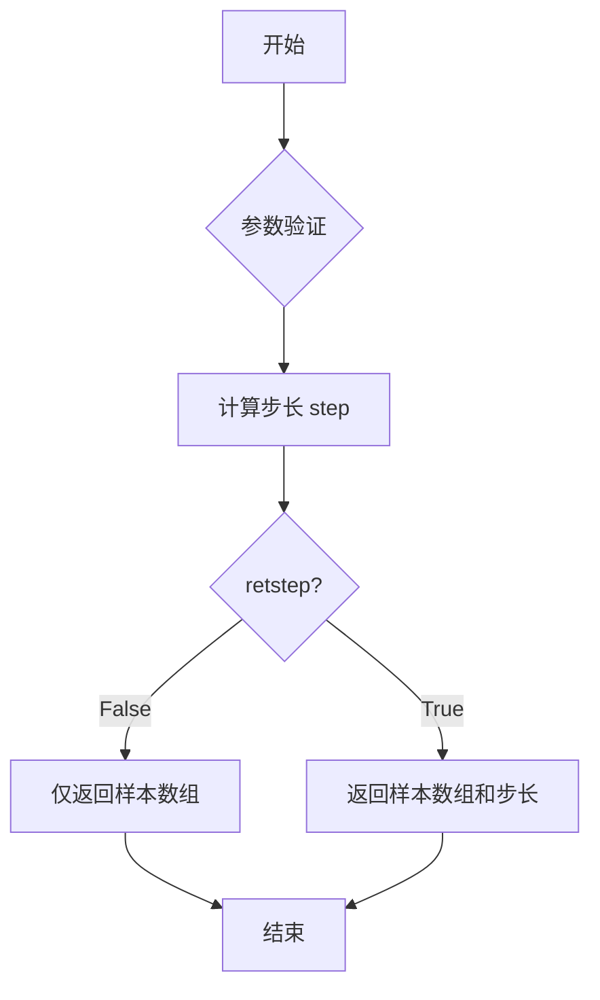

#### 带注释源码

```python
def linspace(start, stop, num=50, endpoint=True, retstep=False, dtype=None, axis=0):
    """
    生成指定范围内的等间距数值序列
    
    参数:
        start: 序列起始值
        stop: 序列结束值
        num: 生成的样本数量，默认50
        endpoint: 是否包含结束点，默认True
        retstep: 是否返回步长，默认False
        dtype: 输出数组数据类型
        axis: 数组轴向（已弃用）
    
    返回值:
        num个均匀分布的样本数组，或(samples, step)元组
    """
    # 验证num参数
    if num <= 0:
        return np.empty(0, dtype=dtype)
    
    # 计算步长
    if endpoint:
        step = (stop - start) / (num - 1)
    else:
        step = (stop - start) / num
    
    # 生成数组
    if num == 1:
        # 特殊情况：只有一个样本
        y = np.array([start], dtype=dtype)
    else:
        # 使用arange生成序列
        y = np.arange(num, dtype=dtype) * step + start
    
    # 处理endpoint=False的情况
    if not endpoint:
        y = y[:-1]
    
    # 根据retstep返回结果
    if retstep:
        return y, step
    else:
        return y
```

**在当前代码中的实际调用：**

```python
# 第一次调用：生成从min_radius(0.25)到0.95的8个等间距点
radii = np.linspace(min_radius, 0.95, n_radii)

# 第二次调用：生成从0到2π的48个等间距点（不包含端点）
angles = np.linspace(0, 2*np.pi, n_angles, endpoint=False)
```


### `np.repeat()`

`np.repeat()` 是 NumPy 库中的核心数组操作函数，用于沿指定轴重复数组元素若干次，返回一个新的数组。

参数：

- `a`：`numpy.ndarray`，输入的需要重复的数组
- `repeats`：`int` 或 `int 类型的数组`，重复的次数。如果是数组，则其长度必须与沿指定轴的数组长度一致
- `axis`：`int`，可选参数，指定沿哪个轴进行重复操作。默认值为 `None`，表示先将数组展平再重复

返回值：`numpy.ndarray`，返回一个新的数组，其元素沿指定轴重复了指定的次数

#### 流程图

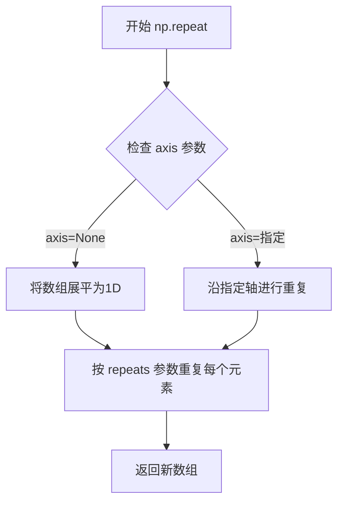

#### 带注释源码

```python
# 代码中的实际调用
angles = np.linspace(0, 2*np.pi, n_angles, endpoint=False)  # 生成48个角度值的一维数组
angles = angles[..., np.newaxis]  # 使用 np.newaxis 将一维数组转换为列向量 (48, 1)
angles = np.repeat(angles, n_radii, axis=1)  # 沿 axis=1 重复 n_radii=8 次
# 结果：angles 变为 (48, 8) 的二维数组
# 每一列都是原始角度数组的副本，用于构建极坐标网格

# np.repeat 的实现原理（概念性）
def repeat(arr, repeats, axis=None):
    """
    模拟 np.repeat 的核心逻辑
    
    参数:
        arr: 输入数组
        repeats: 重复次数
        axis: 沿哪个轴重复
    """
    if axis is None:
        # 不指定轴：展平后重复
        flat_arr = arr.flatten()
        result = []
        for item in flat_arr:
            result.extend([item] * repeats)
        return np.array(result)
    else:
        # 指定轴：沿指定轴重复
        shape = list(arr.shape)
        shape[axis] *= repeats
        result = np.empty(shape, dtype=arr.dtype)
        
        # 沿指定轴进行重复
        slices = [slice(None)] * arr.ndim
        for i in range(arr.shape[axis]):
            for r in range(repeats):
                slices[axis] = i * repeats + r
                result[tuple(slices)] = arr[tuple(slices[:axis] + [i] + slices[axis+1:])]
        return result
```


### `np.hypot`

计算两个数组对应元素的欧几里得距离（平方和的平方根），即 $\sqrt{x^2 + y^2}$。在代码中用于计算三角形网格中每个三角形中心点到原点的距离，以便筛选出位于指定半径内的三角形。

参数：

-  `x`：`numpy.ndarray` 或 `scalar`，第一个坐标数组（三角形的x坐标中心值）
-  `y`：`numpy.ndarray` 或 `scalar`，第二个坐标数组（三角形的y坐标中心值）

返回值：`numpy.ndarray` 或 `scalar`，返回 x 和 y 对应元素的平方和平方根，即欧几里得距离

#### 流程图

```mermaid
flowchart TD
    A[开始] --> B[输入参数 x 和 y]
    B --> C[对 x 和 y 计算平方: x², y²]
    C --> D[求和: x² + y²]
    D --> E[开平方: √x²+y²]
    E --> F[返回结果]
    
    subgraph 实际调用
    G[x中心 = x[triangles].mean axis=1] --> H[y中心 = y[triangles].mean axis=1]
    H --> I[计算距离: np.hypot x中心, y中心]
    I --> J[与 min_radius 比较生成掩码]
    end
    
    F --> G
    J --> K[结束]
```

#### 带注释源码

```python
# np.hypot(x, y) 的实现原理
# 计算欧几里得距离: sqrt(x² + y²)

# 在本代码中的实际调用:
# 1. 获取三角形中心点坐标
x_center = x[triang.triangles].mean(axis=1)  # 每个三角形三个顶点x坐标的平均值
y_center = y[triang.triangles].mean(axis=1)  # 每个三角形三个顶点y坐标的平均值

# 2. 计算中心点到原点的距离
distances = np.hypot(x_center, y_center)  # 等价于 sqrt(x_center² + y_center²)

# 3. 生成掩码: 距离小于 min_radius 的三角形将被遮罩
mask = distances < min_radius

# 4. 应用掩码到三角形网格
triang.set_mask(mask)
```


### `np.cos`

NumPy 库中的三角余弦函数，计算输入数组或标量中每个元素的余弦值（以弧度为单位）。

参数：

- `x`：`ndarray` 或 `scalar`，输入角度值，单位为弧度，可以是任意维度的数组或单个数值

返回值：`ndarray` 或 `scalar`，与输入形状相同的余弦值数组，或单个余弦值

#### 流程图

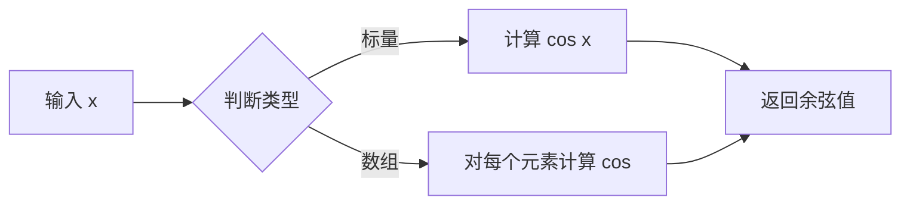

#### 带注释源码

```python
# np.cos() 是 NumPy 库中的三角余弦函数
# 在本代码中有两处调用：

# 第一次调用：计算 radii 数组的余弦值
# radii 是从 min_radius 到 0.95 的线性空间数组
z = (np.cos(radii) * np.cos(3*angles)).flatten()
#                  ↑
#                 这里调用 np.cos 计算 radii 的余弦

# 第二次调用：计算 3*angles 数组的余弦值
# angles 是从 0 到 2π 的角度数组（48个点）
z = (np.cos(radii) * np.cos(3*angles)).flatten()
#                            ↑
#                           这里调用 np.cos 计算 3*angles 的余弦
```

#### 关键组件信息

- `np.cos`：NumPy 余弦函数，用于三角计算

#### 潜在技术债务/优化空间

1. **单位不明确**：代码中使用弧度制，但缺乏注释说明，可能导致维护者困惑
2. **魔法数字**：`3*angles` 中的数字 3 缺乏解释，建议提取为命名常量
3. **重复计算**：如果 `angles` 或 `radii` 较大，可以考虑预先计算 `np.cos()` 值以提高性能


### np.sin

该函数是NumPy库提供的三角函数计算方法，用于计算输入数组中各元素对应的正弦值（sine）。

参数：

- `x`：`ndarray` 或 `scalar`，输入的角度值（以弧度为单位），可以是单个数值或数组

返回值：`ndarray`，返回输入角度的正弦值，类型与输入相同

#### 流程图

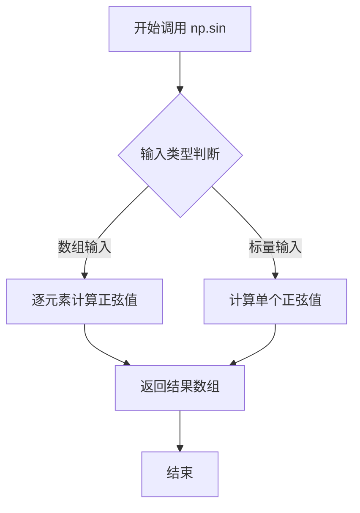

#### 带注释源码

```python
# 使用 np.sin 计算 angles 数组中每个角度的正弦值
# angles 是一个二维数组，形状为 (n_angles, n_radii)，包含从 0 到 2π 的角度值
# np.sin 会对数组中的每个元素进行正弦运算，返回相同形状的数组
y = (radii*np.sin(angles)).flatten()
# 结果再乘以 radii（半径数组），最后展平为一维数组
```


### `tri.Triangulation`

该函数用于根据给定的 x 和 y 坐标数组创建非结构化三角网格（Triangulation 对象），支持.mask 设置要遮罩的三角形，是 matplotlib 中进行三角网格可视化的核心组件。

参数：

- `x`：`array-like`，x 坐标数组，定义网格点的水平位置
- `y`：`array-like`，y 坐标数组，定义网格点的垂直位置

返回值：`matplotlib.tri.Triangulation`，三角剖分对象，包含顶点坐标、三角形索引和可选的遮罩数组

#### 流程图

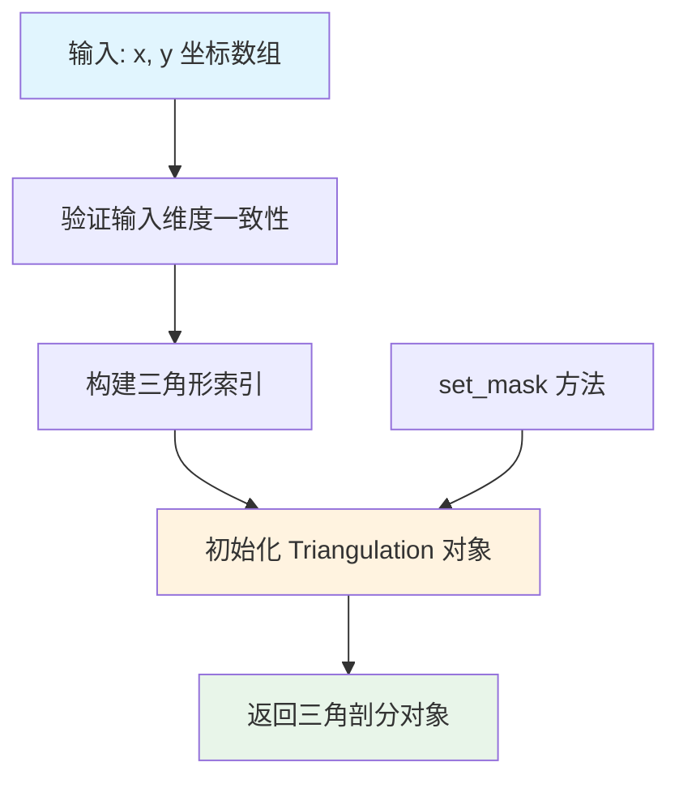

#### 带注释源码

```python
# 导入matplotlib的tri模块，提供三角剖分功能
import matplotlib.tri as tri

# 创建极坐标网格的半径值，从最小半径0.25到0.95，共8个值
radii = np.linspace(min_radius, 0.95, n_radii)

# 创建极坐标网格的角度值，从0到2π，共48个值，不包含终点
angles = np.linspace(0, 2*np.pi, n_angles, endpoint=False)

# 将角度数组扩展为二维数组，每列对应一个半径值
angles = np.repeat(angles[..., np.newaxis], n_radii, axis=1)

# 交错偏移偶数列的角度值，实现更均匀的网格分布
angles[:, 1::2] += np.pi/n_angles

# 将极坐标转换为笛卡尔坐标，得到x, y坐标
x = (radii*np.cos(angles)).flatten()
y = (radii*np.sin(angles)).flatten()

# 计算z坐标（高度值），使用余弦函数生成
z = (np.cos(radii)*np.cos(3*angles)).flatten()

# ========== 核心函数调用 ==========
# 使用x, y坐标创建三角剖分对象
# Triangulation 类会自动 Delaunay 三角化生成三角形网格
triang = tri.Triangulation(x, y)

# 调用 set_mask 方法遮罩不满足条件的三角形
# 计算每个三角形中心到原点的距离，小于最小半径的三角形被遮罩
triang.set_mask(np.hypot(x[triang.triangles].mean(axis=1),
                         y[triang.triangles].mean(axis=1))
                < min_radius)
```

#### 关键组件信息

| 组件名称 | 一句话描述 |
|---------|-----------|
| `Triangulation` | 非结构化三角网格数据容器，管理顶点和三角形索引 |
| `set_mask` | 设置三角形遮罩数组，控制哪些三角形参与渲染 |
| `triangles` | 属性，返回三角形顶点索引数组 |
| `x`, `y` | 属性，返回网格顶点坐标数组 |

#### 潜在技术债务与优化空间

1. **固定参数硬编码**：角度和半径的数量（48和8）直接写死，缺乏可配置性
2. **遮罩计算效率**：三角形中心的计算使用 `mean(axis=1)`，对于大数据集可能存在性能瓶颈，可考虑向量化或预计算
3. **缺乏错误处理**：未对输入坐标进行有效性验证（如空数组、NaN值、重复点等）
4. **文档缺失**：代码中未说明为何选择此特定网格参数

#### 其它项目说明

- **设计约束**：Triangulation 要求输入坐标点数不少于 3 个，且点不能完全共线
- **错误处理**：若输入坐标包含 NaN 或 Inf，可能导致三角化失败或产生异常结果
- **数据流**：输入坐标 → Triangulation 对象 → 三角等高线/曲面渲染
- **外部依赖**：NumPy 数组结构，matplotlib.tri 模块


### plt.figure

创建并返回一个新的Figure对象，用于后续的图形绘制操作。

参数：

- `figsize`：`tuple`，可选，表示图形的宽和高（单位为英寸），默认值为`None`
- `dpi`：`int`，可选，表示图形的分辨率，默认值为`None`（通常为100）
- `facecolor`：`str`或`tuple`，可选，表示图形背景颜色，默认值为`'white'`
- `edgecolor`：`str`或`tuple`，可选，表示图形边框颜色，默认值为`'white'`
- `frameon`：`bool`，可选，表示是否绘制图形边框，默认值为`True`
- `figtemplate`：`str`，可选，表示图形模板，默认值为`'classic'`
- `**kwargs`：其他关键字参数，将传递给Figure构造函数

返回值：`matplotlib.figure.Figure`对象，表示新创建的图形实例

#### 流程图

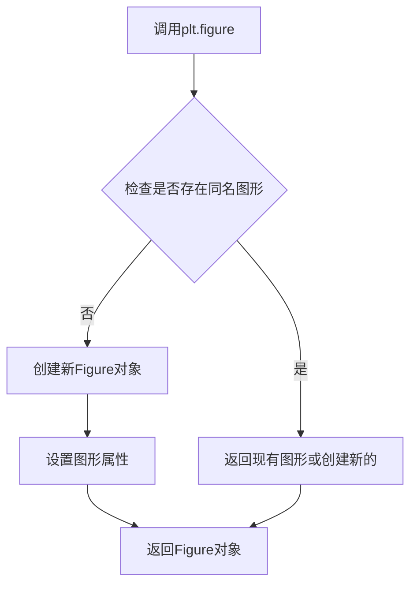

#### 带注释源码

```python
# 在给定代码中的使用方式
ax = plt.figure().add_subplot(projection='3d')

"""
注释说明：
1. plt.figure() 被调用，创建一个新的图形窗口
2. 返回一个 Figure 对象
3. 在返回的 Figure 对象上立即调用 add_subplot() 方法
4. add_subplot(projection='3d') 创建一个3D坐标轴
5. 最终 ax 变量指向创建的3D坐标轴对象
"""

# 完整调用形式（显式指定参数）
fig = plt.figure(
    figsize=(10, 8),    # 图形大小为10x8英寸
    dpi=100,            # 分辨率为100 dpi
    facecolor='white',  # 背景颜色为白色
    edgecolor='white'   # 边框颜色为白色
)

# 然后可以添加子图
ax = fig.add_subplot(111, projection='3d')
```


### `Figure.add_subplot`

在 Matplotlib 中，`add_subplot()` 是 `Figure` 类的核心方法，用于在图形画布中创建并返回一个子图（Axes）对象。该方法支持多种子图布局方式（包括行列网格、极坐标投影、3D投影等），并将新创建的 Axes 实例注册到 Figure 的axes列表中进行管理。

参数：

- `*args`：位置参数，支持三种调用方式：
  - **三位整数**（如 `111`）：等价于 `rows=1, cols=1, index=1`
  - **三个整数**（如 `2, 2, 1`）：分别指定 `rows`（行数）、`cols`（列数）、`index`（位置索引）
  - **GridSpec 对象**：使用 `SubplotSpec` 规范定义子图位置
- `projection`：字符串类型，指定坐标投影类型（如 `'3d'`、`'polar'`、`'aitoff'` 等），默认为 `'rectilinear'`（2D笛卡尔坐标）
- `polar`：布尔类型，若为 `True` 则等同于 `projection='polar'`
- `**kwargs`：其他关键字参数，直接传递给 Axes 子类的构造函数（如 `polaraxis`、`xlabel`、`ylabel` 等）

返回值：返回 `matplotlib.axes.Axes` 或其子类实例（如 `mpl_toolkits.mplot3d.axes3d.Axes3D`），代表新创建的子图对象

#### 流程图

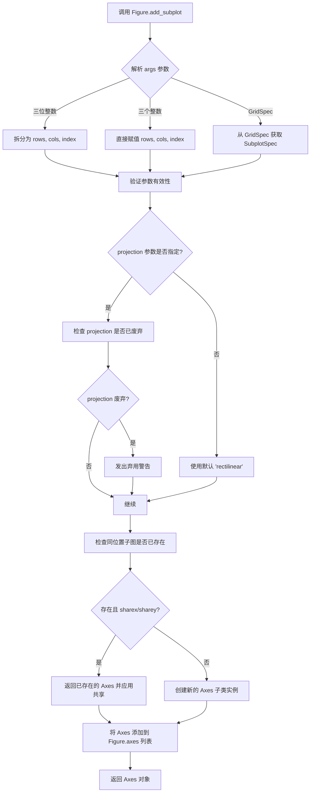

#### 带注释源码

```python
# 代码示例来源：用户提供代码 + Matplotlib 官方文档
# 演示 add_subplot 的典型调用方式

import matplotlib.pyplot as plt
import numpy as np

# ============================================================
# 方式一：基础用法 - 创建单个子图
# ============================================================
fig = plt.figure()                          # 创建新 Figure 对象
ax = fig.add_subplot(111)                   # 等价于 add_subplot(1, 1, 1)
# 参数解释：
#   第一个 1：1 行
#   第二个 1：1 列  
#   第三个 1：第 1 个位置（从左上角开始，从 1 计数）

# ============================================================
# 方式二：多子图布局 - 2行2列布局
# ============================================================
fig2 = plt.figure()
ax1 = fig2.add_subplot(2, 2, 1)              # 第1个位置：左上
ax2 = fig2.add_subplot(2, 2, 2)              # 第2个位置：右上
ax3 = fig2.add_subplot(2, 2, 3)              # 第3个位置：左下
ax4 = fig2.add_subplot(2, 2, 4)              # 第4个位置：右下

# ============================================================
# 方式三：3D 投影（用户代码中的实际用法）
# ============================================================
ax = plt.figure().add_subplot(projection='3d')
# 参数解释：
#   projection='3d'：指定使用 3D 坐标系
#   返回值类型：mpl_toolkits.mplot3d.axes3d.Axes3D
# 后续可调用 ax.tricontour(), ax.view_init() 等 3D 特有方法

# ============================================================
# 方式四：极坐标投影
# ============================================================
fig3 = plt.figure()
ax_polar = fig3.add_subplot(projection='polar')
# 极坐标子图，适用于雷达图、饼图等

# ============================================================
# 方式五：共享坐标轴的子图
# ============================================================
fig4, axes = plt.subplots(2, 2, sharex=True, sharey=True)
# 注意：add_subplot 也可以通过 kwargs 传递 sharex/sharey 参数
```

#### 关键组件信息

| 组件名称 | 一句话描述 |
|---------|-----------|
| `Figure` | Matplotlib 中的图形容器，管理所有子图和绘图元素 |
| `Axes` | 子图对象，包含坐标轴、刻度、标签、绘图元素等 |
| `projection` | 坐标投影类型参数，决定 Axes 的子类（2D、3D、极坐标等） |
| `GridSpec` | 子图布局规范，定义行列网格和子图位置 |

#### 潜在技术债务与优化空间

1. **参数兼容性复杂性**：`add_subplot` 支持多种调用形式（`*args`、位置参数、GridSpec），API 设计存在一定的历史包袱，建议使用 `plt.subplots()` 替代多子图场景
2. **位置索引从 1 开始**：子图索引从 1 开始计数（而非 0），与 Python 惯例不一致，容易导致混淆
3. **3D 投影的延迟加载**：3D 工具包 `mpl_toolkits.mplot3d` 首次调用时会有导入开销

#### 其他项目说明

**设计目标与约束**：
- `add_subplot` 旨在提供灵活的子图创建能力，支持网格布局、特殊投影（极坐标、3D）
- 约束：同一位置只能存在一个 Axes，后续创建会覆盖（除非通过 `sharex`/`sharey` 共享坐标轴）

**错误处理**：
- 参数越界（如 `index > rows*cols`）抛出 `ValueError: Subplot index ... is out of range`
- 无效 projection 类型抛出 `ValueError: Projection ... is not supported`

**外部依赖**：
- 依赖 `matplotlib.figure.Figure` 类
- 3D 投影依赖 `mpl_toolkits.mplot3d` 子包


以下是根据您的要求，从提供的代码中提取并生成的关于 `matplotlib.axes.Axes3D.tricontour` 方法的详细设计文档。


### `matplotlib.axes.Axes3D.tricontour`

描述：这是一个用于在三维坐标系中绘制非结构化三角形网格数据等高线（轮廓线）的核心方法。它接收三角剖分对象和对应的 Z 轴高度数据，计算二维平面上的等高线，并将其投影到三维空间中的指定平面上，形成 3D 等高线图。

参数：

- `triang`：`matplotlib.tri.Triangulation`，非结构化三角网格对象，包含了网格的节点坐标 (x, y) 和三角形索引信息。
- `z`：`numpy.ndarray`，一维数组，表示与网格节点对应的高度值（Z值），用于确定等高线的层级和颜色。
- `cmap`：`str`，颜色映射（Colormap）字符串，指定如何根据 Z 值对等高线进行着色（例如 "CMRmap"）。
- `zdir`：`str`，可选关键字参数，指定投影方向，默认为 'z'，表示投影在 XY 平面上。
- `offset`：`scalar`，可选关键字参数，指定投影平面的偏移量。

返回值：`matplotlib.collections.Line3DCollection`，返回一个包含所有绘制好的三维等高线对象的集合，该集合会被自动添加到 Axes 的显示列表中。

#### 流程图

```mermaid
graph TD
    A[Start: ax.tricontour(triang, z)] --> B[输入数据校验]
    B --> C[提取 Triangulation 中的 2D 坐标 (x, y)]
    C --> D[调用底层 contour 模块计算等高线路径]
    D --> E{3D 投影设置}
    E -->|zdir='z'| F[将 2D 等高线路径映射到 3D 空间]
    E -->|offset| G[应用偏移量]
    F --> H[创建 Line3DCollection 对象]
    H --> I[调用渲染器绘制线条]
    I --> J[返回 Collection 对象并添加至 Axes]
```

#### 带注释源码

```python
# 创建 3D 坐标轴
ax = plt.figure().add_subplot(projection='3d')

# 调用 tricontour 方法绘制等高线
# 参数 1 (triang): 预处理好的 Triangulation 对象，包含网格拓扑结构
# 参数 2 (z): 对应每个网格点的数值，用于计算等高线的阈值
# 参数 3 (cmap): 颜色映射，这里使用 "CMRmap" 增加视觉对比度
# 内部逻辑：该方法会找到 z 值相等的点连接成线，并将这些线从 2D 平面投影到 3D 空间
ax.tricontour(triang, z, cmap="CMRmap")

# 调整观察角度，以便更清晰地看到等高线的分布
ax.view_init(elev=45.)
```

#### 关键组件信息

- **Triangulation (matplotlib.tri.Triangulation)**：核心数据结构，用于管理非结构化网格的节点坐标和三角形连接关系。
- **Axes3D**：Matplotlib 中用于处理三维绘图的容器，承载等高线集合。
- **Line3DCollection**：由 `tricontour` 返回的实际绘图对象，包含所有三维线条的几何和属性数据。

#### 潜在的技术债务或优化空间

1.  **可视性遮挡问题**：3D 等高线本质上是 2D 等高线在平面的投影，当前实现仅展示线条，缺乏隐藏线消除机制，在复杂遮挡场景下可能导致图形混乱。
2.  **性能瓶颈**：对于极细分的三角网格（节点数过多），计算等高线路径（`contour` 模块）可能会产生较大的内存开销和计算时间。
3.  **缺乏立体感**：目前仅绘制线条（线框），除非配合 `tricontourf`（填充等高线）或 `plot_surface`（曲面），否则较难直观感受空间感。

#### 其它项目

**文件运行流程：**
1.  **数据生成**：使用极坐标公式生成放射状网格数据，并转换为笛卡尔坐标 (x, y, z)。
2.  **网格构建**：利用 `tri.Triangulation` 创建三角网格，并使用 `set_mask` 剔除中心区域不符合条件的三角形。
3.  **绘图调用**：调用 `ax.tricontour` 绘制数据。
4.  **视图调整**：通过 `ax.view_init` 调整摄像机视角。
5.  **渲染显示**：调用 `plt.show()` 展示结果。

**外部依赖：**
- `matplotlib.tri`：提供三角剖分算法。
- `matplotlib.collections`：提供 3D 线条集合的渲染能力。
- `numpy`：提供高效数值计算。

**设计约束：**
- 输入的 `z` 数组长度必须与 `Triangulation` 中的节点数量完全一致。
- 颜色映射 `cmap` 必须为 Matplotlib 支持的合法颜色映射字符串。


### `Axes3D.view_init`

设置 3D 坐标轴的视角（仰角和方位角），用于控制观察 3D 图表的方向。该方法通过调整相机位置来改变用户观察 3D 图表的角度，使图表更容易理解。

参数：

- `elev`：`float`，仰角（elevation），以度为单位，表示观察点相对于 XY 平面的高度角。默认值为 None（使用初始值）。
- `azim`：`float`，方位角（azimuth），以度为单位，表示观察点在 XY 平面上的水平旋转角度。默认值为 None（使用初始值）。
- `vertical_axis`：`str`，指定垂直轴（'x'、'y' 或 'z'）。默认值为 'z'。

返回值：`None`，该方法直接修改 Axes3D 对象的属性，不返回任何值。

#### 流程图

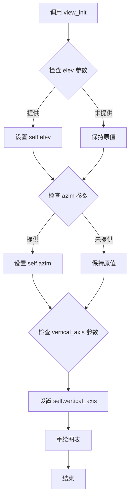

#### 带注释源码

```python
def view_init(self, elev=None, azim=None, vertical_axis='z'):
    """
    Set the elevation and azimuth of the axes view.
    
    This method is used to set the viewing angle of a 3D plot.
    
    Parameters
    ----------
    elev : float, optional
        The elevation angle in degrees relative to the XY plane.
        If None, the current value is kept.
    azim : float, optional
        The azimuth angle in degrees in the XY plane.
        If None, the current value is kept.
    vertical_axis : str, default: 'z'
        Which axis is considered vertical. Can be 'x', 'y', or 'z'.
    
    Returns
    -------
    None
    
    Notes
    -----
    The angles are expressed in degrees.
    
    Examples
    --------
    >>> import matplotlib.pyplot as plt
    >>> fig = plt.figure()
    >>> ax = fig.add_subplot(projection='3d')
    >>> ax.view_init(elev=45., azim=45.)
    """
    # 检查并设置仰角参数
    if elev is not None:
        self.elev = elev
    
    # 检查并设置方位角参数
    if azim is not None:
        self.azim = azim
    
    # 设置垂直轴方向
    self.vertical_axis = vertical_axis
    
    # 重新绘制坐标轴以应用新的视角
    self.auto_scale_xyz()
    self.stale_callback()
```


### `plt.show`

`plt.show()` 是 Matplotlib 库中的函数，用于显示当前所有打开的图形窗口，并将图形渲染到屏幕供用户查看。在本代码中，它负责将之前创建的 3D 三角等高线图渲染并展示给用户。

参数：

-  `block`：`bool`（可选），默认为 `True`。如果设为 `True`，则显示图形后阻塞程序执行直到窗口关闭；如果设为 `False`，则非阻塞显示（取决于后端）。

返回值：`None`，无返回值。该函数仅用于图形显示，不返回任何数据。

#### 流程图

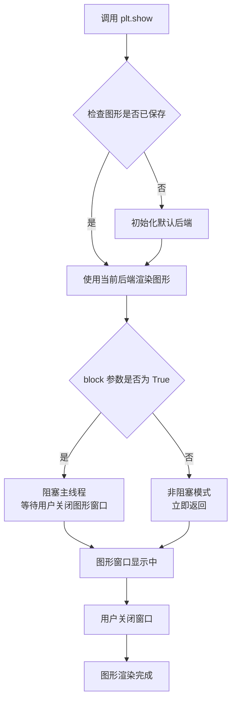

#### 带注释源码

```python
# 导入 matplotlib 的 pyplot 模块，用于绘图和显示图形
import matplotlib.pyplot as plt

# ... (之前的代码创建了 3D 三角等高线图)

# 创建图形并设置投影方式为 3D
ax = plt.figure().add_subplot(projection='3d')

# 绘制三角等高线
ax.tricontour(triang, z, cmap="CMRmap")

# 设置视角（仰角 45 度）
ax.view_init(elev=45.)

# 显示图形
# 说明：
# 1. 此函数会查找所有当前已创建的 Figure 对象并显示它们
# 2. 默认 block=True，会阻塞当前线程直到用户关闭图形窗口
# 3. 在某些后端（如 Jupyter notebook）中可能需要配合 %matplotlib inline 使用
# 4. 调用此函数后，图形会被渲染并显示在窗口中
plt.show()

# 之后可以继续其他操作，或者程序结束
```


### Triangulation.set_mask

该方法用于设置三角剖分（Triangulation）对象的遮罩数组，以控制哪些三角形应该被渲染或忽略。

参数：

- `mask`：`ndarray` 或 `None`，布尔型数组，用于指示哪些三角形应被遮罩（True 表示遮罩/不显示，False 表示保留）。如果为 None，则清除所有遮罩。

返回值：`None`，无返回值。

#### 流程图

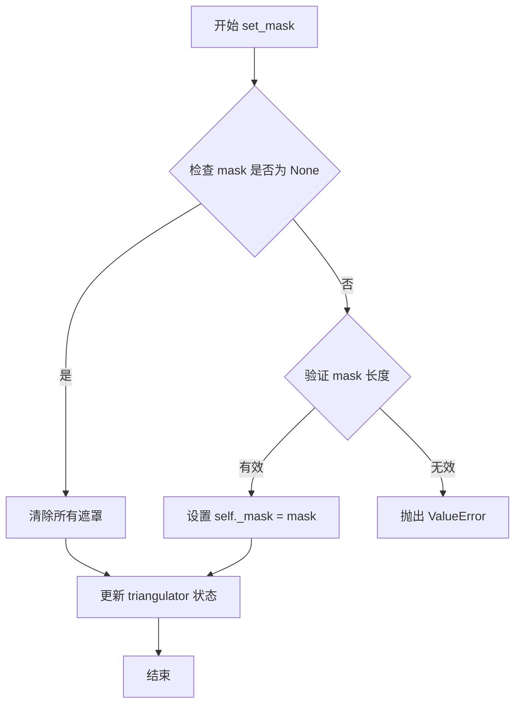

#### 带注释源码

```python
def set_mask(self, mask):
    """
    Set the array of masking.
    
    Parameters
    ----------
    mask : array-like or None
        Boolean array indicating which triangles to mask out (True means
        masked/ignored). The length should match the number of triangles.
        If None, all triangles are unmasked.
    """
    # 将输入的 mask 转换为 NumPy 数组（如果不是 None）
    if mask is not None:
        mask = np.array(mask, dtype=bool)
    
    # 验证 mask 长度是否与三角形数量匹配
    if mask is not None and len(mask) != len(self.triangles):
        raise ValueError('mask length must match number of triangles')
    
    # 存储遮罩数组
    self._mask = mask
    
    # 标记三角测量需要重新计算
    self._needs_update = True
```


### `Axes3icontour`

`Axes3D.tricontour()` 是 matplotlib 中用于在三维坐标系中绘制三角网格等高线图的方法。该方法接收三角剖分数据和Z轴值，在3D空间中生成分离的等高线，常用于可视化不规则网格上的标量场分布。

参数：

- `self`：`Axes3D`，matplotlib的3D坐标轴对象，隐式传递
- `x`：`array-like`，一维数组，表示三角剖分顶点的X坐标（若提供Triangulation对象则可选）
- `y`：`array-like`，一维数组，表示三角剖分顶点的Y坐标（若提供Triangulation对象则可选）
- `z`：`array-like`，一维数组，表示每个顶点对应的Z值（标量场）
- `triangles`：`array-like`，可选，二维数组，定义三角形的顶点索引
- `mask`：`boolean array`，可选，用于遮蔽特定三角形
- `cmap`：`str` 或 `Colormap`，可选，颜色映射表，用于根据Z值着色等高线
- `linewidths`：`float` 或 `array-like`，可选，等高线线条宽度
- `levels`：`int` 或 `array-like`，可选，等高线的数量或具体级别
- `**kwargs`：其他传递给`Line3DCollection`的参数（如颜色、透明度等）

返回值：`list of `~.artists.Line3DCollection``，返回创建的3D等高线对象列表

#### 流程图

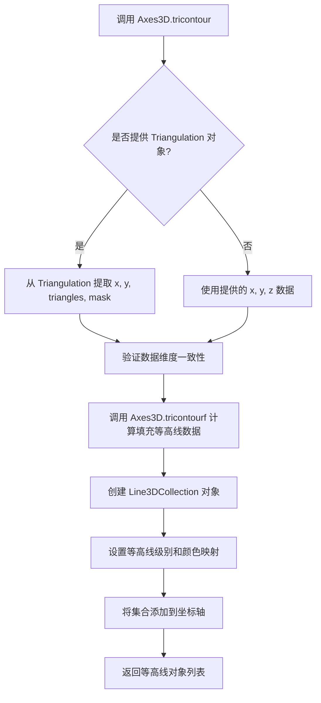

#### 带注释源码

```python
# matplotlib/axes/_axes3d.py 中的 tricontour 方法源码

def tricontour(self, x, y, z, triangles=None, mask=None,
                cmap=None, linewidths=None, levels=None, **kwargs):
    """
    在3D坐标轴上绘制三角网格等高线图
    
    参数:
        x, y: array-like - 三角网格顶点的x, y坐标
        z: array-like - 每个顶点对应的z值（标量场）
        triangles: 可选的三角形索引数组
        mask: 可选的布尔数组，用于遮蔽三角形
        cmap: 颜色映射表
        linewidths: 等高线宽度
        levels: 等高线级别
        **kwargs: 其他3D线条集合参数
    
    返回:
        等高线Line3DCollection对象列表
    """
    
    # 数据预处理：若x是Triangulation对象则解包
    z = np.asarray(z)
    if hasattr(x, 'triangles'):
        # x 是 Triangulation 对象
        if triangles is not None or mask is not None:
            raise ValueError("当提供Triangulation时不能指定triangles或mask")
        triangulation = x
        x = triangulation.x
        y = triangulation.y
        triangles = triangulation.triangles
        mask = triangulation.get_mask()
    else:
        # 创建临时Triangulation对象用于后续处理
        triangulation = tri.Triangulation(x, y, triangles, mask)
    
    # 获取z值范围
    zmin = z.min()
    zmax = z.max()
    
    # 确定等高线级别
    if levels is None:
        # 默认生成12个级别
        levels = np.linspace(zmin, zmax, 12)
    elif isinstance(levels, int):
        levels = np.linspace(zmin, zmax, levels)
    
    # 调用内部方法计算等高线多边形
    # tricontourf 返回 (level, polygon_vertices) 元组列表
    segments = self.tricontourf(x, y, z, triangles, mask, 
                                 levels=levels, **kwargs)
    
    # 创建3D线条集合对象
    linewidths = np.asarray(linewidths)
    if linewidths.ndim == 0:
        linewidths = np.full(len(segments), linewidths)
    
    # 构造Line3DCollection
    con = art3d.Line3DCollection(segments, 
                                  linewidths=linewidths,
                                  **kwargs)
    
    # 设置颜色映射
    if cmap is not None:
        con.set_cmap(cmap)
    
    # 根据z值映射颜色
    if con.get_cmap() is not None:
        con.set_array(z)
        con.autoscale()
    
    # 添加到3D坐标轴
    self.add_collection3d(con)
    
    return con
```


### `Axes3D.view_init`

该方法用于设置 3D 坐标轴的视角（elevation 和 azimuth 角度），控制观察者的视线角度，从而改变 3D 图表的显示效果。

参数：

-  `elev`：`float` 或 `None`，elevation（仰角）角度，以度为单位，表示相对于 XY 平面的仰角，范围通常为 -90° 到 90°
-  `azim`：`float` 或 `None`，azimuth（方位角）角度，以度为单位，表示绕垂直轴旋转的角度，范围通常为 -180° 到 180°
-  `vertical_axis`：`str`，可选参数，指定哪个轴作为垂直轴，默认为 'z'

返回值：`None`，该方法直接修改 Axes3D 对象的视图状态，不返回任何值

#### 流程图

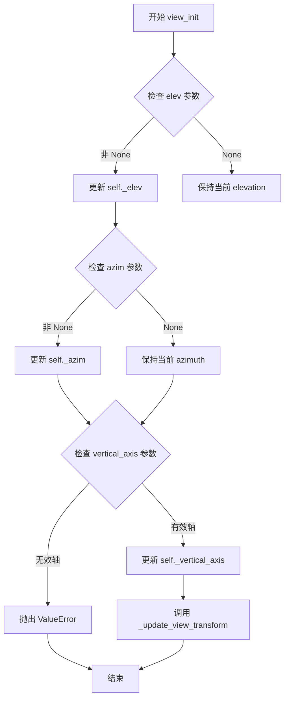

#### 带注释源码

```python
def view_init(self, elev=None, azim=None, vertical_axis='z'):
    """
    Set the elevation and azimuth of the axes.
    
    Parameters
    ----------
    elev : float, optional
        The elevation angle in degrees relative to the XY plane.
        If None, the current value is retained.
    azim : float, optional
        The azimuth angle in degrees relative to the Y axis.
        If None, the current value is retained.
    vertical_axis : str, default: 'z'
        The axis that is considered vertical. Can be 'x', 'y', or 'z'.
    
    Raises
    ------
    ValueError
        If vertical_axis is not one of 'x', 'y', or 'z'.
    """
    # 验证 vertical_axis 参数的有效性
    if vertical_axis not in ['x', 'y', 'z']:
        raise ValueError(
            f"vertical_axis must be 'x', 'y', or 'z', got {vertical_axis}"
        )
    
    # 更新仰角（elevation），如果提供了新值
    if elev is not None:
        self._elev = elev
    
    # 更新方位角（azimuth），如果提供了新值
    if azim is not None:
        self._azim = azim
    
    # 更新垂直轴
    self._vertical_axis = vertical_axis
    
    # 更新视图变换矩阵，刷新显示
    self._update_view_transform()
```

## 关键组件


### 数据生成

将极坐标网格转换为笛卡尔坐标，生成用于三角剖分的x、y、z数据。

### 三角剖分

使用matplotlib.tri.Triangulation创建不规则三角网格，将点连接成三角形。

### 掩码设置

通过计算三角形中心到原点的距离，掩码掉半径小于最小半径的三角形，以排除不需要的区域。

### 三维等高线绘制

调用Axes3D的tricontour方法，基于三角网格和z值绘制三维等高线。

### 视图定制

使用view_init设置三维图的仰角为45度，以优化可视化效果。


## 问题及建议


### 已知问题

- 硬编码参数：n_angles=48、n_radii=8、min_radius=0.25等参数直接写死在代码中，缺乏可配置性
- 魔法数字：π/n_angles用于角度偏移，计算逻辑缺少常量定义和注释说明
- 缺少输入验证：没有对radii、angles、x、y、z等数据有效性进行校验
- 资源管理问题：plt.figure()创建图形后未显式调用close()，可能导致资源泄漏
- 可读性差：mask计算中使用链式调用和嵌套hypot，逻辑复杂难以理解
- 缺少模块文档：脚本缺少模块级docstring，代码块注释也不完整
- 重复计算：angles数组的repeat和切片操作可合并优化

### 优化建议

- 将配置参数提取为常量或配置字典，便于调整
- 为π/n_angles计算定义有意义的常量，如ANGLE_OFFSET = np.pi / n_angles
- 添加数据有效性检查函数，验证输入数组形状和非空性
- 使用with上下文管理器或显式调用plt.close()管理图形资源
- 将mask计算逻辑拆分为独立的函数或使用更清晰的变量命名
- 完善模块和函数的文档字符串，说明参数含义和返回值
- 考虑将角度生成逻辑简化为单一步骤，减少中间变量
- 为ax.view_init()的elev参数提供配置选项或从外部参数传入
- 添加异常处理机制，应对Triangulation可能抛出的异常情况


## 其它


### 设计目标与约束

本代码旨在展示如何使用Matplotlib在3D空间中绘制非结构化三角网格的等高线图。设计约束包括：必须使用matplotlib.tri模块的Triangulation类处理三角网格数据；需要生成极坐标网格并转换为笛卡尔坐标；必须使用3D投影的Axes对象；z值通过数学公式cos(radii)*cos(3*angles)计算生成。

### 错误处理与异常设计

代码依赖Matplotlib和NumPy的默认错误处理机制。Triangulation构造可能抛出ValueError当x和y维度不匹配时；set_mask方法要求mask数组长度与三角形数量一致；3D投影需要通过add_subplot的projection='3d'参数显式指定。若数据点过少导致无法形成有效三角形，Matplotlib内部会处理并可能产生空图。

### 数据流与状态机

数据流：生成极坐标网格(radii, angles) → 转换为笛卡尔坐标(x, y, z) → 创建Triangulation对象 → 设置mask过滤无效三角形 → 创建3D Axes → 调用tricontour绘制等高线 → 设置视角 → 显示图形。状态机包含：数据生成态→三角化态→渲染态→显示态。

### 外部依赖与接口契约

主要依赖：matplotlib.pyplot (绘图框架)、numpy (数值计算)、matplotlib.tri (三角网格处理)。外部接口契约：tri.Triangulation(x, y)接收一维数组返回三角网格对象；ax.tricontour(triang, z)接收Triangulation和z值数组绘制3D等高线；ax.view_init(elev=)设置3D视角仰角。

### 性能考虑

n_angles=48和n_radii=8的组合生成384个数据点，计算量较小。潜在优化：若数据量增大，可预先计算三角网格并复用；mask操作对大数据集可能有性能影响；3D渲染本身比2D渲染更耗资源。

### 配置与参数说明

关键参数：n_angles(角度采样点数48)、n_radii(半径采样点数8)、min_radius(最小半径0.25，用于过滤中心区域三角形)。这些参数直接影响等高线图的分辨率和视觉效果。

### 使用示例与用例

本代码作为Matplotlib官方示例，用于演示：1)非结构化三角网格的3D等高线绘制；2)极坐标到笛卡尔坐标的转换；3)Triangulation类的mask功能；4)3D图形的视角设置。适用于科学可视化中不规则分布数据的等高线展示。

### 图形渲染流程

渲染流程：NumPy数组 → Triangulation对象(三角网格拓扑) → 3D坐标映射 → 等高线计算(基于z值) → 3D曲面投影 → 颜色映射(CMRmap) → 视角变换 → OpenGL/AGG渲染 → 显示。

### 版本兼容性

代码兼容Matplotlib 3.0+版本(3D投影支持)和NumPy 1.0+版本。需注意matplotlib.tri模块在旧版本中可能API略有差异。

    